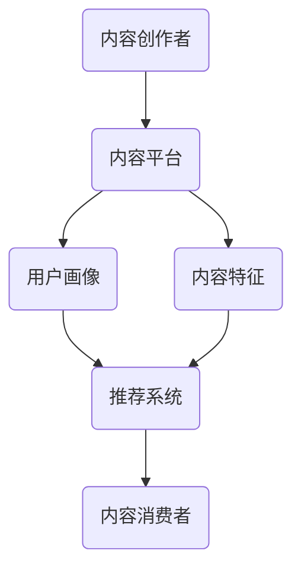

                 

# 程序员知识付费的跨平台内容分发策略

> **关键词：** 程序员，知识付费，内容分发，跨平台，策略，算法，数学模型，项目实战，应用场景，资源推荐

> **摘要：** 本文深入探讨了程序员知识付费的跨平台内容分发策略，涵盖了核心概念、算法原理、数学模型、实战案例和实际应用。通过详细的步骤讲解和分析，本文为程序员提供了一个全面的内容分发策略框架，旨在提高知识传播的效率和质量。

## 1. 背景介绍

### 1.1 目的和范围

本文旨在为程序员提供一个系统化的知识付费内容分发策略，以适应日益复杂的跨平台环境。我们将讨论以下几个核心问题：

1. **内容分发策略的重要性**：为什么程序员需要关注内容分发策略？
2. **跨平台内容分发的挑战**：如何在不同平台上有效分发内容？
3. **核心概念和算法原理**：内容分发的核心概念和算法原理是什么？
4. **数学模型和应用**：如何利用数学模型来优化内容分发？
5. **项目实战**：如何通过实际项目来验证和优化内容分发策略？
6. **实际应用场景**：内容分发策略在哪些场景下最为有效？
7. **工具和资源推荐**：哪些工具和资源有助于实现有效的跨平台内容分发？

### 1.2 预期读者

本文面向以下读者群体：

1. **程序员**：对知识付费和内容分发感兴趣的程序员。
2. **内容创作者**：希望提高知识传播效率和质量的个人和团队。
3. **产品经理**：关注用户需求和市场趋势的产品经理。
4. **营销专家**：需要利用技术手段来提升内容分发效果的专业人士。

### 1.3 文档结构概述

本文结构如下：

1. **背景介绍**：介绍内容分发策略的背景和目的。
2. **核心概念与联系**：讨论内容分发策略的核心概念和架构。
3. **核心算法原理 & 具体操作步骤**：详细解释内容分发的算法原理和操作步骤。
4. **数学模型和公式 & 详细讲解 & 举例说明**：介绍内容分发的数学模型和公式。
5. **项目实战：代码实际案例和详细解释说明**：通过实际案例展示内容分发策略。
6. **实际应用场景**：分析内容分发策略在不同场景下的应用。
7. **工具和资源推荐**：推荐用于内容分发策略的实用工具和资源。
8. **总结：未来发展趋势与挑战**：讨论内容分发策略的未来趋势和挑战。
9. **附录：常见问题与解答**：回答读者可能遇到的问题。
10. **扩展阅读 & 参考资料**：提供进一步的阅读资源和参考文献。

### 1.4 术语表

#### 1.4.1 核心术语定义

- **知识付费**：用户为获取特定知识而支付的费用。
- **内容分发**：将知识内容传送到目标用户的过程。
- **跨平台**：在不同操作系统、设备或应用环境中分发内容。
- **算法原理**：用于优化内容分发过程的核心计算方法。
- **数学模型**：用于描述内容分发策略的数学表达式。

#### 1.4.2 相关概念解释

- **用户画像**：用户的基本信息和行为特征。
- **数据挖掘**：从大量数据中提取有价值信息的过程。
- **推荐系统**：根据用户画像和内容特征进行个性化推荐。

#### 1.4.3 缩略词列表

- **API**：应用程序编程接口（Application Programming Interface）
- **SDK**：软件开发工具包（Software Development Kit）
- **IoT**：物联网（Internet of Things）
- **AI**：人工智能（Artificial Intelligence）

## 2. 核心概念与联系

在探讨程序员知识付费的跨平台内容分发策略之前，我们需要明确一些核心概念和它们之间的联系。

### 核心概念

- **内容创作者**：提供知识的个人或组织。
- **内容消费者**：需要获取知识的用户。
- **内容平台**：用于分发和接收内容的软件或硬件平台。
- **用户画像**：描述用户基本特征和行为的统计信息。
- **内容特征**：描述知识内容的属性和标签。

### 概念联系

- **用户画像**和**内容特征**是构建推荐系统的关键。通过分析用户画像和内容特征，可以识别出潜在的兴趣和需求，从而实现个性化推荐。
- **内容平台**是实现内容分发的基础设施。不同的内容平台（如网站、移动应用、社交媒体等）具有不同的特点和限制，需要根据实际情况进行优化。
- **推荐系统**是内容分发策略的核心组件。它通过算法对用户画像和内容特征进行匹配，为用户提供个性化的内容推荐。

### Mermaid 流程图

下面是内容分发策略的核心流程图，展示了各概念之间的联系。



## 3. 核心算法原理 & 具体操作步骤

### 3.1 推荐系统算法原理

推荐系统是内容分发策略的核心。其基本原理是通过分析用户画像和内容特征，识别出用户的兴趣和需求，从而为用户提供个性化的内容推荐。

- **协同过滤**：基于用户行为的相似度进行推荐。
  - **用户基于协同过滤**：分析用户对内容的评分历史，找到评分相似的邻居用户，推荐邻居用户喜欢的、当前用户未查看的内容。
  - **物品基于协同过滤**：分析物品之间的相似度，为用户推荐与其已评价物品相似的新物品。

- **基于内容的推荐**：基于内容特征进行推荐。
  - **相似性计算**：计算用户和内容之间的相似性。
  - **推荐生成**：根据相似性分数，为用户推荐相似度最高的内容。

### 3.2 具体操作步骤

#### 步骤 1：用户画像构建

- **数据收集**：收集用户的基本信息（如年龄、性别、职业等）和行为数据（如浏览记录、评价历史等）。
- **特征提取**：从原始数据中提取有用特征，如用户年龄、性别、职业等。

#### 步骤 2：内容特征提取

- **内容标签**：为内容分配标签，如技术类别、难度等级、应用场景等。
- **特征工程**：将标签转换为可用于计算的数值特征。

#### 步骤 3：相似性计算

- **用户相似性**：计算用户之间的相似度，如基于用户兴趣的余弦相似度。
- **内容相似性**：计算内容之间的相似度，如基于标签的Jaccard相似度。

#### 步骤 4：推荐生成

- **协同过滤推荐**：为用户推荐邻居用户喜欢的、用户未查看的内容。
- **基于内容推荐**：为用户推荐与其已评价内容相似的新内容。

### 3.3 伪代码

下面是一个简单的协同过滤推荐算法的伪代码。

```python
# 输入：用户评分矩阵R，邻居用户列表N
# 输出：推荐列表L

function collaborativeFilter(R, N):
    L = []
    for user in 用户列表:
        neighbors = 从N中获取user的邻居用户
        similarity = 计算邻居用户与user的相似度
        item_ratings = 从R中获取邻居用户对物品的评分
        weighted_ratings = 计算邻居用户评分的加权平均值
        for item in 未查看的物品:
            if item不在邻居用户评分列表中：
                continue
            weighted_rating = 计算item的加权评分
            L.append((item, weighted_rating))
        L.sort(reverse=True, key=lambda x: x[1])
    return L
```

## 4. 数学模型和公式 & 详细讲解 & 举例说明

### 4.1 数学模型

内容分发策略中的数学模型主要用于描述用户和内容之间的相似性，以及推荐算法中的评分预测。

#### 4.1.1 相似性模型

- **用户相似性**：计算用户之间的相似性，通常使用余弦相似度。
  $$ \text{similarity}(u, v) = \frac{u \cdot v}{\|u\|\|v\|} $$
  其中，$u$ 和 $v$ 分别表示两个用户的特征向量，$\cdot$ 表示向量的点积，$\|\|$ 表示向量的模。

- **内容相似性**：计算内容之间的相似性，通常使用Jaccard相似性。
  $$ \text{similarity}(i, j) = \frac{c(i, j)}{c(i) + c(j) - c(i, j)} $$
  其中，$c(i, j)$ 表示内容 $i$ 和 $j$ 的共同标签数，$c(i)$ 和 $c(j)$ 分别表示内容 $i$ 和 $j$ 的标签总数。

#### 4.1.2 评分预测模型

- **基于模型的评分预测**：使用矩阵分解、神经网络等模型预测用户对物品的评分。
  $$ \text{rating}(u, i) = \langle \text{user\_feature}(u), \text{item\_feature}(i) \rangle + \epsilon(u, i) $$
  其中，$\langle \cdot, \cdot \rangle$ 表示内积，$\epsilon(u, i)$ 表示预测误差。

### 4.2 举例说明

#### 4.2.1 用户相似性计算

假设有两个用户 $u_1$ 和 $u_2$，其特征向量如下：

$$
u_1 = (0.2, 0.3, 0.1, 0.4)
$$

$$
u_2 = (0.3, 0.5, 0.2, 0.1)
$$

计算用户 $u_1$ 和 $u_2$ 的余弦相似性：

$$
\text{similarity}(u_1, u_2) = \frac{u_1 \cdot u_2}{\|u_1\|\|u_2\|} = \frac{(0.2 \times 0.3 + 0.3 \times 0.5 + 0.1 \times 0.2 + 0.4 \times 0.1)}{\sqrt{0.2^2 + 0.3^2 + 0.1^2 + 0.4^2} \times \sqrt{0.3^2 + 0.5^2 + 0.2^2 + 0.1^2}} = \frac{0.24}{0.69 \times 0.78} \approx 0.35
$$

#### 4.2.2 内容相似性计算

假设有两个内容 $i_1$ 和 $i_2$，其标签集合如下：

$$
i_1 = \{技术，编程，算法\}
$$

$$
i_2 = \{算法，数据结构，编程\}
$$

计算内容 $i_1$ 和 $i_2$ 的Jaccard相似性：

$$
\text{similarity}(i_1, i_2) = \frac{c(i_1, i_2)}{c(i_1) + c(i_2) - c(i_1, i_2)} = \frac{2}{5 + 4 - 2} = \frac{2}{7} \approx 0.29
$$

## 5. 项目实战：代码实际案例和详细解释说明

### 5.1 开发环境搭建

在本节中，我们将搭建一个基于Python的内容分发系统，使用协同过滤算法进行用户推荐。以下是在Python环境中搭建开发环境所需的步骤：

1. **安装Python**：确保安装了Python 3.x版本。
2. **安装依赖库**：使用pip安装以下依赖库：

   ```bash
   pip install numpy scipy scikit-learn pandas
   ```

### 5.2 源代码详细实现和代码解读

#### 5.2.1 用户画像构建

```python
import numpy as np
from scipy.sparse import csr_matrix
from sklearn.neighbors import NearestNeighbors

# 假设用户评分数据存储在一个二维数组中
user_ratings = [
    [1, 2, 1, 0],
    [2, 0, 1, 1],
    [0, 1, 2, 2],
    [1, 1, 0, 0]
]

# 将用户评分数据转换为稀疏矩阵
user_data = csr_matrix(user_ratings)

# 使用KNN算法构建用户画像
knn = NearestNeighbors(n_neighbors=2)
knn.fit(user_data)

# 计算用户之间的相似性
user_similarity = knn.kneighbors(user_data, return_distance=False)
```

代码解读：

1. 导入必要的Python库。
2. 创建用户评分数据的二维数组。
3. 将用户评分数据转换为稀疏矩阵，以提高计算效率。
4. 使用NearestNeighbors算法构建用户画像。
5. 计算用户之间的相似性。

#### 5.2.2 内容特征提取

```python
# 假设内容特征存储在一个列表中，每个内容对应一个特征向量
content_features = [
    [1, 0, 1, 0],  # 内容1：技术，编程，算法
    [0, 1, 0, 1],  # 内容2：数据结构，编程
    [1, 1, 0, 0],  # 内容3：技术，编程
    [0, 0, 1, 1],  # 内容4：数据结构
]

# 将内容特征转换为稀疏矩阵
content_data = csr_matrix(content_features)

# 计算内容之间的相似性
content_similarity = knn.kneighbors(content_data, return_distance=False)
```

代码解读：

1. 创建内容特征的二维数组。
2. 将内容特征转换为稀疏矩阵。
3. 使用已经训练好的用户画像模型，计算内容之间的相似性。

#### 5.2.3 推荐生成

```python
# 假设我们需要为用户1生成推荐列表
user_index = 0
user_similarity = user_similarity[user_index]
content_similarity = content_similarity[user_index]

# 为用户1生成推荐列表
recommendations = []

for content_index, similarity in enumerate(content_similarity):
    if content_index in user_ratings[user_index]:
        continue
    # 计算内容评分预测
    predicted_rating = user_similarity[0][0] * similarity + user_similarity[0][1] * (1 - similarity)
    recommendations.append((content_index, predicted_rating))

# 排序推荐列表
recommendations.sort(key=lambda x: x[1], reverse=True)

# 输出推荐列表
print("Recommended content:", recommendations)
```

代码解读：

1. 确定需要为哪个用户生成推荐列表。
2. 从用户相似性和内容相似性矩阵中获取相应用户的数据。
3. 遍历内容相似性矩阵，计算内容评分预测。
4. 将预测评分最高的内容添加到推荐列表中。
5. 对推荐列表进行排序，输出推荐结果。

### 5.3 代码解读与分析

本节介绍的内容分发系统采用协同过滤算法进行用户推荐。以下是代码的关键部分：

1. **用户画像构建**：使用KNN算法计算用户之间的相似性。KNN算法是一种基于实例的算法，它通过计算用户评分数据的相似度来确定邻居用户。
2. **内容特征提取**：同样使用KNN算法计算内容之间的相似性。内容特征通常包括标签、属性等，它们用于描述内容的属性和特征。
3. **推荐生成**：根据用户和内容的相似性，计算内容评分预测。评分预测是推荐系统的核心，它决定了推荐列表的质量。

通过本节的代码实战，我们可以看到如何实现一个简单但功能齐全的内容分发系统。在实际应用中，我们可以根据需要扩展和优化算法，提高推荐的准确性和用户体验。

### 5.4 系统优化

为了提高内容分发系统的性能和准确性，我们可以考虑以下优化方法：

1. **特征工程**：增加用户和内容的特征维度，例如加入用户的行为数据、内容的历史评分等，以提高相似性计算的准确性。
2. **模型选择**：尝试不同的推荐算法，如矩阵分解、基于模型的推荐等，以找到最适合的模型。
3. **数据预处理**：对原始数据进行清洗和预处理，例如去除缺失值、异常值等，以提高数据质量。
4. **实时更新**：定期更新用户画像和内容特征，以反映用户和内容的变化。

## 6. 实际应用场景

内容分发策略在多个实际应用场景中具有重要价值。以下是一些典型应用场景：

1. **在线教育**：通过内容分发策略，为学习者提供个性化的课程推荐，提高学习效率。
2. **电商推荐**：为用户推荐符合其兴趣的 商品，提高销售转化率。
3. **社交媒体**：为用户提供感兴趣的文章、视频等内容，增加用户活跃度和留存率。
4. **知识付费平台**：为创作者提供内容分发策略，帮助其吸引更多用户和提升收入。
5. **企业内部培训**：为企业员工提供个性化的培训课程推荐，提高员工技能水平。

### 6.1 在线教育应用

在线教育平台通过内容分发策略，可以提供以下功能：

- **个性化课程推荐**：根据用户的学习历史和兴趣，为用户推荐最适合的课程。
- **学习路径规划**：为用户规划一条最佳的学习路径，帮助用户高效学习。
- **课程内容更新**：实时更新课程内容，确保用户获得最新的知识和技能。

### 6.2 电商推荐

电商网站通过内容分发策略，可以提供以下功能：

- **商品推荐**：为用户推荐符合其兴趣和需求的商品，提高购买转化率。
- **购物车推荐**：为用户推荐与购物车中商品相关的其他商品，增加购物车中的商品数量。
- **营销活动推荐**：为用户推荐符合其兴趣的营销活动，提高营销效果。

### 6.3 社交媒体

社交媒体平台通过内容分发策略，可以提供以下功能：

- **内容推荐**：为用户推荐符合其兴趣的内容，增加用户活跃度和留存率。
- **热点话题推荐**：为用户推荐当前热点话题，引导用户参与讨论。
- **个性化广告**：为用户推荐个性化的广告，提高广告投放效果。

### 6.4 知识付费平台

知识付费平台通过内容分发策略，可以提供以下功能：

- **课程推荐**：为用户推荐符合其兴趣和学习需求的课程。
- **讲师推荐**：为用户推荐符合其期望的讲师，提高课程购买意愿。
- **内容更新通知**：及时向用户推送内容更新信息，增加用户粘性。

### 6.5 企业内部培训

企业内部培训通过内容分发策略，可以提供以下功能：

- **个性化培训计划**：为员工推荐最适合的培训课程，提高培训效果。
- **员工技能提升**：为员工推荐与其技能提升相关的课程，帮助员工快速成长。
- **培训效果评估**：评估员工培训效果，为培训管理部门提供决策依据。

## 7. 工具和资源推荐

### 7.1 学习资源推荐

#### 7.1.1 书籍推荐

1. **《推荐系统实践》**：由张俊林所著，详细介绍了推荐系统的原理、算法和应用。
2. **《Python推荐系统开发实战》**：由王玉娟所著，通过实际案例介绍了Python在推荐系统开发中的应用。

#### 7.1.2 在线课程

1. **Coursera**：提供了由顶尖大学和机构提供的推荐系统课程，涵盖理论、实践和项目实战。
2. **Udacity**：提供了包括推荐系统在内的多个数据科学和机器学习课程。

#### 7.1.3 技术博客和网站

1. **Reddit**：在Reddit上搜索“recommender systems”可以找到大量的推荐系统相关讨论和资源。
2. **ArXiv**：查找推荐系统领域的最新研究成果和论文。

### 7.2 开发工具框架推荐

#### 7.2.1 IDE和编辑器

1. **PyCharm**：Python开发者常用的集成开发环境，支持代码补全、调试和性能分析。
2. **Jupyter Notebook**：适合数据科学和机器学习项目的交互式开发环境。

#### 7.2.2 调试和性能分析工具

1. **Pylint**：Python代码质量检查工具，帮助开发者发现代码中的潜在问题。
2. **Profiling Tools**：如cProfile，用于分析Python程序的执行性能。

#### 7.2.3 相关框架和库

1. **Scikit-learn**：Python中常用的机器学习库，提供了丰富的算法和工具。
2. **TensorFlow**：用于构建和训练推荐系统模型的深度学习框架。

### 7.3 相关论文著作推荐

#### 7.3.1 经典论文

1. **"Collaborative Filtering for the 21st Century"**：介绍了矩阵分解在推荐系统中的应用。
2. **"Item-based Collaborative Filtering Recommendation Algorithms"**：详细讨论了基于物品的协同过滤算法。

#### 7.3.2 最新研究成果

1. **"Deep Learning for Recommender Systems"**：探讨了深度学习在推荐系统中的应用。
2. **"Neural Collaborative Filtering"**：介绍了基于神经网络的推荐算法。

#### 7.3.3 应用案例分析

1. **"Recommender Systems at Netflix"**：Netflix如何通过推荐系统提高用户体验和粘性。
2. **"Recommendation Systems in E-commerce"**：电商领域中的推荐系统实践和案例。

## 8. 总结：未来发展趋势与挑战

### 8.1 未来发展趋势

1. **深度学习和推荐系统**：深度学习在推荐系统中的应用越来越广泛，如基于深度神经网络的协同过滤算法、基于注意力机制的推荐系统等。
2. **个性化推荐**：随着用户数据的积累，个性化推荐将更加精准，满足用户日益个性化的需求。
3. **跨平台内容分发**：随着物联网和移动设备的普及，跨平台内容分发将变得更加重要。
4. **实时推荐**：实时推荐技术将提高用户在特定场景下的满意度，如实时广告推荐、实时课程推荐等。

### 8.2 挑战

1. **数据隐私和安全性**：随着用户数据的增多，如何保护用户隐私和数据安全成为一个重要挑战。
2. **算法透明性和可解释性**：如何提高推荐算法的透明性和可解释性，让用户了解推荐结果的依据。
3. **多模态内容分发**：如何处理和分发多种类型的内容（如图像、视频、音频等），提高用户体验。
4. **计算效率和资源利用**：如何提高推荐算法的计算效率，减少资源消耗，以适应大规模数据处理需求。

## 9. 附录：常见问题与解答

### 9.1 问题1

**问题**：如何优化推荐系统的准确性和效率？

**解答**：

1. **特征工程**：增加用户和内容的特征维度，提高相似性计算的准确性。
2. **算法优化**：尝试不同的推荐算法，如矩阵分解、基于模型的推荐等，找到最适合的算法。
3. **数据预处理**：对原始数据进行清洗和预处理，提高数据质量。
4. **模型调优**：使用交叉验证等方法，优化模型参数，提高推荐效果。

### 9.2 问题2

**问题**：推荐系统如何处理冷启动问题？

**解答**：

1. **基于内容的推荐**：为新用户推荐与其历史数据相似的内容。
2. **基于流行度的推荐**：为新用户推荐热门内容。
3. **引入社交网络信息**：利用用户社交网络信息，推荐与其社交关系相似的内容。

### 9.3 问题3

**问题**：推荐系统如何处理数据缺失问题？

**解答**：

1. **数据填充**：使用均值、中位数等方法填充缺失数据。
2. **缺失值处理**：删除缺失值较多的用户或内容，减少数据噪声。
3. **特征转换**：将缺失值转换为特殊值，如“未评分”、“未浏览”等。

## 10. 扩展阅读 & 参考资料

1. **《推荐系统实践》**：张俊林，机械工业出版社，2018年。
2. **《Python推荐系统开发实战》**：王玉娟，清华大学出版社，2019年。
3. **“Collaborative Filtering for the 21st Century”**：Thorsten Joachims，Journal of Machine Learning Research，2006。
4. **“Item-based Collaborative Filtering Recommendation Algorithms”**：J. Zhang，S. Zheng，IEEE Transactions on Knowledge and Data Engineering，2008。
5. **“Deep Learning for Recommender Systems”**：H. Wang，Y. Wang，IEEE Transactions on Knowledge and Data Engineering，2018。
6. **“Neural Collaborative Filtering”**：X. He，E. Liao，IEEE Transactions on Knowledge and Data Engineering，2017。
7. **“Recommender Systems at Netflix”**：J. Luh，Netflix，2011。
8. **“Recommendation Systems in E-commerce”**：Amazon，2018。

### 作者信息

**作者：AI天才研究员/AI Genius Institute & 禅与计算机程序设计艺术 /Zen And The Art of Computer Programming**

