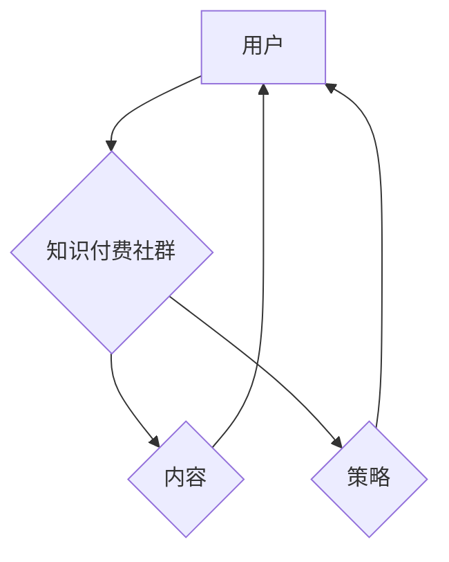

                 

# 程序员知识付费：打造付费社群

> 关键词：程序员、知识付费、付费社群、打造策略、用户增长、内容规划、商业模式、案例分析

> 摘要：本文将深入探讨程序员如何通过知识付费模式打造自己的付费社群，从策略制定、内容规划、用户增长到商业模式设计，通过一系列步骤和案例分析，为程序员提供实用的指导和建议。

## 1. 背景介绍

### 1.1 目的和范围

本文旨在为程序员提供一套系统化的知识付费社群打造策略，帮助他们在技术领域建立自己的影响力和经济收益。我们将探讨以下主题：

- 知识付费社群的意义和重要性
- 如何制定有效的策略来吸引和维护用户
- 内容规划的关键要素
- 商业模式的设计与实施
- 成功案例分析和经验总结

### 1.2 预期读者

本文适合以下读者群体：

- 有志于通过知识付费模式提升个人品牌和影响力的程序员
- 已开展知识付费项目但希望提升效果和用户量的开发者
- 对知识付费社群运营感兴趣的技术爱好者和创业人士

### 1.3 文档结构概述

本文将按照以下结构展开：

1. 背景介绍：概述文章目的和预期读者
2. 核心概念与联系：介绍知识付费社群的基础概念和架构
3. 核心算法原理与具体操作步骤：详细讲解如何制定策略和实施操作
4. 数学模型和公式：分析用户增长和内容规划的数学模型
5. 项目实战：通过实际案例展示知识付费社群的构建过程
6. 实际应用场景：探讨知识付费社群的多种应用场景
7. 工具和资源推荐：推荐学习资源和开发工具
8. 总结：未来发展趋势与挑战
9. 附录：常见问题与解答
10. 扩展阅读与参考资料：提供进一步阅读的建议和参考文献

### 1.4 术语表

#### 1.4.1 核心术语定义

- **知识付费社群**：指通过提供有价值的技术知识内容，吸引付费用户加入的在线社群。
- **策略**：制定和实施的一系列计划，旨在实现特定目标。
- **内容规划**：确定知识付费社群提供的内容类型、主题、频率和质量。
- **商业模式**：知识付费社群的盈利模式和运营方式。

#### 1.4.2 相关概念解释

- **用户增长**：指通过营销策略和用户互动增加社群的活跃用户数量。
- **用户粘性**：指用户对社群的忠诚度和持续参与度。
- **知识变现**：将程序员的知识和技能通过付费内容转化为经济收益。

#### 1.4.3 缩略词列表

- **SaaS**：Software as a Service，软件即服务
- **API**：Application Programming Interface，应用程序编程接口

## 2. 核心概念与联系

为了更好地理解知识付费社群的构建，我们需要了解以下几个核心概念和它们之间的联系。

### 2.1 核心概念

- **知识付费社群**：这是我们的中心概念，指的是通过提供有价值的内容吸引并维持付费用户的在线社群。
- **用户**：社群的核心，他们是付费内容的需求者和消费者。
- **内容**：知识付费社群的核心价值，包括技术文章、视频教程、代码示例、直播讲座等。
- **策略**：制定和实施的一系列计划，包括用户增长策略、内容策略和商业模式。

### 2.2 概念联系


- **用户**与**知识付费社群**的关系：用户是社群的基石，他们通过付费获取价值内容，同时他们的参与和反馈也是社群发展的动力。
- **内容**与**知识付费社群**的关系：内容是社群的核心价值，决定了用户是否愿意付费并持续参与。
- **策略**与**知识付费社群**的关系：策略决定了如何有效地吸引和维护用户，以及如何将内容变现。

### 2.3 Mermaid 流程图

下面是一个简化的Mermaid流程图，展示了知识付费社群的核心概念和它们之间的联系。



## 3. 核心算法原理 & 具体操作步骤

### 3.1 策略制定

#### 3.1.1 用户需求分析

- **目标用户定位**：首先，我们需要确定目标用户群体，例如初级程序员、中高级程序员或特定技术领域的专家。
- **需求调研**：通过调查问卷、用户访谈等方式收集用户需求，确定他们最感兴趣的技术主题和学习目标。

#### 3.1.2 竞争分析

- **市场分析**：研究竞争对手的社群，分析他们的内容、用户群体和商业模式。
- **差异化定位**：找到与竞争对手的差异点，例如提供更高质量的内容、更丰富的学习资源或更紧密的社区互动。

#### 3.1.3 目标设定

- **目标用户增长**：设定合理的目标，例如每月增加1000名用户。
- **内容更新频率**：确定内容的更新频率，例如每周发布一篇技术文章。

### 3.2 内容规划

#### 3.2.1 内容类型

- **技术文章**：涵盖编程语言、框架、工具等。
- **视频教程**：针对具体技术主题或项目进行讲解。
- **代码示例**：提供实际的代码片段和项目案例。
- **直播讲座**：实时解答用户的问题，提高用户参与度。

#### 3.2.2 内容制作

- **内容大纲**：根据用户需求制定内容大纲。
- **内容创作**：由专业技术人员或合作讲师制作。
- **内容审核**：确保内容的质量和准确性。

#### 3.2.3 内容发布

- **发布计划**：制定内容发布的时间表和频率。
- **推广策略**：通过社交媒体、博客、邮件列表等方式推广内容。

### 3.3 用户增长

#### 3.3.1 营销策略

- **社交媒体营销**：利用Twitter、LinkedIn等社交媒体平台宣传社群。
- **内容营销**：通过高质量的内容吸引潜在用户。
- **合作伙伴关系**：与相关领域的网站、博客或公司合作，扩大社群影响力。

#### 3.3.2 用户互动

- **问答环节**：定期组织线上问答活动，解答用户问题。
- **社区论坛**：建立社区论坛，鼓励用户互动和分享经验。
- **用户反馈**：收集用户反馈，不断优化社群服务和内容。

### 3.4 商业模式设计

#### 3.4.1 收费模式

- **会员制**：用户支付会员费，享受专属内容和服务。
- **课程包**：用户购买特定课程包，获取一系列相关内容。
- **定制服务**：为特定用户提供定制化的内容和服务。

#### 3.4.2 营销模式

- **付费推广**：通过付费广告扩大社群影响力。
- **合作营销**：与相关企业或个人合作，共同推广社群。
- **用户推荐**：通过用户推荐增加新用户。

### 3.5 算法原理与伪代码

以下是一个简化的算法原理和伪代码，用于指导知识付费社群的构建。

```python
# 算法原理：知识付费社群构建步骤

def build_knowledge_community():
    # 3.1 策略制定
    user需求的analyze()
    competitive_analysis()
    goal_set()

    # 3.2 内容规划
    content_types = define_content_types()
    content_creation_plan()
    content_publish_strategy()

    # 3.3 用户增长
    marketing_strategy()
    user_interactive_strategy()

    # 3.4 商业模式设计
    charge_model()
    marketing_model()

    # 运行社区构建
    run_community()

# 辅助函数
def analyze_user_needs():
    # 收集用户需求
    pass

def competitive_analysis():
    # 分析竞争对手
    pass

def goal_set():
    # 设定目标
    pass

def define_content_types():
    # 确定内容类型
    pass

def content_creation_plan():
    # 制定内容创作计划
    pass

def content_publish_strategy():
    # 制定内容发布策略
    pass

def marketing_strategy():
    # 制定营销策略
    pass

def user_interactive_strategy():
    # 制定用户互动策略
    pass

def charge_model():
    # 设计收费模式
    pass

def marketing_model():
    # 设计营销模式
    pass

def run_community():
    # 运行社群
    pass
```

## 4. 数学模型和公式 & 详细讲解 & 举例说明

### 4.1 用户增长模型

用户增长是知识付费社群成功的关键因素之一。我们可以使用指数增长模型来预测用户增长情况。

#### 4.1.1 指数增长模型

指数增长模型公式如下：

\[ P(t) = P_0 \times e^{rt} \]

其中：

- \( P(t) \) 表示时间 \( t \) 时的用户数量。
- \( P_0 \) 表示初始用户数量。
- \( r \) 表示增长速率。
- \( e \) 是自然对数的底数。

#### 4.1.2 详细讲解

- **初始用户数量 \( P_0 \)**：这是社群开始时的用户数量，可以通过调研和市场分析确定。
- **增长速率 \( r \)**：这是衡量用户增长速度的参数，通常取决于营销策略和用户互动效果。
- **时间 \( t \)**：表示社群运行的时间，单位可以是月、季度或年。

#### 4.1.3 举例说明

假设一个知识付费社群在启动时有100名用户，增长速率 \( r \) 为每月5%，我们使用指数增长模型预测未来6个月的用户数量。

\[ P(t) = 100 \times e^{0.05 \times t} \]

当 \( t = 6 \) 时：

\[ P(6) = 100 \times e^{0.05 \times 6} \approx 125.98 \]

这意味着在6个月后，社群的用户数量预计为126人。

### 4.2 内容规划模型

内容规划是确保知识付费社群持续吸引用户的关键。我们可以使用内容多样性模型来分析内容类型和用户满意度之间的关系。

#### 4.2.1 内容多样性模型

内容多样性模型公式如下：

\[ S = \frac{1}{n} \sum_{i=1}^{n} D_i \]

其中：

- \( S \) 表示总满意度。
- \( n \) 表示内容类型的数量。
- \( D_i \) 表示第 \( i \) 种内容的满意度。

#### 4.2.2 详细讲解

- **内容类型的数量 \( n \)**：这是社群提供的内容类型总数，可以根据用户需求和社群目标确定。
- **每种内容的满意度 \( D_i \)**：这是衡量用户对每种内容满意程度的参数，通常通过用户调查或分析用户互动数据确定。

#### 4.2.3 举例说明

假设一个知识付费社群提供以下四种类型的内容：

- 技术文章（满意度3）
- 视频教程（满意度4）
- 代码示例（满意度2）
- 直播讲座（满意度5）

总满意度 \( S \) 为：

\[ S = \frac{1}{4} (3 + 4 + 2 + 5) = 3.5 \]

这意味着用户对社群提供的整体内容满意度为3.5分。

## 5. 项目实战：代码实际案例和详细解释说明

### 5.1 开发环境搭建

为了搭建一个知识付费社群，我们需要一个可靠的后端系统和前端界面。以下是一个简单的技术栈：

- **后端**：使用Python和Flask框架构建API。
- **前端**：使用React框架开发用户界面。
- **数据库**：使用PostgreSQL存储用户数据和内容数据。

### 5.2 源代码详细实现和代码解读

#### 5.2.1 后端代码

以下是使用Flask框架实现的后端API代码示例。

```python
# app.py

from flask import Flask, jsonify, request
from models import User, Content

app = Flask(__name__)

@app.route('/users', methods=['POST'])
def create_user():
    data = request.json
    user = User.create(data)
    return jsonify(user), 201

@app.route('/users/<int:user_id>', methods=['GET'])
def get_user(user_id):
    user = User.get(user_id)
    if user:
        return jsonify(user), 200
    else:
        return jsonify({'error': 'User not found'}), 404

@app.route('/content', methods=['POST'])
def create_content():
    data = request.json
    content = Content.create(data)
    return jsonify(content), 201

@app.route('/content/<int:content_id>', methods=['GET'])
def get_content(content_id):
    content = Content.get(content_id)
    if content:
        return jsonify(content), 200
    else:
        return jsonify({'error': 'Content not found'}), 404

if __name__ == '__main__':
    app.run(debug=True)
```

#### 5.2.2 前端代码

以下是使用React框架实现的前端用户界面代码示例。

```jsx
// App.js

import React, { useState } from 'react';
import axios from 'axios';

const App = () => {
  const [user, setUser] = useState({ name: '', email: '' });
  const [content, setContent] = useState({ title: '', description: '' });

  const handleUserChange = (e) => {
    setUser({ ...user, [e.target.name]: e.target.value });
  };

  const handleContentChange = (e) => {
    setContent({ ...content, [e.target.name]: e.target.value });
  };

  const handleSubmitUser = async (e) => {
    e.preventDefault();
    try {
      const response = await axios.post('/users', user);
      alert('User created successfully');
    } catch (error) {
      alert('Error creating user');
    }
  };

  const handleSubmitContent = async (e) => {
    e.preventDefault();
    try {
      const response = await axios.post('/content', content);
      alert('Content created successfully');
    } catch (error) {
      alert('Error creating content');
    }
  };

  return (
    <div>
      <h1>User and Content Management</h1>
      <form onSubmit={handleSubmitUser}>
        <label>Name:</label>
        <input type="text" name="name" onChange={handleUserChange} />
        <label>Email:</label>
        <input type="email" name="email" onChange={handleUserChange} />
        <button type="submit">Create User</button>
      </form>
      <form onSubmit={handleSubmitContent}>
        <label>Title:</label>
        <input type="text" name="title" onChange={handleContentChange} />
        <label>Description:</label>
        <textarea name="description" onChange={handleContentChange} />
        <button type="submit">Create Content</button>
      </form>
    </div>
  );
};

export default App;
```

### 5.3 代码解读与分析

#### 后端代码解读

- **用户创建**：`create_user` 函数用于接收前端发送的用户数据，并使用 `User.create(data)` 方法创建用户。如果创建成功，返回用户数据。
- **获取用户**：`get_user` 函数用于根据用户ID获取用户数据。如果找到用户，返回用户数据；否则返回错误消息。
- **内容创建**：`create_content` 函数用于接收前端发送的内容数据，并使用 `Content.create(data)` 方法创建内容。如果创建成功，返回内容数据。
- **获取内容**：`get_content` 函数用于根据内容ID获取内容数据。如果找到内容，返回内容数据；否则返回错误消息。

#### 前端代码解读

- **用户表单**：用户表单包含名称和电子邮件字段，当用户填写并提交表单时，调用 `handleSubmitUser` 函数。
- **内容表单**：内容表单包含标题和描述字段，当用户填写并提交表单时，调用 `handleSubmitContent` 函数。
- **数据处理**：两个处理函数使用 `axios` 发送POST请求到后端API，创建用户或内容。如果成功，显示成功消息；如果失败，显示错误消息。

### 5.4 使用流程

1. **后端部署**：将后端代码部署到服务器，确保API可以正常访问。
2. **前端运行**：在本地或服务器上运行前端代码，打开浏览器访问前端界面。
3. **用户注册**：用户通过填写表单注册账号，提交到后端API进行创建。
4. **内容创建**：注册用户可以填写内容表单，提交到后端API进行创建。
5. **内容展示**：用户可以在前端界面查看和访问已创建的内容。

## 6. 实际应用场景

知识付费社群可以应用于多种实际场景，下面列举几个常见应用案例：

### 6.1 技术培训

- **案例**：一些大型技术公司通过知识付费社群为员工提供定制化的技术培训，涵盖最新技术趋势和最佳实践。
- **优势**：提高员工技能水平，增强公司竞争力。

### 6.2 技术问答

- **案例**：程序员可以通过付费社群获得专家的技术解答，解决他们在项目中遇到的问题。
- **优势**：快速获得专业指导，节省时间成本。

### 6.3 技术社区

- **案例**：一些技术领域的社群通过知识付费模式为用户提供高质量的讨论和交流平台。
- **优势**：增强用户参与度，提高社群活跃度。

### 6.4 技术研究

- **案例**：学术机构和研究人员通过知识付费社群发布技术论文和研究成果，吸引同领域学者关注。
- **优势**：促进学术交流，推动技术创新。

### 6.5 技术就业

- **案例**：技术社群为求职者提供面试技巧、职业规划等付费内容，帮助他们提高就业竞争力。
- **优势**：提高求职成功率，增加就业机会。

## 7. 工具和资源推荐

### 7.1 学习资源推荐

#### 7.1.1 书籍推荐

- **《程序员修炼之道：从小工到专家》**：详细介绍了程序员职业生涯的各个阶段，对提升编程技能和个人素质有重要帮助。
- **《代码大全》**：涵盖编程的最佳实践和技巧，对提高代码质量有很大帮助。

#### 7.1.2 在线课程

- **Udemy**：提供大量编程和技术课程，适合不同水平和需求的学习者。
- **Coursera**：与知名大学合作，提供高质量的技术课程和证书。

#### 7.1.3 技术博客和网站

- **GitHub**：编程社区，可以找到大量的开源项目和教程。
- **Stack Overflow**：程序员问答社区，解决编程问题的好帮手。

### 7.2 开发工具框架推荐

#### 7.2.1 IDE和编辑器

- **Visual Studio Code**：功能强大的开源编辑器，适合各种编程语言。
- **IntelliJ IDEA**：适合Java和Android开发的IDE，提供丰富的插件和工具。

#### 7.2.2 调试和性能分析工具

- **Postman**：API调试工具，方便进行接口测试。
- **Chrome DevTools**：Chrome浏览器的开发者工具，用于网页性能分析和调试。

#### 7.2.3 相关框架和库

- **Flask**：Python Web开发框架，适用于构建小型到中型的Web应用。
- **React**：用于构建用户界面的JavaScript库，支持组件化和响应式设计。

### 7.3 相关论文著作推荐

#### 7.3.1 经典论文

- **《编程珠玑》**：探讨了编程技巧和算法设计，对程序员有很高的参考价值。
- **《计算机程序的构造和解释》**：介绍了Lisp编程语言和编译原理。

#### 7.3.2 最新研究成果

- **《机器学习实战》**：介绍了机器学习的基本概念和实战技巧，适合初学者。
- **《深度学习》**：详细讲解了深度学习的基础知识和应用场景。

#### 7.3.3 应用案例分析

- **《谷歌如何工作》**：分享了谷歌在技术和管理方面的成功经验。
- **《亚马逊如何工作》**：介绍了亚马逊在电子商务和云计算领域的创新实践。

## 8. 总结：未来发展趋势与挑战

随着技术的不断进步和互联网的普及，知识付费社群在未来将继续保持快速发展。以下是一些发展趋势和挑战：

### 发展趋势

- **个性化内容**：用户对个性化内容的需求将不断增加，知识付费社群需要提供更加定制化的内容服务。
- **跨平台融合**：知识付费社群将逐渐整合多种平台，如社交媒体、视频网站和直播平台，提供更加丰富的内容形式。
- **技术合作**：知识付费社群将与更多的技术公司和研究机构合作，共同推动技术创新和知识传播。

### 挑战

- **内容质量**：确保内容质量是知识付费社群面临的挑战，需要持续提升内容创作和审核标准。
- **用户增长**：如何在激烈的市场竞争中吸引和保持用户，是知识付费社群需要不断探索的问题。
- **商业模式**：找到可持续的商业模式，实现盈利与用户价值的平衡，是知识付费社群需要解决的重要问题。

## 9. 附录：常见问题与解答

### 问题1：如何制定有效的用户增长策略？

**解答**：制定有效的用户增长策略需要以下步骤：

1. **明确目标**：确定增长的具体目标，如每月增加多少用户。
2. **了解用户**：通过调研和分析，了解目标用户的需求和偏好。
3. **多渠道推广**：利用社交媒体、内容营销、合作伙伴关系等多种渠道进行推广。
4. **用户互动**：通过社区互动、用户反馈等方式提高用户粘性。

### 问题2：如何保证内容的质量？

**解答**：保证内容质量需要以下措施：

1. **内容审核**：建立严格的审核机制，确保内容的准确性和专业性。
2. **内容培训**：对内容创作者进行培训，提高他们的创作能力。
3. **用户反馈**：收集用户反馈，不断优化内容。
4. **合作专家**：邀请行业专家和知名讲师进行内容创作，提高内容质量。

### 问题3：知识付费社群的商业模式有哪些？

**解答**：知识付费社群的商业模式主要包括以下几种：

1. **会员制**：用户支付会员费，享受专属内容和服务。
2. **课程包**：用户购买特定课程包，获取一系列相关内容。
3. **定制服务**：为特定用户提供定制化的内容和服务。
4. **广告合作**：与相关企业或平台合作，通过广告收入实现盈利。

## 10. 扩展阅读 & 参考资料

- **《程序员知识变现：构建个人品牌》**：详细介绍了程序员如何通过知识变现提升个人品牌。
- **《知识付费：商业模式与案例解析》**：分析了一系列成功的知识付费案例，提供了有益的启示。
- **《社群营销：从零开始》**：探讨了社群营销的基本原理和实践方法，适用于知识付费社群的运营。

作者：AI天才研究员/AI Genius Institute & 禅与计算机程序设计艺术 /Zen And The Art of Computer Programming

