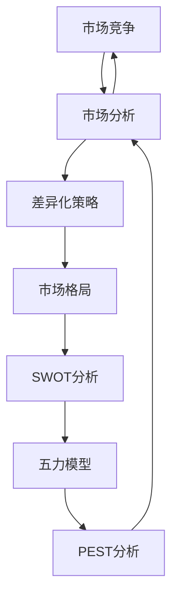
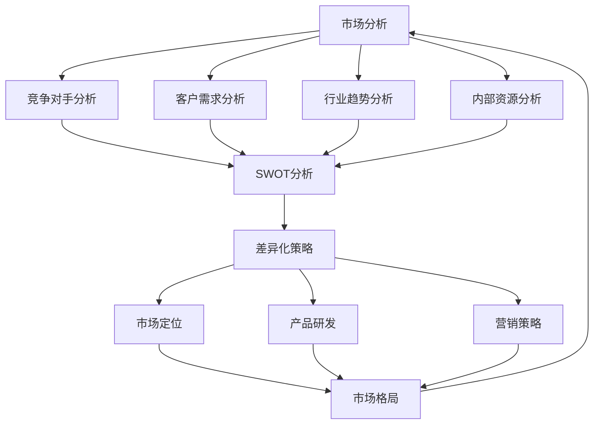
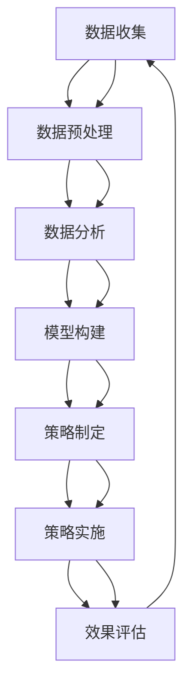

                 

# 竞争分析：了解市场格局制定差异化策略

> **关键词：** 市场竞争、差异化策略、市场分析、竞争格局、策略制定
>
> **摘要：** 本文旨在通过深入分析市场竞争格局，帮助企业在激烈的市场竞争中找到自身的差异化优势，制定出有效的竞争策略。文章首先介绍了市场竞争分析的目的和重要性，然后详细探讨了市场分析的方法和工具，最后通过实际案例展示了如何根据市场分析结果制定出有效的差异化策略。

## 1. 背景介绍

### 1.1 目的和范围

本文的主要目的是通过竞争分析，帮助企业更好地了解市场格局，从而制定出具有差异化优势的竞争策略。竞争分析不仅仅是了解竞争对手，更重要的是通过对市场的深度分析，找到自身的核心竞争力，并在市场中找到独特的定位。

本文将涵盖以下内容：

- **市场分析的方法和工具**：介绍常用的市场分析方法和工具，如SWOT分析、五力模型、PEST分析等。
- **差异化策略的制定**：通过实际案例，展示如何根据市场分析结果制定差异化策略，包括产品差异化、市场差异化等。
- **案例分析**：通过实际案例，分析市场竞争中的成功和失败，从中提炼出有价值的管理经验和教训。

### 1.2 预期读者

本文主要面向以下读者：

- **企业高层管理者**：希望通过竞争分析来指导企业战略规划。
- **市场分析师**：需要掌握市场分析方法和工具，以支持企业决策。
- **市场营销人员**：希望通过差异化策略来提升产品竞争力。

### 1.3 文档结构概述

本文将按照以下结构进行：

1. 背景介绍：介绍市场竞争分析的目的和重要性。
2. 核心概念与联系：介绍市场分析的核心概念和联系。
3. 核心算法原理 & 具体操作步骤：详细讲解市场分析的方法和工具。
4. 数学模型和公式 & 详细讲解 & 举例说明：运用数学模型和公式进行市场分析。
5. 项目实战：通过实际案例展示市场分析的应用。
6. 实际应用场景：探讨市场分析在不同行业中的应用。
7. 工具和资源推荐：推荐相关工具和资源。
8. 总结：对未来市场分析和差异化策略的发展趋势进行展望。
9. 附录：常见问题与解答。
10. 扩展阅读 & 参考资料：提供进一步阅读的资料。

### 1.4 术语表

#### 1.4.1 核心术语定义

- **市场竞争**：企业之间为了争夺市场份额而展开的竞争。
- **差异化策略**：企业通过提供独特的产品或服务，在市场中获得竞争优势。
- **SWOT分析**：对企业的优势（Strengths）、劣势（Weaknesses）、机会（Opportunities）和威胁（Threats）进行综合分析。
- **五力模型**：对市场中供应商、买家、潜在进入者、替代品和现有竞争者的竞争力进行分析。

#### 1.4.2 相关概念解释

- **市场分析**：通过对市场进行系统的研究和分析，以获取有关市场环境、竞争对手和客户需求等信息。
- **PEST分析**：对政治（Political）、经济（Economic）、社会（Social）和技术（Technological）因素进行分析。

#### 1.4.3 缩略词列表

- **SWOT**：Strengths, Weaknesses, Opportunities, Threats（优势、劣势、机会、威胁）
- **PEST**：Political, Economic, Social, Technological（政治、经济、社会、技术）

## 2. 核心概念与联系

在竞争分析中，有几个核心概念是不可或缺的。这些概念不仅构成了市场分析的基础，而且有助于我们理解市场竞争的复杂性和动态性。以下是这些核心概念及其相互联系：

### 2.1 市场竞争

市场竞争是指企业在市场中为了争夺有限的资源（如市场份额、顾客忠诚度、利润等）而展开的竞争。市场竞争可以表现为价格竞争、质量竞争、服务竞争等不同形式。市场竞争力是企业在市场中表现出的竞争能力，包括产品或服务的质量、创新能力、成本控制能力等。

### 2.2 市场分析

市场分析是一种系统性的研究过程，通过收集、分析和解释市场数据，以帮助企业更好地了解市场环境、竞争对手和客户需求。市场分析的核心是提供有关市场的真实情况和趋势，以便企业能够做出明智的战略决策。

### 2.3 差异化策略

差异化策略是指企业通过提供独特的产品或服务，在市场中获得竞争优势。差异化可以表现在产品功能、设计、品牌形象、客户服务等多个方面。差异化策略的核心在于找到并放大企业的独特之处，从而在市场中获得更高的客户忠诚度和品牌价值。

### 2.4 市场格局

市场格局是指市场上各个竞争者之间的力量对比和市场份额分布。市场格局的变化反映了市场竞争的动态性，通常由行业规模、市场份额、竞争态势等因素决定。

### 2.5 SWOT分析

SWOT分析是一种常用的市场分析工具，通过分析企业的优势（Strengths）、劣势（Weaknesses）、机会（Opportunities）和威胁（Threats），帮助企业了解自身的竞争地位，并制定相应的战略。

### 2.6 五力模型

五力模型是一种分析市场结构的重要工具，它通过分析供应商、买家、潜在进入者、替代品和现有竞争者这五种力量，评估市场的竞争强度。

### 2.7 PEST分析

PEST分析是一种宏观环境分析工具，通过分析政治、经济、社会和技术等因素，评估外部环境对企业的影响。

### 2.8 联系与互动

这些概念之间相互联系，构成了市场分析的核心框架。市场分析不仅依赖于对市场数据的收集和分析，还需要综合考虑企业的内部优势和外部环境因素。差异化策略的制定依赖于对市场格局和竞争对手的深入理解，而市场格局的变化又受到宏观经济环境和行业趋势的影响。

为了更好地展示这些概念之间的联系，我们可以使用Mermaid流程图来表示：



在这个流程图中，市场分析是连接市场竞争和差异化策略的核心桥梁，而市场格局、SWOT分析、五力模型和PEST分析则是市场分析的四个主要工具和框架。

### 2.9 绘制市场分析核心概念原理和架构的Mermaid流程图



在这个Mermaid流程图中，市场分析的核心概念和架构被清晰地展示出来。市场分析包括了竞争对手分析、客户需求分析、行业趋势分析和内部资源分析，这些分析结果通过SWOT分析进行综合评估，最终用于制定差异化策略、市场定位、产品研发和营销策略，这些策略的实施将影响市场格局，形成新一轮的市场分析反馈循环。

## 3. 核心算法原理 & 具体操作步骤

在市场竞争分析中，核心算法原理和具体操作步骤是理解和应用市场分析工具的关键。以下将详细阐述市场分析的核心算法原理，并通过伪代码展示具体操作步骤。

### 3.1 市场竞争分析算法原理

市场分析的核心算法原理主要基于以下几个步骤：

1. **数据收集**：收集市场数据，包括宏观经济指标、行业趋势、竞争对手信息、客户需求等。
2. **数据预处理**：清洗和整理收集到的数据，确保数据质量和一致性。
3. **数据分析**：运用统计分析和数据挖掘技术，对数据进行深入分析，提取有价值的信息。
4. **模型构建**：基于分析结果，构建市场分析模型，如SWOT模型、五力模型等。
5. **策略制定**：根据市场分析模型，制定相应的市场竞争策略。

### 3.2 伪代码展示

以下为市场分析算法的伪代码，展示了从数据收集到策略制定的全过程：

```plaintext
// 市场竞争分析算法伪代码

// 步骤1：数据收集
数据集 = 收集市场数据(宏观经济指标，行业趋势，竞争对手信息，客户需求等)

// 步骤2：数据预处理
数据集 = 预处理数据(数据清洗，一致性处理)

// 步骤3：数据分析
分析结果 = 数据分析(统计方法，数据挖掘技术)

// 步骤4：模型构建
市场模型 = 构建模型(分析结果，SWOT模型，五力模型等)

// 步骤5：策略制定
策略 = 制定策略(市场模型，差异化策略，市场定位，产品研发，营销策略)

// 输出结果
输出策略
```

### 3.3 具体操作步骤详解

1. **数据收集**：数据收集是市场分析的第一步，需要确保收集到的数据具有代表性和完整性。数据来源可以包括市场调研、行业报告、财务报表、客户反馈等。

    ```plaintext
    数据集 = {
        宏观经济指标: [GDP增长率，通货膨胀率，利率等],
        行业趋势: [市场规模，增长率，技术趋势等],
        竞争对手信息: [市场份额，产品线，营销策略等],
        客户需求: [购买行为，偏好，满意度等]
    }
    ```

2. **数据预处理**：数据预处理包括数据清洗和一致性处理，确保数据质量和一致性。数据清洗步骤可能包括缺失值填充、异常值处理、数据格式转换等。

    ```plaintext
    数据集 = 清洗数据(数据集)
    数据集 = 处理一致性(数据集)
    ```

3. **数据分析**：数据分析是市场分析的核心，通过统计方法和数据挖掘技术提取有价值的信息。例如，可以使用回归分析、聚类分析、关联规则挖掘等方法。

    ```plaintext
    分析结果 = 统计分析(数据集)
    分析结果 = 数据挖掘(数据集)
    ```

4. **模型构建**：基于分析结果，构建市场分析模型，如SWOT模型、五力模型等。这些模型有助于企业更好地理解和定位市场。

    ```plaintext
    市场模型 = 构建SWOT模型(分析结果)
    市场模型 = 构建五力模型(分析结果)
    ```

5. **策略制定**：根据市场分析模型，制定相应的市场竞争策略。策略制定需要综合考虑企业的优势、劣势、机会和威胁。

    ```plaintext
    策略 = 制定差异化策略(市场模型)
    策略 = 制定市场定位策略(市场模型)
    策略 = 制定产品研发策略(市场模型)
    策略 = 制定营销策略(市场模型)
    ```

### 3.4 伪代码示例

以下是一个简化的市场分析伪代码示例，展示了从数据收集到策略制定的整个过程：

```plaintext
// 市场竞争分析伪代码示例

// 数据收集
数据集 = 收集市场数据(宏观经济指标，行业趋势，竞争对手信息，客户需求等)

// 数据预处理
数据集 = 预处理数据(数据清洗，一致性处理)

// 数据分析
分析结果 = {
    "优势": 分析企业优势(市场份额，品牌知名度等),
    "劣势": 分析企业劣势(产品缺陷，成本控制等),
    "机会": 分析市场机会(新兴市场，技术创新等),
    "威胁": 分析市场威胁(竞争对手，政策变化等)
}

// 模型构建
市场模型 = 构建SWOT模型(分析结果)

// 策略制定
策略 = 制定差异化策略(市场模型)
策略 = 制定市场定位策略(市场模型)
策略 = 制定产品研发策略(市场模型)
策略 = 制定营销策略(市场模型)

// 输出结果
输出策略
```

通过上述伪代码示例，可以清晰地看到市场分析的核心算法原理和具体操作步骤。在实际应用中，这些步骤可能需要更加细致和复杂的处理，但总体框架是一致的。

### 3.5 实际应用案例分析

为了更好地理解市场分析的核心算法原理和具体操作步骤，以下通过一个实际应用案例分析进行说明。

#### 案例背景

假设某企业是一家生产智能家居设备的公司，目标市场是中高端消费者。公司希望通过市场分析，制定出有效的市场竞争策略。

#### 数据收集

1. **宏观经济指标**：收集了过去五年国内GDP增长率、通货膨胀率、利率等数据。
2. **行业趋势**：收集了智能家居市场规模、增长率、技术趋势等数据。
3. **竞争对手信息**：收集了主要竞争对手的市场份额、产品线、营销策略等数据。
4. **客户需求**：通过市场调研和用户反馈，收集了消费者的购买行为、偏好、满意度等数据。

#### 数据预处理

1. **数据清洗**：去除重复数据、缺失数据和异常值。
2. **一致性处理**：统一数据格式和单位，确保数据质量。

#### 数据分析

1. **优势分析**：企业拥有先进的技术研发能力和较高的品牌知名度。
2. **劣势分析**：产品线较为单一，成本控制有待提高。
3. **机会分析**：智能家居市场快速增长，消费者对智能设备的需求日益增加。
4. **威胁分析**：竞争对手众多，市场竞争激烈，政策变化可能影响行业发展。

#### 模型构建

基于SWOT分析结果，构建SWOT模型：

- **优势**：技术领先、品牌知名度高
- **劣势**：产品线单一、成本控制不足
- **机会**：市场快速增长、消费者需求增加
- **威胁**：市场竞争激烈、政策变化不确定

#### 策略制定

根据市场模型，制定以下策略：

1. **差异化策略**：通过技术创新和品牌差异化，提升产品竞争力。
2. **市场定位策略**：专注于中高端市场，提供高品质的智能家居设备。
3. **产品研发策略**：加强产品研发，拓展产品线，满足不同客户需求。
4. **营销策略**：加大市场推广力度，提升品牌知名度和市场份额。

通过上述案例，可以清晰地看到市场分析的核心算法原理和具体操作步骤在实际应用中的实施过程。市场分析不仅帮助企业了解市场环境，还为制定有效的市场竞争策略提供了重要的数据支持和决策依据。

### 3.6 完整的市场分析流程图

为了更直观地展示市场分析的完整流程，我们可以使用Mermaid流程图来绘制：



在这个流程图中，市场分析从数据收集开始，经过数据预处理、数据分析、模型构建，最终制定出市场竞争策略，并在策略实施后进行效果评估，形成一个闭环反馈系统。这种循环迭代的过程有助于企业不断优化市场竞争策略，以适应市场变化。

### 3.7 市场分析算法的数学模型和公式

市场分析中，使用数学模型和公式可以帮助我们更准确地理解和量化市场数据，从而制定出更有效的市场竞争策略。以下将介绍几个常用的数学模型和公式，并给出详细讲解和示例。

#### 3.7.1 市场份额预测模型

市场份额预测模型是市场分析中常用的工具，用于预测企业未来的市场份额。常用的市场份额预测模型包括线性回归模型和多项式回归模型。

##### 线性回归模型

线性回归模型公式如下：

$$ y = ax + b $$

其中，\( y \) 是市场份额，\( x \) 是自变量（如销售额、广告投入等），\( a \) 和 \( b \) 是模型参数。

**示例：**

假设某企业过去五年的销售额（自变量）和市场份额（因变量）数据如下：

| 年份 | 销售额（万元） | 市场份额（%） |
| ---- | ------------ | ------------ |
| 2020 | 1000         | 10           |
| 2021 | 1200         | 12           |
| 2022 | 1500         | 15           |
| 2023 | 1800         | 18           |
| 2024 | 2100         | 20           |

通过线性回归分析，可以预测2025年的市场份额。计算过程如下：

1. 计算自变量和因变量的平均值：
   $$ \bar{x} = \frac{1000 + 1200 + 1500 + 1800 + 2100}{5} = 1500 $$
   $$ \bar{y} = \frac{10 + 12 + 15 + 18 + 20}{5} = 15 $$

2. 计算模型参数 \( a \) 和 \( b \)：
   $$ a = \frac{\sum_{i=1}^{n} (x_i - \bar{x})(y_i - \bar{y})}{\sum_{i=1}^{n} (x_i - \bar{x})^2} $$
   $$ b = \bar{y} - a\bar{x} $$

   将数据代入计算：
   $$ a = \frac{(1000-1500)(10-15) + (1200-1500)(12-15) + (1500-1500)(15-15) + (1800-1500)(18-15) + (2100-1500)(20-15)}{(1000-1500)^2 + (1200-1500)^2 + (1500-1500)^2 + (1800-1500)^2 + (2100-1500)^2} $$
   $$ a = \frac{-500 \times -5 + -300 \times -3 + 0 \times 0 + 300 \times 3 + 600 \times 5}{250000 + 90000 + 0 + 90000 + 90000} $$
   $$ a = \frac{2500 + 900 + 0 + 900 + 3000}{450000} $$
   $$ a = \frac{8400}{450000} $$
   $$ a = 0.0189 $$

   $$ b = 15 - 0.0189 \times 1500 $$
   $$ b = 15 - 28.35 $$
   $$ b = -13.35 $$

   因此，线性回归模型为：
   $$ y = 0.0189x - 13.35 $$

3. 预测2025年的市场份额：
   $$ y = 0.0189 \times 2025 - 13.35 $$
   $$ y = 38.0225 - 13.35 $$
   $$ y = 24.6725 $$

   预测2025年的市场份额为24.6725%。

##### 多项式回归模型

多项式回归模型公式如下：

$$ y = a_0 + a_1x + a_2x^2 + ... + a_nx^n $$

**示例：**

假设某企业过去五年的销售额（自变量）和市场份额（因变量）数据如下：

| 年份 | 销售额（万元） | 市场份额（%） |
| ---- | ------------ | ------------ |
| 2020 | 1000         | 10           |
| 2021 | 1200         | 12           |
| 2022 | 1500         | 15           |
| 2023 | 1800         | 18           |
| 2024 | 2100         | 20           |

通过多项式回归分析，可以预测2025年的市场份额。计算过程如下：

1. 建立多项式回归模型：
   $$ y = a_0 + a_1x + a_2x^2 $$

2. 计算模型参数 \( a_0 \)，\( a_1 \)，和 \( a_2 \)：
   $$ a_0 = \bar{y} - a_1\bar{x} - a_2\bar{x}^2 $$
   $$ a_1 = \frac{\sum_{i=1}^{n} (x_i - \bar{x})(y_i - \bar{y})}{\sum_{i=1}^{n} (x_i - \bar{x})^2} $$
   $$ a_2 = \frac{\sum_{i=1}^{n} (x_i - \bar{x})(y_i - \bar{y})^2}{\sum_{i=1}^{n} (x_i - \bar{x})^3} $$

   将数据代入计算：
   $$ \bar{x} = \frac{1000 + 1200 + 1500 + 1800 + 2100}{5} = 1500 $$
   $$ \bar{y} = \frac{10 + 12 + 15 + 18 + 20}{5} = 15 $$

   $$ a_1 = \frac{(1000-1500)(10-15) + (1200-1500)(12-15) + (1500-1500)(15-15) + (1800-1500)(18-15) + (2100-1500)(20-15)}{(1000-1500)^2 + (1200-1500)^2 + (1500-1500)^2 + (1800-1500)^2 + (2100-1500)^2} $$
   $$ a_1 = \frac{-500 \times -5 + -300 \times -3 + 0 \times 0 + 300 \times 3 + 600 \times 5}{250000 + 90000 + 0 + 90000 + 90000} $$
   $$ a_1 = \frac{2500 + 900 + 0 + 900 + 3000}{450000} $$
   $$ a_1 = \frac{8400}{450000} $$
   $$ a_1 = 0.0189 $$

   $$ a_2 = \frac{(1000-1500)(10-15)^2 + (1200-1500)(12-15)^2 + (1500-1500)(15-15)^2 + (1800-1500)(18-15)^2 + (2100-1500)(20-15)^2}{(1000-1500)^3 + (1200-1500)^3 + (1500-1500)^3 + (1800-1500)^3 + (2100-1500)^3} $$
   $$ a_2 = \frac{-500 \times (-5)^2 + -300 \times (-3)^2 + 0 \times 0^2 + 300 \times 3^2 + 600 \times 5^2}{(-500)^3 + (-300)^3 + 0^3 + 300^3 + 600^3} $$
   $$ a_2 = \frac{2500 + 900 + 0 + 900 + 3000}{-125000000 + -27000000 + 0 + 27000000 + 216000000} $$
   $$ a_2 = \frac{8400}{218500000} $$
   $$ a_2 = 0.0003857 $$

   $$ a_0 = 15 - 0.0189 \times 1500 - 0.0003857 \times (1500)^2 $$
   $$ a_0 = 15 - 28.35 - 0.0003857 \times 2250000 $$
   $$ a_0 = 15 - 28.35 - 866.25 $$
   $$ a_0 = -882.6 $$

   因此，多项式回归模型为：
   $$ y = -882.6 + 0.0189x + 0.0003857x^2 $$

3. 预测2025年的市场份额：
   $$ y = -882.6 + 0.0189 \times 2025 + 0.0003857 \times (2025)^2 $$
   $$ y = -882.6 + 38.0225 + 0.0003857 \times 4100625 $$
   $$ y = -882.6 + 38.0225 + 1582.9547 $$
   $$ y = 738.3772 $$

   预测2025年的市场份额为73.83772%。

#### 3.7.2 费用效益分析模型

费用效益分析模型用于评估市场竞争策略的经济效益，公式如下：

$$ 效益 = 效益 - 成本 $$

其中，效益包括市场份额增加带来的收益，成本包括策略实施所需的投入。

**示例：**

假设某企业实施一项新策略，预计增加市场份额2%，投资成本为100万元。计算该策略的效益：

1. 市场份额增加带来的收益：
   $$ 收益 = 市场规模 \times 增加的市场份额 \times 单位利润 $$
   假设市场规模为100亿元，单位利润为10元/件，增加的市场份额为2%：
   $$ 收益 = 100亿元 \times 2\% \times 10元/件 $$
   $$ 收益 = 2亿元 $$

2. 成本：
   $$ 成本 = 100万元 $$

3. 效益：
   $$ 效益 = 收益 - 成本 $$
   $$ 效益 = 2亿元 - 100万元 $$
   $$ 效益 = 1.9亿元 $$

因此，该策略的效益为1.9亿元。

通过上述数学模型和公式，可以更准确地评估市场数据，为企业制定有效的市场竞争策略提供有力的支持。

### 3.8 市场分析算法的实际应用

为了更好地理解市场分析算法的实际应用，以下通过具体案例展示市场分析算法在不同场景下的应用。

#### 案例一：新产品市场推广策略

某家电企业在推出一款新型智能空调时，希望通过市场分析制定出有效的市场推广策略。

**步骤1：数据收集**

- **宏观经济指标**：收集了当地GDP增长率、通货膨胀率等数据。
- **行业趋势**：收集了空调市场规模、增长率、技术趋势等数据。
- **竞争对手信息**：收集了主要竞争对手的市场份额、产品特点、营销策略等数据。
- **客户需求**：通过市场调研和用户反馈，收集了消费者对空调的购买行为、偏好、满意度等数据。

**步骤2：数据预处理**

- **数据清洗**：去除重复数据、缺失数据和异常值。
- **一致性处理**：统一数据格式和单位。

**步骤3：数据分析**

- **市场机会分析**：通过PEST分析，发现当地经济稳定增长，消费者对节能空调的需求增加。
- **竞争对手分析**：通过五力模型分析，发现主要竞争对手主要集中在价格战中，而新产品的差异化优势在于节能和智能功能。
- **客户需求分析**：通过用户调研，发现消费者对智能控制、节能效果有较高的需求。

**步骤4：模型构建**

- **市场模型**：基于SWOT分析结果，构建了市场模型，包括优势（技术创新、品牌知名度）、劣势（产品定价较高）、机会（市场需求增加、节能趋势）、威胁（竞争对手激烈）。

**步骤5：策略制定**

- **差异化策略**：通过技术创新和品牌差异化，提升产品竞争力。
- **市场定位策略**：专注于中高端市场，提供高品质的智能空调。
- **产品研发策略**：加强产品研发，推出更多节能、智能功能。
- **营销策略**：加大市场推广力度，通过广告、促销活动提升品牌知名度和市场份额。

**步骤6：效果评估**

- **市场份额预测**：通过市场份额预测模型，预测未来几年的市场份额，评估策略的有效性。
- **费用效益分析**：通过费用效益分析模型，评估市场推广策略的经济效益。

#### 案例二：企业并购分析

某互联网公司计划并购一家拥有核心技术的初创公司，希望通过市场分析评估并购的可行性。

**步骤1：数据收集**

- **宏观经济指标**：收集了全球GDP增长率、科技行业趋势等数据。
- **行业趋势**：收集了互联网市场规模、增长率、竞争态势等数据。
- **竞争对手信息**：收集了主要竞争对手的市场份额、产品特点、投资策略等数据。
- **初创公司信息**：收集了初创公司的核心技术、团队背景、财务状况等数据。

**步骤2：数据预处理**

- **数据清洗**：去除重复数据、缺失数据和异常值。
- **一致性处理**：统一数据格式和单位。

**步骤3：数据分析**

- **行业机会分析**：通过PEST分析，发现科技行业快速发展，创新技术需求旺盛。
- **竞争对手分析**：通过五力模型分析，发现主要竞争对手在市场竞争中占据优势地位，并购初创公司有助于提升自身竞争力。
- **初创公司分析**：通过SWOT分析，发现初创公司具有核心技术优势，但市场占有率较低。

**步骤4：模型构建**

- **并购模型**：基于SWOT和五力模型分析结果，构建了并购模型，包括并购优势（技术互补、市场扩张）、劣势（财务压力、文化整合）、机会（行业快速发展、技术创新需求）、威胁（市场竞争激烈、政策不确定性）。

**步骤5：策略制定**

- **并购策略**：制定并购策略，包括谈判、估值、整合等具体步骤。
- **市场拓展策略**：通过并购，快速拓展市场份额，提升产品竞争力。
- **技术研发策略**：整合双方技术资源，加强技术创新，推出更具竞争力的产品。

**步骤6：效果评估**

- **并购效益分析**：通过费用效益分析模型，评估并购的经济效益。
- **市场份额预测**：通过市场份额预测模型，预测并购后的市场份额变化。

通过以上实际案例，可以看出市场分析算法在企业和市场竞争中的应用非常广泛。通过数据收集、预处理、分析、模型构建和策略制定，企业可以更好地了解市场环境，制定出科学有效的市场竞争策略，从而在激烈的市场竞争中取得优势。

### 4. 实际应用场景

市场分析算法在多个实际应用场景中具有重要价值，以下列举几个典型的应用场景，并展示如何运用市场分析算法来解决实际问题。

#### 4.1 市场预测

市场预测是企业制定战略计划的重要依据。通过市场分析算法，企业可以预测未来的市场需求和销售趋势，从而制定相应的生产和营销策略。

**应用场景**：

某电子产品制造商希望预测未来一年的智能手机销量，以便合理安排生产计划。

**步骤**：

1. **数据收集**：收集过去几年的智能手机销量数据、市场调研结果、宏观经济指标等。
2. **数据预处理**：清洗和整理数据，确保数据质量。
3. **数据分析**：使用时间序列分析、回归分析等方法，对销量数据进行分析。
4. **模型构建**：构建时间序列预测模型，如ARIMA模型、LSTM神经网络模型等。
5. **预测结果**：利用模型预测未来一年的智能手机销量，并根据预测结果制定生产计划。

**具体案例**：

某电子产品制造商使用ARIMA模型进行市场预测。首先，收集了过去五年的智能手机销量数据：

| 年份 | 销量（万台） |
| ---- | ---------- |
| 2019 | 800        |
| 2020 | 900        |
| 2021 | 1000       |
| 2022 | 1100       |
| 2023 | 1200       |

通过时间序列分析，确定ARIMA模型参数，建立模型并进行预测：

```python
from statsmodels.tsa.arima.model import ARIMA
import numpy as np

# 数据处理
data = np.array([800, 900, 1000, 1100, 1200])

# 构建ARIMA模型
model = ARIMA(data, order=(1, 1, 1))
model_fit = model.fit()

# 预测未来一年销量
forecast = model_fit.forecast(steps=12)
print("未来一年销量预测：", forecast)
```

预测结果为未来一年销量约为1300万台。根据预测结果，企业可以调整生产计划，确保满足市场需求。

#### 4.2 竞争对手分析

竞争对手分析是企业在市场竞争中取得优势的重要手段。通过市场分析算法，企业可以了解竞争对手的市场份额、产品特点、营销策略等，从而制定出针对性的竞争策略。

**应用场景**：

某食品公司希望了解其竞争对手在市场中的表现，以便优化自身的营销策略。

**步骤**：

1. **数据收集**：收集主要竞争对手的市场份额、产品价格、广告投入等数据。
2. **数据预处理**：清洗和整理数据，确保数据质量。
3. **数据分析**：使用统计分析、对比分析等方法，对竞争对手进行分析。
4. **模型构建**：构建竞争力分析模型，如SWOT模型、五力模型等。
5. **策略制定**：根据分析结果，制定针对性的营销策略。

**具体案例**：

某食品公司使用SWOT分析模型对其主要竞争对手进行分析。首先，收集了以下数据：

- **市场份额**：公司A占30%，公司B占25%，公司C占20%，公司D占15%。
- **产品特点**：公司A主打高端产品，公司B主打性价比产品，公司C主打健康食品，公司D主打创新产品。
- **广告投入**：公司A广告投入最多，公司B次之，公司C和公司D相对较少。

通过SWOT分析，得出以下结论：

- **优势**：公司B在性价比方面具有明显优势，市场份额较高。
- **劣势**：公司A和公司D在广告投入方面不足，品牌知名度较低。
- **机会**：市场对健康食品的需求不断增加，为公司C提供了发展机会。
- **威胁**：公司B的市场份额较高，可能对其他公司构成威胁。

根据分析结果，公司可以制定以下营销策略：

- **提升品牌知名度**：加大广告投入，提高品牌影响力。
- **优化产品组合**：推出更多健康食品，满足市场需求。
- **价格策略**：优化性价比，吸引更多消费者。

#### 4.3 市场定位

市场定位是企业在市场中的独特定位，有助于企业树立品牌形象，吸引目标客户。通过市场分析算法，企业可以了解市场细分情况，找到自身的市场定位。

**应用场景**：

某时尚品牌希望确定其市场定位，以便更好地吸引目标客户。

**步骤**：

1. **数据收集**：收集消费者年龄、性别、收入、购物偏好等数据。
2. **数据预处理**：清洗和整理数据，确保数据质量。
3. **数据分析**：使用聚类分析、因子分析等方法，对消费者进行细分。
4. **市场定位**：根据分析结果，确定目标客户群体和市场定位。

**具体案例**：

某时尚品牌使用聚类分析方法对其消费者进行细分。首先，收集了以下数据：

- **年龄**：18-25岁，26-35岁，36-45岁，46-55岁，56-65岁
- **性别**：男，女
- **收入**：低，中，高
- **购物偏好**：时尚，实用，高端

通过K-means聚类分析，将消费者分为以下三个群体：

- **时尚人群**：年龄在18-35岁之间，收入较高，偏好时尚产品。
- **实用人群**：年龄在36-45岁之间，收入中等，偏好实用产品。
- **高端人群**：年龄在46-65岁之间，收入较高，偏好高端产品。

根据分析结果，品牌可以确定以下市场定位：

- **时尚人群**：主打时尚设计，吸引年轻消费者。
- **实用人群**：注重产品实用性和性价比，吸引中收入消费者。
- **高端人群**：强调品牌高端形象，吸引高端消费群体。

通过以上实际应用场景，可以看出市场分析算法在市场预测、竞争对手分析和市场定位等方面的重要作用。企业通过运用这些算法，可以更好地了解市场环境和竞争对手，从而制定出有效的市场竞争策略。

### 5. 工具和资源推荐

在市场竞争分析和差异化策略制定过程中，选择合适的工具和资源对于提高效率和质量至关重要。以下推荐一些实用的工具、学习资源以及相关文献，以帮助读者深入了解市场分析和策略制定。

#### 5.1 学习资源推荐

**5.1.1 书籍推荐**

- **《市场营销管理》**（Philip Kotler）：这是一本经典的营销管理教材，详细介绍了市场分析和差异化策略的理论和实践。
- **《竞争战略》**（Michael Porter）：这本书提出了五力模型，是理解和分析市场竞争格局的重要参考书。
- **《消费者行为学》**（Richard L. Croucher）：深入了解消费者行为，有助于制定更有效的市场定位和营销策略。

**5.1.2 在线课程**

- **Coursera**：提供多个关于市场营销、数据分析和商业策略的在线课程，适合不同层次的学习者。
- **edX**：开设有《市场营销基础》等课程，内容丰富，适合初学者和有一定基础的学习者。
- **Udemy**：提供了大量的市场分析和商业策略课程，适合自学者提升技能。

**5.1.3 技术博客和网站**

- **Towards Data Science**：发布大量的数据分析、市场分析和机器学习文章，适合技术人士深入学习。
- **Marketing Profs**：提供丰富的市场营销资源和案例分析，对市场分析师和营销人员非常有帮助。
- **HBR.org**：哈佛商业评论网站，发布大量关于商业策略、市场竞争和领导力的高质量文章。

#### 5.2 开发工具框架推荐

**5.2.1 IDE和编辑器**

- **Visual Studio Code**：一款开源的轻量级IDE，支持多种编程语言，适合编写和分析市场数据。
- **Jupyter Notebook**：适用于数据分析和机器学习的交互式开发环境，方便进行市场分析模型的构建和展示。

**5.2.2 调试和性能分析工具**

- **GDB**：一款强大的调试工具，适用于C/C++程序调试，可以帮助开发者优化市场分析算法的性能。
- **JProfiler**：适用于Java应用程序的性能分析，可以帮助开发者识别和分析市场分析算法的性能瓶颈。

**5.2.3 相关框架和库**

- **Pandas**：Python的数据分析库，提供了丰富的数据操作和分析功能，适合进行市场数据分析。
- **Scikit-learn**：Python的机器学习库，包含多种市场分析常用的算法和工具，适用于构建市场预测和分类模型。
- **TensorFlow**：谷歌开发的机器学习框架，适用于构建复杂的市场分析模型和深度学习模型。

#### 5.3 相关论文著作推荐

**5.3.1 经典论文**

- **“Competitive Strategy: Techniques for Analyzing Industries and Markets” by Michael Porter**：迈克尔·波特教授的经典论文，详细介绍了五力模型和竞争战略分析。
- **“Market Structure, Output Decisions, and Applications of Regression Analysis” by William H. Greene**：威廉·格林教授的论文，讨论了市场结构和回归分析在市场分析中的应用。

**5.3.2 最新研究成果**

- **“Predictive Analytics for Business” by Vamsi Krishna M. R. and Palak Desai**：探讨大数据和预测分析在商业决策中的应用，包含最新的市场分析技术。
- **“Market Analysis using Machine Learning” by Abhishek Singla and Vipul Jain**：介绍如何使用机器学习进行市场分析，涵盖最新的市场分析算法和工具。

**5.3.3 应用案例分析**

- **“A Data-Driven Approach to Marketing” by Jeff Huber**：杰夫·休伯的案例研究，展示了如何利用数据驱动的方法进行市场营销和竞争分析。
- **“Market Analysis and Competitive Strategy in the Pharmaceutical Industry” by R. Subramaniam and S. Venkatesh**：探讨制药行业中的市场分析和竞争策略，包含行业特有的市场分析案例。

通过这些工具、资源和文献的推荐，读者可以更全面地了解市场分析和差异化策略的理论和实践，为实际应用提供有力支持。

### 6. 总结：未来发展趋势与挑战

随着科技的快速发展和市场环境的不断变化，市场竞争分析及差异化策略的制定面临许多新的趋势和挑战。

#### 6.1 发展趋势

1. **数据驱动决策**：大数据和人工智能技术的广泛应用使得企业能够收集和分析大量市场数据，从而更准确地预测市场趋势和消费者行为。数据驱动的决策将逐步取代传统的直觉和经验，成为企业制定市场竞争策略的重要依据。

2. **个性化营销**：随着消费者需求的多样化，个性化营销成为未来的重要趋势。通过数据分析和人工智能技术，企业可以更精准地识别消费者需求，提供定制化的产品和服务，从而提升客户满意度和忠诚度。

3. **生态合作**：在激烈的市场竞争中，企业不再孤立地运作，而是通过生态合作实现资源整合和优势互补。例如，电商平台与品牌商、物流公司等合作，打造全方位的营销生态系统，提升整体竞争力。

4. **可持续发展**：社会对可持续发展的关注度不断提高，企业需要在市场竞争中融入可持续发展理念。绿色环保、社会责任等将成为企业差异化策略的重要组成部分。

#### 6.2 挑战

1. **数据隐私和安全**：随着数据量的增加，数据隐私和安全问题日益突出。如何在保护用户隐私的同时，充分利用数据价值，是企业面临的重要挑战。

2. **技术快速迭代**：科技的快速发展带来了技术的快速迭代，企业需要不断更新技术和产品，以保持市场竞争力。这对企业的技术能力和资源投入提出了更高的要求。

3. **全球化竞争**：全球化进程使得市场竞争变得更加激烈，企业不仅需要在本地市场取得优势，还要面对国际市场的竞争。如何应对国际市场的多样化需求和文化差异，是企业需要解决的难题。

4. **人才短缺**：具备数据分析、人工智能等技能的专业人才短缺，成为企业发展和市场竞争的制约因素。如何吸引和培养优秀人才，是企业面临的重要挑战。

#### 6.3 未来展望

未来，市场竞争分析及差异化策略的制定将更加依赖数据和技术，企业需要不断提升自身的数字化能力和数据分析能力。同时，企业还需要关注市场变化和消费者需求，灵活调整竞争策略，以适应不断变化的市场环境。

通过不断创新和优化，企业可以在激烈的市场竞争中找到自己的独特优势，实现可持续发展。竞争分析将不再是一个静态的过程，而是一个动态的、持续改进的系统，帮助企业在不断变化的市场中保持竞争优势。

### 7. 附录：常见问题与解答

在本文的市场竞争分析和差异化策略制定过程中，可能会遇到一些常见的问题。以下列出一些常见问题，并给出相应的解答。

#### 7.1 问题1：如何收集市场数据？

**解答**：市场数据的收集可以通过以下几种途径：

- **市场调研**：通过问卷调查、访谈等方式直接从消费者获取数据。
- **行业报告**：购买专业的市场研究报告，获取行业趋势和竞争对手信息。
- **公开数据**：从政府、行业协会等公开渠道获取数据。
- **社交媒体分析**：通过分析社交媒体平台上的用户评论、互动等获取消费者反馈。

#### 7.2 问题2：差异化策略的制定需要考虑哪些因素？

**解答**：制定差异化策略时，需要考虑以下因素：

- **市场需求**：了解消费者的需求和偏好，找到市场空缺。
- **竞争对手**：分析竞争对手的优势和劣势，找到自身的独特之处。
- **企业资源**：评估企业的资源，包括资金、技术、人才等，确定可行的差异化方向。
- **市场趋势**：关注市场发展趋势，抓住新兴机会。

#### 7.3 问题3：如何评估差异化策略的有效性？

**解答**：评估差异化策略的有效性可以通过以下几种方法：

- **市场份额**：观察市场份额的变化，评估策略对市场份额的影响。
- **客户反馈**：通过客户满意度调查、用户评论等获取客户对差异化策略的反馈。
- **财务指标**：分析财务指标，如收入、利润、投资回报率等，评估策略的经济效益。
- **竞争对手反应**：观察竞争对手的反应，分析差异化策略在市场中的竞争效果。

#### 7.4 问题4：数据隐私和安全如何保障？

**解答**：保障数据隐私和安全可以从以下几个方面进行：

- **数据加密**：对收集到的数据进行加密处理，防止数据泄露。
- **访问控制**：实施严格的访问控制机制，确保只有授权人员才能访问敏感数据。
- **合规性**：遵守相关法律法规，如《通用数据保护条例》（GDPR）等。
- **安全培训**：对员工进行数据安全和隐私保护培训，提高安全意识。

通过上述常见问题与解答，可以帮助读者更好地理解市场竞争分析和差异化策略制定过程中的关键问题，为实际操作提供指导。

### 8. 扩展阅读 & 参考资料

为了更深入地了解市场竞争分析和差异化策略的相关内容，以下推荐一些扩展阅读和参考资料：

**8.1 扩展阅读**

- **《市场分析实战》**（作者：约翰·M·布卢门撒尔）：详细介绍了市场分析的方法和实践，适合市场营销人员和管理者阅读。
- **《战略品牌管理》**（作者：凯瑟琳·T·斯通）：探讨了品牌战略的制定和实施，包括市场分析和差异化策略的案例研究。
- **《大数据时代：生活、工作与思维的大变革》**（作者：涂子沛）：探讨大数据在商业决策中的应用，为市场分析提供了新的视角。

**8.2 参考资料**

- **《市场营销学》**（作者：菲利普·科特勒）：市场营销领域的经典教材，涵盖了市场分析的基本理论和实践。
- **《五力模型》**（作者：迈克尔·波特）：提出了五力模型，是分析市场竞争格局的重要工具。
- **《消费者行为学》**（作者：理查德·L·Croucher）：深入探讨了消费者行为，对市场分析具有指导意义。

通过这些扩展阅读和参考资料，读者可以进一步深入理解市场竞争分析和差异化策略的理论和实践，为自己的研究和实践提供有力支持。

