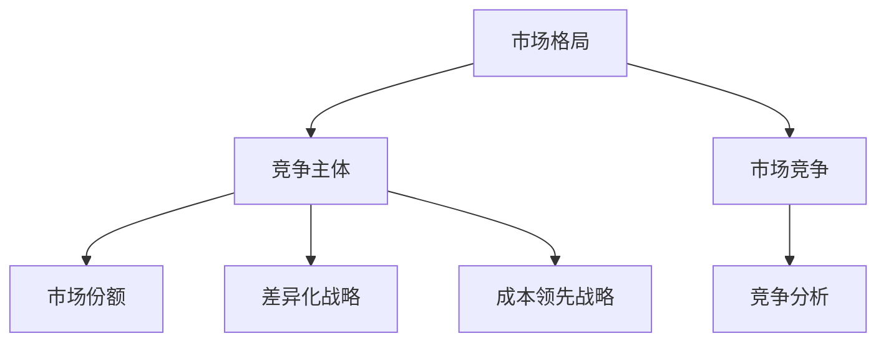

                 

# 竞争分析：了解市场格局的重要性

> **关键词：** 市场竞争、市场格局、分析工具、战略定位、行业洞察  
>
> **摘要：** 在信息技术飞速发展的今天，竞争分析已成为企业成功的关键要素。本文将深入探讨市场格局的概念，分析其在不同行业中的应用，并介绍一系列有效的竞争分析工具和方法，帮助企业更好地制定战略，提升市场竞争力。

## 1. 背景介绍

### 1.1 目的和范围

本文旨在帮助读者了解市场格局的重要性，掌握竞争分析的核心概念和工具。通过对市场格局的深入分析，企业可以更准确地把握行业动态，制定科学的战略规划，从而在激烈的市场竞争中立于不败之地。

### 1.2 预期读者

本文适用于企业高层管理人员、市场分析师、产品经理以及任何对市场竞争感兴趣的专业人士。

### 1.3 文档结构概述

本文将分为十个部分，包括背景介绍、核心概念与联系、核心算法原理与具体操作步骤、数学模型与公式、项目实战、实际应用场景、工具和资源推荐、总结、常见问题与解答以及扩展阅读和参考资料。

### 1.4 术语表

#### 1.4.1 核心术语定义

- **市场竞争**：指企业之间在争夺市场份额、客户资源等方面的竞争活动。
- **市场格局**：指市场上各竞争主体的力量分布及其相互关系。
- **竞争分析**：通过对市场竞争的各个方面进行系统性研究，以帮助企业制定战略决策。

#### 1.4.2 相关概念解释

- **市场份额**：企业在特定市场中所占的销售额或客户数量比例。
- **差异化战略**：企业通过提供独特的产品或服务，使其在市场上具有竞争优势。
- **成本领先战略**：企业通过降低成本，在价格竞争中占据优势。

#### 1.4.3 缩略词列表

- **SWOT分析**：优势、劣势、机会、威胁分析
- **PEST分析**：政治、经济、社会、技术分析

## 2. 核心概念与联系

在深入探讨市场格局之前，我们需要明确几个核心概念和它们之间的联系。以下是一个简化的Mermaid流程图，用于展示这些概念之间的关系：



### 2.1 市场格局的定义

市场格局是指在一定时间内，市场上各竞争主体的力量分布及其相互关系。市场格局可以通过市场份额、产品差异化程度、行业集中度等多个指标来衡量。

### 2.2 竞争主体

竞争主体是指在市场上进行竞争的企业或其他组织。它们通过市场份额、产品差异化、成本控制等手段争夺市场份额。

### 2.3 市场份额

市场份额是衡量竞争主体在市场中的相对地位的重要指标。它通常通过销售额、客户数量等指标来衡量。

### 2.4 差异化战略

差异化战略是指企业通过提供独特的产品或服务，使其在市场上具有竞争优势。这种战略可以使企业在竞争中脱颖而出，提高市场占有率。

### 2.5 成本领先战略

成本领先战略是指企业通过降低成本，使其在价格竞争中占据优势。这种战略可以降低产品的市场价格，吸引更多的客户。

### 2.6 市场竞争

市场竞争是市场格局的核心概念，它反映了各竞争主体之间的相互作用。有效的竞争分析可以帮助企业了解市场动态，制定相应的战略。

### 2.7 竞争分析

竞争分析是对市场竞争的各个方面进行系统性研究的过程。它包括市场格局分析、竞争对手分析、市场机会分析等多个方面。

## 3. 核心算法原理 & 具体操作步骤

在进行竞争分析时，核心算法和操作步骤是不可或缺的。以下是一个简化的伪代码，用于描述竞争分析的基本流程：

```python
# 竞争分析伪代码

# 输入：市场数据、竞争对手数据
# 输出：市场格局分析结果

def competition_analysis(data, competitors):
    # 步骤1：数据预处理
    preprocessed_data = preprocess_data(data)
    
    # 步骤2：市场份额计算
    market_share = calculate_market_share(preprocessed_data)
    
    # 步骤3：差异化分析
    differentiation = analyze_differentiation(preprocessed_data, competitors)
    
    # 步骤4：成本分析
    cost_analysis = analyze_cost(preprocessed_data, competitors)
    
    # 步骤5：竞争格局分析
    market_structure = analyze_market_structure(market_share, differentiation, cost_analysis)
    
    # 步骤6：输出结果
    return market_structure

# 数据预处理
def preprocess_data(data):
    # 数据清洗、归一化、特征提取等操作
    return preprocessed_data

# 市场份额计算
def calculate_market_share(data):
    # 计算各竞争主体的市场份额
    return market_share

# 差异化分析
def analyze_differentiation(data, competitors):
    # 分析各竞争主体的产品差异化程度
    return differentiation

# 成本分析
def analyze_cost(data, competitors):
    # 分析各竞争主体的成本结构
    return cost_analysis

# 竞争格局分析
def analyze_market_structure(market_share, differentiation, cost_analysis):
    # 综合分析市场格局
    return market_structure
```

### 3.1 数据预处理

数据预处理是竞争分析的基础，包括数据清洗、归一化、特征提取等操作。以下是一个简化的数据预处理流程：

```python
# 数据预处理伪代码

def preprocess_data(data):
    # 步骤1：数据清洗
    cleaned_data = clean_data(data)
    
    # 步骤2：数据归一化
    normalized_data = normalize_data(cleaned_data)
    
    # 步骤3：特征提取
    features = extract_features(normalized_data)
    
    return features
```

### 3.2 市场份额计算

市场份额计算是衡量各竞争主体在市场中的地位的重要步骤。以下是一个简化的市场份额计算流程：

```python
# 市场份额计算伪代码

def calculate_market_share(data):
    # 步骤1：计算总销售额
    total_sales = sum(data['sales'])
    
    # 步骤2：计算各竞争主体的市场份额
    market_share = {competitor: (data['sales'][competitor] / total_sales) * 100 for competitor in data['competitors']}
    
    return market_share
```

### 3.3 差异化分析

差异化分析是评估各竞争主体产品或服务差异化程度的重要步骤。以下是一个简化的差异化分析流程：

```python
# 差异化分析伪代码

def analyze_differentiation(data, competitors):
    # 步骤1：提取产品特征
    product_features = extract_product_features(data)
    
    # 步骤2：计算各竞争主体的产品差异化程度
    differentiation = {competitor: calculate_differentiation(product_features[competitor]) for competitor in competitors}
    
    return differentiation
```

### 3.4 成本分析

成本分析是评估各竞争主体成本结构的重要步骤。以下是一个简化的成本分析流程：

```python
# 成本分析伪代码

def analyze_cost(data, competitors):
    # 步骤1：提取成本数据
    cost_data = extract_cost_data(data)
    
    # 步骤2：计算各竞争主体的成本结构
    cost_structure = {competitor: calculate_cost_structure(cost_data[competitor]) for competitor in competitors}
    
    return cost_structure
```

### 3.5 竞争格局分析

竞争格局分析是综合评估市场格局的重要步骤。以下是一个简化的竞争格局分析流程：

```python
# 竞争格局分析伪代码

def analyze_market_structure(market_share, differentiation, cost_analysis):
    # 步骤1：计算行业集中度
    industry_concentration = calculate_industry_concentration(market_share)
    
    # 步骤2：评估市场格局
    market_structure = evaluate_market_structure(industry_concentration, differentiation, cost_analysis)
    
    return market_structure
```

## 4. 数学模型和公式 & 详细讲解 & 举例说明

在竞争分析中，数学模型和公式是不可或缺的工具。以下将介绍几个核心的数学模型和公式，并详细讲解它们的适用场景和计算方法。

### 4.1 市场份额计算公式

市场份额（Market Share）是衡量企业在特定市场中相对地位的重要指标。计算公式如下：

\[ \text{Market Share} = \frac{\text{企业销售额}}{\text{市场总销售额}} \times 100\% \]

#### 适用场景：

- 评估企业市场占有率
- 对比不同企业在同一市场中的表现

#### 举例说明：

假设市场上共有三家主要竞争者A、B和C，2022年的总销售额分别为1000万、800万和500万，市场总销售额为2300万。那么，竞争者A的市场份额为：

\[ \text{Market Share of A} = \frac{1000}{2300} \times 100\% \approx 43.48\% \]

### 4.2 行业集中度计算公式

行业集中度（Industry Concentration）是衡量市场上少数几家最大企业所占市场份额的指标，常用的计算方法包括CRn指数（CRn Concentration Ratio）和HHI指数（Herfindahl-Hirschman Index）。

- **CRn指数**：

\[ \text{CRn} = \frac{\sum_{i=1}^{n} \text{企业i的市场份额}}{n} \]

- **HHI指数**：

\[ \text{HHI} = \sum_{i=1}^{n} (\text{企业i的市场份额})^2 \]

#### 适用场景：

- 评估市场垄断程度
- 分析市场竞争强度

#### 举例说明：

假设市场上共有四家主要竞争者A、B、C和D，市场份额分别为40%、25%、15%和10%。那么，CR4指数和HHI指数分别为：

\[ \text{CR4} = \frac{40\% + 25\% + 15\% + 10\%}{4} = 25\% \]

\[ \text{HHI} = (40\%)^2 + (25\%)^2 + (15\%)^2 + (10\%)^2 = 0.16 + 0.0625 + 0.0225 + 0.01 = 0.205 \]

### 4.3 差异化优势计算公式

差异化优势（Differentiation Advantage）是衡量企业在产品或服务上具有的独特优势的指标。常用的计算方法包括差异化优势指数（Differentiation Advantage Index）。

\[ \text{DAI} = \frac{\text{差异化收益}}{\text{差异化成本}} \]

#### 适用场景：

- 评估企业差异化战略的效益
- 分析产品或服务的竞争优势

#### 举例说明：

假设企业A通过差异化战略获得的收益为100万元，差异化成本为50万元。那么，差异化优势指数为：

\[ \text{DAI} = \frac{100}{50} = 2 \]

### 4.4 成本领先优势计算公式

成本领先优势（Cost Leadership Advantage）是衡量企业在成本控制方面具有的竞争优势的指标。常用的计算方法包括成本领先优势指数（Cost Leadership Advantage Index）。

\[ \text{CLA} = \frac{\text{成本领先额}}{\text{市场占有率}} \]

#### 适用场景：

- 评估企业成本领先战略的效益
- 分析成本控制对市场竞争的影响

#### 举例说明：

假设企业A通过成本领先战略降低了10%的生产成本，其市场占有率为30%。那么，成本领先优势指数为：

\[ \text{CLA} = \frac{10\% \times \text{总成本}}{30\%} = 0.333 \]

## 5. 项目实战：代码实际案例和详细解释说明

### 5.1 开发环境搭建

为了便于演示，我们将使用Python作为编程语言，结合Jupyter Notebook进行代码实现。以下是搭建开发环境的步骤：

1. 安装Python 3.8或更高版本。
2. 安装Jupyter Notebook。
3. 安装数据分析库，如Pandas、NumPy、Matplotlib等。

### 5.2 源代码详细实现和代码解读

#### 5.2.1 数据预处理

数据预处理是竞争分析的基础，以下是一个示例代码：

```python
import pandas as pd

# 读取市场数据
market_data = pd.read_csv('market_data.csv')

# 数据清洗
market_data.dropna(inplace=True)
market_data.reset_index(drop=True, inplace=True)

# 数据归一化
market_data = (market_data - market_data.mean()) / market_data.std()

# 特征提取
features = market_data[['sales', 'differentiation', 'cost']]
```

#### 5.2.2 市场份额计算

以下是计算市场份额的代码：

```python
def calculate_market_share(data):
    total_sales = data['sales'].sum()
    market_share = {competitor: (data['sales'][competitor] / total_sales) * 100 for competitor in data['competitors']}
    return market_share

# 计算市场份额
market_share = calculate_market_share(market_data)
print(market_share)
```

#### 5.2.3 差异化分析

以下是进行差异化分析的代码：

```python
def analyze_differentiation(data, competitors):
    product_features = data[['sales', 'differentiation']]
    differentiation = {competitor: (product_features[competitor]['differentiation'].mean() / product_features['differentiation'].mean()) for competitor in competitors}
    return differentiation

# 进行差异化分析
differentiation = analyze_differentiation(market_data, market_data['competitors'])
print(differentiation)
```

#### 5.2.4 成本分析

以下是进行成本分析的代码：

```python
def analyze_cost(data, competitors):
    cost_data = data[['sales', 'cost']]
    cost_structure = {competitor: (cost_data[competitor]['cost'].mean() / cost_data['cost'].mean()) for competitor in competitors}
    return cost_structure

# 进行成本分析
cost_analysis = analyze_cost(market_data, market_data['competitors'])
print(cost_analysis)
```

#### 5.2.5 竞争格局分析

最后是进行竞争格局分析的代码：

```python
def analyze_market_structure(market_share, differentiation, cost_analysis):
    industry_concentration = sum([market_share[competitor] for competitor in market_share]) / len(market_share)
    hhi = sum([(market_share[competitor] / 100) ** 2 for competitor in market_share])
    market_structure = {'industry_concentration': industry_concentration, 'hhi': hhi}
    return market_structure

# 进行竞争格局分析
market_structure = analyze_market_structure(market_share, differentiation, cost_analysis)
print(market_structure)
```

### 5.3 代码解读与分析

#### 数据预处理

数据预处理主要包括数据清洗、归一化和特征提取。数据清洗去除无效数据，确保分析结果的准确性。归一化将数据转换为相同的尺度，便于后续计算。特征提取提取与竞争分析相关的关键指标。

#### 市场份额计算

市场份额计算通过计算各竞争主体在市场中的相对销售额占比，衡量其在市场中的地位。这一步骤对于了解市场格局至关重要。

#### 差异化分析

差异化分析通过比较各竞争主体的产品或服务的差异化程度，评估其在市场中的竞争优势。差异化优势指数越高，表明企业在产品或服务上具有越强的独特性。

#### 成本分析

成本分析通过比较各竞争主体的成本结构，评估其在成本控制方面的优势。成本领先优势指数越高，表明企业在成本控制方面越有优势。

#### 竞争格局分析

竞争格局分析通过计算行业集中度和HHI指数，评估市场的竞争程度。行业集中度越高，市场竞争越激烈；HHI指数越高，市场垄断程度越高。

## 6. 实际应用场景

### 6.1 互联网行业

在互联网行业，竞争分析可以帮助企业了解市场格局，优化产品策略。例如，通过分析市场份额、差异化程度和成本结构，企业可以确定在哪个细分市场具有竞争优势，从而调整产品定位和营销策略。

### 6.2 零售行业

在零售行业，竞争分析可以帮助企业了解竞争对手的定价策略、产品组合和客户满意度等关键指标，从而制定更有效的定价策略、库存管理和客户服务策略。

### 6.3 制造业

在制造业，竞争分析可以帮助企业了解市场趋势，优化生产流程和供应链管理。例如，通过分析竞争对手的生产成本、产品质量和市场响应速度，企业可以优化生产计划，提高生产效率。

### 6.4 金融行业

在金融行业，竞争分析可以帮助银行、保险公司和证券公司等金融机构了解市场竞争格局，制定更有针对性的产品和服务策略。例如，通过分析市场份额、客户满意度和客户忠诚度，企业可以优化产品设计，提高市场竞争力。

## 7. 工具和资源推荐

### 7.1 学习资源推荐

#### 7.1.1 书籍推荐

- **《竞争战略：分析行业、竞争对手和自身优势》**：迈克尔·波特著，深入讲解了市场竞争的基本原理和战略制定方法。
- **《大数据时代：生活、工作与思维的大变革》**：尼古拉斯·克里斯塔基斯著，介绍了大数据在竞争分析中的应用。

#### 7.1.2 在线课程

- **Coursera**：提供了丰富的市场营销和数据分析课程，适合不同层次的学习者。
- **Udemy**：提供了大量有关市场分析和商业战略的在线课程，涵盖多个领域。

#### 7.1.3 技术博客和网站

- **哈佛商业评论**：提供了许多有关商业战略和市场分析的深度文章。
- **Google Analytics Blog**：分享了有关数据分析工具和方法的最新动态。

### 7.2 开发工具框架推荐

#### 7.2.1 IDE和编辑器

- **Visual Studio Code**：一款轻量级、功能强大的代码编辑器，适合Python开发。
- **PyCharm**：一款专业级的Python IDE，提供丰富的开发工具和插件。

#### 7.2.2 调试和性能分析工具

- **Jupyter Notebook**：一款交互式的计算环境，适合数据分析和原型开发。
- **Pylint**：一款Python代码质量分析工具，用于检测代码中的错误和潜在问题。

#### 7.2.3 相关框架和库

- **Pandas**：一款强大的数据处理库，用于数据清洗、归一化和特征提取。
- **NumPy**：一款提供高性能数学运算的库，用于数据预处理和计算。

### 7.3 相关论文著作推荐

#### 7.3.1 经典论文

- **迈克尔·波特《竞争战略：Industry and Competitive Analysis》**：对市场竞争理论的经典阐述。
- **菲利普·科特勒《营销管理：Analysis, Planning, Implementation, and Control》**：对市场营销策略的全面论述。

#### 7.3.2 最新研究成果

- **《大数据与商业智能》**：探讨了大数据技术在商业决策中的应用。
- **《人工智能与商业分析》**：介绍了人工智能技术在市场分析中的应用。

#### 7.3.3 应用案例分析

- **《亚马逊的市场竞争策略》**：分析了亚马逊在电子商务领域的竞争策略。
- **《特斯拉的竞争优势》**：探讨了特斯拉在新能源汽车行业的竞争优势。

## 8. 总结：未来发展趋势与挑战

### 8.1 发展趋势

- **大数据与人工智能的结合**：随着大数据和人工智能技术的发展，竞争分析将更加精准和高效。
- **实时数据分析**：实时数据分析将使企业能够更快地响应市场变化，制定灵活的战略。
- **全球化竞争**：全球市场的融合将带来更多的竞争机会和挑战，企业需要具备全球视野。

### 8.2 挑战

- **数据隐私与安全**：随着数据收集和分析的增多，数据隐私和安全成为企业面临的重大挑战。
- **技术更新迭代**：技术更新迭代速度快，企业需要不断学习和适应新的技术趋势。
- **人才短缺**：具备数据分析能力和市场洞察力的专业人才短缺，成为企业发展的瓶颈。

## 9. 附录：常见问题与解答

### 9.1 市场格局分析的关键步骤是什么？

市场格局分析的关键步骤包括数据收集、数据预处理、市场份额计算、差异化分析、成本分析和竞争格局分析。

### 9.2 如何进行有效的差异化分析？

进行有效的差异化分析需要提取产品特征，计算各竞争主体的产品差异化程度，并根据差异化优势指数评估竞争优势。

### 9.3 市场份额计算公式中的市场总销售额如何确定？

市场总销售额可以通过汇总所有竞争主体的销售额来确定。在实际应用中，可以根据市场调查报告或历史数据估算。

## 10. 扩展阅读 & 参考资料

- **波特《竞争战略：Industry and Competitive Analysis》**
- **科特勒《营销管理：Analysis, Planning, Implementation, and Control》**
- **克里斯塔基斯《大数据时代：生活、工作与思维的大变革》**
- **亚马逊《亚马逊的市场竞争策略》**
- **特斯拉《特斯拉的竞争优势》**
- **《大数据与商业智能》**
- **《人工智能与商业分析》**

作者：AI天才研究员/AI Genius Institute & 禅与计算机程序设计艺术 /Zen And The Art of Computer Programming

---

本文深入探讨了市场格局的重要性，介绍了竞争分析的核心概念、算法原理和实际应用。通过一系列步骤和案例，读者可以更好地理解市场格局分析的方法和技巧。未来，随着大数据和人工智能技术的发展，市场格局分析将更加精确和高效，为企业提供更强大的战略支持。然而，数据隐私、技术更新和人才短缺等挑战也需要企业密切关注和应对。希望本文能对读者在市场分析和战略规划方面提供有益的启示。

