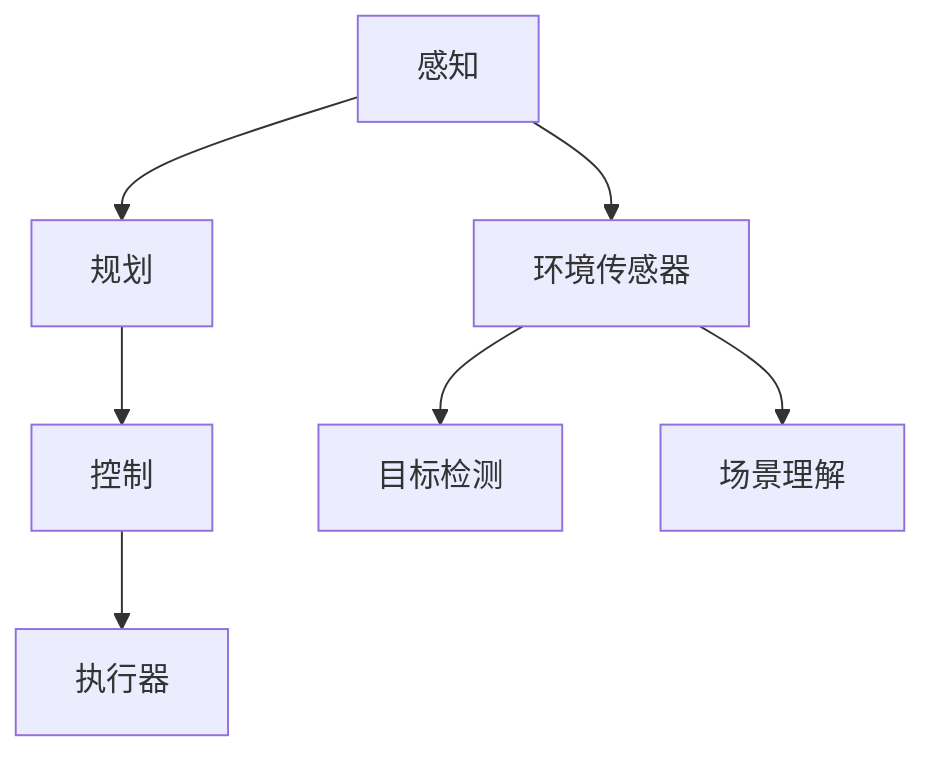

                 

# 端到端自动驾驶对开发组织架构的影响

> 关键词：端到端自动驾驶、开发组织架构、影响分析、技术挑战、变革路径

> 摘要：随着端到端自动驾驶技术的不断成熟，其对开发组织架构产生了深远的影响。本文从背景介绍、核心概念、算法原理、数学模型、实际应用、工具推荐等多方面进行深入探讨，旨在为开发组织在自动驾驶领域的架构设计提供理论指导和实践建议。

## 1. 背景介绍

### 1.1 目的和范围

本文旨在探讨端到端自动驾驶技术对开发组织架构的影响，分析其中涉及的核心概念、技术挑战以及变革路径。通过深入研究端到端自动驾驶技术，旨在帮助开发组织更好地理解和应对这一新兴领域所带来的变革。

### 1.2 预期读者

本文适合以下读者群体：

1. 开发组织的管理者和决策者；
2. 负责自动驾驶技术开发的工程师和架构师；
3. 对自动驾驶技术感兴趣的研究人员和从业者；
4. 想要了解自动驾驶技术发展及其对行业影响的普通读者。

### 1.3 文档结构概述

本文将按照以下结构进行展开：

1. 背景介绍：介绍端到端自动驾驶技术的发展背景及对开发组织架构的影响；
2. 核心概念与联系：阐述端到端自动驾驶技术中的核心概念及其相互关系；
3. 核心算法原理 & 具体操作步骤：详细讲解端到端自动驾驶技术中的核心算法原理和操作步骤；
4. 数学模型和公式 & 详细讲解 & 举例说明：介绍端到端自动驾驶技术中的数学模型和公式，并给出具体例子进行说明；
5. 项目实战：通过实际代码案例，展示端到端自动驾驶技术的开发过程；
6. 实际应用场景：探讨端到端自动驾驶技术在现实场景中的应用；
7. 工具和资源推荐：推荐相关学习资源、开发工具和框架；
8. 总结：总结端到端自动驾驶技术的未来发展趋势与挑战；
9. 附录：常见问题与解答；
10. 扩展阅读 & 参考资料。

### 1.4 术语表

#### 1.4.1 核心术语定义

- 端到端自动驾驶：一种自动驾驶技术，通过直接从原始数据（如摄像头、激光雷达等）生成最终的控制指令，无需通过传统的分层结构进行特征提取和分类。

- 开发组织架构：指开发组织在组织结构、流程、工具等方面所采用的设计和安排，以支持自动驾驶技术的研发和部署。

- 端到端训练：一种深度学习训练方法，直接将输入数据映射到输出数据，无需进行特征提取和分类等中间环节。

#### 1.4.2 相关概念解释

- 深度神经网络（DNN）：一种具有多个隐藏层的神经网络，能够对复杂的数据进行建模。

- 强化学习（RL）：一种机器学习方法，通过试错和奖励机制来学习最优策略。

- 异构计算：指在计算任务中，不同类型的计算资源（如CPU、GPU、FPGA等）协同工作，以实现更高的计算性能。

#### 1.4.3 缩略词列表

- DNN：深度神经网络  
- RL：强化学习  
- CNN：卷积神经网络  
- RNN：循环神经网络  
- GPU：图形处理单元  
- FPGA：现场可编程门阵列

## 2. 核心概念与联系

在端到端自动驾驶技术中，核心概念包括：

- **感知（Perception）**：通过传感器（如摄像头、激光雷达等）获取环境信息，进行目标检测、场景理解等操作。
- **规划（Planning）**：根据感知到的环境信息，规划车辆的行驶路径和动作。
- **控制（Control）**：根据规划结果，控制车辆的执行器（如电机、转向机构等）进行操作。

### Mermaid 流程图



## 3. 核心算法原理 & 具体操作步骤

### 3.1 感知

感知模块的核心算法是卷积神经网络（CNN），其伪代码如下：

```python
function Perception(image):
    # 数据预处理
    image = Preprocess(image)
    # 卷积操作
    conv1 = Conv2D(image, kernel_size=(3, 3), activation='relu')
    conv2 = Conv2D(conv1, kernel_size=(3, 3), activation='relu')
    # 池化操作
    pool1 = MaxPooling2D(pool_size=(2, 2))
    # 平坦化操作
    flat1 = Flatten(conv2)
    # 全连接层
    fc1 = Dense(1024, activation='relu')
    # 输出层
    output = Dense(1000, activation='softmax')
    # 返回预测结果
    return output(flat1)
```

### 3.2 规划

规划模块的核心算法是强化学习（RL），其伪代码如下：

```python
function Planning(state):
    # 初始化策略网络和目标网络
    policy_network = build_policy_network()
    target_network = build_target_network()
    # 设置学习率、折扣因子等参数
    learning_rate = 0.001
    discount_factor = 0.9
    # 训练策略网络
    for episode in range(num_episodes):
        state = reset_environment()
        while not done:
            action = policy_network.predict(state)
            next_state, reward, done = step_environment(action)
            target = reward + discount_factor * max(target_network.predict(next_state))
            target_network.update(state, action, target)
            policy_network.update(state, action, target)
            state = next_state
    # 返回训练好的策略网络
    return policy_network
```

### 3.3 控制

控制模块的核心算法是深度神经网络（DNN），其伪代码如下：

```python
function Control(state):
    # 数据预处理
    state = Preprocess(state)
    # 全连接层
    fc1 = Dense(1024, activation='relu')
    fc2 = Dense(512, activation='relu')
    # 输出层
    output = Dense(2, activation='tanh')  # 输出速度和转向角度
    # 返回控制指令
    return output(fc2(fc1(state)))
```

## 4. 数学模型和公式 & 详细讲解 & 举例说明

### 4.1 感知模块

感知模块主要使用的数学模型是卷积神经网络（CNN），其基本公式如下：

$$
\text{output}_{ij} = \sum_{k=1}^{c} w_{ik} \cdot \text{激活}(\text{input}_{ij} + b_k)
$$

其中，$w_{ik}$ 是权重，$\text{激活}$ 是激活函数（如ReLU、Sigmoid等），$b_k$ 是偏置。

### 4.2 规划模块

规划模块主要使用的数学模型是强化学习（RL），其基本公式如下：

$$
Q(s, a) = r + \gamma \max_{a'} Q(s', a')
$$

其中，$Q(s, a)$ 是状态 $s$ 下执行动作 $a$ 的预期回报，$r$ 是即时回报，$\gamma$ 是折扣因子。

### 4.3 控制模块

控制模块主要使用的数学模型是深度神经网络（DNN），其基本公式如下：

$$
\text{output} = \text{激活}(\text{weight} \cdot \text{input} + \text{bias})
$$

其中，$\text{weight}$ 是权重，$\text{input}$ 是输入，$\text{bias}$ 是偏置，$\text{激活}$ 是激活函数（如ReLU、Sigmoid等）。

### 4.4 举例说明

假设感知模块输入图像维度为 $28 \times 28$，卷积核大小为 $3 \times 3$，激活函数为 ReLU，偏置 $b_k = 0$。则第一个卷积层的输出维度为 $26 \times 26$，其计算过程如下：

$$
\text{output}_{ij} = \sum_{k=1}^{c} w_{ik} \cdot \text{激活}(\text{input}_{ij} + b_k)
$$

其中，$w_{ik}$ 是权重，$\text{激活}$ 是 ReLU 函数：

$$
\text{激活}(x) =
\begin{cases}
0 & \text{if } x < 0 \\
x & \text{if } x \geq 0
\end{cases}
$$

假设输入图像的一个 $3 \times 3$ 块如下：

$$
\begin{bmatrix}
1 & 2 & 3 \\
4 & 5 & 6 \\
7 & 8 & 9
\end{bmatrix}
$$

卷积核 $k$ 如下：

$$
\begin{bmatrix}
1 & 0 & -1 \\
1 & 0 & -1 \\
1 & 0 & -1
\end{bmatrix}
$$

则第一个卷积操作结果如下：

$$
\begin{bmatrix}
0 & 1 & 2 \\
1 & 4 & 5 \\
2 & 7 & 8
\end{bmatrix}
$$

经过 ReLU 激活函数后，结果为：

$$
\begin{bmatrix}
0 & 1 & 2 \\
1 & 4 & 5 \\
2 & 7 & 8
\end{bmatrix}
$$

## 5. 项目实战：代码实际案例和详细解释说明

### 5.1 开发环境搭建

在本次项目实战中，我们将使用 Python 作为编程语言，搭建端到端自动驾驶的开发环境。以下是开发环境搭建步骤：

1. 安装 Python（建议使用 Python 3.8 或以上版本）；
2. 安装深度学习框架 TensorFlow 或 PyTorch（根据个人喜好选择）；
3. 安装其他必要的 Python 库（如 NumPy、Pandas 等）；
4. 准备训练数据和测试数据（可使用公开数据集或自定义数据集）；
5. 配置 IDE（如 Visual Studio Code、PyCharm 等）。

### 5.2 源代码详细实现和代码解读

以下是一个简化的端到端自动驾驶项目源代码实现，用于感知、规划和控制三个模块：

```python
import tensorflow as tf
from tensorflow.keras.models import Model
from tensorflow.keras.layers import Input, Conv2D, MaxPooling2D, Flatten, Dense

# 感知模块
def build_perception_model(input_shape):
    input_layer = Input(shape=input_shape)
    conv1 = Conv2D(filters=32, kernel_size=(3, 3), activation='relu')(input_layer)
    pool1 = MaxPooling2D(pool_size=(2, 2))(conv1)
    flat1 = Flatten()(pool1)
    fc1 = Dense(units=1024, activation='relu')(flat1)
    output = Dense(units=1000, activation='softmax')(fc1)
    perception_model = Model(inputs=input_layer, outputs=output)
    return perception_model

# 规划模块
def build_planning_model(input_shape):
    input_layer = Input(shape=input_shape)
    fc1 = Dense(units=1024, activation='relu')(input_layer)
    fc2 = Dense(units=512, activation='relu')(fc1)
    output = Dense(units=2, activation='tanh')(fc2)  # 输出速度和转向角度
    planning_model = Model(inputs=input_layer, outputs=output)
    return planning_model

# 控制模块
def build_control_model(input_shape):
    input_layer = Input(shape=input_shape)
    fc1 = Dense(units=1024, activation='relu')(input_layer)
    fc2 = Dense(units=512, activation='relu')(fc1)
    output = Dense(units=2, activation='tanh')(fc2)  # 输出速度和转向角度
    control_model = Model(inputs=input_layer, outputs=output)
    return control_model

# 加载和预处理数据
def load_data():
    # 代码略
    pass

# 训练模型
def train_model(perception_model, planning_model, control_model, train_data, test_data):
    # 代码略
    pass

# 主函数
def main():
    input_shape = (28, 28, 1)
    perception_model = build_perception_model(input_shape)
    planning_model = build_planning_model(input_shape)
    control_model = build_control_model(input_shape)
    
    train_data, test_data = load_data()
    train_model(perception_model, planning_model, control_model, train_data, test_data)

if __name__ == '__main__':
    main()
```

### 5.3 代码解读与分析

以上代码分为感知模块、规划模块和控制模块三个部分。

- **感知模块**：感知模块是一个卷积神经网络，输入图像维度为 $28 \times 28$，通过两个卷积层和两个全连接层，最终输出一个 $1000$ 维的向量，用于表示感知到的环境信息。

- **规划模块**：规划模块是一个全连接神经网络，输入是一个 $28 \times 28$ 的二维向量，通过两个全连接层，最终输出一个二维向量，用于表示规划的行驶路径和动作。

- **控制模块**：控制模块也是一个全连接神经网络，输入是一个 $28 \times 28$ 的二维向量，通过两个全连接层，最终输出一个二维向量，用于表示控制指令（速度和转向角度）。

在主函数中，首先加载和预处理数据，然后分别构建感知模块、规划模块和控制模块，并调用训练函数进行模型训练。

## 6. 实际应用场景

端到端自动驾驶技术在实际应用场景中具有广泛的应用前景，以下是一些典型的应用场景：

1. **自动驾驶汽车**：自动驾驶汽车是端到端自动驾驶技术的最典型应用场景，通过感知、规划和控制，实现车辆的自动行驶。

2. **无人配送车**：无人配送车主要用于城市配送，通过端到端自动驾驶技术，实现无人化、智能化的配送服务。

3. **无人公交车**：无人公交车是城市交通的重要组成部分，通过端到端自动驾驶技术，实现公交车的自动驾驶，提高交通效率。

4. **无人农业机械**：无人农业机械是农业现代化的关键技术，通过端到端自动驾驶技术，实现农业机械的自动驾驶，提高农业生产效率。

5. **无人矿车**：无人矿车主要用于矿山运输，通过端到端自动驾驶技术，实现矿车的自动驾驶，提高矿山运输效率。

## 7. 工具和资源推荐

### 7.1 学习资源推荐

#### 7.1.1 书籍推荐

- **《深度学习》（Goodfellow, Bengio, Courville 著）**：系统介绍了深度学习的基本理论、技术和应用。

- **《强化学习》（Sutton, Barto 著）**：全面介绍了强化学习的基本理论、算法和应用。

- **《计算机视觉：算法与应用》（丰丹 著）**：详细介绍了计算机视觉的基本理论、算法和应用。

#### 7.1.2 在线课程

- **Coursera**：提供多门关于深度学习、计算机视觉、强化学习的在线课程。

- **Udacity**：提供自动驾驶、深度学习等相关技术的在线课程。

- **edX**：提供多门关于人工智能、机器学习、计算机视觉的在线课程。

#### 7.1.3 技术博客和网站

- **ArXiv**：提供最新的机器学习、计算机视觉、自动驾驶等相关论文。

- **Medium**：提供关于深度学习、计算机视觉、自动驾驶等技术的博客文章。

- **GitHub**：提供大量开源的深度学习、计算机视觉、自动驾驶等相关项目。

### 7.2 开发工具框架推荐

#### 7.2.1 IDE和编辑器

- **Visual Studio Code**：一款功能强大的开源代码编辑器，支持多种编程语言和深度学习框架。

- **PyCharm**：一款由 JetBrains 开发的专业 Python 编程环境，支持深度学习框架。

#### 7.2.2 调试和性能分析工具

- **TensorBoard**：TensorFlow 的可视化工具，用于分析深度学习模型的性能和结构。

- **GDB**：一款强大的 C/C++ 调试器，可用于调试深度学习项目。

#### 7.2.3 相关框架和库

- **TensorFlow**：一款开源的深度学习框架，广泛应用于自动驾驶、计算机视觉等领域。

- **PyTorch**：一款开源的深度学习框架，具有良好的灵活性和易用性。

## 8. 总结：未来发展趋势与挑战

端到端自动驾驶技术在未来将继续保持快速发展态势，主要发展趋势包括：

1. **算法优化**：随着深度学习、强化学习等技术的发展，端到端自动驾驶算法将不断优化，提高感知、规划和控制模块的性能和稳定性。

2. **硬件加速**：随着硬件技术的进步，如 GPU、FPGA 等硬件加速器的性能不断提升，将有助于提高端到端自动驾驶的计算效率和实时性。

3. **多传感器融合**：端到端自动驾驶技术将逐渐采用多种传感器（如摄像头、激光雷达、毫米波雷达等）进行数据融合，提高感知和决策的准确性。

4. **数据隐私与安全**：随着自动驾驶技术的发展，数据隐私和安全问题日益突出，将需要建立完善的数据隐私保护和安全机制。

未来，端到端自动驾驶技术面临的挑战主要包括：

1. **算法复杂性**：端到端自动驾驶算法涉及多个复杂模块，需要不断提升算法的优化和稳定性能。

2. **数据质量和标注**：自动驾驶算法的训练和优化依赖于大量的高质量数据，需要解决数据质量和标注问题。

3. **实时性和可靠性**：端到端自动驾驶技术在实时性和可靠性方面仍存在挑战，需要不断提高算法和系统的性能和稳定性。

4. **法律法规和伦理**：自动驾驶技术的普及将带来新的法律法规和伦理问题，需要制定相应的法规和标准。

## 9. 附录：常见问题与解答

### 9.1 Q：端到端自动驾驶的核心算法是什么？

A：端到端自动驾驶的核心算法包括卷积神经网络（CNN）用于感知模块、强化学习（RL）用于规划模块和深度神经网络（DNN）用于控制模块。

### 9.2 Q：端到端自动驾驶需要哪些硬件支持？

A：端到端自动驾驶需要高性能的 CPU、GPU 或 FPGA 等硬件支持，以及多种传感器（如摄像头、激光雷达、毫米波雷达等）进行数据采集。

### 9.3 Q：端到端自动驾驶技术有哪些实际应用场景？

A：端到端自动驾驶技术广泛应用于自动驾驶汽车、无人配送车、无人公交车、无人农业机械和无人矿车等领域。

### 9.4 Q：如何提高端到端自动驾驶算法的实时性和可靠性？

A：提高端到端自动驾驶算法的实时性和可靠性可以从以下几个方面入手：

1. 优化算法模型，减少计算复杂度；
2. 使用硬件加速器，提高计算效率；
3. 采用多传感器数据融合技术，提高感知和决策的准确性；
4. 增强系统的鲁棒性和容错性，提高系统的稳定性。

## 10. 扩展阅读 & 参考资料

- **《深度学习》（Goodfellow, Bengio, Courville 著）**：详细介绍了深度学习的基本理论、算法和应用。
- **《强化学习》（Sutton, Barto 著）**：全面介绍了强化学习的基本理论、算法和应用。
- **《计算机视觉：算法与应用》（丰丹 著）**：详细介绍了计算机视觉的基本理论、算法和应用。
- **[端到端自动驾驶技术综述](https://arxiv.org/abs/1906.09521)**：一篇关于端到端自动驾驶技术的综述论文，涵盖了算法原理、应用场景、挑战与发展趋势。
- **[自动驾驶技术白皮书](https://www 自动驾驶联盟.org/publications/white-paper)**：自动驾驶联盟发布的自动驾驶技术白皮书，详细介绍了自动驾驶技术的发展现状、应用场景和未来趋势。

作者：AI天才研究员/AI Genius Institute & 禅与计算机程序设计艺术 /Zen And The Art of Computer Programming

