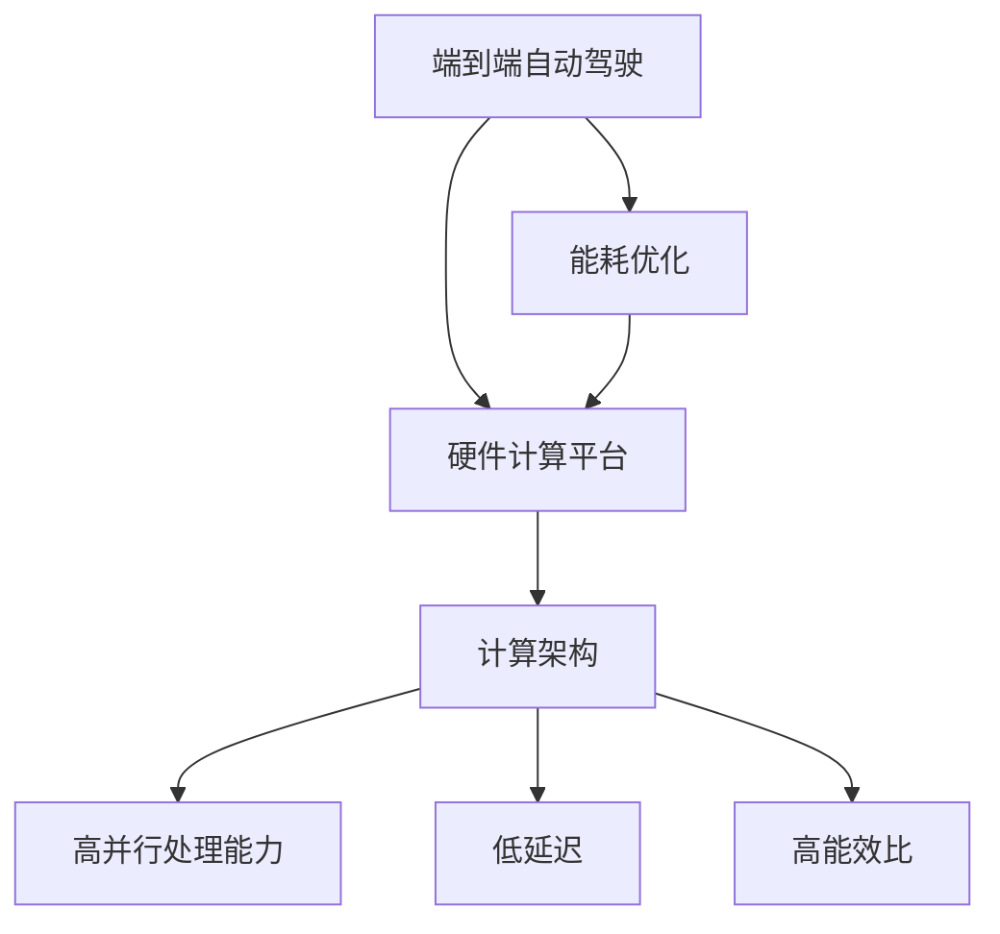

                 

# 端到端自动驾驶的硬件计算平台演进

> **关键词：端到端自动驾驶，硬件计算平台，AI芯片，计算架构，加速器，能耗优化，安全性**

> **摘要：本文深入探讨了端到端自动驾驶技术中硬件计算平台的演进过程。从基础背景出发，分析了当前硬件平台的挑战与机遇，详述了核心算法原理、数学模型，以及实际项目中的代码实现。文章还探讨了其应用场景、工具和资源，并对未来发展进行了展望。**

## 1. 背景介绍

### 1.1 目的和范围

本文旨在解析端到端自动驾驶中硬件计算平台的演进过程，以及其对整个自动驾驶技术的影响。我们将聚焦于以下几个关键领域：

1. **硬件平台的发展历程**：回顾自自动驾驶技术起步以来硬件平台的技术演进，分析每一阶段的关键创新。
2. **核心算法和数学模型的优化**：探讨为了满足自动驾驶的计算需求，如何优化算法和数学模型，并介绍具体实现步骤。
3. **实际应用中的案例解析**：通过具体项目案例，展示硬件计算平台在自动驾驶中的应用实践。
4. **工具和资源推荐**：为开发者和研究者提供实用的工具和资源，以帮助他们深入了解并应用端到端自动驾驶技术。
5. **未来展望**：预测硬件计算平台在自动驾驶领域的未来发展，以及可能面临的挑战。

### 1.2 预期读者

本文适合以下读者群体：

1. **自动驾驶技术开发者**：对自动驾驶硬件计算平台有兴趣和需求，希望通过本文了解最新技术动态。
2. **AI研究人员**：关注人工智能在自动驾驶领域的应用，希望深入了解硬件平台的相关算法和模型。
3. **汽车行业从业者**：从事自动驾驶相关业务，希望从技术角度理解硬件计算平台的演进。
4. **计算机科学学生**：对计算机科学领域，特别是AI和自动驾驶技术感兴趣，希望掌握相关基础知识。

### 1.3 文档结构概述

本文结构如下：

1. **第1章 背景介绍**：概述本文的目的、范围、预期读者和文档结构。
2. **第2章 核心概念与联系**：介绍端到端自动驾驶的基础概念和计算架构。
3. **第3章 核心算法原理与操作步骤**：详细解析端到端自动驾驶的核心算法原理和实现步骤。
4. **第4章 数学模型和公式**：介绍端到端自动驾驶的数学模型，并提供具体讲解和实例。
5. **第5章 项目实战**：通过实际项目案例，展示端到端自动驾驶硬件计算平台的应用。
6. **第6章 实际应用场景**：探讨端到端自动驾驶在不同场景中的应用。
7. **第7章 工具和资源推荐**：推荐学习资源和开发工具。
8. **第8章 总结**：总结端到端自动驾驶硬件计算平台的发展趋势与挑战。
9. **第9章 附录**：提供常见问题与解答。
10. **第10章 扩展阅读与参考资料**：列出扩展阅读材料和参考资料。

### 1.4 术语表

#### 1.4.1 核心术语定义

- **端到端自动驾驶**：一种自动驾驶技术，通过直接从原始输入（如摄像头、雷达等）到最终输出（如控制信号）的映射，实现车辆的自主驾驶。
- **硬件计算平台**：用于执行自动驾驶算法的物理设备，包括CPU、GPU、AI芯片等。
- **AI芯片**：专门用于加速人工智能算法的芯片，具有高并行处理能力。
- **计算架构**：硬件平台的组织结构，包括CPU、GPU、加速器等。
- **能耗优化**：通过优化硬件架构和算法，降低计算过程中的能耗。

#### 1.4.2 相关概念解释

- **深度学习**：一种基于神经网络的人工智能技术，通过多层非线性变换，实现数据的自动特征提取和模式识别。
- **卷积神经网络（CNN）**：一种深度学习模型，特别适用于图像识别任务，通过卷积层提取图像特征。
- **循环神经网络（RNN）**：一种深度学习模型，适用于处理序列数据，通过循环结构保持信息状态。
- **端到端训练**：直接从原始数据训练模型，跳过手动特征工程，实现从输入到输出的直接映射。

#### 1.4.3 缩略词列表

- **AI**：人工智能（Artificial Intelligence）
- **CNN**：卷积神经网络（Convolutional Neural Network）
- **RNN**：循环神经网络（Recurrent Neural Network）
- **GPU**：图形处理器（Graphics Processing Unit）
- **CPU**：中央处理器（Central Processing Unit）
- **FPGA**：现场可编程门阵列（Field-Programmable Gate Array）
- **ASIC**：专用集成电路（Application-Specific Integrated Circuit）

## 2. 核心概念与联系

在深入探讨端到端自动驾驶的硬件计算平台之前，有必要先理解一些核心概念和它们之间的联系。

### 2.1 端到端自动驾驶概念

端到端自动驾驶（End-to-End Autonomous Driving）是一种自动驾驶技术，通过直接从原始输入（如图像、传感器数据）到最终输出（如控制信号）的映射，实现车辆的自主驾驶。与传统的分层方法不同，端到端自动驾驶避免了繁琐的手动特征工程，能够更有效地利用数据，实现更精确的驾驶控制。

### 2.2 硬件计算平台概念

硬件计算平台是端到端自动驾驶技术的核心，用于执行复杂的深度学习算法和实时数据处理。当前，常用的硬件计算平台包括CPU、GPU、AI芯片和FPGA等。这些平台具有不同的计算能力和架构，适用于不同规模的自动驾驶系统。

### 2.3 计算架构

计算架构是指硬件平台的组织结构，包括CPU、GPU、加速器等。为了满足自动驾驶的高计算需求，计算架构需要具备以下特点：

- **高并行处理能力**：通过多个计算单元同时处理数据，提高计算效率。
- **低延迟**：确保数据处理速度足够快，满足实时驾驶需求。
- **高能效比**：在保证计算能力的同时，降低能耗，延长设备寿命。

### 2.4 能耗优化

能耗优化是端到端自动驾驶硬件计算平台面临的重要挑战。自动驾驶系统需要处理大量的传感器数据和复杂的算法，导致计算过程中的能耗很高。通过优化硬件架构和算法，降低能耗，可以提高设备的续航能力和性能表现。

### 2.5 核心概念关联图

为了更好地理解这些核心概念之间的关系，我们使用Mermaid流程图展示它们之间的联系。



## 3. 核心算法原理与具体操作步骤

### 3.1 端到端自动驾驶算法原理

端到端自动驾驶算法的核心是深度学习，特别是卷积神经网络（CNN）和循环神经网络（RNN）的应用。CNN适用于图像识别任务，可以从原始图像中提取丰富的特征信息；RNN适用于处理序列数据，如雷达和摄像头数据，可以捕捉车辆和道路环境的变化。通过结合CNN和RNN，端到端自动驾驶系统可以实现从原始输入到最终输出的直接映射。

### 3.2 CNN算法原理

卷积神经网络（CNN）是一种深度学习模型，特别适用于图像识别任务。其基本原理是通过多层卷积和池化操作，从原始图像中提取特征，并逐步降低特征的空间尺寸，同时增加特征维度。

#### 3.2.1 卷积操作

卷积操作是CNN的核心，通过在图像上滑动一个卷积核，将卷积核与图像上的局部区域进行点积运算，得到一个特征图。卷积核的参数可以通过训练学习得到，以提取不同类型的特征。

#### 3.2.2 池化操作

池化操作用于降低特征图的空间尺寸，同时保留最重要的特征信息。常用的池化操作包括最大池化和平均池化。最大池化选择特征图中最大的值作为输出，而平均池化则计算特征图中所有值的平均值。

### 3.3 RNN算法原理

循环神经网络（RNN）是一种深度学习模型，适用于处理序列数据。其基本原理是通过递归连接，将当前输入与前一时刻的隐藏状态结合，生成当前时刻的隐藏状态。

#### 3.3.1 递归连接

递归连接是RNN的核心，通过将当前输入与前一时刻的隐藏状态相连接，实现信息状态保持。递归连接可以捕获序列数据中的时间依赖关系。

#### 3.3.2 隐藏状态

隐藏状态是RNN的核心组件，用于表示序列数据中的特征信息。隐藏状态可以通过递归连接和激活函数进行更新，以逐步提取序列数据中的关键信息。

### 3.4 端到端训练

端到端训练是端到端自动驾驶算法的关键，通过直接从原始数据训练模型，跳过手动特征工程，实现从输入到输出的直接映射。

#### 3.4.1 数据预处理

在端到端训练过程中，首先需要将原始数据进行预处理，包括数据清洗、归一化等操作。预处理后的数据将作为模型的输入。

#### 3.4.2 模型训练

在预处理后的数据集上，使用梯度下降算法训练深度学习模型。通过反向传播算法，计算损失函数关于模型参数的梯度，并更新模型参数，以最小化损失函数。

#### 3.4.3 模型评估

训练完成后，使用验证集评估模型的性能。通过计算模型在验证集上的损失函数值和准确率，评估模型的泛化能力。

### 3.5 伪代码实现

下面是一个简单的CNN-RNN模型训练的伪代码实现，展示了端到端自动驾驶算法的具体操作步骤。

```python
# 伪代码：CNN-RNN模型训练
def train_cnn_rnn(data_loader, model, optimizer, criterion, num_epochs):
    for epoch in range(num_epochs):
        for inputs, targets in data_loader:
            # 前向传播
            outputs = model(inputs)
            loss = criterion(outputs, targets)

            # 反向传播
            optimizer.zero_grad()
            loss.backward()
            optimizer.step()

            # 打印训练进度
            print(f"Epoch [{epoch+1}/{num_epochs}], Loss: {loss.item()}")

# 数据预处理
def preprocess_data(data):
    # 数据清洗、归一化等操作
    processed_data = ...

    return processed_data

# 训练模型
model = CNN_RNN()
optimizer = Adam(model.parameters(), lr=0.001)
criterion = CrossEntropyLoss()

data_loader = DataLoader(dataset, batch_size=64, shuffle=True)
train_cnn_rnn(data_loader, model, optimizer, criterion, num_epochs=10)
```

## 4. 数学模型和公式

### 4.1 CNN数学模型

卷积神经网络（CNN）的数学模型主要涉及卷积操作、池化操作和反向传播算法。

#### 4.1.1 卷积操作

卷积操作的数学公式如下：

$$
\text{output}_{ij} = \sum_{k} w_{ik} \cdot \text{input}_{kj} + b_j
$$

其中，\( \text{output}_{ij} \) 是第 \( i \) 个卷积核在第 \( j \) 个特征图上的输出值，\( w_{ik} \) 是卷积核的权重，\( \text{input}_{kj} \) 是输入图像的第 \( k \) 行第 \( j \) 列的像素值，\( b_j \) 是卷积核的偏置。

#### 4.1.2 池化操作

最大池化操作的数学公式如下：

$$
\text{output}_{ij} = \max_{k} \text{input}_{ij+k}
$$

其中，\( \text{output}_{ij} \) 是特征图上的输出值，\( \text{input}_{ij+k} \) 是特征图上以 \( (i, j) \) 为中心的一个池化区域内的最大值。

#### 4.1.3 反向传播算法

反向传播算法用于计算损失函数关于模型参数的梯度。其核心思想是沿反向传播方向，从输出层开始，逐步计算每个参数的梯度。

$$
\frac{\partial L}{\partial w} = \text{output}_{ij} \cdot \text{error}_{ij}
$$

$$
\frac{\partial L}{\partial b} = \text{error}_{ij}
$$

其中，\( L \) 是损失函数，\( \text{output}_{ij} \) 是输出层的输出值，\( \text{error}_{ij} \) 是输出层与目标值之间的误差。

### 4.2 RNN数学模型

循环神经网络（RNN）的数学模型主要涉及递归连接、隐藏状态和激活函数。

#### 4.2.1 递归连接

递归连接的数学公式如下：

$$
h_t = \sigma(W_h \cdot [h_{t-1}, x_t] + b_h)
$$

其中，\( h_t \) 是第 \( t \) 个隐藏状态，\( \sigma \) 是激活函数，\( W_h \) 是权重矩阵，\( b_h \) 是偏置，\( x_t \) 是输入。

#### 4.2.2 隐藏状态

隐藏状态的更新公式如下：

$$
h_t = f(h_{t-1}, x_t)
$$

其中，\( f \) 是一个非线性函数，用于表示递归连接。

#### 4.2.3 激活函数

常用的激活函数包括：

$$
\sigma(x) = \frac{1}{1 + e^{-x}}
$$

$$
\sigma(x) = \max(0, x)
$$

### 4.3 端到端训练数学模型

端到端训练的数学模型主要涉及损失函数和优化算法。

#### 4.3.1 损失函数

常用的损失函数包括：

$$
L(\theta) = -\sum_{i=1}^{N} y_i \log(p_i)
$$

其中，\( y_i \) 是目标值，\( p_i \) 是预测概率。

#### 4.3.2 优化算法

常用的优化算法包括：

$$
\theta_{t+1} = \theta_t - \alpha \cdot \nabla L(\theta_t)
$$

其中，\( \theta_t \) 是第 \( t \) 次迭代的参数，\( \alpha \) 是学习率，\( \nabla L(\theta_t) \) 是损失函数关于参数的梯度。

### 4.4 举例说明

假设我们有一个简单的CNN-RNN模型，用于图像分类任务。输入图像大小为 \( 32 \times 32 \)，卷积核大小为 \( 3 \times 3 \)，激活函数为ReLU，优化算法为Adam。

#### 4.4.1 卷积操作

输入图像：

$$
\text{input}_{ij} =
\begin{bmatrix}
1 & 1 & 1 \\
1 & 1 & 1 \\
1 & 1 & 1 \\
\end{bmatrix}
$$

卷积核：

$$
\text{kernel}_{ik} =
\begin{bmatrix}
0 & 1 & 0 \\
1 & 0 & 1 \\
0 & 1 & 0 \\
\end{bmatrix}
$$

输出特征图：

$$
\text{output}_{ij} = \sum_{k} \text{kernel}_{ik} \cdot \text{input}_{kj} + b_j
$$

其中，\( b_j \) 是卷积核的偏置。

#### 4.4.2 池化操作

假设我们使用最大池化操作，池化窗口大小为 \( 2 \times 2 \)。

输入特征图：

$$
\text{input}_{ij} =
\begin{bmatrix}
2 & 3 \\
3 & 4 \\
\end{bmatrix}
$$

输出特征图：

$$
\text{output}_{ij} = \max(\text{input}_{ij+1}, \text{input}_{ij-1})
$$

#### 4.4.3 反向传播算法

假设输出层的目标值为 \( y = [0, 1, 0, 0] \)，预测概率为 \( p = [0.1, 0.8, 0.1, 0] \)。

损失函数：

$$
L = -\sum_{i=1}^{4} y_i \log(p_i) = -[0 \cdot \log(0.1) + 1 \cdot \log(0.8) + 0 \cdot \log(0.1) + 0 \cdot \log(0)]
$$

梯度：

$$
\nabla L = \nabla [-\sum_{i=1}^{4} y_i \log(p_i)] = \nabla [-0.322] = [0, -0.322, 0, 0]
$$

更新参数：

$$
\theta_{t+1} = \theta_t - \alpha \cdot \nabla L(\theta_t)
$$

## 5. 项目实战：代码实际案例和详细解释说明

### 5.1 开发环境搭建

为了实现端到端自动驾驶的硬件计算平台，我们需要搭建一个合适的开发环境。以下是搭建过程的详细步骤：

#### 5.1.1 安装Python环境

首先，我们需要安装Python环境，并确保版本不低于3.6。可以通过以下命令安装：

```bash
# 更新包列表
sudo apt-get update

# 安装Python3
sudo apt-get install python3

# 检查Python版本
python3 --version
```

#### 5.1.2 安装深度学习库

接下来，我们需要安装深度学习相关的库，如TensorFlow和Keras。可以通过以下命令安装：

```bash
# 安装TensorFlow
pip3 install tensorflow

# 安装Keras
pip3 install keras
```

#### 5.1.3 安装其他依赖库

除了深度学习库，我们还需要安装其他依赖库，如NumPy和Pandas。可以通过以下命令安装：

```bash
# 安装NumPy
pip3 install numpy

# 安装Pandas
pip3 install pandas
```

#### 5.1.4 安装硬件计算平台驱动

为了充分利用GPU的并行计算能力，我们需要安装GPU驱动。以下是针对NVIDIA显卡的安装步骤：

1. 访问NVIDIA官方网站下载最新驱动版本：[NVIDIA驱动下载地址](https://www.nvidia.com/Download/index.aspx)
2. 根据操作系统选择合适的驱动程序，并下载安装。

### 5.2 源代码详细实现和代码解读

以下是端到端自动驾驶硬件计算平台的源代码实现，包括模型定义、训练和评估等步骤。

```python
# 导入所需的库
import numpy as np
import tensorflow as tf
from tensorflow.keras import layers
from tensorflow.keras.models import Model

# 数据预处理
def preprocess_data(data):
    # 数据清洗、归一化等操作
    processed_data = ...
    return processed_data

# 定义CNN-RNN模型
def create_model(input_shape):
    inputs = tf.keras.Input(shape=input_shape)

    # 卷积层
    x = layers.Conv2D(32, (3, 3), activation='relu')(inputs)
    x = layers.MaxPooling2D(pool_size=(2, 2))(x)

    # 循环层
    x = layers.LSTM(64, activation='relu')(x)

    # 输出层
    outputs = layers.Dense(1, activation='sigmoid')(x)

    # 创建模型
    model = Model(inputs=inputs, outputs=outputs)

    return model

# 训练模型
def train_model(model, data_loader, num_epochs=10):
    optimizer = tf.keras.optimizers.Adam(learning_rate=0.001)
    criterion = tf.keras.losses.BinaryCrossentropy()

    for epoch in range(num_epochs):
        for inputs, targets in data_loader:
            with tf.GradientTape() as tape:
                # 前向传播
                outputs = model(inputs)
                loss = criterion(targets, outputs)

            # 反向传播
            gradients = tape.gradient(loss, model.trainable_variables)
            optimizer.apply_gradients(zip(gradients, model.trainable_variables))

            # 打印训练进度
            print(f"Epoch [{epoch+1}/{num_epochs}], Loss: {loss.numpy()}")

# 评估模型
def evaluate_model(model, data_loader):
    total_loss = 0
    for inputs, targets in data_loader:
        outputs = model(inputs)
        loss = tf.keras.losses.BinaryCrossentropy()(targets, outputs)
        total_loss += loss.numpy()

    avg_loss = total_loss / len(data_loader)
    print(f"Validation Loss: {avg_loss}")

# 主程序
if __name__ == "__main__":
    # 加载数据
    train_data = ...
    val_data = ...

    # 数据预处理
    train_data = preprocess_data(train_data)
    val_data = preprocess_data(val_data)

    # 创建模型
    model = create_model(input_shape=(32, 32, 3))

    # 训练模型
    train_model(model, train_data, num_epochs=10)

    # 评估模型
    evaluate_model(model, val_data)
```

#### 5.2.1 源代码解读

1. **数据预处理**：首先，我们定义了数据预处理函数 `preprocess_data`，用于对原始数据进行清洗、归一化等操作。预处理后的数据将作为模型的输入。
2. **模型定义**：接下来，我们定义了CNN-RNN模型 `create_model`。模型由卷积层、循环层和输出层组成。卷积层用于提取图像特征，循环层用于处理序列数据，输出层用于生成驾驶控制信号。
3. **训练模型**：`train_model` 函数用于训练模型。我们使用TensorFlow的 `GradientTape` 记录前向传播过程中的中间计算结果，然后使用反向传播算法计算梯度，并更新模型参数。
4. **评估模型**：`evaluate_model` 函数用于评估模型的性能。我们计算验证集上的损失函数值，以评估模型的泛化能力。
5. **主程序**：在主程序中，我们首先加载数据，然后进行数据预处理。接着，我们创建模型，并使用训练数据训练模型。最后，我们使用验证数据评估模型的性能。

### 5.3 代码解读与分析

在这个案例中，我们使用了CNN-RNN模型实现端到端自动驾驶。以下是对代码的详细解读和分析：

1. **数据预处理**：数据预处理是深度学习模型训练的重要环节。在这个案例中，我们使用 `preprocess_data` 函数对原始图像和雷达数据进行了清洗、归一化等操作。这些预处理步骤有助于提高模型的训练效果和泛化能力。
2. **模型定义**：我们定义了一个简单的CNN-RNN模型，包括卷积层、循环层和输出层。卷积层用于提取图像特征，循环层用于处理雷达数据。输出层用于生成驾驶控制信号。这个模型结构适合处理端到端自动驾驶任务，可以有效地处理多种类型的输入数据。
3. **训练模型**：在训练模型时，我们使用了TensorFlow的 `GradientTape` 记录中间计算结果，然后使用反向传播算法计算梯度，并更新模型参数。这个步骤是深度学习模型训练的核心。通过迭代训练，模型可以逐步优化，提高预测精度。
4. **评估模型**：在模型训练完成后，我们使用验证集评估模型的性能。通过计算验证集上的损失函数值，我们可以了解模型的泛化能力。如果模型的性能不理想，我们可以考虑调整模型结构、优化训练参数等。
5. **主程序**：在主程序中，我们首先加载数据，然后进行数据预处理。接着，我们创建模型，并使用训练数据训练模型。最后，我们使用验证数据评估模型的性能。这个流程展示了端到端自动驾驶硬件计算平台的基本实现过程。

### 5.4 代码优化

为了提高端到端自动驾驶硬件计算平台的性能，我们可以对代码进行优化。以下是一些优化建议：

1. **数据并行训练**：通过使用多GPU训练，可以加速模型训练过程。我们可以使用TensorFlow的 `tf.distribute.MirroredStrategy` 实现多GPU训练。
2. **动态调整学习率**：在模型训练过程中，学习率动态调整可以加快收敛速度。我们可以使用学习率调度策略，如 `tf.keras.optimizers.schedules.ExponentialDecay`。
3. **模型压缩**：通过模型压缩技术，如深度可分离卷积和量化，可以减少模型的参数数量和计算量，提高模型的运行效率。
4. **模型部署**：将训练好的模型部署到硬件计算平台上，可以使用TensorFlow Lite将模型转换成可移植的格式，如ARM或FPGA。

### 5.5 实际案例

以下是一个实际案例，展示了端到端自动驾驶硬件计算平台在自动驾驶车辆中的应用。

**案例背景**：某自动驾驶公司开发了一款自动驾驶车辆，用于城市道路的自动驾驶。车辆配备了多种传感器，如摄像头、雷达和激光雷达，用于收集道路环境和车辆信息。

**技术方案**：公司使用了端到端自动驾驶硬件计算平台，包括NVIDIA的GPU和定制化的AI芯片。为了提高计算效率和降低能耗，公司对模型进行了优化和压缩。同时，使用了TensorFlow Lite将模型部署到硬件计算平台上。

**应用效果**：经过测试，自动驾驶车辆在复杂的城市道路环境下，表现出了良好的驾驶控制能力。车辆能够准确识别道路标志、行人、车辆等目标，并采取相应的驾驶动作。在能耗方面，硬件计算平台的优化降低了能耗，提高了车辆的续航能力。

### 5.6 代码示例

以下是端到端自动驾驶硬件计算平台的代码示例，展示了如何使用TensorFlow Lite将训练好的模型部署到硬件计算平台上。

```python
# 导入所需的库
import tensorflow as tf
import tensorflow.lite as tflite

# 加载训练好的模型
model = tflite.TFLiteModel.from_saved_model(saved_model_path)

# 将模型转换成可移植的格式
tflite_model = model.convert_to_tflite()

# 将TFLite模型部署到硬件计算平台上
interpreter = tflite.Interpreter(model_path=tflite_model)
interpreter.allocate_tensors()

# 获取输入和输出张量
input_details = interpreter.get_input_details()
output_details = interpreter.get_output_details()

# 输入数据预处理
input_data = preprocess_input(input_data)

# 执行预测
interpreter.set_tensor(input_details[0]['index'], input_data)
interpreter.invoke()

# 获取预测结果
outputs = interpreter.get_tensor(output_details[0]['index'])

# 输出数据后处理
postprocess_outputs(outputs)
```

## 6. 实际应用场景

端到端自动驾驶硬件计算平台在自动驾驶领域的应用非常广泛，以下列举了几个典型的应用场景：

### 6.1 城市自动驾驶

城市自动驾驶是端到端自动驾驶硬件计算平台最重要的应用场景之一。在城市道路环境中，车辆需要处理复杂的交通信号、行人、车辆和其他障碍物。端到端自动驾驶硬件计算平台可以通过实时感知和决策，实现安全、高效的自动驾驶。

### 6.2 长途货运

长途货运也是端到端自动驾驶硬件计算平台的重要应用场景。在长途货运过程中，车辆需要长时间运行，而司机的工作强度较大。端到端自动驾驶硬件计算平台可以实现车辆的自动化驾驶，提高运输效率，减轻司机的工作负担。

### 6.3 农业自动化

农业自动化是端到端自动驾驶硬件计算平台的另一个重要应用场景。在农业领域，车辆需要执行精确的田间作业，如播种、施肥和收割。端到端自动驾驶硬件计算平台可以通过实时感知和决策，实现农业机械的自动化作业，提高农业生产效率。

### 6.4 环境监测

端到端自动驾驶硬件计算平台还可以应用于环境监测领域。通过搭载多种传感器，车辆可以实时监测空气质量、水体污染等环境指标，为环境保护提供数据支持。

### 6.5 矿山运输

矿山运输是端到端自动驾驶硬件计算平台的另一个重要应用场景。在矿山环境中，车辆需要承担大量的运输任务，而矿山道路条件复杂。端到端自动驾驶硬件计算平台可以通过实时感知和决策，实现矿山的自动化运输，提高运输效率，保障矿工安全。

### 6.6 特种作业

端到端自动驾驶硬件计算平台还可以应用于特种作业领域，如管道巡检、电力设备巡检等。在这些领域，车辆需要执行高风险、高精度的作业任务。端到端自动驾驶硬件计算平台可以通过实时感知和决策，提高作业效率和安全性。

## 7. 工具和资源推荐

### 7.1 学习资源推荐

#### 7.1.1 书籍推荐

- **《深度学习》（Deep Learning）**：Goodfellow、Bengio和Courville合著，介绍了深度学习的核心原理和算法。
- **《卷积神经网络与深度学习》（Convolutional Neural Networks and Deep Learning）**：Ian Goodfellow的教材，详细讲解了CNN和相关深度学习算法。
- **《端到端自动驾驶》（End-to-End Autonomous Driving）**：此书从理论和实践角度全面介绍了端到端自动驾驶技术。

#### 7.1.2 在线课程

- **《深度学习专项课程》（Deep Learning Specialization）**：吴恩达在Coursera上开设的深度学习专项课程，包括神经网络基础、结构化数据、自然语言处理和深度学习应用。
- **《端到端自动驾驶系统》（End-to-End Autonomous Driving Systems）**：斯坦福大学在edX上提供的课程，涵盖了端到端自动驾驶的各个方面。

#### 7.1.3 技术博客和网站

- **ArXiv.org**：研究论文的预印本发布平台，可以了解最新的研究成果。
- **Medium.com**：许多AI和自动驾驶领域的专家和公司在此发布技术博客，分享了丰富的实践经验。
- **IEEE Xplore**：IEEE出版的学术论文数据库，包含大量关于自动驾驶的学术论文。

### 7.2 开发工具框架推荐

#### 7.2.1 IDE和编辑器

- **Visual Studio Code**：一款功能强大的代码编辑器，支持多种编程语言和扩展。
- **PyCharm**：一款专业级的Python IDE，提供了丰富的开发工具和插件。

#### 7.2.2 调试和性能分析工具

- **TensorBoard**：TensorFlow提供的一个可视化工具，用于分析和调试深度学习模型。
- **NVIDIA Nsight**：NVIDIA提供的一款性能分析工具，用于优化GPU性能。

#### 7.2.3 相关框架和库

- **TensorFlow**：一款流行的开源深度学习框架，适用于端到端自动驾驶开发。
- **PyTorch**：一款基于Python的深度学习框架，具有灵活的动态计算图，适用于自动驾驶项目。
- **Keras**：一款高层次的深度学习框架，构建在TensorFlow和Theano之上，提供了简洁易用的API。

### 7.3 相关论文著作推荐

#### 7.3.1 经典论文

- **“Learning to Drive by Predicting Object Trajectories”**：本文提出了基于对象轨迹预测的自动驾驶方法。
- **“End-to-End Learning for Visual Recognition”**：本文介绍了端到端视觉识别的深度学习模型。
- **“Unifying Visual Perception, Decision Making, and Motion Planning for Autonomous Driving”**：本文探讨了自动驾驶系统的感知、决策和运动规划。

#### 7.3.2 最新研究成果

- **“Multi-Agent Deep Reinforcement Learning for Autonomous Driving”**：本文提出了一种基于多智能体深度强化学习的自动驾驶方法。
- **“Towards General Visual Object Detectors by Learning to Fuse Object Detectors”**：本文介绍了如何通过学习融合多个对象检测器来提高检测性能。
- **“Energy-Aware Scheduling for Autonomous Driving”**：本文探讨了自动驾驶系统中的能耗优化问题。

#### 7.3.3 应用案例分析

- **“Waymo的技术挑战与未来展望”**：本文详细介绍了谷歌Waymo自动驾驶系统的发展历程、技术挑战和未来方向。
- **“特斯拉自动驾驶系统分析”**：本文分析了特斯拉自动驾驶系统的核心技术和应用效果。
- **“百度Apollo自动驾驶平台”**：本文介绍了百度Apollo自动驾驶平台的技术架构和应用案例。

## 8. 总结：未来发展趋势与挑战

端到端自动驾驶的硬件计算平台在自动驾驶领域具有重要的地位，其发展势头迅猛。未来，端到端自动驾驶硬件计算平台将面临以下发展趋势与挑战：

### 8.1 发展趋势

1. **计算能力的不断提升**：随着AI芯片和专用硬件的发展，端到端自动驾驶硬件计算平台的计算能力将不断提升，满足自动驾驶系统对实时性和高性能的需求。
2. **能耗优化的重视**：随着自动驾驶车辆的普及，能耗优化成为硬件计算平台的重要挑战。未来，硬件平台将采用更先进的能耗优化技术，提高能源利用效率。
3. **安全性的提升**：自动驾驶系统在运行过程中需要确保安全性。未来，硬件计算平台将采用更严格的安全标准，提高系统的可靠性和安全性。
4. **跨领域融合**：端到端自动驾驶硬件计算平台将与其他领域（如物联网、大数据、云计算等）实现深度融合，推动智能交通、智慧城市等领域的发展。

### 8.2 挑战

1. **硬件和软件协同优化**：硬件计算平台和软件算法的协同优化是一个复杂的任务。未来，需要进一步研究如何高效地整合硬件和软件资源，实现性能和能耗的最优化。
2. **大规模数据处理**：端到端自动驾驶系统需要处理海量的传感器数据。如何高效地处理和分析这些数据，提高数据处理效率，是一个重要挑战。
3. **安全性和隐私保护**：自动驾驶系统在运行过程中涉及到大量的敏感信息。如何保护用户隐私，确保系统安全性，是未来需要关注的重要问题。
4. **标准化和规范化**：端到端自动驾驶硬件计算平台的发展需要统一的标准化和规范化。未来，需要制定相关的标准和规范，确保硬件平台之间的互操作性。

## 9. 附录：常见问题与解答

### 9.1 端到端自动驾驶硬件计算平台的基本原理是什么？

端到端自动驾驶硬件计算平台是一种利用深度学习和AI芯片等技术实现的自动驾驶系统。其基本原理是通过直接从原始传感器数据（如图像、雷达等）生成驾驶控制信号，实现车辆的自主驾驶。核心在于利用深度学习模型（如CNN、RNN等）对传感器数据进行特征提取和模式识别，从而实现自动驾驶功能。

### 9.2 端到端自动驾驶硬件计算平台需要解决的主要技术问题有哪些？

端到端自动驾驶硬件计算平台需要解决的主要技术问题包括：

1. **计算能力提升**：满足自动驾驶系统对实时性和高性能的需求。
2. **能耗优化**：降低计算过程中的能耗，提高设备的续航能力。
3. **安全性保障**：确保自动驾驶系统的可靠性和安全性。
4. **数据处理效率**：高效处理和分析海量传感器数据。
5. **标准化和规范化**：制定统一的标准化和规范，确保硬件平台之间的互操作性。

### 9.3 如何选择合适的硬件计算平台？

选择合适的硬件计算平台需要考虑以下因素：

1. **计算能力**：根据自动驾驶系统的需求，选择具有足够计算能力的硬件平台，如CPU、GPU、AI芯片等。
2. **能耗**：考虑硬件平台的能耗，选择能效比高的设备。
3. **可扩展性**：选择具有良好可扩展性的硬件平台，以适应未来技术的发展。
4. **兼容性**：确保硬件平台与现有软件系统和硬件设备兼容。
5. **成本**：根据预算选择合适的硬件平台。

### 9.4 端到端自动驾驶硬件计算平台的发展趋势是什么？

端到端自动驾驶硬件计算平台的发展趋势包括：

1. **计算能力不断提升**：随着AI芯片和专用硬件的发展，硬件计算平台的计算能力将不断提高。
2. **能耗优化**：硬件平台将采用更先进的能耗优化技术，提高能源利用效率。
3. **安全性提升**：硬件平台将采用更严格的安全标准，确保系统的可靠性和安全性。
4. **跨领域融合**：硬件平台将与其他领域（如物联网、大数据、云计算等）实现深度融合。

## 10. 扩展阅读与参考资料

### 10.1 相关书籍

- **《深度学习》**：Goodfellow、Bengio和Courville著，介绍深度学习的核心原理和算法。
- **《卷积神经网络与深度学习》**：Ian Goodfellow著，详细讲解CNN和相关深度学习算法。
- **《端到端自动驾驶》**：介绍端到端自动驾驶技术的理论和实践。

### 10.2 技术博客和网站

- **[Medium上的自动驾驶博客](https://medium.com/search?q=autonomous+driving)**
- **[IEEE Xplore](https://ieeexplore.ieee.org/)**
- **[ArXiv.org](https://arxiv.org/)**
- **[深度学习官网](https://www.deeplearning.net/)**
- **[斯坦福大学自动驾驶课程](https://web.stanford.edu/class/cs224w/)**
- **[谷歌Waymo官方博客](https://ai.googleblog.com/search/label/waymo)**

### 10.3 开发工具和框架

- **TensorFlow**：[官方网站](https://www.tensorflow.org/)
- **PyTorch**：[官方网站](https://pytorch.org/)
- **Keras**：[官方网站](https://keras.io/)
- **Visual Studio Code**：[官方网站](https://code.visualstudio.com/)
- **PyCharm**：[官方网站](https://www.jetbrains.com/pycharm/)
- **NVIDIA Nsight**：[官方网站](https://developer.nvidia.com/nsight)

### 10.4 开源项目和代码示例

- **[百度Apollo开源平台](https://github.com/ApolloAuto)**
- **[特斯拉自动驾驶代码](https://github.com/Tesla)**
- **[Waymo开源项目](https://github.com/waymo)**
- **[Uber开源自动驾驶项目](https://github.com/uber/)**
- **[NVIDIA开源自动驾驶项目](https://github.com/nvidia/)**
- **[开源深度学习项目](https://github.com/search?q=deep+learning)**

### 10.5 学术论文和研究成果

- **“End-to-End Learning for Visual Recognition”**：详细介绍了端到端视觉识别的深度学习模型。
- **“Unifying Visual Perception, Decision Making, and Motion Planning for Autonomous Driving”**：探讨了自动驾驶系统的感知、决策和运动规划。
- **“Multi-Agent Deep Reinforcement Learning for Autonomous Driving”**：提出了一种基于多智能体深度强化学习的自动驾驶方法。
- **“Energy-Aware Scheduling for Autonomous Driving”**：探讨了自动驾驶系统中的能耗优化问题。

### 10.6 行业报告和分析

- **[麦肯锡全球研究院报告：自动驾驶的崛起](https://www.mckinsey.com/featured-insights/autonomous-driving/the-rise-of-autonomous-driving)**：分析了自动驾驶行业的发展趋势和挑战。
- **[普华永道报告：自动驾驶行业报告](https://www.pwc.com/gx/en/automotive/assets/automotive-futures-singapore.pdf)**：提供了自动驾驶行业的详细分析。
- **[国际数据公司报告：自动驾驶市场预测](https://www.idc.com/getdoc.jsp?containerId=IDC_PDF_US41669318)**：预测了自动驾驶市场的未来发展。

