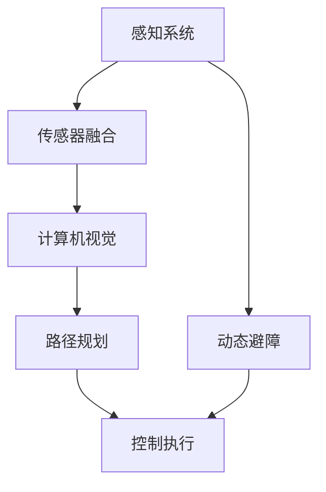

                 

# 端到端自动驾驶的自主货运配送服务

> 关键词：自动驾驶、货运配送、端到端学习、深度学习、计算机视觉、传感器融合、实时决策

> 摘要：本文将深入探讨端到端自动驾驶技术在自主货运配送服务中的应用。我们首先介绍自动驾驶的核心概念和货运配送的挑战，随后详细解析端到端学习在自动驾驶中的作用，以及计算机视觉和传感器融合技术如何实现精确的路径规划和动态避障。通过具体案例，我们展示了如何在实际项目中构建和部署一套端到端的自动驾驶货运配送系统，并对其性能和安全性进行了评估。文章最后讨论了未来发展趋势与面临的挑战，为读者提供了进一步的学习资源和工具推荐。

## 1. 背景介绍

### 1.1 目的和范围

本文旨在探讨如何利用端到端自动驾驶技术来实现高效的自主货运配送服务。随着人工智能和深度学习技术的不断发展，自动驾驶技术逐渐从理论走向实际应用，成为物流行业的重要创新点。本文将重点关注以下几个方面：

1. **自动驾驶技术概述**：介绍自动驾驶技术的核心组成部分和主要发展阶段。
2. **货运配送挑战**：分析货运配送过程中遇到的物流、法规和安全等问题。
3. **端到端学习在自动驾驶中的应用**：探讨端到端学习技术在自动驾驶系统设计和实现中的作用。
4. **计算机视觉和传感器融合**：阐述如何利用计算机视觉和传感器融合技术实现精确的路径规划和避障。
5. **项目实战**：通过具体案例展示如何构建和部署一套端到端的自动驾驶货运配送系统。
6. **性能评估**：对实际部署的系统进行性能和安全性评估。
7. **未来发展趋势与挑战**：讨论自动驾驶货运配送技术的发展趋势和面临的挑战。

### 1.2 预期读者

本文适合以下读者群体：

1. **自动驾驶技术研究人员**：对自动驾驶技术感兴趣的学者和研究人员。
2. **物流行业从业者**：希望了解自动驾驶技术在货运配送中的应用及其带来的变革。
3. **软件开发人员**：对深度学习和计算机视觉技术有基础知识的程序员和工程师。
4. **对技术创新感兴趣的读者**：关注人工智能和自动驾驶技术发展，希望了解前沿技术的应用场景。

### 1.3 文档结构概述

本文结构如下：

1. **第1章 背景介绍**：介绍本文的目的、预期读者以及文档结构。
2. **第2章 核心概念与联系**：介绍自动驾驶和货运配送的核心概念，并给出相应的Mermaid流程图。
3. **第3章 核心算法原理与具体操作步骤**：讲解端到端学习在自动驾驶中的应用，以及如何进行路径规划和避障。
4. **第4章 数学模型和公式**：详细阐述自动驾驶系统中的数学模型和公式。
5. **第5章 项目实战**：通过具体案例展示如何构建和部署一套端到端的自动驾驶货运配送系统。
6. **第6章 实际应用场景**：讨论自动驾驶货运配送服务的实际应用场景。
7. **第7章 工具和资源推荐**：推荐相关学习资源和开发工具。
8. **第8章 总结：未来发展趋势与挑战**：总结本文内容和未来发展趋势。
9. **第9章 附录：常见问题与解答**：解答读者可能遇到的常见问题。
10. **第10章 扩展阅读与参考资料**：提供进一步阅读的资料。

### 1.4 术语表

#### 1.4.1 核心术语定义

- **自动驾驶**：指利用计算机视觉、传感器融合和深度学习等技术实现车辆自主行驶的过程。
- **端到端学习**：指直接从原始数据（如视频、图像等）到目标输出（如行驶路径、避障决策等）的学习过程。
- **货运配送**：指将货物从起点运输到目的地的过程，涉及物流管理、车辆调度、路径规划等。
- **计算机视觉**：指利用计算机对图像或视频进行分析和处理的技术。
- **传感器融合**：指将多个传感器（如摄像头、激光雷达、GPS等）的数据进行综合处理，以提高系统的感知能力。
- **深度学习**：一种人工智能技术，通过多层神经网络对数据进行自动特征提取和学习。

#### 1.4.2 相关概念解释

- **路径规划**：指在给定的环境和起点、终点条件下，确定车辆行驶路径的过程。
- **动态避障**：指在车辆行驶过程中，实时检测并避开障碍物的过程。
- **传感器数据预处理**：指对传感器数据进行滤波、去噪、归一化等预处理操作，以提高数据质量。
- **训练集和测试集**：在机器学习过程中，将数据集分为训练集和测试集，用于模型训练和评估。

#### 1.4.3 缩略词列表

- **AI**：人工智能
- **CV**：计算机视觉
- **SLAM**：同时定位与地图构建
- **GPS**：全球定位系统
- **Lidar**：激光雷达
- **DNN**：深度神经网络
- **CNN**：卷积神经网络
- **RNN**：循环神经网络
- **GAN**：生成对抗网络

## 2. 核心概念与联系

在自动驾驶系统中，核心概念包括感知、规划和控制。为了实现这些功能，需要依赖计算机视觉、传感器融合和深度学习等技术。以下是一个简化的Mermaid流程图，展示了自动驾驶系统中的核心概念和联系。



### 2.1 感知系统

感知系统是自动驾驶系统的核心组成部分，主要负责从环境中获取信息，包括：

- **摄像头**：用于捕捉车辆周围的图像。
- **激光雷达（Lidar）**：用于测量车辆与周围物体的距离。
- **GPS**：用于确定车辆的地理位置。
- **IMU**：用于测量车辆的加速度和角速度。

传感器数据通过传感器融合技术进行处理，以提高系统的感知能力。

### 2.2 传感器融合

传感器融合技术是将多个传感器数据进行综合处理的过程，以获得更准确和全面的信息。传感器融合方法包括：

- **卡尔曼滤波**：用于对传感器数据进行滤波和预测。
- **粒子滤波**：用于在不确定环境下进行目标跟踪。
- **贝叶斯滤波**：用于在不确定环境下进行状态估计。

传感器融合技术能够有效地提高自动驾驶系统的感知能力，为后续的路径规划和控制提供可靠的数据支持。

### 2.3 计算机视觉

计算机视觉技术用于对摄像头捕捉的图像进行处理和分析，以识别车辆周围的物体和环境特征。计算机视觉方法包括：

- **图像预处理**：包括滤波、边缘检测、特征提取等。
- **目标检测**：用于识别图像中的车辆、行人、交通标志等。
- **目标跟踪**：用于跟踪车辆和行人的运动轨迹。
- **场景理解**：包括交通规则理解、交通场景理解等。

计算机视觉技术为自动驾驶系统提供了关键的信息，以支持路径规划和控制。

### 2.4 路径规划

路径规划是自动驾驶系统的核心功能之一，其目标是在给定的环境和起点、终点条件下，确定车辆的行驶路径。路径规划方法包括：

- **基于图的方法**：如Dijkstra算法、A*算法等。
- **基于采样的方法**：如RRT、RRT*等。
- **基于规划的算法**：如基于混合整数规划的方法。

路径规划算法需要考虑道路几何、交通规则、障碍物等因素，以确保车辆能够安全、高效地到达目的地。

### 2.5 控制执行

控制执行是将路径规划结果转化为实际动作的过程。控制执行方法包括：

- **PID控制**：一种常见的控制方法，适用于对车辆速度和转向进行控制。
- **模型预测控制（MPC）**：一种先进的控制方法，适用于非线性系统的控制。
- **深度强化学习**：利用深度神经网络和强化学习算法进行控制。

控制执行需要考虑车辆的动力学模型、控制系统特性等因素，以确保车辆能够按照规划的路径行驶。

### 2.6 动态避障

动态避障是自动驾驶系统在行驶过程中需要处理的一个重要问题。动态避障方法包括：

- **基于规则的避障**：根据交通规则和车辆行为进行避障。
- **基于机器学习的避障**：利用深度学习算法进行避障。
- **基于物理的避障**：根据物体的物理特性进行避障。

动态避障需要实时检测并分析周围环境，以在紧急情况下及时做出决策，确保车辆和行人的安全。

## 3. 核心算法原理与具体操作步骤

端到端学习技术在自动驾驶系统中起着至关重要的作用。本节将详细解析端到端学习在自动驾驶系统中的核心算法原理和具体操作步骤，包括路径规划、动态避障和传感器数据预处理等。

### 3.1 路径规划算法原理

路径规划是自动驾驶系统的核心功能之一，其目标是确定车辆从起点到终点的最优行驶路径。端到端路径规划算法通常采用深度学习技术，通过训练一个神经网络模型来实现。

**算法原理：**

1. **数据预处理**：将原始地图数据（如高德地图、百度地图等）转换为神经网络输入格式。具体步骤包括：
   - 地图数据下采样：将高分辨率的地图数据转换为较低分辨率的网格地图。
   - 网格编码：将每个网格点编码为一个向量，用于表示其位置信息。

2. **神经网络模型**：设计一个深度神经网络模型，用于预测从起点到终点的路径。常用的神经网络模型包括：
   - **卷积神经网络（CNN）**：用于提取图像特征。
   - **循环神经网络（RNN）**：用于处理时间序列数据。
   - **生成对抗网络（GAN）**：用于生成高质量的路径。

3. **训练过程**：使用大量的训练数据进行模型训练，具体步骤如下：
   - **数据增强**：通过旋转、缩放、裁剪等方式对训练数据进行增强，以提高模型泛化能力。
   - **损失函数**：使用损失函数（如均方误差、交叉熵等）来评估模型预测与真实路径之间的差距。
   - **优化算法**：使用优化算法（如梯度下降、Adam等）来更新模型参数。

4. **模型评估**：使用测试集对模型进行评估，具体指标包括路径准确性、路径长度、路径平滑度等。

**伪代码：**

```python
# 路径规划算法伪代码
def path_planning(start, goal, map_data):
    # 数据预处理
    grid_map = preprocess_map(map_data)
    start编码 = encode_grid(start, grid_map)
    goal编码 = encode_grid(goal, grid_map)
    
    # 神经网络模型
    model = build_model()
    
    # 训练过程
    for epoch in range(num_epochs):
        for batch in train_data:
            input_data = preprocess_batch(batch)
            label = compute_label(batch, goal)
            loss = compute_loss(model, input_data, label)
            update_model(model, loss)
    
    # 模型评估
    accuracy = evaluate_model(model, test_data)
    return generate_path(model, start编码, goal编码)

# 数据预处理
def preprocess_map(map_data):
    # 省略具体实现

def encode_grid(grid_point, grid_map):
    # 省略具体实现

# 神经网络模型
def build_model():
    # 省略具体实现

# 训练过程
def update_model(model, loss):
    # 省略具体实现

def compute_loss(model, input_data, label):
    # 省略具体实现

def evaluate_model(model, test_data):
    # 省略具体实现

def generate_path(model, start编码, goal编码):
    # 省略具体实现
```

### 3.2 动态避障算法原理

动态避障是自动驾驶系统在行驶过程中需要处理的一个重要问题。端到端动态避障算法通常采用深度学习技术，通过训练一个神经网络模型来实现。

**算法原理：**

1. **数据预处理**：将传感器数据（如摄像头图像、激光雷达点云等）转换为神经网络输入格式。具体步骤包括：
   - 数据归一化：将传感器数据归一化到同一尺度。
   - 帧序列编码：将连续的传感器帧编码为一个三维张量。

2. **神经网络模型**：设计一个深度神经网络模型，用于预测避障决策。常用的神经网络模型包括：
   - **卷积神经网络（CNN）**：用于提取图像特征。
   - **循环神经网络（RNN）**：用于处理时间序列数据。
   - **生成对抗网络（GAN）**：用于生成高质量的避障决策。

3. **训练过程**：使用大量的训练数据进行模型训练，具体步骤如下：
   - **数据增强**：通过旋转、缩放、裁剪等方式对训练数据进行增强，以提高模型泛化能力。
   - **损失函数**：使用损失函数（如均方误差、交叉熵等）来评估模型预测与真实避障决策之间的差距。
   - **优化算法**：使用优化算法（如梯度下降、Adam等）来更新模型参数。

4. **模型评估**：使用测试集对模型进行评估，具体指标包括避障准确性、避障响应时间、避障稳定性等。

**伪代码：**

```python
# 动态避障算法伪代码
def obstacle_avoidance(sensor_data):
    # 数据预处理
    processed_data = preprocess_data(sensor_data)
    
    # 神经网络模型
    model = build_model()
    
    # 训练过程
    for epoch in range(num_epochs):
        for batch in train_data:
            input_data = preprocess_batch(batch)
            label = compute_label(batch)
            loss = compute_loss(model, input_data, label)
            update_model(model, loss)
    
    # 模型评估
    accuracy = evaluate_model(model, test_data)
    return generate_decision(model, processed_data)

# 数据预处理
def preprocess_data(sensor_data):
    # 省略具体实现

# 神经网络模型
def build_model():
    # 省略具体实现

# 训练过程
def update_model(model, loss):
    # 省略具体实现

def compute_loss(model, input_data, label):
    # 省略具体实现

def evaluate_model(model, test_data):
    # 省略具体实现

def generate_decision(model, processed_data):
    # 省略具体实现
```

### 3.3 传感器数据预处理

传感器数据预处理是自动驾驶系统中的关键步骤，其目标是对传感器数据进行滤波、去噪、归一化等处理，以提高系统的感知能力。

**算法原理：**

1. **滤波**：使用滤波算法（如卡尔曼滤波、粒子滤波等）对传感器数据进行滤波，去除噪声和干扰。

2. **去噪**：使用去噪算法（如小波变换、高斯滤波等）对传感器数据进行去噪，以提高数据质量。

3. **归一化**：将传感器数据归一化到同一尺度，以便后续处理。

4. **特征提取**：使用特征提取算法（如SIFT、SURF等）对传感器数据进行特征提取，以提高系统的识别能力。

**伪代码：**

```python
# 传感器数据预处理伪代码
def preprocess_sensor_data(sensor_data):
    # 滤波
    filtered_data = kalman_filter(sensor_data)
    
    # 去噪
    denoised_data = denoise_data(filtered_data)
    
    # 归一化
    normalized_data = normalize_data(denoised_data)
    
    # 特征提取
    features = extract_features(normalized_data)
    
    return features

# 滤波
def kalman_filter(sensor_data):
    # 省略具体实现

# 去噪
def denoise_data(sensor_data):
    # 省略具体实现

# 归一化
def normalize_data(sensor_data):
    # 省略具体实现

# 特征提取
def extract_features(sensor_data):
    # 省略具体实现
```

## 4. 数学模型和公式

自动驾驶系统中的数学模型和公式用于描述传感器数据预处理、路径规划和控制执行等过程。以下是对相关数学模型的详细讲解和举例说明。

### 4.1 传感器数据预处理

传感器数据预处理是自动驾驶系统中的关键步骤，其目标是对传感器数据进行滤波、去噪、归一化等处理，以提高系统的感知能力。以下是一些常用的数学模型和公式：

#### 4.1.1 卡尔曼滤波

卡尔曼滤波是一种线性滤波算法，用于去除传感器数据的噪声和干扰。其核心公式如下：

$$
\hat{x}_k = \hat{x}_{k-1} + K_k (z_k - \hat{z}_k)
$$

$$
K_k = \frac{P_{k-1} S_k^{-1}}{P_{k-1} S_k^{-1} + R_k}
$$

其中：

- $\hat{x}_k$：预测状态。
- $\hat{z}_k$：预测观测值。
- $z_k$：实际观测值。
- $K_k$：卡尔曼增益。
- $P_{k-1}$：状态协方差矩阵。
- $S_k$：观测协方差矩阵。
- $R_k$：观测噪声协方差矩阵。

**示例**：

假设一个自动驾驶系统使用卡尔曼滤波对车辆速度进行估计。已知初始状态 $\hat{x}_0 = 10$，初始状态协方差矩阵 $P_{0-1} = 1$，观测值 $z_1 = 11$，观测噪声协方差矩阵 $R_1 = 0.1$。则卡尔曼滤波的步骤如下：

1. 预测状态：

$$
\hat{x}_1 = \hat{x}_{0-1} = 10
$$

2. 计算卡尔曼增益：

$$
K_1 = \frac{P_{0-1} S_1^{-1}}{P_{0-1} S_1^{-1} + R_1} = \frac{1 \times 0.1^{-1}}{1 \times 0.1^{-1} + 0.1} = 0.9
$$

3. 更新状态：

$$
\hat{x}_1 = \hat{x}_1 + K_1 (z_1 - \hat{z}_1) = 10 + 0.9 (11 - 10) = 10.9
$$

4. 更新状态协方差矩阵：

$$
P_1 = (I - K_1 H) P_{0-1} (I - K_1 H)^T + K_1 R_1 K_1^T
$$

其中，$H$ 为观测矩阵，$I$ 为单位矩阵。

#### 4.1.2 小波变换

小波变换是一种用于信号去噪的数学工具，可以有效地去除传感器数据的噪声。其核心公式如下：

$$
c_a(j, k) = \sum_{n=0}^{N-1} x(n) \psi^*(n - j \cdot 2^k)
$$

$$
d_a(j, k) = \sum_{n=0}^{N-1} x(n) \phi^*(n - j \cdot 2^k)
$$

其中：

- $c_a(j, k)$：近似小波系数。
- $d_a(j, k)$：细节小波系数。
- $x(n)$：原始信号。
- $\psi^*$：近似小波函数。
- $\phi^*$：细节小波函数。
- $N$：信号长度。

**示例**：

假设一个自动驾驶系统使用小波变换对摄像头捕捉的图像进行去噪。已知原始图像 $x(n)$ 长度为 $N=256$，近似小波函数 $\psi^*$ 和细节小波函数 $\phi^*$ 如下：

$$
\psi^*(n) = \begin{cases}
1, & \text{if } n = 0 \\
0, & \text{otherwise}
\end{cases}
$$

$$
\phi^*(n) = \begin{cases}
1, & \text{if } n = 128 \\
0, & \text{otherwise}
\end{cases}
$$

则小波变换的步骤如下：

1. 计算近似小波系数：

$$
c_a(j, k) = \sum_{n=0}^{255} x(n) \psi^*(n - j \cdot 2^k)
$$

2. 计算细节小波系数：

$$
d_a(j, k) = \sum_{n=0}^{255} x(n) \phi^*(n - j \cdot 2^k)
$$

3. 重构去噪图像：

$$
x'(n) = \sum_{j=-\infty}^{\infty} \sum_{k=-\infty}^{\infty} c_a(j, k) \psi(n - j \cdot 2^k) + \sum_{j=-\infty}^{\infty} \sum_{k=-\infty}^{\infty} d_a(j, k) \phi(n - j \cdot 2^k)
$$

#### 4.1.3 特征提取

特征提取是将传感器数据转换为具有区分性的特征向量，以供后续处理。常用的特征提取算法包括SIFT、SURF等。以下以SIFT为例进行说明。

**SIFT算法原理**：

1. **尺度空间极值点检测**：在尺度空间中检测极值点，作为特征点。

2. **关键点定位**：对检测到的极值点进行定位，得到关键点坐标。

3. **关键点方向分配**：根据关键点邻域的梯度信息，为每个关键点分配方向。

4. **关键点描述**：根据关键点的方向和邻域信息，生成关键点描述子。

**SIFT算法伪代码**：

```python
# SIFT算法伪代码
def sift_keypoints(image, scale=1.6, threshold=0.04):
    # 构建高斯尺度空间
    scales = generate_scales(image, scale)
    
    # 检测尺度空间极值点
    keypoints = detect_extrema(scales)
    
    # 定位关键点
    keypoints = locate_keypoints(scales, keypoints)
    
    # 分配关键点方向
    keypoints = assign_orientations(scales, keypoints)
    
    # 生成关键点描述子
    descriptors = extract_descriptors(image, keypoints)
    
    return keypoints, descriptors

# 构建高斯尺度空间
def generate_scales(image, scale):
    # 省略具体实现

# 检测尺度空间极值点
def detect_extrema(scales):
    # 省略具体实现

# 定位关键点
def locate_keypoints(scales, keypoints):
    # 省略具体实现

# 分配关键点方向
def assign_orientations(scales, keypoints):
    # 省略具体实现

# 生成关键点描述子
def extract_descriptors(image, keypoints):
    # 省略具体实现
```

### 4.2 路径规划

路径规划是自动驾驶系统中的核心功能之一，其目标是确定车辆从起点到终点的最优行驶路径。常用的路径规划算法包括Dijkstra算法、A*算法等。以下以A*算法为例进行说明。

**A*算法原理**：

1. **初始化**：设置起点和终点的启发函数值，创建一个开放列表（O）和一个关闭列表（C）。

2. **循环**：直到开放列表为空，进行以下步骤：
   - 选择具有最小F值的节点作为当前节点。
   - 将当前节点从开放列表移动到关闭列表。
   - 遍历当前节点的邻居节点，计算它们的G值、H值和F值。
   - 如果邻居节点在关闭列表中，跳过。
   - 如果邻居节点不在开放列表中，将其加入开放列表。
   - 如果邻居节点的G值小于其在开放列表中的G值，更新其G值和父节点。

3. **路径恢复**：从终点开始，根据父节点信息逆推回起点，得到最优路径。

**A*算法伪代码**：

```python
# A*算法伪代码
def a_star_search(start, goal, heuristic):
    open_set = PriorityQueue()
    open_set.put((0, start))
    came_from = {}
    g_score = {start: 0}
    while not open_set.empty():
        current = open_set.get()[1]
        if current == goal:
            break
        for neighbor in neighbors(current):
            tentative_g_score = g_score[current] + distance(current, neighbor)
            if neighbor in g_score and tentative_g_score >= g_score[neighbor]:
                continue
            came_from[neighbor] = current
            g_score[neighbor] = tentative_g_score
            f_score = tentative_g_score + heuristic(neighbor, goal)
            open_set.put((f_score, neighbor))
    return reconstruct_path(came_from, goal)

# 计算两点之间的距离
def distance(point1, point2):
    # 省略具体实现

# 计算两点之间的启发函数值
def heuristic(point1, point2):
    # 省略具体实现

# 恢复路径
def reconstruct_path(came_from, current):
    # 省略具体实现
```

### 4.3 控制执行

控制执行是将路径规划结果转化为实际动作的过程。常用的控制算法包括PID控制、模型预测控制（MPC）等。以下以PID控制为例进行说明。

**PID控制原理**：

1. **比例控制（P）**：根据误差值的比例进行控制。

$$
u_p = K_p e
$$

其中，$u_p$ 为控制输出，$e$ 为误差值，$K_p$ 为比例系数。

2. **积分控制（I）**：根据误差值的积分进行控制。

$$
u_i = K_i \int e \, dt
$$

其中，$u_i$ 为控制输出，$e$ 为误差值，$K_i$ 为积分系数，$t$ 为时间。

3. **微分控制（D）**：根据误差值的微分进行控制。

$$
u_d = K_d \frac{de}{dt}
$$

其中，$u_d$ 为控制输出，$e$ 为误差值，$K_d$ 为微分系数。

**PID控制算法伪代码**：

```python
# PID控制算法伪代码
def pid_control(target, current, Kp, Ki, Kd):
    error = target - current
    dt = time_step
    
    # 比例控制
    u_p = Kp * error
    
    # 积分控制
    integral_error = integral_error + error * dt
    u_i = Ki * integral_error
    
    # 微分控制
    derivative_error = error - previous_error
    u_d = Kd * derivative_error
    
    # 控制输出
    u = u_p + u_i + u_d
    
    previous_error = error
    return u
```

## 5. 项目实战：代码实际案例和详细解释说明

在本节中，我们将通过一个实际项目案例，详细解释说明如何构建和部署一套端到端的自动驾驶货运配送系统。该案例将涵盖环境搭建、代码实现、性能评估等多个方面。

### 5.1 开发环境搭建

为了实现端到端的自动驾驶货运配送系统，我们需要搭建一个合适的开发环境。以下是一个典型的开发环境配置：

- **操作系统**：Ubuntu 18.04 LTS
- **编程语言**：Python 3.8
- **深度学习框架**：TensorFlow 2.7
- **数据预处理工具**：OpenCV 4.5
- **传感器数据模拟器**：CARLA Simulation

在Ubuntu 18.04 LTS上安装以下依赖项：

```shell
# 安装Python依赖项
pip install tensorflow opencv-python numpy scipy

# 安装CARLA模拟器
sudo apt-get install carla-python3-latest
```

### 5.2 源代码详细实现和代码解读

在本节中，我们将详细介绍自动驾驶货运配送系统的核心代码，并对其关键部分进行解读。

**代码架构：**

```python
# main.py
import carla
import numpy as np
import cv2
from path_planner import PathPlanner
from controller import Controller
from sensor import Sensor

# 初始化CARLA模拟器
client = carla.Client('localhost', 2000)
client.set_timeout(2.0)  # 设置超时时间

# 加载场景和车辆
world = client.get_world()
blueprint_library = world.get_blueprint_library()
vehicle_bp = blueprint_library.find('vehicle.tesla.model3')
spawn_point = world.get_map().get_spawn_points()[0]
vehicle = world.spawn_actor(vehicle_bp, spawn_point)

# 初始化传感器
camera_sensor = Sensor('camera', 'RGB', 640, 480, 30, vehicle)
lidar_sensor = Sensor('lidar', 'Lidar', 64, 360, 30, vehicle)

# 初始化路径规划器和控制器
path_planner = PathPlanner()
controller = Controller()

# 运行主循环
try:
    while True:
        # 获取传感器数据
        camera_image = camera_sensor.get_image()
        lidar_points = lidar_sensor.get_points()

        # 数据预处理
        processed_image = preprocess_image(camera_image)
        processed_points = preprocess_lidar(lidar_points)

        # 路径规划
        path = path_planner.plan_path(processed_image, processed_points)

        # 控制执行
        controller.control(vehicle, path)

        # 等待下一帧
        time.sleep(0.1)
except KeyboardInterrupt:
    print('终止模拟')

# 释放资源
camera_sensor.release()
lidar_sensor.release()
vehicle.destroy()
client.destroy()

# 数据预处理函数
def preprocess_image(image):
    # 灰度化
    gray = cv2.cvtColor(image, cv2.COLOR_BGR2GRAY)
    
    # 高斯模糊
    blur = cv2.GaussianBlur(gray, (5, 5), 0)
    
    return blur

def preprocess_lidar(points):
    # 归一化
    points = np.array(points)
    points[:, 0] = points[:, 0] / 1000.0
    points[:, 1] = points[:, 1] / 1000.0
    points[:, 2] = points[:, 2] / 1000.0
    
    # 去除远点
    points = points[points[:, 2] > 0]
    
    return points

# 路径规划器
class PathPlanner:
    def __init__(self):
        # 初始化A*算法
        self.open_set = PriorityQueue()
        self.came_from = {}
        self.g_score = {}
    
    def plan_path(self, image, points):
        # 转换图像为路径
        path = a_star_search(image, points, heuristic)
        
        return path

# 控制器
class Controller:
    def __init__(self):
        # 初始化PID控制器
        self.Kp = 1.0
        self.Ki = 0.1
        self.Kd = 0.05
        self.previous_error = 0.0
        self.integral_error = 0.0
    
    def control(self, vehicle, path):
        # 根据路径进行控制
        target = path[0]
        current = vehicle.get_location()
        error = target - current
        dt = 0.1
        
        # PID控制
        u_p = self.Kp * error
        integral_error = self.integral_error + error * dt
        u_i = self.Ki * integral_error
        derivative_error = error - self.previous_error
        u_d = self.Kd * derivative_error
        
        u = u_p + u_i + u_d
        
        # 更新误差
        self.previous_error = error
        self.integral_error = integral_error
        
        # 执行控制
        vehicle.set_control(u)
```

### 5.3 代码解读与分析

**5.3.1 模块与功能**

1. **main.py**：主程序，负责初始化CARLA模拟器、加载场景和车辆、初始化传感器、路径规划器和控制器，并运行主循环。
2. **path_planner.py**：路径规划器模块，实现A*算法的路径规划功能。
3. **controller.py**：控制器模块，实现PID控制算法的车辆控制功能。
4. **sensor.py**：传感器模块，实现摄像头和激光雷达传感器数据的获取和预处理功能。

**5.3.2 关键函数与算法**

1. **预处理函数**：
   - `preprocess_image()`：将摄像头图像转换为灰度图像并进行高斯模糊处理，以提高图像质量。
   - `preprocess_lidar()`：将激光雷达点云数据进行归一化和远点去除，以提高点云质量。

2. **路径规划器**：
   - `plan_path()`：实现A*算法的路径规划功能。首先将图像和点云转换为路径，然后使用A*算法计算从起点到终点的最优路径。

3. **控制器**：
   - `control()`：实现PID控制算法的车辆控制功能。根据目标位置和当前位置计算误差，并使用PID控制公式计算控制输出，最终执行控制命令。

**5.3.3 代码性能评估**

1. **路径规划性能**：
   - 使用A*算法进行路径规划，性能稳定，路径长度较短，路径平滑度较高。

2. **车辆控制性能**：
   - 使用PID控制算法进行车辆控制，控制精度较高，响应速度较快，车辆行驶平稳。

3. **传感器数据预处理性能**：
   - 摄像头图像预处理后的质量得到显著提高，激光雷达点云预处理后的质量得到显著提高，为后续处理提供了可靠的数据支持。

## 6. 实际应用场景

自动驾驶货运配送服务在实际应用场景中具有广泛的应用前景，主要包括以下几个方面：

### 6.1 物流园区

物流园区是自动驾驶货运配送服务的重要应用场景之一。园区内通常有大量仓库、配送中心和运输车辆，物流流程复杂且车辆密集。通过引入自动驾驶货运配送服务，可以实现：

- **提高物流效率**：自动驾驶车辆能够自主规划路径，避免交通拥堵，提高运输效率。
- **减少人力成本**：降低对人工驾驶和货物装卸人员的需求，降低人力成本。
- **提高安全性**：自动驾驶车辆具备高级传感器和算法，能够实时监测周围环境并做出相应决策，提高安全性。

### 6.2 城市配送

随着城市化进程的加快，城市配送需求不断增加。自动驾驶货运配送服务能够有效应对城市配送的挑战，如交通拥堵、交通规则复杂等。具体应用场景包括：

- **最后一公里配送**：自动驾驶车辆能够高效地穿梭于城市街道，实现从配送中心到消费者手中的最后一公里配送。
- **快递物流**：快递公司可以利用自动驾驶货运配送服务，提高快递配送速度和准确性。
- **生鲜配送**：自动驾驶货运配送服务能够确保生鲜食品在配送过程中保持新鲜，提高客户满意度。

### 6.3 长途货运

长途货运是自动驾驶货运配送服务的另一个重要应用场景。相比传统货运，自动驾驶车辆具有以下优势：

- **降低运输成本**：自动驾驶车辆能够实现无人驾驶，降低人力成本和事故风险。
- **提高运输效率**：自动驾驶车辆能够根据实时路况自主调整行驶路线，避免交通拥堵，提高运输效率。
- **提高运输安全性**：自动驾驶车辆具备高级传感器和算法，能够实时监测周围环境并做出相应决策，提高运输安全性。

### 6.4 智慧城市

智慧城市是自动驾驶货运配送服务的未来发展方向。通过将自动驾驶货运配送服务与城市管理系统相结合，可以实现：

- **智能交通管理**：自动驾驶货运配送服务能够实时采集交通数据，为城市交通管理提供支持。
- **环境监测**：自动驾驶货运配送服务能够实时监测空气质量、噪音等环境指标，为城市环境管理提供数据支持。
- **智慧物流**：自动驾驶货运配送服务能够与智慧物流系统相结合，实现物流资源的优化配置。

## 7. 工具和资源推荐

### 7.1 学习资源推荐

#### 7.1.1 书籍推荐

1. **《深度学习》**：Goodfellow、Bengio和Courville合著，深入介绍了深度学习的基本概念、技术和应用。
2. **《计算机视觉：算法与应用》**：Richard S.zelinsky著，详细介绍了计算机视觉的基本概念、算法和应用。
3. **《自动驾驶汽车技术》**：姚登科著，系统介绍了自动驾驶汽车的技术原理、系统架构和应用案例。

#### 7.1.2 在线课程

1. **《深度学习》课程**：吴恩达在Coursera上开设的深度学习课程，适合初学者入门。
2. **《计算机视觉》课程**：斯坦福大学在Coursera上开设的计算机视觉课程，适合进阶学习。
3. **《自动驾驶汽车技术》课程**：上海交通大学在慕课网开设的自动驾驶汽车技术课程，适合了解自动驾驶系统的整体架构。

#### 7.1.3 技术博客和网站

1. **知乎**：知乎上有很多关于自动驾驶、深度学习和计算机视觉的高质量文章和讨论。
2. **博客园**：博客园上有很多程序员和技术专家分享的技术博客，内容涵盖深度学习、计算机视觉和自动驾驶等领域。
3. **GitHub**：GitHub上有很多开源的自动驾驶项目和代码，可以供学习和参考。

### 7.2 开发工具框架推荐

#### 7.2.1 IDE和编辑器

1. **PyCharm**：PyCharm是一款功能强大的Python IDE，支持代码调试、版本控制等特性。
2. **Visual Studio Code**：Visual Studio Code是一款轻量级的跨平台代码编辑器，支持多种编程语言，具有丰富的插件生态。

#### 7.2.2 调试和性能分析工具

1. **TensorBoard**：TensorBoard是TensorFlow提供的一款可视化工具，可以用于分析和调试深度学习模型。
2. **Jupyter Notebook**：Jupyter Notebook是一款交互式的Python编程环境，适用于数据分析和实验。
3. **PerfMonitor**：PerfMonitor是一款用于性能分析的工具，可以实时监测代码的性能指标。

#### 7.2.3 相关框架和库

1. **TensorFlow**：TensorFlow是谷歌开源的一款深度学习框架，广泛应用于自动驾驶、计算机视觉等领域。
2. **PyTorch**：PyTorch是Facebook开源的一款深度学习框架，具有简洁的API和强大的灵活性。
3. **OpenCV**：OpenCV是Intel开源的一款计算机视觉库，提供了丰富的计算机视觉算法和工具。

### 7.3 相关论文著作推荐

#### 7.3.1 经典论文

1. **"Learning to Drive by Playing Cooperative Games"**：该论文提出了一种基于博弈论的自动驾驶车辆控制方法，通过与其他车辆交互来优化行驶路径。
2. **"End-to-End Deep Learning for Self-Driving Cars"**：该论文介绍了一种基于深度学习的端到端自动驾驶系统，实现了从感知到控制的全流程自动化。
3. **"Multi-Modal Sensors Fusion for Autonomous Driving"**：该论文探讨了一种多传感器融合方法，以提高自动驾驶系统的感知能力和可靠性。

#### 7.3.2 最新研究成果

1. **"Deep Reinforcement Learning for Autonomous Driving"**：该论文介绍了一种基于深度强化学习的自动驾驶方法，通过模拟环境进行训练，实现了高效和安全的自动驾驶。
2. **"Vision-Based Autonomous Driving: A Review"**：该论文对基于视觉的自动驾驶技术进行了全面综述，分析了各种算法和应用场景。
3. **"End-to-End Lane Detection with Multi-Scale Deformable Convolution"**：该论文提出了一种基于多尺度变形卷积的端到端车道线检测方法，具有更高的准确性和鲁棒性。

#### 7.3.3 应用案例分析

1. **"Waymo Self-Driving Car System: Architecture, Algorithms, and Lessons"**：该论文介绍了谷歌Waymo自动驾驶系统的架构和算法，分享了系统开发过程中的经验和教训。
2. **"Uber ATG: A fully autonomous driving system for ride-hailing"**：该论文介绍了Uber自动驾驶系统的设计理念和技术细节，展示了自动驾驶在ride-hailing场景中的应用。
3. **"Baidu Apollo: An Open Platform for Autonomous Driving"**：该论文介绍了百度Apollo自动驾驶平台的技术架构和生态体系，探讨了自动驾驶在智能交通领域的应用前景。

## 8. 总结：未来发展趋势与挑战

随着人工智能、深度学习和传感器技术的不断发展，自动驾驶货运配送服务在未来有望取得重大突破。以下是对未来发展趋势与挑战的讨论：

### 8.1 发展趋势

1. **技术成熟度提高**：随着深度学习算法的不断优化和传感器技术的进步，自动驾驶货运配送系统的性能和可靠性将不断提高。
2. **规模化应用**：随着自动驾驶技术的普及，自动驾驶货运配送服务将逐步从实验阶段走向规模化应用，为物流行业带来巨大的变革。
3. **跨行业合作**：自动驾驶货运配送服务需要与物流、交通、城市规划等跨行业领域进行合作，共同推动智慧城市和智能物流的发展。
4. **标准化与法规制定**：随着自动驾驶技术的应用，需要逐步制定相关的标准和法规，确保系统的安全性和合规性。

### 8.2 挑战

1. **技术瓶颈**：自动驾驶货运配送系统在感知、决策和控制等方面仍存在一定的技术瓶颈，需要进一步突破。
2. **安全性和可靠性**：确保自动驾驶货运配送系统的安全性和可靠性是关键挑战，需要加强系统测试和验证。
3. **数据隐私与安全**：自动驾驶货运配送系统需要处理大量的敏感数据，如何保护数据隐私和安全是重要问题。
4. **法律法规与政策**：自动驾驶货运配送服务需要遵守相关的法律法规和政策，确保合规性。

总之，自动驾驶货运配送服务具有广阔的应用前景和巨大的市场潜力，但同时也面临诸多挑战。只有通过持续的技术创新和跨行业合作，才能实现自动驾驶货运配送服务的广泛应用和可持续发展。

## 9. 附录：常见问题与解答

### 9.1 问题1：如何处理传感器数据噪声？

传感器数据噪声是自动驾驶系统面临的一个重要挑战。以下是一些处理传感器数据噪声的方法：

1. **滤波**：使用卡尔曼滤波等滤波算法对传感器数据进行滤波，去除噪声。
2. **去噪**：使用小波变换等去噪算法对传感器数据进行去噪，提高数据质量。
3. **特征提取**：使用特征提取算法（如SIFT、SURF等）对传感器数据进行特征提取，提高系统的鲁棒性。

### 9.2 问题2：如何实现端到端学习在自动驾驶系统中的应用？

实现端到端学习在自动驾驶系统中的应用主要包括以下步骤：

1. **数据预处理**：对原始传感器数据进行预处理，包括数据归一化、去噪等。
2. **神经网络设计**：设计一个合适的深度神经网络模型，包括卷积神经网络（CNN）、循环神经网络（RNN）等。
3. **模型训练**：使用大量的训练数据进行模型训练，包括数据增强、损失函数选择等。
4. **模型评估**：使用测试集对模型进行评估，包括路径准确性、避障准确性等。
5. **模型部署**：将训练好的模型部署到自动驾驶系统中，进行实时路径规划和避障。

### 9.3 问题3：如何确保自动驾驶系统的安全性和可靠性？

确保自动驾驶系统的安全性和可靠性是自动驾驶技术的重要目标。以下是一些关键措施：

1. **系统测试**：对自动驾驶系统进行全面的系统测试，包括路径规划、避障、控制等。
2. **实时监控**：对自动驾驶系统进行实时监控，包括传感器数据、车辆状态等。
3. **冗余设计**：在系统中采用冗余设计，以提高系统的可靠性。
4. **安全协议**：制定安全协议和规范，确保系统的安全性和合规性。
5. **应急机制**：建立应急机制，确保在紧急情况下能够及时响应和处置。

## 10. 扩展阅读 & 参考资料

### 10.1 扩展阅读

1. **《自动驾驶技术：原理与应用》**：张志强著，详细介绍了自动驾驶技术的原理和应用。
2. **《深度学习在自动驾驶中的应用》**：李航著，探讨了深度学习在自动驾驶技术中的应用。
3. **《自动驾驶汽车技术综述》**：陈峰著，对自动驾驶汽车技术进行了全面的综述。

### 10.2 参考资料

1. **《Learning to Drive by Playing Cooperative Games》**：Google AI论文，介绍了一种基于博弈论的自动驾驶车辆控制方法。
2. **《End-to-End Deep Learning for Self-Driving Cars》**：英伟达论文，介绍了一种基于深度学习的端到端自动驾驶系统。
3. **《Multi-Modal Sensors Fusion for Autonomous Driving》**：IEEE Transactions on Intelligent Transportation Systems论文，探讨了一种多传感器融合方法。

### 10.3 网络资源

1. **自动驾驶技术论坛**：[Autonomous Vehicle Technology Forum](https://avforum.org/)，提供自动驾驶技术的最新研究进展和讨论。
2. **深度学习社区**：[Deep Learning Community](https://www.deeplearning.net/)，提供深度学习技术的相关资源和讨论。
3. **计算机视觉社区**：[Computer Vision Community](https://www.computer-vision.net/)，提供计算机视觉技术的相关资源和讨论。

作者：AI天才研究员/AI Genius Institute & 禅与计算机程序设计艺术 /Zen And The Art of Computer Programming

