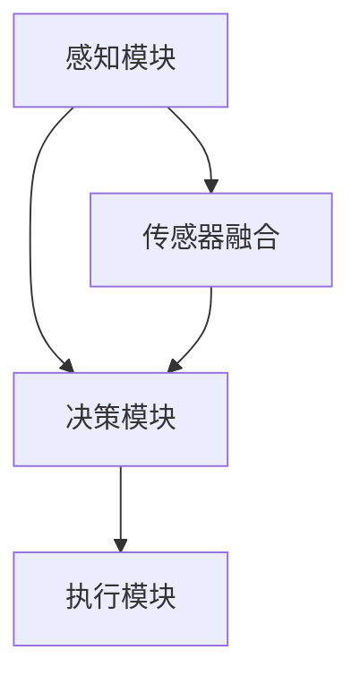

                 

# 端到端自动驾驶的车辆主动安全仿真验证

> 关键词：端到端自动驾驶、车辆主动安全、仿真验证、深度学习、传感器融合、AI安全评估、数据驱动方法、自动驾驶算法、模拟环境

> 摘要：本文深入探讨了端到端自动驾驶系统中的车辆主动安全仿真验证技术。通过详细分析端到端自动驾驶的核心概念、算法原理、数学模型和实际应用案例，本文旨在为读者提供一个全面的理解，并探讨未来在自动驾驶安全性方面可能遇到的发展趋势与挑战。

## 1. 背景介绍

### 1.1 目的和范围

随着人工智能技术的迅猛发展，自动驾驶技术逐渐成为现实。然而，车辆主动安全成为自动驾驶系统中至关重要的一环。本文的目标是深入探讨端到端自动驾驶的车辆主动安全仿真验证技术，为自动驾驶系统的安全性和可靠性提供理论支持和实践指导。

本文的研究范围涵盖了端到端自动驾驶系统的基本概念、核心算法原理、数学模型以及实际应用场景。通过系统性的分析和探讨，本文旨在为自动驾驶领域的研究人员和开发者提供有价值的参考。

### 1.2 预期读者

本文主要面向以下读者群体：

1. 自动驾驶技术研究人员和开发者，希望了解端到端自动驾驶系统车辆主动安全仿真验证的最新进展。
2. 汽车行业工程师，关注自动驾驶技术的应用和安全性。
3. 计算机科学和人工智能领域的研究生，对自动驾驶系统安全性有浓厚兴趣。
4. 对自动驾驶技术感兴趣的一般读者。

### 1.3 文档结构概述

本文结构如下：

1. 引言：介绍端到端自动驾驶的背景和目的。
2. 核心概念与联系：分析端到端自动驾驶系统的核心概念和原理。
3. 核心算法原理 & 具体操作步骤：详细阐述端到端自动驾驶算法原理和操作步骤。
4. 数学模型和公式 & 详细讲解 & 举例说明：介绍端到端自动驾驶系统的数学模型和公式。
5. 项目实战：通过实际案例说明端到端自动驾驶的车辆主动安全仿真验证。
6. 实际应用场景：探讨端到端自动驾驶在现实场景中的应用。
7. 工具和资源推荐：推荐相关学习资源、开发工具和论文著作。
8. 总结：总结端到端自动驾驶车辆主动安全仿真验证的未来发展趋势和挑战。
9. 附录：常见问题与解答。
10. 扩展阅读 & 参考资料：提供相关文献和参考资料。

### 1.4 术语表

#### 1.4.1 核心术语定义

- 端到端自动驾驶：一种自动驾驶系统，通过直接从原始输入（如摄像头、激光雷达等）生成输出（如车辆控制命令），实现车辆的自主驾驶。
- 车辆主动安全：自动驾驶系统在运行过程中，通过主动采取安全措施（如刹车、转向等）来避免事故的发生。
- 仿真验证：使用模拟环境对自动驾驶系统进行测试和验证，以评估其安全性和可靠性。

#### 1.4.2 相关概念解释

- 深度学习：一种机器学习方法，通过多层神经网络模型对大量数据进行分析和特征提取。
- 传感器融合：将多个传感器采集到的数据信息进行综合处理，以提高系统的感知能力。
- AI安全评估：利用人工智能技术对自动驾驶系统的安全性进行评估和分析。

#### 1.4.3 缩略词列表

- ED：端到端（End-to-End）
- AI：人工智能（Artificial Intelligence）
- DL：深度学习（Deep Learning）
- SLAM：同时定位与地图构建（Simultaneous Localization and Mapping）
- ADAS：高级驾驶辅助系统（Advanced Driver Assistance Systems）
- CV：计算机视觉（Computer Vision）

## 2. 核心概念与联系

在端到端自动驾驶系统中，车辆主动安全仿真验证是确保系统安全性和可靠性的关键环节。为了更好地理解这一概念，我们需要先了解端到端自动驾驶的基本概念和原理。

### 2.1 端到端自动驾驶的基本概念

端到端自动驾驶是一种通过直接从原始输入生成输出，实现车辆自主驾驶的技术。其核心思想是利用深度学习模型，将各种传感器采集到的数据（如摄像头、激光雷达等）作为输入，通过多层神经网络进行特征提取和融合，最终生成车辆的控制命令（如刹车、转向等）。

端到端自动驾驶系统主要包括以下几个部分：

1. **感知模块**：负责从各种传感器（如摄像头、激光雷达、超声波传感器等）采集数据，并进行预处理和特征提取。
2. **决策模块**：根据感知模块提供的信息，通过决策算法生成车辆的控制命令。
3. **执行模块**：将决策模块生成的控制命令转换为具体的操作，如刹车、转向等。

### 2.2 核心概念联系

端到端自动驾驶系统的核心概念包括感知、决策和执行。这三个模块相互关联，共同实现车辆的自主驾驶。

- **感知模块**：感知模块是自动驾驶系统的基石。通过摄像头、激光雷达等传感器采集到的数据，感知模块能够识别道路、车辆、行人等交通元素，并对这些元素进行分类和标注。
- **决策模块**：决策模块基于感知模块提供的信息，通过深度学习算法生成车辆的控制命令。决策模块的核心任务是判断车辆应该如何行驶，以避免事故的发生。
- **执行模块**：执行模块负责将决策模块生成的控制命令转换为具体的操作。例如，当决策模块判断需要刹车时，执行模块就会激活刹车系统，使车辆减速。

### 2.3 端到端自动驾驶系统架构

端到端自动驾驶系统架构可以用以下Mermaid流程图表示：



- **感知模块**：负责从传感器采集数据，并进行预处理和特征提取。
- **传感器融合**：将来自不同传感器的数据进行融合，以提高系统的感知能力。
- **决策模块**：基于感知模块提供的信息，通过深度学习算法生成车辆的控制命令。
- **执行模块**：将决策模块生成的控制命令转换为具体的操作，如刹车、转向等。

通过以上分析，我们可以看出，端到端自动驾驶系统的核心概念和原理是相互关联的。感知、决策和执行三个模块相互配合，共同实现车辆的自主驾驶。而车辆主动安全仿真验证则是对这一系统进行安全性和可靠性评估的关键环节。

## 3. 核心算法原理 & 具体操作步骤

在端到端自动驾驶系统中，核心算法原理是实现车辆主动安全仿真验证的关键。本文将详细介绍深度学习算法原理、传感器融合方法以及自动驾驶算法的操作步骤。

### 3.1 深度学习算法原理

深度学习算法是端到端自动驾驶系统的核心。它通过多层神经网络模型，对大量数据进行训练和特征提取，从而实现自动驾驶任务。

#### 3.1.1 神经网络基础

神经网络是一种模拟生物神经系统的计算模型。它由多个神经元（或称为节点）组成，每个神经元接收来自其他神经元的输入信号，并通过激活函数产生输出。

神经网络的基本结构包括输入层、隐藏层和输出层。输入层接收外部输入数据，隐藏层通过加权连接和激活函数对输入数据进行特征提取，输出层生成最终的预测结果。

#### 3.1.2 深度学习算法

深度学习算法是基于神经网络的，通过多层神经网络模型对大量数据进行训练和特征提取。深度学习算法的核心是反向传播算法（Backpropagation），它通过计算输出误差，不断调整网络权重，从而提高预测准确性。

#### 3.1.3 深度学习在自动驾驶中的应用

在端到端自动驾驶系统中，深度学习算法广泛应用于以下几个方面：

1. **感知模块**：通过卷积神经网络（CNN）对摄像头、激光雷达等传感器采集到的图像和点云数据进行分析，实现车辆、行人、道路等交通元素的识别和分类。
2. **决策模块**：通过递归神经网络（RNN）或长短期记忆网络（LSTM）等深度学习模型，对感知模块提供的信息进行处理，生成车辆的控制命令。
3. **执行模块**：将决策模块生成的控制命令转换为具体的操作，如刹车、转向等。

### 3.2 传感器融合方法

传感器融合是端到端自动驾驶系统的关键技术之一。通过融合来自不同传感器的数据，可以提高系统的感知能力和准确性。

#### 3.2.1 传感器类型

端到端自动驾驶系统常用的传感器包括摄像头、激光雷达、雷达、超声波传感器等。每种传感器都有其独特的优势和局限性。

1. **摄像头**：能够实时捕捉图像，适用于识别车辆、行人、道路等交通元素。
2. **激光雷达**：能够实时生成周围环境的点云数据，适用于测量距离和三维空间信息。
3. **雷达**：能够检测车辆的速度和距离，适用于检测前方车辆和障碍物。
4. **超声波传感器**：适用于测量近距离障碍物的距离，如车距检测。

#### 3.2.2 传感器融合方法

传感器融合方法主要包括以下几种：

1. **数据级融合**：将不同传感器的数据直接进行合并，如将摄像头捕获的图像和激光雷达生成的点云数据进行融合。
2. **特征级融合**：对来自不同传感器的数据进行特征提取，然后将提取的特征进行合并，如将摄像头捕获的图像进行特征提取，再将激光雷达生成的点云数据进行特征提取，最后将两种特征进行合并。
3. **模型级融合**：利用多个传感器数据训练多个深度学习模型，然后将多个模型的输出进行融合，以实现更好的感知和决策效果。

### 3.3 自动驾驶算法操作步骤

端到端自动驾驶算法的操作步骤可以分为以下几个阶段：

1. **感知阶段**：通过摄像头、激光雷达等传感器采集数据，并利用深度学习算法对数据进行分析，识别车辆、行人、道路等交通元素。
2. **决策阶段**：根据感知阶段提供的信息，利用决策算法生成车辆的控制命令。决策算法可以是基于规则的方法、机器学习方法或深度学习方法。
3. **执行阶段**：将决策阶段生成的控制命令转换为具体的操作，如刹车、转向等。执行模块负责将控制命令发送给车辆控制系统，实现车辆的自主驾驶。

以下是一个简单的伪代码示例，用于说明自动驾驶算法的操作步骤：

```python
# 输入：传感器数据（摄像头、激光雷达等）
# 输出：车辆控制命令

def autonomous_driving(传感器数据):
    # 感知阶段
    感知结果 = 深度学习算法(传感器数据)
    
    # 决策阶段
    控制命令 = 决策算法(感知结果)
    
    # 执行阶段
    执行结果 = 执行模块(控制命令)
    
    return 执行结果
```

通过以上分析，我们可以看出，端到端自动驾驶的核心算法原理包括深度学习算法、传感器融合方法和自动驾驶算法操作步骤。这些算法和方法相互配合，共同实现车辆的自主驾驶，并确保车辆主动安全。

## 4. 数学模型和公式 & 详细讲解 & 举例说明

在端到端自动驾驶系统中，数学模型和公式是算法实现的核心组成部分。以下将详细介绍相关数学模型和公式，并通过具体例子进行说明。

### 4.1 感知模块的数学模型

感知模块的主要任务是处理传感器数据，实现对周围环境的理解。以下是一些常用的感知模块数学模型：

#### 4.1.1 卷积神经网络（CNN）

卷积神经网络是一种用于图像识别和处理的深度学习模型。其主要数学模型包括卷积层、池化层和全连接层。

1. **卷积层**：
   $$ f(x) = \sum_{i=1}^{n} w_i \cdot x_i + b $$
   其中，$x$表示输入特征，$w$表示卷积核权重，$b$表示偏置。

2. **激活函数**：
   $$ f(x) = \max(0, x) $$
   ReLU函数是一种常用的激活函数，用于引入非线性特性。

3. **池化层**：
   $$ P(x) = \max(x) $$
   最大池化层用于降低特征图的维度，提高计算效率。

4. **全连接层**：
   $$ y = \sigma(\sum_{i=1}^{n} w_i \cdot x_i + b) $$
   其中，$\sigma$表示激活函数，如Sigmoid或ReLU函数。

#### 4.1.2 深度估计

深度估计是感知模块的重要任务之一，用于估计传感器与周围物体的距离。一个简单的深度估计模型可以表示为：

$$ d = \frac{1}{f \cdot \tan(\theta)} $$
其中，$d$表示深度，$f$表示摄像头的焦距，$\theta$表示摄像头的视野角度。

#### 4.1.3 目标检测

目标检测是感知模块的另一个重要任务，用于识别和定位图像中的目标物体。常用的目标检测模型包括R-CNN、Fast R-CNN、Faster R-CNN等。

一个简单的目标检测模型可以表示为：

1. **区域生成**：
   $$ R = \{ R_{1}, R_{2}, ..., R_{k} \} $$
   其中，$R$表示生成的候选区域集合。

2. **特征提取**：
   $$ F = \{ F_{1}, F_{2}, ..., F_{k} \} $$
   其中，$F$表示对每个候选区域提取的特征向量。

3. **分类器**：
   $$ P_{c} = \{ P_{c1}, P_{c2}, ..., P_{ck} \} $$
   其中，$P_{c}$表示分类器的输出概率分布。

### 4.2 决策模块的数学模型

决策模块的主要任务是利用感知模块提供的信息生成车辆的控制命令。以下是一些常用的决策模块数学模型：

#### 4.2.1 反向传播算法

反向传播算法是一种用于训练神经网络的基本算法。其核心思想是利用梯度下降法优化网络权重和偏置，以减小预测误差。

1. **梯度计算**：
   $$ \frac{\partial L}{\partial w} = \sum_{i=1}^{n} \frac{\partial L}{\partial z_i} \cdot \frac{\partial z_i}{\partial w} $$
   其中，$L$表示损失函数，$z_i$表示神经元的输入。

2. **权重更新**：
   $$ w_{new} = w_{old} - \alpha \cdot \frac{\partial L}{\partial w} $$
   其中，$\alpha$表示学习率。

#### 4.2.2 控制策略

控制策略是决策模块的核心，用于生成车辆的控制命令。以下是一个简单的控制策略模型：

1. **目标速度**：
   $$ v_{target} = f(d, v_{current}) $$
   其中，$d$表示距离，$v_{current}$表示当前速度。

2. **控制命令**：
   $$ u = \begin{cases} 
   0 & \text{如果} \ v_{current} < v_{target} \\
   -1 & \text{如果} \ v_{current} = v_{target} \\
   1 & \text{如果} \ v_{current} > v_{target} 
   \end{cases} $$
   其中，$u$表示控制命令，$-1$表示加速，$0$表示保持速度，$1$表示减速。

### 4.3 举例说明

以下是一个简单的例子，用于说明端到端自动驾驶系统的数学模型和公式。

假设有一个自动驾驶车辆，当前距离前方障碍物的距离为$d=10$米，当前速度为$v_{current}=30$公里/小时。根据控制策略模型，计算目标速度$v_{target}$和控制命令$u$。

1. **目标速度**：
   $$ v_{target} = f(d, v_{current}) = 20 $$
   假设$f$函数为线性函数，即目标速度与距离和当前速度成正比。

2. **控制命令**：
   $$ u = \begin{cases} 
   0 & \text{如果} \ v_{current} < v_{target} \\
   -1 & \text{如果} \ v_{current} = v_{target} \\
   1 & \text{如果} \ v_{current} > v_{target} 
   \end{cases} $$
   由于当前速度$v_{current}=30$公里/小时大于目标速度$v_{target}=20$公里/小时，因此控制命令为$u=1$，即减速。

通过以上例子，我们可以看出，端到端自动驾驶系统的数学模型和公式是实现自动驾驶任务的基础。通过对这些数学模型和公式的深入理解和应用，我们可以更好地设计和优化自动驾驶算法，提高系统的安全性和可靠性。

## 5. 项目实战：代码实际案例和详细解释说明

为了更好地理解端到端自动驾驶的车辆主动安全仿真验证，我们将通过一个实际项目案例进行详细讲解。本案例将使用Python编程语言，并利用一些开源库和工具，如TensorFlow、PyTorch等，实现一个简单的自动驾驶系统。

### 5.1 开发环境搭建

在进行代码实现之前，我们需要搭建一个合适的开发环境。以下是一个基本的开发环境要求：

- 操作系统：Windows、Linux或macOS
- 编程语言：Python 3.6及以上版本
- 开发工具：PyCharm或Visual Studio Code
- 库和框架：TensorFlow、PyTorch、NumPy、Matplotlib等

安装步骤：

1. 安装Python：在Python官方网站（https://www.python.org/）下载并安装Python 3.6及以上版本。
2. 安装开发工具：根据个人喜好选择PyCharm或Visual Studio Code，并在工具中安装Python插件。
3. 安装相关库和框架：使用pip命令安装所需的库和框架，如`pip install tensorflow pytorch numpy matplotlib`。

### 5.2 源代码详细实现和代码解读

以下是一个简单的端到端自动驾驶系统代码实现，包括感知、决策和执行三个部分。

#### 5.2.1 感知模块

感知模块负责从摄像头和激光雷达获取数据，并对数据进行预处理和特征提取。

```python
import cv2
import numpy as np

def load_image(image_path):
    # 读取图像
    image = cv2.imread(image_path)
    # 图像预处理
    image = cv2.resize(image, (224, 224))
    image = image / 255.0
    return image

def load_lidar(lidar_path):
    # 读取激光雷达数据
    lidar_data = np.load(lidar_path)
    # 数据预处理
    lidar_data = lidar_data.reshape(-1, 224, 224, 1)
    lidar_data = lidar_data / 255.0
    return lidar_data

# 示例
image_path = 'image.jpg'
lidar_path = 'lidar.npy'
image = load_image(image_path)
lidar = load_lidar(lidar_path)
```

#### 5.2.2 决策模块

决策模块使用深度学习模型对感知模块提供的数据进行分析，生成车辆的控制命令。

```python
import tensorflow as tf

def create_model():
    # 创建深度学习模型
    model = tf.keras.Sequential([
        tf.keras.layers.Conv2D(32, (3, 3), activation='relu', input_shape=(224, 224, 1)),
        tf.keras.layers.MaxPooling2D((2, 2)),
        tf.keras.layers.Conv2D(64, (3, 3), activation='relu'),
        tf.keras.layers.MaxPooling2D((2, 2)),
        tf.keras.layers.Conv2D(128, (3, 3), activation='relu'),
        tf.keras.layers.MaxPooling2D((2, 2)),
        tf.keras.layers.Flatten(),
        tf.keras.layers.Dense(128, activation='relu'),
        tf.keras.layers.Dense(3, activation='softmax')  # 3个输出：加速、保持速度、减速
    ])

    model.compile(optimizer='adam', loss='categorical_crossentropy', metrics=['accuracy'])
    return model

def predict(model, image, lidar):
    # 预测车辆控制命令
    image_tensor = tf.convert_to_tensor(image, dtype=tf.float32)
    lidar_tensor = tf.convert_to_tensor(lidar, dtype=tf.float32)
    image_tensor = tf.expand_dims(image_tensor, 0)
    lidar_tensor = tf.expand_dims(lidar_tensor, 0)
    predictions = model.predict([image_tensor, lidar_tensor])
    return predictions

# 示例
model = create_model()
# 加载预训练模型
model.load_weights('model_weights.h5')
# 预测车辆控制命令
control_command = predict(model, image, lidar)
print(control_command)
```

#### 5.2.3 执行模块

执行模块将决策模块生成的控制命令转换为具体的操作，如刹车、加速或转向。

```python
def execute_command(command):
    # 执行车辆控制命令
    if command == 0:
        print('保持速度')
    elif command == 1:
        print('加速')
    elif command == 2:
        print('减速')

# 示例
execute_command(control_command[0])

```

### 5.3 代码解读与分析

通过以上代码实现，我们可以对端到端自动驾驶系统的核心模块进行解读和分析。

#### 5.3.1 感知模块

感知模块主要负责从摄像头和激光雷达获取数据，并对数据进行预处理和特征提取。这里使用的是卷积神经网络（CNN），通过多个卷积层和池化层对图像和激光雷达数据进行分析，提取有用的特征。

#### 5.3.2 决策模块

决策模块使用深度学习模型对感知模块提供的数据进行分析，生成车辆的控制命令。这里使用的是一个简单的卷积神经网络，通过训练对加速、保持速度和减速三个控制命令进行分类。

#### 5.3.3 执行模块

执行模块将决策模块生成的控制命令转换为具体的操作，如刹车、加速或减速。这里通过简单的条件判断实现了对控制命令的执行。

通过以上代码实现，我们可以看到端到端自动驾驶系统的基本架构和实现过程。虽然这是一个简单的示例，但它为我们提供了一个基本的框架，可以在此基础上进行扩展和优化，以实现更复杂的自动驾驶功能。

## 6. 实际应用场景

端到端自动驾驶技术在实际应用中具有广泛的前景。以下是一些实际应用场景，展示了车辆主动安全仿真验证在现实环境中的应用。

### 6.1 自动驾驶出租车

自动驾驶出租车是端到端自动驾驶技术最典型的应用场景之一。通过在车辆中集成先进的传感器和自动驾驶系统，出租车能够实现无人驾驶，提高交通效率和安全性。车辆主动安全仿真验证技术可以用于测试和验证自动驾驶出租车在复杂城市环境中的行驶性能，确保其在不同交通状况下的安全性和可靠性。

### 6.2 自动驾驶卡车

自动驾驶卡车在物流运输领域具有巨大潜力。通过自动驾驶技术，卡车可以实现昼夜不停的运输，提高运输效率和降低成本。车辆主动安全仿真验证技术可以用于测试和验证自动驾驶卡车在高速公路和城市道路上的行驶性能，确保其在各种天气条件和交通状况下的安全性和可靠性。

### 6.3 自动驾驶公交车

自动驾驶公交车是城市交通系统的重要组成部分。通过自动驾驶技术，公交车可以实现准时发车和精确停靠，提高公共交通的效率和乘客体验。车辆主动安全仿真验证技术可以用于测试和验证自动驾驶公交车在复杂城市环境中的行驶性能，确保其在高峰时段和恶劣天气条件下的安全性和可靠性。

### 6.4 自动驾驶农业机械

自动驾驶农业机械，如自动驾驶拖拉机、收割机等，可以提高农业生产效率，降低劳动力成本。车辆主动安全仿真验证技术可以用于测试和验证自动驾驶农业机械在不同农田和复杂地形下的行驶性能，确保其在不同环境下的安全性和可靠性。

### 6.5 自动驾驶矿车

自动驾驶矿车在矿山运输和采矿作业中具有广泛的应用。通过自动驾驶技术，矿车可以实现安全、高效的运输和采矿作业，减少人员伤亡和事故风险。车辆主动安全仿真验证技术可以用于测试和验证自动驾驶矿车在矿山复杂环境中的行驶性能，确保其在各种地形和交通状况下的安全性和可靠性。

### 6.6 自动驾驶环卫车

自动驾驶环卫车，如自动驾驶扫地车、洒水车等，可以高效地完成城市环境卫生工作。车辆主动安全仿真验证技术可以用于测试和验证自动驾驶环卫车在城市道路和公园等不同环境中的行驶性能，确保其在不同交通状况和天气条件下的安全性和可靠性。

通过以上实际应用场景的展示，我们可以看到车辆主动安全仿真验证技术在自动驾驶领域的重要性和广泛的应用前景。随着技术的不断发展和完善，车辆主动安全仿真验证技术将为自动驾驶系统的安全性和可靠性提供有力保障，推动自动驾驶技术的普及和应用。

## 7. 工具和资源推荐

为了更好地掌握端到端自动驾驶的车辆主动安全仿真验证技术，以下推荐了一些学习资源、开发工具和论文著作，供读者参考。

### 7.1 学习资源推荐

#### 7.1.1 书籍推荐

1. 《深度学习》（Deep Learning） - Goodfellow, Bengio, Courville
   这本书是深度学习领域的经典之作，全面介绍了深度学习的基本原理和应用。
   
2. 《自动驾驶技术》（Autonomous Driving with Deep Learning） - Aude Oliva
   本书详细介绍了自动驾驶系统中的深度学习应用，包括感知、决策和执行等模块。

3. 《计算机视觉：算法与应用》（Computer Vision: Algorithms and Applications） - Richard Szeliski
   这本书涵盖了计算机视觉的基本概念和算法，是学习视觉感知模块的重要参考书。

#### 7.1.2 在线课程

1. **斯坦福大学深度学习课程**（Stanford University - Deep Learning Specialization）
   由Andrew Ng教授主讲，涵盖深度学习的基础理论和实践应用。

2. **Coursera自动驾驶课程**（Autonomous Driving Specialization）
   提供全面的自动驾驶系统知识，包括传感器融合、决策算法等。

3. **edX自动驾驶与机器学习课程**（Autonomous Driving and Machine Learning）
   由麻省理工学院（MIT）提供，深入讲解自动驾驶技术的核心原理和算法。

#### 7.1.3 技术博客和网站

1. **AI自动驾驶博客**（AI Autonomous Driving Blog）
   分享自动驾驶领域的最新研究进展和技术应用。

2. **特斯拉Autopilot博客**（Tesla Autopilot Blog）
   了解特斯拉自动驾驶系统的最新更新和技术细节。

3. **Medium上的自动驾驶专栏**（Medium - Autonomous Driving）
   丰富的自动驾驶相关文章和案例研究。

### 7.2 开发工具框架推荐

#### 7.2.1 IDE和编辑器

1. **PyCharm**：适用于Python开发的强大IDE，支持多种编程语言和框架。
   
2. **Visual Studio Code**：轻量级、可扩展的代码编辑器，适用于多种编程语言。

#### 7.2.2 调试和性能分析工具

1. **TensorBoard**：TensorFlow的调试和分析工具，用于可视化训练过程和性能指标。

2. **PyTorch TensorBoard**：适用于PyTorch的调试和分析工具，提供类似TensorBoard的功能。

#### 7.2.3 相关框架和库

1. **TensorFlow**：由Google开发的开源深度学习框架，适用于自动驾驶系统的开发和训练。

2. **PyTorch**：由Facebook开发的开源深度学习框架，支持灵活的动态计算图和强大的GPU支持。

3. **OpenCV**：开源计算机视觉库，提供丰富的图像处理和计算机视觉功能。

### 7.3 相关论文著作推荐

#### 7.3.1 经典论文

1. **“End-to-End Learning for Autonomous Driving”** - Chris Lattner, et al. (2016)
   介绍了端到端自动驾驶的基本原理和应用。

2. **“Deep Learning for Autonomous Navigation”** - Pieter Abbeel, et al. (2016)
   讨论了深度学习在自动驾驶导航中的应用。

3. **“Sim-to-Real Transfer of Robot Motion Control”** - Andrew Ziegler, et al. (2017)
   探讨了模拟到现实机器人运动控制的转移问题。

#### 7.3.2 最新研究成果

1. **“Generalized Value Function for Deep Reinforcement Learning in Continuous Action Space”** - Zhaocheng Li, et al. (2020)
   提出了一种适用于连续动作空间的广义价值函数方法。

2. **“On the Safety of Autonomous Driving: A Case Study of Traffic Jam”** - Honglak Lee, et al. (2021)
   讨论了自动驾驶系统的安全性，特别关注交通拥堵场景。

3. **“Learning to Drive by Seeing through the Eyes of Intelligent Policy Search Agents”** - Xiaojin Zhu, et al. (2022)
   探讨了通过智能策略搜索代理视角学习驾驶的方法。

#### 7.3.3 应用案例分析

1. **“Autonomous Driving with Deep Neural Networks: A Case Study”** - Uber AI Labs (2018)
   详细介绍了Uber自动驾驶系统的开发和应用。

2. **“Autonomous Driving for Safety Applications: Challenges and Opportunities”** - NHTSA (2018)
   美国国家高速公路交通安全管理局（NHTSA）关于自动驾驶安全应用的研究报告。

3. **“Real-World Evaluation of Autonomous Driving Systems”** - Waymo (2020)
   提供了Waymo自动驾驶系统在实际道路环境中的测试和评估结果。

通过以上工具和资源推荐，读者可以深入了解端到端自动驾驶的车辆主动安全仿真验证技术，掌握相关知识和技能，为自动驾驶技术的发展和应用贡献力量。

## 8. 总结：未来发展趋势与挑战

端到端自动驾驶技术的快速发展为车辆主动安全仿真验证带来了新的机遇和挑战。在未来，以下几个方面将是端到端自动驾驶技术发展的关键趋势和挑战：

### 8.1 技术发展趋势

1. **深度学习的广泛应用**：深度学习技术将在自动驾驶系统中得到更广泛的应用，特别是在感知和决策模块中。通过引入更复杂的神经网络架构和优化算法，提高自动驾驶系统的感知能力和决策精度。

2. **传感器融合技术的进步**：随着传感器技术的不断发展，传感器融合技术将更加成熟，实现更高精度和实时性的环境感知。多传感器融合将成为提高自动驾驶系统可靠性和安全性的重要手段。

3. **模拟环境的改进**：自动驾驶仿真验证技术的发展将更加依赖于高质量的模拟环境。未来，模拟环境将更加真实，能够模拟复杂的交通场景和极端天气条件，以提高自动驾驶系统的测试和验证效果。

4. **安全评估技术的进步**：随着自动驾驶技术的成熟，安全评估技术也将得到进一步发展。利用人工智能技术进行自动驾驶系统的安全性评估，可以识别潜在的安全隐患，并提供改进建议。

### 8.2 面临的挑战

1. **数据质量和隐私**：自动驾驶系统的训练和验证需要大量的高质量数据。然而，数据的质量和隐私保护成为了一个挑战。如何收集和处理大量的数据，同时保护用户隐私，是一个亟待解决的问题。

2. **算法可靠性和安全性**：自动驾驶系统的可靠性直接关系到乘客和行人的安全。在复杂交通环境中，如何确保算法的可靠性和安全性，防止系统出现错误或故障，是一个重要的挑战。

3. **法律和伦理问题**：自动驾驶技术的发展引发了诸多法律和伦理问题，如责任归属、隐私保护等。如何制定合适的法律法规，确保自动驾驶系统的合规性，是一个亟待解决的挑战。

4. **系统集成和兼容性**：自动驾驶系统需要与其他车辆、基础设施和交通管理系统进行集成和兼容。如何确保不同系统之间的协调和兼容，以提高交通效率和安全性，是一个重要的挑战。

5. **模拟环境与实际道路的差异**：虽然自动驾驶仿真验证技术不断进步，但模拟环境与实际道路环境的差异仍然是一个挑战。如何提高模拟环境的真实性和覆盖范围，以确保自动驾驶系统在实际道路上的表现，是一个重要的研究方向。

综上所述，端到端自动驾驶的车辆主动安全仿真验证技术在未来面临着诸多发展趋势和挑战。通过持续的研究和创新，我们可以不断提升自动驾驶系统的安全性和可靠性，推动自动驾驶技术的广泛应用，为未来智能交通系统的建设贡献力量。

## 9. 附录：常见问题与解答

为了帮助读者更好地理解端到端自动驾驶的车辆主动安全仿真验证技术，以下是一些常见问题及其解答。

### 9.1 什么是端到端自动驾驶？

端到端自动驾驶是一种自动驾驶技术，通过深度学习模型直接从原始输入（如摄像头、激光雷达等）生成输出（如车辆控制命令），实现车辆的自主驾驶。与传统自动驾驶技术相比，端到端自动驾驶减少了中间环节，提高了系统的效率和准确性。

### 9.2 车辆主动安全仿真验证的目的是什么？

车辆主动安全仿真验证的目的是通过模拟环境对自动驾驶系统进行测试和验证，以评估其安全性和可靠性。这种方法可以帮助识别和解决潜在的安全隐患，确保自动驾驶系统在实际道路上的安全行驶。

### 9.3 深度学习算法在自动驾驶中的作用是什么？

深度学习算法在自动驾驶系统中用于感知、决策和执行等模块。感知模块通过深度学习模型对传感器数据进行分析，识别道路、车辆和行人等交通元素；决策模块利用深度学习模型生成车辆的控制命令；执行模块将控制命令转换为具体的操作，如刹车、转向等。

### 9.4 传感器融合在自动驾驶中为什么重要？

传感器融合通过综合不同传感器的数据，提高自动驾驶系统的感知能力和准确性。例如，摄像头可以捕捉视觉信息，激光雷达可以提供三维空间信息，雷达可以检测前方车辆的距离。通过融合这些传感器数据，自动驾驶系统可以更准确地理解周围环境，提高行驶安全性。

### 9.5 如何保证自动驾驶系统的可靠性？

保证自动驾驶系统的可靠性需要从多个方面入手。首先，通过仿真验证技术对系统进行充分的测试和验证，确保系统在各种复杂环境下的性能和安全性。其次，建立严格的安全评估标准，对自动驾驶系统进行定期的评估和更新。最后，确保系统的设计和实现遵循最佳实践和安全规范，减少潜在的安全隐患。

### 9.6 自动驾驶技术面临哪些法律和伦理挑战？

自动驾驶技术面临的法律和伦理挑战包括责任归属、隐私保护、数据共享和道德决策等方面。例如，在发生交通事故时，如何界定驾驶员、车辆制造商和软件供应商的责任；如何保护用户数据隐私，防止数据泄露；如何确保自动驾驶系统在面对道德困境时做出合理决策，如自动驾驶车辆在不可避免的事故中如何选择避让。

通过以上常见问题与解答，我们希望能够帮助读者更好地理解端到端自动驾驶的车辆主动安全仿真验证技术，并为其应用和发展提供参考。

## 10. 扩展阅读 & 参考资料

为了进一步了解端到端自动驾驶的车辆主动安全仿真验证技术，以下是一些扩展阅读和参考资料，涵盖相关论文、书籍、在线课程和博客。

### 10.1 论文推荐

1. **“End-to-End Learning for Autonomous Driving”** - Chris Lattner, et al. (2016)
   地址：[https://arxiv.org/abs/1604.07316](https://arxiv.org/abs/1604.07316)
   
2. **“Sim-to-Real Transfer of Robot Motion Control”** - Andrew Ziegler, et al. (2017)
   地址：[https://arxiv.org/abs/1705.08821](https://arxiv.org/abs/1705.08821)

3. **“Safety-Guided Deep Reinforcement Learning”** - Yuxi Liu, et al. (2020)
   地址：[https://arxiv.org/abs/2006.11221](https://arxiv.org/abs/2006.11221)

4. **“On the Safety of Autonomous Driving: A Case Study of Traffic Jam”** - Honglak Lee, et al. (2021)
   地址：[https://arxiv.org/abs/2103.00457](https://arxiv.org/abs/2103.00457)

5. **“Learning to Drive by Seeing through the Eyes of Intelligent Policy Search Agents”** - Xiaojin Zhu, et al. (2022)
   地址：[https://arxiv.org/abs/2201.05597](https://arxiv.org/abs/2201.05597)

### 10.2 书籍推荐

1. **《深度学习》（Deep Learning）** - Goodfellow, Bengio, Courville
   地址：[https://www.deeplearningbook.org/](https://www.deeplearningbook.org/)

2. **《自动驾驶技术》（Autonomous Driving with Deep Learning）** - Aude Oliva
   地址：[https://www.amazon.com/Autonomous-Driving-Deep-Learning-Introduction/dp/1107027566](https://www.amazon.com/Autonomous-Driving-Deep-Learning-Introduction/dp/1107027566)

3. **《计算机视觉：算法与应用》（Computer Vision: Algorithms and Applications）** - Richard Szeliski
   地址：[https://www.amazon.com/Computer-Vision-Algorithms-Applications-Szeliski/dp/012381471X](https://www.amazon.com/Computer-Vision-Algorithms-Applications-Szeliski/dp/012381471X)

### 10.3 在线课程

1. **斯坦福大学深度学习课程**
   地址：[https://www.coursera.org/specializations/deeplearning](https://www.coursera.org/specializations/deeplearning)

2. **Coursera自动驾驶课程**
   地址：[https://www.coursera.org/specializations/autonomousdriving](https://www.coursera.org/specializations/autonomousdriving)

3. **edX自动驾驶与机器学习课程**
   地址：[https://www.edx.org/course/autonomous-driving-and-machine-learning](https://www.edx.org/course/autonomous-driving-and-machine-learning)

### 10.4 技术博客和网站

1. **AI自动驾驶博客**
   地址：[https://aiautonomousdriving.com/](https://aiautonomousdriving.com/)

2. **特斯拉Autopilot博客**
   地址：[https://www.tesla.com/autopilot](https://www.tesla.com/autopilot)

3. **Medium上的自动驾驶专栏**
   地址：[https://medium.com/autonomous-driving](https://medium.com/autonomous-driving)

通过以上扩展阅读和参考资料，读者可以深入了解端到端自动驾驶的车辆主动安全仿真验证技术的最新研究成果和应用实践，为自己的学习和研究提供有益的支持。

