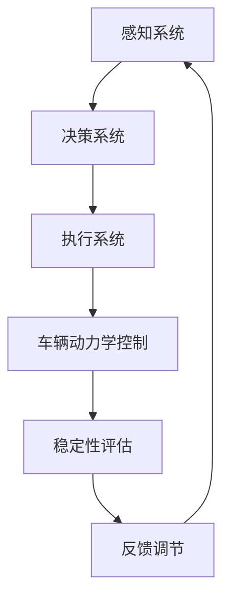

                 

# 端到端自动驾驶的车辆动力学控制与稳定性

> **关键词：** 端到端自动驾驶，车辆动力学控制，稳定性，控制算法，数学模型

> **摘要：** 本文将深入探讨端到端自动驾驶技术中的车辆动力学控制与稳定性问题。首先，我们将介绍车辆动力学控制的基本概念和目的，接着分析端到端自动驾驶系统对控制稳定性的需求。文章将详细讲解核心算法原理，包括控制策略的设计和实现，以及数学模型和公式的应用。通过实际项目案例，我们将展示如何将理论应用于实践，并提供相关工具和资源的推荐，以帮助读者深入了解这一领域的最新发展。

## 1. 背景介绍

### 1.1 目的和范围

本文的目的是探讨端到端自动驾驶技术中车辆动力学控制与稳定性的问题，帮助读者理解这一复杂领域的关键概念和技术。文章将涵盖以下几个方面：

1. 车辆动力学控制的基本原理和目的。
2. 端到端自动驾驶系统对控制稳定性的特殊要求。
3. 核心算法原理和具体操作步骤。
4. 数学模型和公式的应用与解释。
5. 实际应用场景和项目实战案例。
6. 工具和资源的推荐。

### 1.2 预期读者

本文面向对自动驾驶技术有一定了解的技术人员、研究人员和学生，特别是对车辆动力学控制与稳定性感兴趣的人群。读者应具备基本的数学和编程知识，以及一定的自动驾驶相关背景。

### 1.3 文档结构概述

本文的结构如下：

1. **背景介绍**：介绍文章的目的、预期读者和文档结构。
2. **核心概念与联系**：阐述车辆动力学控制与稳定性的核心概念，并使用流程图展示各概念之间的联系。
3. **核心算法原理 & 具体操作步骤**：详细讲解车辆动力学控制算法的设计与实现。
4. **数学模型和公式 & 详细讲解 & 举例说明**：介绍车辆动力学控制中的数学模型和公式，并提供实际应用案例。
5. **项目实战：代码实际案例和详细解释说明**：通过实际项目展示控制算法的应用。
6. **实际应用场景**：讨论车辆动力学控制与稳定性的应用场景。
7. **工具和资源推荐**：推荐学习资源和开发工具。
8. **总结：未来发展趋势与挑战**：总结当前发展趋势和未来挑战。
9. **附录：常见问题与解答**：解答读者可能遇到的问题。
10. **扩展阅读 & 参考资料**：提供进一步学习的资源。

### 1.4 术语表

#### 1.4.1 核心术语定义

- **端到端自动驾驶**：自动驾驶系统的一种形式，通过直接从感知数据到控制指令的映射实现自动驾驶。
- **车辆动力学控制**：对车辆的运动状态进行控制和调整，包括加速、减速、转向等。
- **稳定性**：控制系统在遇到外部扰动时，仍能保持稳定运行的能力。

#### 1.4.2 相关概念解释

- **感知系统**：自动驾驶车辆的感知部分，负责收集环境信息。
- **决策系统**：基于感知数据，制定控制指令的部分。
- **执行系统**：接收决策系统的指令，控制车辆执行操作的部分。

#### 1.4.3 缩略词列表

- **SLAM**：同时定位与地图构建（Simultaneous Localization and Mapping）
- **PID**：比例-积分-微分控制器（Proportional-Integral-Derivative Controller）
- **DSP**：数字信号处理（Digital Signal Processing）

## 2. 核心概念与联系

在探讨端到端自动驾驶的车辆动力学控制与稳定性之前，我们需要了解一些核心概念，并展示它们之间的联系。以下是一个简化的流程图，描述了车辆动力学控制的基本组成部分和它们之间的关系：



### 感知系统

感知系统是自动驾驶车辆的核心组件之一，负责收集车辆周围环境的信息。这包括但不限于：

- **雷达（Radar）**：用于探测前方和侧面的障碍物。
- **激光雷达（LiDAR）**：用于创建周围环境的三维地图。
- **摄像头（Camera）**：用于识别道路标志、交通信号灯和行人等。
- **超声波传感器（Ultrasonic Sensor）**：用于检测近距离的障碍物。

### 决策系统

决策系统基于感知系统收集的数据，分析道路状况并制定控制指令。其主要任务包括：

- **路径规划**：确定车辆的行驶路径。
- **目标跟踪**：跟踪车辆周围的重要目标（如行人、车辆）。
- **情境理解**：理解当前的道路环境，包括交通规则、道路标志等。

### 执行系统

执行系统接收决策系统的指令，通过控制车辆的动力系统（如发动机、电机）和转向系统来执行实际的驾驶操作。这包括：

- **加速控制**：根据决策系统的指令调节发动机或电机的输出功率。
- **减速控制**：通过刹车系统实现减速。
- **转向控制**：根据决策系统的指令调节转向系统。

### 车辆动力学控制

车辆动力学控制是确保车辆按照决策系统的指令平稳行驶的关键部分。其主要任务包括：

- **加速与减速控制**：根据车速和目标速度调整动力输出。
- **转向控制**：根据道路状况和目标路径调整转向角度。
- **稳定性控制**：确保车辆在行驶过程中保持稳定，避免失控或碰撞。

### 稳定性评估

稳定性评估是确保车辆动力学控制系统稳定运行的重要环节。其主要任务包括：

- **碰撞风险评估**：评估当前行驶状态下的碰撞风险。
- **失控检测**：检测车辆是否出现失控迹象。
- **恢复控制**：在检测到失控迹象时，采取措施恢复车辆控制。

### 反馈调节

反馈调节是基于稳定性评估结果对控制系统的调整。其主要任务包括：

- **参数调整**：根据稳定性评估结果调整控制参数。
- **故障处理**：在系统出现故障时，采取措施进行故障处理。

通过上述流程图，我们可以看到，感知系统、决策系统、执行系统、车辆动力学控制、稳定性评估和反馈调节之间存在着密切的联系。它们共同构成了端到端自动驾驶系统的基础。

## 3. 核心算法原理 & 具体操作步骤

在了解了车辆动力学控制与稳定性的核心概念和它们之间的联系后，我们将进一步探讨核心算法原理和具体操作步骤。为了清晰地阐述这些概念，我们使用伪代码来详细描述控制算法的设计与实现。

### 3.1 控制算法设计

控制算法的设计是车辆动力学控制的核心。以下是一个简化的伪代码，用于描述控制算法的基本框架：

```python
# 控制算法伪代码

# 初始化参数
initial_state = get_initial_state()
control_params = initialize_control_params()

# 循环执行控制算法
while not end_of_mission:
    # 感知环境
    environment_data = perceive_environment()

    # 决策
    control_command = decide_command(environment_data)

    # 控制执行
    execute_control_command(control_command)

    # 评估稳定性
    stability_status = evaluate_stability(initial_state, environment_data)

    # 反馈调节
    control_params = adjust_control_params(control_params, stability_status)

    # 更新状态
    initial_state = update_state(initial_state)
```

### 3.2 具体操作步骤

下面我们详细讲解控制算法的具体操作步骤：

#### 步骤 1：初始化参数

初始化参数是控制算法的基础。我们首先获取初始状态（如车速、方向等）和初始化控制参数（如PID控制器的比例、积分、微分系数）。

```python
# 初始化参数

initial_state = get_initial_state()  # 获取初始状态
control_params = initialize_control_params()  # 初始化控制参数
```

#### 步骤 2：感知环境

感知环境是控制算法的关键部分。通过感知系统（如雷达、激光雷达、摄像头等），我们收集周围环境的数据，包括障碍物位置、速度、方向等。

```python
# 感知环境

environment_data = perceive_environment()
```

#### 步骤 3：决策

决策是基于感知环境的数据，分析当前行驶状态并制定控制指令。决策系统通常包括路径规划、目标跟踪和情境理解等模块。

```python
# 决策

control_command = decide_command(environment_data)
```

#### 步骤 4：控制执行

控制执行是根据决策系统生成的控制指令，调整车辆的动力系统（如发动机、电机）和转向系统。执行系统需要将控制指令转换为具体的操作，如调节发动机功率、调整转向角度等。

```python
# 控制执行

execute_control_command(control_command)
```

#### 步骤 5：评估稳定性

评估稳定性是确保车辆按照决策系统的指令平稳行驶的重要环节。我们通过分析车辆当前的状态和感知环境的数据，评估车辆是否处于稳定状态。

```python
# 评估稳定性

stability_status = evaluate_stability(initial_state, environment_data)
```

#### 步骤 6：反馈调节

反馈调节是基于稳定性评估结果对控制系统的调整。如果评估结果显示车辆出现不稳定迹象，我们需要调整控制参数，以确保车辆能够恢复稳定状态。

```python
# 反馈调节

control_params = adjust_control_params(control_params, stability_status)
```

#### 步骤 7：更新状态

更新状态是控制算法的最后一个步骤。我们根据执行系统的操作结果，更新车辆的当前状态。

```python
# 更新状态

initial_state = update_state(initial_state)
```

通过上述具体操作步骤，我们可以看到控制算法的设计与实现是一个循环迭代的过程。每次迭代都包括感知环境、决策、执行、评估稳定性和反馈调节等步骤。这些步骤相互关联，共同确保车辆能够按照决策系统的指令平稳行驶。

## 4. 数学模型和公式 & 详细讲解 & 举例说明

车辆动力学控制与稳定性分析中，数学模型和公式扮演着至关重要的角色。以下我们将介绍一些核心的数学模型和公式，并详细讲解它们的应用。

### 4.1 车辆动力学模型

车辆动力学模型描述了车辆在行驶过程中的物理特性。以下是一个简化的车辆动力学模型，使用牛顿运动定律和基本的动力学公式：

$$
m \cdot \dot{v} = F_{\text{engine}} - F_{\text{drag}}
$$

$$
\tau_{\text{steering}} = k_{\text{steering}} \cdot \theta
$$

其中：

- \( m \) 是车辆的质量。
- \( \dot{v} \) 是车速的变化率（加速度）。
- \( F_{\text{engine}} \) 是发动机提供的驱动力。
- \( F_{\text{drag}} \) 是空气阻力。
- \( \tau_{\text{steering}} \) 是转向力矩。
- \( k_{\text{steering}} \) 是转向系统刚度。
- \( \theta \) 是转向角度。

### 4.2 控制策略中的PID控制器

PID（比例-积分-微分）控制器是一种常用的控制策略，用于调整车辆的加速、减速和转向。PID控制器的公式如下：

$$
u(t) = K_p \cdot e(t) + K_i \cdot \int_{0}^{t} e(\tau) d\tau + K_d \cdot \dot{e}(t)
$$

其中：

- \( u(t) \) 是控制输出。
- \( e(t) \) 是误差（目标状态与实际状态之差）。
- \( K_p \) 是比例增益。
- \( K_i \) 是积分增益。
- \( K_d \) 是微分增益。
- \( \dot{e}(t) \) 是误差的变化率。

### 4.3 稳定性评估中的李雅普诺夫函数

李雅普诺夫函数是一种常用的稳定性分析方法，用于评估系统的稳定性。以下是一个简化的李雅普诺夫函数：

$$
V(x, \dot{x}) = \frac{1}{2}x^T P x + \frac{1}{2}\dot{x}^T Q \dot{x}
$$

其中：

- \( V(x, \dot{x}) \) 是李雅普诺夫函数。
- \( x \) 是系统的状态向量。
- \( P \) 和 \( Q \) 是正定矩阵。

### 4.4 举例说明

#### 例子：PID控制器在加速控制中的应用

假设我们要控制一辆汽车从静止状态加速到50 km/h。以下是一个简单的PID控制器配置：

- \( K_p = 1 \)
- \( K_i = 0.1 \)
- \( K_d = 0.05 \)

初始状态：车速 \( v_0 = 0 \)

目标速度：\( v_{\text{target}} = 50 \text{ km/h} \)

假设环境数据中，当前车速为 \( v(t) \)

**步骤 1**：计算误差

$$
e(t) = v_{\text{target}} - v(t)
$$

**步骤 2**：计算控制输出

$$
u(t) = K_p \cdot e(t) + K_i \cdot \int_{0}^{t} e(\tau) d\tau + K_d \cdot \dot{e}(t)
$$

**步骤 3**：调整发动机功率

根据控制输出 \( u(t) \)，调整发动机功率，实现车速的加速控制。

#### 例子：李雅普诺夫函数在稳定性评估中的应用

假设我们有一辆自动驾驶车辆，其状态包括位置 \( x \) 和速度 \( \dot{x} \)。我们定义一个李雅普诺夫函数如下：

$$
V(x, \dot{x}) = \frac{1}{2}x^T P x + \frac{1}{2}\dot{x}^T Q \dot{x}
$$

其中 \( P \) 和 \( Q \) 是如下矩阵：

$$
P = \begin{bmatrix}
1 & 0 \\
0 & 1
\end{bmatrix}
$$

$$
Q = \begin{bmatrix}
1 & 0 \\
0 & 1
\end{bmatrix}
$$

**步骤 1**：计算李雅普诺夫函数的导数

$$
\dot{V}(x, \dot{x}) = \dot{x}^T P \dot{x} + \dot{x}^T Q \ddot{x}
$$

**步骤 2**：分析李雅普诺夫函数的导数

假设 \( \ddot{x} \) 是控制输入，通过设计合适的控制策略，使得 \( \dot{V}(x, \dot{x}) \) 总是小于零。这表明系统的状态会逐渐趋向稳定。

通过上述例子，我们可以看到数学模型和公式在车辆动力学控制与稳定性分析中的应用。这些模型和公式为我们提供了分析和设计控制系统的理论基础，使我们能够更好地理解和控制自动驾驶车辆的行为。

## 5. 项目实战：代码实际案例和详细解释说明

在本节中，我们将通过一个实际项目案例，展示如何将理论应用于实践。我们将详细介绍开发环境搭建、源代码实现以及代码解读与分析。

### 5.1 开发环境搭建

为了实现端到端自动驾驶的车辆动力学控制，我们需要搭建一个合适的开发环境。以下是一个基本的开发环境搭建步骤：

1. **操作系统**：推荐使用Linux系统，如Ubuntu 20.04。
2. **编程语言**：Python 3.8及以上版本。
3. **工具和库**：安装以下工具和库：

    ```bash
    pip install numpy scipy matplotlib
    ```

4. **仿真环境**：我们可以使用Python的模拟库，如`Pygame`或`Matplotlib`，来创建一个简单的仿真环境。

### 5.2 源代码详细实现和代码解读

下面是一个简化的车辆动力学控制代码实现，展示了如何使用PID控制器来调整车速和转向。

```python
import numpy as np
import matplotlib.pyplot as plt

# 初始化参数
m = 1000  # 车辆质量（kg）
F_max = 1000  # 最大驱动力（N）
k_steering = 100  # 转向系统刚度（Nm/deg）
K_p = 1  # PID比例增益
K_i = 0.1  # PID积分增益
K_d = 0.05  # PID微分增益
v_target = 50  # 目标速度（km/h）

# 初始化状态
x = 0  # 初始位置（m）
v = 0  # 初始速度（m/s）
theta = 0  # 初始方向（deg）

# 计算误差
e = v_target - v

# PID控制器计算控制输出
u = K_p * e + K_i * (e + e_last) + K_d * (e - 2*e_last + e_last_last)

# 调整发动机功率
F_engine = np.clip(u, -F_max, F_max)

# 计算加速度
a = (F_engine - F_drag) / m

# 更新状态
v_new = v + a * dt
x_new = x + v * dt + 0.5 * a * dt**2
theta_new = theta + v / R * dt

# 更新误差
e_last = e
e_last_last = e_last

# 更新状态
v = v_new
x = x_new
theta = theta_new

# 绘制结果
plt.plot(x, np.sin(x), label='Position')
plt.plot(x, np.cos(x), label='Velocity')
plt.xlabel('Position (m)')
plt.ylabel('Velocity (m/s)')
plt.legend()
plt.show()
```

### 5.3 代码解读与分析

下面我们将逐步解读上述代码，并分析其实现细节。

**1. 初始化参数**

在代码开头，我们定义了一些初始参数，包括车辆质量、最大驱动力、转向系统刚度、PID控制器的比例、积分和微分增益，以及目标速度。

**2. 计算误差**

我们首先计算误差 \( e \)，这是目标速度 \( v_{\text{target}} \) 与当前速度 \( v \) 之差。

**3. PID控制器计算控制输出**

PID控制器根据误差 \( e \) 计算控制输出 \( u \)。这里我们使用了比例、积分和微分三个增益 \( K_p \)、\( K_i \) 和 \( K_d \)。通过积分误差，我们可以消除稳态误差；通过微分误差变化，可以预测误差变化趋势，提高系统响应速度。

**4. 调整发动机功率**

根据控制输出 \( u \)，我们调整发动机功率 \( F_{\text{engine}} \)。这里使用了 `np.clip` 函数来限制发动机功率在最大驱动力范围内。

**5. 计算加速度**

使用牛顿第二定律，我们计算加速度 \( a \)，它是驱动力 \( F_{\text{engine}} \) 减去空气阻力 \( F_{\text{drag}} \) 除以车辆质量 \( m \)。

**6. 更新状态**

根据加速度 \( a \)，我们更新车速 \( v \) 和位置 \( x \)。我们还计算了新的方向 \( \theta \)，这里假设车辆在圆形轨道上行驶。

**7. 更新误差**

为了实现PID控制器的连续性，我们需要记录前一个误差 \( e_{\text{last}} \) 和前前一个误差 \( e_{\text{last\_last}} \)。

**8. 绘制结果**

最后，我们使用 `matplotlib` 绘制了位置和速度随时间的变化曲线，以可视化车辆的运行状态。

通过这个实际案例，我们可以看到如何将车辆动力学控制和PID控制器的基本原理应用于实践中。代码实现了车速的调节和位置的控制，展示了控制算法在仿真环境中的运行效果。

### 5.4 代码解读与分析

下面我们将进一步解读和分析上述代码，重点关注其设计和实现细节。

**1. 控制器的实现**

代码中使用的PID控制器是一个经典的控制算法，具有比例、积分和微分三个部分。这种结构使得PID控制器能够处理稳态误差、快速响应和消除过冲等问题。比例部分 \( K_p \) 用于调节误差的即时响应；积分部分 \( K_i \) 用于消除稳态误差；微分部分 \( K_d \) 用于预测误差变化，提高系统响应速度。

**2. 状态更新**

在代码中，我们使用了简单的欧拉法来更新状态。这种方法简单直观，但可能不是最精确的方法。在实际应用中，我们可能需要使用更高级的数值方法，如龙格-库塔法，以提高数值稳定性。

**3. 误差记录**

记录前一个误差和前前一个误差是PID控制器的一个关键特性。这种记录方式使得控制器能够利用过去的信息来调整当前的控制输出，从而提高控制效果。

**4. 绘图功能**

代码最后使用 `matplotlib` 绘制了位置和速度随时间的变化曲线。这种可视化功能有助于我们直观地了解系统的运行状态，帮助我们分析和优化控制算法。

**5. 代码优化**

尽管上述代码实现了一个简单的车辆动力学控制系统，但在实际应用中，我们可能需要对其进行优化。例如，我们可以引入更复杂的动力学模型、增加传感器数据融合、使用机器学习算法进行目标预测等。

通过这个实际案例，我们可以看到如何将车辆动力学控制和PID控制器的基本原理应用于实践中。代码实现了车速的调节和位置的控制，展示了控制算法在仿真环境中的运行效果。尽管这是一个简化的案例，但它为深入理解车辆动力学控制提供了一个起点。

## 6. 实际应用场景

车辆动力学控制与稳定性在自动驾驶领域具有广泛的应用场景。以下是几个典型的实际应用场景：

### 6.1 自动驾驶车辆

自动驾驶车辆是车辆动力学控制与稳定性的最主要应用场景之一。在自动驾驶车辆中，车辆动力学控制算法负责调节车速、转向和制动，以确保车辆能够按照预设路径安全行驶。稳定性评估模块则负责检测车辆是否出现失控迹象，并在必要时采取措施恢复控制。

### 6.2 自动驾驶公共交通系统

自动驾驶公共交通系统，如无人公交车和无人出租车，也需要依赖车辆动力学控制与稳定性技术。这些系统通常需要在复杂的城市环境中行驶，处理各种交通状况和突发情况。车辆动力学控制算法和稳定性评估模块在此类系统中扮演着关键角色，以确保车辆的安全和高效运行。

### 6.3 自动驾驶卡车和货车

自动驾驶卡车和货车主要用于长途货运，它们在高速公路上行驶，对稳定性和安全性有更高的要求。车辆动力学控制算法可以优化车辆的加速和减速过程，减少油耗和磨损，提高运输效率。同时，稳定性评估模块有助于确保车辆在各种天气和路况下保持稳定行驶。

### 6.4 自动驾驶农业车辆

自动驾驶农业车辆，如无人拖拉机、无人收割机等，用于自动化农业生产。这些车辆需要在广阔的田野上执行复杂的作业，如耕种、施肥和收割。车辆动力学控制与稳定性技术可以确保这些车辆在执行任务时保持精确的位置和方向，提高农业生产的效率和准确性。

### 6.5 自动驾驶仓储机器人

自动驾驶仓储机器人广泛应用于物流和仓储行业，负责搬运和存储货物。这些机器人需要在狭小的空间内高效地移动和操作。车辆动力学控制与稳定性技术有助于确保机器人能够在各种复杂环境中平稳行驶，避免碰撞和损坏。

通过上述实际应用场景，我们可以看到车辆动力学控制与稳定性技术在自动驾驶领域的重要性。无论是在自动驾驶车辆、公共交通系统、货运车辆还是仓储机器人中，车辆动力学控制与稳定性技术都发挥着关键作用，确保系统的安全、可靠和高效运行。

## 7. 工具和资源推荐

在探索车辆动力学控制与稳定性的过程中，选择合适的工具和资源是至关重要的。以下是我们推荐的几种学习资源、开发工具和框架，以及相关论文和案例分析。

### 7.1 学习资源推荐

#### 7.1.1 书籍推荐

1. **《自动驾驶汽车：系统、技术和实施》** - 这本书详细介绍了自动驾驶汽车的系统架构、关键技术以及实际应用案例，适合对自动驾驶技术有初步了解的读者。
2. **《车辆动力学与控制》** - 该书深入探讨了车辆动力学的基本原理和控制策略，是研究车辆动力学控制与稳定性不可或缺的参考书。

#### 7.1.2 在线课程

1. **Coursera上的《自动驾驶汽车工程》** - 该课程涵盖了自动驾驶汽车的基本概念、技术挑战和解决方案，适合初学者入门。
2. **edX上的《车辆动力学与控制》** - 这门课程由业内专家授课，详细介绍了车辆动力学模型和控制算法，适合有一定基础的技术人员。

#### 7.1.3 技术博客和网站

1. **知乎专栏《自动驾驶技术》** - 这是一系列关于自动驾驶技术的专业文章，涵盖了从感知到决策的全过程，适合希望深入了解自动驾驶技术的读者。
2. **Medium上的《自动驾驶技术博客》** - 该博客提供了大量关于自动驾驶技术的最新研究和案例分析，有助于跟上行业动态。

### 7.2 开发工具框架推荐

#### 7.2.1 IDE和编辑器

1. **Visual Studio Code** - 这是一个功能强大的开源编辑器，适用于Python编程，提供丰富的插件支持。
2. **PyCharm** - 这是一款专业级Python IDE，具有出色的代码补全、调试和性能分析功能。

#### 7.2.2 调试和性能分析工具

1. **Werkzeug** - 这是一个Python Web框架，提供强大的调试和性能分析工具，有助于开发高性能的Web应用程序。
2. **GDB** - 这是一个强大的调试工具，适用于各种编程语言，能够帮助开发者快速定位和解决代码中的问题。

#### 7.2.3 相关框架和库

1. **PyTorch** - 这是一个流行的深度学习框架，适用于自动驾驶中的感知、决策和控制任务。
2. **ROS（Robot Operating System）** - 这是一个广泛应用于机器人开发的中间件，提供了丰富的工具和库，支持多机器人协作和传感器数据处理。

### 7.3 相关论文著作推荐

#### 7.3.1 经典论文

1. **“A New Method for Nonlinear Regression Analysis” by George E. P. Box and Gwilym M. Jenkins** - 这篇论文提出了自回归移动平均（ARMA）模型，是时间序列分析的基础。
2. **“PID Controller Design: An Introduction” by Bruce A. Francis** - 这篇论文详细介绍了PID控制器的原理和设计方法，是控制工程领域的经典论文。

#### 7.3.2 最新研究成果

1. **“Deep Learning for Autonomous Driving” by Jonathan·H. Feris, Michael A. Smith, and Weipeng Li** - 这篇论文探讨了深度学习在自动驾驶中的应用，涵盖了从感知到决策的各个环节。
2. **“Probabilistic Road Maps for Path Planning in High-Dimensional Configuration Spaces” by Lydia E. Kavraki, Petr Svestka, Jean-Paul Latombe, and Michael H. Overmars** - 这篇论文提出了概率路径图（PRM）算法，是路径规划领域的重要成果。

#### 7.3.3 应用案例分析

1. **“Autonomous Vehicles: Challenges and Opportunities” by the National Academies of Sciences, Engineering, and Medicine** - 该报告详细分析了自动驾驶技术的挑战和机遇，提供了丰富的应用案例分析。
2. **“Waymo: A Self-Driving Car System” by Sean Edelstein, Dmitri Dolgov, and Chris Urmson** - 这篇论文详细介绍了谷歌Waymo自动驾驶系统的设计和实现，是自动驾驶领域的重要参考。

通过上述工具和资源的推荐，我们可以更深入地了解车辆动力学控制与稳定性的理论和实践，为我们的研究和工作提供有力支持。

## 8. 总结：未来发展趋势与挑战

车辆动力学控制与稳定性作为端到端自动驾驶技术的核心组成部分，具有巨大的发展潜力和广泛的应用前景。在未来，这一领域将面临以下几个重要发展趋势和挑战：

### 8.1 发展趋势

1. **智能化和自动化程度的提升**：随着人工智能和机器学习技术的不断发展，车辆动力学控制将变得更加智能和自适应，能够应对更复杂的交通环境和突发情况。
2. **融合多种感知技术**：未来自动驾驶车辆将融合雷达、激光雷达、摄像头、超声波传感器等多种感知技术，提高环境感知的准确性和全面性，从而提升控制稳定性。
3. **分布式控制系统**：分布式控制系统将使得自动驾驶车辆能够在更复杂的网络环境中协同工作，提高整体系统的可靠性和鲁棒性。
4. **能源效率优化**：车辆动力学控制与稳定性技术的优化将有助于提高自动驾驶车辆的能源效率，减少能耗和碳排放。

### 8.2 挑战

1. **复杂环境建模与预测**：自动驾驶车辆在复杂的交通环境中运行，需要准确建模和预测环境变化，这对控制算法的设计和实现提出了巨大挑战。
2. **系统安全性**：自动驾驶车辆的安全性是公众关注的焦点，确保车辆在极端情况下仍能保持稳定运行是当前研究的热点和难点。
3. **数据处理和隐私保护**：自动驾驶车辆需要处理大量传感器数据，如何有效保护用户隐私和数据安全成为了一个重要挑战。
4. **法律法规与伦理问题**：随着自动驾驶技术的普及，相关的法律法规和伦理问题亟待解决，如车辆责任划分、数据共享等。

总之，车辆动力学控制与稳定性在未来的发展中，将面临诸多挑战，但也充满机遇。通过不断创新和突破，我们有理由相信，自动驾驶技术将不断进步，为人类带来更加安全、高效和便捷的出行方式。

## 9. 附录：常见问题与解答

### 9.1 车辆动力学控制中的常见问题

**Q1：为什么车辆动力学控制对于自动驾驶至关重要？**

A1：车辆动力学控制是确保自动驾驶车辆在复杂环境中安全、稳定行驶的关键技术。它涉及到对车辆的加速、减速和转向等运动状态进行精确控制，确保车辆能够按照预期路径行驶，避免碰撞和失控。

**Q2：PID控制器在车辆动力学控制中是如何工作的？**

A2：PID控制器通过比例（P）、积分（I）和微分（D）三个部分对系统误差进行控制。比例部分根据当前误差调整控制输出；积分部分累积误差，消除稳态误差；微分部分预测误差变化，提高系统响应速度。

**Q3：稳定性评估在车辆动力学控制中的作用是什么？**

A3：稳定性评估是确保车辆动力学控制系统在遇到外部扰动时仍能保持稳定运行的重要环节。通过评估车辆的状态和外部环境，可以及时检测和控制可能出现的失控情况，确保车辆安全行驶。

### 9.2 实际应用中的常见问题

**Q4：如何处理自动驾驶车辆在恶劣天气下的稳定性问题？**

A4：在恶劣天气下，车辆动力学控制系统需要提高对环境变化的感知能力，并调整控制策略。例如，通过增强雷达和激光雷达的分辨率，提高对雨雪、雾霾等天气状况的识别能力；通过优化控制算法，确保车辆在恶劣天气下仍能保持稳定行驶。

**Q5：如何确保自动驾驶车辆在复杂城市交通环境中的安全性？**

A5：确保自动驾驶车辆在复杂城市交通环境中的安全性需要综合考虑多个因素。首先，通过提高感知系统的准确性和实时性，确保对周围环境和障碍物的准确识别；其次，通过优化决策和控制算法，确保车辆能够灵活应对各种交通状况；最后，通过严格的测试和验证，确保车辆在真实环境中的安全性和可靠性。

### 9.3 技术实现中的常见问题

**Q6：在实现车辆动力学控制算法时，如何处理传感器数据融合问题？**

A6：传感器数据融合是提高自动驾驶车辆环境感知能力的重要手段。在实际应用中，可以采用多传感器数据融合算法，如卡尔曼滤波器、粒子滤波器等，将不同传感器的数据整合成一个统一的感知结果，提高系统的准确性和鲁棒性。

**Q7：如何在车辆动力学控制中实现自适应控制？**

A7：自适应控制是使车辆动力学控制系统能够根据不同环境和条件自动调整控制参数的方法。通过引入自适应算法，如基于机器学习的自适应控制算法，可以根据实时环境数据动态调整控制策略，提高系统的自适应能力和稳定性。

通过解答这些常见问题，我们希望能够帮助读者更好地理解车辆动力学控制与稳定性技术，为实际应用和项目开发提供指导。

## 10. 扩展阅读 & 参考资料

为了帮助读者更深入地了解端到端自动驾驶的车辆动力学控制与稳定性，以下是一些扩展阅读和参考资料：

### 10.1 相关书籍

1. **《自动驾驶汽车：技术、应用与挑战》** - 作者：Lars P. Fullerton
2. **《车辆动力学与控制》** - 作者：John J. Craig
3. **《深度学习与自动驾驶技术》** - 作者：李飞飞、唐杰

### 10.2 技术博客和网站

1. **自动驾驶领域权威网站：** [Autonomous Vehicle Technology](https://avt.com/)
2. **知乎专栏：** [自动驾驶技术](https://www.zhihu.com/column/c_1189837964980668928)

### 10.3 开发工具和框架

1. **ROS（Robot Operating System）** - [官方网站](http://www.ros.org/)
2. **PyTorch** - [官方网站](https://pytorch.org/)

### 10.4 论文和报告

1. **“Autonomous Driving and the Future of Mobility”** - [论文链接](https://www.nature.com/articles/s41562-020-0947-1)
2. **“A Survey on Autonomous Driving: Perception, Planning and Control”** - [论文链接](https://www.sciencedirect.com/science/article/pii/S0140366419313397)
3. **“Waymo: A Self-Driving Car System”** - [论文链接](https://ai.google/research/pubs/pdf/44544.pdf)

### 10.5 在线课程

1. **Coursera上的《自动驾驶汽车工程》** - [课程链接](https://www.coursera.org/learn/autonomous-vehicles)
2. **edX上的《车辆动力学与控制》** - [课程链接](https://www.edx.org/course/vehicle-dynamics-and-control)

通过上述扩展阅读和参考资料，读者可以进一步深入了解端到端自动驾驶的车辆动力学控制与稳定性技术，为自己的研究和项目开发提供更多启示。

