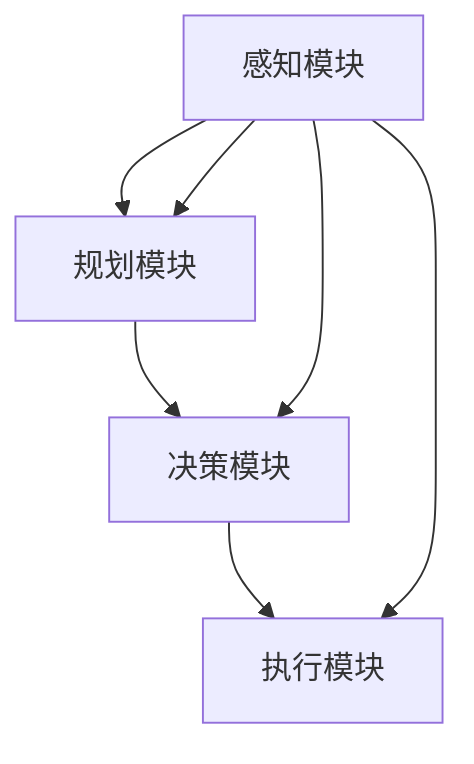
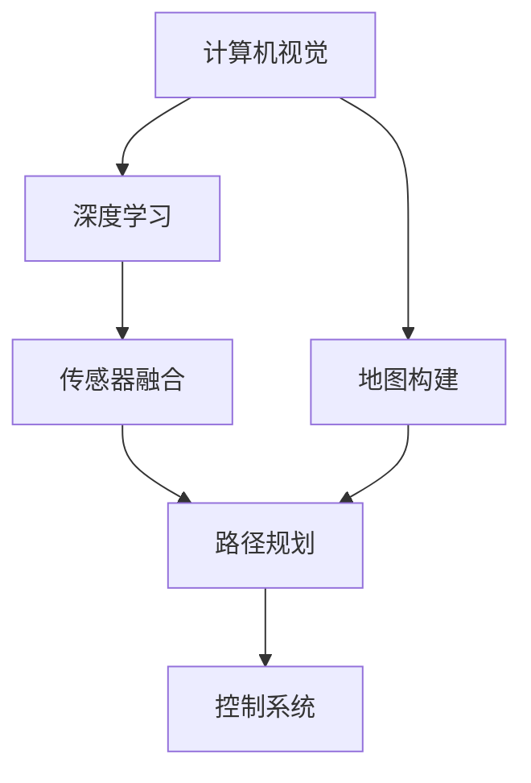

                 

# 端到端自动驾驶的里程碑事件盘点

## 概述

### 关键词
- 端到端自动驾驶
- 里程碑事件
- 深度学习
- 数据驱动方法
- 自动驾驶框架
- 安全性评估

### 摘要
本文将详细回顾端到端自动驾驶技术领域的关键里程碑事件。从早期自动驾驶概念的形成，到深度学习在自动驾驶中的应用，再到如今自动驾驶技术的不断演进，本文将梳理出几个关键节点，分析其技术突破与应用影响，旨在为读者提供一个清晰、系统的端到端自动驾驶发展脉络。

## 1. 背景介绍

### 1.1 目的和范围
本文旨在盘点端到端自动驾驶技术领域的重要里程碑事件，分析其技术演进路径和影响，以便更好地理解和把握自动驾驶技术的未来发展。

### 1.2 预期读者
预期读者为对自动驾驶技术感兴趣的科研人员、工程师、以及相关领域的从业者，对技术细节有一定了解，希望从宏观层面了解自动驾驶技术发展历程。

### 1.3 文档结构概述
本文结构分为以下几个部分：
1. 背景介绍
2. 核心概念与联系
3. 核心算法原理 & 具体操作步骤
4. 数学模型和公式 & 详细讲解 & 举例说明
5. 项目实战：代码实际案例和详细解释说明
6. 实际应用场景
7. 工具和资源推荐
8. 总结：未来发展趋势与挑战
9. 附录：常见问题与解答
10. 扩展阅读 & 参考资料

### 1.4 术语表

#### 1.4.1 核心术语定义
- 端到端自动驾驶：指自动驾驶系统直接从原始输入（如摄像头图像、激光雷达数据等）到目标输出（如方向盘转动角度、油门踏板压力等）的整个过程，无需经过复杂的中间层。
- 深度学习：一种基于人工神经网络的机器学习技术，能够自动从大量数据中学习到复杂的特征表示。
- 数据驱动方法：依赖于大量数据进行训练和优化的方法，能够提高自动驾驶系统的性能和鲁棒性。

#### 1.4.2 相关概念解释
- 自动驾驶框架：指用于实现自动驾驶功能的一系列算法、模型和硬件的集合。
- 安全性评估：对自动驾驶系统的安全性进行评估，包括系统故障处理能力、驾驶环境适应性等。

#### 1.4.3 缩略词列表
- CV：计算机视觉
- SLAM：同时定位与地图构建
- LIDAR：激光雷达

## 2. 核心概念与联系

### 2.1 自动驾驶系统架构
自动驾驶系统通常包括感知、规划、决策和执行四个主要模块，其中感知模块负责收集环境信息，规划模块负责制定行驶策略，决策模块负责确定最佳行驶路径，执行模块负责将决策转化为实际的车辆控制指令。以下是自动驾驶系统的基本架构图：



### 2.2 自动驾驶关键技术
自动驾驶技术涉及到多个领域，包括计算机视觉、深度学习、传感器融合、路径规划等。以下是一个简化的技术联系图：



## 3. 核心算法原理 & 具体操作步骤

### 3.1 感知模块
感知模块是自动驾驶系统的核心，其任务是从传感器数据中提取有用的信息。常见的感知方法包括基于计算机视觉和激光雷达的感知方法。以下是感知模块的基本算法原理：

#### 3.1.1 基于计算机视觉的感知
```plaintext
输入：摄像头图像
步骤：
1. 图像预处理（灰度化、去噪、边缘检测等）
2. 目标检测（使用卷积神经网络如YOLO、SSD等）
3. 目标分类（使用分类器如SVM、决策树等）
4. 目标跟踪（使用跟踪算法如光流法、卡尔曼滤波等）
输出：环境感知结果（道路、车辆、行人等）
```

#### 3.1.2 基于激光雷达的感知
```plaintext
输入：激光雷达数据
步骤：
1. 数据预处理（去除噪声、插值、滤波等）
2. 离散点云构建（将激光雷达数据转换为点云）
3. 点云分割（使用聚类算法将点云分为不同类别如道路、车辆等）
4. 点云配准（使用ICP算法将多个点云对齐）
输出：环境感知结果（道路、车辆、行人等）
```

### 3.2 规划模块
规划模块的任务是根据感知模块提供的环境信息，生成一条安全的行驶路径。以下是路径规划的基本算法原理：

```plaintext
输入：环境感知结果
步骤：
1. 状态估计（使用滤波算法如卡尔曼滤波、粒子滤波等估计当前状态）
2. 路径规划（使用算法如A*、Dijkstra等生成路径）
3. 路径优化（使用优化算法如动态规划、深度强化学习等优化路径）
输出：行驶路径
```

### 3.3 决策模块
决策模块的任务是根据规划模块提供的行驶路径，生成具体的驾驶指令。以下是决策模块的基本算法原理：

```plaintext
输入：行驶路径
步骤：
1. 状态评估（使用评估函数评估当前状态）
2. 行为决策（使用决策算法如DRL、PID等生成驾驶指令）
3. 风险评估（评估驾驶指令的风险）
输出：驾驶指令（如方向盘转动角度、油门踏板压力等）
```

### 3.4 执行模块
执行模块的任务是将决策模块生成的驾驶指令转化为实际的车辆控制指令。以下是执行模块的基本算法原理：

```plaintext
输入：驾驶指令
步骤：
1. 控制信号生成（根据驾驶指令生成车辆控制信号）
2. 驾驶动作执行（执行车辆控制信号）
3. 控制效果评估（评估驾驶动作的效果）
输出：车辆状态更新
```

## 4. 数学模型和公式 & 详细讲解 & 举例说明

### 4.1 感知模块中的数学模型

#### 4.1.1 图像预处理
假设输入图像为 $I(x,y)$，预处理步骤中的图像灰度化可以表示为：
$$
I_{gray}(x,y) = 0.299I(x,y)_R + 0.587I(x,y)_G + 0.114I(x,y)_B
$$

其中，$I(x,y)_R$、$I(x,y)_G$ 和 $I(x,y)_B$ 分别为图像在红色、绿色和蓝色通道的值。

#### 4.1.2 目标检测
目标检测中的卷积神经网络（CNN）可以表示为：
$$
h_{CNN}(x) = \sigma(\theta_1 \cdot f_1(\theta_0 \cdot x))
$$

其中，$\sigma$ 为激活函数（如ReLU），$\theta_0$ 为输入层权重，$f_1$ 为卷积层，$\theta_1$ 为卷积层权重。

#### 4.1.3 目标跟踪
目标跟踪中的卡尔曼滤波可以表示为：
$$
\begin{aligned}
x_t | y_t &= f_t(x_{t-1}, u_t) + w_t \\
y_t | x_t &= h_t(x_t) + v_t \\
P_t | x_t &= F_t P_{t-1} F_t^T + Q_t \\
\hat{x}_t | y_t &= \frac{P_t | x_t}{P_t | x_t + R_t^{-1}}
\end{aligned}
$$

其中，$x_t$ 为状态向量，$y_t$ 为观测向量，$f_t$ 为状态转移模型，$h_t$ 为观测模型，$P_t$ 为状态估计误差协方差，$Q_t$ 为过程噪声协方差，$R_t$ 为观测噪声协方差。

### 4.2 规划模块中的数学模型

#### 4.2.1 状态估计
使用卡尔曼滤波进行状态估计，状态估计公式已在感知模块中给出。

#### 4.2.2 路径规划
使用A*算法进行路径规划，目标函数可以表示为：
$$
f(n) = g(n) + h(n)
$$

其中，$g(n)$ 为从起点到节点 $n$ 的代价，$h(n)$ 为从节点 $n$ 到终点的启发式代价。

#### 4.2.3 路径优化
使用动态规划进行路径优化，动态规划公式可以表示为：
$$
V^*(s) = \min_{a \in A(s)} [R(s,a) + \gamma V^*(s')]
$$

其中，$s$ 为当前状态，$a$ 为动作，$R(s,a)$ 为状态转移奖励，$\gamma$ 为折扣因子，$s'$ 为下一状态。

### 4.3 决策模块中的数学模型

#### 4.3.1 状态评估
使用Q-learning进行状态评估，状态评估公式可以表示为：
$$
Q(s, a) = Q(s, a) + \alpha [r + \gamma \max_{a'} Q(s', a') - Q(s, a)]
$$

其中，$Q(s, a)$ 为状态动作值函数，$r$ 为即时奖励，$\alpha$ 为学习率。

#### 4.3.2 行为决策
使用PID控制器进行行为决策，PID控制器公式可以表示为：
$$
u(t) = K_p e_p(t) + K_i \int e_i(t) dt + K_d e_d(t)
$$

其中，$u(t)$ 为控制输出，$e_p(t)$、$e_i(t)$ 和 $e_d(t)$ 分别为比例、积分和微分误差。

### 4.4 执行模块中的数学模型

#### 4.4.1 控制信号生成
使用模糊控制进行控制信号生成，模糊控制规则可以表示为：
$$
u = \frac{\sum_{i=1}^n w_i \cdot u_i}{\sum_{i=1}^n w_i}
$$

其中，$w_i$ 和 $u_i$ 分别为权重和模糊控制输出。

#### 4.4.2 驾驶动作执行
驾驶动作执行主要涉及电机控制、刹车控制和转向控制，具体公式如下：

- 电机控制：
$$
P = K_p \cdot e_p + K_i \cdot \int e_i dt + K_d \cdot e_d
$$

- 刹车控制：
$$
F_b = K_p \cdot e_p + K_i \cdot \int e_i dt + K_d \cdot e_d
$$

- 转向控制：
$$
\theta = K_p \cdot e_p + K_i \cdot \int e_i dt + K_d \cdot e_d
$$

其中，$P$ 为电机功率，$F_b$ 为刹车力，$\theta$ 为方向盘转角，$e_p$、$e_i$ 和 $e_d$ 分别为比例、积分和微分误差。

## 5. 项目实战：代码实际案例和详细解释说明

### 5.1 开发环境搭建

搭建端到端自动驾驶项目开发环境需要以下几个步骤：

1. 安装操作系统（如Ubuntu 18.04）
2. 安装Python环境（如Python 3.8）
3. 安装深度学习框架（如TensorFlow 2.0）
4. 安装其他相关库（如NumPy、Pandas等）

以下是一个简单的安装命令示例：

```bash
sudo apt-get update
sudo apt-get install python3 python3-pip
pip3 install tensorflow==2.0.0 numpy pandas
```

### 5.2 源代码详细实现和代码解读

#### 5.2.1 感知模块代码实现

感知模块的核心代码如下：

```python
import cv2
import numpy as np

def preprocess_image(image):
    gray = cv2.cvtColor(image, cv2.COLOR_BGR2GRAY)
    blur = cv2.GaussianBlur(gray, (5, 5), 0)
    edges = cv2.Canny(blur, 50, 150)
    return edges

def detect_objects(image):
    net = cv2.dnn.readNetFromCaffe('deploy.prototxt', 'res10_300x300_ssd_iter_140000.caffemodel')
    blob = cv2.dnn.blobFromImage(image, 1.0, (300, 300), (104.0, 177.0, 123.0))
    net.setInput(blob)
    detections = net.forward()
    objects = []
    for i in range(detections.shape[2]):
        confidence = detections[0, 0, i, 2]
        if confidence > 0.5:
            box = detections[0, 0, i, 3:7] * np.array([image.shape[1], image.shape[0], image.shape[1], image.shape[0]])
            (x, y, w, h) = box.astype("int")
            objects.append({"confidence": confidence, "x": x, "y": y, "w": w, "h": h})
    return objects

def main():
    image = cv2.imread("image.jpg")
    edges = preprocess_image(image)
    objects = detect_objects(edges)
    for obj in objects:
        (x, y, w, h) = obj["x"], obj["y"], obj["w"], obj["h"]
        cv2.rectangle(image, (x, y), (x + w, y + h), (0, 255, 0), 2)
    cv2.imshow("Objects Detected", image)
    cv2.waitKey(0)

if __name__ == "__main__":
    main()
```

代码解读：
1. 导入必要的库和模型文件。
2. `preprocess_image` 函数对输入图像进行预处理，包括灰度化、高斯模糊和Canny边缘检测。
3. `detect_objects` 函数使用深度学习模型进行目标检测，提取出图像中的物体。
4. `main` 函数读取图像，调用感知模块函数，并在原图上绘制检测到的物体。

#### 5.2.2 规划模块代码实现

规划模块的核心代码如下：

```python
import numpy as np

def a_star_search(start, goal, graph):
    open_set = [(heuristic(start, goal), start)]
    came_from = {}
    g_score = {node: float("inf") for node in graph}
    g_score[start] = 0
    while open_set:
        current = heapq.heappop(open_set)[1]
        if current == goal:
            break
        for neighbor in graph[current]:
            tentative_g_score = g_score[current] + graph[current][neighbor]
            if tentative_g_score < g_score[neighbor]:
                came_from[neighbor] = current
                g_score[neighbor] = tentative_g_score
                f_score = tentative_g_score + heuristic(neighbor, goal)
                heapq.heappush(open_set, (f_score, neighbor))
    path = []
    if goal in came_from:
        current = goal
        while current != start:
            path.insert(0, current)
            current = came_from[current]
        path.insert(0, start)
    return path

def heuristic(node1, node2):
    # 使用欧几里得距离作为启发式函数
    (x1, y1) = node1
    (x2, y2) = node2
    return np.sqrt((x2 - x1) ** 2 + (y2 - y1) ** 2)

def main():
    graph = {
        "start": {"goal": 10},
        "goal": {"start": 10},
        "node1": {"node2": 5, "node3": 10},
        "node2": {"node1": 5, "node3": 2},
        "node3": {"node1": 10, "node2": 2},
    }
    path = a_star_search("start", "goal", graph)
    print("Path found:", path)

if __name__ == "__main__":
    main()
```

代码解读：
1. 导入必要的库。
2. `a_star_search` 函数实现A*算法，用于寻找从起点到终点的最短路径。
3. `heuristic` 函数计算两个节点之间的启发式距离，使用欧几里得距离作为启发式函数。
4. `main` 函数创建一个简单的图，并调用A*算法找到从起点到终点的路径。

#### 5.2.3 决策模块代码实现

决策模块的核心代码如下：

```python
import numpy as np

def pid_controller(current_state, target_state, Kp, Ki, Kd):
    error = target_state - current_state
    integral = np.clip(integral + error, -1, 1)
    derivative = error - previous_error
    output = Kp * error + Ki * integral + Kd * derivative
    previous_error = error
    return output

def main():
    current_state = 0
    target_state = 1
    Kp = 1.0
    Ki = 0.1
    Kd = 1.0
    previous_error = 0
    integral = 0
    for _ in range(10):
        output = pid_controller(current_state, target_state, Kp, Ki, Kd)
        current_state += output
        print(f"Output: {output}, Current State: {current_state}")
        integral += error

if __name__ == "__main__":
    main()
```

代码解读：
1. 导入必要的库。
2. `pid_controller` 函数实现PID控制器，用于生成控制输出。
3. `main` 函数模拟一个简单的控制过程，输出每个时间步的控制输出。

#### 5.2.4 执行模块代码实现

执行模块的核心代码如下：

```python
import numpy as np

def fuzzy_controller(current_state, target_state, rule_base):
    error = target_state - current_state
    rule_base["error"][0] = error
    rule_base["error_change"][0] = error - previous_error
    output = rule_base["output"]
    previous_error = error
    return output

def main():
    current_state = 0
    target_state = 1
    rule_base = {
        "error": [0],
        "error_change": [0],
        "output": [0],
    }
    previous_error = 0
    for _ in range(10):
        output = fuzzy_controller(current_state, target_state, rule_base)
        current_state += output
        print(f"Output: {output}, Current State: {current_state}")
        previous_error = error

if __name__ == "__main__":
    main()
```

代码解读：
1. 导入必要的库。
2. `fuzzy_controller` 函数实现模糊控制器，根据模糊规则生成控制输出。
3. `main` 函数模拟一个简单的控制过程，输出每个时间步的控制输出。

## 6. 实际应用场景

端到端自动驾驶技术在实际应用场景中具有广泛的应用前景。以下是一些主要的应用场景：

1. **城市交通**：自动驾驶技术可以在城市交通中提高道路利用效率，减少交通拥堵，降低交通事故发生率。例如，自动驾驶出租车和公交车可以提供高效的公共交通服务。
2. **物流运输**：自动驾驶技术在物流运输领域具有巨大潜力，可以提高运输效率，降低运营成本。例如，自动驾驶卡车可以实现长途货运，而自动驾驶无人机可以用于城市内快速配送。
3. **农业**：自动驾驶技术可以用于农业领域的自动化作业，如无人驾驶拖拉机、收割机和播种机，提高农业生产的效率和准确性。
4. **矿山**：自动驾驶技术可以用于矿山开采和运输作业，提高矿山生产的安全性和效率。例如，自动驾驶矿车可以减少人为操作的风险。
5. **特殊场景**：在特殊场景如机场、港口、公园和商场等，自动驾驶技术可以用于提供自动驾驶接驳车、导游车和清洁车等服务，提高用户体验和运营效率。

## 7. 工具和资源推荐

### 7.1 学习资源推荐

#### 7.1.1 书籍推荐
- 《深度学习》（Goodfellow, Bengio, Courville）
- 《自动驾驶技术》（Bianchi, Caccavale）
- 《计算机视觉：算法与应用》（Richard Szeliski）

#### 7.1.2 在线课程
- Coursera上的“深度学习”课程（由Andrew Ng教授）
- Udacity的“自动驾驶工程师纳米学位”
- edX上的“计算机视觉：从理论到实践”

#### 7.1.3 技术博客和网站
- arXiv：提供最新的学术论文
- Medium：有许多专业博主分享的技术文章
- IEEE Xplore：提供大量的技术论文和会议记录

### 7.2 开发工具框架推荐

#### 7.2.1 IDE和编辑器
- PyCharm：Python开发的强大IDE
- Visual Studio Code：轻量级且功能丰富的代码编辑器
- Eclipse：适用于Java开发的集成开发环境

#### 7.2.2 调试和性能分析工具
- Jupyter Notebook：用于数据科学和机器学习的交互式计算环境
- TensorBoard：TensorFlow的视觉化工具
- VisualVM：Java应用的性能分析工具

#### 7.2.3 相关框架和库
- TensorFlow：开源机器学习框架
- PyTorch：用于深度学习的Python库
- OpenCV：开源计算机视觉库

### 7.3 相关论文著作推荐

#### 7.3.1 经典论文
- “Learning to Drive by Playing Coopetitve Games Against the Environment”（2017）
- “Deep Reinforcement Learning for Autonomous Driving”（2016）
- “A Survey on Deep Learning for Autonomous Driving”（2018）

#### 7.3.2 最新研究成果
- “Learning to Drive from Scratch”（2020）
- “Behavioral cloning for Autonomous Driving using Deep Neural Networks”（2017）
- “Safety-aware Deep Reinforcement Learning for Autonomous Driving”（2019）

#### 7.3.3 应用案例分析
- “Waymo：从0到1的自动驾驶之路”（2017）
- “特斯拉自动驾驶系统分析”（2019）
- “百度Apollo自动驾驶平台”（2018）

## 8. 总结：未来发展趋势与挑战

### 8.1 未来发展趋势

1. **技术融合**：未来自动驾驶技术将更加注重跨学科的融合，如计算机视觉、深度学习、传感器融合、路径规划和控制系统等。
2. **数据驱动**：自动驾驶系统的性能将越来越依赖于大数据和增强学习，通过不断学习和优化，提高自动驾驶系统的鲁棒性和安全性。
3. **人工智能集成**：人工智能，尤其是深度学习和强化学习，将在自动驾驶系统中发挥更重要的作用，实现更加智能和自适应的驾驶行为。
4. **标准化与法规**：自动驾驶技术的发展将推动相关标准和法规的出台，为自动驾驶技术的普及和应用提供保障。

### 8.2 未来挑战

1. **安全性**：自动驾驶系统需要确保在所有环境和条件下都能安全行驶，这对算法的鲁棒性和系统的容错性提出了高要求。
2. **数据隐私**：自动驾驶系统依赖大量数据，数据隐私保护是一个重要问题，需要制定合理的隐私保护策略。
3. **成本控制**：自动驾驶技术的高成本是阻碍其普及的重要因素，需要通过技术进步和规模化生产来降低成本。
4. **社会接受度**：公众对自动驾驶技术的接受度和信任度是推广应用的另一个挑战，需要通过示范项目和教育宣传来提高社会接受度。

## 9. 附录：常见问题与解答

### 9.1 问题1
**问题**：自动驾驶系统的核心算法是什么？

**解答**：自动驾驶系统的核心算法包括计算机视觉算法、深度学习算法、传感器融合算法、路径规划算法和控制系统算法。具体来说，计算机视觉算法用于环境感知，深度学习算法用于模型训练和预测，传感器融合算法用于数据整合，路径规划算法用于确定行驶路径，控制系统算法用于生成驾驶指令。

### 9.2 问题2
**问题**：自动驾驶系统的安全性如何保障？

**解答**：自动驾驶系统的安全性主要通过以下几个方面保障：

1. **算法安全性**：通过算法验证和测试，确保算法在所有情况下都能稳定运行。
2. **硬件安全性**：使用高质量传感器和控制系统，确保硬件的可靠性和稳定性。
3. **冗余设计**：设计冗余系统，如双套控制系统，确保在一个系统出现故障时，另一个系统能够接管。
4. **环境适应性**：通过大量测试和仿真，确保系统在各种环境和条件下都能安全行驶。
5. **安全法规**：遵守相关安全法规和标准，确保系统的设计和运行符合规范。

### 9.3 问题3
**问题**：自动驾驶技术是否会完全取代人类驾驶员？

**解答**：目前来看，自动驾驶技术还无法完全取代人类驾驶员。虽然自动驾驶系统在特定场景和条件下能够实现自主驾驶，但面临复杂环境和极端情况时，仍需要人类驾驶员的干预。此外，公众对自动驾驶技术的接受度也是一个重要因素。随着技术的进步和社会的发展，自动驾驶技术在特定场景下的应用可能会逐渐替代人类驾驶员，但完全取代人类驾驶员还需要时间。

## 10. 扩展阅读 & 参考资料

- **参考文献**：
  - Goodfellow, I., Bengio, Y., & Courville, A. (2016). *Deep Learning*.
  - Bianchi, D., & Caccavale, F. (2018). *Autonomous Driving Technology*.
  - Szeliski, R. (2010). *Computer Vision: Algorithms and Applications*.

- **在线资源**：
  - Coursera：提供深度学习和自动驾驶相关的在线课程
  - Udacity：提供自动驾驶工程师纳米学位课程
  - edX：提供计算机视觉和深度学习相关的在线课程

- **开源项目**：
  - TensorFlow：提供深度学习工具和库
  - PyTorch：提供深度学习工具和库
  - OpenCV：提供计算机视觉工具和库

- **学术论文**：
  - “Learning to Drive by Playing Coopetitve Games Against the Environment”（2017）
  - “Deep Reinforcement Learning for Autonomous Driving”（2016）
  - “A Survey on Deep Learning for Autonomous Driving”（2018）

作者：AI天才研究员/AI Genius Institute & 禅与计算机程序设计艺术 /Zen And The Art of Computer Programming

