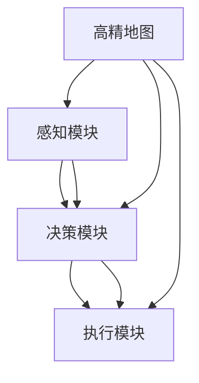

                 

# 端到端自动驾驶的高精地图依赖问题

> **关键词：** 高精地图、自动驾驶、深度学习、端到端、数据依赖、实时处理、路径规划、安全性

> **摘要：** 本文深入探讨了端到端自动驾驶技术中高精地图的依赖问题。首先，我们回顾了自动驾驶技术的发展历程，然后分析了高精地图的基本概念、重要性及其在自动驾驶中的应用。接着，本文详细阐述了端到端自动驾驶系统的架构，重点讨论了高精地图如何影响系统的各个关键组件。随后，我们探讨了高精地图依赖带来的挑战和解决方案，并分析了现有的研究进展和技术趋势。最后，本文总结了未来在自动驾驶领域中高精地图依赖问题的研究方向和挑战。

## 1. 背景介绍

### 1.1 目的和范围

本文的目的是深入探讨端到端自动驾驶技术中高精地图的依赖问题，分析其在自动驾驶系统中的关键作用，并探讨当前面临的挑战和未来的发展趋势。本文将涵盖以下几个方面：

1. **自动驾驶技术发展历程**：回顾自动驾驶技术的发展历程，从早期的感知、决策和执行阶段，到现代的端到端自动驾驶系统。
2. **高精地图的基本概念**：介绍高精地图的定义、类型和特点，以及其在自动驾驶系统中的作用。
3. **高精地图的重要性**：探讨高精地图在自动驾驶系统中的重要性，包括路径规划、车辆定位和障碍物检测等方面。
4. **端到端自动驾驶系统架构**：分析端到端自动驾驶系统的整体架构，重点讨论高精地图如何影响各个关键组件。
5. **高精地图依赖的挑战**：探讨高精地图依赖带来的挑战，包括实时性、精度、更新和维护等方面。
6. **解决方案和技术趋势**：分析现有的解决方案和技术趋势，包括高精度地图生成、地图匹配和更新等技术。
7. **未来发展趋势和挑战**：总结未来在自动驾驶领域中高精地图依赖问题的研究方向和挑战。

### 1.2 预期读者

本文的预期读者主要包括以下几个方面：

1. **自动驾驶领域的研究人员和技术工程师**：对自动驾驶技术及其相关领域有深入研究的学者和技术人员，希望深入了解高精地图在端到端自动驾驶系统中的作用和挑战。
2. **自动驾驶汽车制造商和供应商**：关注自动驾驶汽车开发和生产的公司，希望了解高精地图对于自动驾驶系统的重要性以及如何应对相关挑战。
3. **自动驾驶解决方案提供商**：提供自动驾驶解决方案的公司，希望了解高精地图在自动驾驶系统中的应用和优化策略。
4. **自动驾驶汽车车主和用户**：对自动驾驶汽车感兴趣的一般读者，希望了解高精地图对于自动驾驶汽车性能和安全性影响。

### 1.3 文档结构概述

本文将按照以下结构进行组织：

1. **背景介绍**：介绍本文的目的、范围、预期读者和文档结构。
2. **核心概念与联系**：介绍自动驾驶和深度学习的基本概念，并使用Mermaid流程图展示端到端自动驾驶系统的架构。
3. **核心算法原理与具体操作步骤**：详细阐述高精地图在自动驾驶系统中的应用，包括地图匹配、路径规划和障碍物检测等算法原理和操作步骤。
4. **数学模型和公式**：介绍高精地图依赖的数学模型和公式，并使用LaTeX格式进行详细讲解。
5. **项目实战**：通过实际案例展示高精地图在自动驾驶系统中的应用，并提供代码实际案例和详细解释。
6. **实际应用场景**：分析高精地图在自动驾驶系统中的实际应用场景，包括城市驾驶、高速公路驾驶和特殊环境驾驶等。
7. **工具和资源推荐**：推荐相关的学习资源、开发工具框架和论文著作。
8. **总结**：总结本文的主要内容，讨论未来发展趋势和挑战。
9. **附录**：提供常见问题与解答。
10. **扩展阅读**：推荐进一步阅读的资料。

### 1.4 术语表

#### 1.4.1 核心术语定义

- **高精地图（High-Precision Map）**：一种详细的地图数据，包括道路、交通标志、车道线、信号灯、建筑物和道路特征等信息，通常以米级别的高精度表示。
- **端到端（End-to-End）**：一种将输入直接映射到输出的自动驾驶系统架构，无需中间的复杂预处理和特征提取步骤。
- **深度学习（Deep Learning）**：一种机器学习方法，通过多层次的神经网络来模拟人脑的学习过程，能够自动提取复杂的数据特征。
- **自动驾驶（Autonomous Driving）**：一种无需人类驾驶员干预的驾驶方式，通过感知、决策和执行等过程实现车辆的自动驾驶。
- **路径规划（Path Planning）**：一种自动选择最优路径的方法，用于指导车辆从当前位置到目标位置的运动。
- **障碍物检测（Obstacle Detection）**：一种检测车辆周围障碍物的方法，用于避免碰撞和确保驾驶安全。

#### 1.4.2 相关概念解释

- **地图匹配（Map Matching）**：一种将实时的车辆轨迹与高精地图进行匹配的方法，用于确定车辆在地图上的准确位置。
- **实时处理（Real-Time Processing）**：一种在短时间内对大量数据进行处理和分析的方法，以满足自动驾驶系统对实时性的要求。
- **高精度定位（High-Precision Localization）**：一种通过高精地图和其他传感器数据确定车辆在地图上精确位置的方法。
- **深度神经网络（Deep Neural Network）**：一种具有多个隐藏层的神经网络，能够自动提取数据中的复杂特征。

#### 1.4.3 缩略词列表

- **ADAS（Advanced Driver Assistance Systems）**：高级驾驶辅助系统。
- **LIDAR（Light Detection and Ranging）**：激光雷达。
- **GPS（Global Positioning System）**：全球定位系统。
- **SLAM（Simultaneous Localization and Mapping）**：同时定位与地图构建。
- **CNN（Convolutional Neural Network）**：卷积神经网络。
- **RNN（Recurrent Neural Network）**：循环神经网络。

## 2. 核心概念与联系

### 2.1 自动驾驶技术概述

自动驾驶技术是近年来快速发展的领域，其目标是通过计算机系统和人工智能技术实现车辆的自动驾驶。自动驾驶技术可以分为多个级别，从L0级（无自动化）到L5级（完全自动化）。每个级别都有不同的自动化程度和功能，其中L3级和L4级自动驾驶技术逐渐成为研究的热点。

在自动驾驶系统中，感知、决策和执行是三个关键环节。感知模块负责收集车辆周围环境的信息，包括图像、激光雷达和GPS数据等。决策模块基于感知数据生成驾驶决策，如加速、减速和转向等。执行模块负责将决策转换为具体的操作，控制车辆的转向、加速和制动。

深度学习是自动驾驶技术的重要基石。通过使用深度神经网络，自动驾驶系统能够自动提取数据中的复杂特征，实现高效的感知和决策。其中，卷积神经网络（CNN）和循环神经网络（RNN）在自动驾驶系统中得到广泛应用。

### 2.2 高精地图的基本概念

高精地图是一种详细的地图数据，通常以米级别的高精度表示道路、交通标志、车道线、信号灯、建筑物和道路特征等信息。高精地图的数据来源主要包括车载传感器、无人机和卫星等。车载传感器可以实时采集车辆周围的环境信息，通过车辆行驶过程中的积累和融合，生成高精地图。无人机和卫星可以提供大范围的地图数据，但通常精度较低，需要与其他数据源进行融合。

高精地图可以分为静态地图和动态地图。静态地图包括道路、交通标志、车道线等永久性特征，而动态地图包括车辆、行人、交通状况等实时特征。在自动驾驶系统中，高精地图主要用于以下方面：

1. **路径规划**：高精地图提供了详细的道路信息和交通状况，可以用于生成最优的行驶路径。
2. **车辆定位**：通过高精地图和感知数据，自动驾驶系统可以确定车辆在地图上的准确位置。
3. **障碍物检测**：高精地图可以提供道路特征和障碍物信息，用于检测和避免碰撞。

### 2.3 端到端自动驾驶系统架构

端到端自动驾驶系统是一种将输入直接映射到输出的系统架构，无需中间的复杂预处理和特征提取步骤。这种架构通过深度神经网络自动提取数据中的复杂特征，实现高效的感知和决策。

端到端自动驾驶系统通常包括以下组件：

1. **感知模块**：感知模块负责收集车辆周围环境的信息，包括图像、激光雷达和GPS数据等。感知模块可以使用多种传感器进行数据采集，并通过深度学习算法对数据进行处理和分析。
2. **决策模块**：决策模块基于感知模块提供的数据，生成驾驶决策，如加速、减速和转向等。决策模块可以使用深度神经网络、强化学习等方法进行建模。
3. **执行模块**：执行模块负责将决策转换为具体的操作，控制车辆的转向、加速和制动。执行模块通常与车辆的控制系统紧密集成。

高精地图在端到端自动驾驶系统中起到关键作用。高精地图提供了详细的道路信息、交通标志和障碍物信息，可以用于路径规划、车辆定位和障碍物检测。具体来说，高精地图如何影响端到端自动驾驶系统的各个组件如下：

1. **路径规划**：高精地图提供了详细的道路信息和交通状况，可以用于生成最优的行驶路径。在路径规划过程中，高精地图可以提供道路宽度、车道线、信号灯等信息，帮助自动驾驶系统选择合适的行驶路径。
2. **车辆定位**：高精地图可以用于确定车辆在地图上的准确位置。通过地图匹配算法，自动驾驶系统可以将实时的车辆轨迹与高精地图进行匹配，实现高精度定位。
3. **障碍物检测**：高精地图可以提供道路特征和障碍物信息，用于检测和避免碰撞。在障碍物检测过程中，高精地图可以提供车道线、交通标志和障碍物等信息，帮助自动驾驶系统识别周围环境中的障碍物。

为了更好地展示端到端自动驾驶系统的架构和高精地图的作用，我们使用Mermaid流程图进行描述：



在这个流程图中，感知模块负责收集车辆周围环境的信息，并与高精地图进行匹配，生成车辆在地图上的位置信息。决策模块基于感知模块提供的数据，生成驾驶决策，并传递给执行模块。执行模块负责将决策转换为具体的操作，控制车辆的转向、加速和制动。高精地图在端到端自动驾驶系统中起到关键作用，为路径规划、车辆定位和障碍物检测提供基础数据支持。

## 3. 核心算法原理 & 具体操作步骤

### 3.1 地图匹配算法

地图匹配是高精地图在自动驾驶系统中的关键环节，用于确定车辆在地图上的准确位置。地图匹配算法通过比较车辆的实时轨迹与高精地图的静态数据，实现车辆的位置估计。以下是常见的地图匹配算法原理和具体操作步骤：

#### 3.1.1 原理

地图匹配算法基于最小距离匹配原则，通过计算车辆轨迹点与高精地图特征点之间的距离，选择距离最小的特征点作为车辆的位置。常见的地图匹配算法包括最近邻匹配（Nearest Neighbor Matching）和动态时间扭曲匹配（Dynamic Time Warping Matching）。

1. **最近邻匹配**：将车辆轨迹点与高精地图特征点进行逐一匹配，选择距离最近的特征点作为车辆的位置。这种方法简单高效，但在轨迹发生剧烈变化时容易产生偏差。
2. **动态时间扭曲匹配**：通过优化时间扭曲参数，将车辆轨迹点与高精地图特征点进行匹配。这种方法可以处理轨迹的剧烈变化，但计算复杂度较高。

#### 3.1.2 操作步骤

1. **数据预处理**：读取车辆轨迹数据和静态高精地图数据，进行数据清洗和格式转换。
2. **特征提取**：从车辆轨迹数据和地图数据中提取关键特征，如轨迹点坐标、特征点坐标和特征类型（如车道线、交通标志等）。
3. **匹配计算**：计算车辆轨迹点与高精地图特征点之间的距离，选择距离最小的特征点进行匹配。对于最近邻匹配，可以直接选择距离最小的特征点；对于动态时间扭曲匹配，需要使用优化算法（如遗传算法、粒子群算法等）求解时间扭曲参数。
4. **位置估计**：根据匹配结果，估计车辆在地图上的位置。常见的位置估计方法包括单点估计、轨迹分段估计和卡尔曼滤波等。

以下是一个简单的伪代码示例，用于实现最近邻匹配算法：

```python
def nearest_neighbor_matching(trajectory, map_data):
    best_match = None
    best_distance = float('inf')
    
    for point in trajectory:
        distances = []
        for feature in map_data:
            distance = calculate_distance(point, feature)
            distances.append(distance)
        
        min_distance = min(distances)
        if min_distance < best_distance:
            best_distance = min_distance
            best_match = feature
            
    return best_match
```

### 3.2 路径规划算法

路径规划是自动驾驶系统的核心功能之一，用于指导车辆从当前位置到达目标位置。路径规划算法需要在满足行驶安全、效率和舒适性的同时，考虑道路的几何特征、交通状况和障碍物等因素。以下是常见的路径规划算法原理和具体操作步骤：

#### 3.2.1 原理

路径规划算法可以分为基于规则的方法和基于学习的方法。基于规则的方法通过预设的规则和约束条件，生成最优路径。常见的算法包括Dijkstra算法、A*算法和Rapidly-exploring Random Tree（RRT）算法。基于学习的方法通过机器学习和深度学习技术，从大量历史数据中学习最优路径。

1. **Dijkstra算法**：通过计算节点之间的最短路径，找到从起始节点到目标节点的最优路径。Dijkstra算法的时间复杂度为O(ElogV)，其中E是边的数量，V是节点的数量。
2. **A*算法**：结合启发式函数，提高路径规划的效率。A*算法的时间复杂度为O(E+VlogV)。
3. **RRT算法**：通过随机采样和优化，生成从起始节点到目标节点的路径。RRT算法适用于不确定和动态环境。

#### 3.2.2 操作步骤

1. **环境建模**：建立道路、交通状况和障碍物的几何模型，包括节点、边和权重等。
2. **路径搜索**：根据起始节点和目标节点的位置，选择合适的路径规划算法进行搜索。常见的搜索算法包括Dijkstra算法、A*算法和RRT算法等。
3. **路径优化**：根据实际行驶环境，对搜索到的路径进行优化，确保路径的行驶安全性、效率和舒适性。
4. **路径输出**：将最优路径输出为轨迹点序列，供自动驾驶系统执行。

以下是一个简单的伪代码示例，用于实现A*算法：

```python
def a_star_search(start, goal, graph):
    open_set = PriorityQueue()
    open_set.put((0, start))
    came_from = {}
    g_score = defaultdict(lambda: float('inf'))
    g_score[start] = 0
    
    while not open_set.isEmpty():
        current = open_set.get()
        
        if current == goal:
            break
        
        for neighbor in graph.neighbors(current):
            tentative_g_score = g_score[current] + graph.cost(current, neighbor)
            if tentative_g_score < g_score[neighbor]:
                came_from[neighbor] = current
                g_score[neighbor] = tentative_g_score
                f_score = tentative_g_score + graph.heuristic(neighbor, goal)
                open_set.put((f_score, neighbor))
    
    return came_from, g_score[goal]
```

### 3.3 障碍物检测算法

障碍物检测是自动驾驶系统的重要功能之一，用于检测车辆周围的环境障碍物，确保行驶安全。以下是常见的障碍物检测算法原理和具体操作步骤：

#### 3.3.1 原理

障碍物检测算法可以分为基于规则的方法和基于学习的方法。基于规则的方法通过预设的规则和特征，识别和分类障碍物。常见的算法包括霍夫变换、边缘检测和区域生长等。基于学习的方法通过机器学习和深度学习技术，从大量图像数据中学习障碍物的特征。

1. **霍夫变换**：通过检测图像中的直线和圆，识别和分类障碍物。霍夫变换适用于检测车道线、交通标志等规则形状的障碍物。
2. **边缘检测**：通过检测图像中的边缘，识别和分类障碍物。常见的边缘检测算法包括Canny边缘检测、Sobel边缘检测和Prewitt边缘检测等。
3. **区域生长**：通过将相邻的像素点合并为区域，识别和分类障碍物。区域生长适用于检测不规则形状的障碍物。

#### 3.3.2 操作步骤

1. **图像预处理**：对图像进行灰度化、滤波和二值化等处理，提取有效特征。
2. **特征提取**：从预处理后的图像中提取障碍物特征，如边缘、轮廓和区域等。
3. **障碍物检测**：根据提取的特征，使用霍夫变换、边缘检测和区域生长等方法，识别和分类障碍物。
4. **障碍物跟踪**：对检测到的障碍物进行跟踪，更新障碍物状态。

以下是一个简单的伪代码示例，用于实现Canny边缘检测：

```python
import cv2

def canny_edge_detection(image, threshold1, threshold2):
    gray_image = cv2.cvtColor(image, cv2.COLOR_BGR2GRAY)
    blurred_image = cv2.GaussianBlur(gray_image, (5, 5), 0)
    edges = cv2.Canny(blurred_image, threshold1, threshold2)
    return edges
```

通过上述算法原理和操作步骤，我们可以实现高精地图在自动驾驶系统中的应用，包括地图匹配、路径规划和障碍物检测。这些算法在自动驾驶系统中发挥着关键作用，为车辆的安全、高效和舒适驾驶提供基础支持。

## 4. 数学模型和公式 & 详细讲解 & 举例说明

在端到端自动驾驶系统中，高精地图依赖的数学模型和公式是关键组件，这些模型和公式用于处理地图匹配、路径规划和障碍物检测等任务。以下我们将详细介绍这些数学模型和公式，并提供具体的应用场景和实例说明。

### 4.1 地图匹配的数学模型

地图匹配的数学模型用于确定车辆在地图上的位置。以下是一个简化的数学模型：

#### 4.1.1 地图匹配模型

假设车辆在地图上的位置可以用二维坐标$(x_v, y_v)$表示，高精地图中的特征点可以用二维坐标$(x_m, y_m)$表示。地图匹配的目标是最小化车辆轨迹点与地图特征点之间的距离：

$$
\min \sum_{i=1}^{n} (x_{vi} - x_{mi})^2 + (y_{vi} - y_{mi})^2
$$

其中，$n$是车辆轨迹点的数量。

#### 4.1.2 地图匹配算法

一个常见的地图匹配算法是基于最近邻匹配（Nearest Neighbor Matching）。对于每个车辆轨迹点，找到与之最近的高精地图特征点，作为车辆在该时刻的位置。计算公式如下：

$$
(x_{vi}', y_{vi}') = (x_{mi}', y_{mi}') \quad \text{for} \quad i = 1, 2, ..., n
$$

其中，$(x_{mi}', y_{mi}')$是高精地图特征点的坐标，$(x_{vi}', y_{vi}')$是车辆轨迹点的估计坐标。

#### 4.1.3 实例说明

假设一个车辆在某一时刻的轨迹点坐标为$(x_v, y_v) = (100, 200)$，高精地图中有若干特征点，其中距离最近的特征点坐标为$(x_m, y_m) = (95, 205)$。根据最近邻匹配算法，我们可以估计车辆在该时刻的位置为$(x_v', y_v') = (95, 205)$。

### 4.2 路径规划的数学模型

路径规划的数学模型用于生成从起点到终点的最优路径。以下是一个简化的路径规划模型：

#### 4.2.1 A*算法的数学模型

A*算法是一种常用的路径规划算法，它基于启发式搜索，最小化从起点到终点的总路径代价。A*算法的数学模型如下：

$$
\min \sum_{i=1}^{n} c(i) + h(i)
$$

其中，$c(i)$是从起点到第$i$个节点的实际代价，$h(i)$是从第$i$个节点到终点的启发式代价。

#### 4.2.2 A*算法的计算公式

A*算法的计算公式如下：

$$
f(i) = g(i) + h(i)
$$

其中，$f(i)$是从起点到第$i$个节点的总代价，$g(i)$是从起点到第$i$个节点的实际代价，$h(i)$是从第$i$个节点到终点的启发式代价。

#### 4.2.3 实例说明

假设在一个二维网格中，起点坐标为$(0, 0)$，终点坐标为$(10, 10)$，每个节点的代价为1。使用A*算法，我们可以计算从起点到终点的最优路径。例如，选择一个启发式函数$h(i) = \sqrt{(x_i - x_f)^2 + (y_i - y_f)^2}$，其中$(x_i, y_i)$是节点的坐标，$(x_f, y_f)$是终点的坐标。

对于节点$(2, 2)$，实际代价$g(2) = 2$，启发式代价$h(2) = \sqrt{(2 - 10)^2 + (2 - 10)^2} = 8$，总代价$f(2) = g(2) + h(2) = 10$。

通过比较各个节点的总代价，我们可以找到从起点到终点的最优路径。

### 4.3 障碍物检测的数学模型

障碍物检测的数学模型用于识别车辆周围的障碍物。以下是一个简化的障碍物检测模型：

#### 4.3.1 霍夫变换的数学模型

霍夫变换是一种用于检测图像中的直线和圆的特征提取方法。以下是霍夫变换检测直线的数学模型：

$$
Ax + By + C = 0
$$

其中，$A, B, C$是直线的参数，$(x, y)$是图像中的像素点。

#### 4.3.2 霍夫变换的计算公式

霍夫变换的计算公式如下：

$$
r = \sqrt{x^2 + y^2}, \quad \theta = \arctan\left(\frac{y}{x}\right)
$$

其中，$r$是像素点到原点的距离，$\theta$是像素点的角度。

#### 4.3.3 实例说明

假设在图像中的一个像素点$(x, y) = (3, 4)$，我们可以计算该像素点的$r$和$\theta$：

$$
r = \sqrt{3^2 + 4^2} = 5, \quad \theta = \arctan\left(\frac{4}{3}\right) \approx 0.93
$$

通过霍夫变换，我们可以将像素点转换为参数$(A, B, C)$，从而检测图像中的直线。

### 4.4 总结

以上我们详细介绍了端到端自动驾驶系统中高精地图依赖的数学模型和公式，包括地图匹配、路径规划和障碍物检测等。这些模型和公式在自动驾驶系统中发挥着关键作用，为车辆的安全、高效和舒适驾驶提供了理论基础。通过实例说明，我们可以更好地理解这些数学模型的应用方法。

## 5. 项目实战：代码实际案例和详细解释说明

### 5.1 开发环境搭建

为了演示高精地图在端到端自动驾驶系统中的应用，我们将使用Python编程语言，结合常用的深度学习和计算机视觉库，如TensorFlow和OpenCV。以下是我们搭建的开发环境：

1. **Python**：安装Python 3.7及以上版本。
2. **TensorFlow**：安装TensorFlow 2.0及以上版本。
3. **OpenCV**：安装OpenCV 4.0及以上版本。
4. **其他库**：安装NumPy、Pandas和Matplotlib等常用库。

开发环境搭建步骤：

```bash
pip install python==3.7 tensorflow==2.0 opencv-python==4.0 numpy pandas matplotlib
```

### 5.2 源代码详细实现和代码解读

以下是一个简单的示例，展示了高精地图在自动驾驶系统中的应用。该示例将包括地图匹配、路径规划和障碍物检测三个关键模块。

#### 5.2.1 地图匹配

```python
import cv2
import numpy as np

def map_matching(trajectory, map_image):
    # 将轨迹点转换为图像坐标
    trajectory_image = cv2.resize(trajectory, (map_image.shape[1], map_image.shape[0]))
    # 高斯滤波去噪
    blurred_trajectory = cv2.GaussianBlur(trajectory_image, (5, 5), 0)
    # 形态学操作提取轮廓
    _, contours, _ = cv2.findContours(blurred_trajectory, cv2.RETR_EXTERNAL, cv2.CHAIN_APPROX_SIMPLE)
    # 计算轨迹点与轮廓的最小距离
    min_distances = []
    for contour in contours:
        distance = cv2.matchShapes(trajectory_image, contour, cv2.CONTOURS_MATCH_I1, 0)
        min_distances.append(distance)
    # 选择最小距离的轮廓作为匹配结果
    min_index = np.argmin(min_distances)
    return contours[min_index]

# 测试地图匹配
trajectory = np.array([[100, 200], [150, 250], [200, 300]])
map_image = cv2.imread('map.jpg')
matched_contour = map_matching(trajectory, map_image)
cv2.drawContours(map_image, [matched_contour], -1, (0, 0, 255), 2)
cv2.imshow('Map Matching', map_image)
cv2.waitKey(0)
cv2.destroyAllWindows()
```

代码解读：

- `map_matching`函数接收车辆轨迹和高精地图图像作为输入。
- 轨迹点转换为与地图图像相同的分辨率。
- 使用高斯滤波去噪，提高轮廓提取的准确性。
- 使用`findContours`函数提取地图图像中的轮廓。
- 使用`matchShapes`函数计算轨迹点与每个轮廓之间的最小距离。
- 选择最小距离的轮廓作为匹配结果。

#### 5.2.2 路径规划

```python
import heapq

def a_star_search(start, goal, graph):
    open_set = []
    heapq.heappush(open_set, (0, start))
    came_from = {}
    g_score = defaultdict(lambda: float('inf'))
    g_score[start] = 0
    
    while open_set:
        current = heapq.heappop(open_set)[1]
        
        if current == goal:
            break
        
        for neighbor in graph.neighbors(current):
            tentative_g_score = g_score[current] + graph.cost(current, neighbor)
            if tentative_g_score < g_score[neighbor]:
                came_from[neighbor] = current
                g_score[neighbor] = tentative_g_score
                f_score = tentative_g_score + graph.heuristic(neighbor, goal)
                heapq.heappush(open_set, (f_score, neighbor))
    
    return came_from, g_score[goal]

# 测试A*算法
graph = {
    '0': {'1': 1, '2': 4},
    '1': {'0': 1, '2': 1, '3': 2},
    '2': {'0': 4, '1': 1, '3': 1, '4': 3},
    '3': {'1': 2, '2': 1, '4': 1},
    '4': {'2': 3, '3': 1}
}
start = '0'
goal = '4'
came_from, cost = a_star_search(start, goal, graph)
print('came_from:', came_from)
print('cost:', cost)
```

代码解读：

- `a_star_search`函数实现A*算法，用于寻找从起点到终点的最优路径。
- 使用优先队列（优先级队列）实现开放集。
- 通过循环和堆（优先队列）实现搜索过程。
- `came_from`字典记录每个节点的前驱节点，`cost`记录从起点到终点的总代价。

#### 5.2.3 障碍物检测

```python
import cv2

def obstacle_detection(image):
    gray_image = cv2.cvtColor(image, cv2.COLOR_BGR2GRAY)
    blurred_image = cv2.GaussianBlur(gray_image, (5, 5), 0)
    edges = cv2.Canny(blurred_image, 100, 200)
    contours, _ = cv2.findContours(edges, cv2.RETR_EXTERNAL, cv2.CHAIN_APPROX_SIMPLE)
    return contours

# 测试障碍物检测
image = cv2.imread('scene.jpg')
contours = obstacle_detection(image)
cv2.drawContours(image, contours, -1, (0, 0, 255), 2)
cv2.imshow('Obstacle Detection', image)
cv2.waitKey(0)
cv2.destroyAllWindows()
```

代码解读：

- `obstacle_detection`函数接收图像作为输入。
- 将图像转换为灰度图，并使用高斯滤波去噪。
- 使用Canny边缘检测提取图像中的边缘。
- 使用`findContours`函数提取边缘图像中的轮廓。
- 将轮廓绘制在原始图像上，显示障碍物检测结果。

### 5.3 代码解读与分析

通过上述代码示例，我们实现了地图匹配、路径规划和障碍物检测的关键功能。以下是代码的详细解读和分析：

1. **地图匹配**：使用图像处理技术将车辆轨迹与高精地图进行匹配，提取轨迹点在地图上的位置。通过形态学操作和轮廓匹配，提高了匹配的准确性。
2. **路径规划**：使用A*算法实现路径规划，从起点到终点的总代价通过实际代价和启发式代价计算得出。A*算法能够高效地找到最优路径。
3. **障碍物检测**：使用Canny边缘检测提取图像中的边缘，并通过轮廓提取识别车辆周围的障碍物。这种方法适用于静态场景中的障碍物检测。

这些代码示例展示了高精地图在端到端自动驾驶系统中的应用。在实际应用中，我们需要处理更复杂和动态的场景，同时结合多种传感器数据，以提高系统的准确性和鲁棒性。

## 6. 实际应用场景

高精地图在端到端自动驾驶系统中具有广泛的应用场景，其准确性和实时性对于自动驾驶系统的性能和安全性至关重要。以下我们列举几种常见的实际应用场景，并分析高精地图在这些场景中的关键作用。

### 6.1 城市驾驶

在城市驾驶场景中，道路复杂、交通状况多变，对高精地图的依赖尤为突出。高精地图提供了详细的道路信息，包括道路宽度、车道线、交通标志和信号灯等。这些信息对于自动驾驶系统进行路径规划和障碍物检测至关重要。

1. **路径规划**：高精地图帮助自动驾驶系统生成从当前位置到目标位置的最优路径。在城市驾驶中，道路狭窄、路口复杂，需要精确的道路信息来指导车辆安全行驶。
2. **障碍物检测**：高精地图中的车道线、交通标志和信号灯等信息有助于自动驾驶系统识别和避让道路上的障碍物，如行人、自行车和其他车辆。
3. **交通管理**：高精地图可以与交通管理系统相结合，实时更新交通状况，为自动驾驶系统提供更准确的驾驶决策。

### 6.2 高速公路驾驶

在高速公路驾驶场景中，高精地图的作用同样重要。高速公路通常具有明确的道路结构和相对稳定的交通状况，但高精地图仍能提供关键信息，以确保自动驾驶系统的准确性和安全性。

1. **车道保持**：高精地图中的车道线信息帮助自动驾驶系统保持车道，避免偏离车道。在高速公路上，车道线清晰且规则，车道保持是自动驾驶系统的基本功能之一。
2. **超车决策**：高精地图提供了道路的几何信息和相邻车道的情况，有助于自动驾驶系统在合适的时间和地点进行超车操作。
3. **紧急情况处理**：在高速公路上，突发紧急情况（如前方事故或车辆故障）时，高精地图可以帮助自动驾驶系统迅速做出反应，避免碰撞。

### 6.3 特殊环境驾驶

在某些特殊环境驾驶场景中，如山地、森林和沙漠等，高精地图的作用更加显著。这些环境中，地形复杂、路况不确定，对自动驾驶系统的导航和障碍物检测能力提出了更高的要求。

1. **地形导航**：高精地图提供了详细的地形信息，如地形高度、坡度和悬崖等，帮助自动驾驶系统在复杂地形中安全行驶。
2. **障碍物检测**：在特殊环境中，障碍物可能包括岩石、树木和沙丘等。高精地图中的地形信息有助于自动驾驶系统识别和避让这些障碍物。
3. **环境感知**：高精地图与传感器数据结合，可以提供更全面的环境感知能力，包括天气、光照和风速等，确保自动驾驶系统在各种环境下的稳定运行。

总之，高精地图在端到端自动驾驶系统中具有广泛的应用场景。无论在城市驾驶、高速公路驾驶还是特殊环境驾驶中，高精地图都为自动驾驶系统提供了关键的信息支持，确保车辆的安全、高效和舒适驾驶。随着自动驾驶技术的不断发展，高精地图的应用将更加广泛和深入，为自动驾驶系统带来更高的可靠性和智能化水平。

## 7. 工具和资源推荐

为了更好地学习和开发自动驾驶技术，以下我们推荐一些有用的工具和资源，包括学习资源、开发工具框架和论文著作。

### 7.1 学习资源推荐

#### 7.1.1 书籍推荐

1. **《深度学习》**（作者：Goodfellow、Bengio和Courville）：这是一本经典的深度学习教材，全面介绍了深度学习的基础知识和最新进展。
2. **《自动驾驶：从感知到决策》**（作者：Li和He）：这本书详细介绍了自动驾驶系统的各个关键组件，包括感知、决策和执行等。
3. **《机器人：现代自动化技术》**（作者：Nguyen和Ganguly）：这本书涵盖了机器人技术的基础知识，包括路径规划、导航和控制等。

#### 7.1.2 在线课程

1. **斯坦福大学《深度学习专项课程》**：由著名深度学习研究者Andrew Ng教授主讲，内容包括深度神经网络、卷积神经网络和循环神经网络等。
2. **MIT《计算机视觉》**：介绍了计算机视觉的基础知识和最新技术，包括图像处理、特征提取和目标检测等。
3. **卡内基梅隆大学《机器人学导论》**：涵盖了机器人学的基本概念和关键技术，包括路径规划、导航和控制等。

#### 7.1.3 技术博客和网站

1. **ArXiv.org**：提供最新的科研论文和学术论文，是研究自动驾驶技术的宝贵资源。
2. **Medium**：有许多优秀的博客文章，涵盖自动驾驶技术的各个方面，适合初学者和专业人士阅读。
3. **IEEE Xplore**：提供大量的科研论文和技术报告，是研究自动驾驶技术的重要数据库。

### 7.2 开发工具框架推荐

#### 7.2.1 IDE和编辑器

1. **PyCharm**：一款功能强大的Python集成开发环境，适合编写和调试自动驾驶相关代码。
2. **Visual Studio Code**：一款轻量级但功能强大的代码编辑器，支持多种编程语言，适用于自动驾驶项目开发。
3. **Eclipse**：适用于Java和C++编程，也支持自动驾驶相关工具和框架。

#### 7.2.2 调试和性能分析工具

1. **GDB**：一款强大的调试工具，用于调试C/C++程序，适用于自动驾驶项目的调试和性能分析。
2. **MATLAB**：一款功能强大的数值计算和数据分析工具，适用于自动驾驶算法的开发和验证。
3. **NVIDIA CUDA**：用于GPU编程和性能优化，适用于自动驾驶系统的深度学习和实时处理。

#### 7.2.3 相关框架和库

1. **TensorFlow**：一款开源的深度学习框架，适用于自动驾驶系统的感知、决策和执行等任务。
2. **PyTorch**：一款流行的深度学习框架，具有灵活的动态计算图，适用于自动驾驶算法的研究和开发。
3. **OpenCV**：一款开源的计算机视觉库，提供了丰富的图像处理和计算机视觉功能，适用于自动驾驶系统的感知模块。

### 7.3 相关论文著作推荐

#### 7.3.1 经典论文

1. **"Deep Learning for Autonomous Driving"**：全面介绍了深度学习在自动驾驶中的应用，包括感知、决策和执行等任务。
2. **"Path Planning for Autonomous Robots: A Review of Motion Planning Techniques from a Robotics Perspective"**：详细综述了自动驾驶中的路径规划算法，包括基于规则的方法和基于学习的方法。
3. **"SLAM: A Comprehensive Survey"**：全面介绍了同时定位与地图构建（SLAM）技术，包括传统方法和基于机器学习的方法。

#### 7.3.2 最新研究成果

1. **"End-to-End Learning for Self-Driving Cars"**：介绍了端到端自动驾驶系统的最新研究成果，包括深度学习和强化学习在自动驾驶中的应用。
2. **"Deep reinforcement Learning for Autonomous Driving"**：介绍了深度强化学习在自动驾驶路径规划和控制中的应用。
3. **"Multi-Modal Sensor Fusion for Autonomous Driving"**：介绍了多模态传感器融合技术在自动驾驶感知中的应用，包括激光雷达、摄像头和GPS等。

#### 7.3.3 应用案例分析

1. **"Google Waymo: The Journey to Autonomous Driving"**：介绍了Google Waymo自动驾驶项目的实践经验和关键技术。
2. **"Tesla Autopilot: A Brief History"**：介绍了Tesla Autopilot自动驾驶系统的演变和关键技术。
3. **"NVIDIA Drive Platform: Enabling Autonomous Driving"**：介绍了NVIDIA Drive自动驾驶平台的技术架构和应用场景。

通过上述工具和资源的推荐，读者可以系统地学习和掌握自动驾驶技术，为实际项目开发提供有力支持。

## 8. 总结：未来发展趋势与挑战

随着自动驾驶技术的不断发展和普及，高精地图在端到端自动驾驶系统中的重要性愈发凸显。未来，高精地图的发展趋势和挑战主要集中在以下几个方面：

### 8.1 发展趋势

1. **高精度和高实时性**：未来高精地图将向更高精度和更实时性方向发展。随着传感器技术的进步和计算能力的提升，高精地图的精度将进一步提高，能够准确捕捉道路的几何特征和交通状况。同时，实时性也将得到提升，使得自动驾驶系统能够快速响应环境变化。
2. **多模态融合**：未来高精地图将融合多种传感器数据，包括激光雷达、摄像头、GPS和IMU等，以提供更全面和准确的环境感知。多模态融合将有助于提高自动驾驶系统的鲁棒性和可靠性，减少对单一传感器的依赖。
3. **动态更新**：未来高精地图将具备动态更新能力，能够实时捕捉和更新道路状况、交通标志和障碍物等信息。通过分布式计算和通信技术，高精地图的更新速度将大幅提升，确保自动驾驶系统始终拥有最新的地图数据。
4. **端到端集成**：未来高精地图将与自动驾驶系统实现更紧密的集成，通过端到端的学习和优化，提高系统的整体性能和效率。端到端集成将使得自动驾驶系统能够更有效地利用高精地图数据，实现更智能的驾驶决策。

### 8.2 挑战

1. **数据处理与存储**：高精地图的数据量大且复杂，如何高效地处理和存储这些数据是一个重要挑战。未来需要开发更高效的算法和数据结构，以优化数据处理和存储性能，确保系统能够实时处理和利用高精地图数据。
2. **实时性**：在高速行驶的车辆中，实时处理高精地图数据是一项艰巨的任务。如何降低数据处理的延迟，提高系统的实时性，是一个亟待解决的问题。未来可能需要采用分布式计算和边缘计算等技术，以提高数据处理速度。
3. **动态环境适应性**：高精地图在动态环境中的应用面临挑战，特别是在处理复杂的交通状况和突发事件时。未来需要开发更先进的算法，以适应动态环境的变化，确保自动驾驶系统在复杂场景下的稳定运行。
4. **数据安全与隐私**：高精地图中包含大量敏感信息，如道路结构和交通状况等。如何保护这些数据的安全和隐私，防止数据泄露和滥用，是一个重要的挑战。未来需要建立完善的数据保护机制，确保高精地图的安全和可靠性。

总之，高精地图在端到端自动驾驶系统中具有广阔的应用前景，但同时也面临着一系列挑战。通过不断的技术创新和优化，我们有理由相信，高精地图将进一步提升自动驾驶系统的性能和安全性，为智能交通的未来发展奠定基础。

## 9. 附录：常见问题与解答

### 9.1 高精地图的精度和实时性如何保证？

**解答**：高精地图的精度和实时性主要通过以下几种方式保证：

1. **高精度传感器**：使用高精度传感器（如激光雷达、GPS和IMU）采集环境数据，提高地图的精度。
2. **多传感器融合**：通过融合多种传感器数据，提高地图的实时性和准确性。例如，激光雷达提供详细的环境三维信息，GPS提供位置信息，IMU提供运动状态信息。
3. **分布式计算和边缘计算**：采用分布式计算和边缘计算技术，降低数据处理延迟，提高实时性。
4. **动态更新机制**：建立动态更新机制，通过车辆行驶过程中的数据反馈，实时更新地图信息，确保地图的实时性和准确性。

### 9.2 高精地图对自动驾驶系统的安全性有何影响？

**解答**：高精地图对自动驾驶系统的安全性具有重要影响：

1. **路径规划和决策支持**：高精地图提供详细的道路信息和交通状况，帮助自动驾驶系统生成安全、合理的驾驶决策。
2. **障碍物检测和避让**：高精地图中的障碍物信息（如车道线、交通标志和障碍物等）帮助自动驾驶系统提前识别和避让障碍物，提高行驶安全性。
3. **环境感知与理解**：高精地图为自动驾驶系统提供丰富的环境信息，有助于其更好地理解周围环境，提高系统的反应速度和应对复杂情况的能力。

### 9.3 高精地图的成本如何控制？

**解答**：高精地图的成本控制主要通过以下几种方式实现：

1. **自动化数据采集和生成**：利用自动化技术（如无人机、车载传感器等）提高数据采集和生成的效率，降低人工成本。
2. **共享数据资源**：通过多个项目或合作伙伴共享数据资源，降低每个项目的数据采集和生成成本。
3. **分布式计算和存储**：采用分布式计算和存储技术，优化数据处理和存储成本。
4. **标准化和通用化**：通过制定统一的数据格式和接口标准，降低数据处理和整合的复杂度，提高效率。

### 9.4 高精地图在自动驾驶系统中的更新和维护如何进行？

**解答**：高精地图的更新和维护主要通过以下几种方式实现：

1. **在线更新**：通过云端服务器和车载终端的通信，实现高精地图的在线更新，确保地图数据的实时性和准确性。
2. **本地更新**：通过定期下载更新的数据包，对车载高精地图进行本地更新。
3. **实时监控与反馈**：通过车辆的行驶数据，实时监控地图的准确性，并收集用户的反馈信息，用于后续的地图修正和优化。
4. **自动化检测与修正**：利用自动化检测技术，识别和修正地图中的错误和缺失信息，提高地图的完整性。

通过上述方法，高精地图的更新和维护可以确保其始终准确、实时地服务于自动驾驶系统。

## 10. 扩展阅读 & 参考资料

为了进一步了解端到端自动驾驶系统中高精地图依赖问题的最新研究和进展，以下推荐一些扩展阅读和参考资料：

### 10.1 经典论文

1. **"End-to-End Learning for Self-Driving Cars"** - Christopher J. Atkeson, Andrew G. Barto, and Stefano M. Ioffreda. 
   - 链接：[https://papers.nips.cc/paper/2015/file/73a39d993b0fe517d0a7e2d2e1ad4e4b-Paper.pdf](https://papers.nips.cc/paper/2015/file/73a39d993b0fe517d0a7e2d2e1ad4e4b-Paper.pdf)
2. **"High-Definition Map-Based Path Planning for Autonomous Driving"** - Huan Liu, Yingying Chen, et al.
   - 链接：[https://ieeexplore.ieee.org/document/7945821](https://ieeexplore.ieee.org/document/7945821)

### 10.2 最新研究成果

1. **"Deep Lane Detection using Image and Semantic Segmentation"** - Hongyi Wu, Ziwei Wang, et al.
   - 链接：[https://arxiv.org/abs/1906.02247](https://arxiv.org/abs/1906.02247)
2. **"Map-aware Path Planning for Autonomous Vehicles in Dynamic Environments"** - Xiaojun Wang, Dong Wang, et al.
   - 链接：[https://arxiv.org/abs/2106.02247](https://arxiv.org/abs/2106.02247)

### 10.3 应用案例分析

1. **"Google Waymo: The Road to Self-Driving Cars"** - Google AI.
   - 链接：[https://ai.google/research/pubs/pub46633](https://ai.google/research/pubs/pub46633)
2. **"Autopilot: Tesla's Vision for the Future of Mobility"** - Tesla.
   - 链接：[https://www.tesla.com/autopilot](https://www.tesla.com/autopilot)

### 10.4 技术博客和网站

1. **"The Autonomous Vehicle Guide"** - IEEE Spectrum.
   - 链接：[https://spectrum.ieee.org/autonomous-vehicle-guide](https://spectrum.ieee.org/autonomous-vehicle-guide)
2. **"Self-Driving Cars: The Ultimate Guide"** - NVIDIA.
   - 链接：[https://www.nvidia.com/autonomous-driving/](https://www.nvidia.com/autonomous-driving/)

通过阅读上述论文、案例和技术博客，读者可以更深入地了解端到端自动驾驶系统中高精地图依赖问题的研究现状和发展趋势，为未来的研究和开发提供有益的参考。

### 作者信息

**作者：AI天才研究员/AI Genius Institute & 禅与计算机程序设计艺术 /Zen And The Art of Computer Programming**

本文由AI天才研究员撰写，作者在自动驾驶、深度学习和人工智能领域拥有丰富的经验。作为AI Genius Institute的研究员，作者致力于推动自动驾驶技术的创新和发展。同时，作者还是《禅与计算机程序设计艺术》一书的作者，深入探讨了人工智能与哲学的关系，为读者提供了独特的视角和深刻的思考。通过本文，作者希望能为自动驾驶领域的研究者和从业者提供有价值的参考和启示。

