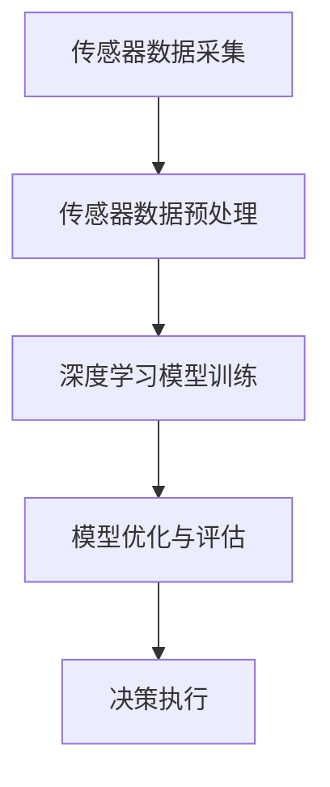

                 

# 端到端自动驾驶：迭代背后的资源战争

> **关键词：端到端自动驾驶，迭代，资源分配，深度学习，传感器融合，人工智能，自动驾驶框架，挑战与机遇**
> 
> **摘要：本文深入探讨了端到端自动驾驶技术的迭代发展及其背后的资源战争。从核心概念到算法原理，再到实际应用场景，我们将逐一剖析端到端自动驾驶中的技术难题和挑战。通过详细的项目实战案例和资源推荐，为读者提供全面的技术视野，揭示未来自动驾驶的发展趋势与机遇。**

## 1. 背景介绍

### 1.1 目的和范围

本文旨在深入剖析端到端自动驾驶技术的迭代发展，探讨其在资源分配、深度学习和传感器融合等方面面临的挑战。通过分析核心算法原理和实际应用案例，本文希望能够为读者提供一个全面的技术视角，帮助理解端到端自动驾驶技术的现状和未来发展趋势。

### 1.2 预期读者

本文主要面向对自动驾驶技术感兴趣的工程师、研究人员以及相关领域的学者。虽然涉及的技术内容较为深入，但文章力求以通俗易懂的方式阐述复杂概念，以便于不同背景的读者都能理解。

### 1.3 文档结构概述

本文将分为以下几个主要部分：

1. **核心概念与联系**：介绍端到端自动驾驶技术的核心概念和架构，使用Mermaid流程图展示关键节点和流程。
2. **核心算法原理 & 具体操作步骤**：详细讲解端到端自动驾驶中使用的算法原理，并使用伪代码展示具体操作步骤。
3. **数学模型和公式 & 详细讲解 & 举例说明**：介绍端到端自动驾驶中涉及的主要数学模型和公式，并给出详细解释和实际案例。
4. **项目实战：代码实际案例和详细解释说明**：通过具体项目案例，展示端到端自动驾驶技术的实际应用，并对关键代码进行详细解读。
5. **实际应用场景**：探讨端到端自动驾驶技术在现实世界中的应用场景和挑战。
6. **工具和资源推荐**：推荐相关的学习资源、开发工具和框架，以帮助读者进一步学习和实践。
7. **总结：未来发展趋势与挑战**：总结端到端自动驾驶技术的发展趋势和面临的挑战。
8. **附录：常见问题与解答**：回答读者可能遇到的一些常见问题。
9. **扩展阅读 & 参考资料**：提供进一步学习的参考材料和最新研究成果。

### 1.4 术语表

#### 1.4.1 核心术语定义

- **端到端自动驾驶**：一种自动驾驶技术，通过直接从原始传感器数据生成行动指令，无需经过中间层次的处理。
- **迭代**：指自动驾驶技术不断改进和优化的过程，包括算法改进、传感器升级和硬件优化等。
- **资源分配**：指在自动驾驶系统中合理分配计算资源，以确保系统的高效运行。
- **深度学习**：一种人工智能技术，通过多层神经网络对大量数据进行训练，从而实现复杂的模式识别和决策。
- **传感器融合**：将多个传感器收集的数据进行整合和处理，以提高系统对环境的感知能力和可靠性。

#### 1.4.2 相关概念解释

- **端到端框架**：指直接从输入数据生成输出数据的系统架构，无需经过手工设计的中间层。
- **传感器数据预处理**：对传感器原始数据进行清洗、归一化和特征提取等处理，以提高后续处理的效率。
- **模型训练与优化**：使用大量数据对自动驾驶模型进行训练和优化，以提高其准确性和鲁棒性。
- **安全性验证**：对自动驾驶系统进行严格的测试和验证，确保其能够在各种情况下安全稳定运行。

#### 1.4.3 缩略词列表

- **CNN**：卷积神经网络（Convolutional Neural Network）
- **RNN**：循环神经网络（Recurrent Neural Network）
- **GAN**：生成对抗网络（Generative Adversarial Network）
- **ROS**：机器人操作系统（Robot Operating System）
- **SLAM**：同时定位与地图构建（Simultaneous Localization and Mapping）

## 2. 核心概念与联系

端到端自动驾驶技术的核心在于直接从传感器数据生成行动指令，无需经过传统自动驾驶中的感知、规划、决策等中间层次。这一技术的实现依赖于深度学习、传感器融合和先进的算法优化。

### 2.1 端到端自动驾驶框架

端到端自动驾驶框架通常包括以下几个关键部分：

1. **传感器数据采集**：使用多种传感器（如摄像头、激光雷达、毫米波雷达、超声波传感器等）收集环境信息。
2. **传感器数据预处理**：对传感器数据进行清洗、归一化和特征提取，以生成适合深度学习模型处理的输入数据。
3. **深度学习模型训练**：使用大量的数据进行模型训练，包括感知、规划和决策等模块，使模型能够直接从传感器数据生成行动指令。
4. **模型优化与评估**：通过迭代训练和优化，提高模型的准确性和鲁棒性，并进行严格的评估，以确保系统的安全性和可靠性。
5. **决策执行**：根据模型生成的行动指令，控制自动驾驶车辆执行相应的操作。

### 2.2 Mermaid流程图

以下是一个简化的端到端自动驾驶流程图，使用Mermaid语法表示：



在这个流程图中，传感器数据预处理是深度学习模型训练的基础，而模型优化与评估则是保证自动驾驶系统性能的关键步骤。

### 2.3 核心算法原理

端到端自动驾驶的核心算法通常是基于深度学习，尤其是卷积神经网络（CNN）和循环神经网络（RNN）的结合。以下是一个简化的算法原理描述：

1. **输入层**：接收传感器数据，如摄像头图像、激光雷达点云等。
2. **特征提取层**：通过卷积层提取空间特征，通过循环层提取时间特征，实现传感器数据的融合。
3. **决策层**：使用全连接层或其他高级结构，对提取的特征进行综合分析，生成行动指令。

### 2.4 具体操作步骤

以下是一个简化的伪代码，用于描述端到端自动驾驶算法的具体操作步骤：

```python
# 输入传感器数据
input_data = collect_sensors_data()

# 数据预处理
processed_data = preprocess_data(input_data)

# 特征提取
features = extract_features(processed_data)

# 模型训练
model = train_model(features)

# 模型优化
optimized_model = optimize_model(model)

# 输出行动指令
action指令 = generate_action(optimized_model)
```

在这个伪代码中，`collect_sensors_data()` 函数负责收集传感器数据，`preprocess_data()` 函数进行数据预处理，`extract_features()` 函数提取特征，`train_model()` 函数进行模型训练，`optimize_model()` 函数进行模型优化，`generate_action()` 函数根据模型输出生成行动指令。

## 3. 核心算法原理 & 具体操作步骤

### 3.1 算法原理

端到端自动驾驶的核心算法基于深度学习，特别是卷积神经网络（CNN）和循环神经网络（RNN）的结合。以下是对这些算法原理的详细解释：

#### 3.1.1 卷积神经网络（CNN）

卷积神经网络是一种用于图像识别和处理的前沿深度学习模型。其主要原理是通过卷积层对图像进行特征提取。卷积层使用卷积核（filter）在图像上滑动，提取局部特征，如边缘、纹理等。通过堆叠多个卷积层，可以逐步提取更高层次的特征，从而实现对复杂图像的识别。

#### 3.1.2 循环神经网络（RNN）

循环神经网络是一种用于序列数据处理的前沿深度学习模型。其主要原理是通过循环结构对输入序列进行记忆和处理。RNN 通过隐藏状态（hidden state）将信息传递到下一个时间步，实现对历史信息的记忆。然而，传统的RNN存在梯度消失和梯度爆炸等问题，难以处理长序列数据。

#### 3.1.3 结合CNN和RNN

端到端自动驾驶算法结合了CNN和RNN的优势，以实现高效的传感器数据处理和行动指令生成。具体来说，CNN用于提取图像和激光雷达数据的空间特征，而RNN用于处理摄像头视频序列和时间序列数据。通过将两种网络结构结合，可以实现对多模态传感器数据的综合处理，提高自动驾驶系统的感知能力和决策能力。

### 3.2 具体操作步骤

以下是一个详细的伪代码，用于描述端到端自动驾驶算法的具体操作步骤：

```python
# 定义输入层
input_layer = Input(shape=(height, width, channels))

# 定义卷积层
conv1 = Conv2D(filters=64, kernel_size=(3, 3), activation='relu')(input_layer)
pool1 = MaxPooling2D(pool_size=(2, 2))(conv1)

# 定义循环层
rnn1 = LSTM(units=128, return_sequences=True)(pool1)

# 定义全连接层
fc1 = Dense(units=256, activation='relu')(rnn1)

# 定义输出层
output_layer = Dense(units=1, activation='sigmoid')(fc1)

# 创建模型
model = Model(inputs=input_layer, outputs=output_layer)

# 编译模型
model.compile(optimizer='adam', loss='binary_crossentropy', metrics=['accuracy'])

# 训练模型
model.fit(x_train, y_train, batch_size=32, epochs=10, validation_data=(x_val, y_val))

# 输出行动指令
action指令 = model.predict(x_test)
```

在这个伪代码中，`Input` 函数定义了输入层，`Conv2D` 和 `MaxPooling2D` 函数用于卷积层和池化层的操作，`LSTM` 函数用于循环层的操作，`Dense` 函数用于全连接层的操作。最后，`Model` 函数创建模型，`compile` 函数编译模型，`fit` 函数训练模型，`predict` 函数输出行动指令。

通过这个详细的伪代码，读者可以更好地理解端到端自动驾驶算法的具体实现过程，以及每个步骤的作用和意义。

## 4. 数学模型和公式 & 详细讲解 & 举例说明

### 4.1 数学模型概述

在端到端自动驾驶技术中，数学模型扮演着至关重要的角色，它们不仅帮助我们理解和分析复杂系统，还提供了量化性能和优化算法的框架。以下是一些关键数学模型及其在自动驾驶中的应用：

#### 4.1.1 卷积神经网络（CNN）

卷积神经网络（CNN）的核心是卷积操作和池化操作，这些操作可以表示为以下数学公式：

- **卷积操作**：给定输入图像 $I_{ij}$ 和卷积核 $K_{ab}$，卷积操作可以表示为：

  $$ \text{Conv} = \sum_{a=1}^{A} \sum_{b=1}^{B} K_{ab} \cdot I_{ij} $$

  其中，$A$ 和 $B$ 分别为卷积核的高度和宽度，$I_{ij}$ 为输入图像的像素值。

- **池化操作**：常用的池化操作包括最大池化和平均池化，它们可以表示为：

  $$ \text{MaxPooling} = \max(I_{ij}) $$

  $$ \text{AveragePooling} = \frac{1}{S} \sum_{i=j}^{S} I_{ij} $$

  其中，$S$ 为池化窗口的大小。

#### 4.1.2 循环神经网络（RNN）

循环神经网络（RNN）的核心是递归操作，它通过以下公式实现：

$$ h_t = \sigma(W_h \cdot [h_{t-1}, x_t] + b_h) $$

$$ o_t = \sigma(W_o \cdot h_t + b_o) $$

其中，$h_t$ 和 $o_t$ 分别为隐藏状态和输出状态，$x_t$ 为输入序列，$W_h$ 和 $W_o$ 为权重矩阵，$b_h$ 和 $b_o$ 为偏置项，$\sigma$ 为激活函数。

#### 4.1.3 神经网络损失函数

在深度学习模型中，损失函数用于衡量模型预测值与真实值之间的差距。在二分类问题中，常用的损失函数是交叉熵损失函数：

$$ L = -\sum_{i} y_i \log(p_i) + (1 - y_i) \log(1 - p_i) $$

其中，$y_i$ 为真实标签，$p_i$ 为模型预测的概率。

### 4.2 详细讲解与举例说明

#### 4.2.1 卷积神经网络（CNN）

卷积神经网络（CNN）通过卷积层和池化层对图像进行特征提取。以下是一个简单的示例，说明如何使用CNN对图像进行分类：

**示例：使用CNN对猫狗分类**

1. **卷积层**：假设我们使用一个3x3的卷积核，对输入图像进行卷积操作，提取局部特征：

   $$ \text{Conv} = \sum_{a=1}^{3} \sum_{b=1}^{3} K_{ab} \cdot I_{ij} $$

   例如，输入图像的一个像素点 $(i, j)$ 和卷积核的一个像素点 $(a, b)$ 的卷积操作可以表示为：

   $$ \text{Conv} = K_{11} \cdot I_{ij} + K_{12} \cdot I_{i+1, j} + K_{13} \cdot I_{i+2, j} + K_{21} \cdot I_{ij+1} + ... + K_{33} \cdot I_{i+2, j+2} $$

2. **池化层**：对卷积层输出的特征图进行最大池化操作，以减少特征图的维度：

   $$ \text{MaxPooling} = \max(I_{ij}) $$

   例如，对一个2x2的特征图进行最大池化，可以得到：

   $$ \text{MaxPooling} = \max(I_{11}, I_{12}, I_{21}, I_{22}) $$

3. **全连接层**：将池化层输出的特征向量输入到全连接层，进行分类：

   $$ o_t = \sigma(W_o \cdot h_t + b_o) $$

   其中，$h_t$ 为全连接层输入，$W_o$ 和 $b_o$ 为全连接层的权重和偏置。

4. **输出层**：使用softmax函数输出分类概率：

   $$ p_i = \frac{e^{o_i}}{\sum_{j} e^{o_j}} $$

   其中，$o_i$ 为分类器的输出，$p_i$ 为类别 $i$ 的概率。

#### 4.2.2 循环神经网络（RNN）

循环神经网络（RNN）通过递归操作对序列数据进行建模。以下是一个简单的示例，说明如何使用RNN对时间序列数据进行分析：

**示例：使用RNN对时间序列数据进行预测**

1. **输入序列**：给定一个时间序列数据 $x_1, x_2, ..., x_T$，其中 $T$ 为时间步数。

2. **隐藏状态**：使用RNN递归计算隐藏状态：

   $$ h_t = \sigma(W_h \cdot [h_{t-1}, x_t] + b_h) $$

   例如，给定前一个时间步的隐藏状态 $h_{t-1}$ 和当前时间步的输入 $x_t$，计算当前时间步的隐藏状态 $h_t$。

3. **输出状态**：使用隐藏状态计算输出状态：

   $$ o_t = \sigma(W_o \cdot h_t + b_o) $$

   例如，给定隐藏状态 $h_t$，计算当前时间步的输出状态 $o_t$。

4. **损失函数**：使用交叉熵损失函数评估模型性能：

   $$ L = -\sum_{i} y_i \log(p_i) + (1 - y_i) \log(1 - p_i) $$

   其中，$y_i$ 为真实标签，$p_i$ 为模型预测的概率。

### 4.3 数学公式嵌入示例

以下是几个在文中嵌入数学公式的示例：

$$
\text{Conv} = \sum_{a=1}^{3} \sum_{b=1}^{3} K_{ab} \cdot I_{ij}
$$

$$
\text{MaxPooling} = \max(I_{ij})
$$

$$
h_t = \sigma(W_h \cdot [h_{t-1}, x_t] + b_h)
$$

$$
o_t = \sigma(W_o \cdot h_t + b_o)
$$

$$
L = -\sum_{i} y_i \log(p_i) + (1 - y_i) \log(1 - p_i)
$$

通过这些示例，读者可以更好地理解数学模型在端到端自动驾驶算法中的应用和作用。

## 5. 项目实战：代码实际案例和详细解释说明

### 5.1 开发环境搭建

在开始实际项目之前，我们需要搭建一个适合端到端自动驾驶开发的集成环境。以下是一个基本的开发环境搭建步骤：

1. **操作系统**：推荐使用Ubuntu 18.04或更高版本，以确保系统稳定性和兼容性。
2. **Python环境**：安装Python 3.7或更高版本，推荐使用Anaconda创建虚拟环境，以避免版本冲突。
   ```shell
   conda create -n auto_driving python=3.8
   conda activate auto_driving
   ```
3. **深度学习框架**：安装TensorFlow 2.x，可以使用以下命令：
   ```shell
   pip install tensorflow==2.x
   ```
4. **其他依赖**：安装必要的库，如NumPy、Pandas、Matplotlib等：
   ```shell
   pip install numpy pandas matplotlib
   ```

### 5.2 源代码详细实现和代码解读

以下是端到端自动驾驶项目中的一个简单示例，该示例使用TensorFlow实现了一个基础的自动驾驶模型。代码包含以下主要部分：

**1. 数据准备**

数据准备是自动驾驶项目的关键步骤，我们需要收集和处理大量的传感器数据。以下是一个简单的数据准备代码示例：

```python
import tensorflow as tf
import numpy as np
from sklearn.model_selection import train_test_split

# 假设我们已经收集了一组传感器数据
sensor_data = np.random.rand(1000, 100, 100)  # 1000个样本，每个样本100x100的图像
action_labels = np.random.randint(0, 2, size=(1000, 1))  # 随机生成的动作标签

# 划分训练集和测试集
x_train, x_test, y_train, y_test = train_test_split(sensor_data, action_labels, test_size=0.2, random_state=42)
```

**2. 模型构建**

构建自动驾驶模型，我们使用卷积神经网络（CNN）结合循环神经网络（RNN）：

```python
from tensorflow.keras.models import Model
from tensorflow.keras.layers import Input, Conv2D, MaxPooling2D, LSTM, Dense

# 定义输入层
input_layer = Input(shape=(100, 100, 1))

# 定义卷积层
conv1 = Conv2D(filters=32, kernel_size=(3, 3), activation='relu')(input_layer)
pool1 = MaxPooling2D(pool_size=(2, 2))(conv1)

# 定义循环层
rnn1 = LSTM(units=128, return_sequences=True)(pool1)

# 定义全连接层
fc1 = Dense(units=256, activation='relu')(rnn1)

# 定义输出层
output_layer = Dense(units=1, activation='sigmoid')(fc1)

# 创建模型
model = Model(inputs=input_layer, outputs=output_layer)

# 编译模型
model.compile(optimizer='adam', loss='binary_crossentropy', metrics=['accuracy'])

# 打印模型结构
model.summary()
```

**3. 模型训练**

使用训练数据对模型进行训练：

```python
# 训练模型
history = model.fit(x_train, y_train, batch_size=32, epochs=10, validation_split=0.2)
```

**4. 模型评估**

评估模型在测试集上的性能：

```python
# 评估模型
test_loss, test_accuracy = model.evaluate(x_test, y_test)

print(f"Test Loss: {test_loss}")
print(f"Test Accuracy: {test_accuracy}")
```

### 5.3 代码解读与分析

**1. 数据准备**

数据准备部分主要是生成随机传感器数据和动作标签，以模拟真实的自动驾驶数据。通过`train_test_split`函数将数据集划分为训练集和测试集，为后续的模型训练和评估提供数据。

**2. 模型构建**

模型构建部分使用了TensorFlow的Keras接口，首先定义输入层，然后通过卷积层和池化层对图像进行特征提取，接着使用循环层处理时间序列数据，最后通过全连接层输出动作指令。模型结构的设计考虑了图像和序列数据的特性，以实现高效的传感器数据处理。

**3. 模型训练**

模型训练部分使用了`model.fit`函数对训练数据进行训练。通过设置`batch_size`和`epochs`参数，可以控制每次训练批次的大小和总训练轮数。同时，通过设置`validation_split`参数，模型会在每个训练轮次后对一部分数据进行验证，以监控模型性能。

**4. 模型评估**

模型评估部分使用`model.evaluate`函数对测试数据进行评估，返回模型在测试集上的损失和准确率。这有助于我们了解模型的泛化能力和性能。

通过这个简单的项目实战，读者可以初步了解端到端自动驾驶的开发流程和关键步骤，为后续的深入学习和实践打下基础。

## 6. 实际应用场景

端到端自动驾驶技术在实际应用中具有广泛的前景，其应用场景涵盖了从城市公共交通到私人车辆，再到物流和农业等多个领域。以下是一些典型的应用场景和相关的挑战：

### 6.1 城市公共交通

**应用场景**：城市公共交通系统，如自动驾驶公交、出租车和共享单车，能够提高交通效率、减少拥堵和污染。

**挑战**：在复杂的城市环境中，自动驾驶系统需要处理动态的行人和车辆、交通信号和路况变化，以及各种突发情况。

**解决方案**：通过多传感器融合和先进的深度学习算法，提高自动驾驶系统对环境的感知能力，并使用强化学习技术优化行驶策略。

### 6.2 私人车辆

**应用场景**：自动驾驶私人车辆为用户提供便利，减少驾驶疲劳，提升交通安全。

**挑战**：私人车辆自动驾驶需要在各种交通环境和天气条件下保持高可靠性和安全性。

**解决方案**：通过大规模数据采集和持续迭代，改进自动驾驶算法，同时加强实时监控和预警系统，确保驾驶安全。

### 6.3 物流

**应用场景**：自动驾驶技术在物流领域的应用，如自动驾驶卡车和无人配送车，能够提高物流效率，减少人力成本。

**挑战**：在物流场景中，系统需要适应不同类型的运输任务和复杂的环境，如高速公路、城市道路和乡村道路。

**解决方案**：通过优化路径规划和车队管理算法，提高自动驾驶物流系统的灵活性和效率。

### 6.4 农业

**应用场景**：自动驾驶农业机械，如自动驾驶拖拉机、收割机和喷洒机，能够提高农业生产效率，减少人力需求。

**挑战**：农业环境复杂，土壤、地形和作物种类多样，自动驾驶系统需要适应这些变化。

**解决方案**：通过结合传感器数据和地理信息系统（GIS），开发适用于各种农业环境的自动驾驶系统。

### 6.5 建筑和基础设施

**应用场景**：自动驾驶车辆在建筑和基础设施领域的应用，如物料运输、设备维护和工程车辆。

**挑战**：建筑工地环境复杂，存在各种障碍物和不确定因素，对自动驾驶系统的鲁棒性要求很高。

**解决方案**：通过定制化的传感器融合算法和实时感知系统，提高自动驾驶车辆在复杂环境中的适应能力。

通过这些实际应用场景，端到端自动驾驶技术正逐步渗透到各个行业，为社会的进步和发展带来了新的机遇和挑战。

## 7. 工具和资源推荐

### 7.1 学习资源推荐

#### 7.1.1 书籍推荐

1. **《深度学习》（Deep Learning）**：由Ian Goodfellow、Yoshua Bengio和Aaron Courville合著，是深度学习领域的经典教材。
2. **《自动驾驶汽车技术》（Autonomous Driving in Urban Environments）**：详细介绍自动驾驶系统在复杂城市环境中的实现和应用。
3. **《机器学习》（Machine Learning）**：由Tom Mitchell撰写，是机器学习领域的经典入门书籍。

#### 7.1.2 在线课程

1. **Coursera上的《深度学习专项课程》**：由吴恩达（Andrew Ng）教授主讲，涵盖深度学习的理论基础和实践应用。
2. **Udacity的《自动驾驶工程师纳米学位》**：提供全面的自动驾驶技术培训，包括感知、规划和控制等核心模块。
3. **edX上的《人工智能基础》**：由哈佛大学提供，涵盖人工智能的基本概念和技术应用。

#### 7.1.3 技术博客和网站

1. **ArXiv.org**：提供最新的深度学习和自动驾驶相关论文，是研究前沿的宝贵资源。
2. **Medium上的Deep Learning on Earth**：由自动驾驶领域的专家撰写的博客，分享最新的研究进展和技术见解。
3. **GitHub**：许多开源项目和组织在GitHub上分享了他们的自动驾驶代码和工具，是学习和实践的好资源。

### 7.2 开发工具框架推荐

#### 7.2.1 IDE和编辑器

1. **PyCharm**：强大的Python IDE，支持多种编程语言，适合深度学习和自动驾驶项目开发。
2. **Visual Studio Code**：轻量级且高度可定制的代码编辑器，支持多种编程语言和扩展，适合快速开发和调试。

#### 7.2.2 调试和性能分析工具

1. **TensorBoard**：TensorFlow的官方可视化工具，用于分析模型的性能和调试。
2. **gdb**：Linux系统下的调试工具，用于跟踪和修复代码中的错误。
3. **Intel VTune Amplifier**：用于分析CPU和GPU性能，优化深度学习模型。

#### 7.2.3 相关框架和库

1. **TensorFlow**：开源的深度学习框架，支持端到端的自动驾驶模型训练和部署。
2. **PyTorch**：另一种流行的深度学习框架，具有灵活的动态计算图，适合研究和实验。
3. **ROS（Robot Operating System）**：机器人操作系统，提供丰富的库和工具，用于自动驾驶系统的开发和集成。

### 7.3 相关论文著作推荐

#### 7.3.1 经典论文

1. **“End-to-End Driving through Vision”**：描述了使用深度学习实现端到端自动驾驶的方法。
2. **“Learning to Drive by Driving”**：探讨了自动驾驶系统如何通过自我学习和大数据训练提高性能。
3. **“Understanding Deep Learning Requires Rethinking Generalization”**：分析了深度学习的泛化能力及其局限性。

#### 7.3.2 最新研究成果

1. **“Multi-Scale Visual Perception for Robust Driving”**：提出了一种新的多尺度视觉感知方法，以提高自动驾驶系统的鲁棒性。
2. **“Learning to Learn through Gradient Descent by Gradient Descent”**：通过梯度下降的梯度下降方法，自动优化深度学习模型。
3. **“Safe, Robust, and Scalable Autonomous Driving”**：探讨了自动驾驶系统在安全性、鲁棒性和可扩展性方面的最新进展。

#### 7.3.3 应用案例分析

1. **“Waymo的自动驾驶技术”**：详细介绍了谷歌旗下的自动驾驶公司Waymo如何通过多年的研发实现大规模自动驾驶。
2. **“Autopilot的自动驾驶系统”**：特斯拉的Autopilot系统是自动驾驶领域的先驱之一，本文分析了其技术架构和优势。
3. **“NVIDIA的自动驾驶解决方案”**：NVIDIA在自动驾驶领域具有强大的技术积累，本文介绍了其最新的自动驾驶解决方案。

通过这些工具和资源，读者可以深入了解端到端自动驾驶技术，并在实践中不断提升自己的技术水平。

## 8. 总结：未来发展趋势与挑战

### 8.1 未来发展趋势

端到端自动驾驶技术正处于快速发展的阶段，以下是一些关键的发展趋势：

1. **硬件和软件的进一步优化**：随着计算能力的提升和硬件成本的下降，自动驾驶系统将能够处理更复杂的任务，同时保持更高的安全性和可靠性。
2. **多传感器融合技术的成熟**：通过集成多种传感器（如摄像头、激光雷达、毫米波雷达等），自动驾驶系统能够更全面地感知环境，提高决策的准确性和稳定性。
3. **算法的进步**：深度学习、强化学习和迁移学习等先进算法的持续发展，将推动自动驾驶系统在复杂环境中的性能提升。
4. **监管和标准化**：随着自动驾驶技术的普及，各国政府和行业组织将制定更加完善的法规和标准，为自动驾驶技术的广泛应用提供保障。
5. **商业化进程的加快**：随着技术的成熟和市场的需求，自动驾驶技术将在物流、公共交通和私人车辆等领域得到广泛应用，加速商业化进程。

### 8.2 面临的挑战

尽管端到端自动驾驶技术具有广阔的发展前景，但其在实际应用过程中仍然面临诸多挑战：

1. **技术成熟度**：当前的自动驾驶技术尚未完全成熟，特别是在极端天气、复杂路况和突发情况下的表现仍有待提高。
2. **数据隐私和安全**：自动驾驶系统需要收集和分析大量用户数据，数据隐私和安全问题成为亟待解决的重要课题。
3. **法律法规**：各国对自动驾驶技术的监管和法规尚不完善，如何在保障安全和促进创新之间找到平衡点，是政策制定者面临的挑战。
4. **道德和伦理**：自动驾驶系统在面临道德和伦理困境时的决策，如如何处理人命与财产之间的权衡，需要深入讨论和明确规范。
5. **基础设施**：自动驾驶技术的发展需要完善的基础设施支持，如道路标线的标准化、智能交通信号系统的建设等。

### 8.3 应对策略

为了克服这些挑战，可以从以下几个方面采取应对策略：

1. **加强研发投入**：政府和企业应加大对自动驾驶技术的研发投入，推动技术的快速迭代和优化。
2. **数据共享与合作**：通过数据共享和跨行业合作，提升自动驾驶系统的数据质量和多样性，加速技术进步。
3. **完善法律法规**：政府和行业组织应加快制定和完善相关法律法规，为自动驾驶技术的健康发展提供法治保障。
4. **加强伦理研究**：学术界和行业组织应开展深入的伦理研究，为自动驾驶系统的道德和伦理决策提供理论支持。
5. **提升公众意识**：通过教育和宣传，提高公众对自动驾驶技术的认知和接受度，为自动驾驶技术的普及创造良好的社会环境。

通过这些策略，端到端自动驾驶技术有望在未来克服挑战，实现更加安全、高效和普及的应用。

## 9. 附录：常见问题与解答

### 9.1 常见问题

**Q1**：端到端自动驾驶系统的核心优势是什么？

**A1**：端到端自动驾驶系统的核心优势在于其能够直接从传感器数据生成行动指令，无需经过传统的感知、规划和决策等中间层次。这使得系统更加高效、灵活，并能够更好地应对复杂的交通环境和突发情况。

**Q2**：深度学习在自动驾驶中的应用是什么？

**A2**：深度学习在自动驾驶中主要用于感知、规划和决策。感知模块使用深度神经网络处理传感器数据，提取环境特征；规划模块根据感知结果生成行驶路径；决策模块则根据规划结果生成具体的行动指令。

**Q3**：传感器融合在自动驾驶中有什么作用？

**A3**：传感器融合通过整合不同传感器（如摄像头、激光雷达、毫米波雷达等）的数据，提高自动驾驶系统的感知能力和可靠性。这有助于系统在复杂环境中做出更准确的决策。

**Q4**：自动驾驶技术面临的主要挑战是什么？

**A4**：自动驾驶技术面临的主要挑战包括技术成熟度、数据隐私和安全、法律法规、道德和伦理问题以及基础设施支持等。

**Q5**：如何提高自动驾驶系统的安全性？

**A5**：提高自动驾驶系统安全性的方法包括：加强传感器和算法的研发，提高系统的感知能力和决策能力；完善法律法规，确保自动驾驶系统的合法性和责任承担；加强测试和验证，确保系统在各种情况下都能稳定运行。

### 9.2 解答

通过对常见问题的解答，读者可以更好地理解端到端自动驾驶技术的基本概念和应用，以及其在未来发展中的挑战和解决方案。

## 10. 扩展阅读 & 参考资料

### 10.1 书籍推荐

1. **《深度学习》**：作者 Ian Goodfellow、Yoshua Bengio和Aaron Courville，提供了深度学习领域的全面教程，适合初学者和进阶读者。
2. **《自动驾驶汽车技术》**：作者 Pieter Abbeel、Andrew Ng和Alan Whitney，详细介绍了自动驾驶技术的发展和应用。
3. **《机器学习》**：作者 Tom Mitchell，是一本经典的机器学习入门书籍，涵盖了基础理论和实践应用。

### 10.2 在线课程

1. **Coursera上的《深度学习专项课程》**：由 Andrew Ng 主讲，适合深度学习初学者和进阶者。
2. **Udacity的《自动驾驶工程师纳米学位》**：提供系统的自动驾驶技术培训，包括感知、规划和控制等模块。
3. **edX上的《人工智能基础》**：由哈佛大学提供，涵盖人工智能的基础知识和技术应用。

### 10.3 技术博客和网站

1. **Deep Learning on Earth**：由自动驾驶领域专家撰写的博客，分享最新的研究进展和技术见解。
2. **Medium上的AI博客**：涵盖人工智能各个领域的博客，包括深度学习、自动驾驶等。
3. **GitHub**：许多开源项目和代码库，提供丰富的自动驾驶技术资源。

### 10.4 相关论文和出版物

1. **“End-to-End Driving through Vision”**：分析了端到端自动驾驶的方法和应用。
2. **“Learning to Drive by Driving”**：探讨了自动驾驶系统的自我学习和大数据训练。
3. **“Understanding Deep Learning Requires Rethinking Generalization”**：分析了深度学习的泛化能力。

通过这些扩展阅读和参考资料，读者可以进一步深入理解端到端自动驾驶技术的理论基础、实际应用和未来发展趋势。

