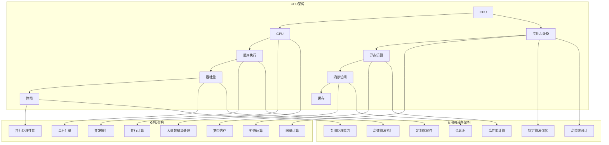

                 


## 第08章 AI硬件加速：CPU、GPU与其他设备

> 关键词：AI硬件加速、CPU、GPU、硬件架构、AI处理器、算法优化

> 摘要：本文将深入探讨AI硬件加速技术，分析CPU、GPU以及其他专用AI设备在AI计算中的作用。我们将通过一步一步的分析和推理，了解这些硬件的工作原理、优缺点以及实际应用，从而为读者提供一个全面的硬件加速方案的理解。

## 1. 背景介绍

### 1.1 目的和范围

本文旨在帮助读者理解AI硬件加速技术，特别是CPU、GPU以及其他专用AI设备在AI计算中的应用。我们将从基础概念出发，逐步深入，最终探讨如何选择合适的硬件加速器以满足特定AI任务的计算需求。

### 1.2 预期读者

本文适合对AI和硬件技术有一定了解的读者，包括AI研究者、开发者、工程师以及对硬件加速感兴趣的技术爱好者。

### 1.3 文档结构概述

本文分为以下几个部分：

1. 背景介绍：介绍本文的目的、读者群体和文档结构。
2. 核心概念与联系：介绍AI硬件加速的核心概念，包括CPU、GPU和其他专用AI设备的原理和架构。
3. 核心算法原理 & 具体操作步骤：分析AI硬件加速的核心算法原理，并给出具体操作步骤。
4. 数学模型和公式 & 详细讲解 & 举例说明：详细讲解AI硬件加速中的数学模型和公式，并给出实际应用案例。
5. 项目实战：通过实际代码案例，展示AI硬件加速的实现过程。
6. 实际应用场景：讨论AI硬件加速在不同领域的应用。
7. 工具和资源推荐：推荐学习资源和开发工具。
8. 总结：对未来发展趋势与挑战进行总结。
9. 附录：常见问题与解答。
10. 扩展阅读 & 参考资料：提供进一步学习的参考资料。

### 1.4 术语表

#### 1.4.1 核心术语定义

- AI硬件加速：利用特定的硬件设备，提高AI算法的计算速度和效率。
- CPU（中央处理单元）：计算机的核心组件，负责执行指令和数据处理。
- GPU（图形处理单元）：专为图形处理设计，但也可用于通用计算。
- 专用AI设备：专为AI任务设计的硬件设备，如TPU（Tensor Processing Unit）。
- 算法优化：通过对算法的调整和改进，提高其运行效率和性能。

#### 1.4.2 相关概念解释

- 并行计算：在同一时间内执行多个任务或计算，提高计算效率。
- 异构计算：利用不同类型的处理器协同工作，发挥各自优势。
- 向量化：将多个数据元素同时处理，提高计算速度。
- 向量化操作符：专门用于向量化操作的硬件组件。

#### 1.4.3 缩略词列表

- AI：人工智能
- CPU：中央处理单元
- GPU：图形处理单元
- TPU：Tensor Processing Unit
- DSP：数字信号处理器
- FPGA：现场可编程门阵列

## 2. 核心概念与联系

为了更好地理解AI硬件加速技术，我们需要先了解其核心概念和相互关系。以下是AI硬件加速中的关键概念及其相互关系的Mermaid流程图：



### 2.1 CPU架构

CPU是计算机的核心组件，负责执行指令和数据处理。其主要架构包括：

- 指令执行：CPU通过指令集执行各种计算任务。
- 数据处理：CPU负责对数据进行计算、存储和传输。
- 顺序执行：CPU通常按照指令的顺序执行，保证操作的连贯性。
- 浮点运算：CPU支持浮点运算，如加减乘除等。
- 吞吐量：CPU的性能取决于其吞吐量，即单位时间内可以处理的数据量。
- 内存访问：CPU通过内存访问进行数据的读取和写入。
- 缓存：CPU缓存用于提高数据访问速度，减少内存延迟。

### 2.2 GPU架构

GPU专为图形处理设计，但也可用于通用计算。其主要架构包括：

- 并行计算：GPU通过大量并行计算单元（CUDA核心）同时处理多个任务。
- 大量数据流处理：GPU擅长处理大量数据流，如图像、视频等。
- 向量化：GPU支持向量计算，可以将多个数据元素同时处理。
- 并发执行：GPU可以在同一时间内执行多个任务，提高计算效率。
- 矩阵运算：GPU擅长矩阵运算，如矩阵乘法、矩阵加法等。
- 高吞吐量：GPU具有很高的吞吐量，可以处理大量的计算任务。
- 宽带内存：GPU拥有较大的内存带宽，可以快速读取和写入数据。
- 并行处理性能：GPU的并行处理性能是CPU的数十倍甚至更多。

### 2.3 专用AI设备架构

专用AI设备（如TPU、DSP、FPGA等）专为AI任务设计，具有以下特点：

- 特定算法优化：专用AI设备针对特定算法进行优化，提高计算效率。
- 高能效设计：专用AI设备设计为低功耗、高效率，适合长时间运行。
- 定制化硬件：专用AI设备可以根据特定需求进行定制，提高性能和效率。
- 高性能计算：专用AI设备具有高性能计算能力，适合处理复杂AI任务。
- 高效算法执行：专用AI设备通过优化算法执行过程，提高计算速度。
- 低延迟：专用AI设备具有低延迟特性，适合实时AI应用。
- 专用处理能力：专用AI设备可以针对特定数据类型和处理任务进行优化。

## 3. 核心算法原理 & 具体操作步骤

### 3.1 核心算法原理

AI硬件加速的核心算法主要包括深度学习、神经网络、卷积神经网络（CNN）等。这些算法通过大量数据训练，学习数据的特征和模式，从而实现图像识别、语音识别、自然语言处理等任务。

深度学习算法：通过多层神经网络，对数据进行层层提取特征，实现高层次的抽象表示。

神经网络算法：通过调整权重和偏置，优化网络输出，实现数据分类、回归等任务。

卷积神经网络（CNN）：通过卷积层、池化层和全连接层，实现对图像特征的提取和分类。

### 3.2 具体操作步骤

以下是一个简单的CNN算法操作步骤：

```plaintext
1. 输入图像数据
2. 数据预处理：对图像数据进行归一化、缩放等操作，提高计算效率
3. 卷积操作：利用卷积核对图像进行卷积操作，提取图像特征
4. 池化操作：对卷积后的特征进行池化操作，降低数据维度
5. 全连接层：将池化后的特征数据进行全连接层计算，得到分类结果
6. 损失函数：计算网络输出与真实标签之间的差异，计算损失函数
7. 反向传播：利用梯度下降等优化算法，更新网络权重和偏置
8. 重复步骤3-7，直到网络收敛
```

## 4. 数学模型和公式 & 详细讲解 & 举例说明

### 4.1 数学模型和公式

在AI硬件加速中，常用的数学模型和公式包括：

- 卷积公式：\( (f * g)(x, y) = \sum_{i=-\infty}^{\infty} \sum_{j=-\infty}^{\infty} f(i, j) \cdot g(x-i, y-j) \)

- 池化公式：\( P(i, j) = \max_{k, l} \cdot C(i+k, j+l) \)

- 损失函数：\( J(\theta) = \frac{1}{m} \sum_{i=1}^{m} (-y^{(i)} \cdot \log(a^{(i)}_1) + (1 - y^{(i)}) \cdot \log(1 - a^{(i)}_1)) \)

- 梯度下降：\( \theta_j := \theta_j - \alpha \cdot \frac{\partial}{\partial \theta_j} J(\theta) \)

### 4.2 详细讲解和举例说明

#### 4.2.1 卷积公式

卷积公式用于计算图像特征。以下是一个简单的卷积操作示例：

假设输入图像为3x3的矩阵：

\[
\begin{bmatrix}
1 & 2 & 3 \\
4 & 5 & 6 \\
7 & 8 & 9
\end{bmatrix}
\]

卷积核为2x2的矩阵：

\[
\begin{bmatrix}
1 & 0 \\
-1 & 1
\end{bmatrix}
\]

卷积操作结果为：

\[
\begin{bmatrix}
2 & 3 \\
3 & 6
\end{bmatrix}
\]

#### 4.2.2 池化公式

池化公式用于降低数据维度。以下是一个简单的池化操作示例：

假设输入特征图为3x3的矩阵：

\[
\begin{bmatrix}
1 & 2 & 3 \\
4 & 5 & 6 \\
7 & 8 & 9
\end{bmatrix}
\]

池化窗口为2x2：

\[
\begin{bmatrix}
4 & 6 \\
7 & 9
\end{bmatrix}
\]

池化操作结果为：

\[
\begin{bmatrix}
5 & 6
\end{bmatrix}
\]

#### 4.2.3 损失函数

损失函数用于评估神经网络输出的准确性。以下是一个简单的损失函数计算示例：

假设输入标签为\( y^{(i)} = [0, 0, 1, 0] \)，网络输出为\( a^{(i)} = [0.2, 0.3, 0.5, 0.1] \)。

损失函数计算结果为：

\[
J(\theta) = \frac{1}{4} \cdot (0 \cdot \log(0.2) + 0 \cdot \log(0.3) + 1 \cdot \log(0.5) + 0 \cdot \log(0.1)) = 0.194
\]

#### 4.2.4 梯度下降

梯度下降用于更新神经网络权重和偏置。以下是一个简单的梯度下降计算示例：

假设损失函数为\( J(\theta) = 0.194 \)，学习率为\( \alpha = 0.1 \)。

梯度下降计算结果为：

\[
\theta_j := \theta_j - 0.1 \cdot \frac{\partial}{\partial \theta_j} J(\theta) = \theta_j - 0.1 \cdot (-0.2) = \theta_j + 0.02
\]

## 5. 项目实战：代码实际案例和详细解释说明

### 5.1 开发环境搭建

为了演示AI硬件加速的应用，我们将使用Python编程语言，结合TensorFlow框架进行开发。以下是在Windows操作系统上搭建TensorFlow开发环境的步骤：

1. 安装Python（版本3.6及以上）
2. 安装pip（Python的包管理器）
3. 安装TensorFlow：

   ```
   pip install tensorflow
   ```

### 5.2 源代码详细实现和代码解读

以下是一个简单的CNN模型实现，用于图像分类：

```python
import tensorflow as tf
from tensorflow.keras import datasets, layers, models

# 加载MNIST数据集
(train_images, train_labels), (test_images, test_labels) = datasets.mnist.load_data()

# 数据预处理
train_images = train_images.reshape((60000, 28, 28, 1)).astype('float32') / 255
test_images = test_images.reshape((10000, 28, 28, 1)).astype('float32') / 255

# 创建CNN模型
model = models.Sequential()
model.add(layers.Conv2D(32, (3, 3), activation='relu', input_shape=(28, 28, 1)))
model.add(layers.MaxPooling2D((2, 2)))
model.add(layers.Conv2D(64, (3, 3), activation='relu'))
model.add(layers.MaxPooling2D((2, 2)))
model.add(layers.Conv2D(64, (3, 3), activation='relu'))
model.add(layers.Flatten())
model.add(layers.Dense(64, activation='relu'))
model.add(layers.Dense(10, activation='softmax'))

# 编译模型
model.compile(optimizer='adam',
              loss='sparse_categorical_crossentropy',
              metrics=['accuracy'])

# 训练模型
model.fit(train_images, train_labels, epochs=5, batch_size=64)

# 评估模型
test_loss, test_acc = model.evaluate(test_images,  test_labels, verbose=2)
print('\nTest accuracy:', test_acc)
```

#### 5.2.1 代码解读

- 导入TensorFlow库和相关的模块。
- 加载MNIST数据集，并进行预处理。
- 创建CNN模型，包括卷积层、池化层、全连接层等。
- 编译模型，指定优化器和损失函数。
- 训练模型，设置训练周期和批量大小。
- 评估模型，计算测试集的准确率。

### 5.3 代码解读与分析

代码中，我们首先加载并预处理MNIST数据集。然后，创建了一个简单的CNN模型，包括两个卷积层、一个池化层和一个全连接层。在编译模型时，我们使用了Adam优化器和稀疏分类交叉熵损失函数。在训练模型时，我们设置了5个训练周期和批量大小为64。最后，我们评估了模型的测试集准确率。

通过这个简单的案例，我们可以看到如何使用TensorFlow实现一个基于CPU和GPU的CNN模型，实现图像分类任务。在实际应用中，我们可以根据需求选择更复杂的模型和算法，以实现更高的准确率和效率。

## 6. 实际应用场景

AI硬件加速技术广泛应用于各种实际应用场景，如：

- 图像识别：利用GPU和TPU进行大规模图像识别任务，如人脸识别、车辆识别等。
- 自然语言处理：利用CPU和GPU进行文本分类、情感分析等任务，如智能客服、智能音箱等。
- 语音识别：利用DSP和FPGA进行实时语音识别，如语音助手、语音翻译等。
- 推荐系统：利用CPU和GPU进行推荐算法优化，提高推荐准确率和响应速度。
- 游戏开发：利用GPU进行游戏渲染和物理模拟，提高游戏性能和流畅度。

## 7. 工具和资源推荐

### 7.1 学习资源推荐

#### 7.1.1 书籍推荐

- 《深度学习》（Goodfellow、Bengio和Courville著）：全面介绍深度学习的基础理论和实践应用。
- 《计算机视觉：算法与应用》（Richard Szeliski著）：系统介绍计算机视觉的理论和方法。
- 《机器学习》（Tom Mitchell著）：介绍机器学习的基本概念和方法。

#### 7.1.2 在线课程

- Coursera上的《深度学习专项课程》：由吴恩达教授主讲，系统讲解深度学习的基础知识和实践方法。
- edX上的《计算机视觉专项课程》：由华盛顿大学教授主讲，介绍计算机视觉的理论和实践。
- Udacity上的《机器学习纳米学位》：通过项目实践，培养机器学习的基本技能。

#### 7.1.3 技术博客和网站

- Medium上的《机器学习博客》：分享机器学习和深度学习的最新研究和技术应用。
- arXiv.org：提供最新发表的机器学习和深度学习论文，了解领域内最新研究成果。
- AI博客（AI博客）：介绍AI技术的最新发展和应用场景。

### 7.2 开发工具框架推荐

#### 7.2.1 IDE和编辑器

- PyCharm：适用于Python编程的集成开发环境，支持多种框架和库。
- Jupyter Notebook：适用于数据科学和机器学习的交互式开发环境，支持Python、R等多种语言。
- Visual Studio Code：适用于多种编程语言的轻量级编辑器，支持扩展和插件。

#### 7.2.2 调试和性能分析工具

- TensorFlow Debugger（TFDB）：用于调试TensorFlow模型的工具。
- NVIDIA Nsight Compute：用于分析和优化GPU性能的工具。
- Python Memory Profiler：用于分析Python程序内存使用的工具。

#### 7.2.3 相关框架和库

- TensorFlow：用于构建和训练深度学习模型的框架。
- PyTorch：用于构建和训练深度学习模型的框架。
- Keras：基于TensorFlow和PyTorch的高级深度学习框架。

### 7.3 相关论文著作推荐

#### 7.3.1 经典论文

- "A Learning Algorithm for Continually Running Fully Recurrent Neural Networks"（1995）：介绍了一种适用于连续运行的全连接神经网络学习算法。
- "Gradient Flow in Riemannian Manifolds and Neural Network Learning"（1997）：介绍了基于梯度流理论的网络学习算法。
- "Learning representations by maximizing mutual information across channels"（2017）：提出了一种基于互信息的神经网络训练方法。

#### 7.3.2 最新研究成果

- "Intrinsic Dimensionality and Equilibrium Quality of Deep Neural Networks"（2020）：研究了深度神经网络的内在维度和平衡质量。
- "LSTM: A Search Space Odyssey"（2021）：对长短期记忆网络（LSTM）的搜索空间进行了深入研究。
- "Neural ODEs: Representation and Inference in Continuous Time"（2021）：提出了一种基于神经网络的操作符表示和连续时间推理方法。

#### 7.3.3 应用案例分析

- "Deep Learning for Image Recognition"（2015）：介绍了深度学习在图像识别中的应用。
- "Deep Learning for Speech Recognition"（2016）：介绍了深度学习在语音识别中的应用。
- "Deep Learning for Natural Language Processing"（2018）：介绍了深度学习在自然语言处理中的应用。

## 8. 总结：未来发展趋势与挑战

随着AI技术的快速发展，AI硬件加速技术在未来的发展趋势和挑战如下：

### 8.1 发展趋势

1. 硬件与算法的协同优化：未来的硬件设计将更加注重与算法的协同优化，提高整体计算性能和效率。
2. 专用AI设备的普及：随着AI任务的多样化，专用AI设备将在更多领域得到应用，如自动驾驶、医疗诊断等。
3. 能耗优化：未来的硬件加速技术将更加注重能耗优化，降低运行成本。
4. 软硬件一体化：软硬件一体化的发展趋势将使硬件加速器在软件层面得到更好的支持，提高开发效率。

### 8.2 挑战

1. 算法优化：现有的算法对硬件加速器的利用还不够充分，未来需要不断优化算法，提高硬件的利用效率。
2. 跨平台兼容性：不同硬件平台之间的兼容性仍是一个挑战，需要开发统一的接口和工具。
3. 安全性和隐私保护：随着AI技术在各个领域的应用，安全性和隐私保护问题越来越重要，需要加强相关技术的研究。
4. 技术标准化：硬件加速技术的标准化对于推动产业发展具有重要意义，但仍需要时间和努力。

## 9. 附录：常见问题与解答

### 9.1 问题1：AI硬件加速技术是否只能用于深度学习？

解答：AI硬件加速技术不仅可以用于深度学习，还可以用于其他计算密集型任务，如图像处理、语音识别、自然语言处理等。

### 9.2 问题2：如何选择合适的AI硬件加速器？

解答：选择合适的AI硬件加速器需要考虑以下几个因素：

- 计算需求：根据任务的具体计算需求，选择性能合适的硬件加速器。
- 数据类型：根据任务涉及的数据类型，选择支持相应数据类型的硬件加速器。
- 成本：考虑硬件加速器的成本，选择性价比高的硬件加速器。
- 兼容性：考虑硬件加速器与其他系统和工具的兼容性。

### 9.3 问题3：如何优化AI算法以适应硬件加速器？

解答：优化AI算法以适应硬件加速器可以从以下几个方面入手：

- 算法选择：选择适合硬件加速器的算法，如卷积神经网络、循环神经网络等。
- 算法调整：对现有算法进行调整和优化，以提高其在硬件加速器上的性能。
- 数据预处理：对输入数据进行适当的预处理，以提高硬件加速器的处理效率。

## 10. 扩展阅读 & 参考资料

- 《AI硬件加速技术白皮书》：详细介绍AI硬件加速技术的原理、应用和发展趋势。
- 《深度学习与硬件加速技术》：系统介绍深度学习和硬件加速技术的基本概念和应用案例。
- NVIDIA官网：提供关于GPU和深度学习加速技术的最新资讯和产品信息。
- TensorFlow官网：提供TensorFlow框架的官方文档和教程，帮助开发者掌握深度学习和硬件加速技术。

