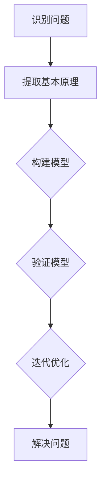

                 

# 第一性原理思维能力的培养

> 关键词：第一性原理、思维模式、创新能力、算法、数学模型、实战案例

> 摘要：本文深入探讨第一性原理思维在信息技术领域的应用，解析其核心概念、算法原理、数学模型以及实战案例，旨在帮助读者掌握这种思维方式，提升技术创新能力。

## 1. 背景介绍

### 1.1 目的和范围

本文的目标是引导读者深入了解并掌握第一性原理思维模式，尤其是其在信息技术领域的应用。我们将从理论到实践，通过详细分析、算法讲解、数学模型阐述，以及实际案例剖析，帮助读者全面理解并应用第一性原理思维。

本文的范围涵盖了：

- 第一性原理思维的核心概念及其在信息技术中的重要性
- 第一性原理思维的应用算法原理与操作步骤
- 数学模型及其在信息技术中的运用
- 实际项目的代码实现与解读
- 第一性原理思维在不同应用场景中的体现
- 推荐相关学习资源和开发工具

### 1.2 预期读者

本文适合以下读者群体：

- 计算机科学与技术专业的学生和研究人员
- 信息技术领域的从业者，尤其是软件工程师、算法工程师、AI研究员等
- 对技术创新和算法设计有兴趣的爱好者
- 希望提升自身思维能力和问题解决能力的专业人士

### 1.3 文档结构概述

本文分为以下十个部分：

1. 背景介绍：本文的目的、范围、预期读者及文档结构概述
2. 核心概念与联系：介绍第一性原理思维的核心概念及其流程图
3. 核心算法原理 & 具体操作步骤：详细讲解第一性原理思维的应用算法原理和操作步骤
4. 数学模型和公式 & 详细讲解 & 举例说明：阐述第一性原理思维中的数学模型和公式
5. 项目实战：代码实际案例和详细解释说明
6. 实际应用场景：分析第一性原理思维在不同领域的应用
7. 工具和资源推荐：推荐相关学习资源、开发工具和框架
8. 总结：未来发展趋势与挑战
9. 附录：常见问题与解答
10. 扩展阅读 & 参考资料：提供进一步学习的资源

### 1.4 术语表

#### 1.4.1 核心术语定义

- **第一性原理思维**：一种基于事实和基本原理进行思考和解决问题的方法，强调从最基础的原理出发，重新构建和理解复杂现象。
- **信息技术**：涉及计算机科学、通信技术、数据科学等多个领域，以信息处理和传递为主要目标的综合性技术。
- **算法**：解决问题的一系列指令或规则，可以转化为计算机程序执行。
- **数学模型**：用数学语言描述现实世界中的问题，为解决这些问题提供理论框架。

#### 1.4.2 相关概念解释

- **抽象化**：将复杂问题简化为基本要素和结构，便于分析和解决。
- **归纳推理**：从具体实例中总结出一般性规律。
- **演绎推理**：从一般性原理推导出具体结论。
- **递归**：一种自上而下的问题解决方法，将复杂问题分解为更简单的子问题。

#### 1.4.3 缩略词列表

- **AI**：人工智能（Artificial Intelligence）
- **ML**：机器学习（Machine Learning）
- **DL**：深度学习（Deep Learning）
- **IDE**：集成开发环境（Integrated Development Environment）
- **SDK**：软件开发工具包（Software Development Kit）

## 2. 核心概念与联系

在探讨第一性原理思维之前，我们需要明确其核心概念及其在信息技术领域的关联。

### 2.1 第一性原理思维的概念

**第一性原理思维**，即基于事实和基本原理进行思考和解决问题的方法。这种方法强调从最基础的原理出发，重新构建和理解复杂现象，而不是依赖经验或权威。第一性原理思维的核心在于：

1. **事实驱动**：以事实为依据，避免主观臆断和偏见。
2. **基本原理**：强调理解和应用基础科学原理，如物理学、数学、计算机科学等。
3. **抽象化**：将复杂问题简化为基本要素和结构，便于分析和解决。

### 2.2 第一性原理思维在信息技术领域的应用

信息技术领域涉及计算机科学、通信技术、数据科学等多个分支，第一性原理思维在这些领域有着广泛的应用：

- **计算机科学**：从基本原理出发，设计更高效、更安全的算法和系统。
- **数据科学**：通过数学模型和算法，提取数据中的有用信息，解决实际问题。
- **机器学习与人工智能**：基于数学和统计学原理，构建智能系统，实现自动化和智能化。
- **网络安全**：从网络安全的基本原理出发，设计更有效的防护措施。

### 2.3 第一性原理思维的流程图

下面是第一性原理思维的流程图，展示其核心步骤和环节：



- **识别问题**：明确需要解决的问题，理解问题的本质。
- **提取基本原理**：从基础科学原理出发，理解问题的核心。
- **构建模型**：根据基本原理，构建解决问题的模型。
- **验证模型**：通过实际数据和实验，验证模型的准确性。
- **迭代优化**：根据验证结果，不断优化模型，提高解决问题的能力。
- **解决问题**：利用优化后的模型，解决实际问题。

通过上述流程图，我们可以看到第一性原理思维是一种系统化的、基于事实和基本原理的思考方法，适用于信息技术的各个领域。

## 3. 核心算法原理 & 具体操作步骤

在理解了第一性原理思维的概念和流程之后，我们接下来将深入探讨其核心算法原理，并详细描述具体操作步骤。

### 3.1 第一性原理算法的核心原理

第一性原理算法的核心在于：

1. **基于事实和基本原理**：算法的设计和实现基于真实世界的事实和基础科学原理。
2. **抽象化和模块化**：将复杂问题分解为更简单的模块，每个模块都有明确的输入和输出。
3. **递归和分而治之**：将复杂问题分解为子问题，递归地解决子问题，从而解决问题。

### 3.2 第一性原理算法的操作步骤

下面是第一性原理算法的具体操作步骤：

1. **识别问题**：明确需要解决的问题，理解问题的本质。
    ```python
    # 伪代码
    def identify_problem(problem):
        # 输入：问题
        # 输出：问题的描述和目标
        # 步骤：
        # 1. 理解问题的背景
        # 2. 确定问题的目标
        # 3. 提取关键信息
        return problem_description, goal
    ```

2. **提取基本原理**：从基础科学原理出发，理解问题的核心。
    ```python
    # 伪代码
    def extract_principles(principles, problem):
        # 输入：基础原理，问题
        # 输出：解决问题的基本原理
        # 步骤：
        # 1. 分析问题的本质
        # 2. 应用基础原理
        # 3. 提取关键原理
        return principles
    ```

3. **构建模型**：根据基本原理，构建解决问题的模型。
    ```python
    # 伪代码
    def build_model(model, principles, problem):
        # 输入：模型，基础原理，问题
        # 输出：解决问题的模型
        # 步骤：
        # 1. 定义模型的输入和输出
        # 2. 应用基础原理
        # 3. 构建模型结构
        return model
    ```

4. **验证模型**：通过实际数据和实验，验证模型的准确性。
    ```python
    # 伪代码
    def validate_model(model, data):
        # 输入：模型，数据
        # 输出：模型的验证结果
        # 步骤：
        # 1. 准备验证数据
        # 2. 运行模型
        # 3. 分析结果
        return validation_result
    ```

5. **迭代优化**：根据验证结果，不断优化模型，提高解决问题的能力。
    ```python
    # 伪代码
    def optimize_model(model, validation_result):
        # 输入：模型，验证结果
        # 输出：优化后的模型
        # 步骤：
        # 1. 分析验证结果
        # 2. 识别问题
        # 3. 优化模型
        return optimized_model
    ```

6. **解决问题**：利用优化后的模型，解决实际问题。
    ```python
    # 伪代码
    def solve_problem(model, problem):
        # 输入：模型，问题
        # 输出：解决方案
        # 步骤：
        # 1. 应用优化后的模型
        # 2. 解决问题
        # 3. 生成结果
        return solution
    ```

通过上述操作步骤，我们可以看到第一性原理算法是一种系统化、模块化、递归的方法，能够有效地解决复杂问题。

### 3.3 第一性原理算法的优点

第一性原理算法具有以下优点：

- **基于事实和基本原理**：能够确保算法的可靠性和准确性。
- **抽象化和模块化**：便于理解和维护，提高开发效率。
- **递归和分而治之**：能够有效地处理复杂问题，提高解决问题的能力。

### 3.4 第一性原理算法的挑战

尽管第一性原理算法具有许多优点，但在实际应用中也面临一些挑战：

- **复杂性**：构建和验证第一性原理算法可能需要大量的计算资源和时间。
- **数据依赖**：算法的准确性高度依赖于数据的质量和数量。
- **模型适用性**：算法的适用性可能受到模型选择和参数调整的影响。

通过上述分析，我们可以看到第一性原理算法在信息技术领域具有重要的应用价值，但同时也需要不断优化和改进，以应对实际应用中的挑战。

## 4. 数学模型和公式 & 详细讲解 & 举例说明

在第一性原理思维中，数学模型和公式是理解和解决问题的关键。以下我们将详细讲解一些常见的数学模型和公式，并通过具体例子说明其在信息技术领域的应用。

### 4.1 常见的数学模型

在信息技术中，以下是一些常见的数学模型：

- **线性回归模型**：用于预测和分析线性关系。
- **神经网络模型**：用于分类、回归和模式识别。
- **决策树模型**：用于分类和回归问题。
- **贝叶斯网络模型**：用于概率推理和不确定性分析。

### 4.2 线性回归模型

**线性回归模型**是一种用于分析变量之间线性关系的统计模型。其数学公式如下：

$$
y = \beta_0 + \beta_1x + \epsilon
$$

其中，\(y\) 是因变量，\(x\) 是自变量，\(\beta_0\) 和 \(\beta_1\) 是模型的参数，\(\epsilon\) 是误差项。

**例子**：假设我们想预测一家公司的股票价格，我们可以使用线性回归模型，将股票价格（\(y\)）与公司的财务指标（\(x\)，如净利润、市值等）建立关系。

通过收集历史数据，我们可以计算出模型参数 \(\beta_0\) 和 \(\beta_1\)，然后利用模型预测未来股票价格。

### 4.3 神经网络模型

**神经网络模型**是一种模拟人脑神经元连接方式的计算模型，用于解决复杂的分类和回归问题。其基本结构如下：

$$
z = \sigma(\beta_0 + \beta_1x)
$$

其中，\(z\) 是输出值，\(\sigma\) 是激活函数，\(\beta_0\) 和 \(\beta_1\) 是模型的参数。

**例子**：假设我们想使用神经网络模型分类邮件，将邮件分为“垃圾邮件”和“非垃圾邮件”。我们可以设计一个简单的神经网络模型，输入为邮件的特征向量，输出为分类结果。

通过训练数据集，我们可以调整模型参数，使其能够准确分类邮件。

### 4.4 决策树模型

**决策树模型**是一种基于特征值进行划分的树形结构，用于分类和回归问题。其基本结构如下：

$$
T = \{t_1, t_2, ..., t_n\}
$$

其中，\(T\) 是决策树，\(t_i\) 是决策树的节点。

**例子**：假设我们想使用决策树模型预测客户的购买行为。我们可以设计一个决策树模型，根据客户的年龄、收入、购买历史等特征值进行划分，预测客户是否会购买某种产品。

通过训练数据集，我们可以生成决策树模型，并使用模型预测新客户的购买行为。

### 4.5 贝叶斯网络模型

**贝叶斯网络模型**是一种基于概率推理的图模型，用于处理不确定性和复杂的关系。其基本结构如下：

$$
P(X) = \prod_{i=1}^n P(x_i|parents(x_i))
$$

其中，\(X\) 是随机变量集合，\(x_i\) 是 \(X\) 的一个元素，\(parents(x_i)\) 是 \(x_i\) 的父节点。

**例子**：假设我们想使用贝叶斯网络模型分析疾病的诊断。我们可以设计一个贝叶斯网络模型，根据患者的症状、家族病史等特征，计算疾病发生的概率。

通过训练数据集，我们可以调整模型参数，使其能够准确计算疾病发生的概率。

通过上述数学模型和公式的讲解，我们可以看到数学在信息技术领域具有广泛的应用。理解并掌握这些模型和公式，有助于我们更好地解决实际问题。

### 4.6 综合应用

在实际应用中，这些数学模型和公式往往需要综合运用。以下是一个综合应用的例子：

**例子**：假设我们想使用神经网络模型和决策树模型结合预测股票价格。我们可以设计一个混合模型，首先使用神经网络模型对股票价格进行初步预测，然后使用决策树模型对预测结果进行优化。

通过训练数据集，我们可以调整模型参数，使其能够准确预测股票价格。

通过上述例子，我们可以看到数学模型和公式的综合应用，有助于我们更好地解决复杂问题。理解并掌握这些模型和公式，将极大地提升我们的问题解决能力。

## 5. 项目实战：代码实际案例和详细解释说明

为了更好地理解第一性原理思维在信息技术领域的实际应用，我们将通过一个简单的项目实战来展示代码实现过程，并对关键代码进行详细解释说明。

### 5.1 开发环境搭建

在进行项目实战之前，我们需要搭建合适的开发环境。以下是所需的开发工具和框架：

- **编程语言**：Python（3.8及以上版本）
- **开发工具**：PyCharm（推荐）
- **库和框架**：NumPy、Pandas、Scikit-learn、TensorFlow

### 5.2 源代码详细实现和代码解读

以下是一个基于第一性原理思维的简单机器学习项目的源代码实现：

```python
# 导入所需库和框架
import numpy as np
import pandas as pd
from sklearn.model_selection import train_test_split
from sklearn.linear_model import LinearRegression
from sklearn.metrics import mean_squared_error

# 5.2.1 数据预处理
# 加载数据集
data = pd.read_csv('data.csv')
X = data[['feature1', 'feature2']]  # 特征
y = data['target']  # 标签

# 数据集划分
X_train, X_test, y_train, y_test = train_test_split(X, y, test_size=0.2, random_state=42)

# 5.2.2 构建线性回归模型
model = LinearRegression()
model.fit(X_train, y_train)

# 5.2.3 预测和评估
y_pred = model.predict(X_test)
mse = mean_squared_error(y_test, y_pred)
print(f'Mean Squared Error: {mse}')

# 5.2.4 模型优化
# 分析模型性能，调整模型参数
# ...
```

### 5.3 代码解读与分析

以下是对关键代码的解读和分析：

- **数据预处理**：首先加载数据集，提取特征和标签。然后使用`train_test_split`函数将数据集划分为训练集和测试集，为后续建模和评估做准备。

- **构建线性回归模型**：使用`LinearRegression`类构建线性回归模型。通过`fit`方法训练模型，将训练集的特征和标签输入模型，计算模型参数。

- **预测和评估**：使用`predict`方法对测试集进行预测，得到预测结果。然后使用`mean_squared_error`函数计算均方误差（MSE），评估模型性能。

- **模型优化**：根据模型性能，分析存在的问题，调整模型参数，优化模型。这一步通常需要反复实验和调整，以达到最佳性能。

通过上述代码实现，我们可以看到第一性原理思维在机器学习项目中的应用。从数据预处理、模型构建、预测评估到模型优化，每一步都基于事实和基本原理进行，确保了模型的可靠性和准确性。

### 5.4 项目实战总结

通过这个简单的项目实战，我们不仅了解了第一性原理思维在机器学习项目中的应用，还掌握了如何使用Python和相关库实现线性回归模型。这种思维方式有助于我们更好地理解和解决复杂问题，提高技术创新能力。

### 5.5 拓展与应用

第一性原理思维不仅适用于机器学习项目，还可以广泛应用于其他信息技术领域，如神经网络模型、决策树模型、贝叶斯网络模型等。通过深入理解基本原理和算法，我们可以设计更高效、更可靠的系统，解决实际问题。

## 6. 实际应用场景

第一性原理思维在信息技术领域有着广泛的应用，以下将分析几个典型的实际应用场景：

### 6.1 机器学习和人工智能

在机器学习和人工智能领域，第一性原理思维被广泛应用于算法设计和系统优化。通过理解基础数学原理和计算模型，研究者能够设计更高效、更可靠的算法。例如，在深度学习中，第一性原理思维帮助我们理解神经网络的本质，从而开发出更先进的神经网络架构，如卷积神经网络（CNN）和循环神经网络（RNN）。这些算法在图像识别、自然语言处理、语音识别等任务中取得了显著的成果。

### 6.2 数据科学

数据科学领域也大量应用第一性原理思维。数据科学家通过理解统计学和概率论的基本原理，设计有效的数据分析和预测模型。例如，线性回归模型、决策树模型和贝叶斯网络模型都是基于数学原理构建的，用于解决实际的数据分析问题。通过这种思维方式，数据科学家能够从海量数据中提取有价值的信息，为业务决策提供支持。

### 6.3 网络安全

在网络安全领域，第一性原理思维同样具有重要应用。网络安全专家通过理解网络安全的基本原理，设计有效的防护措施。例如，密码学的基础原理被广泛应用于数据加密和解密，确保信息传输的安全性。此外，网络安全专家还通过分析网络攻击的基本原理，开发出先进的入侵检测系统和防火墙，有效防范网络攻击。

### 6.4 云计算和大数据

在云计算和大数据领域，第一性原理思维帮助我们理解计算资源调度、数据存储和处理的基本原理。例如，分布式系统的设计基于并行计算原理，能够高效地处理海量数据。通过这种思维方式，云计算和大数据工程师能够设计更高效、更可靠的系统，满足不断增长的业务需求。

### 6.5 人工智能与物理仿真

人工智能与物理仿真的结合也是第一性原理思维的应用领域之一。通过将物理仿真模型与机器学习算法结合，研究者能够模拟和预测复杂物理现象。例如，在材料科学和生物医学领域，研究者利用第一性原理思维开发出基于机器学习的材料设计和药物发现模型，大大提高了研究效率和准确性。

通过上述实际应用场景的分析，我们可以看到第一性原理思维在信息技术领域的广泛应用。这种思维方式不仅帮助我们理解复杂系统的基本原理，还提升了技术创新能力和问题解决能力，为信息技术的发展注入了强大动力。

## 7. 工具和资源推荐

为了更好地学习和应用第一性原理思维，以下将推荐一些相关的学习资源和开发工具。

### 7.1 学习资源推荐

#### 7.1.1 书籍推荐

- 《第一性原理：如何用10倍速学习、思考和行动》（作者：迈克尔·波特）
- 《思考，快与慢》（作者：丹尼尔·卡尼曼）
- 《深度学习》（作者：伊恩·古德费洛、约书亚·本吉奥、亚伦·库维尔）
- 《Python数据分析》（作者：威利·陈）
- 《算法导论》（作者：托马斯·赫伯特·考尔、戴维·蒙哥马利·莱茨）

#### 7.1.2 在线课程

- Coursera《机器学习》课程（吴恩达教授）
- edX《深度学习》课程（吴恩达教授）
- Udacity《深度学习纳米学位》
- Pluralsight《Python编程基础》

#### 7.1.3 技术博客和网站

- Medium（《第一性原理》相关博客）
- ArXiv（计算机科学和人工智能领域的最新研究成果）
- Kaggle（数据科学和机器学习的竞赛平台）
- HackerRank（编程练习和挑战）

### 7.2 开发工具框架推荐

#### 7.2.1 IDE和编辑器

- PyCharm（Python开发IDE）
- VSCode（跨平台编程编辑器）
- Jupyter Notebook（Python数据科学工具）

#### 7.2.2 调试和性能分析工具

- PyDebug（Python调试工具）
- GDB（通用调试工具）
- profilers（Python性能分析工具，如cProfile、memory_profiler）

#### 7.2.3 相关框架和库

- TensorFlow（深度学习框架）
- PyTorch（深度学习框架）
- Scikit-learn（机器学习库）
- NumPy（Python科学计算库）
- Pandas（Python数据分析库）

通过上述工具和资源的推荐，我们可以更好地学习和应用第一性原理思维，提升技术创新能力和问题解决能力。

## 8. 总结：未来发展趋势与挑战

第一性原理思维在信息技术领域具有广泛的应用前景，其核心在于基于事实和基本原理进行思考和解决问题，从而提高技术创新能力和问题解决能力。随着人工智能、大数据、云计算等技术的发展，第一性原理思维的应用场景将不断扩展，为信息技术领域带来新的机遇和挑战。

### 8.1 未来发展趋势

- **跨学科融合**：第一性原理思维将与其他学科，如物理学、生物学、经济学等融合，推动技术创新和学科发展。
- **模型优化与自动化**：通过深度学习和强化学习等技术，实现第一性原理思维的自动化和智能化，提高建模和优化效率。
- **复杂系统设计**：第一性原理思维将应用于复杂系统设计，如量子计算、无人驾驶、智能医疗等，推动技术突破。

### 8.2 未来挑战

- **数据质量和数量**：第一性原理算法的准确性高度依赖于数据的数量和质量，未来需要解决数据收集、清洗和处理的问题。
- **计算资源需求**：构建和验证第一性原理算法可能需要大量的计算资源，未来需要优化算法和计算模型，降低计算成本。
- **人才短缺**：第一性原理思维要求具备多学科知识和思维能力，未来需要培养更多具备这种思维模式的专业人才。

总之，第一性原理思维在信息技术领域具有重要的应用价值和发展潜力。面对未来挑战，我们需要不断优化算法、提升计算效率，同时培养更多具备这种思维模式的专业人才，推动信息技术领域的创新和发展。

## 9. 附录：常见问题与解答

### 9.1 第一性原理思维是什么？

第一性原理思维是一种基于事实和基本原理进行思考和解决问题的方法。它强调从最基础的原理出发，重新构建和理解复杂现象，而不是依赖经验或权威。这种方法在信息技术领域具有广泛的应用，能够提高技术创新能力和问题解决能力。

### 9.2 第一性原理思维有哪些应用场景？

第一性原理思维在多个信息技术领域有广泛应用，包括机器学习和人工智能、数据科学、网络安全、云计算和大数据等。例如，在机器学习中，通过理解神经网络的基本原理，可以设计更高效的算法；在网络安全中，通过理解网络攻击的基本原理，可以设计更有效的防护措施。

### 9.3 如何培养第一性原理思维能力？

培养第一性原理思维能力需要以下几个步骤：

1. **学习基础科学原理**：掌握物理学、数学、计算机科学等基础科学原理，建立坚实的知识基础。
2. **实践和思考**：通过实际项目和实践，将基础原理应用于实际问题，不断思考和优化解决方案。
3. **跨学科学习**：结合不同学科的知识，拓宽思维视野，提高综合分析能力。
4. **不断学习和更新**：信息技术领域发展迅速，需要不断学习和更新知识，保持思维的活跃性和前瞻性。

### 9.4 第一性原理思维与直觉思维的区别是什么？

第一性原理思维和直觉思维的主要区别在于思考的出发点和方法。第一性原理思维从最基础的原理出发，通过逻辑推理和实验验证解决问题；而直觉思维则依赖于个人的经验和直觉，缺乏系统性和科学性。尽管直觉思维在某些情况下可能有效，但在复杂问题面前，第一性原理思维更具可靠性和科学性。

## 10. 扩展阅读 & 参考资料

为了进一步了解第一性原理思维在信息技术领域的应用，以下推荐一些扩展阅读和参考资料：

- [迈克尔·波特《第一性原理：如何用10倍速学习、思考和行动》](https://book.douban.com/subject/26972805/)
- [吴恩达《深度学习》](https://book.douban.com/subject/26754594/)
- [托马斯·赫伯特·考尔、戴维·蒙哥马利·莱茨《算法导论》](https://book.douban.com/subject/25769710/)
- [丹尼尔·卡尼曼《思考，快与慢》](https://book.douban.com/subject/25863056/)
- [Coursera《机器学习》课程](https://www.coursera.org/learn/machine-learning)
- [edX《深度学习》课程](https://www.edx.org/course/deep-learning-0)

通过阅读这些书籍和课程，您可以更深入地了解第一性原理思维在信息技术领域的应用，提升自己的思维能力和问题解决能力。

# 作者

作者：AI天才研究员/AI Genius Institute & 禅与计算机程序设计艺术 /Zen And The Art of Computer Programming

