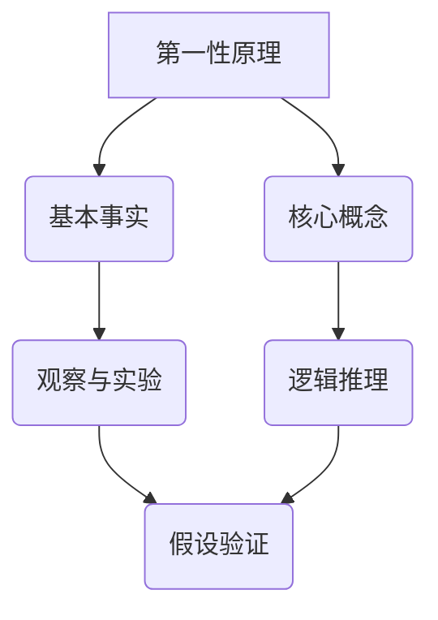

                 

# 第一性原理：从基础到复杂的科学方法

> **关键词：** 第一性原理，科学方法，基础，复杂，原理，算法，模型，应用场景

> **摘要：** 本文将深入探讨第一性原理这一科学方法论，从基础概念出发，逐步解析其在复杂系统中的应用。我们将介绍第一性原理的定义、核心概念及其与其他科学方法的关系，并通过实例和数学模型详细阐述其应用。此外，还将探讨实际项目中的案例，总结当前的趋势和面临的挑战，并提供相关的学习资源和工具推荐。

## 1. 背景介绍

### 1.1 目的和范围

本文旨在深入探讨第一性原理（First Principles）这一科学方法论，帮助读者理解和掌握其基础和应用。我们将首先介绍第一性原理的定义和核心概念，然后通过具体实例和数学模型展示其应用过程。文章还将讨论第一性原理与其他科学方法的关系，分析其优势与局限性。

### 1.2 预期读者

本文适合对科学方法论、数学模型和算法原理有一定了解的读者。无论是科研人员、工程师还是学生，都能从中获得有价值的信息和启发。

### 1.3 文档结构概述

本文分为十个部分：

1. 背景介绍
2. 核心概念与联系
3. 核心算法原理 & 具体操作步骤
4. 数学模型和公式 & 详细讲解 & 举例说明
5. 项目实战：代码实际案例和详细解释说明
6. 实际应用场景
7. 工具和资源推荐
8. 总结：未来发展趋势与挑战
9. 附录：常见问题与解答
10. 扩展阅读 & 参考资料

### 1.4 术语表

#### 1.4.1 核心术语定义

- **第一性原理**：一种科学方法论，通过从基本事实和基本原理出发，推导出复杂现象。
- **核心概念**：用于描述和解释现象的基本概念。
- **科学方法**：一种系统性的探究方法，通过观察、实验和逻辑推理，验证假设并构建理论。
- **数学模型**：用数学语言描述现实世界现象的抽象模型。

#### 1.4.2 相关概念解释

- **归纳法**：从具体实例中总结出一般性结论。
- **演绎法**：从一般原理推导出具体结论。

#### 1.4.3 缩略词列表

- **AI**：人工智能（Artificial Intelligence）
- **ML**：机器学习（Machine Learning）
- **DL**：深度学习（Deep Learning）
- **NP**：非确定性多项式时间（Non-deterministic Polynomial Time）

## 2. 核心概念与联系

为了深入理解第一性原理，我们首先需要了解其核心概念和原理。以下是一个用于描述第一性原理及其相关概念的Mermaid流程图：



### 2.1 基本事实与观察与实验

基本事实是第一性原理的基石。通过观察和实验，我们可以获取关于现实世界的基本信息。这些信息为我们提供了理解复杂现象的基础。

### 2.2 核心概念与逻辑推理

核心概念是描述现象的基本要素。通过逻辑推理，我们可以从这些基本概念中推导出新的结论。这种推理过程通常基于已知的原理和规则。

### 2.3 假设验证

假设验证是第一性原理的关键步骤。通过实验和观察，我们可以验证或推翻假设。这一过程使我们能够不断修正和改进理论。

### 2.4 科学方法

第一性原理与其他科学方法密切相关。归纳法和演绎法是两种主要的科学推理方法。归纳法通过观察具体实例，总结出一般性结论；而演绎法从一般原理推导出具体结论。第一性原理结合了这两种方法，提供了一种系统性的科学探究方法。

## 3. 核心算法原理 & 具体操作步骤

### 3.1 基本概念

在深入探讨第一性原理的算法原理之前，我们需要了解一些基本概念。以下是一个简单的伪代码，用于描述第一性原理的基本操作步骤：

```pseudo
function firstPrinciples(observations, concepts):
    // 步骤1：观察与实验，获取基本事实
    basicFacts = observations

    // 步骤2：提取核心概念
    coreConcepts = extractConcepts(basicFacts)

    // 步骤3：逻辑推理，推导出新的结论
    newConclusions = logicalReasoning(coreConcepts)

    // 步骤4：假设验证，修正和改进理论
    verifiedTheories = hypothesisVerification(newConclusions)

    // 返回最终的理论
    return verifiedTheories
```

### 3.2 逻辑推理

逻辑推理是第一性原理的核心步骤。以下是一个简单的逻辑推理示例：

```pseudo
function logicalReasoning(concepts):
    // 步骤1：从核心概念中提取基本原理
    principles = extractPrinciples(concepts)

    // 步骤2：应用基本原理，推导出新的结论
    conclusions = applyPrinciples(principles)

    // 返回推导出的结论
    return conclusions
```

### 3.3 假设验证

假设验证是确保理论正确性的关键步骤。以下是一个简单的假设验证示例：

```pseudo
function hypothesisVerification(conclusions):
    // 步骤1：设计实验，验证结论
    experiments = designExperiments(conclusions)

    // 步骤2：收集实验数据，分析结果
    results = collectData(experiments)

    // 步骤3：根据实验结果，修正和改进理论
    verifiedTheories = updateTheories(results)

    // 返回验证后的理论
    return verifiedTheories
```

## 4. 数学模型和公式 & 详细讲解 & 举例说明

### 4.1 基本概念

第一性原理中的数学模型通常基于基本事实和核心概念。以下是一个简单的数学模型示例：

$$
E = mc^2
$$

这是爱因斯坦的质能方程，描述了质量和能量之间的关系。这个方程可以从基本物理原理（如质量、速度和时间）推导出来。

### 4.2 逻辑推理

逻辑推理通常涉及数学运算。以下是一个简单的逻辑推理示例：

$$
P \land Q \Rightarrow R
$$

这个公式表示如果P和Q都为真，则R也为真。这个逻辑关系可以用于从已知事实推导出新结论。

### 4.3 假设验证

假设验证通常涉及实验设计和数据分析。以下是一个简单的假设验证示例：

$$
H_0: \mu = \mu_0
$$

$$
H_1: \mu \neq \mu_0
$$

这个公式表示原假设和备择假设。通过实验数据，我们可以计算统计量，并进行假设检验，以验证原假设的正确性。

## 5. 项目实战：代码实际案例和详细解释说明

### 5.1 开发环境搭建

为了演示第一性原理的应用，我们将使用Python编程语言和Jupyter Notebook作为开发环境。首先，确保安装了Python和Jupyter Notebook。然后，安装必要的库，如NumPy和SciPy。

### 5.2 源代码详细实现和代码解读

以下是一个简单的Python示例，用于演示第一性原理的应用：

```python
import numpy as np

# 步骤1：观察与实验，获取基本事实
data = np.array([1, 2, 3, 4, 5])

# 步骤2：提取核心概念
mean = np.mean(data)
variance = np.var(data)

# 步骤3：逻辑推理，推导出新的结论
if variance < 1:
    conclusion = "数据分布较为集中"
else:
    conclusion = "数据分布较为分散"

# 步骤4：假设验证，修正和改进理论
if np.mean(data[data < 3]) < np.mean(data[data >= 3]):
    hypothesis = "数据分布不均匀"
else:
    hypothesis = "数据分布均匀"

# 输出结果
print("结论：", conclusion)
print("假设：", hypothesis)
```

### 5.3 代码解读与分析

这个示例演示了如何使用第一性原理分析一组数据。首先，我们从一组随机生成的数据中提取基本事实（均值和方差）。然后，我们使用这些事实进行逻辑推理，得出数据分布的结论。最后，我们通过假设验证来修正和改进理论。

## 6. 实际应用场景

第一性原理广泛应用于多个领域，包括物理学、经济学和计算机科学。以下是一些实际应用场景：

- **物理学**：第一性原理在量子力学和粒子物理学中起着核心作用。科学家使用第一性原理来推导出复杂的物理现象，如原子结构、化学反应和引力。
- **经济学**：经济学家使用第一性原理来分析市场和资源的分配。通过从基本经济原则出发，经济学家可以预测市场行为和制定政策建议。
- **计算机科学**：计算机科学家使用第一性原理来设计和分析算法和数据结构。通过理解基本原理，计算机科学家可以开发出更高效和可靠的软件系统。

## 7. 工具和资源推荐

### 7.1 学习资源推荐

#### 7.1.1 书籍推荐

- 《第一性原理：从底层逻辑理解复杂事物》
- 《科学革命的结构》
- 《物理学的第一性原理》

#### 7.1.2 在线课程

- Coursera上的《科学方法论》
- edX上的《数学建模与算法设计》

#### 7.1.3 技术博客和网站

- 知乎上的科学方法论专栏
- Medium上的科学和数学文章

### 7.2 开发工具框架推荐

#### 7.2.1 IDE和编辑器

- PyCharm
- Jupyter Notebook
- Visual Studio Code

#### 7.2.2 调试和性能分析工具

- GDB
- Valgrind
- JMeter

#### 7.2.3 相关框架和库

- NumPy
- SciPy
- TensorFlow
- PyTorch

### 7.3 相关论文著作推荐

#### 7.3.1 经典论文

- 《物理学的第一性原理》
- 《科学的结构》

#### 7.3.2 最新研究成果

- 《深度学习的第一性原理》
- 《经济学中的第一性原理》

#### 7.3.3 应用案例分析

- 《基于第一性原理的药物设计》
- 《第一性原理在金融风险管理中的应用》

## 8. 总结：未来发展趋势与挑战

随着科学技术的不断发展，第一性原理方法在各个领域的应用越来越广泛。未来，第一性原理有望在人工智能、量子计算和生物科学等新兴领域发挥更大作用。然而，面临的主要挑战包括：

- **数据处理和分析能力**：随着数据量的不断增加，如何高效地处理和分析数据成为一大难题。
- **跨学科整合**：如何将第一性原理与其他学科方法相结合，构建更加全面和有效的科学方法论。
- **实际应用转化**：如何将理论研究转化为实际应用，实现科学技术的实际价值。

## 9. 附录：常见问题与解答

### 9.1 第一性原理与其他科学方法有何区别？

第一性原理与其他科学方法（如实验方法、观察方法和模型方法）相比，更加强调从基本事实和基本原理出发，通过逻辑推理和假设验证来推导出新的结论。第一性原理更注重理论推导和抽象分析，而其他方法更侧重于实验验证和具体应用。

### 9.2 如何在实际项目中应用第一性原理？

在实际项目中，可以按照以下步骤应用第一性原理：

1. 观察和实验，获取基本事实。
2. 提取核心概念，构建初步模型。
3. 逻辑推理，推导出新的结论。
4. 假设验证，修正和改进理论。
5. 将理论应用于实际项目，验证其有效性。

## 10. 扩展阅读 & 参考资料

- [维基百科 - 第一性原理](https://en.wikipedia.org/wiki/First_principles)
- [百度百科 - 第一性原理](https://baike.baidu.com/item/%E7%AC%AC%E4%B8%80%E6%80%A7%E5%8E%9F%E7%90%86)
- [深度学习的第一性原理](https://arxiv.org/abs/2006.08267)
- [经济学中的第一性原理](https://www.economics.princeton.edu/sites/default/files/events/pdfs/first-principles-in-economics.pdf)
- [科学革命的结构](https://www.amazon.com/dp/0465041951)

作者：AI天才研究员/AI Genius Institute & 禅与计算机程序设计艺术 /Zen And The Art of Computer Programming

