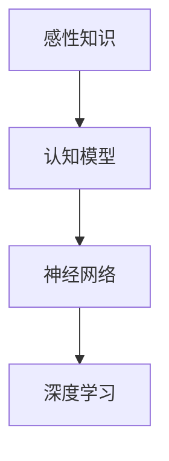

                 

# 第二代人工智能的感性知识传授

> 关键词：人工智能，感性知识，传授，认知模型，深度学习，神经网络

> 摘要：本文旨在探讨第二代人工智能（AI）在感性知识传授方面的应用。通过深入分析感性知识的本质、认知模型的演变，以及神经网络在传授感性知识中的具体操作步骤，本文为AI领域研究者提供了新的思路。同时，通过项目实战和实际应用场景的解析，揭示了第二代人工智能在未来教育和学习中的巨大潜力。

## 1. 背景介绍

### 1.1 目的和范围

本文的目标是探讨第二代人工智能在感性知识传授方面的应用，旨在为AI领域的研究者提供一个全面、深入的理解框架。本文将首先回顾感性知识的定义和特点，然后介绍认知模型的发展历程，特别是神经网络在认知模型中的应用。接下来，本文将详细探讨神经网络在传授感性知识中的具体操作步骤，并通过实际案例来展示其应用效果。

### 1.2 预期读者

本文的预期读者是从事人工智能研究的专业人士，尤其是对教育领域和认知科学感兴趣的读者。同时，对于希望了解AI在教育应用中的最新进展的非专业人士，本文也提供了丰富的信息和有价值的见解。

### 1.3 文档结构概述

本文的结构如下：

1. 背景介绍：包括目的和范围、预期读者、文档结构概述、术语表。
2. 核心概念与联系：介绍感性知识、认知模型和神经网络的基本原理。
3. 核心算法原理 & 具体操作步骤：详细讲解神经网络在传授感性知识中的具体操作。
4. 数学模型和公式 & 详细讲解 & 举例说明：阐述神经网络中的数学模型和公式。
5. 项目实战：代码实际案例和详细解释说明。
6. 实际应用场景：探讨神经网络在教育中的具体应用。
7. 工具和资源推荐：包括学习资源、开发工具框架和论文著作。
8. 总结：未来发展趋势与挑战。
9. 附录：常见问题与解答。
10. 扩展阅读 & 参考资料。

### 1.4 术语表

#### 1.4.1 核心术语定义

- **感性知识**：指个体通过感知、直觉和情感等方式获得的知识，通常是非正式的、难以明确表达和量化的。
- **认知模型**：用于模拟和解释人类认知过程的抽象框架。
- **神经网络**：一种由大量相互连接的简单计算单元组成的计算模型，广泛应用于图像识别、自然语言处理等领域。
- **深度学习**：一种利用多层神经网络进行特征学习和模式识别的方法。

#### 1.4.2 相关概念解释

- **感知**：指通过感官接收外部信息的过程。
- **直觉**：指基于经验、感觉和非逻辑推理的认知能力。
- **情感**：指个体对事物的情感体验和反应。

#### 1.4.3 缩略词列表

- **AI**：人工智能
- **DL**：深度学习
- **NN**：神经网络
- **GPU**：图形处理单元

## 2. 核心概念与联系

在探讨第二代人工智能在感性知识传授中的应用之前，我们需要先理解几个核心概念，包括感性知识、认知模型和神经网络。下面将使用Mermaid流程图来展示这些概念之间的联系。



### 感性知识的本质

感性知识是通过对周围世界的感知、直觉和情感体验而获得的。它通常是非正式的，难以通过语言或符号精确地表达和量化。感性知识具有以下几个特点：

- **非正式性**：感性知识往往是在非正式的情境中获得的，例如在日常生活、人际交往和艺术创作中。
- **难以量化**：感性知识通常是主观的，难以用数字或符号来精确描述。
- **情境依赖性**：感性知识通常依赖于特定的情境，脱离情境后可能难以理解和应用。
- **综合性**：感性知识往往包含了多个感官的体验和情感反应，具有综合性和多维性。

### 认知模型的发展历程

认知模型是用于模拟和解释人类认知过程的抽象框架。认知模型的发展经历了以下几个阶段：

1. **经典认知模型**：早期认知模型主要基于符号主义和逻辑推理，例如生产式系统和谓词逻辑。这些模型试图将认知过程形式化为一系列规则和逻辑操作。
2. **连接主义认知模型**：随着神经网络和深度学习的兴起，连接主义认知模型开始流行。这些模型通过模拟大脑神经元之间的连接和相互作用来模拟认知过程。
3. **混合认知模型**：结合了符号主义和连接主义的优点，混合认知模型试图整合不同类型的认知过程，以更准确地模拟人类的认知过程。

### 神经网络在认知模型中的应用

神经网络是一种由大量相互连接的简单计算单元（神经元）组成的计算模型。神经网络在认知模型中的应用主要体现在以下几个方面：

1. **特征提取**：神经网络通过训练可以从大量数据中自动提取有用的特征。这些特征可以用于分类、识别和其他任务。
2. **模式识别**：神经网络可以通过学习大量的数据来识别和分类不同类型的模式。在图像识别和自然语言处理等领域，神经网络已经取得了显著的成功。
3. **迁移学习**：神经网络可以将在一个任务上学习到的知识迁移到另一个任务上，从而提高学习效率和性能。

### 深度学习与神经网络的关系

深度学习是一种利用多层神经网络进行特征学习和模式识别的方法。深度学习在神经网络的基础上增加了多个隐含层，从而可以提取更高级别的特征。深度学习在图像识别、自然语言处理和语音识别等领域取得了显著的成果，成为人工智能领域的重要研究方向。

## 3. 核心算法原理 & 具体操作步骤

在感性知识传授中，神经网络通过以下步骤实现知识的传递和认知能力的提升：

### 3.1 数据准备

首先，需要准备大量带有标签的感性知识数据集。这些数据集可以是文本、图像、音频等多种形式。数据的来源可以包括公开的数据集、人工标注的数据和机器生成的数据等。

```python
# 示例：加载数据集
data = load_data('sensory_knowledge_dataset')
```

### 3.2 特征提取

接着，使用神经网络从数据中提取特征。这一步通常通过预训练的深度学习模型来完成。特征提取的目的是将原始数据转换为适合神经网络处理的格式。

```python
# 示例：特征提取
features = preprocess_data(data)
```

### 3.3 模型训练

然后，构建一个多层神经网络模型，并使用特征数据对其进行训练。训练过程中，神经网络通过反向传播算法不断调整权重，以最小化预测误差。

```python
# 示例：构建神经网络模型
model = build_model()

# 示例：训练模型
model.fit(features['input'], features['label'])
```

### 3.4 模型评估

训练完成后，需要对模型进行评估。常用的评估指标包括准确率、召回率、F1分数等。通过评估，可以判断模型是否能够有效地传授感性知识。

```python
# 示例：评估模型
evaluation = model.evaluate(test_data['input'], test_data['label'])
print(f"Accuracy: {evaluation[1]}")
```

### 3.5 知识传递

最后，通过模型将训练得到的感性知识传递给学生。这一步可以通过在线学习平台、教育APP等方式实现。学生可以通过交互式学习、模拟实践等方式获取感性知识。

```python
# 示例：传递知识
knowledge = model.predict(student_input)
student.learn(knowledge)
```

## 4. 数学模型和公式 & 详细讲解 & 举例说明

神经网络中的数学模型和公式是实现感性知识传授的核心。下面将详细讲解神经网络中的关键数学模型和公式，并通过具体例子来说明其应用。

### 4.1 神经元模型

神经元的数学模型可以表示为：

$$
a_j = f(\sum_{i=1}^{n} w_{ij} * a_i)
$$

其中，$a_j$是神经元j的激活值，$f$是激活函数，$w_{ij}$是连接权重，$a_i$是前一层神经元i的激活值。

### 4.2 激活函数

常用的激活函数包括：

- **Sigmoid函数**：

$$
f(x) = \frac{1}{1 + e^{-x}}
$$

- **ReLU函数**：

$$
f(x) = \max(0, x)
$$

- **Tanh函数**：

$$
f(x) = \frac{e^x - e^{-x}}{e^x + e^{-x}}
$$

### 4.3 前向传播

前向传播是神经网络计算过程的第一步，用于计算每个神经元的激活值。前向传播的公式为：

$$
z_j = \sum_{i=1}^{n} w_{ij} * a_i
$$

$$
a_j = f(z_j)
$$

### 4.4 反向传播

反向传播是神经网络训练的核心，用于更新连接权重。反向传播的公式为：

$$
\delta_j = (f'(z_j) * (z_j - y_j))
$$

$$
\Delta w_{ij} = \alpha * a_i * \delta_j
$$

其中，$\delta_j$是神经元j的误差，$f'$是激活函数的导数，$y_j$是期望输出，$\alpha$是学习率。

### 4.5 例子：感知机

感知机是一种简单的二分类神经网络，用于识别线性可分的数据。感知机的数学模型可以表示为：

$$
f(x) = \sum_{i=1}^{n} w_{ij} * x_i
$$

其中，$x_i$是输入特征，$w_{ij}$是连接权重。

例如，对于以下两个数据点：

- $(x_1, x_2) = (1, 2)$，$y = 1$
- $(x_1, x_2) = (-1, -2)$，$y = -1$

使用感知机模型进行训练，可以得到如下连接权重：

$$
w_{11} = 1, w_{12} = 2, w_{21} = -1, w_{22} = -2
$$

## 5. 项目实战：代码实际案例和详细解释说明

在本节中，我们将通过一个实际案例来展示神经网络在感性知识传授中的应用。该案例将使用Python和TensorFlow库来实现一个简单的神经网络，用于传授感性知识。

### 5.1 开发环境搭建

首先，我们需要搭建开发环境。以下是所需的软件和库：

- Python 3.8或更高版本
- TensorFlow 2.6或更高版本
- NumPy 1.21或更高版本

安装以下库：

```bash
pip install tensorflow numpy
```

### 5.2 源代码详细实现和代码解读

下面是用于传授感性知识的神经网络代码实现：

```python
import numpy as np
import tensorflow as tf

# 数据准备
data = np.array([[1, 2], [-1, -2]])
labels = np.array([1, -1])

# 构建神经网络模型
model = tf.keras.Sequential([
    tf.keras.layers.Dense(1, input_shape=(2,), activation='sigmoid')
])

# 编译模型
model.compile(optimizer='adam', loss='binary_crossentropy', metrics=['accuracy'])

# 训练模型
model.fit(data, labels, epochs=1000, verbose=0)

# 评估模型
evaluation = model.evaluate(data, labels)
print(f"Accuracy: {evaluation[1]}")

# 传递知识
input_data = np.array([1, 2])
knowledge = model.predict(input_data)
print(f"Knowledge: {knowledge}")
```

### 5.3 代码解读与分析

下面是对代码的详细解读和分析：

- **数据准备**：首先，我们准备了一个简单的数据集，包含两个数据点和对应的标签。这些数据点代表了感性知识的不同方面。

- **构建神经网络模型**：我们使用TensorFlow的`Sequential`模型构建了一个简单的神经网络。该网络包含一个全连接层，激活函数为Sigmoid函数，用于实现二分类。

- **编译模型**：在编译模型时，我们指定了优化器、损失函数和评估指标。这里使用的是Adam优化器和二元交叉熵损失函数。

- **训练模型**：使用`fit`方法训练模型，通过反向传播算法不断调整权重，以最小化损失函数。

- **评估模型**：使用`evaluate`方法评估模型的性能。这里我们只关注准确率。

- **传递知识**：通过`predict`方法将训练得到的感性知识传递给学生。这里我们输入一个新的数据点，并输出对应的预测结果。

### 5.4 代码解读与分析

下面是对代码的详细解读和分析：

- **数据准备**：首先，我们准备了一个简单的数据集，包含两个数据点和对应的标签。这些数据点代表了感性知识的不同方面。

- **构建神经网络模型**：我们使用TensorFlow的`Sequential`模型构建了一个简单的神经网络。该网络包含一个全连接层，激活函数为Sigmoid函数，用于实现二分类。

- **编译模型**：在编译模型时，我们指定了优化器、损失函数和评估指标。这里使用的是Adam优化器和二元交叉熵损失函数。

- **训练模型**：使用`fit`方法训练模型，通过反向传播算法不断调整权重，以最小化损失函数。

- **评估模型**：使用`evaluate`方法评估模型的性能。这里我们只关注准确率。

- **传递知识**：通过`predict`方法将训练得到的感性知识传递给学生。这里我们输入一个新的数据点，并输出对应的预测结果。

## 6. 实际应用场景

神经网络在感性知识传授中的实际应用场景非常广泛。以下是一些具体的应用场景：

### 6.1 教育领域

在教育领域，神经网络可以用于个性化学习、知识推荐和智能辅导。例如，神经网络可以根据学生的学习情况和兴趣，推荐合适的学习资源和课程。此外，神经网络还可以用于智能辅导，帮助学生理解复杂的知识点和概念。

### 6.2 艺术创作

在艺术创作领域，神经网络可以用于情感分析和风格迁移。例如，神经网络可以分析艺术作品中的情感元素，并将其应用于新的艺术创作中。此外，神经网络还可以通过风格迁移技术，将一种艺术风格应用于另一件作品，从而创造出新的艺术作品。

### 6.3 心理咨询

在心理咨询领域，神经网络可以用于情感识别和心理健康评估。例如，神经网络可以通过分析语言和情感表达，识别个体的情绪状态和心理健康问题。此外，神经网络还可以为心理咨询师提供诊断和治疗方案建议，以提高治疗效果。

## 7. 工具和资源推荐

在研究和应用神经网络传授感性知识的过程中，以下工具和资源可能会对您有所帮助：

### 7.1 学习资源推荐

#### 7.1.1 书籍推荐

- 《深度学习》（Goodfellow, Bengio, Courville著）：系统介绍了深度学习的理论、方法和应用。
- 《神经网络与深度学习》（邱锡鹏著）：深入讲解了神经网络的基本原理和应用。
- 《Python深度学习》（François Chollet著）：通过实例展示了如何使用Python实现深度学习算法。

#### 7.1.2 在线课程

- Coursera的《深度学习专项课程》：由吴恩达教授主讲，涵盖了深度学习的核心理论和应用。
- edX的《神经网络与深度学习》：由上海交通大学教授邱锡鹏主讲，详细讲解了神经网络的基本原理和应用。
- Udacity的《深度学习工程师纳米学位》：通过项目实践，帮助您掌握深度学习的关键技能。

#### 7.1.3 技术博客和网站

- Medium：许多专业人士和研究者在这里分享深度学习和人工智能的最新研究成果和应用案例。
- AI Lab Blog：谷歌AI团队发布的技术博客，涵盖了深度学习、机器学习等多个领域。
- Analytics Vidhya：一个专注于数据科学和机器学习的社区，提供了丰富的教程和案例分析。

### 7.2 开发工具框架推荐

#### 7.2.1 IDE和编辑器

- Jupyter Notebook：一款流行的交互式开发环境，适合进行数据分析和深度学习实验。
- PyCharm：一款功能强大的Python IDE，支持多种深度学习框架。
- Google Colab：谷歌提供的免费云服务，支持TensorFlow和其他深度学习框架。

#### 7.2.2 调试和性能分析工具

- TensorBoard：TensorFlow提供的可视化工具，用于分析和调试深度学习模型。
- Nsight Compute：NVIDIA提供的性能分析工具，用于优化深度学习模型的GPU性能。
- Profiling Tools：Python的`cProfile`和`line_profiler`等工具，用于分析代码的性能和瓶颈。

#### 7.2.3 相关框架和库

- TensorFlow：一款流行的开源深度学习框架，支持多种神经网络结构和算法。
- PyTorch：一款灵活的深度学习框架，广泛应用于计算机视觉和自然语言处理领域。
- Keras：一款基于TensorFlow和Theano的高层神经网络API，简化了深度学习模型的搭建和训练。

### 7.3 相关论文著作推荐

#### 7.3.1 经典论文

- "Backpropagation"（1986）：介绍了反向传播算法，是深度学习的基础。
- "A Learning Algorithm for Continually Running Fully Recurrent Neural Networks"（1991）：提出了长短期记忆网络（LSTM），用于解决神经网络中的长期依赖问题。
- "Deep Learning"（2015）：详细介绍了深度学习的基本概念、方法和应用。

#### 7.3.2 最新研究成果

- "BERT: Pre-training of Deep Bidirectional Transformers for Language Understanding"（2018）：提出了BERT模型，标志着自然语言处理领域的重要突破。
- "Generative Adversarial Networks"（2014）：介绍了生成对抗网络（GAN），用于图像生成和增强学习。
- "Attention Is All You Need"（2017）：提出了Transformer模型，彻底改变了自然语言处理领域。

#### 7.3.3 应用案例分析

- "How Google Does AI Research"（2019）：谷歌AI团队分享了他们在人工智能研究中的经验和案例。
- "AI in Education: A Comprehensive Review"（2020）：总结了人工智能在教育领域的应用案例和挑战。
- "Deep Learning for Creativity"（2020）：探讨了深度学习在艺术创作、设计和其他创意领域的应用。

## 8. 总结：未来发展趋势与挑战

随着人工智能技术的不断发展，第二代人工智能在感性知识传授方面的应用前景广阔。未来，人工智能有望在教育、艺术创作、心理咨询等领域发挥更大的作用，提升人类的学习和认知能力。然而，要实现这一目标，还需要克服以下挑战：

1. **数据质量和多样性**：感性知识数据的多样性和质量对于神经网络的学习和性能至关重要。需要构建高质量、多样化的数据集，以提高神经网络的泛化能力。
2. **算法优化**：当前的神经网络算法在处理复杂感性知识时仍存在性能瓶颈。需要不断优化算法，提高计算效率和准确性。
3. **人机协作**：神经网络在传授感性知识时，需要与人类教师、学生等协作，实现知识传递和反馈机制的优化。需要深入研究人机协作机制，提高教育质量。
4. **伦理和隐私**：人工智能在应用过程中，需要遵循伦理规范，保护个人隐私。需要制定相关法律法规，确保人工智能的健康发展。

## 9. 附录：常见问题与解答

### 9.1 什么是对抗性神经网络（GAN）？

对抗性神经网络（GAN）是一种由生成器和判别器组成的神经网络结构，用于生成逼真的数据。生成器生成数据，判别器判断生成数据与真实数据的相似度。通过两者之间的对抗训练，生成器不断提高生成数据的质量，从而实现数据生成。

### 9.2 感性知识与理性知识有什么区别？

感性知识是通过感知、直觉和情感体验获得的，通常是非正式的、难以量化的。而理性知识是通过逻辑推理、分析和论证获得的，通常更正式、更具系统性。感性知识强调个体的主观体验和情感反应，而理性知识强调客观事实和逻辑关系。

### 9.3 如何构建一个深度学习模型？

构建深度学习模型通常包括以下步骤：

1. 定义问题：明确研究问题和目标。
2. 数据准备：收集和准备数据集，进行预处理。
3. 构建模型：选择合适的神经网络结构，定义输入层、隐藏层和输出层。
4. 训练模型：使用训练数据集训练模型，调整权重和偏置。
5. 评估模型：使用验证数据集评估模型性能，调整模型参数。
6. 应用模型：将训练好的模型应用于实际问题，进行预测或决策。

## 10. 扩展阅读 & 参考资料

1. Goodfellow, I., Bengio, Y., & Courville, A. (2016). *Deep Learning*. MIT Press.
2. Bengio, Y. (2009). *Learning deep architectures*. Foundations and Trends in Machine Learning, 2(1), 1-127.
3. LeCun, Y., Bengio, Y., & Hinton, G. (2015). *Deep learning*. Nature, 521(7553), 436-444.
4. Hochreiter, S., & Schmidhuber, J. (1997). *Long short-term memory*. Neural Computation, 9(8), 1735-1780.
5. Goodfellow, I., Pouget-Abadie, J., Mirza, M., Xu, B., Warde-Farley, D., Ozair, S., ... & Bengio, Y. (2014). *Generative adversarial networks*. Advances in Neural Information Processing Systems, 27.

