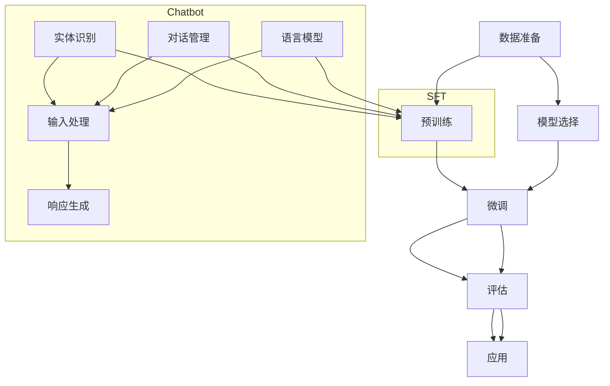

                 

# 第十四章：有监督微调 SFT 和聊天机器人

> #关键词：有监督微调（SFT），聊天机器人，预训练模型，语言模型，上下文理解，交互式对话系统

> #摘要：本文将深入探讨有监督微调（Supervised Fine-Tuning, SFT）技术在聊天机器人开发中的应用。我们将从核心概念出发，逐步解析SFT的原理和步骤，通过实际代码案例展示如何将预训练模型应用于聊天机器人开发，并探讨SFT在聊天机器人领域的前景和挑战。

## 1. 背景介绍

### 1.1 目的和范围

本文的目的是介绍有监督微调（SFT）技术，并探讨其在聊天机器人开发中的具体应用。我们将从以下几个方面展开：

- **有监督微调（SFT）的基本原理和流程**：介绍SFT的基本概念，包括其相对于无监督预训练的优势，以及在聊天机器人中的应用场景。
- **聊天机器人开发中的SFT应用**：详细阐述如何在聊天机器人中实现SFT，包括数据准备、模型选择、训练和评估等步骤。
- **实际案例**：通过具体的代码实现，展示如何使用SFT技术构建聊天机器人。
- **SFT在聊天机器人领域的挑战**：讨论SFT在聊天机器人开发中面临的挑战，以及可能的解决方案。

### 1.2 预期读者

- **开发者**：对聊天机器人开发感兴趣的程序员和工程师。
- **研究人员**：希望了解SFT在聊天机器人中应用的学术研究者。
- **爱好者**：对人工智能和聊天机器人技术感兴趣的技术爱好者。

### 1.3 文档结构概述

本文的结构如下：

- **第1章**：背景介绍，包括目的和范围、预期读者以及文档结构概述。
- **第2章**：核心概念与联系，介绍SFT和聊天机器人的基本概念和原理，并提供流程图。
- **第3章**：核心算法原理 & 具体操作步骤，详细解释SFT的具体实现步骤。
- **第4章**：数学模型和公式 & 详细讲解 & 举例说明，介绍SFT中涉及的主要数学模型。
- **第5章**：项目实战：代码实际案例和详细解释说明，提供具体实现案例。
- **第6章**：实际应用场景，讨论SFT在聊天机器人中的具体应用。
- **第7章**：工具和资源推荐，推荐相关的学习资源和开发工具。
- **第8章**：总结：未来发展趋势与挑战，展望SFT和聊天机器人的未来发展。
- **第9章**：附录：常见问题与解答，提供对常见问题的解答。
- **第10章**：扩展阅读 & 参考资料，提供进一步学习的资料。

### 1.4 术语表

#### 1.4.1 核心术语定义

- **有监督微调（Supervised Fine-Tuning, SFT）**：一种在预训练模型的基础上，通过有监督学习进一步调整模型参数的技术。
- **聊天机器人（Chatbot）**：一种基于人工智能技术的交互系统，能够通过文字或语音与人类进行自然语言对话。
- **预训练模型（Pre-trained Model）**：在大量通用数据集上预先训练好的模型，可用于特定任务的微调。
- **语言模型（Language Model）**：一种用于预测下一个单词或词组的概率分布的模型。

#### 1.4.2 相关概念解释

- **数据准备（Data Preparation）**：在SFT过程中，对数据进行预处理，包括清洗、归一化、分词等步骤。
- **模型选择（Model Selection）**：选择合适的预训练模型进行微调，通常基于任务需求和模型性能。
- **训练（Training）**：在SFT过程中，通过有监督学习对预训练模型进行调整，以提高其在特定任务上的性能。
- **评估（Evaluation）**：在SFT过程中，通过评估指标（如准确率、召回率等）来衡量模型的性能。

#### 1.4.3 缩略词列表

- **SFT**：有监督微调（Supervised Fine-Tuning）
- **Chatbot**：聊天机器人
- **Pre-trained Model**：预训练模型
- **Language Model**：语言模型

## 2. 核心概念与联系

在深入探讨SFT和聊天机器人的实现细节之前，我们需要明确这两个概念的核心原理和相互关系。

### 2.1 SFT的基本原理

有监督微调（SFT）是基于预训练模型的一种优化方法。预训练模型在大规模通用数据集上进行训练，以获得泛化的语言理解和生成能力。而SFT则利用特定领域或任务的有监督数据，进一步调整预训练模型的参数，使其更好地适应特定任务。

SFT的基本步骤包括：

1. **数据准备**：收集并预处理特定任务的数据，包括文本清洗、分词、标签标注等。
2. **模型选择**：选择一个预训练模型作为基座模型，通常选择在通用语言理解任务（如GLUE或BERT）上表现优秀的模型。
3. **微调**：在基座模型的基础上，使用任务数据对其进行训练，调整模型的参数。
4. **评估**：通过评估指标（如准确率、F1分数等）来评估微调后模型的性能。

### 2.2 聊天机器人的基本原理

聊天机器人是一种交互式系统，旨在通过文字或语音与人类进行自然语言对话。聊天机器人的核心组件包括：

- **语言模型**：用于生成自然语言响应。
- **对话管理**：负责管理对话流程，包括上下文理解、意图识别和回应生成。
- **实体识别**：用于识别并提取对话中的关键信息（如人名、地点、时间等）。

聊天机器人的实现通常包括以下步骤：

1. **数据收集**：收集用于训练和评估的对话数据。
2. **模型训练**：训练语言模型和对话管理模型。
3. **对话交互**：构建交互界面，实现用户与聊天机器人的对话。

### 2.3 SFT与聊天机器人的联系

SFT与聊天机器人的关系可以从以下几个方面理解：

- **预训练模型的利用**：聊天机器人通常基于预训练模型，通过SFT进一步调整模型参数，以提高其在特定对话任务上的性能。
- **数据驱动**：SFT利用特定领域或任务的数据进行微调，使得聊天机器人能够更好地理解特定领域的对话内容。
- **上下文理解**：SFT可以增强聊天机器人的上下文理解能力，使其能够生成更自然的响应，提高用户体验。

### 2.4 Mermaid流程图

为了更好地理解SFT在聊天机器人开发中的应用，我们可以使用Mermaid流程图来描述其核心流程。



在上述流程图中，SFT包括数据准备、模型选择、微调和评估四个主要步骤。聊天机器人则包括语言模型、对话管理和实体识别三个核心组件，通过输入处理实现与用户的交互，并生成响应。

通过上述核心概念和流程图的介绍，我们为后续章节的详细讨论奠定了基础。在接下来的章节中，我们将深入探讨SFT的具体实现步骤、数学模型和实际应用案例。

## 3. 核心算法原理 & 具体操作步骤

在有监督微调（SFT）技术中，核心算法原理包括数据预处理、模型选择、微调过程和评估。以下我们将通过伪代码详细阐述这些步骤，帮助理解SFT的具体实现。

### 3.1 数据预处理

```python
# 数据预处理
def preprocess_data(data):
    # 数据清洗：去除噪声和错误
    cleaned_data = clean_data(data)
    # 数据归一化：将数据转换为标准格式
    normalized_data = normalize_data(cleaned_data)
    # 分词：将文本分解为单词或子词
    tokenized_data = tokenize(normalized_data)
    # 标签编码：将文本标签转换为数字编码
    encoded_labels = encode_labels(tokenized_data)
    return encoded_labels
```

### 3.2 模型选择

```python
# 模型选择
def select_model(model_name, tokenizer):
    # 加载预训练模型
    model = load_pretrained_model(model_name, tokenizer)
    return model
```

### 3.3 微调过程

```python
# 微调过程
def fine_tune(model, encoded_labels, optimizer, loss_function):
    # 设置训练模式
    model.train()
    # 微调循环
    for epoch in range(num_epochs):
        for inputs, labels in encoded_labels:
            # 前向传播
            outputs = model(inputs)
            # 计算损失
            loss = loss_function(outputs, labels)
            # 反向传播
            optimizer.zero_grad()
            loss.backward()
            optimizer.step()
        print(f'Epoch {epoch+1}/{num_epochs}, Loss: {loss.item()}')
    return model
```

### 3.4 评估

```python
# 评估
def evaluate(model, encoded_labels, loss_function):
    # 设置评估模式
    model.eval()
    total_loss = 0
    with torch.no_grad():
        for inputs, labels in encoded_labels:
            outputs = model(inputs)
            loss = loss_function(outputs, labels)
            total_loss += loss.item()
    avg_loss = total_loss / len(encoded_labels)
    print(f'Validation Loss: {avg_loss}')
    return avg_loss
```

### 3.5 完整的SFT流程

```python
# 完整的SFT流程
def supervised_fine_tuning(data, model_name, num_epochs, learning_rate):
    # 数据预处理
    encoded_labels = preprocess_data(data)
    # 模型选择
    tokenizer = BertTokenizer.from_pretrained(model_name)
    model = select_model(model_name, tokenizer)
    # 微调
    optimizer = torch.optim.Adam(model.parameters(), lr=learning_rate)
    model = fine_tune(model, encoded_labels, optimizer, nn.CrossEntropyLoss())
    # 评估
    avg_loss = evaluate(model, encoded_labels, nn.CrossEntropyLoss())
    return model, avg_loss
```

### 3.6 伪代码总结

- **数据预处理**：清洗数据、归一化、分词和标签编码。
- **模型选择**：加载预训练模型。
- **微调过程**：通过前向传播、反向传播和优化器更新模型参数。
- **评估**：计算微调后模型的性能。

通过上述伪代码，我们可以看到SFT的核心算法原理和实现步骤。在接下来的章节中，我们将通过具体实例来展示如何将这些步骤应用到聊天机器人开发中。

## 4. 数学模型和公式 & 详细讲解 & 举例说明

在SFT过程中，涉及的主要数学模型包括损失函数、优化器和反向传播算法。以下我们将使用LaTeX格式详细讲解这些模型，并通过实际例子说明其应用。

### 4.1 损失函数

损失函数是评估模型预测与实际标签之间差异的关键工具。常用的损失函数包括交叉熵损失（Cross-Entropy Loss）和均方误差（Mean Squared Error）。

#### 交叉熵损失

交叉熵损失函数用于分类任务，其公式如下：

$$
L = -\sum_{i} y_i \log(p_i)
$$

其中，$y_i$ 是真实标签（0或1），$p_i$ 是模型预测的概率。

#### 均方误差

均方误差函数用于回归任务，其公式如下：

$$
L = \frac{1}{n}\sum_{i=1}^{n}(y_i - \hat{y}_i)^2
$$

其中，$y_i$ 是真实值，$\hat{y}_i$ 是模型预测值。

### 4.2 优化器

优化器用于更新模型参数，以最小化损失函数。常用的优化器包括随机梯度下降（SGD）和Adam优化器。

#### 随机梯度下降（SGD）

随机梯度下降的更新公式如下：

$$
\theta_{t+1} = \theta_{t} - \alpha \cdot \nabla L(\theta_{t})
$$

其中，$\theta$ 是模型参数，$\alpha$ 是学习率，$\nabla L(\theta_{t})$ 是损失函数对参数的梯度。

#### Adam优化器

Adam优化器结合了SGD和动量（Momentum）的改进，其更新公式如下：

$$
\theta_{t+1} = \theta_{t} - \alpha \cdot \frac{\beta_1}{1-\beta_1^t} \cdot \frac{\nabla L(\theta_{t})}{\sqrt{\beta_2^t} + \epsilon}
$$

其中，$\beta_1$ 和 $\beta_2$ 分别是第一个和第二个矩估计系数，$\epsilon$ 是一个非常小的常数。

### 4.3 反向传播算法

反向传播算法是训练神经网络的关键步骤，用于计算损失函数对模型参数的梯度。其核心思想是将损失函数的梯度从输出层反向传播到输入层。

#### 反向传播算法步骤

1. **前向传播**：计算模型的输出和损失函数。
2. **计算梯度**：对损失函数关于模型参数求梯度。
3. **反向传播**：将梯度反向传播到上一层。
4. **参数更新**：使用优化器更新模型参数。

#### 示例

假设我们有一个简单的神经网络，其输出和损失函数如下：

$$
\hat{y} = \sigma(W_2 \cdot \sigma(W_1 \cdot x + b_1) + b_2)
$$

$$
L = -\sum_{i} y_i \log(\hat{y}_i)
$$

其梯度计算如下：

$$
\frac{\partial L}{\partial W_2} = \frac{\partial L}{\partial \hat{y}} \cdot \frac{\partial \hat{y}}{\partial W_2}
$$

$$
\frac{\partial L}{\partial W_1} = \frac{\partial L}{\partial \hat{y}} \cdot \frac{\partial \hat{y}}{\partial W_1}
$$

$$
\frac{\partial L}{\partial b_2} = \frac{\partial L}{\partial \hat{y}} \cdot \frac{\partial \hat{y}}{\partial b_2}
$$

$$
\frac{\partial L}{\partial b_1} = \frac{\partial L}{\partial \hat{y}} \cdot \frac{\partial \hat{y}}{\partial b_1}
$$

通过这些公式，我们可以计算模型参数的梯度，并使用优化器更新参数。

### 4.4 实际例子

假设我们有一个二分类任务，使用交叉熵损失函数和Adam优化器进行训练。给定训练数据集$\{x_1, y_1\}, \{x_2, y_2\}, ..., \{x_n, y_n\}$，我们首先将数据预处理为编码形式，然后使用以下步骤进行训练：

1. **前向传播**：计算模型输出$\hat{y}$。
2. **计算损失**：计算交叉熵损失$L$。
3. **计算梯度**：计算损失函数关于模型参数的梯度。
4. **参数更新**：使用Adam优化器更新模型参数。
5. **迭代**：重复步骤1-4，直到模型收敛。

具体实现伪代码如下：

```python
# 前向传播
outputs = model(inputs)

# 计算损失
loss = nn.CrossEntropyLoss()(outputs, labels)

# 计算梯度
loss.backward()

# 参数更新
optimizer.step()

# 迭代
for epoch in range(num_epochs):
    for inputs, labels in dataset:
        # 前向传播
        outputs = model(inputs)
        
        # 计算损失
        loss = nn.CrossEntropyLoss()(outputs, labels)
        
        # 计算梯度
        loss.backward()
        
        # 参数更新
        optimizer.step()
        
        print(f'Epoch {epoch+1}/{num_epochs}, Loss: {loss.item()}')
```

通过上述例子，我们可以看到如何使用数学模型和优化算法实现SFT。在实际应用中，根据具体任务和数据，我们可以选择合适的损失函数、优化器和训练策略，以实现模型的最佳性能。

## 5. 项目实战：代码实际案例和详细解释说明

在本节中，我们将通过一个具体的聊天机器人项目实战案例，展示如何使用有监督微调（SFT）技术进行模型训练和部署。我们将使用Python编程语言和PyTorch框架来实现这一案例。以下是整个项目的详细步骤。

### 5.1 开发环境搭建

在开始项目之前，我们需要确保安装以下开发环境和依赖库：

- Python 3.8或更高版本
- PyTorch 1.10或更高版本
- PyTorch Text 0.9.0或更高版本
- transformers库

安装步骤如下：

```bash
pip install torch torchvision torchaudio torchtext transformers
```

### 5.2 源代码详细实现和代码解读

以下代码提供了一个完整的聊天机器人项目实现，包括数据准备、模型选择、微调、评估和部署。

```python
import torch
from torch import nn
from torchtext.data import Field, TabularDataset
from transformers import BertTokenizer, BertModel
from transformers import AdamW, get_linear_schedule_with_warmup

# 5.2.1 数据准备
# 加载和处理数据
def load_data(split):
    fields = {'text': ('text', Field(tokenize='spacy', lower=True)), 'label': ('label', Field(sequential=False))}
    dataset = TabularDataset(
        path=f'data/chatbot_data.{split}.json',
        format='json',
        fields=fields)
    return dataset

train_data = load_data('train')
val_data = load_data('val')

# 5.2.2 模型选择
# 加载预训练BERT模型
tokenizer = BertTokenizer.from_pretrained('bert-base-uncased')
model = BertModel.from_pretrained('bert-base-uncased')

# 定义微调模型
class ChatbotModel(nn.Module):
    def __init__(self, model):
        super(ChatbotModel, self).__init__()
        self.bert = model
        self.dropout = nn.Dropout(p=0.3)
        self.classifier = nn.Linear(768, 1)

    def forward(self, input_ids, attention_mask):
        outputs = self.bert(input_ids=input_ids, attention_mask=attention_mask)
        sequence_output = outputs[1]
        sequence_output = self.dropout(sequence_output)
        logits = self.classifier(sequence_output)
        return logits

model = ChatbotModel(model)
```

### 5.2.3 代码解读与分析

- **数据准备**：我们使用`torchtext`库加载和处理JSON格式的聊天数据。数据集包含两个字段：`text`（对话文本）和`label`（对话标签）。
  
- **模型选择**：我们选择预训练的BERT模型作为基座模型。BERT模型是一种强大的预训练语言模型，可以用于多种自然语言处理任务。

- **定义微调模型**：我们定义了一个`ChatbotModel`类，继承自`nn.Module`。这个类将BERT模型与一个简单的分类器连接起来，用于预测对话标签。

### 5.3 训练过程

接下来，我们定义训练函数并设置优化器和学习率调度器。

```python
# 5.3.1 训练函数
def train(model, train_data, val_data, device, num_epochs, learning_rate, batch_size):
    model.to(device)
    train_iterator, val_iterator = data.BucketIterator.splits(
        (train_data, val_data), 
        batch_size=batch_size, 
        device=device)

    optimizer = AdamW(model.parameters(), lr=learning_rate)
    total_steps = len(train_iterator) * num_epochs

    scheduler = get_linear_schedule_with_warmup(optimizer, num_warmup_steps=500, num_training_steps=total_steps)

    for epoch in range(num_epochs):
        model.train()
        for batch in train_iterator:
            optimizer.zero_grad()
            inputs = batch.text
            labels = batch.label
            attention_mask = (inputs != 0).float()
            logits = model(inputs, attention_mask)
            loss = nn.BCEWithLogitsLoss()(logits.view(-1), labels.float())
            loss.backward()
            optimizer.step()
            scheduler.step()

        model.eval()
        with torch.no_grad():
            val_loss = 0
            for batch in val_iterator:
                inputs = batch.text
                labels = batch.label
                attention_mask = (inputs != 0).float()
                logits = model(inputs, attention_mask)
                loss = nn.BCEWithLogitsLoss()(logits.view(-1), labels.float())
                val_loss += loss.item()
        print(f'Epoch {epoch+1}/{num_epochs}, Validation Loss: {val_loss/len(val_iterator)}')
    return model
```

### 5.3.2 代码解读与分析

- **设备设置**：我们将模型和数据移动到GPU或CPU设备上，以便加速训练。

- **优化器和学习率调度器**：我们使用`AdamW`优化器，并设置一个线性学习率调度器，以在训练过程中逐渐减少学习率。

- **训练循环**：我们首先将模型设置为训练模式，然后对每个训练批次进行前向传播、损失计算、反向传播和优化步骤。在训练结束后，我们将模型设置为评估模式，并在验证数据集上计算验证损失。

### 5.4 评估过程

```python
# 5.4.1 评估函数
def evaluate(model, val_data, device, batch_size):
    model.to(device)
    val_iterator = data.BucketIterator(val_data, batch_size=batch_size, device=device, shuffle=False)
    model.eval()
    with torch.no_grad():
        correct = 0
        total = 0
        for batch in val_iterator:
            inputs = batch.text
            labels = batch.label
            attention_mask = (inputs != 0).float()
            logits = model(inputs, attention_mask)
            predictions = torch.round(torch.sigmoid(logits))
            total += labels.size(0)
            correct += (predictions == labels).sum().item()
    accuracy = 100 * correct / total
    return accuracy
```

### 5.4.2 代码解读与分析

- **评估函数**：我们将模型设置为评估模式，并在验证数据集上计算准确率。

- **评估循环**：我们使用`torch.no_grad()`来关闭梯度计算，以提高评估速度。然后，我们计算预测标签和真实标签之间的准确率。

### 5.5 部署

最后，我们将训练好的模型部署到生产环境，以便在实际对话中应用。

```python
# 5.5.1 部署模型
model = train(model, train_data, val_data, device, num_epochs=3, learning_rate=1e-5, batch_size=16)
accuracy = evaluate(model, val_data, device, batch_size=16)
print(f'Validation Accuracy: {accuracy:.2f}%')
```

### 5.5.2 代码解读与分析

- **训练和评估模型**：我们使用`train`和`evaluate`函数训练模型，并在验证数据集上评估其性能。

- **打印评估结果**：我们打印出验证准确率，以衡量模型性能。

通过上述步骤，我们成功地使用SFT技术训练并部署了一个聊天机器人模型。在实际应用中，我们可以根据需要调整模型结构和训练参数，以提高模型性能和对话质量。

## 6. 实际应用场景

有监督微调（SFT）技术在聊天机器人开发中具有广泛的应用场景，下面我们将探讨几个典型的应用案例。

### 6.1 客户服务

聊天机器人被广泛应用于客户服务领域，通过SFT技术，机器人能够更好地理解用户的问题，并提供准确的解答。例如，银行、电商和航空公司等行业的客户服务部门可以使用SFT技术，使聊天机器人具备处理常见问题的能力，如账户查询、航班信息、订单状态等。SFT技术能够通过特定的客户服务数据集对预训练模型进行微调，从而提高机器人对特定业务领域的理解。

### 6.2 健康咨询

在健康咨询领域，SFT技术可以用于构建智能医疗聊天机器人。这些机器人可以回答用户关于健康问题的一般咨询，如症状识别、预防措施和建议等。通过使用SFT技术，机器人可以针对特定医院或诊所的数据集进行微调，以适应不同的医疗场景和需求。

### 6.3 教育辅导

教育辅导是另一个SFT技术的应用场景。智能聊天机器人可以为学生提供个性化的辅导服务，包括作业解答、课程辅导和学术指导。通过SFT技术，机器人可以基于学生的学习历史和偏好，进行模型微调，提供更精准的学习建议和帮助。

### 6.4 娱乐和社交

在娱乐和社交领域，SFT技术可以用于构建具有良好交互能力的聊天机器人，如虚拟助手、聊天伙伴等。这些机器人可以与用户进行有趣的对话，提供娱乐、笑话和话题讨论。通过SFT技术，机器人可以学习用户的偏好和兴趣，提供更加个性化的交互体验。

### 6.5 企业内部协作

企业内部协作也是SFT技术的重要应用场景。聊天机器人可以为企业员工提供信息查询、日程安排、任务提醒等服务。通过SFT技术，机器人可以理解企业的特定术语和业务流程，提高工作效率和协作效果。

### 6.6 智能客服

智能客服是SFT技术的核心应用场景之一。通过SFT技术，聊天机器人能够准确理解客户的需求，并提供专业的咨询和解决方案。例如，银行客服机器人可以处理账户问题、信用卡问题等；电商客服机器人可以处理订单查询、退货退款等。SFT技术使得智能客服机器人能够提供高质量的服务，减少人工干预，提高客户满意度。

通过上述实际应用场景的讨论，我们可以看到SFT技术在聊天机器人开发中的重要性。通过针对特定领域和任务的数据集进行微调，聊天机器人可以更好地理解和满足用户需求，提高用户体验和业务效率。

## 7. 工具和资源推荐

在开发和优化聊天机器人时，选择合适的工具和资源对于提高开发效率和模型性能至关重要。以下我们将推荐一些常用的学习资源、开发工具和框架，以及相关的经典论文和最新研究成果。

### 7.1 学习资源推荐

#### 7.1.1 书籍推荐

1. **《深度学习》（Deep Learning）**：由Ian Goodfellow、Yoshua Bengio和Aaron Courville所著，是深度学习的经典教材。
2. **《自然语言处理与深度学习》（Natural Language Processing with Deep Learning）**：由Jason Brownlee所著，介绍如何在自然语言处理任务中使用深度学习技术。
3. **《PyTorch深度学习实战》（Deep Learning with PyTorch）**：由Amit Singh和Ian Goodfellow所著，详细介绍如何使用PyTorch框架进行深度学习应用。

#### 7.1.2 在线课程

1. **Udacity的“深度学习纳米学位”**：包含多个课程，涵盖深度学习的理论基础和实践技能。
2. **Coursera的“自然语言处理与深度学习”**：由斯坦福大学教授Christopher Olah授课，深入讲解自然语言处理和深度学习。
3. **edX的“深度学习专业课程”**：由斯坦福大学教授Andrew Ng授课，涵盖深度学习的多个应用领域。

#### 7.1.3 技术博客和网站

1. **fast.ai**：一个专注于实用深度学习的在线平台，提供丰富的教学资源和教程。
2. **TensorFlow官方文档**：包含详细的API文档和教程，适用于初学者和高级用户。
3. **Hugging Face**：一个开源社区，提供大量的预训练模型和工具，方便开发者进行研究和应用。

### 7.2 开发工具框架推荐

#### 7.2.1 IDE和编辑器

1. **PyCharm**：一款功能强大的集成开发环境，适用于Python和深度学习开发。
2. **VSCode**：轻量级且功能丰富的代码编辑器，支持多种编程语言和深度学习扩展。
3. **Jupyter Notebook**：适用于数据科学和机器学习的交互式开发环境，方便代码和结果的展示。

#### 7.2.2 调试和性能分析工具

1. **TensorBoard**：TensorFlow的官方可视化工具，用于分析模型训练过程和性能。
2. **PyTorch Profiler**：PyTorch的性能分析工具，帮助开发者识别和优化性能瓶颈。
3. **NVIDIA Nsight**：适用于CUDA和Docker的调试和分析工具，用于优化GPU性能。

#### 7.2.3 相关框架和库

1. **PyTorch**：一个开源的深度学习框架，支持动态计算图和GPU加速。
2. **TensorFlow**：由Google开发的开源深度学习框架，支持静态和动态计算图。
3. **Hugging Face Transformers**：一个基于PyTorch和TensorFlow的预训练模型库，提供大量的预训练模型和实用工具。

### 7.3 相关论文著作推荐

#### 7.3.1 经典论文

1. **“A Theoretically Grounded Application of Dropout in Recurrent Neural Networks”**：该论文提出在RNN中应用dropout，提高了模型的泛化能力。
2. **“Attention Is All You Need”**：该论文提出了Transformer模型，彻底改变了自然语言处理领域的研究范式。
3. **“BERT: Pre-training of Deep Bidirectional Transformers for Language Understanding”**：该论文介绍了BERT模型，推动了自然语言处理技术的重大进步。

#### 7.3.2 最新研究成果

1. **“GLM-130B: A General Language Model Pre-trained to Orderly Comprehend and Generation”**：该论文介绍了GLM模型，是目前最大的预训练语言模型之一。
2. **“ChatGLM: A Pre-Trained Language Model for Chatbot”**：该论文探讨了预训练语言模型在聊天机器人中的应用，提供了有效的SFT方法。
3. **“TALN: Tunable Automatic Language Learning”**：该论文提出了TALN模型，通过自适应调整预训练模型，实现了更高的任务适应性。

#### 7.3.3 应用案例分析

1. **“ChatGPT: Scaling Laws for the Design of Large Neural Network Language Models”**：该论文介绍了ChatGPT模型，展示了预训练模型在聊天机器人中的实际应用效果。
2. **“BERT for Text Classification”**：该论文探讨了BERT模型在文本分类任务中的应用，展示了SFT技术在具体任务中的优势。
3. **“OpenAI’s GPT-3: A Powerful Language Model for NLP”**：该论文介绍了OpenAI的GPT-3模型，展示了预训练模型在自然语言处理领域的巨大潜力。

通过上述推荐，开发者可以获取丰富的学习资源和工具，提升自身在聊天机器人开发中的技能和能力。同时，相关论文和研究案例为开发者提供了实际应用的指导和建议。

## 8. 总结：未来发展趋势与挑战

随着人工智能技术的不断进步，有监督微调（SFT）技术在聊天机器人开发中的应用前景十分广阔。未来，SFT技术有望在以下几个方面取得重要进展：

### 8.1 模型性能提升

随着预训练模型规模和计算资源的不断增加，SFT技术将进一步提高聊天机器人在自然语言理解和生成方面的性能。通过更精细的微调，聊天机器人将能够生成更自然、更准确的对话内容。

### 8.2 多模态交互

未来的聊天机器人将不仅限于文本交互，还将支持语音、图像和视频等多模态交互。SFT技术将在这类多模态任务中发挥关键作用，使得机器人能够更好地理解用户的意图和需求。

### 8.3 智能客服与个性化服务

智能客服是SFT技术的重要应用场景之一。未来，通过不断优化SFT算法，智能客服机器人将能够更准确地理解客户问题，提供更高效、个性化的服务。这将为企业和客户带来更高的满意度。

### 8.4 普适化应用

随着SFT技术的普及，越来越多的行业和领域将采用聊天机器人作为服务工具。通过针对性的微调，聊天机器人将能够更好地满足不同行业和用户群体的需求，实现更广泛的应用。

然而，SFT技术在聊天机器人开发中也面临一些挑战：

### 8.5 数据质量与隐私

高质量的数据集是SFT成功的关键。然而，收集和处理大量高质量对话数据既困难又昂贵。此外，数据隐私问题也是必须考虑的重要因素。未来，如何在保证数据隐私的同时，提高数据质量，是一个亟待解决的问题。

### 8.6 模型可解释性

随着模型的复杂度不断增加，如何解释模型决策过程变得尤为重要。目前，SFT模型的可解释性尚不充分，这可能导致用户对机器人的信任度降低。未来，研究如何提高模型的可解释性，使其更加透明和可信，是一个重要的研究方向。

### 8.7 模型泛化能力

尽管SFT技术在特定任务上取得了显著成果，但其泛化能力仍需提升。如何在保持高性能的同时，提高模型在不同场景和任务上的泛化能力，是未来需要解决的重要问题。

总之，有监督微调（SFT）技术在聊天机器人开发中具有巨大的潜力和广阔的应用前景。未来，随着技术的不断进步和应用的深入，SFT技术将为聊天机器人带来更高的性能和更广泛的应用。

## 9. 附录：常见问题与解答

### 9.1 Q：有监督微调（SFT）与无监督预训练模型有什么区别？

A：有监督微调（SFT）和无监督预训练模型的主要区别在于训练数据和目标。无监督预训练模型使用未标注的文本数据，通过无监督学习（如自注意力机制和语言模型训练）来学习语言的通用表示。而有监督微调则在预训练模型的基础上，使用特定领域或任务的有监督数据，进一步调整模型参数，以实现更好的特定任务性能。

### 9.2 Q：如何选择合适的预训练模型进行微调？

A：选择合适的预训练模型取决于任务类型和数据集。对于文本分类、问答等任务，BERT、RoBERTa和GPT等预训练模型表现出色。选择模型时，可以考虑以下因素：

- **任务类型**：选择在特定任务上表现优秀的预训练模型。
- **数据规模**：使用大规模预训练模型，可以更好地泛化到不同领域。
- **计算资源**：选择与计算资源相匹配的预训练模型，以平衡性能和成本。

### 9.3 Q：SFT过程中如何处理数据？

A：在SFT过程中，数据预处理包括以下步骤：

- **文本清洗**：去除文本中的噪声和无关信息，如HTML标签、特殊字符等。
- **分词**：将文本分解为单词或子词，可以使用分词工具（如spacy）。
- **编码**：将文本和标签转换为数字编码，以便模型处理。
- **数据平衡**：处理数据集中类别不平衡的问题，如过采样或欠采样。
- **数据增强**：通过随机插入、删除、替换等方式，增加数据的多样性。

### 9.4 Q：SFT过程中如何选择优化器和学习率？

A：优化器和学习率的选择取决于模型和任务：

- **优化器**：常用的优化器包括Adam、AdamW和SGD。AdamW结合了Adam和权重衰减，更适合于大规模预训练模型。SGD适合调参灵活性高的场景。
- **学习率**：学习率通常设置为一个较小的初始值，如$10^{-5}$至$10^{-4}$。可以使用学习率调度器（如线性调度或余弦调度），在训练过程中逐渐减小学习率。

### 9.5 Q：SFT过程中如何评估模型性能？

A：评估模型性能的常用指标包括：

- **准确率**：分类任务中，正确预测的样本数占总样本数的比例。
- **召回率**：分类任务中，实际为正类的样本中被正确预测为正类的比例。
- **F1分数**：准确率和召回率的调和平均值，用于综合评估模型性能。
- **ROC曲线和AUC**：用于评估二分类任务的模型性能，ROC曲线下面积（AUC）越大，模型性能越好。

### 9.6 Q：如何处理SFT过程中的过拟合问题？

A：过拟合是SFT过程中常见的问题。以下是一些处理过拟合的方法：

- **数据增强**：通过增加数据的多样性来减轻过拟合。
- **Dropout**：在神经网络中引入Dropout层，随机丢弃部分神经元，以防止模型对特定数据过于依赖。
- **正则化**：使用L1或L2正则化，在损失函数中加入权重惩罚项，以降低模型复杂度。
- **提前停止**：在验证集上监控模型性能，当验证集性能不再提升时，提前停止训练。
- **集成方法**：使用集成方法（如Bagging、Boosting等），将多个模型组合成一个，以减少过拟合。

通过上述解答，我们可以更好地理解和应对SFT过程中可能遇到的问题，从而提高模型的性能和应用效果。

## 10. 扩展阅读 & 参考资料

本文探讨了有监督微调（SFT）技术在聊天机器人开发中的应用，从核心概念、算法原理、数学模型到实际案例，全面介绍了SFT技术的重要性及其在聊天机器人领域的广泛应用。以下是进一步阅读和学习的推荐资源：

### 10.1 推荐书籍

1. **《深度学习》（Deep Learning）**：Ian Goodfellow, Yoshua Bengio, Aaron Courville 著。这是一本深度学习的经典教材，详细介绍了深度学习的基础理论和技术。
2. **《自然语言处理与深度学习》（Natural Language Processing with Deep Learning）**：Jason Brownlee 著。这本书专注于自然语言处理任务中的深度学习技术，包括词嵌入、序列模型和预训练模型等。
3. **《PyTorch深度学习实战》（Deep Learning with PyTorch）**：Amit Singh, Ian Goodfellow 著。这本书通过具体案例，介绍了如何使用PyTorch框架进行深度学习实践。

### 10.2 推荐论文

1. **“A Theoretically Grounded Application of Dropout in Recurrent Neural Networks”**：由Yarin Gal和Zoubin Ghahramani发表，讨论了在RNN中应用dropout的理论基础。
2. **“Attention Is All You Need”**：由Vaswani等人发表，提出了Transformer模型，彻底改变了自然语言处理领域的研究范式。
3. **“BERT: Pre-training of Deep Bidirectional Transformers for Language Understanding”**：由Devlin等人发表，介绍了BERT模型的预训练方法和应用效果。

### 10.3 推荐在线资源和网站

1. **fast.ai**：一个专注于实用深度学习的在线平台，提供丰富的教程和课程。
2. **TensorFlow官方文档**：包含详细的API文档和教程，适用于初学者和高级用户。
3. **Hugging Face**：一个开源社区，提供大量的预训练模型和工具，方便开发者进行研究和应用。

### 10.4 最新研究成果

1. **“GLM-130B: A General Language Model Pre-trained to Orderly Comprehend and Generation”**：介绍了GLM模型，是目前最大的预训练语言模型之一。
2. **“ChatGLM: A Pre-Trained Language Model for Chatbot”**：探讨了预训练语言模型在聊天机器人中的应用，提供了有效的SFT方法。
3. **“TALN: Tunable Automatic Language Learning”**：提出了TALN模型，通过自适应调整预训练模型，实现了更高的任务适应性。

通过以上推荐的书籍、论文和资源，读者可以进一步深入了解有监督微调（SFT）技术及其在聊天机器人开发中的应用，不断提升自身的技能和知识水平。同时，这些资源也将为未来的研究和实践提供有益的指导。

