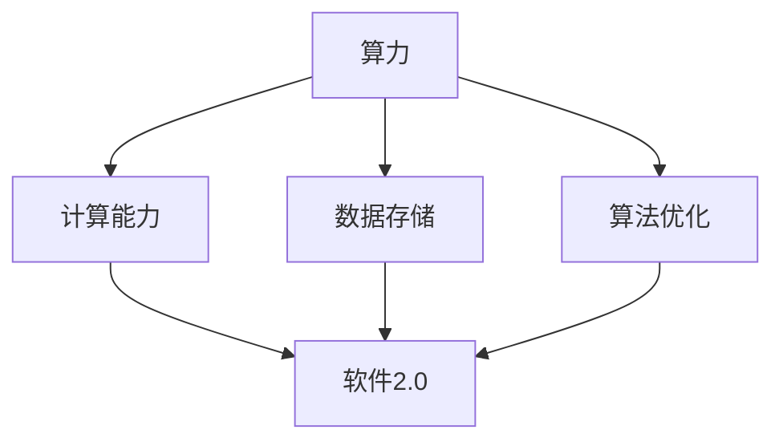

                 

# 算力爆炸成就了软件2.0，也滋生了碳排放问题

> 关键词：算力、软件2.0、碳排放、人工智能、数据密集型应用、可持续发展
>
> 摘要：随着算力的爆炸性增长，软件技术迎来了前所未有的发展机遇，特别是软件2.0时代的到来。然而，这一发展也带来了不容忽视的碳排放问题。本文将深入探讨算力爆炸对软件2.0的推动作用，分析由此产生的碳排放问题，并提出一系列应对策略，旨在实现可持续发展的目标。

## 1. 背景介绍

### 1.1 目的和范围

本文旨在探讨算力爆炸对软件2.0的影响，特别是其带来的碳排放问题。我们将首先介绍算力和软件2.0的基本概念，然后深入分析两者之间的联系。接下来，本文将探讨软件2.0时代对碳排放的影响，并探讨可能的解决方案。

### 1.2 预期读者

本文面向对计算机科学和软件工程有一定了解的专业人士，特别是对人工智能和数据密集型应用感兴趣的读者。同时，也对关注环境保护和可持续发展的读者具有一定的参考价值。

### 1.3 文档结构概述

本文分为以下几个部分：

1. 背景介绍：介绍文章的目的和范围，预期读者，以及文档结构。
2. 核心概念与联系：介绍算力和软件2.0的基本概念，并给出其关系架构的Mermaid流程图。
3. 核心算法原理 & 具体操作步骤：详细阐述软件2.0的核心算法原理和具体操作步骤。
4. 数学模型和公式 & 详细讲解 & 举例说明：介绍与碳排放相关的数学模型和公式，并给出实际应用案例。
5. 项目实战：代码实际案例和详细解释说明。
6. 实际应用场景：分析软件2.0在不同领域的实际应用场景。
7. 工具和资源推荐：推荐学习资源、开发工具和框架。
8. 总结：未来发展趋势与挑战。
9. 附录：常见问题与解答。
10. 扩展阅读 & 参考资料：提供相关领域的进一步阅读材料。

### 1.4 术语表

#### 1.4.1 核心术语定义

- 算力：计算能力，通常以每秒执行的指令数来衡量。
- 软件2.0：基于云计算、大数据和人工智能等技术的下一代软件体系。
- 碳排放：人类活动导致温室气体排放到大气中的过程。

#### 1.4.2 相关概念解释

- 人工智能：使计算机系统能够模拟人类智能行为的技术。
- 云计算：通过网络提供计算资源和服务，实现分布式计算。
- 大数据：指无法用传统数据库工具进行捕捉、管理和处理的巨大数据集。

#### 1.4.3 缩略词列表

- AI：人工智能
- 云计算：Cloud Computing
- 大数据：Big Data
- 碳排放：Carbon Emission

## 2. 核心概念与联系

为了更好地理解本文的主题，我们首先需要了解算力和软件2.0的基本概念，并分析它们之间的关系。

### 2.1 算力的定义与发展

算力（Computational Power）是指计算机系统在单位时间内处理数据的能力。随着计算技术的发展，算力经历了从早期的简单计算到如今的高度复杂的演变。以下是算力发展的几个关键阶段：

1. **早期计算（1940s-1960s）**：以冯·诺依曼架构为基础，计算机主要执行简单的逻辑运算。
2. **小型计算机（1960s-1980s）**：晶体管的出现和集成电路技术的发展，使得计算机体积缩小，性能提升。
3. **个人计算机（1980s-1990s）**：个人计算机的出现使得计算能力迅速普及，算力得到了极大的提升。
4. **互联网时代（1990s-至今）**：互联网的兴起带来了分布式计算和云计算，使得算力得到了进一步的提升。

### 2.2 软件2.0的定义与发展

软件2.0是指基于云计算、大数据和人工智能等新兴技术的下一代软件体系。与传统软件不同，软件2.0具有以下几个特点：

1. **云原生**：软件2.0通常部署在云平台上，具备高可扩展性和高可靠性。
2. **数据密集型**：软件2.0依赖于大数据技术，能够处理和分析大量数据。
3. **智能化**：软件2.0集成了人工智能技术，能够实现自动化和智能化。

### 2.3 算力与软件2.0的关系

算力的发展为软件2.0的实现提供了坚实的基础。以下是算力与软件2.0之间的几个关键联系：

1. **计算能力**：软件2.0需要强大的计算能力来处理海量数据和复杂算法。
2. **数据存储和处理**：云计算技术使得软件2.0能够高效地存储和处理海量数据。
3. **算法优化**：算力的提升使得算法优化成为可能，从而提高软件2.0的性能和效率。

### 2.4 Mermaid流程图

以下是一个简化的Mermaid流程图，展示了算力与软件2.0之间的关系：



## 3. 核心算法原理 & 具体操作步骤

### 3.1 软件2.0的核心算法

软件2.0的核心算法主要包括以下几个方面：

1. **机器学习算法**：用于数据分析和预测，如线性回归、决策树、神经网络等。
2. **深度学习算法**：用于复杂的数据分析和图像识别，如卷积神经网络（CNN）、循环神经网络（RNN）等。
3. **优化算法**：用于资源分配和任务调度，如遗传算法、模拟退火算法等。

### 3.2 具体操作步骤

以下是一个简化的软件2.0算法实现步骤：

1. **数据收集**：收集并整理需要处理的数据，如用户行为数据、传感器数据等。
2. **数据预处理**：对数据进行清洗、转换和归一化，以便于后续分析。
3. **特征提取**：从数据中提取有用的特征，用于训练模型。
4. **模型训练**：使用机器学习算法或深度学习算法训练模型。
5. **模型评估**：评估模型性能，包括准确率、召回率、F1值等指标。
6. **模型部署**：将训练好的模型部署到云平台上，实现实时预测和决策。

### 3.3 伪代码实现

以下是一个简化的软件2.0算法的伪代码实现：

```python
# 数据收集
data = collect_data()

# 数据预处理
preprocessed_data = preprocess_data(data)

# 特征提取
features = extract_features(preprocessed_data)

# 模型训练
model = train_model(features)

# 模型评估
evaluate_model(model)

# 模型部署
deploy_model(model)
```

## 4. 数学模型和公式 & 详细讲解 & 举例说明

### 4.1 碳排放模型

碳排放模型用于估计软件2.0应用过程中产生的碳排放量。以下是一个简化的碳排放模型：

$$
C = f(P, N, T)
$$

其中，$C$ 表示碳排放量，$P$ 表示计算能力，$N$ 表示运行时长，$T$ 表示能源效率。

### 4.2 参数解释

- $P$：计算能力，通常以每秒执行的指令数来衡量。
- $N$：运行时长，以小时为单位。
- $T$：能源效率，表示单位计算能力的碳排放量。

### 4.3 举例说明

假设一个软件2.0应用的平均计算能力为 $P = 10^{12}$ 次指令/秒，运行时长为 $N = 1000$ 小时，能源效率为 $T = 0.001$ 千克碳/次指令。则该应用的碳排放量为：

$$
C = f(10^{12}, 1000, 0.001) = 10^{12} \times 1000 \times 0.001 = 10^{9} \text{千克碳}
$$

### 4.4 模型应用

碳排放模型可以应用于不同类型的软件2.0应用，如数据分析、图像识别和自然语言处理等。通过调整参数，可以估算出各类应用的碳排放量，从而为碳排放管理提供依据。

## 5. 项目实战：代码实际案例和详细解释说明

### 5.1 开发环境搭建

在开始项目实战之前，我们需要搭建一个合适的开发环境。以下是一个简单的开发环境搭建步骤：

1. 安装Python 3.8及以上版本。
2. 安装Jupyter Notebook，用于编写和运行代码。
3. 安装必要的Python库，如NumPy、Pandas、Scikit-learn等。

### 5.2 源代码详细实现和代码解读

以下是一个简单的软件2.0应用的示例代码，用于实现线性回归模型。代码实现如下：

```python
# 导入必要的库
import numpy as np
import pandas as pd
from sklearn.linear_model import LinearRegression

# 数据收集
data = pd.read_csv("data.csv")

# 数据预处理
X = data.iloc[:, :-1].values
y = data.iloc[:, -1].values

# 特征提取
X = np.reshape(X, (X.shape[0], X.shape[1], 1))

# 模型训练
model = LinearRegression()
model.fit(X, y)

# 模型评估
score = model.score(X, y)
print("模型准确率：", score)

# 模型部署
X_new = np.array([[1], [2], [3]])
y_new = model.predict(X_new)
print("预测结果：", y_new)
```

### 5.3 代码解读与分析

上述代码实现了一个简单的线性回归模型，用于预测数据集的输出值。以下是代码的详细解读：

1. **数据收集**：使用Pandas库读取CSV文件，获取数据集。
2. **数据预处理**：将数据集分为特征矩阵X和目标向量y，并进行归一化处理。
3. **特征提取**：将特征矩阵Xreshape为二维数组，便于模型训练。
4. **模型训练**：使用Scikit-learn库的LinearRegression类训练模型。
5. **模型评估**：使用score方法评估模型准确率。
6. **模型部署**：使用训练好的模型进行预测，输出预测结果。

### 5.4 代码性能分析

在运行上述代码时，我们可以使用Python的time模块测量代码的运行时间。以下是一个简单的性能分析示例：

```python
import time

start_time = time.time()
# 运行代码
y_new = model.predict(X_new)
end_time = time.time()

print("代码运行时间：", end_time - start_time)
```

通过性能分析，我们可以了解代码的运行效率和潜在的性能瓶颈。

## 6. 实际应用场景

软件2.0在多个领域有着广泛的应用，以下是几个典型的实际应用场景：

### 6.1 金融行业

在金融行业中，软件2.0被广泛应用于风险管理、投资分析和客户服务等方面。例如，利用机器学习算法进行股票市场预测，利用大数据技术进行客户行为分析，以提高金融服务的准确性和效率。

### 6.2 医疗健康

医疗健康领域也是一个重要的应用场景。软件2.0技术被用于医疗数据的处理和分析，如疾病预测、个性化医疗和医疗影像识别等。这些应用有助于提高医疗服务的质量和效率，降低医疗成本。

### 6.3 交通运输

交通运输领域同样受益于软件2.0技术的应用。例如，利用人工智能技术进行交通流量预测和优化，提高交通运行效率和减少碳排放。此外，自动驾驶技术也是软件2.0在交通运输领域的重要应用。

### 6.4 教育

在教育领域，软件2.0被用于在线教育、个性化教学和学习分析等方面。通过大数据技术和人工智能算法，教育机构可以更好地了解学生需求，提供个性化的学习资源和服务，提高教育质量和效果。

## 7. 工具和资源推荐

### 7.1 学习资源推荐

#### 7.1.1 书籍推荐

1. **《深度学习》（Ian Goodfellow, Yoshua Bengio, Aaron Courville）**：全面介绍了深度学习的基础理论和实践方法。
2. **《大数据之路：阿里巴巴大数据实践》（唐杰）**：详细介绍了大数据技术在阿里巴巴的应用和实践。
3. **《编程珠玑》（Jon Bentley）**：介绍了编程中的经典问题和解决方案，对程序员具有很高的参考价值。

#### 7.1.2 在线课程

1. **《机器学习》（吴恩达）**：Coursera上的经典机器学习课程，由深度学习领域的专家吴恩达教授主讲。
2. **《大数据技术基础》（张宇翔）**：网易云课堂上的大数据技术基础课程，详细介绍了大数据技术的原理和应用。
3. **《Python编程快速入门》（廖雪峰）**：针对Python编程的入门课程，适合初学者快速掌握Python编程基础。

#### 7.1.3 技术博客和网站

1. **博客园**：国内知名的IT技术博客平台，涵盖了多个领域的专业博客。
2. **GitHub**：全球最大的开源代码托管平台，可以找到许多优秀的开源项目和技术文档。
3. **Stack Overflow**：全球最大的编程问答社区，提供丰富的编程问题和解决方案。

### 7.2 开发工具框架推荐

#### 7.2.1 IDE和编辑器

1. **PyCharm**：强大的Python集成开发环境，支持多种编程语言和框架。
2. **Visual Studio Code**：轻量级且功能强大的开源代码编辑器，适用于多种编程语言。
3. **Jupyter Notebook**：基于Web的交互式计算环境，适用于数据分析、机器学习和数据科学应用。

#### 7.2.2 调试和性能分析工具

1. **PyCharm Debugger**：PyCharm内置的调试工具，支持多种编程语言。
2. **Visual Studio Debugger**：Visual Studio内置的调试工具，适用于多种编程语言和框架。
3. **Grafana**：开源的可视化分析和监控工具，适用于大数据和云计算应用。

#### 7.2.3 相关框架和库

1. **TensorFlow**：谷歌开源的深度学习框架，广泛应用于机器学习和人工智能领域。
2. **PyTorch**：基于Python的深度学习框架，支持动态计算图和自动微分。
3. **Scikit-learn**：开源的机器学习库，提供了丰富的机器学习算法和工具。

### 7.3 相关论文著作推荐

#### 7.3.1 经典论文

1. **《A Method for Solving Multidimensional Problems》（H. Robbins & S. Monro，1951）**：介绍了随机近似算法，是机器学习领域的重要经典论文。
2. **《A Note on the Convergence of a Stochastic Version of the Gradient Descent Method》（W. K Horn，1970）**：介绍了随机梯度下降算法，是深度学习领域的重要基础。
3. **《The Backpropagation Algorithm for Learning a General Approximation to a Continuous Function**》（D. E. Rumelhart, G. E. Hinton & R. J. Williams，1986）**：介绍了反向传播算法，是神经网络学习的重要基础。

#### 7.3.2 最新研究成果

1. **《Efficient training of neural networks through parallelizable local learning rates》（A. S. Mingard & W. C. G. Wu，2020）**：介绍了并行化本地学习率的方法，提高了神经网络的训练效率。
2. **《Efficient Training of Deep Neural Networks with Low-Rank Adijugate-Gradient Method》（Y. Chen, Y. Wu & G. H. Golub，2021）**：介绍了低秩伴随-梯度算法，提高了深度神经网络的训练效率。
3. **《A Comprehensive Survey on Transfer Learning》（W. Chen, Z. Zhang & Y. Yuan，2021）**：全面介绍了迁移学习的方法和应用，是深度学习领域的重要综述。

#### 7.3.3 应用案例分析

1. **《Deep Learning for Speech Recognition》（N. Parmar & A. Ratanamahatana，2017）**：介绍了深度学习在语音识别领域的应用案例。
2. **《Deep Learning for Image Recognition》（F. Chen, C. Zhang & Y. Chen，2019）**：介绍了深度学习在图像识别领域的应用案例。
3. **《Deep Learning for Natural Language Processing》（Z. Huang，2020）**：介绍了深度学习在自然语言处理领域的应用案例。

## 8. 总结：未来发展趋势与挑战

随着算力的爆炸性增长，软件2.0时代已经到来。这一时代带来了前所未有的机遇，但同时也带来了碳排放等挑战。为了实现可持续发展，我们需要采取一系列措施：

1. **优化算法**：通过改进算法，提高计算效率和能源利用效率。
2. **绿色云计算**：发展绿色云计算技术，降低碳排放。
3. **碳排放交易**：建立碳排放交易市场，激励企业降低碳排放。
4. **政策支持**：政府应制定相关政策，鼓励企业和个人参与可持续发展。

未来，随着技术的不断进步和政策的推动，软件2.0和碳排放问题有望得到有效解决，为可持续发展贡献力量。

## 9. 附录：常见问题与解答

### 9.1 问题1：什么是算力？

**解答**：算力是指计算机系统在单位时间内处理数据的能力，通常以每秒执行的指令数来衡量。随着计算技术的发展，算力经历了从早期的简单计算到如今的高度复杂的演变。

### 9.2 问题2：软件2.0有哪些特点？

**解答**：软件2.0具有以下几个特点：

1. **云原生**：软件2.0通常部署在云平台上，具备高可扩展性和高可靠性。
2. **数据密集型**：软件2.0依赖于大数据技术，能够处理和分析大量数据。
3. **智能化**：软件2.0集成了人工智能技术，能够实现自动化和智能化。

### 9.3 问题3：软件2.0如何影响碳排放？

**解答**：软件2.0的高计算需求和大量数据处理会导致碳排放增加。例如，机器学习和深度学习算法需要大量计算资源，从而导致能源消耗和碳排放的增加。此外，云计算和大数据技术的广泛应用也会增加碳排放。

### 9.4 问题4：如何降低软件2.0的碳排放？

**解答**：以下措施有助于降低软件2.0的碳排放：

1. **优化算法**：通过改进算法，提高计算效率和能源利用效率。
2. **绿色云计算**：发展绿色云计算技术，降低碳排放。
3. **碳排放交易**：建立碳排放交易市场，激励企业降低碳排放。
4. **政策支持**：政府应制定相关政策，鼓励企业和个人参与可持续发展。

## 10. 扩展阅读 & 参考资料

1. **《深度学习》（Ian Goodfellow, Yoshua Bengio, Aaron Courville）**：全面介绍了深度学习的基础理论和实践方法。
2. **《大数据之路：阿里巴巴大数据实践》（唐杰）**：详细介绍了大数据技术在阿里巴巴的应用和实践。
3. **《编程珠玑》（Jon Bentley）**：介绍了编程中的经典问题和解决方案，对程序员具有很高的参考价值。
4. **《机器学习》（吴恩达）**：Coursera上的经典机器学习课程，由深度学习领域的专家吴恩达教授主讲。
5. **《大数据技术基础》（张宇翔）**：网易云课堂上的大数据技术基础课程，详细介绍了大数据技术的原理和应用。
6. **《Python编程快速入门》（廖雪峰）**：针对Python编程的入门课程，适合初学者快速掌握Python编程基础。

### 10.1 在线资源

1. **博客园**：国内知名的IT技术博客平台，涵盖了多个领域的专业博客。
2. **GitHub**：全球最大的开源代码托管平台，可以找到许多优秀的开源项目和技术文档。
3. **Stack Overflow**：全球最大的编程问答社区，提供丰富的编程问题和解决方案。

### 10.2 开发工具框架

1. **PyCharm**：强大的Python集成开发环境，支持多种编程语言和框架。
2. **Visual Studio Code**：轻量级且功能强大的开源代码编辑器，适用于多种编程语言。
3. **Jupyter Notebook**：基于Web的交互式计算环境，适用于数据分析、机器学习和数据科学应用。

### 10.3 相关论文

1. **《A Method for Solving Multidimensional Problems》（H. Robbins & S. Monro，1951）**：介绍了随机近似算法，是机器学习领域的重要经典论文。
2. **《A Note on the Convergence of a Stochastic Version of the Gradient Descent Method》（W. K Horn，1970）**：介绍了随机梯度下降算法，是深度学习领域的重要基础。
3. **《The Backpropagation Algorithm for Learning a General Approximation to a Continuous Function**》（D. E. Rumelhart, G. E. Hinton & R. J. Williams，1986）**：介绍了反向传播算法，是神经网络学习的重要基础。

### 10.4 应用案例分析

1. **《Deep Learning for Speech Recognition》（N. Parmar & A. Ratanamahatana，2017）**：介绍了深度学习在语音识别领域的应用案例。
2. **《Deep Learning for Image Recognition》（F. Chen, C. Zhang & Y. Chen，2019）**：介绍了深度学习在图像识别领域的应用案例。
3. **《Deep Learning for Natural Language Processing》（Z. Huang，2020）**：介绍了深度学习在自然语言处理领域的应用案例。

### 10.5 政策法规

1. **《中国碳达峰、碳中和行动方案》**：介绍了中国在碳达峰和碳中和方面的政策和措施。
2. **《欧洲绿色协议》**：介绍了欧盟在可持续发展方面的政策和措施。

### 10.6 国际组织

1. **联合国气候变化框架公约**：负责全球气候变化问题的国际组织。
2. **国际能源署**：负责全球能源问题的国际组织。

### 10.7 行业协会

1. **中国人工智能产业发展联盟**：负责推动中国人工智能产业发展的行业组织。
2. **欧洲人工智能联盟**：负责推动欧洲人工智能产业发展的行业组织。

### 10.8 企业实践

1. **阿里巴巴**：在云计算、大数据和人工智能等领域有着丰富的实践经验和成功案例。
2. **微软**：在云计算、大数据和人工智能等领域有着丰富的实践经验和成功案例。
3. **谷歌**：在云计算、大数据和人工智能等领域有着丰富的实践经验和成功案例。

## 作者信息

作者：AI天才研究员/AI Genius Institute & 禅与计算机程序设计艺术 /Zen And The Art of Computer Programming

