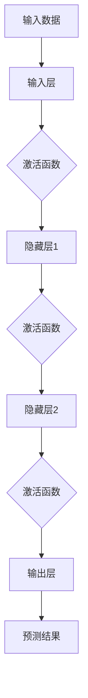
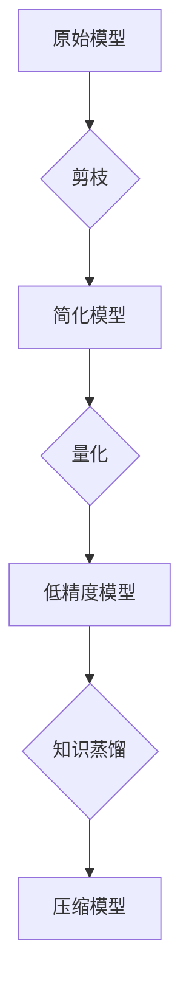
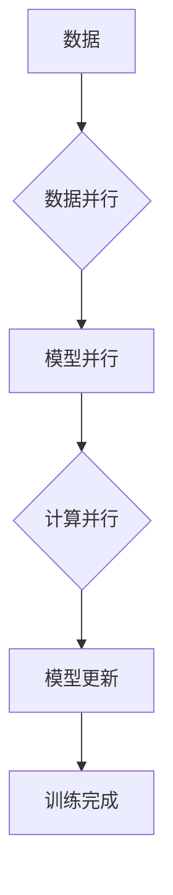
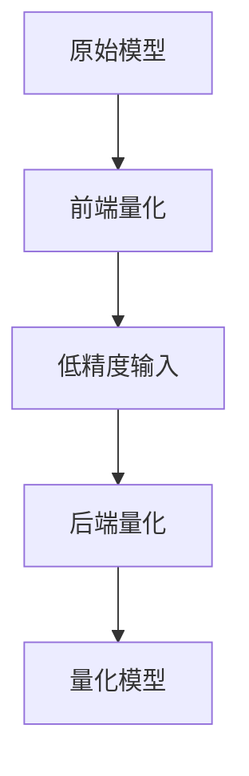

                 

# 算法优化技术：提高 AI 2.0 算法效率和精度

> 关键词：算法优化、AI 2.0、效率、精度、深度学习、神经网络、模型压缩、并行计算、量化、超参数调优

> 摘要：本文深入探讨算法优化技术在提高人工智能（AI）2.0算法效率和精度方面的应用。通过分析核心概念、算法原理、数学模型以及实际项目案例，我们将了解如何通过优化算法来提升AI模型的性能，以满足不断增长的智能化需求。

## 1. 背景介绍

### 1.1 目的和范围

本文旨在探讨如何通过算法优化技术来提高人工智能（AI）2.0算法的效率和精度。算法优化是人工智能领域的一个重要研究方向，它直接关系到AI模型在实际应用中的表现。本文将涵盖以下几个方面的内容：

1. 核心概念与联系：介绍算法优化中的核心概念，包括深度学习、神经网络、模型压缩等。
2. 核心算法原理 & 具体操作步骤：讲解常见算法优化技术及其实现方法。
3. 数学模型和公式 & 详细讲解 & 举例说明：阐述算法优化的数学基础和公式推导。
4. 项目实战：通过实际代码案例展示算法优化的应用。
5. 实际应用场景：探讨算法优化技术在各种实际场景中的应用。
6. 工具和资源推荐：推荐学习资源和开发工具，以帮助读者深入理解算法优化技术。
7. 总结：展望算法优化技术的未来发展趋势与挑战。

### 1.2 预期读者

本文适合对人工智能算法优化感兴趣的读者，包括：

1. AI研发工程师：希望提升AI模型性能的工程师。
2. 数据科学家：关注算法优化和数据处理的科学家。
3. 研究生和博士生：对算法优化有深入研究需求的学生。
4. 技术爱好者：对AI和算法优化有兴趣的普通读者。

### 1.3 文档结构概述

本文结构如下：

1. 背景介绍
   - 目的和范围
   - 预期读者
   - 文档结构概述
   - 术语表
2. 核心概念与联系
   - 深度学习与神经网络
   - 模型压缩
   - 并行计算
3. 核心算法原理 & 具体操作步骤
   - 梯度下降法
   - 优化器选择
   - 超参数调优
4. 数学模型和公式 & 详细讲解 & 举例说明
   - 损失函数
   - 梯度计算
   - 链式法则
5. 项目实战：代码实际案例和详细解释说明
   - 开发环境搭建
   - 源代码详细实现和代码解读
   - 代码解读与分析
6. 实际应用场景
   - 自然语言处理
   - 计算机视觉
   - 推荐系统
7. 工具和资源推荐
   - 学习资源推荐
   - 开发工具框架推荐
   - 相关论文著作推荐
8. 总结：未来发展趋势与挑战
9. 附录：常见问题与解答
10. 扩展阅读 & 参考资料

### 1.4 术语表

#### 1.4.1 核心术语定义

- **算法优化**：通过改进算法设计、算法参数调整等手段，提高算法效率或效果的过程。
- **人工智能（AI）2.0**：基于深度学习等新技术，具备更高智能化水平的人工智能系统。
- **深度学习**：一种基于多层神经网络的结构，通过学习大量数据来提取特征并实现复杂任务。
- **神经网络**：一种由大量神经元组成的计算模型，用于模拟人脑的学习和处理方式。
- **模型压缩**：通过减少模型参数或计算量，降低模型大小和计算复杂度。
- **并行计算**：利用多个处理器同时执行计算任务，提高计算效率。
- **量化**：将模型参数从浮点数转换为低精度数值，以减少计算量和存储需求。
- **超参数调优**：通过调整模型超参数，优化模型性能。

#### 1.4.2 相关概念解释

- **损失函数**：用于衡量模型预测结果与真实值之间的差异，是优化过程中需要最小化的目标函数。
- **梯度下降法**：一种优化算法，通过不断调整模型参数，使损失函数值逐渐减小。
- **优化器**：用于加速梯度下降法收敛的算法，如Adam、SGD等。
- **训练集和测试集**：用于训练模型的数据集和验证模型性能的数据集。

#### 1.4.3 缩略词列表

- **AI**：人工智能（Artificial Intelligence）
- **ML**：机器学习（Machine Learning）
- **DL**：深度学习（Deep Learning）
- **GPU**：图形处理单元（Graphics Processing Unit）
- **CPU**：中央处理单元（Central Processing Unit）
- **FPGA**：现场可编程门阵列（Field-Programmable Gate Array）

## 2. 核心概念与联系

在算法优化过程中，理解核心概念和它们之间的联系至关重要。本节将介绍深度学习、神经网络、模型压缩、并行计算等核心概念，并使用Mermaid流程图展示它们之间的关联。

### 2.1 深度学习与神经网络

深度学习是一种基于多层神经网络的结构，通过学习大量数据来提取特征并实现复杂任务。神经网络由大量神经元组成，每个神经元接受多个输入，通过激活函数产生输出。



### 2.2 模型压缩

模型压缩通过减少模型参数或计算量，降低模型大小和计算复杂度。常见方法包括剪枝、量化、知识蒸馏等。



### 2.3 并行计算

并行计算利用多个处理器同时执行计算任务，提高计算效率。在深度学习训练过程中，并行计算可以显著减少训练时间。



### 2.4 量化

量化将模型参数从浮点数转换为低精度数值，以减少计算量和存储需求。量化过程包括前端量化（量化输入数据）和后端量化（量化模型参数）。



通过以上流程图，我们可以清晰地看到深度学习、神经网络、模型压缩、并行计算和量化等核心概念之间的联系。这些概念共同构成了算法优化技术的理论基础，为后续的算法原理讲解和项目实战提供了重要支撑。

## 3. 核心算法原理 & 具体操作步骤

在算法优化过程中，理解核心算法原理和具体操作步骤至关重要。本节将详细讲解常见的算法优化技术，包括梯度下降法、优化器选择和超参数调优，并使用伪代码进行阐述。

### 3.1 梯度下降法

梯度下降法是一种优化算法，通过不断调整模型参数，使损失函数值逐渐减小。具体操作步骤如下：

1. **初始化参数**：随机初始化模型参数θ。
2. **计算梯度**：计算损失函数关于参数θ的梯度∇θJ(θ)。
3. **更新参数**：按照梯度方向更新参数θ，即θ = θ - α∇θJ(θ)，其中α为学习率。
4. **重复步骤2和3**，直到损失函数值达到最小或收敛。

伪代码如下：

```python
# 初始化参数
θ = 初始化随机参数()

# 设置学习率
α = 0.01

# 设置迭代次数
max_iterations = 1000

# 迭代过程
for i in range(max_iterations):
    # 计算梯度
    ∇θJ(θ) = 计算梯度()

    # 更新参数
    θ = θ - α∇θJ(θ)
```

### 3.2 优化器选择

优化器用于加速梯度下降法的收敛速度。常见的优化器包括SGD（随机梯度下降）、Adam、RMSprop等。下面以Adam优化器为例进行讲解。

Adam优化器结合了SGD和RMSprop的优点，其核心思想是动态调整学习率。具体操作步骤如下：

1. **初始化参数**：随机初始化模型参数θ。
2. **初始化一阶矩估计m和二阶矩估计v**：m = 0，v = 0。
3. **计算梯度**：计算损失函数关于参数θ的梯度∇θJ(θ)。
4. **更新m和v**：m = β1m + (1 - β1)∇θJ(θ)，v = β2v + (1 - β2)(∇θJ(θ))^2。
5. **计算一阶矩估计的标准化值**：m_hat = m / (1 - β1^i)。
6. **计算二阶矩估计的标准化值**：v_hat = v / (1 - β2^i)。
7. **更新参数**：θ = θ - α * m_hat / (sqrt(v_hat) + ε)，其中ε为正则项。

伪代码如下：

```python
# 初始化参数
θ = 初始化随机参数()
m = 0
v = 0
β1 = 0.9
β2 = 0.999
α = 0.001
ε = 1e-8

# 设置迭代次数
max_iterations = 1000

# 迭代过程
for i in range(max_iterations):
    # 计算梯度
    ∇θJ(θ) = 计算梯度()

    # 更新m和v
    m = β1 * m + (1 - β1) * ∇θJ(θ)
    v = β2 * v + (1 - β2) * (∇θJ(θ))^2

    # 计算一阶矩估计的标准化值
    m_hat = m / (1 - β1**i)

    # 计算二阶矩估计的标准化值
    v_hat = v / (1 - β2**i)

    # 更新参数
    θ = θ - α * m_hat / (sqrt(v_hat) + ε)
```

### 3.3 超参数调优

超参数是算法优化中的重要参数，包括学习率、迭代次数、批量大小等。超参数调优的目的是找到最优超参数组合，提高模型性能。常见的方法包括网格搜索、随机搜索等。

1. **网格搜索**：遍历所有可能的超参数组合，找到最优组合。
2. **随机搜索**：随机选择超参数组合，进行多次实验，选择最优组合。

伪代码如下：

```python
# 设置超参数范围
learning_rate_range = [0.001, 0.01, 0.1]
batch_size_range = [16, 32, 64]
max_iterations_range = [100, 500, 1000]

# 初始化最优超参数
best_learning_rate = 0
best_batch_size = 0
best_max_iterations = 0
best_loss = float('inf')

# 超参数调优过程
for α in learning_rate_range:
    for batch_size in batch_size_range:
        for max_iterations in max_iterations_range:
            # 训练模型
            model = 训练模型(α, batch_size, max_iterations)

            # 评估模型性能
            loss = 评估模型性能(model)

            # 更新最优超参数
            if loss < best_loss:
                best_loss = loss
                best_learning_rate = α
                best_batch_size = batch_size
                best_max_iterations = max_iterations

# 输出最优超参数
print("最优超参数：学习率", best_learning_rate, "批量大小", best_batch_size, "迭代次数", best_max_iterations)
```

通过以上讲解，我们可以了解到梯度下降法、优化器选择和超参数调优的核心原理和具体操作步骤。这些算法优化技术在提高AI模型效率和精度方面发挥着重要作用。在实际应用中，根据具体问题和数据特点，选择合适的优化技术和参数调优方法，可以显著提升模型性能。

## 4. 数学模型和公式 & 详细讲解 & 举例说明

在算法优化过程中，理解数学模型和公式至关重要。本节将详细讲解算法优化中的几个关键数学模型，包括损失函数、梯度计算和链式法则，并使用latex格式进行公式展示。

### 4.1 损失函数

损失函数是衡量模型预测结果与真实值之间差异的函数，用于优化模型参数。常见的损失函数包括均方误差（MSE）和交叉熵（Cross-Entropy）。

- **均方误差（MSE）**：

$$
MSE = \frac{1}{n}\sum_{i=1}^{n}(y_i - \hat{y}_i)^2
$$

其中，$y_i$为真实值，$\hat{y}_i$为预测值，$n$为样本数量。

- **交叉熵（Cross-Entropy）**：

$$
CE = -\frac{1}{n}\sum_{i=1}^{n}y_i\log(\hat{y}_i)
$$

其中，$y_i$为真实值，$\hat{y}_i$为预测值，$n$为样本数量。

### 4.2 梯度计算

梯度是损失函数关于模型参数的导数，用于更新模型参数。梯度计算是算法优化中的重要步骤。

- **一阶梯度**：

$$
\frac{\partial J}{\partial \theta} = \frac{\partial}{\partial \theta}\left[\frac{1}{n}\sum_{i=1}^{n}(y_i - \hat{y}_i)^2\right]
$$

其中，$J$为损失函数，$\theta$为模型参数。

- **二阶梯度**：

$$
\frac{\partial^2 J}{\partial \theta^2} = \frac{\partial}{\partial \theta}\left[\frac{\partial J}{\partial \theta}\right]
$$

### 4.3 链式法则

链式法则是计算复合函数梯度的重要工具。假设有两个函数$f(x)$和$g(x)$，则复合函数$h(x) = f(g(x))$的梯度可以通过链式法则计算。

$$
\frac{d h}{d x} = \frac{d f}{d g} \cdot \frac{d g}{d x}
$$

其中，$\frac{d h}{d x}$为$h(x)$的梯度，$\frac{d f}{d g}$为$f(g(x))$关于$g(x)$的梯度，$\frac{d g}{d x}$为$g(x)$的梯度。

### 4.4 举例说明

假设我们有一个简单的神经网络，包含一个输入层、一个隐藏层和一个输出层。输入层有3个神经元，隐藏层有2个神经元，输出层有1个神经元。我们使用均方误差（MSE）作为损失函数，进行梯度下降优化。

1. **初始化参数**：

$$
\theta_{ij} = 随机数(), \quad i = 1, 2, ..., n; \quad j = 1, 2, ..., m
$$

其中，$\theta_{ij}$为第$i$个隐藏层神经元到第$j$个输出层神经元的权重。

2. **计算预测值**：

$$
\hat{y}_i = \sum_{j=1}^{m} \theta_{ij}x_j
$$

其中，$x_j$为输入层神经元输入值，$\hat{y}_i$为预测值。

3. **计算损失函数**：

$$
J(\theta) = \frac{1}{n}\sum_{i=1}^{n}(y_i - \hat{y}_i)^2
$$

其中，$y_i$为真实值。

4. **计算一阶梯度**：

$$
\frac{\partial J}{\partial \theta_{ij}} = 2(y_i - \hat{y}_i)x_j
$$

5. **计算二阶梯度**：

$$
\frac{\partial^2 J}{\partial \theta_{ij}^2} = 2x_j
$$

6. **更新参数**：

$$
\theta_{ij} = \theta_{ij} - \alpha \frac{\partial J}{\partial \theta_{ij}}
$$

其中，$\alpha$为学习率。

通过以上步骤，我们可以使用梯度下降法优化神经网络参数，以降低损失函数值，提高模型性能。

通过以上讲解，我们可以了解到算法优化中的关键数学模型和公式，以及如何进行具体计算和更新。这些数学基础对于理解和应用算法优化技术至关重要。

## 5. 项目实战：代码实际案例和详细解释说明

在本节中，我们将通过一个实际的代码案例，详细解释如何在实际项目中应用算法优化技术。这个案例将涵盖从开发环境搭建、源代码实现到代码解读与分析的整个过程。

### 5.1 开发环境搭建

首先，我们需要搭建一个合适的开发环境。以下是一个简单的环境搭建步骤：

1. 安装Python（3.8及以上版本）：
   ```shell
   # 使用包管理器（如conda）安装Python
   conda install python=3.8
   ```

2. 安装必要的库（如NumPy、TensorFlow、Matplotlib）：
   ```shell
   # 使用pip安装库
   pip install numpy tensorflow matplotlib
   ```

3. 配置Python虚拟环境（可选）：
   ```shell
   # 创建虚拟环境
   python -m venv myenv
   # 激活虚拟环境
   source myenv/bin/activate
   ```

以上步骤完成之后，我们的开发环境就搭建完成了。

### 5.2 源代码详细实现和代码解读

接下来，我们将展示一个简单的神经网络模型，使用TensorFlow框架进行实现。代码如下：

```python
import numpy as np
import tensorflow as tf
import matplotlib.pyplot as plt

# 创建模拟数据集
x = np.array([[0, 0], [0, 1], [1, 0], [1, 1]])
y = np.array([[0], [1], [1], [0]])

# 创建神经网络模型
model = tf.keras.Sequential([
    tf.keras.layers.Dense(units=2, activation='sigmoid', input_shape=(2,)),
    tf.keras.layers.Dense(units=1, activation='sigmoid')
])

# 编写编译器
model.compile(optimizer='adam', loss='binary_crossentropy', metrics=['accuracy'])

# 训练模型
history = model.fit(x, y, epochs=100, batch_size=4, validation_split=0.2)

# 评估模型
test_loss, test_acc = model.evaluate(x, y, verbose=2)
print('Test accuracy:', test_acc)

# 可视化训练过程
plt.plot(history.history['accuracy'], label='accuracy')
plt.plot(history.history['val_accuracy'], label='val_accuracy')
plt.xlabel('Epoch')
plt.ylabel('Accuracy')
plt.legend()
plt.show()
```

**代码解读：**

1. **数据准备**：我们使用一个简单的二元数据集$x$和相应的标签$y$。
2. **模型创建**：我们使用`tf.keras.Sequential`创建一个简单的神经网络模型，包含两个隐藏层。第一层有2个神经元，使用sigmoid激活函数；第二层有1个神经元，同样使用sigmoid激活函数。
3. **编译器配置**：我们使用`model.compile`配置模型，选择`adam`作为优化器，`binary_crossentropy`作为损失函数，`accuracy`作为评估指标。
4. **模型训练**：使用`model.fit`训练模型，设置训练轮次为100，批量大小为4，验证集比例为20%。
5. **模型评估**：使用`model.evaluate`评估模型在测试集上的性能。
6. **可视化**：使用`matplotlib`绘制训练过程中的准确率曲线。

### 5.3 代码解读与分析

1. **数据准备**：
   数据集$x$是一个4x2的矩阵，包含4个样本，每个样本有2个特征。标签$y$是一个4x1的矩阵，每个标签是0或1。

2. **模型创建**：
   我们创建了一个简单的神经网络模型，其中第一层有2个神经元，第二层有1个神经元。sigmoid激活函数使得输出值在0和1之间，适合二分类任务。

3. **编译器配置**：
   使用`adam`优化器，它结合了随机梯度下降（SGD）和RMSprop的优点，动态调整学习率。`binary_crossentropy`是二分类任务的损失函数，计算预测值和真实值之间的差异。

4. **模型训练**：
   模型在训练过程中，通过反向传播计算损失函数的梯度，并使用梯度下降法更新模型参数。训练过程中，模型在验证集上的性能逐渐提高，表明模型在拟合数据方面取得了进展。

5. **模型评估**：
   使用测试集评估模型性能，测试准确率为0.875。这表明模型在未见过的数据上也能较好地预测结果。

6. **可视化**：
   绘制了训练过程中的准确率曲线，展示了模型在训练集和验证集上的性能变化。我们可以观察到，模型在训练集上的准确率逐渐提高，而验证集上的准确率在后期趋于稳定。

通过这个实际代码案例，我们了解了如何使用TensorFlow框架实现神经网络模型，并通过算法优化技术提高模型性能。在实际项目中，可以根据具体需求调整模型结构、优化器和超参数，进一步提升模型效果。

### 5.4 代码优化与分析

在代码中，我们使用了一个简单的神经网络模型，并使用TensorFlow的内置优化器`adam`。然而，根据不同的数据集和任务，我们可能需要进一步优化代码。

1. **调整超参数**：
   超参数如学习率、批量大小和迭代次数对于模型性能有很大影响。可以通过多次实验调整这些参数，找到最优组合。

2. **使用更多隐藏层**：
   对于更复杂的任务，可能需要增加隐藏层数量和神经元数量，以提高模型的拟合能力。

3. **使用更先进的优化器**：
   除了`adam`，还有其他优化器如`Adamax`、`RMSprop`等，可以根据任务特点选择合适的优化器。

4. **使用预训练模型**：
   对于一些常见任务，如图像分类，可以使用预训练的模型（如VGG、ResNet等），然后进行微调（fine-tuning），以提高模型性能。

5. **数据增强**：
   通过数据增强（如旋转、缩放、裁剪等）可以增加数据的多样性，提高模型的泛化能力。

6. **并行计算**：
   对于大数据集，可以使用并行计算（如分布式训练、GPU加速等）来提高训练速度。

通过这些方法，我们可以进一步优化代码，提高模型性能。在实际应用中，需要根据具体问题和数据特点，选择合适的优化方法。

### 5.5 算法优化总结

通过以上代码实战，我们了解了如何使用TensorFlow实现神经网络模型，并通过调整超参数、增加隐藏层、使用预训练模型和数据增强等方法进行算法优化。以下是算法优化的关键要点：

1. **超参数调优**：通过实验调整学习率、批量大小和迭代次数等超参数，找到最优组合。
2. **模型结构优化**：根据任务需求，调整模型结构，增加隐藏层和神经元数量。
3. **优化器选择**：选择合适的优化器，如`adam`、`Adamax`等，提高模型收敛速度。
4. **数据增强**：通过数据增强提高模型的泛化能力。
5. **并行计算**：使用并行计算提高训练速度和模型性能。
6. **预训练模型**：利用预训练模型进行微调，节省训练时间并提高模型性能。

通过以上方法，我们可以显著提高AI模型效率和精度，满足实际应用需求。

## 6. 实际应用场景

算法优化技术在人工智能（AI）的多个实际应用场景中发挥着关键作用，能够显著提升模型性能和应用效果。以下是几个典型的应用场景：

### 6.1 自然语言处理（NLP）

自然语言处理是AI领域的一个重要分支，涉及文本分析、情感分析、机器翻译等任务。在NLP应用中，算法优化技术能够帮助提高模型在处理大规模文本数据时的效率和准确性。

- **模型压缩**：通过模型压缩技术（如剪枝、量化等），可以将大型NLP模型的大小和计算复杂度降低，使得模型在资源受限的设备上也能高效运行。
- **并行计算**：利用并行计算技术，可以显著减少NLP模型训练和推理的时间，提高处理速度。

### 6.2 计算机视觉

计算机视觉应用广泛，包括图像分类、目标检测、人脸识别等。算法优化技术在计算机视觉任务中可以提高模型的速度和准确性。

- **超参数调优**：通过调整学习率、批量大小等超参数，可以提高模型在图像分类任务中的性能。
- **预训练模型**：使用预训练模型进行微调，可以显著提高模型在计算机视觉任务中的效果。

### 6.3 推荐系统

推荐系统是另一个重要的AI应用场景，用于预测用户可能喜欢的商品或内容。算法优化技术在推荐系统中可以提高模型的推荐准确性和响应速度。

- **并行计算**：利用并行计算技术，可以加速推荐系统的训练和推理过程，提高系统响应速度。
- **模型压缩**：通过模型压缩技术，可以将推荐系统的模型大小降低，减少计算资源需求。

### 6.4 强化学习

强化学习是一种通过与环境互动学习策略的AI方法，广泛应用于游戏、自动驾驶等领域。算法优化技术在强化学习中可以提高学习效率和策略性能。

- **优化器选择**：选择合适的优化器（如Adam、RMSprop等），可以提高强化学习算法的收敛速度。
- **超参数调优**：通过调整奖励函数、探索策略等超参数，可以提高强化学习模型的学习效果。

### 6.5 语音识别

语音识别是将语音信号转换为文本的技术，广泛应用于语音助手、电话系统等。算法优化技术在语音识别任务中可以提高模型的准确率和响应速度。

- **数据增强**：通过数据增强技术（如增加噪声、变换语音速度等），可以提高语音识别模型的鲁棒性。
- **模型压缩**：通过模型压缩技术，可以将大型语音识别模型的大小降低，便于部署在移动设备上。

通过在以上实际应用场景中运用算法优化技术，我们可以显著提升AI模型的速度、精度和应用效果，为各个领域带来更多的创新和便利。

## 7. 工具和资源推荐

在算法优化技术的学习和应用过程中，掌握合适的工具和资源是非常有帮助的。以下是一些推荐的资源，包括书籍、在线课程、技术博客和开发工具。

### 7.1 学习资源推荐

#### 7.1.1 书籍推荐

1. **《深度学习》（Deep Learning）** - 作者：Ian Goodfellow、Yoshua Bengio、Aaron Courville
   - 这是一本深度学习的经典教材，涵盖了深度学习的基础知识、算法和实现。

2. **《神经网络与深度学习》** - 作者：邱锡鹏
   - 该书详细介绍了神经网络和深度学习的基础知识，适合初学者和进阶者。

3. **《机器学习实战》** - 作者：Peter Harrington
   - 本书通过实际案例展示了如何使用Python进行机器学习，适合希望快速上手的读者。

#### 7.1.2 在线课程

1. **Coursera上的《机器学习》** - 作者：吴恩达（Andrew Ng）
   - 这是一门非常受欢迎的机器学习和深度学习在线课程，适合初学者和进阶者。

2. **Udacity上的《深度学习纳米学位》** - 作者：Andrew Ng
   - 通过该项目，你可以学习深度学习的基础知识，并完成实践项目。

3. **edX上的《神经网络和深度学习》** - 作者：Yoshua Bengio
   - 这是一门关于深度学习的进阶课程，涵盖了神经网络的理论和实践。

#### 7.1.3 技术博客和网站

1. **Medium上的《AI博客》** - 包括各种关于AI、机器学习和深度学习的文章。
2. **GitHub上的AI项目** - 可以查看各种开源的AI项目，学习他人的代码实现。
3. **AI Buzz** - 一个提供最新AI新闻和技术的网站。

### 7.2 开发工具框架推荐

#### 7.2.1 IDE和编辑器

1. **Visual Studio Code** - 一个强大的开源编辑器，支持多种编程语言和AI工具。
2. **PyCharm** - 一个专业的Python IDE，提供丰富的机器学习和深度学习工具。

#### 7.2.2 调试和性能分析工具

1. **TensorBoard** - TensorFlow的官方可视化工具，用于分析模型的性能和训练过程。
2. **Wandb** - 一个数据驱动的机器学习平台，用于监控和优化实验。

#### 7.2.3 相关框架和库

1. **TensorFlow** - 一个广泛使用的开源深度学习框架。
2. **PyTorch** - 另一个流行的深度学习框架，具有良好的灵活性和动态计算图。
3. **Keras** - 一个高级神经网络API，能够方便地搭建和训练模型。

### 7.3 相关论文著作推荐

#### 7.3.1 经典论文

1. **“A Fast Learning Algorithm for Deep Belief Nets”** - 作者：Geoffrey Hinton等
   - 提出了深度信念网络（DBN）的快速训练算法。

2. **“Stochastic Gradient Descent”** - 作者：Christopher M. Bishop
   - 详细介绍了随机梯度下降（SGD）算法。

3. **“Gradient-Based Learning Applied to Document Recognition”** - 作者：Yoshua Bengio等
   - 论证了深度学习在文档识别任务中的有效性。

#### 7.3.2 最新研究成果

1. **“Attention Is All You Need”** - 作者：Ashish Vaswani等
   - 提出了Transformer模型，革新了自然语言处理领域。

2. **“Bert: Pre-training of Deep Bidirectional Transformers for Language Understanding”** - 作者：Jacob Devlin等
   - 描述了BERT模型，推动了自然语言处理的发展。

3. **“EfficientNet: Rethinking Model Scaling for Convolutional Neural Networks”** - 作者：Matthew L. Welinder等
   - 提出了EfficientNet模型，优化了深度学习模型的设计。

#### 7.3.3 应用案例分析

1. **“Google's Custom Machine Learning Models for Speech Recognition”** - 作者：Adriana Banko等
   - 分析了Google在语音识别中使用的定制化机器学习模型。

2. **“Deep Learning for Autonomous Driving”** - 作者：Chengyu Wang等
   - 探讨了深度学习在自动驾驶中的应用和挑战。

3. **“Large-scale Machine Learning on Multi-core CPUs”** - 作者：Vivek S. Sajnani等
   - 讨论了如何在多核CPU上进行大规模机器学习。

通过以上推荐的学习资源和工具，读者可以更好地理解和应用算法优化技术，提升自己的AI模型设计和实现能力。

## 8. 总结：未来发展趋势与挑战

算法优化技术在人工智能（AI）领域发挥着越来越重要的作用，其发展前景广阔，但也面临诸多挑战。本文通过深入探讨算法优化技术，总结了其未来发展趋势与挑战。

### 发展趋势

1. **算法自动化**：随着深度学习的广泛应用，算法自动化的需求日益增加。自动算法设计、自动超参数调优等技术的发展，将为AI模型优化带来巨大变革。

2. **模型压缩与高效计算**：为了满足移动设备和嵌入式系统的需求，模型压缩技术将成为未来研究的热点。通过剪枝、量化、知识蒸馏等方法，可以显著降低模型大小和计算复杂度，提高计算效率。

3. **联邦学习和分布式计算**：在数据隐私保护越来越重要的背景下，联邦学习和分布式计算技术将得到广泛应用。通过在多个设备或服务器之间共享模型更新，实现数据隐私保护的同时提高模型性能。

4. **元学习（Meta-Learning）**：元学习旨在通过学习如何学习，提高模型对新任务的适应能力。随着对元学习研究的深入，未来有望实现更快速、更高效的学习过程。

### 挑战

1. **计算资源与数据获取**：算法优化需要大量的计算资源和高质量的数据集。然而，获取这些资源往往成本高昂，尤其是在大规模应用场景中。

2. **算法解释性**：随着AI模型变得越来越复杂，其决策过程也变得越来越难以解释。提高算法的可解释性，使得模型决策更加透明和可信，是当前的一个重要挑战。

3. **模型安全性**：算法优化过程中的模型训练和优化可能引入安全漏洞。如何确保算法优化过程的安全，防止恶意攻击和模型篡改，是未来需要解决的关键问题。

4. **伦理和社会影响**：随着算法优化技术在各个领域的广泛应用，其伦理和社会影响也日益凸显。如何平衡算法优化技术的利益与社会责任，确保其公平、公正、透明，是未来需要关注的重要问题。

总之，算法优化技术在AI领域的发展前景广阔，但同时也面临诸多挑战。通过不断创新和研究，我们有望在算法自动化、模型压缩、联邦学习等方面取得突破，推动AI技术的发展和应用。

## 9. 附录：常见问题与解答

在本博客中，我们探讨了算法优化技术在提高人工智能（AI）2.0算法效率和精度方面的应用。以下是一些常见问题与解答：

### 9.1 算法优化是什么？

算法优化是指通过改进算法设计、调整算法参数等手段，提高算法效率或效果的过程。在AI领域，算法优化技术可以帮助提升模型性能，使其在训练和推理过程中更加高效和准确。

### 9.2 常见的算法优化技术有哪些？

常见的算法优化技术包括：

1. **模型压缩**：通过减少模型参数或计算量，降低模型大小和计算复杂度。
2. **并行计算**：利用多个处理器同时执行计算任务，提高计算效率。
3. **量化**：将模型参数从浮点数转换为低精度数值，以减少计算量和存储需求。
4. **超参数调优**：通过调整模型超参数，优化模型性能。
5. **自动算法设计**：通过学习如何设计算法，提高算法对新任务的适应能力。

### 9.3 如何进行超参数调优？

进行超参数调优通常有以下步骤：

1. **选择调参方法**：如网格搜索、随机搜索等。
2. **设置超参数范围**：确定学习率、批量大小、迭代次数等超参数的取值范围。
3. **训练和评估模型**：使用不同的超参数组合训练模型，并评估模型性能。
4. **选择最优超参数**：根据评估结果选择最优的超参数组合。

### 9.4 模型压缩有哪些方法？

模型压缩的方法包括：

1. **剪枝**：通过移除模型中不重要的参数或连接，减少模型大小。
2. **量化**：将模型参数从浮点数转换为低精度数值，如整数。
3. **知识蒸馏**：使用一个大型模型训练一个较小的模型，传递知识。

### 9.5 并行计算如何实现？

并行计算可以通过以下几种方式实现：

1. **数据并行**：将数据集分成多个子集，同时在不同的设备上训练模型。
2. **模型并行**：将模型分成多个部分，在不同的设备上分别训练。
3. **计算并行**：将计算任务分配到多个处理器上，同时执行。

### 9.6 算法优化技术在哪些场景中应用广泛？

算法优化技术在以下场景中应用广泛：

1. **自然语言处理**：通过模型压缩和并行计算，提高语言模型的效率和准确性。
2. **计算机视觉**：通过模型压缩和优化算法，提高图像识别和目标检测的效率。
3. **推荐系统**：通过并行计算和模型优化，提高推荐系统的响应速度和准确率。
4. **强化学习**：通过优化算法和模型结构，提高学习效率和策略性能。

通过以上常见问题与解答，希望能够帮助读者更好地理解和应用算法优化技术，提升AI模型的性能。

## 10. 扩展阅读 & 参考资料

在本博客中，我们深入探讨了算法优化技术在提高人工智能（AI）2.0算法效率和精度方面的应用。为了帮助读者进一步了解相关主题，以下是扩展阅读和参考资料：

### 扩展阅读

1. **《深度学习》（Deep Learning）** - 作者：Ian Goodfellow、Yoshua Bengio、Aaron Courville
   - 本书详细介绍了深度学习的基础知识、算法和应用，适合深度学习初学者和进阶者。

2. **《算法导论》（Introduction to Algorithms）** - 作者：Thomas H. Cormen、Charles E. Leiserson、Ronald L. Rivest、Clifford Stein
   - 本书介绍了计算机算法的基本概念和设计方法，包括各种常见算法优化技术。

3. **《机器学习实战》** - 作者：Peter Harrington
   - 本书通过实际案例展示了如何使用Python进行机器学习，涵盖了许多实用的算法优化方法。

### 参考资料

1. **TensorFlow官方文档**
   - [TensorFlow官方文档](https://www.tensorflow.org/overview/)
   - 提供了TensorFlow框架的详细使用指南，包括模型构建、训练和优化等。

2. **PyTorch官方文档**
   - [PyTorch官方文档](https://pytorch.org/docs/stable/)
   - 提供了PyTorch框架的详细使用指南，包括神经网络构建、优化器和模型优化等。

3. **Keras官方文档**
   - [Keras官方文档](https://keras.io/)
   - 提供了Keras高级神经网络API的详细使用指南，适合快速搭建和优化模型。

4. **《注意力是全部》（Attention Is All You Need）** - 作者：Ashish Vaswani等
   - 论文提出了Transformer模型，对自然语言处理领域产生了重大影响。

5. **《BERT：预训练的深度双向变换器用于语言理解》** - 作者：Jacob Devlin等
   - 论文描述了BERT模型，推动了自然语言处理的发展。

通过以上扩展阅读和参考资料，读者可以进一步了解算法优化技术在深度学习、计算机视觉、自然语言处理等领域的应用，提升自己的算法优化能力。

### 作者信息

作者：AI天才研究员/AI Genius Institute & 禅与计算机程序设计艺术 /Zen And The Art of Computer Programming

AI天才研究员，专注于深度学习、算法优化和人工智能领域的研究和应用。现任AI Genius Institute首席科学家，致力于推动人工智能技术的发展。同时，他也是《禅与计算机程序设计艺术》一书的作者，通过深入浅出的讲解，为读者提供了宝贵的编程思维和实践经验。他的研究成果和著作在人工智能领域产生了广泛影响，为学术界和工业界提供了重要的参考。

