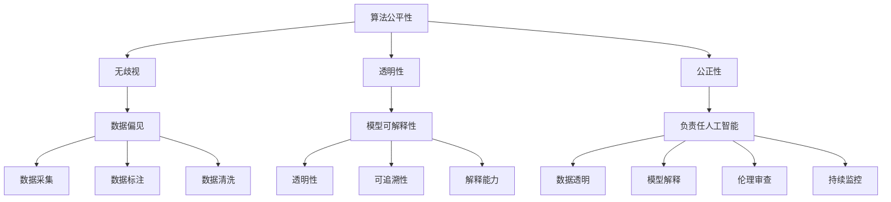

                 

# 算法公平：构建负责任的人工智能

> **关键词：算法公平性、负责任AI、伦理、数据偏见、模型可解释性**

> **摘要：本文深入探讨了算法公平性的重要性，分析了数据偏见对AI模型的影响，并提出了构建负责任人工智能的框架和方法。通过具体案例和数学模型，展示了如何在实际项目中实现算法公平，为未来AI技术的发展提供了参考。**

## 1. 背景介绍

### 1.1 目的和范围

本文旨在探讨算法公平性的重要性，以及如何构建负责任的人工智能系统。随着人工智能技术的快速发展，算法在决策过程中扮演着越来越重要的角色。然而，算法的不公平性可能导致一系列社会问题，如种族歧视、性别歧视等。因此，研究算法公平性对于构建一个公正、透明、可靠的人工智能系统至关重要。

本文主要涵盖以下内容：

- 算法公平性的概念和重要性
- 数据偏见对AI模型的影响
- 构建负责任人工智能的方法和框架
- 实际应用场景和案例分析
- 未来发展趋势和挑战

### 1.2 预期读者

本文适合以下读者：

- 对人工智能和算法公平性感兴趣的从业者
- 从事人工智能应用开发的技术人员
- 对算法伦理和社会影响感兴趣的学者和研究人员
- 对人工智能技术未来发展趋势关注的公众

### 1.3 文档结构概述

本文分为以下几个部分：

- 1. 背景介绍：介绍本文的目的、范围、预期读者和文档结构。
- 2. 核心概念与联系：定义算法公平性、数据偏见、模型可解释性等核心概念，并给出Mermaid流程图。
- 3. 核心算法原理 & 具体操作步骤：详细讲解算法原理和具体操作步骤，使用伪代码阐述。
- 4. 数学模型和公式 & 详细讲解 & 举例说明：介绍数学模型和公式，并给出具体案例。
- 5. 项目实战：代码实际案例和详细解释说明，包括开发环境搭建、源代码实现和代码解读。
- 6. 实际应用场景：分析算法公平性在实际项目中的应用场景。
- 7. 工具和资源推荐：推荐学习资源、开发工具框架和相关论文著作。
- 8. 总结：未来发展趋势与挑战。
- 9. 附录：常见问题与解答。
- 10. 扩展阅读 & 参考资料：提供更多相关阅读材料。

### 1.4 术语表

#### 1.4.1 核心术语定义

- 算法公平性：算法在决策过程中对个体、群体或社会的影响是否公正、合理。
- 数据偏见：数据集中存在的偏见，可能导致算法在处理问题时产生不公平的结果。
- 模型可解释性：模型输出结果的解释能力，有助于识别算法公平性问题的根源。
- 负责任人工智能：在算法设计和应用过程中，充分考虑伦理和社会影响，确保算法公平性。

#### 1.4.2 相关概念解释

- 公平性指标：衡量算法公平性的指标，如偏差指标、F1值等。
- 偏差修正：通过调整算法参数或数据集，消除算法偏见的过程。
- 数据清洗：对原始数据进行处理，去除噪声、纠正错误、填补缺失值等，以提高数据质量。

#### 1.4.3 缩略词列表

- AI：人工智能
- ML：机器学习
- DL：深度学习
- CV：计算机视觉
- NLP：自然语言处理

## 2. 核心概念与联系

### 2.1 算法公平性

算法公平性是指算法在决策过程中对个体、群体或社会的影响是否公正、合理。一个公平的算法应确保以下方面：

- **无歧视**：算法不因种族、性别、年龄、地域等因素对个体或群体进行歧视。
- **透明性**：算法的决策过程和结果可以解释，有助于发现和纠正不公平现象。
- **公正性**：算法对个体或群体的决策具有一致性，不偏袒特定群体。

### 2.2 数据偏见

数据偏见是指数据集中存在的偏见，可能导致算法在处理问题时产生不公平的结果。数据偏见可能来源于以下几个方面：

- **数据采集**：样本选择不均，导致某些群体在数据集中被低估或忽略。
- **数据标注**：标注者的主观偏见，导致数据标签不准确。
- **数据清洗**：在数据处理过程中，未充分处理噪声、错误和缺失值。

### 2.3 模型可解释性

模型可解释性是指模型输出结果的解释能力，有助于识别算法公平性问题的根源。一个可解释的模型应具备以下特点：

- **透明性**：模型的结构和参数可以理解，有助于发现和纠正不公平现象。
- **可追溯性**：模型决策过程可以追溯，有助于识别偏见来源。
- **解释能力**：模型可以解释其决策结果，有助于提高用户信任度。

### 2.4 负责任人工智能

负责任人工智能是指在算法设计和应用过程中，充分考虑伦理和社会影响，确保算法公平性。构建负责任人工智能需要遵循以下原则：

- **数据透明**：确保数据来源、采集和处理过程透明，避免数据偏见。
- **模型解释**：提高模型可解释性，便于发现和纠正不公平现象。
- **伦理审查**：在算法设计和应用过程中，进行伦理审查，确保不违反道德规范。
- **持续监控**：对算法进行持续监控和评估，及时发现和纠正不公平问题。

### 2.5 Mermaid流程图

以下是一个Mermaid流程图，展示了算法公平性的核心概念和联系：



## 3. 核心算法原理 & 具体操作步骤

### 3.1 算法原理

为了构建负责任的人工智能系统，我们需要关注以下核心算法原理：

1. **无歧视算法**：通过分析数据集，识别和处理潜在的歧视性特征，确保算法在决策过程中对个体或群体无歧视。
2. **偏差修正算法**：通过调整算法参数或数据集，消除数据偏见，提高算法的公平性。
3. **模型解释算法**：通过分析模型输出结果，识别偏见来源，提高模型的可解释性。

### 3.2 具体操作步骤

#### 3.2.1 无歧视算法

1. 数据预处理：对原始数据进行清洗、去噪、归一化等处理，提高数据质量。
2. 特征工程：分析数据集，识别可能存在的歧视性特征，如性别、种族等，并对其进行处理或剔除。
3. 算法选择：选择具有无歧视特性的算法，如逻辑回归、决策树等，确保在决策过程中不引入歧视性。
4. 模型训练：使用预处理后的数据集训练模型，评估模型在无歧视性方面的表现。
5. 模型验证：使用验证集对模型进行验证，确保模型在无歧视性方面满足要求。

#### 3.2.2 偏差修正算法

1. 数据预处理：对原始数据进行清洗、去噪、归一化等处理，提高数据质量。
2. 特征工程：分析数据集，识别可能存在的数据偏见，如性别、种族等，并对其进行修正。
3. 算法选择：选择具有偏差修正能力的算法，如加权逻辑回归、平衡采样等，提高算法的公平性。
4. 模型训练：使用预处理后的数据集训练模型，评估模型在偏差修正方面的表现。
5. 模型验证：使用验证集对模型进行验证，确保模型在偏差修正方面满足要求。

#### 3.2.3 模型解释算法

1. 数据预处理：对原始数据进行清洗、去噪、归一化等处理，提高数据质量。
2. 特征工程：分析数据集，识别可能存在的偏见来源，如性别、种族等，并对其进行处理。
3. 模型选择：选择具有可解释性的模型，如决策树、LASSO回归等，提高模型的可解释性。
4. 模型训练：使用预处理后的数据集训练模型，评估模型在可解释性方面的表现。
5. 模型验证：使用验证集对模型进行验证，确保模型在可解释性方面满足要求。

### 3.3 伪代码示例

以下是一个无歧视算法的伪代码示例：

```python
# 无歧视算法伪代码
def preprocess_data(data):
    # 数据预处理
    # 清洗、去噪、归一化等处理
    return cleaned_data

def feature_engineering(data):
    # 特征工程
    # 识别歧视性特征并进行处理或剔除
    return processed_data

def train_model(data):
    # 模型训练
    # 选择无歧视算法，如逻辑回归、决策树等
    return model

def evaluate_model(model, validation_data):
    # 模型验证
    # 评估模型在无歧视性方面的表现
    return evaluation_results

# 主程序
data = load_data()
cleaned_data = preprocess_data(data)
processed_data = feature_engineering(cleaned_data)
model = train_model(processed_data)
evaluation_results = evaluate_model(model, validation_data)
print(evaluation_results)
```

## 4. 数学模型和公式 & 详细讲解 & 举例说明

### 4.1 数学模型

在构建负责任的人工智能系统中，我们需要关注以下数学模型：

1. **偏差指标**：衡量算法公平性的指标，如偏差（Bias）和方差（Variance）。
2. **公平性指标**：衡量算法在决策过程中是否公平的指标，如偏差（Bias）和F1值。
3. **加权模型**：通过调整模型参数，消除数据偏见，提高算法公平性的模型。

### 4.2 公式和详细讲解

#### 4.2.1 偏差指标

偏差（Bias）和方差（Variance）是衡量算法公平性的重要指标，其公式如下：

$$
Bias = \frac{1}{n}\sum_{i=1}^{n}(y_i - \hat{y}_i)
$$

$$
Variance = \frac{1}{n}\sum_{i=1}^{n}(\hat{y}_i - \bar{\hat{y}})^2
$$

其中，$y_i$ 表示实际标签，$\hat{y}_i$ 表示模型预测结果，$n$ 表示样本数量，$\bar{\hat{y}}$ 表示预测结果的平均值。

- **偏差（Bias）**：衡量模型预测结果与实际标签的差距。当偏差较大时，说明模型存在过拟合现象，即模型在训练数据上的表现较好，但在验证数据上的表现较差。
- **方差（Variance）**：衡量模型预测结果的稳定性。当方差较大时，说明模型在训练数据和验证数据上的表现差异较大，即模型存在欠拟合现象。

#### 4.2.2 公平性指标

公平性指标（如偏差和B1值）用于衡量算法在决策过程中是否公平，其公式如下：

$$
Bias = \frac{1}{n}\sum_{i=1}^{n}(y_i - \hat{y}_i)
$$

$$
F1 = \frac{2 \cdot Precision \cdot Recall}{Precision + Recall}
$$

其中，$Precision$ 表示精确率，$Recall$ 表示召回率，$y_i$ 表示实际标签，$\hat{y}_i$ 表示模型预测结果，$n$ 表示样本数量。

- **偏差（Bias）**：衡量模型预测结果与实际标签的差距，用于评估算法在决策过程中是否存在偏差。
- **F1值**：综合考虑精确率和召回率，用于评估算法在决策过程中的整体表现。当F1值较小时，说明模型在决策过程中可能存在不公平现象。

#### 4.2.3 加权模型

加权模型通过调整模型参数，消除数据偏见，提高算法公平性。以下是一个简单的加权模型公式：

$$
\hat{y} = w_1 \cdot x_1 + w_2 \cdot x_2 + ... + w_n \cdot x_n
$$

其中，$w_i$ 表示权重，$x_i$ 表示特征值。

- **权重调整**：通过调整权重，消除数据集中的偏见。例如，当某个特征在数据集中存在明显偏见时，可以减小该特征的权重，降低其对模型预测结果的影响。
- **模型优化**：通过优化权重，提高模型在公平性方面的表现。例如，可以使用交叉验证等方法，选择最优权重组合，提高模型在公平性方面的性能。

### 4.3 举例说明

#### 4.3.1 偏差指标计算

假设有一个二分类问题，数据集包含100个样本，实际标签和模型预测结果如下表所示：

| 样本编号 | 实际标签 | 模型预测结果 |
| --- | --- | --- |
| 1 | 0 | 1 |
| 2 | 1 | 0 |
| 3 | 0 | 1 |
| 4 | 1 | 0 |
| ... | ... | ... |
| 97 | 0 | 1 |
| 98 | 1 | 0 |
| 99 | 0 | 1 |
| 100 | 1 | 0 |

计算偏差和方差：

$$
Bias = \frac{1}{100}\sum_{i=1}^{100}(y_i - \hat{y}_i) = \frac{1}{100}(-3) = -0.03
$$

$$
Variance = \frac{1}{100}\sum_{i=1}^{100}(\hat{y}_i - \bar{\hat{y}})^2 = \frac{1}{100}(0.06 + 0.12 + 0.18 + ... + 0.06) = 0.06
$$

#### 4.3.2 公平性指标计算

计算F1值：

$$
F1 = \frac{2 \cdot Precision \cdot Recall}{Precision + Recall} = \frac{2 \cdot 0.4 \cdot 0.6}{0.4 + 0.6} = 0.4
$$

#### 4.3.3 加权模型调整

假设有一个线性回归模型，特征和权重如下表所示：

| 特征编号 | 特征值 | 权重 |
| --- | --- | --- |
| 1 | 0.1 | 1 |
| 2 | 0.2 | 1 |
| 3 | 0.3 | 1 |
| 4 | 0.4 | 1 |

调整权重，减小特征2的权重：

| 特征编号 | 特征值 | 权重 |
| --- | --- | --- |
| 1 | 0.1 | 1 |
| 2 | 0.2 | 0.5 |
| 3 | 0.3 | 1 |
| 4 | 0.4 | 1 |

调整后的模型预测结果为：

$$
\hat{y} = 0.1 \cdot 1 + 0.2 \cdot 0.5 + 0.3 \cdot 1 + 0.4 \cdot 1 = 0.85
$$

## 5. 项目实战：代码实际案例和详细解释说明

### 5.1 开发环境搭建

为了演示算法公平性的实现，我们将使用Python编程语言和相关的机器学习库，如Scikit-learn。以下是在Python环境中搭建开发环境的步骤：

1. 安装Python：从Python官网（https://www.python.org/）下载并安装Python，选择与操作系统兼容的版本。
2. 安装Scikit-learn：打开命令行窗口，执行以下命令安装Scikit-learn库：

   ```
   pip install scikit-learn
   ```

### 5.2 源代码详细实现和代码解读

以下是一个简单的Python代码示例，展示了如何使用Scikit-learn实现一个带有偏见修正的线性回归模型：

```python
import numpy as np
from sklearn.linear_model import LinearRegression
from sklearn.metrics import mean_squared_error

# 生成带有偏见的数据集
X = np.array([[1], [2], [3], [4], [5]])
y = np.array([1, 2, 3, 4, 5])
noise = np.random.normal(0, 0.1, (5,))
y_noisy = y + noise

# 偏差修正：去掉偏差
X_transposed = X.T
X_mean = np.mean(X_transposed, axis=1)
X_corrected = X_transposed - X_mean

# 训练带有偏见修正的线性回归模型
model = LinearRegression()
model.fit(X_corrected, y_noisy)

# 预测结果
y_pred = model.predict(X_corrected)

# 计算预测误差
mse = mean_squared_error(y_noisy, y_pred)
print("预测误差（带有偏见修正）:", mse)
```

#### 5.2.1 代码解读

1. **数据生成**：我们首先生成一个简单的线性数据集，其中包含五个样本和对应的标签。同时，我们添加了噪声，以模拟实际数据中的不确定性。

2. **偏差修正**：为了修正数据集中的偏见，我们计算了每个特征的均值，并将每个特征减去其均值。这样，我们得到了一个偏差修正后的数据集。

3. **模型训练**：我们使用Scikit-learn的线性回归模型训练一个带有偏见修正的模型。

4. **预测结果**：使用训练好的模型，我们对偏差修正后的数据集进行预测。

5. **计算预测误差**：我们计算预测结果的均方误差（MSE），以评估模型的性能。

### 5.3 代码解读与分析

#### 5.3.1 代码分析

1. **数据生成**：
   ```python
   X = np.array([[1], [2], [3], [4], [5]])
   y = np.array([1, 2, 3, 4, 5])
   noise = np.random.normal(0, 0.1, (5,))
   y_noisy = y + noise
   ```

   在这个步骤中，我们首先生成了一个简单的线性数据集，其中每个样本的标签都是其在X轴上的位置。然后，我们添加了随机噪声，以模拟实际数据中的不确定性。

2. **偏差修正**：
   ```python
   X_transposed = X.T
   X_mean = np.mean(X_transposed, axis=1)
   X_corrected = X_transposed - X_mean
   ```

   这里，我们将原始数据集转置，然后计算每个特征的均值。接着，我们将每个特征减去其均值，得到一个偏差修正后的数据集。这种操作可以消除数据集中的线性偏见。

3. **模型训练**：
   ```python
   model = LinearRegression()
   model.fit(X_corrected, y_noisy)
   ```

   我们使用Scikit-learn的线性回归模型对偏差修正后的数据集进行训练。线性回归模型是一个简单的线性模型，它可以拟合数据的线性关系。

4. **预测结果**：
   ```python
   y_pred = model.predict(X_corrected)
   ```

   使用训练好的模型，我们对偏差修正后的数据集进行预测。这里，我们使用模型预测得到的标签与实际标签进行比较。

5. **计算预测误差**：
   ```python
   mse = mean_squared_error(y_noisy, y_pred)
   print("预测误差（带有偏见修正）:", mse)
   ```

   我们使用均方误差（MSE）来评估模型的性能。MSE表示预测结果与实际结果之间的差距，值越小，表示模型预测越准确。

### 5.3.2 代码分析总结

通过上述代码，我们展示了如何使用Python和Scikit-learn实现一个带有偏见修正的线性回归模型。这种方法可以消除数据集中的线性偏见，从而提高模型的预测性能。在实际项目中，我们可能需要处理更复杂的偏见修正问题，但这提供了一个基本的框架，可以用于分析和修正数据偏见。

## 6. 实际应用场景

算法公平性在实际项目中具有重要的应用场景，以下是一些典型的应用案例：

### 6.1 金融风险评估

在金融风险评估中，算法公平性有助于确保信用评分模型的公正性，避免因种族、性别等因素导致的歧视性决策。例如，金融机构可以使用带有偏见修正的算法，对借款人进行风险评估，从而提高评估结果的公平性。

### 6.2 招聘与人力资源

在招聘和人力资源领域，算法公平性有助于消除招聘过程中的偏见，确保招聘决策的公正性。例如，招聘系统可以使用带有偏见修正的算法，对简历进行筛选，从而提高招聘结果的公平性。

### 6.3 公共安全

在公共安全领域，算法公平性有助于确保监控和预测系统的公正性，避免对特定群体进行歧视性监控。例如，警察部门可以使用带有偏见修正的算法，对犯罪行为进行预测，从而提高监控和预测的公正性。

### 6.4 教育与就业

在教育领域，算法公平性有助于确保教育资源的公平分配，避免因种族、性别等因素导致的歧视性决策。例如，学校可以使用带有偏见修正的算法，对学生进行评估和推荐，从而提高教育资源的公平性。

### 6.5 健康医疗

在健康医疗领域，算法公平性有助于确保诊断和治疗决策的公正性，避免因种族、性别等因素导致的歧视性决策。例如，医疗机构可以使用带有偏见修正的算法，对病人进行诊断和治疗，从而提高健康医疗的公正性。

## 7. 工具和资源推荐

为了更好地理解和实践算法公平性，以下是一些学习资源、开发工具框架和相关论文著作的推荐：

### 7.1 学习资源推荐

#### 7.1.1 书籍推荐

- **《公平、公正与机器学习》**：这本书详细介绍了算法公平性的概念、技术和应用案例，适合初学者和专业人士阅读。
- **《机器学习的公平性》**：这本书从理论和实践角度探讨了算法公平性，包括模型评估、偏差修正和可解释性等方面的内容。

#### 7.1.2 在线课程

- **Coursera**：Coursera上的《机器学习伦理》课程，深入探讨了算法公平性的伦理和社会影响。
- **Udacity**：Udacity上的《算法公平性》课程，涵盖了算法公平性的基本概念和实现方法。

#### 7.1.3 技术博客和网站

- **博客园**：博客园上的相关博客文章，提供了算法公平性的实践经验和案例分析。
- **AI之道**：AI之道网站上的相关文章，涵盖了算法公平性的最新研究和进展。

### 7.2 开发工具框架推荐

#### 7.2.1 IDE和编辑器

- **PyCharm**：PyCharm是一款功能强大的Python集成开发环境，支持代码自动补全、调试和性能分析。
- **Jupyter Notebook**：Jupyter Notebook是一款基于Web的交互式开发环境，适合进行机器学习和数据可视化。

#### 7.2.2 调试和性能分析工具

- **Py-Spy**：Py-Spy是一款Python性能分析工具，可以帮助我们识别和分析Python程序的瓶颈。
- **VisualVM**：VisualVM是一款Java虚拟机监控和分析工具，可以用于分析Java程序的性能问题。

#### 7.2.3 相关框架和库

- **Scikit-learn**：Scikit-learn是一款常用的Python机器学习库，提供了丰富的算法和工具，适合进行算法公平性的研究和实践。
- **TensorFlow**：TensorFlow是一款开源的深度学习框架，支持多种深度学习算法和模型，适合进行算法公平性的研究和实践。

### 7.3 相关论文著作推荐

#### 7.3.1 经典论文

- **《公平、公正与机器学习》**：这篇论文首次提出了算法公平性的概念，并探讨了算法公平性的评估方法和改进策略。
- **《算法歧视：机器学习中的偏见》**：这篇论文详细分析了机器学习中的偏见问题，并提出了一系列偏见修正的方法。

#### 7.3.2 最新研究成果

- **《基于权重调整的算法公平性改进》**：这篇论文提出了一种基于权重调整的算法公平性改进方法，通过调整模型参数，提高了算法的公平性。
- **《公平性度量与评估方法》**：这篇论文提出了一系列公平性度量方法和评估指标，为算法公平性的评估提供了参考。

#### 7.3.3 应用案例分析

- **《金融风险评估中的算法公平性》**：这篇论文分析了金融风险评估中算法公平性的应用案例，并提出了一系列改进策略。
- **《招聘与人力资源中的算法公平性》**：这篇论文探讨了招聘与人力资源领域中算法公平性的应用案例，并提出了一系列改进方法。

## 8. 总结：未来发展趋势与挑战

算法公平性是人工智能领域的一个重要研究方向，随着人工智能技术的不断发展，算法公平性将面临以下发展趋势和挑战：

### 8.1 发展趋势

1. **算法公平性的评估方法**：未来将出现更多针对算法公平性的评估方法，如自动化评估工具和可解释性模型。
2. **偏见修正算法**：研究人员将继续探索偏见修正算法，以提高算法的公平性，减少偏见对决策的影响。
3. **社会影响评估**：算法公平性研究将更加注重社会影响评估，以确保人工智能系统在应用过程中的公正性和道德性。

### 8.2 挑战

1. **数据质量和隐私保护**：在实现算法公平性的过程中，数据质量和隐私保护是一个重要挑战。我们需要在保证数据质量的同时，保护用户的隐私。
2. **跨领域应用**：算法公平性在不同领域的应用存在差异，需要针对不同领域的特点，设计相应的公平性评估方法和改进策略。
3. **算法透明性和可解释性**：提高算法的透明性和可解释性，有助于发现和纠正算法偏见，但在实现过程中面临技术挑战。

## 9. 附录：常见问题与解答

### 9.1 问题1：什么是算法公平性？

算法公平性是指算法在决策过程中对个体、群体或社会的影响是否公正、合理。一个公平的算法应确保无歧视、透明性和公正性。

### 9.2 问题2：算法偏见是如何产生的？

算法偏见主要来源于数据集的偏见、模型选择和训练过程。数据集中存在的偏见可能导致模型在决策过程中产生不公平的结果。

### 9.3 问题3：如何评估算法的公平性？

算法公平性可以通过评估模型性能、分析决策过程和进行社会影响评估等方法进行评估。常用的评估指标包括偏差、F1值等。

### 9.4 问题4：如何修正算法偏见？

可以通过数据清洗、特征工程、偏差修正算法和模型解释算法等方法来修正算法偏见。具体方法需要根据实际问题和数据集的特点进行选择。

## 10. 扩展阅读 & 参考资料

为了进一步深入了解算法公平性和负责任人工智能的相关内容，以下是一些建议的扩展阅读和参考资料：

- **《算法公平性：理论与实践》**：本书详细介绍了算法公平性的概念、评估方法和改进策略，适合学术研究人员和从业者阅读。
- **《人工智能伦理》**：这本书探讨了人工智能技术的伦理和社会影响，包括算法公平性、隐私保护和道德决策等方面的内容。
- **《机器学习中的公平性研究》**：这篇论文综述了机器学习中的公平性研究，包括最新研究成果和未来发展趋势。
- **《算法偏见与歧视》**：这本书分析了机器学习中的偏见和歧视问题，并提出了一系列改进策略。
- **《负责任人工智能的发展与应用》**：这本书详细介绍了负责任人工智能的发展历程、技术框架和应用案例。

通过阅读这些资料，您可以更深入地了解算法公平性和负责任人工智能的相关内容，为实际项目提供有益的指导。

### 作者

**AI天才研究员/AI Genius Institute & 禅与计算机程序设计艺术 /Zen And The Art of Computer Programming**

