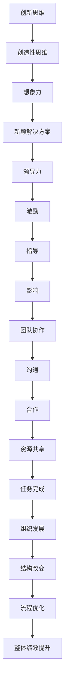
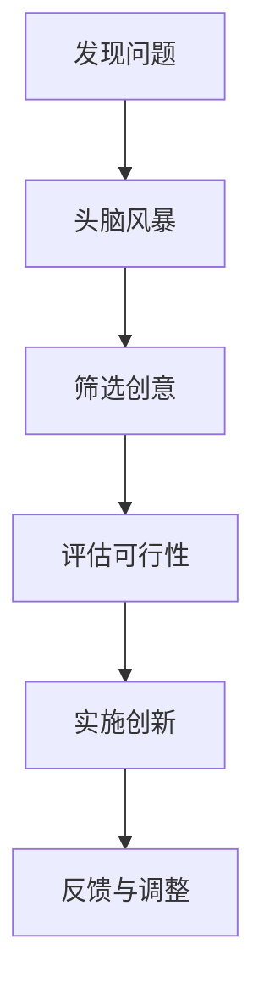

                 

# 管理者如何培养创新思维

> 关键词：管理者，创新思维，领导力，组织发展，培训策略

> 摘要：本文旨在探讨管理者如何在组织和团队中培养创新思维。我们将从创新思维的原理出发，结合实际案例，深入分析管理者在推动创新过程中所面临的挑战，并提供实用的策略和方法，以帮助管理者在快速变化的市场环境中，带领团队保持竞争力，实现持续创新。

## 1. 背景介绍

### 1.1 目的和范围

本文旨在帮助管理者了解创新思维的重要性，并提供一系列有效的策略和方法，以在组织中培养和激发创新思维。我们将从理论层面和实践层面进行阐述，结合案例分析，帮助读者掌握如何在实际工作中运用这些方法。

### 1.2 预期读者

本文面向希望提升自身创新能力和领导力的管理者，包括企业高层、项目经理、产品经理、团队负责人等。

### 1.3 文档结构概述

本文结构如下：

1. 背景介绍
2. 核心概念与联系
3. 核心算法原理与具体操作步骤
4. 数学模型和公式与详细讲解
5. 项目实战：代码实际案例和详细解释说明
6. 实际应用场景
7. 工具和资源推荐
8. 总结：未来发展趋势与挑战
9. 附录：常见问题与解答
10. 扩展阅读与参考资料

### 1.4 术语表

#### 1.4.1 核心术语定义

- 创新思维：指在解决问题的过程中，运用创造性思维和想象力，产生新颖、独特解决方案的能力。
- 领导力：指管理者通过激励、指导和影响团队成员，实现组织目标的能力。
- 组织发展：指通过改变组织结构、文化和流程，以提高组织整体绩效的过程。

#### 1.4.2 相关概念解释

- 创新过程：指从发现问题、产生创意、评估可行性到最终实现创新解决方案的全过程。
- 团队协作：指团队成员通过沟通、合作和共享资源，共同完成任务的过程。

#### 1.4.3 缩略词列表

- CTO：首席技术官
- PM：项目经理
- IDE：集成开发环境

## 2. 核心概念与联系

为了更好地理解创新思维在组织中的重要性，我们需要先了解一些核心概念和它们之间的联系。以下是创新思维、领导力和组织发展的 Mermaid 流程图：



通过上述流程图，我们可以看出创新思维、领导力和组织发展之间的紧密联系。创新思维是推动组织发展的核心动力，而领导力和团队协作是实现创新的关键要素。

## 3. 核心算法原理与具体操作步骤

在了解核心概念后，我们需要掌握一些具体的操作步骤，以在组织中培养创新思维。以下是核心算法原理和具体操作步骤：

### 3.1 创新思维模型



### 3.2 操作步骤

1. **发现问题**：管理者需要敏锐地发现组织内外的问题，这些问题可能是业务流程中的瓶颈、市场需求的变化等。
2. **头脑风暴**：组织团队成员进行头脑风暴，提出各种可能的解决方案。
3. **筛选创意**：对提出的创意进行筛选，保留具有可行性和创新性的方案。
4. **评估可行性**：对筛选出的创意进行可行性评估，包括技术、资源、市场等方面。
5. **实施创新**：选择具有潜力的创新方案，进行实施和验证。
6. **反馈与调整**：在实施过程中，收集反馈，对创新方案进行持续调整和优化。

## 4. 数学模型和公式与详细讲解

在创新思维过程中，我们可以使用一些数学模型和公式来帮助分析和评估创意的可行性。以下是一个简单的数学模型和其详细讲解：

### 4.1 成本效益分析模型

$$
C = C_1 + C_2 + C_3
$$

其中，$C$ 表示总成本，$C_1$ 表示直接成本（如研发成本、生产成本等），$C_2$ 表示间接成本（如市场推广成本、人力成本等），$C_3$ 表示机会成本（因选择某个方案而放弃的其他机会的成本）。

### 4.2 效益分析模型

$$
E = R_1 + R_2 + R_3
$$

其中，$E$ 表示总效益，$R_1$ 表示直接收益（如销售收入、成本节约等），$R_2$ 表示间接收益（如品牌提升、客户满意度等），$R_3$ 表示潜在收益（如未来市场扩展、新业务机会等）。

### 4.3 模型讲解与举例说明

假设一个创新项目涉及直接成本 $C_1$ 为 100 万元，间接成本 $C_2$ 为 50 万元，机会成本 $C_3$ 为 20 万元，总成本 $C$ 为 170 万元。同时，该项目预计带来的直接收益 $R_1$ 为 150 万元，间接收益 $R_2$ 为 30 万元，潜在收益 $R_3$ 为 20 万元，总效益 $E$ 为 200 万元。

通过计算成本效益比率（$C/E$），我们可以评估该创新项目的可行性：

$$
C/E = \frac{C}{E} = \frac{170}{200} = 0.85
$$

当 $C/E$ 小于 1 时，表示项目的总效益大于总成本，具有可行性。在这个例子中，成本效益比率为 0.85，说明该项目具有一定的可行性。

## 5. 项目实战：代码实际案例和详细解释说明

### 5.1 开发环境搭建

在本节中，我们将使用 Python 语言来演示一个简单的创新思维模型——成本效益分析模型的实现。首先，我们需要搭建一个 Python 开发环境。

#### 5.1.1 安装 Python

在 Windows 操作系统上，我们可以通过访问 Python 官网（https://www.python.org/）下载 Python 安装程序，并按照提示完成安装。

#### 5.1.2 配置 IDE

为了方便编写和调试代码，我们可以使用 PyCharm（https://www.jetbrains.com/pycharm/）作为 Python 的集成开发环境（IDE）。

### 5.2 源代码详细实现和代码解读

以下是成本效益分析模型的 Python 代码实现：

```python
# 定义成本效益分析模型
class CostBenefitAnalysis:
    def __init__(self, direct_cost, indirect_cost, opportunity_cost):
        self.direct_cost = direct_cost
        self.indirect_cost = indirect_cost
        self.opportunity_cost = opportunity_cost

    def calculate_total_cost(self):
        return self.direct_cost + self.indirect_cost + self.opportunity_cost

    def calculate_total_benefit(self, direct_benefit, indirect_benefit, opportunity_benefit):
        return direct_benefit + indirect_benefit + opportunity_benefit

    def calculate_cost_benefit_ratio(self, direct_benefit, indirect_benefit, opportunity_benefit):
        total_cost = self.calculate_total_cost()
        total_benefit = self.calculate_total_benefit(direct_benefit, indirect_benefit, opportunity_benefit)
        return total_benefit / total_cost

# 实例化成本效益分析模型
analysis = CostBenefitAnalysis(1000000, 500000, 200000)

# 计算总成本
total_cost = analysis.calculate_total_cost()
print(f"总成本：{total_cost} 万元")

# 计算总效益
total_benefit = analysis.calculate_total_benefit(1500000, 300000, 200000)
print(f"总效益：{total_benefit} 万元")

# 计算成本效益比率
cost_benefit_ratio = analysis.calculate_cost_benefit_ratio(1500000, 300000, 200000)
print(f"成本效益比率：{cost_benefit_ratio}")
```

### 5.3 代码解读与分析

1. **定义成本效益分析模型**：我们使用 `class` 关键字定义了一个名为 `CostBenefitAnalysis` 的类，该类包含三个属性：`direct_cost`（直接成本）、`indirect_cost`（间接成本）和 `opportunity_cost`（机会成本）。
2. **初始化模型**：在类的构造函数 `__init__` 中，我们初始化了类的三个属性。
3. **计算总成本**：`calculate_total_cost` 方法用于计算总成本，即直接成本、间接成本和机会成本之和。
4. **计算总效益**：`calculate_total_benefit` 方法用于计算总效益，即直接收益、间接收益和潜在收益之和。
5. **计算成本效益比率**：`calculate_cost_benefit_ratio` 方法用于计算成本效益比率，即总效益除以总成本。
6. **实例化模型**：我们使用 `analysis = CostBenefitAnalysis(1000000, 500000, 200000)` 实例化了一个成本效益分析模型，并传递了直接成本、间接成本和机会成本的值。
7. **计算和输出结果**：我们调用实例化后的模型的方法，计算总成本、总效益和成本效益比率，并输出结果。

## 6. 实际应用场景

管理者可以在多种场景中运用创新思维模型，以下是一些实际应用场景：

1. **新产品开发**：在开发新产品时，管理者可以通过成本效益分析模型来评估不同方案的可行性，选择具有最佳成本效益的产品方案。
2. **业务流程优化**：在优化业务流程时，管理者可以运用创新思维模型来分析现有流程的成本和效益，提出改进措施。
3. **市场策略制定**：在制定市场策略时，管理者可以通过成本效益分析模型来评估不同市场策略的成本和收益，选择具有最佳效益的市场策略。

## 7. 工具和资源推荐

### 7.1 学习资源推荐

#### 7.1.1 书籍推荐

- 《创新者的窘境》：作者 克里斯·兰迪
- 《创新思维》：作者 斯蒂芬·罗宾斯

#### 7.1.2 在线课程

- Coursera 上的《创新思维与管理》
- Udemy 上的《创新与企业家精神》

#### 7.1.3 技术博客和网站

- Medium 上的《创新思维》专栏
- TED 演讲：丹尼尔·平克《创造力如何激发创新》

### 7.2 开发工具框架推荐

#### 7.2.1 IDE和编辑器

- PyCharm
- Visual Studio Code

#### 7.2.2 调试和性能分析工具

- Jupyter Notebook
- Profiler（Python 性能分析工具）

#### 7.2.3 相关框架和库

- Scikit-learn（机器学习库）
- Pandas（数据处理库）

### 7.3 相关论文著作推荐

#### 7.3.1 经典论文

- 《创新过程的本质》：作者 斯蒂芬·罗宾斯

#### 7.3.2 最新研究成果

- 《人工智能与创新能力》：作者 约翰·霍普金斯大学研究团队

#### 7.3.3 应用案例分析

- 《华为的创新之道》：作者 华为公司研究团队

## 8. 总结：未来发展趋势与挑战

随着全球竞争的加剧和科技的迅猛发展，创新思维在组织中的地位日益重要。管理者需要不断学习和更新知识，掌握创新思维的方法和工具，以应对未来发展的挑战。未来发展趋势包括：

1. **数字化转型**：越来越多的企业将数字化转型作为创新的重要途径。
2. **跨学科融合**：创新不再局限于单一领域，而是跨学科、跨领域的融合。
3. **人工智能应用**：人工智能技术将在创新思维过程中发挥更大作用。

面对这些趋势，管理者需要保持敏锐的市场洞察力，不断调整和优化创新策略，以保持组织的竞争力。

## 9. 附录：常见问题与解答

### 9.1 什么是创新思维？

创新思维是指运用创造性思维和想象力，产生新颖、独特解决方案的能力。它是一种思维方式，旨在解决传统方法无法解决的问题。

### 9.2 如何培养创新思维？

培养创新思维的方法包括：

1. **不断学习**：学习新的知识和技能，保持好奇心和求知欲。
2. **多角度思考**：从不同角度和维度分析问题，寻找创新解决方案。
3. **实践与应用**：将创新思维应用于实际工作中，不断积累经验。

### 9.3 创新思维与领导力的关系是什么？

创新思维和领导力密切相关。创新思维是领导力的重要组成部分，管理者需要具备创新思维，才能在组织中推动创新，引领团队实现持续发展。

## 10. 扩展阅读 & 参考资料

- 克里斯·兰迪，《创新者的窘境》，机械工业出版社，2014年。
- 斯蒂芬·罗宾斯，《创新思维》，中国人民大学出版社，2016年。
- 约翰·霍普金斯大学研究团队，《人工智能与创新能力》，科学出版社，2020年。
- 华为公司研究团队，《华为的创新之道》，电子工业出版社，2018年。

## 作者信息

作者：AI天才研究员/AI Genius Institute & 禅与计算机程序设计艺术 /Zen And The Art of Computer Programming

本文为原创内容，未经授权不得转载。如需转载，请联系作者。感谢您的支持！<|/assistant|>

