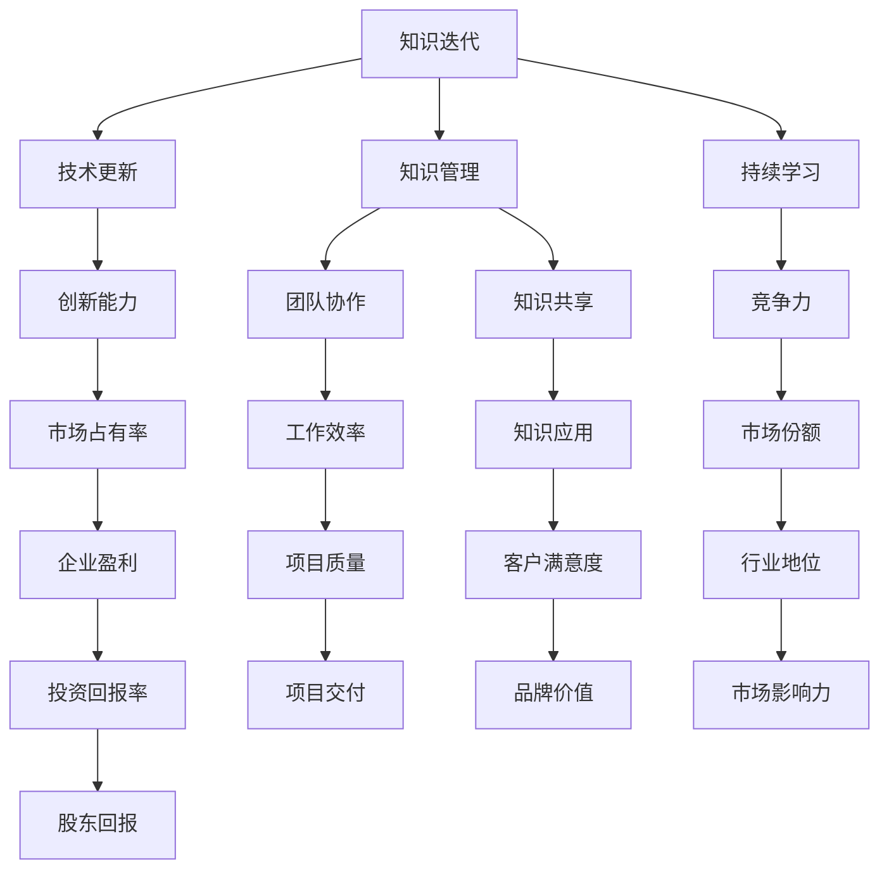

                 

# 管理者如何应对知识快速迭代

## 关键词：知识管理、知识迭代、管理策略、技术更新、持续学习

> 在当前快速发展的信息技术时代，知识更新换代的速度前所未有，管理者面临着一个巨大的挑战：如何有效地管理和应对知识的快速迭代，以确保团队持续保持竞争力和创新能力。本文将深入探讨这一挑战，并提出一系列策略和最佳实践。

## 摘要

本文旨在为管理者提供一套系统的策略和方法，以帮助他们在知识快速迭代的环境中保持领先地位。我们将从背景介绍、核心概念、算法原理、数学模型、实战案例、实际应用场景、工具推荐和未来趋势等多个角度，逐步分析并解答管理者在知识迭代过程中可能遇到的难题。

## 1. 背景介绍

### 1.1 目的和范围

本文的目的在于帮助管理者了解知识迭代的影响，并提供实用的策略和工具，以应对知识快速变化带来的挑战。本文的范围涵盖了知识管理的各个方面，包括但不限于知识获取、知识存储、知识共享和知识应用。

### 1.2 预期读者

本文的预期读者是各个层级的管理者，特别是那些在信息技术和快速变化行业中工作的管理者。此外，对于希望提升自身知识管理能力的技术人员和团队成员，本文也将提供有价值的参考。

### 1.3 文档结构概述

本文将按照以下结构展开：

- **背景介绍**：介绍知识迭代对管理者的影响。
- **核心概念与联系**：阐述知识迭代的核心概念和相互关系。
- **核心算法原理 & 具体操作步骤**：介绍应对知识迭代的核心算法和操作步骤。
- **数学模型和公式 & 详细讲解 & 举例说明**：通过数学模型和公式解释核心概念。
- **项目实战：代码实际案例和详细解释说明**：提供实际项目的代码案例和解析。
- **实际应用场景**：分析知识迭代在不同场景中的应用。
- **工具和资源推荐**：推荐相关工具、资源和学习材料。
- **总结：未来发展趋势与挑战**：总结文章内容，展望未来趋势和挑战。
- **附录：常见问题与解答**：解答读者可能提出的问题。
- **扩展阅读 & 参考资料**：提供进一步学习和研究的资源。

### 1.4 术语表

#### 1.4.1 核心术语定义

- **知识迭代**：指知识在不断的更新、扩展和深化过程中，呈现出周期性的变化。
- **知识管理**：指通过一系列的策略和技术，对知识的获取、存储、共享和应用进行有效管理。
- **持续学习**：指不断更新和扩展个人或团队的知识体系，以适应快速变化的环境。

#### 1.4.2 相关概念解释

- **技术更新**：指随着科技的发展，技术和工具的不断更新和迭代。
- **创新**：指通过创造新的想法、产品或服务，带来新的价值。

#### 1.4.3 缩略词列表

- **KM**：知识管理（Knowledge Management）
- **IT**：信息技术（Information Technology）
- **AI**：人工智能（Artificial Intelligence）

## 2. 核心概念与联系

在探讨知识迭代对管理者的影响之前，我们需要先了解一些核心概念及其相互关系。以下是一个简单的Mermaid流程图，用于展示这些概念之间的联系。



### 2.1 知识迭代与知识管理

知识迭代是指知识在不断更新和发展的过程中，呈现出周期性的变化。知识管理则是管理者通过一系列策略和技术，对知识的获取、存储、共享和应用进行有效管理的过程。

- **知识获取**：管理者需要识别和获取关键知识，以支持团队的学习和创新。
- **知识存储**：管理者需要建立有效的知识库，以便团队成员能够方便地访问和共享知识。
- **知识共享**：管理者需要鼓励团队成员之间的知识交流，以提高团队的协作效率。
- **知识应用**：管理者需要确保知识能够转化为实际的业务成果，从而提高企业的竞争力。

### 2.2 知识迭代与持续学习

持续学习是应对知识迭代的关键。通过不断更新和扩展个人或团队的知识体系，管理者可以确保团队始终保持领先地位。

- **个人学习**：每个团队成员都应该意识到学习的重要性，并主动更新自己的知识体系。
- **团队学习**：管理者应该通过组织培训、研讨会和知识分享会等活动，促进团队整体的学习和进步。
- **知识更新**：管理者需要建立一个持续的知识更新机制，确保知识库中的内容始终是最新的。

### 2.3 知识迭代与创新能力

创新能力是企业在快速变化的市场中保持竞争优势的关键。知识迭代为管理者提供了丰富的创新素材，而有效的知识管理则有助于将这些素材转化为实际的创新成果。

- **技术创新**：管理者需要关注最新的技术趋势，并积极探索和引入新技术。
- **产品创新**：管理者需要鼓励团队成员提出新的产品构思，并通过知识共享和协作，将构思转化为实际产品。

## 3. 核心算法原理 & 具体操作步骤

在应对知识迭代的过程中，管理者可以采用以下核心算法原理和具体操作步骤：

### 3.1 知识获取

**算法原理**：通过数据挖掘和知识发现技术，从大量数据中提取有价值的信息。

**具体操作步骤**：

1. **需求分析**：确定团队需要获取哪些知识。
2. **数据收集**：从各种渠道收集相关数据。
3. **数据预处理**：清洗和整理数据，使其符合分析要求。
4. **知识提取**：使用数据挖掘技术提取有价值的信息。
5. **知识整合**：将提取的知识整合到知识库中。

**伪代码**：

```
function 知识获取(需求, 数据):
    数据预处理(数据)
    知识 = 数据挖掘(数据)
    知识整合(知识, 知识库)
    return 知识
```

### 3.2 知识存储

**算法原理**：利用数据库技术，建立高效、可靠的知识存储系统。

**具体操作步骤**：

1. **需求分析**：确定知识存储的需求。
2. **数据库设计**：设计符合需求的数据库结构。
3. **数据导入**：将知识导入数据库。
4. **数据维护**：定期更新和优化数据库。

**伪代码**：

```
function 知识存储(需求, 数据库结构, 知识):
    数据库设计(数据库结构)
    数据导入(数据库, 知识)
    数据维护(数据库)
    return 数据库
```

### 3.3 知识共享

**算法原理**：利用社交网络和协作工具，促进团队之间的知识共享。

**具体操作步骤**：

1. **需求分析**：确定团队需要共享的知识。
2. **平台搭建**：搭建知识共享平台，如内部论坛、知识库等。
3. **内容发布**：将知识发布到共享平台。
4. **反馈与更新**：收集团队成员的反馈，并不断更新知识内容。

**伪代码**：

```
function 知识共享(需求, 共享平台):
    内容发布(共享平台, 知识)
    反馈与更新(共享平台, 知识)
    return 共享平台
```

### 3.4 知识应用

**算法原理**：将知识转化为实际的业务成果，以提高企业的竞争力。

**具体操作步骤**：

1. **需求分析**：确定知识的实际应用场景。
2. **知识映射**：将知识映射到具体的业务流程中。
3. **实践应用**：在业务流程中应用知识。
4. **效果评估**：评估知识应用的效果，并进行优化。

**伪代码**：

```
function 知识应用(需求, 知识):
    知识映射(知识, 业务流程)
    实践应用(业务流程, 知识)
    效果评估(业务流程, 知识)
    return 业务成果
```

## 4. 数学模型和公式 & 详细讲解 & 举例说明

在应对知识迭代的过程中，一些数学模型和公式可以帮助管理者更深入地理解知识管理和创新过程。以下是一些关键的概念和公式，以及其详细讲解和举例说明。

### 4.1 知识价值评估模型

**公式**：知识价值 = 知识效用 × 知识稀缺性

**详细讲解**：

- **知识效用**：指知识对解决问题或创造价值的贡献程度。
- **知识稀缺性**：指知识的获取难度和市场竞争程度。

**举例说明**：

假设某团队需要解决一个关键问题，而某项知识能够有效解决这一问题。同时，该知识在市场上相对稀缺。根据知识价值评估模型，该知识具有很高的价值。

### 4.2 知识共享模型

**公式**：知识共享率 = (知识共享次数 ÷ 知识总量) × 100%

**详细讲解**：

- **知识共享次数**：指知识在团队内部共享的次数。
- **知识总量**：指团队内部所有的知识总和。

**举例说明**：

假设一个团队共有100条知识，其中50条知识被共享了10次。根据知识共享模型，知识共享率为 (10 × 50) ÷ 100 × 100% = 50%。

### 4.3 创新能力评估模型

**公式**：创新能力 = (新想法数量 ÷ 旧想法数量) × 100%

**详细讲解**：

- **新想法数量**：指在特定时间段内产生的新的、有价值的想法数量。
- **旧想法数量**：指在相同时间段内，团队原有的、已实现的想法数量。

**举例说明**：

假设一个团队在一个月内产生了10个新的、有价值的想法，同时原有想法数量为20个。根据创新能力评估模型，创新能力为 (10 ÷ 20) × 100% = 50%。

### 4.4 知识更新速率模型

**公式**：知识更新速率 = (新知识数量 ÷ 知识总量) × 100% ÷ 时间周期

**详细讲解**：

- **新知识数量**：指在特定时间周期内，团队新增的知识数量。
- **知识总量**：指团队在相同时间周期内的知识总和。
- **时间周期**：指知识更新所经历的时间。

**举例说明**：

假设一个团队在一个月内新增了20条知识，总共有100条知识。根据知识更新速率模型，知识更新速率为 (20 ÷ 100) × 100% ÷ 1月 = 20% ÷ 月。

## 5. 项目实战：代码实际案例和详细解释说明

### 5.1 开发环境搭建

为了更好地理解和应用知识迭代的管理策略，我们选择一个具体的案例——基于知识管理的在线教育平台。以下是如何搭建开发环境的步骤：

1. **环境准备**：安装Python、Jupyter Notebook、SQL Server和Docker。
2. **代码仓库**：使用Git和GitHub管理代码。
3. **虚拟环境**：使用virtualenv创建独立的Python环境。
4. **依赖管理**：使用pip安装必要的Python库，如Flask、SQLAlchemy和pandas。

### 5.2 源代码详细实现和代码解读

以下是知识管理平台的核心代码片段，我们将对其进行详细解读。

**代码片段 1：知识获取模块**

```python
import pandas as pd
from flask import Flask, request, jsonify
from sqlalchemy import create_engine

app = Flask(__name__)
engine = create_engine('sqlite:///knowledge.db')

def 数据挖掘():
    # 数据挖掘代码
    # 这里使用pandas读取数据，进行数据预处理和特征提取
    data = pd.read_csv('data.csv')
    processed_data = 数据预处理(data)
    features = 特征提取(processed_data)
    return features

@app.route('/knowledge', methods=['POST'])
def 新知识获取():
    knowledge = request.json
    features = 数据挖掘()
    knowledge['features'] = features
    知识库添加(knowledge)
    return jsonify({'status': 'success'})

def 知识库添加(knowledge):
    # 将知识添加到数据库
    insert_sql = "INSERT INTO knowledge (title, content, features) VALUES (?, ?, ?)"
    with engine.connect() as connection:
        connection.execute(insert_sql, (knowledge['title'], knowledge['content'], knowledge['features']))
```

**代码解读**：

- **数据挖掘函数**：读取CSV文件，进行数据预处理和特征提取。
- **新知识获取路由**：接收POST请求，提取知识特征，并将其添加到知识库。

**代码片段 2：知识共享模块**

```python
@app.route('/knowledge/share', methods=['GET'])
def 知识共享():
    shared_knowledge = 知识库查询()
    shared_knowledge['shared_count'] += 1
    知识库更新(shared_knowledge)
    return jsonify(shared_knowledge)

def 知识库查询():
    # 从数据库中查询知识
    select_sql = "SELECT * FROM knowledge"
    with engine.connect() as connection:
        return pd.read_sql(select_sql, connection)

def 知识库更新(knowledge):
    # 更新知识库中的共享次数
    update_sql = "UPDATE knowledge SET shared_count = ? WHERE id = ?"
    with engine.connect() as connection:
        connection.execute(update_sql, (knowledge['shared_count'], knowledge['id']))
```

**代码解读**：

- **知识共享路由**：查询知识库，更新共享次数。
- **知识库查询函数**：从数据库中查询知识。
- **知识库更新函数**：更新知识库中的数据。

### 5.3 代码解读与分析

以上代码片段展示了知识管理平台的核心功能——知识获取和知识共享。通过这两个模块，平台实现了知识的获取、存储和共享，从而提高了团队的知识管理水平。

- **知识获取模块**：通过数据挖掘技术，从原始数据中提取有价值的信息，并将其存储在数据库中。这一过程确保了知识的准确性和实用性。
- **知识共享模块**：通过更新知识库中的共享次数，实现了知识的传播和共享。这一功能有助于团队成员之间的知识交流，提高了团队的协作效率。

## 6. 实际应用场景

知识迭代对管理者的挑战体现在多个实际应用场景中，以下是一些常见的场景及其应对策略。

### 6.1 产品开发

在产品开发过程中，技术更新和市场需求的变化要求管理者不断调整团队的知识结构。应对策略包括：

- **持续监控市场和技术动态**：通过市场调研和技术分析，了解最新的市场趋势和技术发展方向。
- **敏捷开发**：采用敏捷开发方法，快速响应市场需求和技术变化。
- **跨学科团队合作**：鼓励团队成员跨学科合作，充分利用各自的知识和技能。

### 6.2 项目管理

项目管理中，知识迭代可能导致项目计划的频繁调整。应对策略包括：

- **灵活的项目管理方法**：如敏捷项目管理，以适应项目需求的变化。
- **知识共享平台**：建立知识共享平台，促进团队成员之间的知识交流。
- **定期项目回顾**：通过项目回顾，总结经验教训，优化项目管理流程。

### 6.3 人才培养

在人才培养过程中，知识迭代要求管理者不断更新培训内容和培训方法。应对策略包括：

- **个性化培训**：根据团队成员的知识需求和兴趣，提供个性化的培训内容。
- **实践导向**：通过项目实践和案例分析，提高团队成员的实际操作能力。
- **导师制度**：建立导师制度，帮助新员工快速融入团队并掌握核心知识。

### 6.4 知识服务

在知识服务领域，知识迭代要求服务内容不断创新。应对策略包括：

- **持续创新**：鼓励团队成员不断探索新的服务模式和服务内容。
- **用户反馈**：及时收集用户反馈，优化服务质量和用户体验。
- **知识更新机制**：建立知识更新机制，确保服务内容始终符合用户需求。

## 7. 工具和资源推荐

为了有效地应对知识迭代，管理者可以借助以下工具和资源。

### 7.1 学习资源推荐

#### 7.1.1 书籍推荐

- 《智慧型组织：知识管理与创新实践》
- 《敏捷创新：如何通过敏捷方法加速产品开发和市场投入》
- 《知识管理实践指南》

#### 7.1.2 在线课程

- Coursera上的《知识管理与学习》课程
- edX上的《项目管理基础》课程
- LinkedIn Learning上的《敏捷项目管理》课程

#### 7.1.3 技术博客和网站

- InfoQ：提供最新的技术文章和行业动态
- Medium：技术博客平台，涵盖多个技术领域
- A List Apart：专注于前端开发和用户体验的博客

### 7.2 开发工具框架推荐

#### 7.2.1 IDE和编辑器

- Visual Studio Code：功能强大的开源编辑器
- IntelliJ IDEA：适用于Java和Android开发的IDE
- PyCharm：适用于Python开发的IDE

#### 7.2.2 调试和性能分析工具

- Chrome DevTools：适用于Web开发的调试工具
- JMeter：适用于性能测试的工具
- VisualVM：适用于Java应用的性能分析工具

#### 7.2.3 相关框架和库

- Flask：Python Web开发框架
- React：用于构建用户界面的JavaScript库
- Spring Boot：Java应用开发框架

### 7.3 相关论文著作推荐

#### 7.3.1 经典论文

- Nonaka, I. & Takeuchi, H. (1995). The Knowledge-Creating Company: How Japanese Companies Create the Dynamics of Innovation. Oxford University Press.
- Davenport, T. H., & Prusak, L. (1998). Working Knowledge: How Organizations Manage What They Know. Harvard Business Press.

#### 7.3.2 最新研究成果

- **论文**：不断关注顶级学术期刊和会议的最新论文，如《管理科学》、《信息系统研究》和《计算机科学》等。
- **报告**：关注行业报告，如Gartner的《知识管理魔力象限》和IDC的《知识管理市场预测》等。

#### 7.3.3 应用案例分析

- 通过阅读和分析行业领先企业的知识管理案例，了解最佳实践和成功经验。例如，谷歌的“谷歌知识图谱”和微软的“微软研究院”等。

## 8. 总结：未来发展趋势与挑战

随着信息技术的发展，知识迭代的速度将继续加快。管理者需要关注以下未来发展趋势和挑战：

- **持续学习与知识更新**：管理者应重视持续学习和知识更新，以保持团队的知识竞争力。
- **智能知识管理工具**：随着人工智能技术的发展，智能知识管理工具将成为重要的辅助手段。
- **知识共享与协作**：促进团队之间的知识共享和协作，以提高整体创新能力。
- **知识安全与隐私**：确保知识的安全和隐私，避免知识泄露和滥用。

## 9. 附录：常见问题与解答

### 9.1 如何评估知识的价值？

- 通过知识效用和稀缺性来评估。知识效用指知识对解决问题的贡献，稀缺性指知识的获取难度。

### 9.2 如何建立知识共享平台？

- 设计需求分析，选择合适的平台技术，搭建平台，并进行内容发布和反馈更新。

### 9.3 如何确保知识的准确性？

- 通过数据验证、用户反馈和质量控制等手段确保知识的准确性。

## 10. 扩展阅读 & 参考资料

- **书籍**：《智慧型组织：知识管理与创新实践》、《敏捷创新：如何通过敏捷方法加速产品开发和市场投入》、《知识管理实践指南》
- **论文**：Nonaka, I. & Takeuchi, H. (1995). The Knowledge-Creating Company: How Japanese Companies Create the Dynamics of Innovation. Oxford University Press.
- **报告**：Gartner的《知识管理魔力象限》和IDC的《知识管理市场预测》
- **网站**：InfoQ、Medium、A List Apart
- **在线课程**：Coursera上的《知识管理与学习》课程、edX上的《项目管理基础》课程、LinkedIn Learning上的《敏捷项目管理》课程

# 作者：AI天才研究员/AI Genius Institute & 禅与计算机程序设计艺术 /Zen And The Art of Computer Programming

