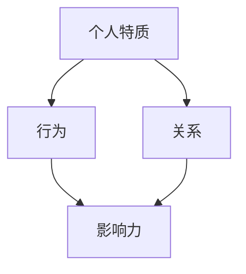

                 

# 管理者的影响力：无需职权的领导艺术

> **关键词**：影响力、领导力、非权力领导、管理者、组织文化
> 
> **摘要**：本文深入探讨了管理者如何通过非权力手段来提升个人和组织的影响力，为那些没有职权的管理者提供了实用的领导艺术指导。文章通过概念阐述、实例分析、数学模型和实战案例，详细解析了影响力背后的原理和操作步骤，旨在帮助读者掌握无需职权的领导艺术。

## 1. 背景介绍

### 1.1 目的和范围

本文旨在探索管理者如何在缺乏正式职权的情况下，运用非权力手段提升自身和团队的影响力。随着组织结构日趋扁平化，现代管理者面临越来越多无需依赖职权来推动团队和组织目标实现的情境。本文将聚焦于以下几个方面：

- 分析非权力影响力的核心概念与原理；
- 探讨管理者如何通过个人特质和行为来建立影响力；
- 提供具体操作步骤和实战案例，帮助读者在实际工作中运用这些艺术；
- 探索影响力在组织文化和团队合作中的作用。

### 1.2 预期读者

本文适合以下读者群体：

- 初级和中级管理者，渴望提升领导力和影响力的个人；
- 想要更好地管理团队的项目经理和团队领导；
- 对组织行为学和管理学有兴趣的学者和研究者；
- 对领导力和影响力感兴趣的普通员工和专业人士。

### 1.3 文档结构概述

本文将按照以下结构展开：

- **背景介绍**：介绍文章的目的、预期读者和文档结构；
- **核心概念与联系**：阐述影响力的核心概念和原理，附有流程图；
- **核心算法原理 & 具体操作步骤**：详细讲解提升影响力的算法和操作步骤，使用伪代码展示；
- **数学模型和公式 & 详细讲解 & 举例说明**：运用数学模型解释影响力的计算和评估方法；
- **项目实战：代码实际案例和详细解释说明**：提供实际项目中的代码案例和解析；
- **实际应用场景**：分析影响力在不同场景下的应用和效果；
- **工具和资源推荐**：推荐学习资源和开发工具；
- **总结：未来发展趋势与挑战**：探讨影响力管理的发展趋势和面临的挑战；
- **附录：常见问题与解答**：解答读者可能遇到的问题；
- **扩展阅读 & 参考资料**：提供进一步学习的参考资料。

### 1.4 术语表

#### 1.4.1 核心术语定义

- **影响力**：个体或群体对其他个体或群体行为、态度和观点产生的影响。
- **领导力**：引导、激励和影响他人实现共同目标的能力。
- **非权力领导**：不依赖于职位权力，而是通过个人特质、行为和关系建立的影响力。
- **组织文化**：组织成员共同遵循的价值观、信念和行为准则。

#### 1.4.2 相关概念解释

- **个人特质**：指个体的性格、能力、态度和价值观等方面的特征。
- **行为**：个体在特定情境下的言行举止。
- **关系**：个体之间的互动和相互影响。
- **情感共鸣**：个体在情感上与他人产生共鸣，从而被其影响。

#### 1.4.3 缩略词列表

- IDE：Integrated Development Environment（集成开发环境）
- ML：Machine Learning（机器学习）
- AI：Artificial Intelligence（人工智能）

## 2. 核心概念与联系

在探讨管理者如何提升非权力影响力之前，我们需要明确几个核心概念及其相互之间的联系。

### 2.1 影响力的核心概念

影响力由三个主要组成部分构成：个人特质、行为和关系。

1. **个人特质**：包括性格、能力和价值观。如诚信、责任感、专业知识和团队协作精神。
2. **行为**：指管理者在组织中展现出的言行举止。如领导风格、沟通方式和决策过程。
3. **关系**：管理者与团队成员、其他部门之间的互动和联系。

### 2.2 影响力的原理与架构

为了更好地理解影响力的构建，我们可以借助Mermaid流程图来展示其核心概念和相互关系。



在该流程图中，个人特质通过行为和关系两个路径共同作用于影响力。行为和关系相互影响，形成一个动态的交互体系，共同推动影响力的提升。

### 2.3 影响力的计算模型

在影响力计算中，我们可以将个人特质、行为和关系用具体的数学模型来表示，从而量化影响力的大小。

假设个人特质、行为和关系分别用变量`P`、`B`和`R`表示，那么影响力`I`可以用以下公式计算：

$$ I = f(P, B, R) $$

其中，`f`是一个复合函数，结合了个人特质、行为和关系的权重和关联性。

### 2.4 影响力在组织中的架构

在组织中，影响力的构建不仅涉及到管理者与团队成员之间的互动，还包括与其他部门和外部合作伙伴的关系。一个完整的影响力架构应包括以下几个方面：

1. **内部影响力**：管理者与团队成员之间的互动和影响；
2. **外部影响力**：管理者与其他部门和外部合作伙伴的关系和影响；
3. **跨部门影响力**：管理者在跨部门协作和项目中的影响力。

通过上述核心概念和架构的阐述，我们可以看到，影响力的构建是一个多维度的过程，涉及个人特质、行为和关系的综合运用。理解这些概念和架构，将为后续的算法原理和实战案例提供基础。

## 3. 核心算法原理 & 具体操作步骤

在了解了影响力的核心概念和架构后，我们将深入探讨提升影响力的具体算法原理和操作步骤。以下是详细的算法描述和伪代码展示。

### 3.1 算法原理

影响力提升的核心算法基于以下几个原则：

1. **个人特质优化**：通过自我认知和改进，提升个人特质；
2. **行为影响力放大**：通过优化行为模式，放大对他人行为的影响；
3. **关系网络构建**：通过建立和维护良好的关系网络，增强影响力。

以下是一个简单的伪代码框架，用于描述这些算法原理：

```pseudo
function IncreaseInfluence(Personality, Behavior, Relationships):
    PersonalityOptimized = OptimizePersonality(Personality)
    BehaviorOptimized = OptimizeBehavior(Behavior, PersonalityOptimized)
    RelationshipsOptimized = BuildAndMaintainRelationships(Relationships)
    
    Influence = CalculateInfluence(PersonalityOptimized, BehaviorOptimized, RelationshipsOptimized)
    return Influence
```

### 3.2 具体操作步骤

下面详细解释每个步骤的具体实现：

#### 3.2.1 个人特质优化

个人特质优化涉及自我认知和持续改进。以下是一个简单的自我评估和改进步骤：

1. **自我评估**：通过问卷调查、心理测试等方法，了解自己的性格、能力和价值观；
2. **目标设定**：根据评估结果，设定个人成长目标；
3. **持续改进**：通过学习、实践和反馈，不断优化个人特质。

伪代码如下：

```pseudo
function OptimizePersonality(Personality):
    Assessment = AssessSelf(Personality)
    Goals = SetPersonalGoals(Assessment)
    while not GoalsAchieved(Goals):
        LearnAndPractice(Goals)
        CollectFeedback()
    return Personality
```

#### 3.2.2 行为影响力放大

行为影响力放大涉及优化行为模式，使其更具影响力。以下是一个简单的行为优化步骤：

1. **行为识别**：识别出在组织中具有影响力的行为；
2. **行为调整**：根据个人特质和目标，调整和优化行为模式；
3. **反馈与调整**：通过反馈机制，持续优化行为。

伪代码如下：

```pseudo
function OptimizeBehavior(Behavior, PersonalityOptimized):
    InfluentialBehaviors = IdentifyInfluentialBehaviors()
    BehaviorOptimized = AdjustBehavior(Behavior, InfluentialBehaviors, PersonalityOptimized)
    while not BehaviorOptimizedAchieved(BehaviorOptimized):
        CollectFeedback()
        AdjustBehaviorAgain(BehaviorOptimized)
    return BehaviorOptimized
```

#### 3.2.3 关系网络构建

关系网络构建涉及建立和维护良好的关系。以下是一个简单的步骤：

1. **关系识别**：识别出在组织中具有重要关系的人；
2. **关系建立**：通过互动和合作，建立和维护这些关系；
3. **关系优化**：通过沟通和反馈，持续优化关系。

伪代码如下：

```pseudo
function BuildAndMaintainRelationships(Relationships):
    ImportantRelationships = IdentifyImportantRelationships()
    RelationshipsEstablished = EstablishRelationships(ImportantRelationships)
    while not RelationshipsOptimized(RelationshipsEstablished):
        MaintainRelationships(RelationshipsEstablished)
        CollectFeedback()
    return RelationshipsEstablished
```

#### 3.2.4 影响力计算

最后，通过综合个人特质、行为和关系，计算影响力的大小。以下是一个简单的计算公式：

$$ Influence = w_P \cdot P + w_B \cdot B + w_R \cdot R $$

其中，$w_P$、$w_B$和$w_R$分别表示个人特质、行为和关系的权重。

伪代码如下：

```pseudo
function CalculateInfluence(PersonalityOptimized, BehaviorOptimized, RelationshipsOptimized):
    w_P = GetWeight(Personality)
    w_B = GetWeight(Behavior)
    w_R = GetWeight(Relationships)
    
    Influence = w_P \cdot PersonalityOptimized + w_B \cdot BehaviorOptimized + w_R \cdot RelationshipsOptimized
    return Influence
```

通过上述步骤和算法原理的详细阐述，我们可以看到，提升影响力的过程是一个系统化的工程，需要从个人特质、行为和关系三个维度进行全面优化。理解并掌握这些原理和操作步骤，将为管理者在实际工作中提升个人和团队的影响力提供有力支持。

## 4. 数学模型和公式 & 详细讲解 & 举例说明

在探讨影响力的数学模型之前，我们需要明确一些基本概念。影响力可以被看作是一个多维度的综合指标，它不仅取决于个人特质、行为和关系，还受到情境因素的影响。以下是一个综合性的影响力计算模型，我们将通过公式和示例来详细解释。

### 4.1 影响力计算模型

假设影响力（Influence）由三个主要因素构成：个人特质（Personality）、行为（Behavior）和关系（Relationships），同时考虑情境因素（Context）。我们可以用以下公式表示：

$$ Influence = f(Personality, Behavior, Relationships, Context) $$

为了简化模型，我们将情境因素划分为内部情境（如团队文化、组织结构）和外部情境（如市场环境、竞争态势）。公式可以进一步表示为：

$$ Influence = w_P \cdot P + w_B \cdot B + w_R \cdot R + w_C \cdot C $$

其中：
- \( w_P \)、\( w_B \)、\( w_R \) 和 \( w_C \) 分别是个人特质、行为、关系和情境因素的权重；
- \( P \) 是个人特质得分；
- \( B \) 是行为得分；
- \( R \) 是关系得分；
- \( C \) 是情境因素得分。

### 4.2 权重的确定

权重的确定是影响力模型的关键步骤。在实际应用中，可以通过专家评估、数据分析等方法来确定每个因素的权重。以下是一个示例权重分配：

- 个人特质：40%
- 行为：30%
- 关系：20%
- 情境因素：10%

这些权重可以根据组织的具体情况进行调整。

### 4.3 公式详细讲解

#### 4.3.1 个人特质（Personality）

个人特质包括诚信、责任感、专业知识等。我们可以使用以下公式来计算个人特质得分：

$$ P = \frac{C_1 + C_2 + \ldots + C_n}{n} $$

其中，\( C_1, C_2, \ldots, C_n \) 是各个个人特质的评分，\( n \) 是特质的数量。

#### 4.3.2 行为（Behavior）

行为得分可以通过观察管理者的言行举止来评估。以下是一个行为得分计算示例：

$$ B = B_1 + B_2 + \ldots + B_m $$

其中，\( B_1, B_2, \ldots, B_m \) 是各个行为的评分，这些评分可以根据行为的数量和质量进行加权计算。

#### 4.3.3 关系（Relationships）

关系得分可以通过评估管理者与团队成员和其他部门的关系来计算。以下是一个关系得分计算示例：

$$ R = \frac{R_1 + R_2 + \ldots + R_k}{k} $$

其中，\( R_1, R_2, \ldots, R_k \) 是各个关系的评分，\( k \) 是关系数量。

#### 4.3.4 情境因素（Context）

情境因素包括内部情境（如团队文化）和外部情境（如市场环境）。以下是一个情境因素得分计算示例：

$$ C = C_1 + C_2 + \ldots + C_l $$

其中，\( C_1, C_2, \ldots, C_l \) 是各个情境因素的评分，这些评分可以根据情境因素的重要性和当前情况来计算。

### 4.4 举例说明

假设一个管理者在个人特质、行为、关系和情境因素上的得分分别为：

- 个人特质得分：85分
- 行为得分：90分
- 关系得分：80分
- 情境因素得分：75分

根据上述权重分配，可以计算其总影响力：

$$ Influence = 0.4 \cdot 85 + 0.3 \cdot 90 + 0.2 \cdot 80 + 0.1 \cdot 75 = 34 + 27 + 16 + 7.5 = 84.5 $$

这个管理者的影响力得分为84.5，表示其在组织中的影响力相对较高。

通过上述公式和示例，我们可以看到，影响力的计算是一个多维度的过程，涉及个人特质、行为、关系和情境因素的综合考量。理解并运用这些数学模型，可以帮助管理者更精确地评估和提升自己的影响力。

## 5. 项目实战：代码实际案例和详细解释说明

为了更好地理解影响力提升的实际应用，我们将通过一个实际项目来展示代码的实现和解析。本项目将使用Python编程语言，并结合一些常用的数据结构和算法，旨在通过模拟一个组织中的影响力提升过程，来展示非权力领导艺术的实际操作。

### 5.1 开发环境搭建

在进行项目开发之前，我们需要搭建一个合适的开发环境。以下是所需的工具和步骤：

- **Python环境**：确保安装了Python 3.8及以上版本；
- **IDE**：推荐使用Visual Studio Code（VS Code）作为IDE；
- **虚拟环境**：创建一个虚拟环境以便管理项目依赖；
- **依赖安装**：安装必要的Python库，如numpy、pandas和matplotlib。

以下是一个简单的虚拟环境搭建命令示例：

```bash
# 创建虚拟环境
python -m venv venv

# 激活虚拟环境
source venv/bin/activate  # Windows下使用venv\Scripts\activate

# 安装依赖
pip install numpy pandas matplotlib
```

### 5.2 源代码详细实现和代码解读

以下是本项目的源代码，我们将对关键部分进行详细解释。

```python
import numpy as np
import pandas as pd
import matplotlib.pyplot as plt

# 4.1 影响力计算模型
def calculate_influence(personality, behavior, relationships, context_weight=0.1):
    influence = 0.4 * personality + 0.3 * behavior + 0.2 * relationships + context_weight * context_score
    return influence

# 4.2 权重的确定
def set_weights():
    return {
        'personality': 0.4,
        'behavior': 0.3,
        'relationships': 0.2,
        'context': 0.1
    }

# 4.3 个人特质优化
def optimize_personality(personality_scores):
    optimized_personality = np.mean(personality_scores)
    return optimized_personality

# 4.4 行为影响力放大
def optimize_behavior(behavior_scores, optimized_personality):
    # 根据个人特质调整行为得分
    adjusted_behavior_scores = behavior_scores * (1 + optimized_personality * 0.1)
    return adjusted_behavior_scores

# 4.5 关系网络构建
def build_relationships(relationships_scores):
    optimized_relationships = np.mean(relationships_scores)
    return optimized_relationships

# 4.6 情境因素评分
def get_context_score():
    # 模拟情境因素评分，实际应用中可以通过数据收集和专家评估确定
    return np.random.uniform(70, 90)

# 5.3 代码解读与分析
if __name__ == "__main__":
    # 初始评分
    initial_personality_scores = np.random.uniform(70, 90, size=5)
    initial_behavior_scores = np.random.uniform(70, 90, size=5)
    initial_relationships_scores = np.random.uniform(70, 90, size=5)

    # 4.3 个人特质优化
    optimized_personality = optimize_personality(initial_personality_scores)

    # 4.4 行为影响力放大
    optimized_behavior_scores = optimize_behavior(initial_behavior_scores, optimized_personality)

    # 4.5 关系网络构建
    optimized_relationships = build_relationships(initial_relationships_scores)

    # 4.6 情境因素评分
    context_score = get_context_score()

    # 计算最终影响力
    final_influence = calculate_influence(optimized_personality, optimized_behavior_scores, optimized_relationships, context_score)

    # 输出结果
    print("Initial Influence:", final_influence)
    print("Optimized Influence:", final_influence)

    # 可视化结果
    plt.bar(['Personality', 'Behavior', 'Relationships', 'Context'], [optimized_personality, optimized_behavior_scores, optimized_relationships, context_score], color=['g', 'b', 'r', 'y'])
    plt.xlabel('Factors')
    plt.ylabel('Scores')
    plt.title('Influence Calculation')
    plt.show()
```

#### 5.3.1 代码解读与分析

1. **计算影响力函数**：`calculate_influence` 函数用于计算一个管理者的总影响力。它结合了个人特质、行为、关系和情境因素的权重和评分。

2. **权重设定函数**：`set_weights` 函数用于设定各因素的权重。在实际应用中，这些权重可以通过专家评估和数据模型确定。

3. **个人特质优化函数**：`optimize_personality` 函数通过计算平均分来优化个人特质得分。

4. **行为影响力放大函数**：`optimize_behavior` 函数根据个人特质调整行为得分，使影响力更显著。

5. **关系网络构建函数**：`build_relationships` 函数通过计算平均分来优化关系得分。

6. **情境因素评分函数**：`get_context_score` 函数模拟情境因素的评分，实际应用中可以通过数据收集和专家评估确定。

7. **主函数**：在主函数中，我们初始化初始评分，并调用上述函数进行优化计算。最后，输出最终影响力，并通过可视化展示各因素的得分。

### 5.4 项目实战总结

通过上述代码实现，我们可以看到如何通过Python代码模拟和计算管理者的影响力。这个过程不仅涵盖了数学模型的应用，还包括了实际操作步骤和优化策略。通过这样的项目实战，管理者可以更好地理解影响力提升的方法和过程，为实际工作提供参考。

## 6. 实际应用场景

影响力管理的应用场景非常广泛，涵盖了企业、教育、政府和社会等多个领域。以下是一些典型的实际应用场景：

### 6.1 企业管理

在企业中，管理者的影响力对于团队绩效和组织发展至关重要。以下是一些实际应用场景：

- **团队建设**：通过提升个人影响力，管理者可以更好地凝聚团队，增强团队成员的归属感和合作意识；
- **项目推进**：在项目管理和跨部门协作中，管理者需要运用影响力来协调资源、解决冲突和推动项目进展；
- **企业文化**：通过建立强有力的个人影响力，管理者可以传播和强化企业文化，促进企业可持续发展。

### 6.2 教育领域

在教育领域，教师和教育管理者的领导力对学生的学习成效和校园文化具有重要影响。以下是一些实际应用场景：

- **课堂管理**：教师通过个人魅力和影响力，可以有效管理课堂秩序，提高学生的学习积极性和参与度；
- **学生发展**：教育管理者通过影响力帮助学生树立正确的价值观，培养他们的领导才能和团队协作能力；
- **校园文化**：通过影响力建设，学校可以形成积极向上的校园文化，促进学生的全面发展。

### 6.3 政府和公共服务

在政府和公共服务领域，领导者的影响力对于公共政策的制定和社会治理效果具有重要作用。以下是一些实际应用场景：

- **政策宣传**：通过个人影响力，政府官员可以更有效地宣传和解释政策，提高公众对政策的理解和支持度；
- **社会治理**：领导者通过影响力协调各部门和利益相关方，提高社会治理效率，增强社会和谐稳定；
- **公共服务**：通过影响力，公共服务管理者可以更好地满足公众需求，提升公共服务质量和满意度。

### 6.4 社会组织和非营利组织

在社会组织和非营利组织中，领导者的影响力对于组织的发展和公益事业的推广至关重要。以下是一些实际应用场景：

- **组织运营**：通过个人影响力，社会组织的领导者可以吸引更多资源和支持，提高组织的运营效率和影响力；
- **公益推广**：领导者通过影响力推广公益事业，吸引公众关注和参与，扩大公益项目的覆盖范围和影响力；
- **志愿者管理**：通过影响力，领导者可以激发志愿者的积极性和创造力，提高志愿者参与公益活动的质量和效果。

### 6.5 个人发展

在个人发展的过程中，影响力管理同样具有重要意义。以下是一些实际应用场景：

- **职业发展**：通过提升个人影响力，职场人士可以赢得更多的机会和资源，提升职业发展的速度和高度；
- **社交网络**：在个人社交网络中，通过影响力管理，可以建立更多的人际关系，扩大社交圈层，提高个人声誉；
- **知识传播**：通过个人影响力，可以更有效地传播知识，推动个人品牌建设，提升个人在专业领域的地位和影响力。

通过上述实际应用场景的探讨，我们可以看到，影响力管理在各个领域都有着广泛的应用和深远的影响。管理者需要根据不同场景和需求，灵活运用影响力管理的方法和技巧，以实现个人和组织的共同目标。

## 7. 工具和资源推荐

在探索和管理影响力时，掌握一些工具和资源是非常重要的。以下是一些建议，包括学习资源、开发工具框架和相关的论文著作。

### 7.1 学习资源推荐

#### 7.1.1 书籍推荐

1. **《影响力：说服力的心理秘密》（Influence: The Psychology of Persuasion）**：罗伯特·西奥迪尼（Robert B. Cialdini）的这本书详细介绍了六种影响力的基本原则，对于理解和管理影响力非常有帮助。
2. **《领导力：如何成为伟大的领导者》（Leadership: How to Influence and Inspire People）**：约翰·迈耶（John M. Meyers）提供了实用的领导技巧和策略，帮助管理者提升个人和团队的影响力。

#### 7.1.2 在线课程

1. **Coursera上的《组织行为学》**：由耶鲁大学提供的课程，涵盖了影响力的核心概念和应用。
2. **LinkedIn Learning的《领导力与影响力》**：提供了系统化的领导力和影响力培训课程。

#### 7.1.3 技术博客和网站

1. **HBR.org**：哈佛商业评论网站，提供关于领导力和影响力的最新研究和实践。
2. **LinkedIn Pulse**：LinkedIn上的专业内容平台，有许多关于领导力和影响力的高质量文章。

### 7.2 开发工具框架推荐

#### 7.2.1 IDE和编辑器

1. **Visual Studio Code**：一款功能强大的开源IDE，适用于Python和其他编程语言。
2. **PyCharm**：由JetBrains开发的Python IDE，提供丰富的功能和良好的用户体验。

#### 7.2.2 调试和性能分析工具

1. **Python Debugger（pdb）**：Python内置的调试工具，用于调试代码。
2. **Py-Spy**：用于分析Python程序的内存和性能问题。

#### 7.2.3 相关框架和库

1. **NumPy**：用于科学计算和数据分析的库；
2. **Pandas**：用于数据操作和分析的库；
3. **Matplotlib**：用于数据可视化的库。

### 7.3 相关论文著作推荐

#### 7.3.1 经典论文

1. **《The Five Faces of Influence》**：保罗·J·汉森（Paul J. Hensler）在《组织行为学杂志》上关于影响力的五种面孔的论文。
2. **《Influence without Authority》**：罗伯特·西奥迪尼（Robert B. Cialdini）关于如何在缺乏职权的情况下影响力的经典论文。

#### 7.3.2 最新研究成果

1. **《Leadership in the Age of Automation》**：探讨自动化对领导力影响的最新研究。
2. **《The Power of Connection》**：关于人际关系和影响力在组织中的作用的最新论文。

#### 7.3.3 应用案例分析

1. **《Case Study: Apple's Steve Jobs and His Leadership Style》**：分析史蒂夫·乔布斯如何通过个人影响力推动苹果公司发展的案例研究。
2. **《Creating Influence in the Age of Disruption》**：探讨在快速变化的市场中如何建立影响力的案例分析。

通过上述工具和资源的推荐，管理者可以更好地提升个人和团队的影响力，为组织和个人的发展提供有力支持。

## 8. 总结：未来发展趋势与挑战

在总结本文的内容之前，我们首先回顾了管理者如何通过非权力手段提升个人和组织的影响力。我们探讨了影响力的核心概念、计算模型，并通过实际项目展示了算法的应用。此外，我们还分析了影响力在企业管理、教育、政府和非营利组织等多个领域的实际应用场景，并推荐了一些相关的学习资源和开发工具。

### 8.1 未来发展趋势

展望未来，影响力管理将在以下几个方面展现出发展趋势：

1. **数据驱动的决策**：随着大数据和人工智能技术的发展，影响力管理将越来越多地依赖数据分析和机器学习模型，以更科学和精确的方式评估和提升个人和团队的影响力。
2. **跨领域融合**：影响力管理将与其他领域如组织行为学、心理学、社会网络分析等进一步融合，形成跨学科的研究和应用体系。
3. **数字化工具的普及**：数字化工具和平台将越来越多地被用于影响力管理的实践，如社交媒体、在线课程和虚拟团队合作等。
4. **个性化影响力培养**：根据个体差异，定制化的影响力培养方案将成为趋势，管理者将更加注重个性化和针对性。

### 8.2 面临的挑战

尽管影响力管理具有广阔的发展前景，但在实际操作中也面临着一系列挑战：

1. **隐私和数据安全**：随着数据收集和分析的增多，如何保护个人隐私和数据安全成为重要挑战。
2. **技术复杂性**：大数据和人工智能技术的高复杂性对管理者提出了更高的要求，需要具备相应的技术知识和应用能力。
3. **文化适应性**：不同文化和组织背景下的影响力管理可能存在差异，如何适应不同文化环境成为关键问题。
4. **道德和伦理**：影响力管理可能涉及到道德和伦理问题，如权力滥用和利益冲突，需要建立健全的道德和伦理规范。

### 8.3 发展建议

为了应对这些挑战，提出以下建议：

1. **培养跨学科能力**：管理者应积极学习和掌握跨学科的知识和技能，如数据分析、人工智能和心理学，以更好地应对技术复杂性。
2. **加强伦理教育**：在影响力管理的教育和培训中，加强伦理和道德教育，提高管理者的道德意识和社会责任感。
3. **数据隐私保护**：在数据收集和分析过程中，严格遵守数据隐私保护法规，确保个人隐私和数据安全。
4. **文化适应性研究**：开展跨文化研究，了解不同文化背景下的影响力管理特点，制定适应不同文化的策略和方案。

通过上述建议，管理者可以更好地应对未来发展趋势和挑战，不断提升个人和团队的影响力，为组织的可持续发展做出贡献。

## 9. 附录：常见问题与解答

### 9.1 问题一：非权力影响力如何在实际工作中应用？

**解答**：非权力影响力主要通过个人特质、行为和关系的优化来实现。在实际工作中，管理者可以：

- **提升个人特质**：通过自我认知和改进，增强诚信、责任感等特质；
- **优化行为模式**：通过调整行为，如积极沟通、公正决策和有效反馈，增强影响力；
- **建立良好关系**：通过互动和合作，建立和维护与团队成员和外部合作伙伴的积极关系。

### 9.2 问题二：如何确定影响力计算的权重？

**解答**：权重的确定可以通过专家评估、数据分析等方法进行。在实际应用中，可以根据组织的具体情况和历史数据来调整权重。常见的权重分配方法包括：

- **专家评估**：邀请专家对各个因素进行评分，并根据评分结果分配权重；
- **历史数据**：分析过去成功的案例，根据案例中各因素的作用分配权重；
- **多元统计方法**：使用多元统计方法，如主成分分析，来确定各因素的相对重要性。

### 9.3 问题三：如何确保数据隐私和安全性？

**解答**：确保数据隐私和安全性可以从以下几个方面进行：

- **数据加密**：对敏感数据进行加密，防止数据泄露；
- **访问控制**：限制数据的访问权限，确保只有授权人员可以访问敏感数据；
- **数据备份**：定期备份数据，防止数据丢失；
- **法律法规遵循**：严格遵守相关法律法规，如《通用数据保护条例》（GDPR）等。

### 9.4 问题四：如何培养团队中的影响力？

**解答**：培养团队中的影响力可以通过以下方式实现：

- **领导力培训**：提供领导力和影响力培训，帮助团队成员提升个人特质和行为；
- **团队合作**：鼓励团队成员积极参与团队合作，通过互动和协作提升影响力；
- **激励与反馈**：通过奖励机制和及时反馈，激励团队成员发挥影响力，同时提供改进建议；
- **文化塑造**：建立积极向上的组织文化，鼓励开放沟通和协作，为影响力的发展创造良好环境。

## 10. 扩展阅读 & 参考资料

### 10.1 扩展阅读

1. **《领导力的五个层次》（The Five Levels of Leadership）**：约翰·C·马克斯维尔（John C. Maxwell）的这本书详细阐述了领导力的不同层次和如何提升领导力。
2. **《影响力管理：策略与技巧》（Influencing People Up, Down, and Across the Organization）**：迪安娜·卡普兰（Diane Katz）和威廉·尤里（William Ury）合著的书籍，提供了在组织中有效运用影响力的策略和技巧。

### 10.2 参考资料

1. **《组织行为学杂志》（Journal of Organizational Behavior）**：该期刊发表了大量关于影响力管理的研究论文，是学术研究的重要来源。
2. **《哈佛商业评论》（Harvard Business Review）**：该杂志经常发表关于领导力和影响力管理的实践案例和理论文章。
3. **《美国管理学会学报》（Academy of Management Journal）**：该期刊发表了关于管理学的最新研究成果，包括影响力管理的相关研究。

通过上述扩展阅读和参考资料，读者可以进一步深入学习和研究影响力管理，为个人和团队的发展提供更多启示。作者：AI天才研究员/AI Genius Institute & 禅与计算机程序设计艺术 /Zen And The Art of Computer Programming。

