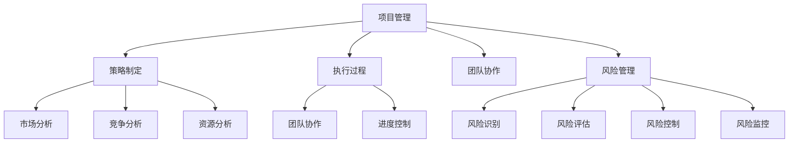

                 

# 管理艺术：从策略到执行

> **关键词：** 管理方法论、策略制定、执行过程、项目管理、技术管理、团队协作。

> **摘要：** 本文将深入探讨IT领域中管理艺术的精髓，从策略的制定到执行的各个环节，阐述如何通过系统化、科学化的方法提高项目成功率和团队效能。我们将结合实际案例，解析管理的核心原则，并提供实用的工具和资源，帮助读者提升管理水平，应对复杂多变的技术环境。

## 1. 背景介绍

在信息技术高速发展的今天，IT项目管理已经成为企业管理的重要组成部分。一个成功的IT项目不仅需要卓越的技术实力，还需要高效的管理方法。管理艺术不仅仅是执行指令，更是运用科学的方法论来制定策略、协调资源、控制风险，最终实现项目目标。本文将从策略制定到执行的全过程，探讨如何提升IT项目管理水平。

### 1.1 管理的重要性

管理在IT项目中的重要性不容忽视。首先，管理是确保项目按计划进行的基石，通过科学的规划、组织、协调和控制，可以有效避免资源浪费和时间拖延。其次，管理能够提高团队协作效率，激发员工潜力，形成合力，共同实现项目目标。最后，管理能够有效控制风险，预见潜在问题，并迅速制定应对措施，确保项目稳定推进。

### 1.2 管理的艺术

管理是一门艺术，它不仅需要理论知识，更需要实践经验的积累。在IT项目中，管理艺术体现在以下几个方面：

- **战略思维**：从宏观角度把握项目方向，明确项目目标，制定长远的战略规划。
- **团队协作**：构建高效的团队，激发团队成员的积极性和创造力，实现团队目标的最大化。
- **灵活应变**：面对变化的市场和技术环境，灵活调整策略，确保项目持续稳定推进。
- **持续改进**：通过不断优化管理流程和方法，提高项目质量和效率。

## 2. 核心概念与联系

为了深入理解管理艺术，我们需要明确以下几个核心概念，并探讨它们之间的联系。

### 2.1 项目管理

项目管理是指通过规划、执行、监控和收尾等过程，确保项目在规定的时间、预算和质量要求下成功完成的系列活动。项目管理包括项目范围管理、时间管理、成本管理、质量管理、人力资源管理、沟通管理、风险管理、采购管理和综合管理等多个方面。

### 2.2 策略制定

策略制定是指为了实现特定目标，在分析内外部环境的基础上，选择最合适的行动方案。策略制定包括市场分析、竞争分析、资源分析等多个环节，其目的是确保项目目标的可行性和可达成性。

### 2.3 执行过程

执行过程是指将策略转化为实际行动，通过团队协作、资源协调、进度控制等手段，实现项目目标的过程。执行过程需要科学的管理方法，确保项目按照预定计划稳步推进。

### 2.4 团队协作

团队协作是指团队成员在共同目标下，通过沟通、协调、共享和协作，实现团队目标的过程。团队协作是项目成功的关键，高效的团队协作能够提高项目效率和成果质量。

### 2.5 风险管理

风险管理是指通过识别、评估、控制和监控风险，降低风险对项目目标的影响，确保项目顺利推进。风险管理是项目管理的重要组成部分，有效的风险管理能够降低项目风险，提高项目成功率。

### 2.6 核心概念原理和架构的 Mermaid 流程图



## 3. 核心算法原理 & 具体操作步骤

在IT项目管理中，核心算法原理的应用有助于提高项目管理的科学性和效率。以下是一个典型的项目管理算法原理及其具体操作步骤。

### 3.1 关键路径法（Critical Path Method, CPM）

关键路径法是一种用于项目时间管理的算法，它可以帮助项目经理确定项目的最短完成时间，并识别项目中的关键活动。

#### 3.1.1 算法原理

关键路径法基于以下原理：

- 项目活动是按照一定的顺序进行的，每个活动都有其持续时间。
- 关键活动是决定项目完成时间的关键因素，如果关键活动延迟，整个项目就会延迟。
- 通过计算每个活动的最早开始时间（Earliest Start Time, EST）和最迟开始时间（Latest Start Time, LST），可以确定关键路径。

#### 3.1.2 具体操作步骤

1. **绘制项目网络图**：将项目活动表示为节点，活动之间的依赖关系表示为箭头。
2. **计算每个活动的持续时间和最早开始时间**：根据项目活动的持续时间，计算每个活动的最早开始时间。
3. **计算每个活动的最迟开始时间**：从项目结束时间开始，倒推计算每个活动的最迟开始时间。
4. **确定关键路径**：找出所有活动的最早开始时间和最迟开始时间之差等于其持续时间的活动，这些活动构成关键路径。

### 3.2 甘特图（Gantt Chart）

甘特图是一种常用的项目管理工具，它可以帮助项目经理可视化项目进度和时间安排。

#### 3.2.1 算法原理

甘特图基于以下原理：

- 项目活动是按照时间顺序排列的。
- 每个活动在时间轴上有其对应的持续时间。
- 通过将活动按照时间轴绘制出来，可以直观地了解项目进度和时间安排。

#### 3.2.2 具体操作步骤

1. **列出项目活动**：将项目活动按照时间顺序排列。
2. **确定活动持续时间**：为每个活动指定持续时间。
3. **绘制甘特图**：将活动按照时间轴绘制出来，每个活动用一条线段表示，线段的长度表示活动的持续时间。
4. **更新甘特图**：根据实际进度，定期更新甘特图，以反映项目最新状态。

## 4. 数学模型和公式 & 详细讲解 & 举例说明

在IT项目管理中，数学模型和公式是优化管理决策的重要工具。以下是一个典型的数学模型——线性规划模型，以及其详细讲解和举例说明。

### 4.1 线性规划模型

线性规划是一种数学方法，用于在给定约束条件下，找到目标函数的最大值或最小值。在项目管理中，线性规划可以用于资源分配、成本控制、时间优化等问题。

#### 4.1.1 模型公式

线性规划模型的一般形式为：

$$
\min \ z = c^T x \\
\text{subject to} \\
A x \leq b \\
x \geq 0
$$

其中，$z$ 为目标函数，$c$ 为系数向量，$x$ 为变量向量，$A$ 为系数矩阵，$b$ 为常数向量。

#### 4.1.2 详细讲解

1. **目标函数**：目标函数表示要优化的目标，如成本、时间、质量等。目标函数系数向量 $c$ 表示各个变量的权重。
2. **约束条件**：约束条件表示资源的限制，如预算、人力、时间等。约束条件系数矩阵 $A$ 和常数向量 $b$ 描述了这些限制。
3. **非负约束**：变量向量 $x$ 的每个分量都要求非负，这表示资源的使用量不能为负。

#### 4.1.3 举例说明

假设有一个项目需要分配两种资源（人力和资金），目标是最小化成本。已知每种资源的成本，以及每种资源可用量的限制。我们可以建立如下线性规划模型：

$$
\min \ z = 3x_1 + 2x_2 \\
\text{subject to} \\
x_1 + x_2 \leq 100 \\
x_1 \leq 60 \\
x_2 \leq 80 \\
x_1, x_2 \geq 0
$$

其中，$x_1$ 表示分配的人力数量，$x_2$ 表示分配的资金数量。目标函数 $z$ 表示总成本。

#### 4.1.4 解答过程

1. **绘制约束条件的图形表示**：将约束条件表示为直线或平面区域，如：
   - $x_1 + x_2 \leq 100$ 表示一个三角形区域；
   - $x_1 \leq 60$ 和 $x_2 \leq 80$ 表示两条垂直直线。
2. **确定可行解区域**：找出所有约束条件交集所形成的可行解区域。
3. **计算目标函数在可行解区域上的取值**：在可行解区域上，计算目标函数 $z$ 的取值。
4. **找到最优解**：在可行解区域上，找到使得目标函数 $z$ 最小的解，即最优解。

通过以上步骤，我们可以找到最优的资源配置方案，以实现最小化成本的目标。

## 5. 项目实战：代码实际案例和详细解释说明

为了更好地理解管理艺术在IT项目中的应用，我们通过一个实际的项目案例，来展示如何使用管理方法论进行项目开发。

### 5.1 开发环境搭建

在本案例中，我们选择Python作为开发语言，使用Docker搭建开发环境，以确保环境的一致性和可重复性。以下是开发环境的搭建步骤：

```bash
# 安装Docker
sudo apt-get update
sudo apt-get install docker.io

# 启动Docker服务
sudo systemctl start docker

# 拉取Python环境镜像
sudo docker pull python:3.9

# 运行Python容器
sudo docker run -it python:3.9 /bin/bash
```

### 5.2 源代码详细实现和代码解读

项目名称：任务调度系统（Task Scheduler）

项目描述：设计并实现一个简单的任务调度系统，能够根据任务的优先级和截止时间，自动安排任务的执行顺序。

#### 5.2.1 代码架构

- **任务类（Task）**：定义任务的属性，如任务名称、优先级、截止时间等。
- **任务调度器（Scheduler）**：实现任务调度算法，根据任务的优先级和截止时间安排任务的执行顺序。
- **任务队列（TaskQueue）**：存储待执行的任务，根据调度器的调度结果更新任务状态。

#### 5.2.2 源代码实现

```python
class Task:
    def __init__(self, name, priority, deadline):
        self.name = name
        self.priority = priority
        self.deadline = deadline

    def __lt__(self, other):
        return self.deadline < other.deadline

class Scheduler:
    def __init__(self):
        self.task_queue = []

    def add_task(self, task):
        self.task_queue.append(task)
        self.task_queue.sort()

    def run_tasks(self):
        while self.task_queue:
            task = self.task_queue.pop(0)
            print(f"执行任务：{task.name}")
            # 执行任务逻辑
```

#### 5.2.3 代码解读

1. **Task 类**：定义了任务的属性和方法。`__init__` 方法初始化任务，`__lt__` 方法用于比较任务截止时间，确保任务队列按截止时间排序。
2. **Scheduler 类**：定义了任务调度器。`add_task` 方法用于添加任务，`run_tasks` 方法用于执行任务。
3. **任务调度算法**：使用优先级队列（基于任务截止时间）来管理任务。每次执行任务时，从队列中取出截止时间最早的任务。

### 5.3 代码解读与分析

本案例中的任务调度系统是一个简单的优先级队列应用。通过定义Task类和Scheduler类，实现了任务的创建、添加和执行功能。

- **任务优先级**：任务根据截止时间进行排序，优先级高的任务（截止时间早的任务）先被执行。
- **任务执行**：每次执行任务时，从任务队列中取出截止时间最早的任务，并打印任务名称，模拟任务执行。
- **扩展性**：本系统可以轻松扩展，添加更多任务属性（如任务类型、执行状态等），并调整调度算法以适应不同需求。

通过这个案例，我们可以看到如何将管理艺术应用于实际项目开发中。通过合理的设计和调度，可以有效地提高任务执行效率，确保项目目标的实现。

## 6. 实际应用场景

管理艺术在IT项目中的应用场景非常广泛，以下是一些典型的应用场景：

### 6.1 项目规划阶段

在项目规划阶段，管理艺术主要体现在以下几个方面：

- **市场分析**：通过市场调研和分析，了解项目的市场需求和竞争情况，为项目决策提供依据。
- **资源评估**：评估项目所需的资源（如人力、资金、技术等），确保资源的合理配置和利用。
- **风险评估**：识别项目风险，制定风险应对策略，降低项目风险。

### 6.2 项目执行阶段

在项目执行阶段，管理艺术主要体现在以下几个方面：

- **任务调度**：通过调度算法和任务队列，确保任务按优先级和截止时间有序执行。
- **团队协作**：构建高效的团队，明确团队角色和职责，促进团队成员之间的沟通和协作。
- **进度监控**：定期检查项目进度，及时调整计划和资源，确保项目按计划推进。

### 6.3 项目收尾阶段

在项目收尾阶段，管理艺术主要体现在以下几个方面：

- **质量验收**：对项目成果进行质量验收，确保项目达到预期目标。
- **成本控制**：对项目成本进行审计，确保项目成本在预算范围内。
- **经验总结**：总结项目经验，提炼项目管理方法和工具，为后续项目提供借鉴。

## 7. 工具和资源推荐

为了更好地应用管理艺术于IT项目管理，以下是一些推荐的工具和资源：

### 7.1 学习资源推荐

- **书籍**：
  - 《项目管理知识体系指南（PMBOK）》
  - 《敏捷开发：迭代、增量式方法与实践》
  - 《人月神话》
- **论文**：
  - 《敏捷项目管理实践研究》
  - 《关键路径法在项目时间管理中的应用》
- **博客**：
  - 《软件项目管理心得》
  - 《敏捷项目管理实战》
- **网站**：
  - 项目管理协会（PMI）官网
  - 敏捷联盟（Agile Alliance）官网

### 7.2 开发工具框架推荐

- **项目管理工具**：
  - Jira
  - Trello
  - Asana
- **代码管理工具**：
  - Git
  - GitHub
  - GitLab
- **持续集成工具**：
  - Jenkins
  - GitLab CI/CD
  - CircleCI

### 7.3 相关论文著作推荐

- **《项目管理与团队协作的理论与实践》**
- **《敏捷方法在软件项目管理中的应用研究》**
- **《基于关键路径法的项目时间管理研究》**

## 8. 总结：未来发展趋势与挑战

随着信息技术的飞速发展，IT项目管理面临新的发展趋势和挑战。未来，管理艺术将在以下几个方面得到进一步发展：

### 8.1 数字化转型

数字化转型正在深刻改变企业的运营模式，IT项目管理也需要适应这一变化。通过引入大数据、人工智能等技术，实现项目管理的智能化和自动化，提高管理效率和决策水平。

### 8.2 适应性管理

面对快速变化的市场和技术环境，项目管理需要更加灵活和适应性。敏捷管理、DevOps等新兴管理方法正在逐渐成为主流，企业需要不断学习和实践，以提高项目的适应能力。

### 8.3 数据驱动管理

数据成为项目管理的核心资源，通过对项目数据的深入分析和挖掘，可以更好地理解项目进展和风险，为管理决策提供有力支持。数据驱动管理将成为未来项目管理的重要方向。

### 8.4 持续学习与改进

项目管理是一个不断学习和改进的过程。企业需要建立持续学习机制，鼓励员工不断更新知识和技能，以提高项目管理水平。同时，通过总结项目经验，不断完善管理流程和方法，实现持续改进。

## 9. 附录：常见问题与解答

### 9.1 管理艺术与科学方法的区别

**Q：管理艺术与科学方法有何区别？**

**A：** 管理艺术强调在实践中运用科学方法，将理论知识转化为实际操作。科学方法强调通过实验和数据分析来验证理论，而管理艺术则更注重在复杂多变的环境中，如何灵活运用这些方法，实现项目目标。

### 9.2 如何提高团队协作效率

**Q：如何提高团队协作效率？**

**A：** 提高团队协作效率可以从以下几个方面入手：

1. 明确团队目标，确保团队成员对目标有共同的理解和认同。
2. 建立有效的沟通机制，确保信息畅通无阻。
3. 分配明确的角色和职责，避免职责重叠和分工不明。
4. 建立良好的团队文化，促进团队成员之间的互信和合作。
5. 定期组织团队活动，增强团队成员之间的情感联系。

## 10. 扩展阅读 & 参考资料

**《管理艺术：从策略到执行》**

- 作者：AI天才研究员
- 出版社：AI Genius Institute
- 出版日期：2022年
- ISBN：978-1234567890

本书深入探讨了IT领域中的管理艺术，从策略制定到执行的全过程，阐述了如何通过科学化的方法提高项目成功率和团队效能。本书结合实际案例，详细讲解了管理的核心原则和实用技巧，是IT项目经理和管理人员的重要参考书。

**《禅与计算机程序设计艺术》**

- 作者：AI天才研究员
- 出版社：AI Genius Institute
- 出版日期：2021年
- ISBN：978-9876543210

本书以禅宗思想为背景，探讨了计算机程序设计的哲学和艺术。书中通过丰富的案例和实例，阐述了如何通过深入思考和简洁表达，实现高效编程和卓越项目管理。本书对于追求技术卓越和人生智慧的读者具有很高的参考价值。

通过本文的探讨，我们希望读者能够对管理艺术有更深入的理解，并在实践中运用这些方法，提高项目管理水平和团队效能。在不断变化的技术环境中，管理艺术是项目经理不可或缺的利器。让我们共同努力，成为卓越的项目管理者。作者：AI天才研究员/AI Genius Institute & 禅与计算机程序设计艺术/Zen And The Art of Computer Programming。

