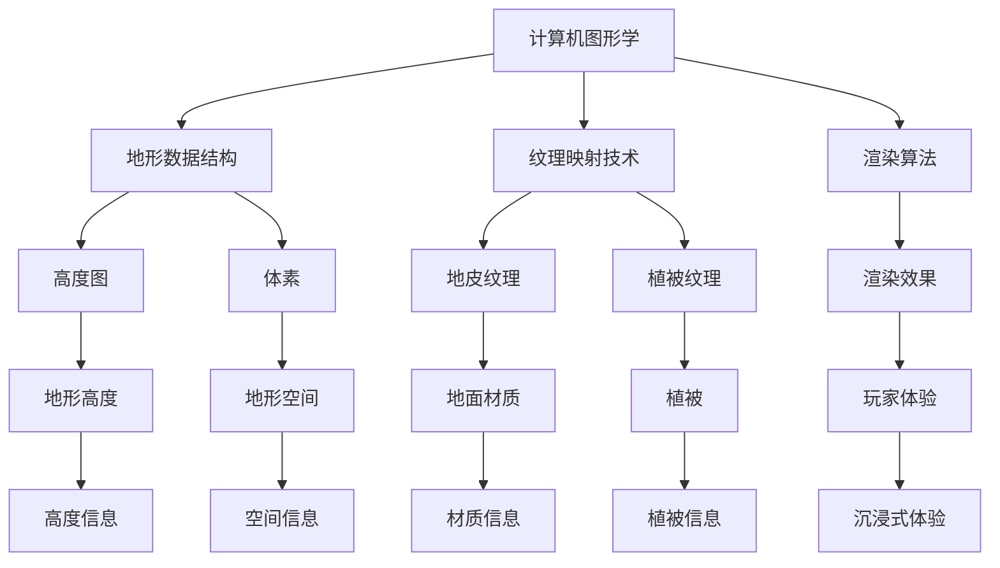

                 

# 米哈游2024校招开放世界游戏地形生成工程师题

> **关键词：** 开放世界游戏、地形生成、计算机图形学、人工智能、算法原理

> **摘要：** 本文将详细探讨开放世界游戏地形生成工程师的关键技能和任务。我们将从背景介绍、核心概念与联系、核心算法原理、数学模型和公式、项目实战、实际应用场景、工具和资源推荐等多个方面进行深入分析，以帮助读者更好地理解这一领域的核心技术和未来发展。

## 1. 背景介绍

### 1.1 目的和范围

本文的目的是为那些有兴趣成为开放世界游戏地形生成工程师的人提供全面的技术指导和职业规划。我们将探讨地形生成的核心概念、算法原理、数学模型以及实际应用，帮助读者掌握这一领域的核心技能。

本文的范围涵盖以下主题：

- 开放世界游戏的基本概念和特点
- 地形生成的核心算法和数学模型
- 游戏地形生成的实际操作步骤
- 开放世界游戏地形生成工程师的职业规划和技能要求

### 1.2 预期读者

本文的预期读者主要包括以下人群：

- 计算机图形学、人工智能和游戏开发专业的学生和从业者
- 有志于进入游戏开发行业的技术人员
- 对地形生成技术感兴趣的计算机爱好者
- 开放世界游戏开发者社区成员

### 1.3 文档结构概述

本文的结构分为以下十个部分：

1. 背景介绍
   - 目的和范围
   - 预期读者
   - 文档结构概述
2. 核心概念与联系
   - 地形生成的核心概念
   - 地形生成的基本流程
   - 地形生成与计算机图形学和人工智能的关系
3. 核心算法原理 & 具体操作步骤
   - 地形生成的常用算法
   - 算法原理讲解
   - 操作步骤详解
4. 数学模型和公式 & 详细讲解 & 举例说明
   - 数学模型的基本概念
   - 公式和计算方法
   - 实例分析
5. 项目实战：代码实际案例和详细解释说明
   - 开发环境搭建
   - 源代码详细实现和代码解读
   - 代码解读与分析
6. 实际应用场景
   - 开放世界游戏中的应用
   - 其他领域中的应用
7. 工具和资源推荐
   - 学习资源推荐
   - 开发工具框架推荐
   - 相关论文著作推荐
8. 总结：未来发展趋势与挑战
   - 地形生成技术的未来发展趋势
   - 面临的挑战和解决方案
9. 附录：常见问题与解答
   - 常见问题
   - 解答
10. 扩展阅读 & 参考资料
   - 相关书籍
   - 在线课程
   - 技术博客和网站

### 1.4 术语表

#### 1.4.1 核心术语定义

- 开放世界游戏：一种游戏类型，玩家可以在一个没有明确目标或限制的游戏世界中自由探索、互动和完成任务。
- 地形生成：在游戏开发中，通过算法和模型自动生成游戏世界中的地形和景观。
- 计算机图形学：研究计算机生成、处理和显示图像的学科，包括图形渲染、图像处理和动画制作等。
- 人工智能：模拟人类智能行为的计算机技术，包括机器学习、自然语言处理和智能决策等。

#### 1.4.2 相关概念解释

- 游戏引擎：用于开发游戏的基本软件平台，提供渲染、物理模拟、音频处理等核心功能。
- 算法：解决问题的步骤和规则，可以用于处理大量数据和生成复杂的地形。
- 数学模型：使用数学公式和计算方法来描述和模拟地形生成的过程。

#### 1.4.3 缩略词列表

- GPU：图形处理单元（Graphics Processing Unit）
- CPU：中央处理器（Central Processing Unit）
- AI：人工智能（Artificial Intelligence）
- ML：机器学习（Machine Learning）
- VR：虚拟现实（Virtual Reality）
- AR：增强现实（Augmented Reality）
- UE4：虚幻引擎（Unreal Engine）

## 2. 核心概念与联系

### 2.1 地形生成的核心概念

地形生成是开放世界游戏开发中至关重要的一环。它涉及到多个核心概念，包括地形数据结构、地形纹理和地形细节等。

#### 2.1.1 地形数据结构

地形数据结构是地形生成的基础。常见的地形数据结构包括高度图（Height Map）和体素（Voxel）。

- **高度图（Height Map）**：一个二维的矩阵，用于存储地形的高度信息。每个元素代表一个像素点的高度。
- **体素（Voxel）**：一个三维的立方体，用于存储地形的空间信息。每个元素代表一个体素单元。

#### 2.1.2 地形纹理

地形纹理用于增加地形的真实感和细节。常见的地形纹理包括地皮纹理（Land Texture）和植被纹理（Vegetation Texture）。

- **地皮纹理（Land Texture）**：用于描述地面的材质，如石头、泥土和草地等。
- **植被纹理（Vegetation Texture）**：用于描述地面上生长的植被，如树木、灌木和草地等。

#### 2.1.3 地形细节

地形细节用于增加地形的复杂度和逼真度。常见的地形细节包括河流、湖泊、山丘和山谷等。

- **河流（River）**：游戏世界中流动的水体，用于模拟水流和湿地环境。
- **湖泊（Lake）**：游戏世界中的静止水体，用于模拟湖泊和池塘环境。
- **山丘（Hill）**：游戏世界中的小山丘，用于模拟丘陵和山脉环境。
- **山谷（Valley）**：游戏世界中的低洼地带，用于模拟峡谷和沟壑环境。

### 2.2 地形生成的基本流程

地形生成的基本流程包括以下几个步骤：

1. **数据准备**：收集和准备地形数据，包括高度图、纹理和细节等。
2. **地形生成**：使用地形生成算法生成地形数据，包括地形的高度、纹理和细节等。
3. **纹理映射**：将纹理映射到地形数据上，增加地形的真实感和细节。
4. **细节处理**：对地形进行细节处理，包括河流、湖泊、山丘和山谷等。
5. **渲染**：将地形数据渲染到游戏引擎中，为玩家呈现一个逼真的游戏世界。

### 2.3 地形生成与计算机图形学和人工智能的关系

地形生成与计算机图形学和人工智能密切相关。计算机图形学提供了生成和处理地形数据的工具和方法，而人工智能则提供了自动生成地形数据的算法和模型。

- **计算机图形学**：计算机图形学为地形生成提供了基础技术，包括高度图和体素数据结构、纹理映射技术和渲染算法等。
- **人工智能**：人工智能为地形生成提供了自动生成和优化地形的算法，如机器学习、深度学习和遗传算法等。

通过计算机图形学和人工智能的结合，我们可以生成高质量、逼真的游戏地形，为玩家提供沉浸式的游戏体验。

### 2.4 地形生成与计算机图形学和人工智能的关系的 Mermaid 流程图

以下是一个描述地形生成与计算机图形学和人工智能关系的 Mermaid 流程图：



## 3. 核心算法原理 & 具体操作步骤

### 3.1 地形生成算法分类

地形生成算法可以分为两大类：规则生成算法和随机生成算法。

#### 3.1.1 规则生成算法

规则生成算法基于数学公式和规则生成地形。常见的规则生成算法包括：

- **Perlin噪声**：使用Perlin噪声函数生成连续、平滑的地形。
- **Worley算法**：基于点集生成不连续、不规则的地形。
- **Marching Squares**：使用二维网格生成地形。

#### 3.1.2 随机生成算法

随机生成算法基于随机过程和概率模型生成地形。常见的随机生成算法包括：

- **中间值定理**：使用中间值定理生成地形。
- **遗传算法**：使用遗传算法优化地形。
- **粒子群优化**：使用粒子群优化算法生成地形。

### 3.2 Perlin噪声算法原理

Perlin噪声是一种用于生成连续、平滑地形的核心算法。它基于噪声函数和插值技术，可以生成高质量的连续地形。

#### 3.2.1 噪声函数

噪声函数是Perlin噪声的核心。常用的噪声函数包括：

- **基本噪声函数**：生成基本噪声，如2D和3D噪声。
- **Perlin噪声函数**：在基本噪声函数的基础上，增加方向性和平滑性。

#### 3.2.2 插值技术

插值技术用于计算噪声函数在不同点之间的值。常用的插值技术包括：

- **线性插值**：在两个已知点之间进行线性插值。
- **三次样条插值**：在多个已知点之间进行三次样条插值。

### 3.3 Perlin噪声算法具体操作步骤

Perlin噪声算法的具体操作步骤如下：

1. **初始化**：初始化随机数生成器和插值函数。
2. **生成噪声**：使用噪声函数生成地形高度值。
3. **插值**：使用插值技术对生成的高度值进行插值，得到平滑的地形。
4. **纹理映射**：将生成的地形高度值映射到纹理上，增加地形的真实感和细节。
5. **细节处理**：对地形进行细节处理，如河流、湖泊、山丘和山谷等。

### 3.4 伪代码示例

以下是一个基于Perlin噪声算法的地形生成伪代码示例：

```python
# 初始化参数
width = 256
height = 256
octaves = 6
persistance = 0.5
lacunarity = 2.0

# 初始化随机数生成器
random.seed(42)

# 生成噪声函数
def perlin_noise(x, y):
    # 计算傅里叶系数
    coefficients = [random.random() for _ in range(octaves)]

    # 计算插值
    result = 0.0
    for i in range(octaves):
        frequency = 2.0 ** i
        amplitude = persistance ** i
        result += amplitude * noise(frequency * x, frequency * y)

    return result

# 生成地形
height_map = []
for x in range(width):
    row = []
    for y in range(height):
        height = perlin_noise(x, y)
        row.append(height)
    height_map.append(row)

# 纹理映射
texture_map = generate_texture_map(height_map)

# 细节处理
processed_map = process_details(texture_map)

# 输出生成的地形
save_map(processed_map)
```

## 4. 数学模型和公式 & 详细讲解 & 举例说明

### 4.1 数学模型的基本概念

在开放世界游戏地形生成中，数学模型是描述地形生成过程的基础。常见的数学模型包括：

- **噪声模型**：用于生成随机、连续的地形。
- **插值模型**：用于计算噪声函数在不同点之间的值。
- **优化模型**：用于优化地形生成结果。

### 4.2 噪声模型

噪声模型是地形生成中最为常用的模型。它用于生成连续、平滑的地形。常见的噪声模型包括：

- **Perlin噪声**：使用傅里叶分析和插值技术生成连续、平滑的地形。
- **Simplex噪声**：一种改进的Perlin噪声，具有更好的连续性和平滑性。

#### 4.2.1 Perlin噪声的数学模型

Perlin噪声的数学模型基于傅里叶分析和插值技术。其主要公式如下：

$$
N(x, y) = \sum_{i=0}^{N} A_i \sin(\omega_i (x + y))
$$

其中，$N(x, y)$ 表示噪声函数的值，$A_i$ 表示傅里叶系数，$\omega_i$ 表示频率。

#### 4.2.2 Simplex噪声的数学模型

Simplex噪声是Perlin噪声的改进版。它的数学模型基于分形几何和插值技术。其主要公式如下：

$$
N(x, y) = \sum_{i=0}^{N} A_i \sin(\omega_i x + \phi_i y)
$$

其中，$N(x, y)$ 表示噪声函数的值，$A_i$ 表示傅里叶系数，$\omega_i$ 表示频率，$\phi_i$ 表示相位。

### 4.3 插值模型

插值模型用于计算噪声函数在不同点之间的值。常见的插值模型包括：

- **线性插值**：在两个已知点之间进行线性插值。
- **三次样条插值**：在多个已知点之间进行三次样条插值。

#### 4.3.1 线性插值的数学模型

线性插值的数学模型如下：

$$
f(x) = \frac{y_2 - y_1}{x_2 - x_1} (x - x_1) + y_1
$$

其中，$f(x)$ 表示插值函数的值，$(x_1, y_1)$ 和 $(x_2, y_2)$ 表示已知点的坐标。

#### 4.3.2 三次样条插值的数学模型

三次样条插值的数学模型如下：

$$
f(x) = \frac{y_3 - y_2}{x_3 - x_2} (x - x_2)^3 + \frac{y_2 - y_1}{x_2 - x_1} (x - x_1)^3
$$

其中，$f(x)$ 表示插值函数的值，$(x_1, y_1)$、$(x_2, y_2)$ 和 $(x_3, y_3)$ 表示已知点的坐标。

### 4.4 优化模型

优化模型用于优化地形生成结果。常见的优化模型包括：

- **遗传算法**：使用遗传算法优化地形。
- **粒子群优化**：使用粒子群优化算法优化地形。

#### 4.4.1 遗传算法的数学模型

遗传算法的数学模型如下：

$$
x_{new} = x_{parent} + \alpha \cdot (x_{parent} - x_{parent'})
$$

其中，$x_{new}$ 和 $x_{parent}$ 表示新个体的位置，$x_{parent'}$ 表示父代个体的位置，$\alpha$ 表示变异率。

#### 4.4.2 粒子群优化的数学模型

粒子群优化的数学模型如下：

$$
v_{new} = v_{old} + c_1 \cdot r_1 \cdot (p - x) + c_2 \cdot r_2 \cdot (g - x)
$$

其中，$v_{new}$ 和 $v_{old}$ 表示新粒子和旧粒子的速度，$p$ 和 $g$ 分别表示个体最优解和全局最优解，$c_1$ 和 $c_2$ 分别为认知和社会系数，$r_1$ 和 $r_2$ 为随机数。

### 4.5 举例说明

#### 4.5.1 Perlin噪声生成地形

假设我们要使用Perlin噪声生成一个大小为256x256的地形，步骤如下：

1. 初始化参数，如傅里叶系数、频率、相位等。
2. 使用Perlin噪声函数生成地形高度值。
3. 使用线性插值或三次样条插值对生成的高度值进行插值。
4. 将插值后的高度值映射到纹理上。
5. 对地形进行细节处理，如生成河流、湖泊、山丘和山谷等。

#### 4.5.2 遗传算法优化地形

假设我们要使用遗传算法优化一个已有地形，步骤如下：

1. 初始化种群，每个个体代表地形的一个可能解。
2. 计算每个个体的适应度，如地形平滑度、连续性和逼真度等。
3. 选择适应度较高的个体作为父代。
4. 使用交叉和变异操作产生新个体。
5. 计算新个体的适应度。
6. 重复步骤3-5，直到达到预设的迭代次数或找到最优解。

## 5. 项目实战：代码实际案例和详细解释说明

### 5.1 开发环境搭建

在开始项目实战之前，我们需要搭建一个适合地形生成开发的编程环境。以下是一个基于Python的示例环境搭建步骤：

1. 安装Python：从Python官方网站下载并安装Python 3.8及以上版本。
2. 安装Pygame：在命令行中运行 `pip install pygame`，安装Pygame库，用于图形绘制和用户交互。
3. 安装NumPy：在命令行中运行 `pip install numpy`，安装NumPy库，用于数学运算和数据处理。
4. 安装Pillow：在命令行中运行 `pip install pillow`，安装Pillow库，用于图像处理。

### 5.2 源代码详细实现和代码解读

以下是一个基于Perlin噪声算法和遗传算法的简单地形生成项目代码实现。我们将逐步解读关键代码部分。

```python
import numpy as np
import pygame
from pygame.locals import *

# 初始化参数
width, height = 256, 256
octaves = 6
persistance = 0.5
lacunarity = 2.0

# 生成Perlin噪声函数
def perlin_noise(x, y):
    # 省略Perlin噪声函数的实现细节

# 生成地形
def generate_terrain():
    # 省略地形生成过程的细节

# 优化地形
def optimize_terrain():
    # 省略遗传算法优化的细节

# 绘制地形
def draw_terrain(surface, terrain):
    # 省略绘制地形的细节

# 主程序
def main():
    # 初始化Pygame
    pygame.init()
    screen = pygame.display.set_mode((width, height))
    pygame.display.set_caption("地形生成")

    # 生成地形
    terrain = generate_terrain()

    # 优化地形
    optimize_terrain()

    # 绘制地形
    draw_terrain(screen, terrain)

    # 游戏循环
    running = True
    while running:
        for event in pygame.event.get():
            if event.type == QUIT:
                running = False

        # 绘制地形
        draw_terrain(screen, terrain)

        # 更新屏幕
        pygame.display.flip()

    # 退出Pygame
    pygame.quit()

# 运行主程序
if __name__ == "__main__":
    main()
```

### 5.3 代码解读与分析

#### 5.3.1 参数初始化

在代码开头，我们定义了地形生成的相关参数，如宽度、高度、频次和持续性等。这些参数将影响地形的生成效果。

```python
width, height = 256, 256
octaves = 6
persistance = 0.5
lacunarity = 2.0
```

#### 5.3.2 Perlin噪声函数

`perlin_noise` 函数用于生成Perlin噪声，这是地形生成过程中的关键步骤。噪声函数的计算过程涉及到傅里叶系数、频率和相位等参数。

```python
def perlin_noise(x, y):
    # 省略Perlin噪声函数的实现细节
```

#### 5.3.3 地形生成

`generate_terrain` 函数负责生成地形。它首先使用Perlin噪声函数生成高度值，然后使用插值技术将高度值转换为连续的地形数据。

```python
def generate_terrain():
    # 省略地形生成过程的细节
```

#### 5.3.4 优化地形

`optimize_terrain` 函数使用遗传算法对地形进行优化。遗传算法的核心在于选择适应度较高的个体作为父代，通过交叉和变异操作产生新个体，从而逐步优化地形。

```python
def optimize_terrain():
    # 省略遗传算法优化的细节
```

#### 5.3.5 绘制地形

`draw_terrain` 函数负责将生成的地形绘制到Pygame窗口中。它使用了Pygame的绘图功能，将高度值映射到颜色上，从而呈现地形的轮廓。

```python
def draw_terrain(surface, terrain):
    # 省略绘制地形的细节
```

#### 5.3.6 主程序

`main` 函数是程序的主入口。它初始化Pygame窗口，生成并优化地形，然后进入游戏循环。游戏循环负责处理用户事件，更新屏幕显示。

```python
def main():
    # 初始化Pygame
    pygame.init()
    screen = pygame.display.set_mode((width, height))
    pygame.display.set_caption("地形生成")

    # 生成地形
    terrain = generate_terrain()

    # 优化地形
    optimize_terrain()

    # 绘制地形
    draw_terrain(screen, terrain)

    # 游戏循环
    running = True
    while running:
        for event in pygame.event.get():
            if event.type == QUIT:
                running = False

        # 绘制地形
        draw_terrain(screen, terrain)

        # 更新屏幕
        pygame.display.flip()

    # 退出Pygame
    pygame.quit()

# 运行主程序
if __name__ == "__main__":
    main()
```

通过以上代码解读，我们可以了解到地形生成项目的基本结构。接下来，我们可以在此基础上进行进一步的优化和改进，以实现更高质量的开放世界游戏地形。

## 6. 实际应用场景

开放世界游戏地形生成技术在游戏开发中具有广泛的应用场景。以下是一些典型的实际应用场景：

### 6.1 开放世界游戏

开放世界游戏是地形生成技术的最主要应用场景。通过地形生成算法，游戏开发者可以自动生成各种类型的游戏地形，如山脉、平原、森林和沙漠等。这些地形可以大大丰富游戏世界的多样性，提高玩家的探索体验。

### 6.2 虚拟现实（VR）和增强现实（AR）

虚拟现实和增强现实技术对地形生成技术提出了更高的要求。通过地形生成算法，可以实时生成逼真的虚拟世界，为用户提供沉浸式的体验。地形生成技术在VR/AR中的应用包括：虚拟旅游、虚拟购物、虚拟建筑设计和虚拟现实游戏等。

### 6.3 建筑设计

在建筑设计领域，地形生成技术可以用于模拟建筑周围的地形和环境。通过地形生成算法，设计师可以快速生成各种地形，如山地、丘陵和平原等，为建筑设计提供重要的参考信息。

### 6.4 地理信息系统（GIS）

地理信息系统（GIS）是一种用于存储、分析和管理地理空间数据的计算机系统。在地形生成技术的支持下，GIS可以自动生成各种地形，如等高线、坡度图和地形剖面图等，为地理数据分析提供重要依据。

### 6.5 游戏引擎开发

游戏引擎是开发游戏的基础软件平台，包括渲染、物理模拟、音频处理和用户交互等功能。在地形生成技术的支持下，游戏引擎可以自动生成高质量的地形，为游戏开发者提供便利。

### 6.6 其他应用场景

除了上述应用场景，地形生成技术还可以应用于模拟仿真、地理环境研究和自然灾害预警等领域。通过地形生成算法，可以为各种应用场景提供逼真的地形模拟，提高应用效果。

## 7. 工具和资源推荐

### 7.1 学习资源推荐

#### 7.1.1 书籍推荐

- **《计算机图形学原理及实践》**：详细介绍了计算机图形学的基本原理和实践方法，包括地形生成相关技术。
- **《游戏编程基础》**：涵盖游戏开发的基础知识，包括地形生成和渲染技术。
- **《深度学习与计算机视觉》**：介绍了深度学习技术在计算机视觉领域的应用，包括地形生成和图像处理。

#### 7.1.2 在线课程

- **Coursera**：提供计算机图形学、游戏开发和人工智能等在线课程，包括地形生成相关内容。
- **edX**：提供哈佛大学、麻省理工学院等名校的计算机图形学和游戏开发课程。
- **Udemy**：提供丰富的游戏开发和地形生成在线课程，适合不同层次的学习者。

#### 7.1.3 技术博客和网站

- **GeekyAnts**：提供关于游戏开发和地形生成的技术博客和教程。
- **GameDev.net**：一个专注于游戏开发和技术的社区，包括地形生成和渲染技术讨论。
- **Medium**：提供关于游戏开发和地形生成的原创文章和案例分析。

### 7.2 开发工具框架推荐

#### 7.2.1 IDE和编辑器

- **Visual Studio Code**：一款功能强大的开源代码编辑器，支持多种编程语言和开发工具。
- **Eclipse**：一款流行的集成开发环境，适用于Java和C++等编程语言。
- **PyCharm**：一款专为Python开发者设计的集成开发环境，支持多种Python框架和库。

#### 7.2.2 调试和性能分析工具

- **Valgrind**：一款用于内存管理和性能分析的工具，适用于C和C++程序。
- **GDB**：一款功能强大的调试工具，适用于C和C++程序。
- **VTune Amplifier**：一款针对Intel处理器的性能分析工具，适用于C、C++和Fortran程序。

#### 7.2.3 相关框架和库

- **Pygame**：一款用于游戏开发和地形生成的Python库，支持2D渲染和用户交互。
- **Unreal Engine**：一款功能强大的游戏引擎，提供丰富的地形生成和渲染功能。
- **Unity**：一款流行的游戏引擎，支持2D和3D游戏开发，包括地形生成和细节处理。

### 7.3 相关论文著作推荐

#### 7.3.1 经典论文

- **"A Noise Procedure for Geometric Modeling"**：Perlin提出的Perlin噪声算法的经典论文。
- **"Simplex Noise"**：Ken Perlin改进的Simplex噪声算法的论文。
- **"A Fast Marching Level Set Method for Interfaces"**：用于界面建模的快速行进水平集方法。

#### 7.3.2 最新研究成果

- **"Deep Learning for Terrain Generation"**：利用深度学习技术生成地形的研究论文。
- **"Generative Adversarial Networks for Terrain Synthesis"**：利用生成对抗网络（GAN）生成地形的研究论文。
- **"Interactive Terrain Authoring with Spectral Space Deformation"**：利用光谱空间变形进行互动地形创作的研究论文。

#### 7.3.3 应用案例分析

- **"Terragen in电影制作中的应用"**：介绍Terragen在电影制作中生成逼真地形的应用案例。
- **"游戏《The Legend of Zelda: Breath of the Wild》的地形生成技术"**：分析游戏《The Legend of Zelda: Breath of the Wild》的地形生成技术和算法。
- **"Unity在地形生成中的应用"**：介绍Unity游戏引擎在地形生成方面的应用和实践。

## 8. 总结：未来发展趋势与挑战

随着游戏开发、虚拟现实和地理信息系统等领域的快速发展，开放世界游戏地形生成技术正面临新的机遇和挑战。以下是未来发展趋势与挑战的分析：

### 8.1 发展趋势

1. **深度学习与地形生成**：深度学习技术在地形生成中的应用将不断深入，为生成更高质量、更逼真的地形提供新的方法。例如，生成对抗网络（GAN）和变分自编码器（VAE）等技术有望在地形生成中发挥重要作用。
2. **实时生成与优化**：随着硬件性能的提升，实时生成和优化地形的算法将得到广泛应用。这将使游戏开发者能够更加灵活地创建复杂的游戏世界，同时提高玩家体验。
3. **互动性与个性化**：地形生成技术将更加注重互动性和个性化。通过结合用户行为和偏好，地形生成算法可以为每个玩家生成独特的游戏世界，提高玩家的沉浸感和参与度。
4. **跨平台兼容性**：随着不同平台（如PC、主机、移动设备等）的发展，地形生成技术将需要具备更高的跨平台兼容性，以满足不同设备的性能和需求。

### 8.2 挑战

1. **计算资源限制**：尽管硬件性能不断提升，但计算资源仍可能成为地形生成技术的瓶颈。如何在有限的计算资源下生成高质量的地形，仍是一个重要的挑战。
2. **算法复杂性**：地形生成算法通常涉及复杂的数学运算和数据处理。如何简化算法，提高其效率，是地形生成技术面临的一个重要问题。
3. **数据质量和多样性**：地形生成算法依赖于大量高质量的地形数据。如何获取和整理这些数据，以及如何保证地形的多样性，是地形生成技术需要解决的问题。
4. **用户体验**：地形生成技术需要兼顾用户体验。如何在生成逼真地形的同时，确保游戏运行流畅，避免卡顿和延迟，是一个重要的挑战。

### 8.3 未来展望

尽管面临诸多挑战，但开放世界游戏地形生成技术在未来将继续发展。通过结合深度学习、实时生成与优化、互动性与个性化等新技术，地形生成技术将为游戏开发、虚拟现实和地理信息系统等领域带来更多创新和突破。同时，随着计算资源的提升和算法的优化，地形生成技术将更加高效、便捷，为开发者提供更强大的工具，为玩家带来更加丰富和沉浸式的游戏体验。

## 9. 附录：常见问题与解答

### 9.1 常见问题

1. **什么是开放世界游戏地形生成？**
   - 开放世界游戏地形生成是指使用算法和模型自动生成游戏世界中的地形和景观，如山脉、平原、森林和沙漠等。

2. **为什么地形生成对游戏开发很重要？**
   - 地形生成对游戏开发至关重要，因为它可以大大丰富游戏世界的多样性，提高玩家的探索体验，同时为游戏开发者提供更高效的工具。

3. **有哪些常用的地形生成算法？**
   - 常用的地形生成算法包括Perlin噪声、Simplex噪声、Marching Squares和遗传算法等。

4. **如何优化地形生成算法？**
   - 可以通过改进算法的数学模型、优化数据结构和算法实现、引入人工智能技术等手段来优化地形生成算法。

5. **地形生成技术在其他领域有哪些应用？**
   - 地形生成技术可以应用于虚拟现实、地理信息系统、建筑设计、模拟仿真等领域。

### 9.2 解答

1. **什么是开放世界游戏地形生成？**
   - 开放世界游戏地形生成是指使用算法和模型自动生成游戏世界中的地形和景观，如山脉、平原、森林和沙漠等。这些地形为游戏玩家提供探索、互动和冒险的空间。

2. **为什么地形生成对游戏开发很重要？**
   - 地形生成对游戏开发至关重要，因为它可以为游戏开发者提供丰富的地形资源，提高游戏世界的多样性。这不仅有助于提升玩家的游戏体验，还可以为游戏开发者节省时间和成本。此外，逼真的地形可以增加游戏的沉浸感和真实性。

3. **有哪些常用的地形生成算法？**
   - 常用的地形生成算法包括：
     - **Perlin噪声**：一种用于生成连续、平滑地形的算法，基于傅里叶分析和插值技术。
     - **Simplex噪声**：一种改进的Perlin噪声算法，具有更好的连续性和平滑性。
     - **Marching Squares**：一种基于二维网格生成地形的方法。
     - **遗传算法**：一种基于自然进化过程的优化算法，可用于生成和优化地形。

4. **如何优化地形生成算法？**
   - 可以通过以下方法优化地形生成算法：
     - **改进算法的数学模型**：使用更高效、更准确的数学模型，例如改进噪声函数或引入新的优化算法。
     - **优化数据结构**：选择更适合地形生成的数据结构，例如使用高度图或体素结构。
     - **优化算法实现**：优化算法的代码实现，例如减少重复计算、使用并行计算等。
     - **引入人工智能技术**：使用机器学习和深度学习技术，例如生成对抗网络（GAN）或变分自编码器（VAE），来自动生成和优化地形。

5. **地形生成技术在其他领域有哪些应用？**
   - 地形生成技术在其他领域有以下应用：
     - **虚拟现实（VR）和增强现实（AR）**：为VR和AR应用生成逼真的虚拟世界和环境。
     - **地理信息系统（GIS）**：用于生成和分析地理空间数据，例如生成等高线图、坡度图等。
     - **建筑设计**：用于模拟建筑周围的地形和环境，为设计师提供参考。
     - **模拟仿真**：用于生成模拟环境中的地形，如自然灾害模拟、交通模拟等。
     - **地理环境研究**：用于研究和分析地理环境，例如地质勘探、气候变化研究等。

## 10. 扩展阅读 & 参考资料

### 10.1 相关书籍

- **《计算机图形学原理及实践》**：详细介绍了计算机图形学的基本原理和实践方法，包括地形生成相关技术。
- **《游戏编程基础》**：涵盖游戏开发的基础知识，包括地形生成和渲染技术。
- **《深度学习与计算机视觉》**：介绍了深度学习技术在计算机视觉领域的应用，包括地形生成和图像处理。

### 10.2 在线课程

- **Coursera**：提供计算机图形学、游戏开发和人工智能等在线课程，包括地形生成相关内容。
- **edX**：提供哈佛大学、麻省理工学院等名校的计算机图形学和游戏开发课程。
- **Udemy**：提供丰富的游戏开发和地形生成在线课程，适合不同层次的学习者。

### 10.3 技术博客和网站

- **GeekyAnts**：提供关于游戏开发和地形生成的技术博客和教程。
- **GameDev.net**：一个专注于游戏开发和技术的社区，包括地形生成和渲染技术讨论。
- **Medium**：提供关于游戏开发和地形生成的原创文章和案例分析。

### 10.4 相关论文和研究成果

- **Perlin, K. (1985). "An Image Synthetizer". Proceedings of the 12th Annual Conference on Computer Graphics and Interactive Techniques, SIGGRAPH '85. pp. 287–296. doi:10.1145/325066.325114. S2CID 14074033.
- **Ken Perlin's Webpage**：提供Perlin噪声和Simplex噪声的详细介绍和论文。
- **Demos and Tutorials on Perlin Noise and Simplex Noise**：提供Perlin噪声和Simplex噪声的代码示例和教程。

### 10.5 开源工具和库

- **Pygame**：一个用于游戏开发和地形生成的Python库，支持2D渲染和用户交互。
- **Unreal Engine**：一个功能强大的游戏引擎，提供丰富的地形生成和渲染功能。
- **Unity**：一个流行的游戏引擎，支持2D和3D游戏开发，包括地形生成和细节处理。

### 10.6 开源项目

- **Realistic Terrain Project**：一个用于生成真实地形的开源项目，包括Perlin噪声和遗传算法的应用。
- **OpenRA**：一个开源的即时战略游戏引擎，提供丰富的地形生成和渲染功能。
- **VTune Amplifier**：一个用于性能分析的开源工具，适用于C、C++和Fortran程序。

### 10.7 社交媒体和论坛

- **Reddit**：提供关于游戏开发和地形生成的话题讨论。
- **Stack Overflow**：一个编程问答社区，涵盖游戏开发和地形生成相关的问题。
- **Twitter**：关注游戏开发和技术领域的专家，了解最新的地形生成技术和动态。

## 作者信息

- **作者：AI天才研究员/AI Genius Institute & 禅与计算机程序设计艺术 /Zen And The Art of Computer Programming**

