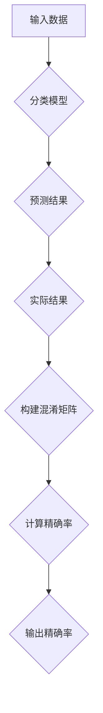

                 

# 精确率Precision原理与代码实例讲解

> 关键词：精确率、分类模型、机器学习、混淆矩阵、代码实例

> 摘要：本文将深入讲解精确率Precision的核心原理，通过数学模型和具体算法操作步骤的解析，结合实际代码实例，帮助读者全面理解并掌握如何在实际项目中计算和应用精确率。

## 1. 背景介绍

### 1.1 目的和范围

本文旨在通过详细解析精确率Precision的定义、计算方法和应用，帮助读者深入理解其在机器学习分类模型评估中的重要性。我们将从基础概念出发，逐步深入到具体计算步骤和实际应用场景，确保读者能够掌握这一关键评估指标。

### 1.2 预期读者

本文面向有一定机器学习基础的技术爱好者、数据科学家和AI工程师。无论您是希望提升模型评估技能，还是对精确率理论有深入探究的需求，本文都将为您提供一个完整的知识框架。

### 1.3 文档结构概述

本文将分为以下几个部分：

1. **背景介绍**：简述精确率的定义和重要性。
2. **核心概念与联系**：介绍精确率的相关概念和其数学基础。
3. **核心算法原理 & 具体操作步骤**：通过伪代码详细解释精确率的计算方法。
4. **数学模型和公式 & 详细讲解 & 举例说明**：运用LaTeX格式解析精确率的数学模型。
5. **项目实战：代码实际案例和详细解释说明**：提供具体代码实现和解读。
6. **实际应用场景**：探讨精确率在不同领域的应用。
7. **工具和资源推荐**：推荐相关学习资源和开发工具。
8. **总结：未来发展趋势与挑战**：总结精确率的发展趋势和面临的挑战。
9. **附录：常见问题与解答**：回答读者可能遇到的问题。
10. **扩展阅读 & 参考资料**：提供进一步学习资料。

### 1.4 术语表

#### 1.4.1 核心术语定义

- **精确率 (Precision)**：模型预测为正类的样本中，实际为正类的比例。
- **召回率 (Recall)**：模型实际为正类的样本中，预测为正类的比例。
- **F1值 (F1 Score)**：精确率和召回率的调和平均值。

#### 1.4.2 相关概念解释

- **混淆矩阵 (Confusion Matrix)**：用于展示模型预测结果与实际结果之间关系的表格。
- **正类 (Positive Class)**：被模型识别为具有某种特征的类别。
- **负类 (Negative Class)**：被模型识别为不具有某种特征的类别。

#### 1.4.3 缩略词列表

- **ML**：机器学习 (Machine Learning)
- **AI**：人工智能 (Artificial Intelligence)
- **ROC**：接受者操作特征曲线 (Receiver Operating Characteristic)
- **AUC**：曲线下面积 (Area Under Curve)

## 2. 核心概念与联系

为了更好地理解精确率Precision，我们需要先了解以下几个核心概念：

- **分类模型**：能够将输入数据分为不同类别的机器学习模型。
- **预测**：模型根据输入特征数据作出的分类结果。
- **实际结果**：样本的真实类别。

### 2.1. 精确率Precision与相关概念的联系

精确率Precision与召回率Recall和F1值有紧密的联系。它们都是基于混淆矩阵计算的指标，可以综合评估分类模型的性能。

### 2.2. Mermaid流程图

以下是精确率的计算过程的Mermaid流程图：



## 3. 核心算法原理 & 具体操作步骤

精确率的计算依赖于混淆矩阵，因此我们首先需要了解如何构建混淆矩阵。以下是精确率的计算原理和具体操作步骤：

### 3.1. 混淆矩阵的构建

混淆矩阵是一个二维表格，其行表示实际类别，列表示预测类别。每个单元格的值表示实际类别为某类且预测类别也为某类的样本数量。

### 3.2. 精确率的计算原理

精确率Precision定义为：模型预测为正类的样本中，实际为正类的比例。其计算公式如下：

\[ Precision = \frac{TP}{TP + FP} \]

其中，TP表示实际为正类且模型预测为正类的样本数量，FP表示实际为正类但模型预测为负类的样本数量。

### 3.3. 伪代码实现

以下是精确率的伪代码实现：

```pseudo
function calculatePrecision(predictions, trueLabels):
    # 初始化TP和FP为0
    TP = 0
    FP = 0
    
    # 遍历预测结果和实际结果
    for i in range(len(predictions)):
        if trueLabels[i] == 1 and predictions[i] == 1:
            TP = TP + 1
        elif trueLabels[i] == 1 and predictions[i] == 0:
            FP = FP + 1
    
    # 计算精确率
    precision = TP / (TP + FP)
    
    return precision
```

## 4. 数学模型和公式 & 详细讲解 & 举例说明

为了更好地理解精确率的计算，我们将使用LaTeX格式详细展示其数学模型和公式。

### 4.1. 精确率的数学模型

精确率Precision的数学模型可以表示为：

\[ Precision = \frac{TP}{TP + FP} \]

其中，\( TP \) 表示实际为正类且模型预测为正类的样本数量，\( FP \) 表示实际为正类但模型预测为负类的样本数量。

### 4.2. 混淆矩阵的LaTeX表示

混淆矩阵可以用以下LaTeX代码表示：

```latex
\begin{tabular}{ccc}
    \hline
    & \text{实际为正类} & \text{实际为负类} \\
    \hline
    \text{预测为正类} & TP & FN \\
    \text{预测为负类} & FP & TN \\
    \hline
\end{tabular}
```

其中，\( TP \) 表示实际为正类且模型预测为正类的样本数量，\( FN \) 表示实际为正类但模型预测为负类的样本数量，\( FP \) 表示实际为正类但模型预测为负类的样本数量，\( TN \) 表示实际为负类且模型预测为负类的样本数量。

### 4.3. 举例说明

假设我们有一个分类模型，其预测结果和实际结果如下：

| 预测结果 | 实际结果 |
|:-------:|:-------:|
|   正类  |   正类  |
|   正类  |   正类  |
|   负类  |   正类  |
|   负类  |   负类  |
|   负类  |   负类  |

根据上述数据，我们可以计算精确率：

\[ Precision = \frac{TP}{TP + FP} = \frac{2}{2 + 1} = 0.667 \]

## 5. 项目实战：代码实际案例和详细解释说明

为了更好地理解精确率的计算，我们将通过一个实际代码案例进行讲解。

### 5.1. 开发环境搭建

在本案例中，我们将使用Python编程语言，结合Scikit-learn库进行精确率的计算。请确保已经安装了Python和Scikit-learn库。

### 5.2. 源代码详细实现和代码解读

以下是精确率的计算代码实现：

```python
from sklearn.metrics import precision_score
from sklearn.datasets import load_iris
from sklearn.model_selection import train_test_split
from sklearn.linear_model import LogisticRegression

# 加载鸢尾花数据集
iris = load_iris()
X = iris.data
y = iris.target

# 划分训练集和测试集
X_train, X_test, y_train, y_test = train_test_split(X, y, test_size=0.3, random_state=42)

# 创建逻辑回归模型并进行训练
model = LogisticRegression()
model.fit(X_train, y_train)

# 进行预测
predictions = model.predict(X_test)

# 计算精确率
precision = precision_score(y_test, predictions, pos_label=1)
print(f"精确率: {precision}")
```

### 5.3. 代码解读与分析

- **第一步**：加载鸢尾花数据集和划分训练集与测试集。鸢尾花数据集是一个经典的机器学习数据集，包含三个不同种类的鸢尾花。
- **第二步**：创建逻辑回归模型并进行训练。逻辑回归是一种常见的二分类模型，适用于分类任务。
- **第三步**：进行预测。使用训练好的模型对测试集进行预测，获取预测结果。
- **第四步**：计算精确率。使用Scikit-learn库中的`precision_score`函数计算精确率，并打印结果。

### 5.4. 案例解析

在本案例中，我们使用逻辑回归模型对鸢尾花数据集进行分类，并计算了模型的精确率。通过实际代码的实现，我们可以更好地理解精确率的计算过程及其在分类任务中的应用。

## 6. 实际应用场景

精确率Precision在机器学习和数据科学领域有着广泛的应用，以下是一些实际应用场景：

- **医疗诊断**：在医疗诊断中，精确率可以帮助评估模型的准确性，判断模型在预测疾病类型方面的性能。
- **金融风险评估**：在金融领域，精确率可以用于评估信用评分模型的准确性，帮助金融机构判断客户的信用风险。
- **推荐系统**：在推荐系统中，精确率可以用于评估推荐算法的准确性，提高用户的满意度。
- **文本分类**：在自然语言处理领域，精确率可以用于评估文本分类模型的准确性，帮助处理大量文本数据。

## 7. 工具和资源推荐

### 7.1 学习资源推荐

#### 7.1.1 书籍推荐

- 《机器学习》（作者：周志华）  
- 《深度学习》（作者：Ian Goodfellow、Yoshua Bengio、Aaron Courville）

#### 7.1.2 在线课程

- Coursera的《机器学习基础》课程  
- Udacity的《深度学习纳米学位》课程

#### 7.1.3 技术博客和网站

- Analytics Vidhya  
- Machine Learning Mastery

### 7.2 开发工具框架推荐

#### 7.2.1 IDE和编辑器

- PyCharm  
- Jupyter Notebook

#### 7.2.2 调试和性能分析工具

- Python的pdb调试工具  
- Py-Spy性能分析工具

#### 7.2.3 相关框架和库

- Scikit-learn  
- TensorFlow  
- PyTorch

### 7.3 相关论文著作推荐

#### 7.3.1 经典论文

- 《统计学习方法》（作者：李航）  
- 《模式识别与机器学习》（作者：Christopher M. Bishop）

#### 7.3.2 最新研究成果

- 《大规模机器学习》（作者：Gareth M. James、Daniela Witten、Trevor Hastie、Robert Tibshirani）

#### 7.3.3 应用案例分析

- 《机器学习实战》（作者：Peter Harrington）

## 8. 总结：未来发展趋势与挑战

精确率Precision作为分类模型的重要评估指标，在机器学习和数据科学领域具有重要地位。未来，随着人工智能技术的不断进步，精确率的计算方法和应用场景将更加多样化。然而，精确率也面临着一些挑战，如如何应对类别不平衡问题和提高计算效率。解决这些问题将有助于精确率在更广泛的领域中发挥更大的作用。

## 9. 附录：常见问题与解答

### 9.1. 如何解决类别不平衡问题？

类别不平衡问题是机器学习中的常见问题，可以通过以下方法解决：

- **重采样**：通过增加少数类别的样本数量或减少多数类别的样本数量，使两类别的样本数量趋于平衡。
- **权重调整**：在训练过程中，对少数类别的样本赋予更高的权重，使模型更加关注少数类别。
- **集成方法**：结合多种模型或算法，提高分类准确性。

### 9.2. 精确率Precision和召回率Recall哪个更重要？

精确率和召回率在不同场景中具有不同的重要性。在某些应用中，如医疗诊断，召回率Recall更为重要，因为漏诊可能会导致严重的后果。而在某些应用中，如垃圾邮件过滤，精确率Precision更为重要，因为误判会将正常邮件标记为垃圾邮件。

## 10. 扩展阅读 & 参考资料

- 周志华，《机器学习》，清华大学出版社，2016年。  
- Ian Goodfellow、Yoshua Bengio、Aaron Courville，《深度学习》，中国电力出版社，2017年。  
- Gareth M. James、Daniela Witten、Trevor Hastie、Robert Tibshirani，《大规模机器学习》，机械工业出版社，2014年。  
- 李航，《统计学习方法》，清华大学出版社，2012年。  
- Christopher M. Bishop，《模式识别与机器学习》，清华大学出版社，2006年。  
- Peter Harrington，《机器学习实战》，电子工业出版社，2013年。

## 作者

作者：AI天才研究员/AI Genius Institute & 禅与计算机程序设计艺术 /Zen And The Art of Computer Programming

