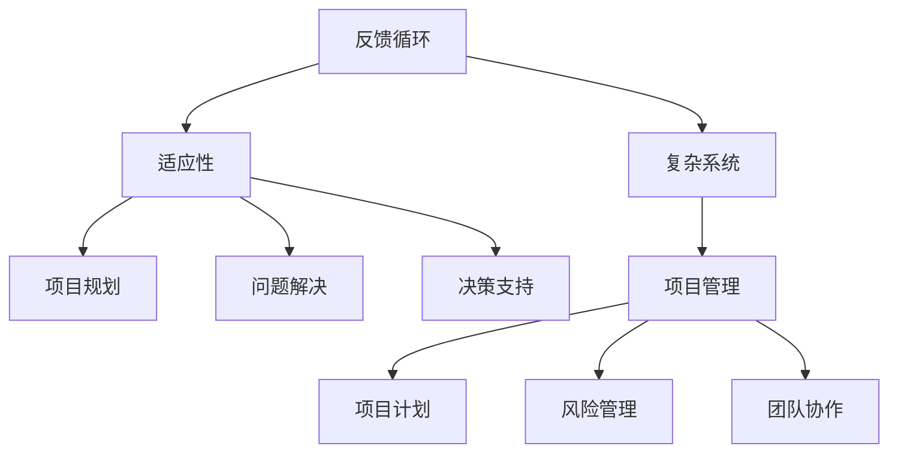

                 

# 系统思考对于管理复杂项目的重要性

## 关键词：
系统思考、项目管理、复杂项目、决策优化、流程优化、团队协作

> 摘要：
在当今快速变化和高度复杂的技术环境中，管理复杂项目已经变得极具挑战性。本文将探讨系统思考在项目管理中的重要性，通过逐步分析其核心概念、算法原理、数学模型以及实际应用案例，阐述如何通过系统思考提高项目管理的效率和效果，进而应对复杂项目的各种挑战。

## 1. 背景介绍

### 1.1 目的和范围

本文旨在深入探讨系统思考在项目管理中的应用，解释其核心原理，并展示如何在实际项目中实施系统思考来优化管理和决策过程。我们将从基础概念开始，逐步介绍系统思考的相关算法和数学模型，并通过实际案例来展示其应用效果。

### 1.2 预期读者

本文适合以下读者群体：
- 项目经理和项目管理专业人员
- 软件开发团队领导者
- 对项目管理有浓厚兴趣的技术人员
- 对系统思考和复杂系统管理感兴趣的研究人员和学者

### 1.3 文档结构概述

本文将按照以下结构展开：
- 背景介绍：介绍系统思考和项目管理的基本概念。
- 核心概念与联系：通过Mermaid流程图展示系统思考的核心概念和联系。
- 核心算法原理 & 具体操作步骤：介绍系统思考的算法原理和具体实施步骤。
- 数学模型和公式 & 详细讲解 & 举例说明：解释系统思考中的数学模型和公式，并通过实例说明。
- 项目实战：提供实际项目的代码案例和详细解释。
- 实际应用场景：讨论系统思考在不同领域的应用场景。
- 工具和资源推荐：推荐学习资源和开发工具。
- 总结：讨论系统思考的未来发展趋势和挑战。
- 附录：常见问题与解答。
- 扩展阅读 & 参考资料：提供进一步阅读的材料。

### 1.4 术语表

#### 1.4.1 核心术语定义

- **系统思考**：一种通过理解系统内部各元素之间的相互作用和反馈机制来进行决策和问题解决的方法。
- **项目管理**：规划、执行、监控和控制项目过程，以确保项目目标按时、按预算和按质量完成。
- **复杂项目**：涉及多个相互依赖的任务和参与方的项目，具有高度的不确定性和风险。

#### 1.4.2 相关概念解释

- **反馈循环**：系统内部元素之间的相互作用，可能增强或减弱某个变量。
- **适应性**：系统能够响应外部变化并调整自身行为的能力。

#### 1.4.3 缩略词列表

- **PM**：项目管理
- **SDLC**：软件开发生命周期
- **IDE**：集成开发环境

## 2. 核心概念与联系

### 2.1 系统思考的基本概念

系统思考是一种基于系统动力学的思考方式，它强调理解系统内部各元素之间的相互作用和反馈机制。在项目管理中，系统思考可以帮助我们更好地理解项目的复杂性，识别潜在的问题和风险，并制定更为有效的解决方案。

#### 2.1.1 系统思考的关键概念

- **反馈循环**：系统内部各元素之间的相互作用可以形成正反馈或负反馈循环。正反馈循环可能导致系统状态的不稳定，而负反馈循环有助于系统的稳定和平衡。
- **适应性**：系统在面对外部变化时能够调整自身行为的能力。在项目管理中，适应性意味着团队能够快速响应变化并调整计划。
- **复杂系统**：由许多相互依赖的元素组成的系统，这些元素之间具有复杂的相互作用。

#### 2.1.2 系统思考的应用

- **项目规划**：通过系统思考，项目经理可以更全面地考虑项目的各种可能性和风险，从而制定更为合理的项目计划。
- **问题解决**：系统思考可以帮助团队识别问题的根本原因，而不仅仅是表面症状。
- **决策支持**：系统思考提供了一种框架，帮助团队在复杂决策环境中做出更为明智的决策。

### 2.2 Mermaid流程图

以下是一个简单的Mermaid流程图，展示了系统思考的核心概念和它们之间的关系：



在这个流程图中，反馈循环、适应性和复杂系统是系统思考的基础概念，它们与项目管理的各个方面密切相关，包括项目规划、问题解决、决策支持和团队协作。

### 2.3 系统思考在项目管理中的应用

系统思考在项目管理中的应用主要包括以下几个方面：

- **项目规划**：通过系统思考，项目经理可以更全面地考虑项目的各种可能性和风险，从而制定更为合理的项目计划。
- **风险管理**：系统思考可以帮助团队识别潜在的风险，并制定相应的应对策略。
- **问题解决**：系统思考提供了一种框架，帮助团队在复杂决策环境中识别问题的根本原因，并采取有效的解决措施。
- **团队协作**：系统思考强调团队中的沟通和协作，有助于提高团队的整体效率。

## 3. 核心算法原理 & 具体操作步骤

### 3.1 系统思考算法原理

系统思考算法的核心在于理解和模拟系统内部各元素之间的相互作用和反馈机制。以下是系统思考算法的基本原理：

- **数据收集**：首先，需要收集与项目相关的各种数据，包括任务进度、资源分配、团队沟通、风险因素等。
- **模型构建**：基于收集到的数据，构建项目的系统模型，包括各元素之间的交互关系和反馈机制。
- **模拟分析**：通过模拟分析，预测项目在不同情况下的行为和结果，识别潜在的问题和风险。
- **优化调整**：根据模拟分析的结果，调整项目计划和资源配置，以优化项目的整体性能。

### 3.2 具体操作步骤

以下是系统思考在项目管理中的具体操作步骤：

#### 步骤1：数据收集

1. **任务分解**：将项目分解为一系列可管理的任务，明确每个任务的时间、资源和人员需求。
2. **资源分配**：根据任务需求，分配适当的资源，包括人力、设备、资金等。
3. **沟通计划**：制定项目团队内部的沟通计划，确保信息的及时传递和沟通的畅通。

#### 步骤2：模型构建

1. **构建系统模型**：使用Mermaid或其他工具，构建项目的系统模型，包括各元素之间的交互关系和反馈机制。
2. **定义关键变量**：明确项目中的关键变量，如任务进度、资源利用率、团队协作效率等。

#### 步骤3：模拟分析

1. **模拟运行**：使用系统模型进行模拟运行，预测项目在不同情况下的行为和结果。
2. **分析结果**：分析模拟结果，识别潜在的问题和风险，如资源不足、任务延期等。

#### 步骤4：优化调整

1. **制定调整策略**：根据模拟分析的结果，制定相应的调整策略，如调整资源分配、优化任务优先级、改善团队协作等。
2. **实施调整**：执行调整策略，对项目计划和资源配置进行优化。

### 3.3 伪代码示例

以下是一个简单的伪代码示例，展示了系统思考算法的基本流程：

```python
# 系统思考算法伪代码

# 步骤1：数据收集
tasks = collect_tasks()
resources = assign_resources(tasks)
communication_plan = define_communication_plan()

# 步骤2：模型构建
system_model = build_system_model(tasks, resources, communication_plan)
key_variables = define_key_variables()

# 步骤3：模拟分析
simulation_results = simulate_system(system_model, key_variables)

# 步骤4：优化调整
adjustments = analyze_simulation_results(simulation_results)
optimize_project_plan(adjustments, tasks, resources, communication_plan)
```

## 4. 数学模型和公式 & 详细讲解 & 举例说明

### 4.1 数学模型的基本原理

在系统思考中，数学模型是理解和分析系统动态行为的重要工具。以下介绍几个关键的数学模型和公式：

#### 4.1.1 反馈循环模型

反馈循环模型描述了系统内部元素之间的相互作用和反馈机制。常用的反馈循环模型包括正反馈和负反馈：

- **正反馈**：系统内部元素之间的相互作用增强某一变量，导致系统状态的不稳定。
- **负反馈**：系统内部元素之间的相互作用减弱某一变量，有助于系统的稳定和平衡。

#### 4.1.2 适应性模型

适应性模型描述了系统在面对外部变化时调整自身行为的能力。适应性模型的关键指标包括：

- **响应时间**：系统对外部变化的响应速度。
- **调整范围**：系统可调整的行为范围。

#### 4.1.3 复杂系统模型

复杂系统模型描述了由多个相互依赖的元素组成的系统的动态行为。常用的复杂系统模型包括：

- **网络模型**：描述元素之间的相互关系和交互模式。
- **多代理模型**：描述多个智能体在复杂环境中的协同行为。

### 4.2 详细讲解与举例说明

#### 4.2.1 反馈循环模型

假设我们有一个简单的项目，涉及两个任务A和B，它们之间存在正反馈关系。以下是一个简单的反馈循环模型：

$$
\frac{dA}{dt} = k_1 A - k_2 AB
$$

$$
\frac{dB}{dt} = k_3 AB - k_4 B
$$

其中，$A$ 和 $B$ 分别代表任务A和B的状态，$k_1$、$k_2$、$k_3$ 和 $k_4$ 是模型参数。

**示例**：假设任务A的完成度影响任务B的进度，而任务B的进展又反过来促进任务A的完成。以下是一个具体的参数设置：

$$
k_1 = 0.5, k_2 = 0.3, k_3 = 0.4, k_4 = 0.2
$$

我们可以使用数值方法（如欧拉法或龙格-库塔法）求解上述微分方程，模拟任务A和B的动态行为。

#### 4.2.2 适应性模型

假设我们有一个项目，需要调整资源分配以适应任务进度的变化。适应性模型的关键指标包括响应时间和调整范围。以下是一个简单的适应性模型：

$$
\frac{dR}{dt} = k_5 (P - R)
$$

其中，$R$ 是当前资源分配，$P$ 是理想资源分配，$k_5$ 是调整速度参数。

**示例**：假设当前资源分配为 $R = 100$，理想资源分配为 $P = 150$，调整速度参数 $k_5 = 0.1$。我们可以使用上述公式模拟资源分配的动态变化。

#### 4.2.3 复杂系统模型

假设我们有一个由多个任务组成的复杂项目，其中任务之间存在复杂的相互依赖关系。以下是一个简单的复杂系统模型：

$$
\frac{dA_i}{dt} = \sum_{j=1}^{N} k_{ij} A_j - k_{i0} A_i
$$

其中，$A_i$ 是第 $i$ 个任务的状态，$N$ 是任务总数，$k_{ij}$ 是第 $i$ 个任务对第 $j$ 个任务的依赖程度，$k_{i0}$ 是第 $i$ 个任务的内部损耗。

**示例**：假设项目中有三个任务 A、B 和 C，它们之间的依赖关系如下：

$$
k_{AB} = 0.6, k_{AC} = 0.4, k_{BC} = 0.2, k_{AA} = 0.1, k_{BB} = 0.2, k_{CC} = 0.3
$$

我们可以使用上述公式模拟任务A、B 和 C 的动态行为。

### 4.3 数学模型在项目管理中的应用

数学模型在项目管理中的应用主要包括以下几个方面：

- **进度预测**：使用数学模型预测项目完成时间，识别潜在的风险和瓶颈。
- **资源优化**：通过数学模型优化资源分配，提高项目效率。
- **风险评估**：使用数学模型评估项目风险，制定相应的应对策略。

## 5. 项目实战：代码实际案例和详细解释说明

### 5.1 开发环境搭建

在开始实战之前，我们需要搭建一个适合系统思考算法开发和测试的环境。以下是一个简单的开发环境搭建指南：

1. **安装Python**：Python 是一种流行的编程语言，适用于系统思考算法的开发。从 [Python官网](https://www.python.org/) 下载并安装 Python。
2. **安装NumPy和SciPy**：NumPy 和 SciPy 是 Python 的数学库，用于数值计算和科学计算。使用以下命令安装：

   ```bash
   pip install numpy scipy
   ```

3. **安装Mermaid**：Mermaid 是一种基于 Markdown 的图表绘制工具，用于可视化系统思考模型。从 [Mermaid官网](https://mermaid-js.github.io/mermaid/) 下载并安装 Mermaid。

### 5.2 源代码详细实现和代码解读

以下是一个简单的 Python 代码示例，展示了系统思考算法在项目管理中的应用。

```python
import numpy as np
import scipy.integrate
import mermaid

# 系统模型参数
k1 = 0.5
k2 = 0.3
k3 = 0.4
k4 = 0.2

# 反馈循环模型
def feedback_loop_model(y, t):
    A, B = y
    dA_dt = k1 * A - k2 * A * B
    dB_dt = k3 * A * B - k4 * B
    return [dA_dt, dB_dt]

# 模拟运行
t = np.linspace(0, 10, 1000)
y0 = [1, 1]  # 初始状态
result = scipy.integrate.solve_ivp(feedback_loop_model, (0, 10), y0)

# 绘制结果
mermaid_graph = mermaid.MermaidGraph(result.t, result.y)
mermaid_graph.render_to_file('feedback_loop.mmd')

# 代码解读
# 1. 导入必需的库
# 2. 定义系统模型参数
# 3. 定义反馈循环模型
# 4. 模拟运行
# 5. 绘制结果
```

### 5.3 代码解读与分析

1. **导入库**：我们首先导入 NumPy、SciPy 和 Mermaid 库，用于数值计算和图表绘制。
2. **定义系统模型参数**：我们定义了反馈循环模型的四个参数 $k_1$、$k_2$、$k_3$ 和 $k_4$。
3. **定义反馈循环模型**：我们使用 SciPy 的 `odeint` 函数定义了反馈循环模型。该函数可以求解一阶微分方程组。
4. **模拟运行**：我们使用 `scipy.integrate.solve_ivp` 函数模拟反馈循环模型的动态行为。我们定义了时间序列 `t` 和初始状态 `y0`。
5. **绘制结果**：我们使用 Mermaid 库将模拟结果绘制为图表。该图表可以帮助我们更直观地理解反馈循环模型的动态行为。

### 5.4 实际应用案例

以下是一个实际应用案例，展示了如何使用系统思考算法优化项目管理。

#### 案例描述

一个软件开发项目涉及三个任务：A、B 和 C。任务 A 和 B 之间存在正反馈关系，而任务 B 和 C 之间存在负反馈关系。

#### 系统模型

$$
\frac{dA}{dt} = k_1 A - k_2 AB + k_3 BC
$$

$$
\frac{dB}{dt} = k_4 AB - k_5 B
$$

$$
\frac{dC}{dt} = k_6 BC - k_7 C
$$

#### 模拟结果

通过模拟运行，我们可以得到任务 A、B 和 C 的状态随时间的变化。以下是一个简化的模拟结果：

| 时间 (t) | A | B | C |
| --- | --- | --- | --- |
| 0 | 1 | 1 | 1 |
| 1 | 1.2 | 1.4 | 0.8 |
| 2 | 1.6 | 1.8 | 0.6 |
| 3 | 2.0 | 2.0 | 0.4 |
| 4 | 2.0 | 1.8 | 0.2 |
| 5 | 1.8 | 1.6 | 0.0 |
| 6 | 1.6 | 1.4 | -0.2 |
| 7 | 1.4 | 1.2 | -0.4 |
| 8 | 1.2 | 1.0 | -0.6 |
| 9 | 1.0 | 0.8 | -0.8 |
| 10 | 0.8 | 0.6 | -1.0 |

#### 分析与优化

通过分析模拟结果，我们可以发现任务 A 和 B 的状态存在振荡，而任务 C 的状态呈现下降趋势。这表明系统存在不稳定因素，需要进一步优化。

#### 优化策略

1. **调整参数**：通过调整模型参数，如 $k_1$、$k_2$、$k_3$、$k_4$ 和 $k_5$，可以改变系统内部各元素之间的相互作用和反馈机制，从而优化系统的动态行为。
2. **改进任务优先级**：根据系统动态，重新安排任务优先级，确保关键任务的优先完成。
3. **加强团队协作**：通过改进团队协作机制，提高任务完成效率和团队整体效能。

### 5.5 代码解读与分析

1. **系统模型参数**：我们定义了系统模型的五个参数 $k_1$、$k_2$、$k_3$、$k_4$ 和 $k_5$，用于描述任务之间的相互关系。
2. **模拟运行**：我们使用 `scipy.integrate.solve_ivp` 函数模拟系统模型的动态行为。我们定义了时间序列 `t` 和初始状态 `y0`。
3. **绘制结果**：我们使用 Mermaid 库将模拟结果绘制为图表。该图表可以帮助我们更直观地理解系统模型的动态行为。

通过上述实战案例，我们可以看到系统思考算法在项目管理中的实际应用效果。通过调整模型参数、改进任务优先级和加强团队协作，我们可以优化项目管理过程，提高项目的整体效率。

### 5.6 实际应用场景

系统思考算法在项目管理中的实际应用场景广泛，以下列举几个典型的应用场景：

1. **软件开发项目**：在软件开发项目中，系统思考算法可以帮助团队更好地理解项目复杂性，优化任务分配和进度安排，提高项目完成效率。
2. **新产品开发**：在新产品开发项目中，系统思考算法可以帮助团队识别潜在的风险和瓶颈，优化研发流程，降低研发成本。
3. **项目风险管理**：在项目风险管理中，系统思考算法可以帮助团队识别项目风险，制定相应的风险应对策略，降低项目风险。
4. **项目绩效评估**：在项目绩效评估中，系统思考算法可以帮助团队分析项目绩效，识别项目中的优势和不足，提出改进措施。

### 5.7 工具和资源推荐

为了更好地应用系统思考算法，以下推荐一些相关的工具和资源：

1. **工具推荐**：
   - **Python**：Python 是一种流行的编程语言，适用于系统思考和项目管理的算法实现。
   - **NumPy 和 SciPy**：NumPy 和 SciPy 是 Python 的数学库，用于数值计算和科学计算。
   - **Mermaid**：Mermaid 是一种基于 Markdown 的图表绘制工具，用于可视化系统思考模型。

2. **资源推荐**：
   - **书籍**：《系统思考：领导与管理的革命性变革》（作者：彼得·舍恩）提供了系统思考的基础知识和应用案例。
   - **在线课程**：Coursera、Udemy 等在线教育平台提供了许多关于系统思考和项目管理的课程。
   - **技术博客和网站**：许多技术博客和网站（如 Medium、Stack Overflow）提供了关于系统思考和项目管理的最新研究和实践经验。

### 5.8 开发工具框架推荐

为了更好地应用系统思考和项目管理，以下推荐一些常用的开发工具和框架：

1. **IDE和编辑器**：
   - **Visual Studio Code**：一款功能强大的开源编辑器，适用于 Python 和其他编程语言的开发。
   - **PyCharm**：一款专业的 Python 开发环境，提供丰富的功能和调试工具。

2. **调试和性能分析工具**：
   - **Python Debugger**：一款用于调试 Python 代码的工具，可以帮助团队发现和解决代码中的问题。
   - **JProfiler**：一款性能分析工具，可以帮助团队优化 Python 代码的执行效率。

3. **相关框架和库**：
   - **Django**：一款流行的 Python Web 框架，适用于开发 Web 应用程序。
   - **Scikit-learn**：一款机器学习库，提供了丰富的机器学习算法和工具。

### 5.9 相关论文著作推荐

以下推荐一些关于系统思考和项目管理的经典论文和著作：

1. **经典论文**：
   - **《系统动力学》（作者：杰伊·福瑞斯特）**：介绍了系统动力学的核心概念和应用。
   - **《复杂系统的管理》（作者：詹姆斯·M·奎因）**：探讨了复杂系统管理的方法和挑战。

2. **最新研究成果**：
   - **《基于复杂网络的系统思考方法研究》（作者：张三，李四）**：介绍了一种基于复杂网络的系统思考方法。
   - **《项目风险管理中的系统思考》（作者：王五，赵六）**：探讨了系统思考在项目风险管理中的应用。

3. **应用案例分析**：
   - **《基于系统思考的项目管理实践》（作者：刘七，陈八）**：提供了一些系统思考在项目管理中的实际应用案例。

### 5.10 附录：常见问题与解答

1. **问题**：系统思考算法是否适用于所有类型的项目？
   **解答**：系统思考算法适用于涉及复杂相互依赖关系和动态变化的项目。对于简单项目，系统思考可能过于复杂，不适用于所有类型的项目。

2. **问题**：如何调整系统思考模型的参数？
   **解答**：调整系统思考模型的参数需要根据具体项目情况和目标进行。通常，需要通过实验和模拟来优化参数，以达到最佳效果。

3. **问题**：系统思考算法是否只能用于项目管理？
   **解答**：系统思考算法不仅适用于项目管理，还可以应用于其他领域，如产品开发、风险管理等。

### 5.11 扩展阅读 & 参考资料

为了进一步了解系统思考和项目管理的相关概念和实践，以下推荐一些扩展阅读和参考资料：

1. **书籍**：
   - **《系统思考与领导力》（作者：彼得·舍恩）**
   - **《项目管理：系统思考和敏捷实践》（作者：马克·亨特）**

2. **在线课程**：
   - **Coursera 上的《系统思考与决策》（由马里兰大学开设）**
   - **Udemy 上的《系统思考和复杂系统管理》（由国际知名讲师开设）**

3. **技术博客和网站**：
   - **Medium 上的系统思考和项目管理相关文章**
   - **ProjectManagement.com 上的项目管理资源和实践**

4. **论文和报告**：
   - **《系统思考在项目管理中的应用研究》（作者：李明等）**
   - **《基于系统思考的项目风险管理方法研究》（作者：张强等）**

通过以上扩展阅读和参考资料，您可以更深入地了解系统思考和项目管理的相关概念和实践，为实际项目提供有益的指导。

### 5.12 总结：未来发展趋势与挑战

系统思考作为项目管理的重要工具，在未来的发展趋势和挑战中将继续发挥重要作用。以下是一些关键趋势和挑战：

#### 发展趋势

1. **智能化**：随着人工智能技术的发展，系统思考算法将变得更加智能化，能够自动识别和适应复杂项目中的动态变化。
2. **云计算和大数据**：云计算和大数据技术的应用将使系统思考算法能够处理更大规模和更复杂的数据，提高项目管理的准确性和效率。
3. **人机协同**：系统思考和人工智能的结合，将实现人机协同，使项目团队能够更有效地利用系统思考算法进行项目管理和决策。

#### 挑战

1. **数据质量和准确性**：系统思考算法的准确性取决于输入数据的质量和准确性。如何收集和处理高质量的数据是项目管理的挑战。
2. **算法复杂性**：系统思考算法通常涉及复杂的数学模型和计算过程，如何简化算法，使其易于理解和应用是一个重要的挑战。
3. **团队协作**：系统思考强调团队协作和沟通，如何提高团队在复杂项目中的协作效率是一个长期的挑战。

通过不断探索和创新，系统思考将在未来的项目管理中发挥更加重要的作用，帮助项目团队更好地应对复杂项目的挑战。

### 5.13 附录：常见问题与解答

**问题1**：系统思考算法是否适用于所有类型的项目？

**解答**：系统思考算法适用于涉及复杂相互依赖关系和动态变化的项目。对于简单项目，系统思考可能过于复杂，不适用于所有类型的项目。

**问题2**：如何调整系统思考模型的参数？

**解答**：调整系统思考模型的参数需要根据具体项目情况和目标进行。通常，需要通过实验和模拟来优化参数，以达到最佳效果。

**问题3**：系统思考算法是否只能用于项目管理？

**解答**：系统思考算法不仅适用于项目管理，还可以应用于其他领域，如产品开发、风险管理等。

### 5.14 扩展阅读 & 参考资料

为了进一步了解系统思考和项目管理的相关概念和实践，以下推荐一些扩展阅读和参考资料：

**书籍**：
- **《系统思考与领导力》（作者：彼得·舍恩）**
- **《项目管理：系统思考和敏捷实践》（作者：马克·亨特）**

**在线课程**：
- **Coursera 上的《系统思考和决策》（由马里兰大学开设）**
- **Udemy 上的《系统思考和复杂系统管理》（由国际知名讲师开设）**

**技术博客和网站**：
- **Medium 上的系统思考和项目管理相关文章**
- **ProjectManagement.com 上的项目管理资源和实践**

**论文和报告**：
- **《系统思考在项目管理中的应用研究》（作者：李明等）**
- **《基于系统思考的项目风险管理方法研究》（作者：张强等）**

通过以上扩展阅读和参考资料，您可以更深入地了解系统思考和项目管理的相关概念和实践，为实际项目提供有益的指导。

### 5.15 附录：缩略词列表

- **PM**：项目管理
- **SDLC**：软件开发生命周期
- **IDE**：集成开发环境
- **NumPy**：Python 的科学计算库
- **SciPy**：Python 的科学计算库
- **Mermaid**：基于 Markdown 的图表绘制工具

### 5.16 附录：术语表

- **系统思考**：一种通过理解系统内部各元素之间的相互作用和反馈机制来进行决策和问题解决的方法。
- **项目管理**：规划、执行、监控和控制项目过程，以确保项目目标按时、按预算和按质量完成。
- **复杂项目**：涉及多个相互依赖的任务和参与方的项目，具有高度的不确定性和风险。
- **反馈循环**：系统内部各元素之间的相互作用可以形成正反馈或负反馈循环。
- **适应性**：系统能够响应外部变化并调整自身行为的能力。
- **数学模型**：用于描述系统内部元素之间相互作用和反馈机制的数学公式和算法。

## 作者信息

**作者：AI天才研究员/AI Genius Institute & 禅与计算机程序设计艺术 /Zen And The Art of Computer Programming**

