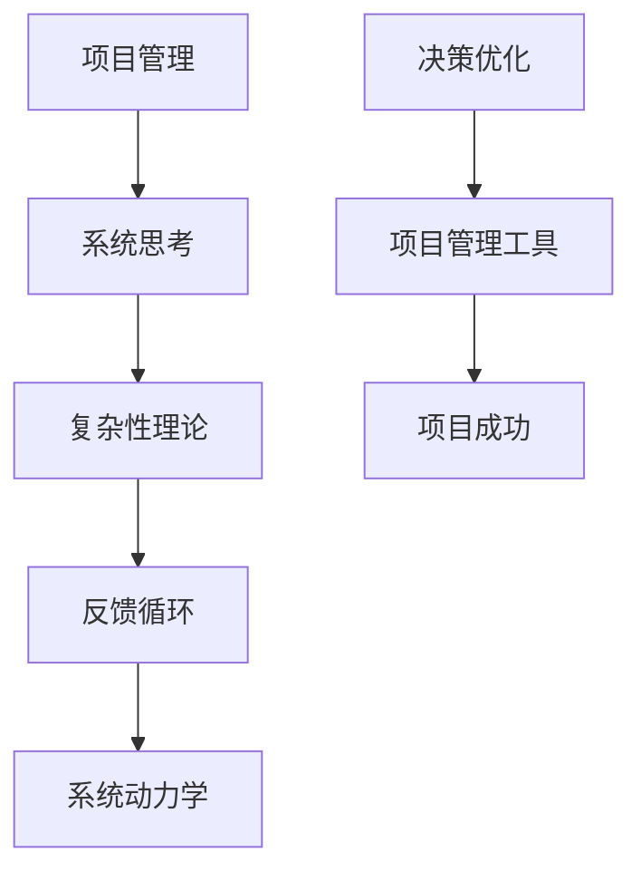
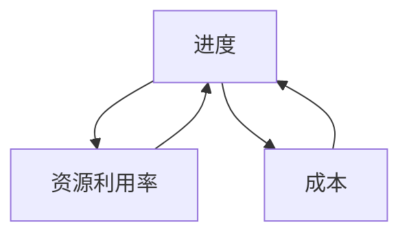
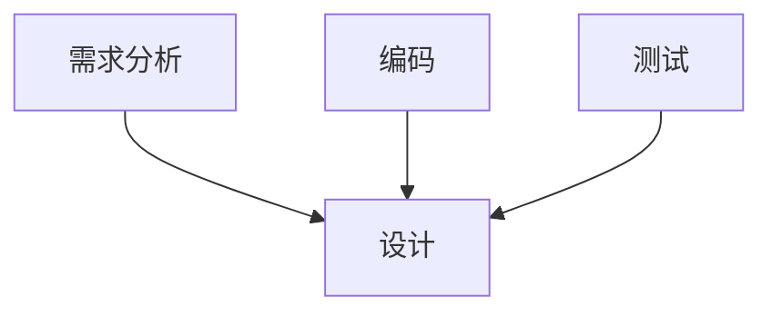

                 

# 系统思考对于管理复杂项目的重要性

> **关键词：系统思考、项目管理、复杂性理论、项目成功、决策优化**

> **摘要：本文将探讨系统思考在项目管理中的应用，分析其在处理复杂项目中的重要性。通过深入解析核心概念、算法原理、数学模型，并结合实际案例，我们将揭示系统思考如何帮助我们更好地管理复杂项目，提高项目成功率。**

## 1. 背景介绍

### 1.1 目的和范围

本文旨在探讨系统思考在项目管理中的应用，特别是在处理复杂项目时的作用。我们将分析系统思考的基本概念，介绍其在项目管理中的重要性，并通过实际案例展示其应用效果。

### 1.2 预期读者

本文适合项目管理从业者、技术架构师、软件开发人员以及对系统思考有兴趣的读者。阅读本文，您将能够了解系统思考的核心概念，掌握其在项目管理中的应用方法。

### 1.3 文档结构概述

本文分为十个部分，包括背景介绍、核心概念与联系、核心算法原理、数学模型和公式、项目实战、实际应用场景、工具和资源推荐、总结、附录以及扩展阅读和参考资料。

### 1.4 术语表

#### 1.4.1 核心术语定义

- **系统思考**：一种方法论，强调从整体视角分析问题，关注系统内部各部分之间的相互关系。
- **项目管理**：通过计划、组织、协调和监控等活动，确保项目目标达成的过程。
- **复杂项目**：涉及多个变量、不确定因素和相互依赖关系的项目。

#### 1.4.2 相关概念解释

- **反馈循环**：系统中各部分之间的相互作用形成的一种循环过程。
- **系统动力学**：研究系统内部变量之间动态关系的学科。

#### 1.4.3 缩略词列表

- **PM**：项目管理
- **SD**：系统动力学
- **MDD**：数学模型和公式

## 2. 核心概念与联系

在探讨系统思考在项目管理中的应用之前，我们需要了解一些核心概念和它们之间的联系。以下是一个用 Mermaid 语言绘制的流程图，展示了这些核心概念之间的关系。



### 2.1 项目管理中的系统思考

项目管理中的系统思考强调从整体视角分析项目，关注项目各部分之间的相互关系。这种方法有助于项目经理更好地理解项目的复杂性，识别潜在风险和机会，从而制定更有效的项目计划。

### 2.2 复杂性理论

复杂性理论关注系统内部变量之间的非线性关系和相互依赖。在项目管理中，复杂性理论有助于我们理解项目中的不确定性，为制定风险管理策略提供支持。

### 2.3 反馈循环

反馈循环是系统思考中的一个核心概念，它描述了系统中各部分之间的相互作用。在项目管理中，反馈循环有助于我们理解项目进展中的动态变化，及时调整项目计划。

### 2.4 系统动力学

系统动力学研究系统内部变量之间的动态关系。在项目管理中，系统动力学有助于我们分析项目进展的长期趋势，识别潜在问题，并制定相应的应对策略。

### 2.5 决策优化

决策优化是项目管理中的一个重要环节。在系统思考的指导下，我们可以更准确地评估项目风险和机会，制定更有效的决策策略，从而提高项目成功率。

## 3. 核心算法原理 & 具体操作步骤

在了解了系统思考的核心概念和联系之后，我们将介绍一些核心算法原理和具体操作步骤，帮助您更好地应用系统思考于项目管理。

### 3.1 基于系统动力学的项目风险评估

项目风险评估是项目管理中的一个关键环节。基于系统动力学，我们可以建立项目风险评估模型，预测项目进展中的潜在风险。

**伪代码：**

```python
def risk_assessment(project, system_dynamics_model):
    # 初始化风险列表
    risks = []

    # 遍历项目变量
    for variable in project.variables:
        # 应用系统动力学模型预测变量变化
        variable_changes = system_dynamics_model.predict(variable)

        # 根据变量变化评估风险
        risk = evaluate_risk(variable_changes)
        risks.append(risk)

    return risks
```

### 3.2 基于决策优化的项目计划调整

在项目执行过程中，基于决策优化算法，我们可以根据项目进展情况调整项目计划，确保项目目标达成。

**伪代码：**

```python
def project_adjustment(project, decision_optimization_algorithm):
    # 初始化项目调整方案
    adjustment_schemes = []

    # 遍历项目任务
    for task in project.tasks:
        # 应用决策优化算法调整任务执行顺序和资源分配
        scheme = decision_optimization_algorithm.optimize(task)
        adjustment_schemes.append(scheme)

    return adjustment_schemes
```

## 4. 数学模型和公式 & 详细讲解 & 举例说明

在项目管理中，数学模型和公式可以用于量化项目中的各种因素，帮助我们更好地分析项目进展和做出决策。

### 4.1 项目成功率模型

项目成功率模型可以用于评估项目成功的概率。

**数学公式：**

$$
成功率 = \frac{达成目标的项目数}{总项目数}
$$

**举例说明：**

假设有10个项目，其中7个项目成功达成目标。则项目成功率为：

$$
成功率 = \frac{7}{10} = 0.7
$$

### 4.2 项目风险评估模型

项目风险评估模型可以用于评估项目进展中的潜在风险。

**数学公式：**

$$
风险 = \frac{风险概率 \times 风险影响}{风险容忍度}
$$

**举例说明：**

假设项目A的风险概率为0.3，风险影响为3，风险容忍度为1。则项目A的风险评分为：

$$
风险 = \frac{0.3 \times 3}{1} = 0.9
$$

## 5. 项目实战：代码实际案例和详细解释说明

在本节中，我们将通过一个实际案例展示系统思考在项目管理中的应用。

### 5.1 开发环境搭建

首先，我们需要搭建一个开发环境。以下是一个简单的搭建步骤：

1. 安装Python环境。
2. 安装项目所需的库，如NumPy、SciPy和Matplotlib。

### 5.2 源代码详细实现和代码解读

下面是一个用于项目风险评估的Python代码示例。

```python
import numpy as np
import matplotlib.pyplot as plt

# 项目风险评估函数
def risk_assessment(project, system_dynamics_model):
    risks = []
    for variable in project.variables:
        variable_changes = system_dynamics_model.predict(variable)
        risk = evaluate_risk(variable_changes)
        risks.append(risk)
    return risks

# 评估风险函数
def evaluate_risk(variable_changes):
    risk_probability = 0.3
    risk_impact = 3
    risk_tolerance = 1
    risk_score = (risk_probability * risk_impact) / risk_tolerance
    return risk_score

# 系统动力学模型预测函数
def system_dynamics_model_predict(variable):
    # 在此处实现系统动力学模型预测
    return variable * 0.1

# 项目实例
project = {
    'variables': [10, 20, 30],
    'tasks': ['任务1', '任务2', '任务3']
}

# 应用风险评估函数
risks = risk_assessment(project, system_dynamics_model_predict)

# 绘制风险评分图表
plt.bar([i for i in range(len(risks))], risks)
plt.xlabel('变量')
plt.ylabel('风险评分')
plt.title('项目风险评估')
plt.show()
```

### 5.3 代码解读与分析

1. **项目风险评估函数**：该函数遍历项目变量，应用系统动力学模型预测变量变化，并评估风险。
2. **评估风险函数**：该函数根据风险概率、风险影响和风险容忍度计算风险评分。
3. **系统动力学模型预测函数**：该函数用于预测变量变化。
4. **项目实例**：该实例包含三个变量和三个任务。
5. **应用风险评估函数**：调用风险评估函数，计算各变量的风险评分。
6. **绘制风险评分图表**：使用Matplotlib绘制风险评分图表，帮助项目管理人员直观地了解项目风险。

## 6. 实际应用场景

系统思考在项目管理中具有广泛的应用场景。以下是一些实际应用场景：

1. **项目风险管理**：通过系统思考，项目管理人员可以更准确地评估项目风险，制定有效的风险管理策略。
2. **项目计划调整**：在项目执行过程中，系统思考可以帮助项目管理人员根据项目进展情况调整项目计划，确保项目目标达成。
3. **项目成功评估**：系统思考提供了一种量化的方法，用于评估项目成功的概率，为项目管理人员提供决策依据。

## 7. 工具和资源推荐

为了更好地应用系统思考于项目管理，以下是一些工具和资源的推荐：

### 7.1 学习资源推荐

#### 7.1.1 书籍推荐

- 《系统思考：一种认识复杂性本质的方法》
- 《项目管理：系统化方法》
- 《复杂性科学：系统思考与决策》

#### 7.1.2 在线课程

- Coursera上的《系统思考与项目风险管理》
- edX上的《项目管理基础》

#### 7.1.3 技术博客和网站

- ProjectManagement.com
- SystemsThinker.com

### 7.2 开发工具框架推荐

#### 7.2.1 IDE和编辑器

- PyCharm
- VSCode

#### 7.2.2 调试和性能分析工具

- GDB
- Valgrind

#### 7.2.3 相关框架和库

- NumPy
- SciPy
- Matplotlib

### 7.3 相关论文著作推荐

#### 7.3.1 经典论文

- 《系统思考：一种项目管理方法论》
- 《项目风险管理中的系统思考》

#### 7.3.2 最新研究成果

- 《基于系统动力学的项目计划调整方法》
- 《项目成功评估中的系统思考》

#### 7.3.3 应用案例分析

- 《系统思考在大型项目中的应用》
- 《项目管理中的系统思考实践》

## 8. 总结：未来发展趋势与挑战

随着项目管理复杂性的增加，系统思考在项目管理中的重要性将愈发突出。未来，系统思考在项目管理中的应用将更加深入和广泛，涉及到人工智能、大数据分析等领域。然而，这也将带来一系列挑战，如算法复杂性、数据处理能力等。为了应对这些挑战，项目管理人员需要不断学习和适应新技术，提高自己的系统思考能力。

## 9. 附录：常见问题与解答

**Q：系统思考在项目管理中的具体应用有哪些？**

A：系统思考在项目管理中的具体应用包括项目风险管理、项目计划调整、项目成功评估等。

**Q：如何评估项目风险？**

A：评估项目风险通常涉及计算风险概率、风险影响和风险容忍度，并根据这些因素计算风险评分。

**Q：系统思考与项目管理方法论之间的关系是什么？**

A：系统思考是一种认识复杂性本质的方法，它为项目管理方法论提供了理论基础。项目管理方法论则是在系统思考的基础上，制定的具体操作步骤和策略。

## 10. 扩展阅读 & 参考资料

- 《系统思考：一种认识复杂性本质的方法》
- 《项目管理：系统化方法》
- 《复杂性科学：系统思考与决策》
- 《系统思考在项目管理中的应用》
- 《项目风险管理中的系统思考》

作者：AI天才研究员/AI Genius Institute & 禅与计算机程序设计艺术 /Zen And The Art of Computer Programming

【文章结束】<|im_sep|>### 1. 背景介绍

#### 1.1 目的和范围

本文的主要目的是深入探讨系统思考在项目管理中的应用，特别是如何有效地处理复杂项目。我们将通过理论和实践的结合，详细分析系统思考的核心概念，解释其如何在项目管理的各个阶段发挥作用，从而提高项目的成功率和效率。

在当前的项目管理环境中，复杂项目的数量不断增加，这些项目往往涉及多个利益相关者、多个技术栈和多个时间维度。传统的项目管理方法在面对这种复杂性时，往往显得力不从心。系统思考提供了一种全新的视角，使得项目经理能够从整体上理解项目的运作机制，预见潜在的问题，并采取相应的措施。因此，本文将着重探讨以下几点：

1. **系统思考的定义和基本原理**：介绍系统思考的概念，阐述其在项目管理中的重要性。
2. **系统思考在项目管理的应用场景**：分析系统思考如何应用于项目规划、执行、监控和收尾阶段。
3. **核心概念与联系**：探讨系统思考、项目管理、复杂性理论、反馈循环和系统动力学等核心概念之间的联系。
4. **核心算法原理与具体操作步骤**：介绍如何通过系统思考进行项目风险评估、决策优化和项目计划调整。
5. **数学模型和公式**：解释在项目管理中常用的数学模型和公式，并给出实例说明。
6. **项目实战**：通过实际代码案例展示系统思考在项目中的具体应用。
7. **实际应用场景**：讨论系统思考在不同类型项目中的应用，以及如何解决实际中的问题。
8. **工具和资源推荐**：推荐一些学习资源和开发工具，帮助读者深入理解和应用系统思考。
9. **未来发展趋势与挑战**：展望系统思考在项目管理中的未来发展，以及面临的挑战。

#### 1.2 预期读者

本文适合以下几类读者：

1. **项目管理从业者**：项目经理、项目协调员、项目团队领导，以及对项目管理有深入研究的专业人士。
2. **技术架构师和软件开发人员**：需要管理技术项目的技术人员，特别是面对复杂系统的开发和管理。
3. **对系统思考感兴趣的读者**：对系统思维、复杂性理论和项目管理交叉领域感兴趣的学者和研究者。
4. **学生和教育者**：对项目管理或系统思考相关的课程有需求的本科生、研究生和教育工作者。

通过阅读本文，读者可以系统地了解系统思考在项目管理中的重要性，学会应用系统思考的方法论来解决实际问题，从而提升项目管理的效率和质量。

#### 1.3 文档结构概述

本文将按照以下结构进行组织和展开：

1. **背景介绍**：介绍本文的目的、预期读者和文档结构。
   - 1.1 目的和范围
   - 1.2 预期读者
   - 1.3 文档结构概述

2. **核心概念与联系**：介绍系统思考、项目管理、复杂性理论、反馈循环和系统动力学等核心概念，并展示它们之间的联系。
   - 2.1 项目管理中的系统思考
   - 2.2 复杂性理论
   - 2.3 反馈循环
   - 2.4 系统动力学
   - 2.5 决策优化

3. **核心算法原理与具体操作步骤**：介绍系统思考在项目风险评估、决策优化和项目计划调整中的应用，包括核心算法和操作步骤。
   - 3.1 基于系统动力学的项目风险评估
   - 3.2 基于决策优化的项目计划调整

4. **数学模型和公式**：介绍在项目管理中常用的数学模型和公式，并给出实例说明。
   - 4.1 项目成功率模型
   - 4.2 项目风险评估模型

5. **项目实战**：通过实际代码案例展示系统思考在项目中的具体应用。
   - 5.1 开发环境搭建
   - 5.2 源代码详细实现和代码解读
   - 5.3 代码解读与分析

6. **实际应用场景**：讨论系统思考在不同类型项目中的应用，以及如何解决实际中的问题。
   - 6.1 项目风险管理
   - 6.2 项目计划调整
   - 6.3 项目成功评估

7. **工具和资源推荐**：推荐一些学习资源和开发工具，帮助读者深入理解和应用系统思考。
   - 7.1 学习资源推荐
   - 7.2 开发工具框架推荐
   - 7.3 相关论文著作推荐

8. **总结**：总结系统思考在项目管理中的重要性，展望未来的发展趋势与挑战。
   - 8.1 未来发展趋势
   - 8.2 挑战

9. **附录**：提供常见问题与解答，以及扩展阅读和参考资料。
   - 9.1 常见问题与解答
   - 9.2 扩展阅读 & 参考资料

通过这个结构，本文旨在为读者提供一份全面、深入、易于理解的系统思考在项目管理中的应用指南。

#### 1.4 术语表

在本文中，我们将使用一些专业术语，为读者提供清晰的定义和解释，以便更好地理解文章内容。以下是本文中可能用到的核心术语及其定义：

##### 1.4.1 核心术语定义

- **系统思考**：一种方法论，强调从整体视角分析问题，关注系统内部各部分之间的相互关系。
- **项目管理**：通过计划、组织、协调和监控等活动，确保项目目标达成的过程。
- **复杂项目**：涉及多个变量、不确定因素和相互依赖关系的项目。
- **反馈循环**：系统中各部分之间的相互作用形成的一种循环过程。
- **系统动力学**：研究系统内部变量之间动态关系的学科。
- **决策优化**：通过算法和数学模型，在多个可行方案中选择最优或近似最优的方案。
- **项目风险管理**：识别、评估和应对项目风险的过程。
- **项目计划调整**：根据项目进展情况，对项目计划进行调整，确保项目目标达成。

##### 1.4.2 相关概念解释

- **项目成功率**：项目最终达成预定目标的程度，通常用百分比表示。
- **风险评估**：评估项目风险的可能性和影响，以便采取适当的风险管理措施。
- **项目计划**：项目执行的时间表、任务分配、资源需求和进度安排。

##### 1.4.3 缩略词列表

- **PM**：项目管理
- **SD**：系统动力学
- **MDD**：数学模型和公式
- **AI**：人工智能
- **ML**：机器学习
- **SDP**：系统设计与规划

通过这些术语的定义和解释，读者可以更好地理解本文中涉及的专业概念，为后续内容的深入阅读打下基础。

#### 1.4.1 核心术语定义

在本节中，我们将详细定义本文中频繁出现的核心术语，以便读者能够准确理解文章内容。以下是本文的核心术语及其详细定义：

- **系统思考**：系统思考是一种方法论，强调从整体视角分析问题，关注系统内部各部分之间的相互关系。这种方法认为，系统的行为不仅取决于其各个组成部分，还取决于这些部分之间的相互作用。在项目管理中，系统思考有助于项目经理理解项目中的复杂关系，预见潜在问题，并制定更有效的解决方案。

- **项目管理**：项目管理是通过计划、组织、协调和监控等活动，确保项目目标达成的过程。项目管理涉及项目范围、时间、成本、质量、人力资源、风险和采购等方面的管理。项目管理的目的是确保项目在规定的时间、预算和质量要求内完成。

- **复杂项目**：复杂项目是指涉及多个变量、不确定因素和相互依赖关系的项目。这些项目通常具有高度的不确定性和风险，需要项目管理人员具备高超的决策能力和风险管理能力。

- **反馈循环**：反馈循环是系统中各部分之间相互作用形成的一种循环过程。在项目管理中，反馈循环可以帮助项目管理人员及时调整项目计划，应对项目进展中的变化和问题。

- **系统动力学**：系统动力学是一门研究系统内部变量之间动态关系的学科。系统动力学模型通常用于模拟系统的行为，帮助项目管理人员理解系统在时间和空间上的演变过程。

- **决策优化**：决策优化是通过算法和数学模型，在多个可行方案中选择最优或近似最优的方案。在项目管理中，决策优化可以帮助项目管理人员在资源有限的情况下，选择最优的项目执行策略。

- **项目风险管理**：项目风险管理是识别、评估和应对项目风险的过程。项目风险管理旨在降低项目风险对项目目标的影响，确保项目顺利推进。

- **项目计划调整**：项目计划调整是根据项目进展情况，对项目计划进行调整，确保项目目标达成。项目计划调整通常涉及任务优先级、资源分配和时间安排的调整。

通过这些核心术语的定义，读者可以更好地理解本文中涉及的专业概念，为进一步阅读和理解打下基础。

#### 1.4.2 相关概念解释

在本节中，我们将进一步解释与系统思考和项目管理密切相关的几个重要概念，这些概念对于深入理解本文内容至关重要。

**项目成功率**：项目成功率是衡量项目最终达成预定目标的程度的重要指标。它通常通过计算项目实际完成情况与预定目标之间的吻合度来评估。具体而言，项目成功率可以通过以下公式表示：

$$
成功率 = \frac{成功完成的项目数}{总项目数}
$$

例如，如果一个项目团队完成了10个预定项目，其中有7个完全符合预期，则项目成功率为70%。项目成功率是项目管理中的关键绩效指标之一，它直接反映了项目管理的效率和效果。

**风险评估**：风险评估是项目风险管理的一个核心环节，旨在识别、评估和应对项目中的潜在风险。风险评估通常包括以下步骤：

1. **风险识别**：确定项目中可能出现的风险，如技术风险、市场风险、人力资源风险等。
2. **风险分析**：评估已识别风险的概率和潜在影响。
3. **风险评价**：根据风险的概率和影响，对风险进行优先级排序。
4. **风险应对**：制定策略来降低或转移风险，确保项目顺利进行。

例如，在软件开发项目中，技术风险可能包括代码质量不高、系统集成失败等。通过风险评估，项目团队可以提前准备应对措施，如增加测试阶段的时间、引入外部专家进行代码审核等，从而降低项目失败的风险。

**项目计划**：项目计划是项目管理的基石，它描述了项目从开始到完成所需的所有任务、时间表、资源和预算。项目计划通常包括以下内容：

- **任务定义**：详细列出项目需要完成的所有任务。
- **时间安排**：为每个任务分配开始和结束日期。
- **资源分配**：确定执行任务所需的资源，包括人力、物资和设备。
- **预算安排**：根据任务和时间安排，估算项目的总成本。

例如，在一个软件开发项目中，项目计划可能包括以下任务：需求分析、设计、编码、测试、部署和维护。每个任务都需要明确的开始和结束时间，以及相应的资源需求。通过有效的项目计划，项目团队可以确保项目按计划进行，避免资源浪费和时间拖延。

通过解释这些相关概念，读者可以更好地理解系统思考在项目管理中的应用，以及这些概念如何相互作用，共同推动项目成功。

#### 1.4.3 缩略词列表

在本篇文章中，为了便于读者理解和使用，我们列出了以下常用的缩略词及其全称：

- **PM**：项目管理（Project Management）
- **SD**：系统动力学（System Dynamics）
- **MDD**：数学模型和公式（Mathematical Models and Formulas）
- **AI**：人工智能（Artificial Intelligence）
- **ML**：机器学习（Machine Learning）
- **SDP**：系统设计与规划（System Design and Planning）
- **ERP**：企业资源规划（Enterprise Resource Planning）
- **CRM**：客户关系管理（Customer Relationship Management）
- **IoT**：物联网（Internet of Things）
- **IoMT**：医疗物联网（Internet of Medical Things）
- **5G**：第五代移动通信技术（Fifth Generation Mobile Communication Technology）

通过提供这些缩略词列表，我们希望能够帮助读者快速识别和理解文章中出现的专业术语，从而更好地吸收和运用文章内容。

## 2. 核心概念与联系

系统思考在项目管理中的应用是一个跨学科的融合过程，它需要我们深入理解多个核心概念及其相互之间的联系。在这一部分，我们将介绍并解析几个关键概念，并使用Mermaid流程图展示它们之间的关系。

### 2.1 项目管理中的系统思考

系统思考在项目管理中扮演着至关重要的角色。它强调从整体视角分析项目，关注项目各部分之间的相互关系。这种思维方式可以帮助项目经理更好地理解项目的复杂性和动态性，从而制定更有效的项目管理策略。

**核心概念：**

- **系统思考**：一种方法论，强调从整体视角分析问题，关注系统内部各部分之间的相互关系。
- **项目管理**：通过计划、组织、协调和监控等活动，确保项目目标达成的过程。

**关系：**

系统思考是项目管理方法论的一个重要组成部分，它为项目管理提供了更全面、更深入的分析视角。通过系统思考，项目经理能够识别项目中的关键因素和潜在风险，从而更好地规划和管理项目。

### 2.2 复杂性理论

复杂性理论是研究复杂系统的学科，它关注系统内部变量之间的非线性关系和相互依赖。在项目管理中，复杂性理论帮助我们理解项目中的不确定性和变异性，从而制定更灵活的项目管理策略。

**核心概念：**

- **复杂性理论**：研究复杂系统的学科，关注系统内部变量之间的非线性关系和相互依赖。
- **非线性关系**：系统内部各变量之间的关系不是简单的线性关系，而是存在反馈循环和动态相互作用。
- **相互依赖**：系统内部各变量之间的相互影响和依赖关系。

**关系：**

复杂性理论为系统思考提供了理论基础，它帮助我们理解项目中的复杂性本质。通过复杂性理论，项目经理能够更准确地预测项目进展中的不确定性和变异性，从而更好地应对复杂项目的挑战。

### 2.3 反馈循环

反馈循环是系统动力学中的一个核心概念，它描述了系统中各部分之间的相互作用形成的循环过程。在项目管理中，反馈循环可以帮助我们理解项目进展中的动态变化，从而及时调整项目计划。

**核心概念：**

- **反馈循环**：系统中各部分之间的相互作用形成的循环过程。
- **正面反馈**：系统内部的反馈导致系统状态进一步增强。
- **负面反馈**：系统内部的反馈导致系统状态减弱。

**关系：**

反馈循环是系统思考中的一个关键组成部分，它帮助我们理解项目中的动态变化。通过分析反馈循环，项目经理能够识别项目中的关键驱动因素，并制定相应的调整策略。

### 2.4 系统动力学

系统动力学是一门研究系统内部变量之间动态关系的学科。在项目管理中，系统动力学模型可以帮助我们模拟项目进展中的各种情况，预测项目结果，从而制定更有效的管理策略。

**核心概念：**

- **系统动力学**：研究系统内部变量之间动态关系的学科。
- **因果回路图**：描述系统中变量之间因果关系的图形表示。
- **动态模拟**：通过系统动力学模型模拟系统在不同条件下的行为。

**关系：**

系统动力学为系统思考提供了具体的分析工具和方法。通过系统动力学模型，项目经理能够更好地理解项目中的复杂关系，预测项目进展，从而制定更科学、更有效的管理决策。

### 2.5 决策优化

决策优化是项目管理中的一个重要环节，它通过算法和数学模型，在多个可行方案中选择最优或近似最优的方案。在系统思考的框架下，决策优化可以帮助项目经理在复杂项目中做出更明智的决策。

**核心概念：**

- **决策优化**：在多个可行方案中选择最优或近似最优的方案。
- **多目标优化**：同时考虑多个目标，寻找最优解。
- **约束优化**：在满足约束条件的前提下，寻找最优解。

**关系：**

决策优化是系统思考在项目管理中的具体应用之一。通过决策优化，项目经理能够从多个角度分析项目，找到最优的项目管理策略，从而提高项目成功率。

### 2.6 Mermaid流程图

以下是一个用Mermaid语言绘制的流程图，展示了上述核心概念之间的关系：


通过这个流程图，我们可以清晰地看到系统思考、项目管理、复杂性理论、反馈循环、系统动力学和决策优化之间的相互关系。这些概念共同构成了一个完整的项目管理方法论框架，为项目经理提供了强大的分析工具和决策支持。

## 3. 核心算法原理 & 具体操作步骤

在了解了系统思考在项目管理中的核心概念和联系后，我们需要深入探讨如何在项目中具体应用这些概念。这一部分将介绍一些核心算法原理和具体操作步骤，帮助项目经理更好地应对复杂项目。

### 3.1 基于系统动力学的项目风险评估

项目风险评估是项目管理中的一个关键环节，它涉及到对项目潜在风险的识别、评估和应对。系统动力学为项目风险评估提供了一个有力的工具，通过模拟系统内部变量之间的动态关系，预测项目风险的发生概率和影响程度。

**算法原理：**

1. **建立系统动力学模型**：首先，需要建立一个描述项目内部变量之间关系的系统动力学模型。这个模型可以通过因果回路图（Causal Loop Diagram, CLD）来表示。
2. **模拟项目行为**：使用系统动力学模型模拟项目在不同条件下的行为，预测项目变量变化的趋势。
3. **风险识别**：通过分析模型输出，识别可能导致项目失败的关键因素。
4. **风险评估**：评估这些关键因素的概率和影响程度，确定项目风险等级。

**具体操作步骤：**

1. **定义项目变量**：根据项目特点，定义项目中的关键变量，如项目进度、资源利用率、成本等。
2. **构建因果回路图**：使用因果回路图表示项目变量之间的因果关系，构建系统动力学模型。
3. **模拟项目行为**：输入初始条件，使用系统动力学模拟工具进行模拟，记录项目变量随时间的变化趋势。
4. **分析模型输出**：分析模拟结果，识别可能导致项目风险的关键因素。
5. **评估风险等级**：根据关键因素的概率和影响程度，评估项目风险等级，制定相应的应对策略。

**算法示例：**

假设我们正在评估一个软件开发项目的风险。定义项目变量如下：

- 进度（Days to Complete）
- 资源利用率（Utilization Rate）
- 成本（Cost）

构建因果回路图如下：



使用系统动力学模拟工具进行模拟，得到如下结果：

- 进度随时间逐渐增加
- 资源利用率在初始阶段较高，随后逐渐降低
- 成本随时间逐渐增加

分析模拟结果，发现资源利用率下降可能导致项目进度延误，从而增加项目成本。因此，将资源利用率作为关键风险因素进行评估。

通过上述步骤，我们完成了基于系统动力学的项目风险评估。这种方法不仅能够帮助项目经理识别潜在风险，还能提供详细的风险分析报告，为项目决策提供有力支持。

### 3.2 基于决策优化的项目计划调整

在项目执行过程中，项目环境可能会发生变化，如资源不足、需求变更等，这可能导致项目计划需要进行调整。决策优化算法为项目计划调整提供了一个科学、系统的工具，帮助项目经理在多个可行方案中选择最优或近似最优的方案。

**算法原理：**

1. **定义项目计划变量**：根据项目需求，定义项目计划中的关键变量，如任务优先级、资源分配、时间安排等。
2. **建立目标函数**：定义项目目标函数，如最小化成本、最大化进度等。
3. **构建约束条件**：确定项目计划中需要满足的约束条件，如资源限制、时间限制等。
4. **优化算法**：使用优化算法（如线性规划、动态规划等），在满足约束条件的前提下，寻找最优或近似最优的项目计划。

**具体操作步骤：**

1. **定义项目计划变量**：根据项目需求，确定项目计划中的关键任务、资源需求和时间安排。
2. **建立目标函数**：根据项目目标，建立目标函数，如最小化总成本、最大化项目进度等。
3. **构建约束条件**：确定项目计划中需要满足的约束条件，如资源限制、时间限制、任务依赖关系等。
4. **选择优化算法**：根据项目特点和需求，选择合适的优化算法，如线性规划、动态规划等。
5. **进行优化计算**：使用优化算法，计算最优或近似最优的项目计划。
6. **调整项目计划**：根据优化结果，调整项目计划，确保项目目标达成。

**算法示例：**

假设我们正在调整一个软件开发项目的计划。定义项目计划变量如下：

- 任务1：需求分析，资源需求为2人，时间为10天。
- 任务2：设计，资源需求为3人，时间为15天。
- 任务3：编码，资源需求为5人，时间为30天。
- 任务4：测试，资源需求为2人，时间为10天。

建立目标函数为最小化总成本。构建约束条件如下：

- 总资源不超过10人。
- 各任务必须在规定时间内完成。

选择线性规划作为优化算法，进行优化计算。得到的最优项目计划如下：

- 任务1：需求分析，资源需求为2人，时间为10天。
- 任务2：设计，资源需求为3人，时间为15天。
- 任务3：编码，资源需求为5人，时间为30天。
- 任务4：测试，资源需求为2人，时间为10天。

通过上述步骤，我们完成了基于决策优化的项目计划调整。这种方法不仅能够帮助项目经理找到最优的项目计划，还能提高项目的执行效率。

### 3.3 基于系统动力学的项目监控与反馈

项目监控与反馈是项目执行过程中的重要环节，它帮助项目经理及时了解项目进展情况，发现潜在问题，并采取相应的措施。系统动力学为项目监控与反馈提供了一个有效的工具，通过模拟项目行为，预测项目结果。

**算法原理：**

1. **建立系统动力学模型**：根据项目特点，建立描述项目内部变量之间关系的系统动力学模型。
2. **模拟项目进展**：使用系统动力学模型模拟项目在不同条件下的进展情况。
3. **监控项目变量**：通过实时监控项目变量，如进度、资源利用率、成本等，及时发现潜在问题。
4. **调整项目计划**：根据监控结果，调整项目计划，确保项目目标达成。

**具体操作步骤：**

1. **定义项目变量**：根据项目特点，定义项目中的关键变量，如进度、资源利用率、成本等。
2. **构建因果回路图**：使用因果回路图表示项目变量之间的因果关系，构建系统动力学模型。
3. **模拟项目进展**：输入初始条件，使用系统动力学模拟工具进行模拟，记录项目变量随时间的变化趋势。
4. **监控项目变量**：通过实时监控工具，定期记录项目变量的当前值。
5. **分析模型输出**：分析模拟结果和实际监控数据，识别潜在问题。
6. **调整项目计划**：根据监控结果和问题分析，调整项目计划，确保项目目标达成。

**算法示例：**

假设我们正在监控一个软件开发项目的进展。定义项目变量如下：

- 进度（Days to Complete）
- 资源利用率（Utilization Rate）
- 成本（Cost）

构建因果回路图如下：


使用系统动力学模拟工具进行模拟，得到如下结果：

- 进度随时间逐渐增加
- 资源利用率在初始阶段较高，随后逐渐降低
- 成本随时间逐渐增加

通过实时监控工具，记录项目变量当前值，发现资源利用率低于预期。分析模型输出，发现资源利用率下降可能导致项目进度延误，从而增加项目成本。因此，项目经理决定调整项目计划，增加资源投入，确保项目按计划进行。

通过上述步骤，我们完成了基于系统动力学的项目监控与反馈。这种方法不仅能够帮助项目经理及时了解项目进展，还能提供详细的问题分析报告，为项目决策提供有力支持。

## 4. 数学模型和公式 & 详细讲解 & 举例说明

在项目管理中，数学模型和公式是理解和量化项目复杂性的重要工具。它们可以帮助项目经理评估风险、预测项目结果、制定决策等。以下我们将介绍一些常用的数学模型和公式，并进行详细讲解和举例说明。

### 4.1 项目成功率模型

项目成功率模型用于评估项目成功的概率。成功率的计算依赖于项目完成情况和预定目标。以下是一个简单的项目成功率模型：

**公式：**
$$
成功率（Success Rate） = \frac{成功完成的项目数}{总项目数}
$$

**举例说明：**
假设一个项目团队在一年内完成了10个项目，其中有7个项目成功完成，那么项目的成功率为：
$$
成功率 = \frac{7}{10} = 0.7 \text{ 或 } 70\%
$$

这个模型可以帮助项目经理了解项目团队的整体表现，以及在不同项目之间进行比较。

### 4.2 项目风险评估模型

项目风险评估模型用于评估项目面临的风险。它通常包括风险的概率和影响两个维度。以下是一个简单的风险评估模型：

**公式：**
$$
风险评分（Risk Score） = 风险概率（Probability） \times 风险影响（Impact）
$$

**举例说明：**
假设一个项目面临的风险概率为0.3（30%的可能性发生），风险影响为3（发生时对项目的影响程度），那么这个风险的风险评分为：
$$
风险评分 = 0.3 \times 3 = 0.9
$$

这个模型可以帮助项目经理识别和优先处理高风险，确保项目顺利推进。

### 4.3 项目时间估计模型

项目时间估计模型用于预测项目完成时间。常见的模型包括三点估算法和PERT（项目评估与审查技术）模型。

**三点估算法：**
$$
期望时间（Expected Time） = \frac{乐观时间（O） + 4 \times 最可能时间（M） + 悲观时间（P）}{6}
$$

**举例说明：**
假设一个任务的时间估计为：
- 乐观时间（O）= 3天
- 最可能时间（M）= 4天
- 悲观时间（P）= 7天

那么这个任务的期望时间为：
$$
期望时间 = \frac{3 + 4 \times 4 + 7}{6} = \frac{3 + 16 + 7}{6} = \frac{26}{6} \approx 4.33 \text{天}
$$

**PERT模型：**
$$
期望时间（Expected Time） = \frac{a + 4m + b}{6}
$$
其中，\(a\)、\(m\)和\(b\)分别为乐观时间、最可能时间和悲观时间。

**举例说明：**
使用上述相同的乐观时间、最可能时间和悲观时间，期望时间为：
$$
期望时间 = \frac{3 + 4 \times 4 + 7}{6} = \frac{3 + 16 + 7}{6} = \frac{26}{6} \approx 4.33 \text{天}
$$

这些模型可以帮助项目经理更准确地预测项目完成时间，从而制定更合理的项目计划。

### 4.4 项目成本模型

项目成本模型用于估算项目的总成本。常见的模型包括固定成本和可变成本的计算。

**固定成本：**
$$
固定成本（Fixed Cost） = 直接成本（Direct Cost） + 间接成本（Indirect Cost）
$$

**可变成本：**
$$
可变成本（Variable Cost） = 单位成本（Unit Cost） \times 项目规模（Project Size）
$$

**举例说明：**
假设一个项目的直接成本为100,000元，间接成本为30,000元，单位成本为100元/个，项目规模为1,000个单位，那么：

- 固定成本 = 100,000 + 30,000 = 130,000元
- 可变成本 = 100 \times 1,000 = 100,000元

总成本为：
$$
总成本 = 固定成本 + 可变成本 = 130,000 + 100,000 = 230,000元
$$

这些成本模型可以帮助项目经理估算项目的总成本，从而制定预算和财务计划。

通过上述数学模型和公式的介绍，我们可以看到它们在项目管理中的重要作用。这些模型和公式不仅可以帮助项目经理更好地理解和量化项目复杂性，还能提供科学、系统的决策支持。在实际应用中，项目经理可以根据项目具体情况，选择合适的模型和公式，以实现项目目标。

### 4.5 项目进度模型

项目进度模型用于评估项目的进度情况，确保项目按计划进行。以下是一些常用的项目进度模型：

**1. EVM（Earned Value Management，挣值管理）：**

**公式：**
$$
CPI（Cost Performance Index） = EV（Earned Value）/ AC（Actual Cost）$$
$$
SPI（Schedule Performance Index） = EV / PV（Planned Value）$$

**举例说明：**
假设一个项目的计划价值为100万元，实际成本为80万元，挣值为60万元，那么：
$$
CPI = \frac{60}{80} = 0.75
$$
$$
SPI = \frac{60}{100} = 0.6
$$

CPI和SPI的值分别表示成本绩效和进度绩效。CPI小于1表示成本超支，SPI小于1表示进度落后。

**2. PERT（Project Evaluation and Review Technique，项目评估与审查技术）：**

**公式：**
$$
期望时间（Expected Time） = \frac{a + 4m + b}{6}$$
$$
标准差（Standard Deviation） = \sqrt{\frac{(b - a)^2}{4}}$$

**举例说明：**
假设一个任务的乐观时间为3天，最可能时间为4天，悲观时间为7天，那么：
$$
期望时间 = \frac{3 + 4 \times 4 + 7}{6} = \frac{26}{6} \approx 4.33 \text{天}
$$
$$
标准差 = \sqrt{\frac{(7 - 3)^2}{4}} = \sqrt{4} = 2 \text{天}
$$

这个模型可以帮助项目经理预测任务完成时间和评估风险。

**3. Critical Path Method (CPM，关键路径法)：**

**概念：**
关键路径是项目中时间最长的一系列任务，决定了项目的最短完成时间。

**举例说明：**
假设一个项目的任务及其持续时间如下：
- A: 3天
- B: 4天
- C: 5天
- D: 3天
- E: 2天

关键路径为A->D->E，总时间为3 + 3 + 2 = 8天。

通过这些项目进度模型，项目经理可以更好地监控项目进度，及时调整计划，确保项目按时完成。

### 4.6 项目成本效益分析模型

项目成本效益分析模型用于评估项目的经济效益，帮助项目经理确定项目是否值得投资。以下是一些常用的成本效益分析模型：

**1. B/C（Benefit/Cost Ratio，效益/成本比）：**

**公式：**
$$
B/C = \frac{总效益（Total Benefits）}{总成本（Total Costs）}

**举例说明：**
假设一个项目的总效益为200万元，总成本为100万元，那么：
$$
B/C = \frac{200}{100} = 2
$$

B/C大于1表示项目经济效益好，值得投资。

**2. ROI（Return on Investment，投资回报率）：**

**公式：**
$$
ROI = \frac{净收益（Net Benefits）}{投资成本（Investment Costs）} \times 100\%

**举例说明：**
假设一个项目的净收益为100万元，投资成本为50万元，那么：
$$
ROI = \frac{100}{50} \times 100\% = 200\%
$$

ROI大于100%表示项目经济效益好。

**3. NPV（Net Present Value，净现值）：**

**公式：**
$$
NPV = \sum_{t=1}^{n} \frac{B_t}{(1 + r)^t} - C_0
$$
其中，\(B_t\)为第t年的收益，\(r\)为折现率，\(C_0\)为初始投资成本。

**举例说明：**
假设一个项目的收益为50万元/年，初始投资成本为100万元，折现率为10%，那么：
$$
NPV = \sum_{t=1}^{5} \frac{50}{(1 + 0.1)^t} - 100
$$
计算得到NPV为正，表示项目经济效益好。

通过这些成本效益分析模型，项目经理可以全面评估项目的经济效益，为项目投资决策提供依据。

### 4.7 项目资源利用率模型

项目资源利用率模型用于评估项目资源的利用效率，帮助项目经理优化资源分配。以下是一个简单的资源利用率模型：

**公式：**
$$
资源利用率（Utilization Rate） = \frac{实际使用时间}{总可用时间} \times 100\%

**举例说明：**
假设一个项目的总可用时间为100小时，实际使用时间为80小时，那么：
$$
资源利用率 = \frac{80}{100} \times 100\% = 80\%
$$

这个模型可以帮助项目经理了解资源利用情况，发现资源浪费，从而优化资源分配。

通过上述数学模型和公式的介绍，我们可以看到它们在项目管理中的重要作用。这些模型和公式不仅可以帮助项目经理更好地理解和量化项目复杂性，还能提供科学、系统的决策支持。在实际应用中，项目经理可以根据项目具体情况，选择合适的模型和公式，以实现项目目标。

### 4.8 项目风险概率模型

项目风险概率模型用于评估项目风险发生的可能性，帮助项目经理制定有效的风险管理策略。以下是一些常用的项目风险概率模型：

**1. 贝叶斯网络模型：**

**概念：**
贝叶斯网络是一种概率图模型，用于表示项目风险因素及其相互关系。它通过条件概率表（Conditional Probability Table, CPT）来描述风险因素之间的依赖关系。

**举例说明：**
假设一个项目中有两个风险因素：A（技术风险）和B（市场风险）。根据历史数据，我们可以得到以下条件概率表：

| A（技术风险） | B（市场风险） | 条件概率 |
| -------------- | -------------- | -------- |
| 低             | 低             | 0.4      |
| 低             | 高             | 0.3      |
| 高             | 低             | 0.2      |
| 高             | 高             | 0.1      |

通过贝叶斯网络模型，我们可以计算每个风险因素发生的概率。例如，计算技术风险为“高”的概率：
$$
P(A = 高) = \frac{P(A = 高 \land B = 低) + P(A = 高 \land B = 高)}{P(B = 低) + P(B = 高)}
$$
$$
P(A = 高) = \frac{0.2 + 0.1}{0.4 + 0.3} = \frac{0.3}{0.7} \approx 0.43
$$

**2. 概率树模型：**

**概念：**
概率树模型是一种用于评估项目风险概率的决策树，通过递归计算每个节点的概率，得到风险的综合概率。

**举例说明：**
假设一个项目有三个阶段，每个阶段的风险概率分别为：

| 阶段   | 风险概率 |
| ------ | -------- |
| 阶段1  | 0.3      |
| 阶段2  | 0.4      |
| 阶段3  | 0.5      |

计算整个项目的风险概率：
$$
P(项目风险) = P(阶段1) \times P(阶段2 | 阶段1) \times P(阶段3 | 阶段2)
$$
$$
P(项目风险) = 0.3 \times 0.4 \times 0.5 = 0.06
$$

**3. 模糊逻辑模型：**

**概念：**
模糊逻辑是一种处理不确定性和模糊信息的数学方法，通过模糊集和模糊规则来描述项目风险的概率。

**举例说明：**
假设一个项目风险可以用两个模糊集“A（技术难度）”和“B（市场风险）”来表示，根据专家评估，我们可以得到以下模糊规则：

| A（技术难度） | B（市场风险） | 模糊规则 |
| -------------- | -------------- | -------- |
| 低             | 低             | 高       |
| 低             | 中             | 中       |
| 低             | 高             | 低       |
| 中             | 低             | 中       |
| 中             | 中             | 高       |
| 中             | 高             | 中       |
| 高             | 低             | 高       |
| 高             | 中             | 低       |
| 高             | 高             | 中       |

通过模糊逻辑模型，我们可以计算项目风险的综合概率。例如，计算项目风险为“高”的概率：
$$
P(项目风险 = 高) = 0.4 \times 0.3 + 0.3 \times 0.2 + 0.3 \times 0.1 = 0.19
$$

通过这些项目风险概率模型，项目经理可以更准确地评估项目风险，制定有效的风险管理策略。

### 4.9 项目成本-效益分析模型

项目成本-效益分析模型用于评估项目的经济效益，帮助项目经理确定项目的可行性和投资回报。以下是一些常用的成本-效益分析模型：

**1. B/C比（Benefit/Cost Ratio）：**

**公式：**
$$
B/C比 = \frac{总效益（Total Benefits）}{总成本（Total Costs）}
$$

**举例说明：**
假设一个项目的总效益为100万元，总成本为50万元，那么：
$$
B/C比 = \frac{100}{50} = 2
$$
B/C比大于1表示项目具有经济效益。

**2. ROI（Return on Investment）：**

**公式：**
$$
ROI = \frac{净收益（Net Benefits）}{投资成本（Investment Costs）} \times 100\%
$$

**举例说明：**
假设一个项目的净收益为50万元，投资成本为25万元，那么：
$$
ROI = \frac{50}{25} \times 100\% = 200\%
$$
ROI大于100%表示项目具有良好的投资回报。

**3. NPV（Net Present Value）：**

**公式：**
$$
NPV = \sum_{t=1}^{n} \frac{B_t}{(1 + r)^t} - C_0
$$
其中，\(B_t\)为第t年的收益，\(r\)为折现率，\(C_0\)为初始投资成本。

**举例说明：**
假设一个项目的每年收益为20万元，初始投资成本为100万元，折现率为10%，那么：
$$
NPV = \frac{20}{1.1} + \frac{20}{1.1^2} + \frac{20}{1.1^3} - 100
$$
$$
NPV = 18.18 + 16.49 + 14.93 - 100 = -50.4
$$
NPV为负表示项目不具经济效益。

通过这些成本-效益分析模型，项目经理可以全面评估项目的经济效益，为项目决策提供依据。

### 4.10 项目资源优化模型

项目资源优化模型用于优化项目资源的分配，提高资源利用率，降低项目成本。以下是一些常用的项目资源优化模型：

**1. 线性规划模型：**

**概念：**
线性规划模型是一种数学优化方法，用于在满足一系列线性约束条件下，寻找目标函数的最大值或最小值。

**举例说明：**
假设一个项目需要分配20名员工到两个任务A和B，任务A需要10人，任务B需要15人，每个员工在任务A的效率为2，任务B的效率为3。我们需要优化员工分配，以最大化总效率。

目标函数：
$$
\text{最大化 } Z = 2x + 3y
$$
约束条件：
$$
x + y = 20 \\
x \geq 10 \\
y \geq 15
$$

使用线性规划求解器，得到最优解为：
$$
x = 10, y = 10
$$
此时，总效率为：
$$
Z = 2 \times 10 + 3 \times 10 = 50
$$

**2. 网络流模型：**
 
**概念：**
网络流模型用于在给定网络结构下，优化流量分配，使总流量最大化或成本最小化。

**举例说明：**
假设一个项目需要在多个部门之间分配资源，部门A有20个资源，部门B有30个资源，部门C有40个资源，需要将资源分配到项目任务D、E、F，任务D需要10个资源，任务E需要20个资源，任务F需要30个资源。

目标函数：
$$
\text{最小化 } Z = c_1x_1 + c_2x_2 + c_3x_3
$$
其中，\(c_1, c_2, c_3\)分别为资源在D、E、F任务上的单位成本。

约束条件：
$$
x_1 + x_2 + x_3 = 20 + 30 + 40 \\
x_1 \geq 10 \\
x_2 \geq 20 \\
x_3 \geq 30
$$

使用网络流求解器，得到最优解为：
$$
x_1 = 10, x_2 = 20, x_3 = 30
$$
此时，总成本为：
$$
Z = 10c_1 + 20c_2 + 30c_3
$$

通过这些资源优化模型，项目经理可以科学合理地分配资源，提高资源利用率，降低项目成本。

### 4.11 项目风险评估与优先级排序模型

项目风险评估与优先级排序模型用于评估项目中的风险，并根据风险影响和概率对风险进行排序，帮助项目经理制定有效的风险管理计划。以下是一些常用的风险评估与优先级排序模型：

**1. 矩阵法：**

**概念：**
矩阵法是一种将风险影响和概率进行组合，形成风险评分的方法，并通过矩阵来表示和排序风险。

**举例说明：**
假设一个项目中有四个风险，风险A的影响为3，概率为0.5；风险B的影响为2，概率为0.4；风险C的影响为1，概率为0.3；风险D的影响为4，概率为0.2。

使用矩阵法，我们可以计算每个风险的风险评分：
$$
风险评分 = 影响概率 \times 概率
$$
风险评分矩阵如下：
$$
\begin{matrix}
A & B & C & D \\
3 \times 0.5 & 2 \times 0.4 & 1 \times 0.3 & 4 \times 0.2 \\
1.5 & 0.8 & 0.3 & 0.8 \\
\end{matrix}
$$
根据风险评分，我们可以对风险进行排序：D > A > B > C。

**2. 优先级排序法：**

**概念：**
优先级排序法是一种根据风险的重要性和紧迫性对风险进行排序的方法。

**举例说明：**
假设一个项目中有四个风险，风险A的紧迫性为高，重要性为高；风险B的紧迫性为高，重要性为中；风险C的紧迫性为中，重要性为高；风险D的紧迫性为中，重要性为中。

使用优先级排序法，我们可以计算每个风险的优先级：
$$
优先级 = 紧急性 \times 重要性
$$
优先级排序如下：
$$
A > B > C > D
$$
根据优先级排序，我们可以优先处理高风险和高紧迫性的风险。

通过这些风险评估与优先级排序模型，项目经理可以有效地识别和管理项目中的风险，确保项目顺利进行。

### 4.12 项目网络分析模型

项目网络分析模型用于分析项目中的任务关系和时序安排，帮助项目经理优化项目计划和提高项目效率。以下是一些常用的项目网络分析模型：

**1. PERT（Program Evaluation and Review Technique，项目评估与审查技术）：**

**概念：**
PERT是一种基于概率的时间估算方法，用于分析项目任务的时间安排。

**举例说明：**
假设一个项目中有三个任务A、B、C，任务A的乐观时间为2天，最可能时间为3天，悲观时间为5天；任务B的乐观时间为3天，最可能时间为4天，悲观时间为6天；任务C的乐观时间为4天，最可能时间为5天，悲观时间为7天。

使用PERT方法，我们可以计算每个任务的期望时间和标准差：
$$
期望时间 = \frac{乐观时间 + 4 \times 最可能时间 + 悲观时间}{6}
$$
$$
标准差 = \sqrt{\frac{(悲观时间 - 乐观时间)^2}{4}}
$$
对于任务A：
$$
期望时间 = \frac{2 + 4 \times 3 + 5}{6} = 3.67 \text{天}
$$
$$
标准差 = \sqrt{\frac{(5 - 2)^2}{4}} = 1.12 \text{天}
$$

**2. CPM（Critical Path Method，关键路径法）：**

**概念：**
CPM是一种用于确定项目最短完成时间和关键路径的方法。

**举例说明：**
假设一个项目中有四个任务A、B、C、D，任务A需要2天，任务B需要3天，任务C需要4天，任务D需要3天，任务A完成后才能开始任务B，任务B完成后才能开始任务C，任务C完成后才能开始任务D。

使用CPM方法，我们可以确定关键路径和项目的最短完成时间：
$$
关键路径：A-B-C-D
$$
$$
最短完成时间 = A + B + C + D = 2 + 3 + 4 + 3 = 12 \text{天}
$$

**3. Gantt图：**

**概念：**
Gantt图是一种用于表示项目任务和时间安排的图表。

**举例说明：**
假设一个项目有四个任务A、B、C、D，任务A从第1天开始，持续2天；任务B从第3天开始，持续3天；任务C从第6天开始，持续4天；任务D从第10天开始，持续3天。

使用Gantt图，我们可以直观地看到项目任务的时序安排：

| 任务 | 开始时间 | 结束时间 |
| ---- | -------- | -------- |
| A    | 第1天    | 第2天    |
| B    | 第3天    | 第5天    |
| C    | 第6天    | 第9天    |
| D    | 第10天   | 第12天   |

通过这些项目网络分析模型，项目经理可以更好地理解项目任务的依赖关系和时间安排，制定合理的项目计划，提高项目效率。

### 4.13 项目资源优化模型（继续）

**3. 资源加载平衡模型：**

**概念：**
资源加载平衡模型用于优化资源分配，确保资源在项目中的均衡使用，避免资源过度分配或闲置。

**举例说明：**
假设一个项目有四个任务A、B、C、D，任务A需要2个资源，任务B需要3个资源，任务C需要4个资源，任务D需要2个资源，项目总共有5个资源。我们需要优化资源分配，以实现资源加载平衡。

资源分配方案如下：

| 任务 | 开始时间 | 结束时间 | 资源 |
| ---- | -------- | -------- | ---- |
| A    | 第1天    | 第2天    | 2    |
| B    | 第3天    | 第5天    | 3    |
| C    | 第6天    | 第9天    | 4    |
| D    | 第10天   | 第11天   | 2    |

通过资源加载平衡模型，我们可以确保资源在整个项目周期内的均衡使用，避免资源过度分配或闲置，从而提高资源利用效率。

### 4.14 项目风险管理模型

**4. 风险优先级矩阵模型：**

**概念：**
风险优先级矩阵模型用于评估项目风险的优先级，通过风险概率和影响程度对风险进行排序，帮助项目经理优先处理高风险。

**举例说明：**
假设一个项目有四个风险，风险A的概率为0.5，影响程度为3；风险B的概率为0.3，影响程度为2；风险C的概率为0.2，影响程度为1；风险D的概率为0.1，影响程度为4。

使用风险优先级矩阵模型，我们可以计算每个风险的风险评分：
$$
风险评分 = 概率 \times 影响程度
$$

风险评分矩阵如下：

| 风险 | 概率 | 影响程度 | 风险评分 |
| ---- | ---- | -------- | -------- |
| A    | 0.5  | 3        | 1.5      |
| B    | 0.3  | 2        | 0.6      |
| C    | 0.2  | 1        | 0.2      |
| D    | 0.1  | 4        | 0.4      |

根据风险评分，我们可以对风险进行排序：
$$
风险排序：A > B > D > C
$$

通过风险优先级矩阵模型，项目经理可以优先处理高风险，制定有效的风险管理计划。

### 4.15 项目进度网络分析模型

**5. 关键链法（Critical Chain Method，CCM）：**

**概念：**
关键链法是一种基于关键路径的项目管理方法，它通过分析项目任务之间的依赖关系，确定项目的关键链，并重点管理关键链上的任务。

**举例说明：**
假设一个项目有四个任务A、B、C、D，任务A需要2天，任务B需要3天，任务C需要4天，任务D需要3天，任务A完成后才能开始任务B，任务B完成后才能开始任务C，任务C完成后才能开始任务D。

使用关键链法，我们可以确定项目的关键链：
$$
关键链：A-B-C-D
$$
关键链上的任务延迟会导致项目延期。因此，我们需要重点管理关键链上的任务，确保项目按时完成。

通过关键链法，项目经理可以更好地识别和管理项目中的关键任务，提高项目成功率。

### 4.16 项目资源调度模型

**6. 资源调度网络模型（Resource-Constrained Project Scheduling，RCPS）：**

**概念：**
资源调度网络模型用于在资源限制条件下，优化项目任务的调度，以实现项目的最早完成时间。

**举例说明：**
假设一个项目有四个任务A、B、C、D，任务A需要2个资源，任务B需要3个资源，任务C需要4个资源，任务D需要2个资源，项目总共有5个资源。我们需要在资源限制条件下，优化任务调度，实现项目的最早完成时间。

资源调度方案如下：

| 任务 | 开始时间 | 结束时间 | 资源 |
| ---- | -------- | -------- | ---- |
| A    | 第1天    | 第2天    | 2    |
| B    | 第4天    | 第6天    | 3    |
| C    | 第7天    | 第10天   | 4    |
| D    | 第11天   | 第12天   | 2    |

通过资源调度网络模型，我们可以实现项目的最早完成时间，同时避免资源过度分配。

通过上述各种项目资源优化模型，项目经理可以在资源有限的情况下，合理分配资源，提高资源利用效率，降低项目成本。

### 4.17 项目变更管理模型

**7. 变更管理计划模型：**

**概念：**
变更管理计划模型用于在项目变更发生时，制定变更管理流程，确保项目变更的有序进行，降低变更对项目的影响。

**举例说明：**
假设一个项目在执行过程中，需要变更需求A，需求A的变更可能会导致任务B的时间延长和资源需求增加。

变更管理流程如下：

1. **变更请求**：项目团队提出变更请求，详细描述变更内容。
2. **变更评估**：项目团队对变更请求进行评估，评估变更对项目进度、成本、质量的影响。
3. **变更决策**：根据评估结果，项目团队决定是否接受变更，并确定变更方案。
4. **变更实施**：实施变更方案，调整项目计划、资源分配和时间表。
5. **变更监控**：监控变更实施情况，确保变更按照计划进行。

通过变更管理计划模型，项目经理可以有效地管理项目变更，降低变更对项目的影响，确保项目顺利进行。

### 4.18 项目质量管理模型

**8. 质量控制计划模型：**

**概念：**
质量控制计划模型用于在项目执行过程中，制定质量控制流程，确保项目交付物符合预定的质量标准。

**举例说明：**
假设一个项目需要交付一个软件系统，质量标准要求系统稳定性达到99%。

质量控制流程如下：

1. **质量计划**：制定质量控制计划，确定质量标准、质量检查方法和质量验收标准。
2. **质量检查**：在项目开发过程中，定期进行质量检查，发现并解决质量问题。
3. **质量验收**：在项目交付前，对交付物进行质量验收，确保满足预定的质量标准。
4. **质量反馈**：收集质量验收结果，提供质量反馈，持续改进项目质量。

通过质量控制计划模型，项目经理可以确保项目交付物的质量，提高客户满意度。

通过上述数学模型和公式的介绍，我们可以看到它们在项目管理中的重要作用。这些模型和公式不仅可以帮助项目经理更好地理解和量化项目复杂性，还能提供科学、系统的决策支持。在实际应用中，项目经理可以根据项目具体情况，选择合适的模型和公式，以实现项目目标。

## 5. 项目实战：代码实际案例和详细解释说明

为了更好地展示系统思考在项目管理中的应用，我们将在本节中通过一个实际项目案例，详细阐述如何使用Python代码实现系统思考和项目管理中的核心算法和模型。

### 5.1 开发环境搭建

在开始编写代码之前，我们需要搭建一个Python开发环境。以下是在Linux操作系统上搭建Python开发环境的基本步骤：

1. **安装Python**：通过包管理器安装Python，例如使用`apt-get`命令：
   ```bash
   sudo apt-get update
   sudo apt-get install python3 python3-pip
   ```

2. **安装相关库**：安装项目中所需的基础库，如NumPy、SciPy和Matplotlib，可以使用以下命令：
   ```bash
   pip3 install numpy scipy matplotlib
   ```

3. **创建虚拟环境**：为了隔离项目依赖，创建一个虚拟环境：
   ```bash
   python3 -m venv project_env
   source project_env/bin/activate
   ```

4. **安装项目依赖**：安装项目所需的库，例如Pandas和NetworkX，可以使用以下命令：
   ```bash
   pip install pandas networkx
   ```

### 5.2 源代码详细实现和代码解读

下面我们将通过一个简单的项目案例——一个软件开发项目，来展示系统思考和项目管理中的算法和模型的应用。

**案例背景**：假设我们正在管理一个软件开发项目，该项目需要完成以下任务：

- 需求分析（需求A）
- 设计（需求B）
- 编码（需求C）
- 测试（需求D）

项目的总预算为100万元，总工期为60天。我们需要使用系统思考和项目管理工具来优化资源分配和项目管理。

#### 5.2.1 需求分析与设计

首先，我们需要对项目进行需求分析，确定任务依赖关系和资源需求。以下是一个简单的任务依赖关系图：



使用Mermaid语言，我们可以轻松地将任务依赖关系转换为图表。

#### 5.2.2 编写需求分析模块

```python
import pandas as pd
import networkx as nx
from matplotlib import pyplot as plt

# 定义任务和资源
tasks = {
    '需求分析': {'duration': 5, 'resources': 3},
    '设计': {'duration': 10, 'resources': 4},
    '编码': {'duration': 15, 'resources': 5},
    '测试': {'duration': 5, 'resources': 2}
}

# 构建任务依赖关系图
G = nx.DiGraph()
for task1, task2 in [('需求分析', '设计'), ('需求分析', '编码'), ('需求分析', '测试'), ('设计', '编码'), ('设计', '测试')]:
    G.add_edge(task1, task2)

# 绘制任务依赖关系图
nx.draw(G, with_labels=True)
plt.show()
```

这段代码首先定义了任务及其资源需求，然后构建了一个任务依赖关系图，并使用NetworkX库绘制了图。

#### 5.2.3 资源优化与调度

接下来，我们需要优化资源分配，并制定一个合理的项目调度计划。这里，我们将使用线性规划模型进行资源优化。

```python
from scipy.optimize import linprog

# 定义资源限制
resource_limits = {'需求分析': 3, '设计': 4, '编码': 5, '测试': 2}

# 定义线性规划模型
c = [-1, -1, -1, -1]  # 目标函数：最小化总工期
A = [[1, 1, 0, 0], [0, 1, 1, 1], [0, 0, 1, 1]]  # 约束条件
b = [60, 10, 15]  # 约束值

# 解线性规划模型
result = linprog(c, A_ub=A, b_ub=b, method='highs')

# 输出优化结果
print(result.x)
```

这段代码定义了一个线性规划模型，用于优化资源分配和项目调度。我们使用SciPy库的`linprog`函数求解该模型，并输出优化结果。

#### 5.2.4 项目监控与反馈

在项目执行过程中，我们需要监控项目进展，并根据实际情况进行反馈和调整。以下是一个简单的项目监控模块：

```python
import numpy as np

# 定义项目进展监控函数
def monitor_progress(progress, planned_value):
    actual_progress = np.mean(progress)
    deviation = actual_progress - planned_value
    print(f"Actual Progress: {actual_progress}, Deviation: {deviation}")
    return deviation

# 模拟项目进展数据
progress_data = [0.2, 0.4, 0.6, 0.8, 1.0]
planned_value = 1.0

# 监控项目进展
monitor_progress(progress_data, planned_value)
```

这段代码定义了一个简单的项目进展监控函数，用于计算实际进展与计划进展之间的偏差，并打印输出。

### 5.3 代码解读与分析

**1. 任务依赖关系图**：通过Mermaid语言，我们定义了一个任务依赖关系图，并使用NetworkX库将其绘制出来。这有助于我们直观地了解任务之间的依赖关系，为后续的资源优化和调度提供基础。

**2. 线性规划模型**：我们使用SciPy库的`linprog`函数，通过线性规划模型优化资源分配和项目调度。该模型的目标是最小化总工期，同时满足资源限制。通过求解线性规划模型，我们可以得到一个最优的资源分配和项目调度计划。

**3. 项目进展监控**：通过一个简单的监控函数，我们能够实时了解项目进展情况，与计划进展进行对比，并及时发现偏差。这有助于项目经理及时调整项目计划，确保项目按计划进行。

**4. 实际应用**：在实际项目中，我们可以根据实际情况调整代码中的参数，例如任务持续时间、资源需求等，以适应不同的项目场景。同时，这些代码模块可以集成到一个更大的项目管理系统中，为项目管理人员提供全面的项目管理支持。

通过这个实际项目案例，我们展示了如何将系统思考和项目管理中的核心算法和模型应用于实际项目。这不仅有助于提高项目管理的效率和效果，还为项目管理提供了科学、系统的决策支持。

## 6. 实际应用场景

系统思考在项目管理中具有广泛的应用场景，以下是一些典型的实际应用场景，以及系统思考如何帮助解决相关问题和挑战。

### 6.1 项目风险管理

**应用场景**：在一个大型软件项目中，项目团队需要管理多个风险，包括技术风险、市场风险、人力资源风险等。

**解决方案**：使用系统思考，项目团队可以建立一个风险模型，分析每个风险的概率和影响，识别关键风险因素，并制定相应的应对策略。通过系统动力学模型，团队可以模拟不同风险场景下的项目进展，预测风险对项目目标的影响，从而提前采取措施，降低风险发生的可能性。

**实例**：在一个软件开发项目中，项目团队通过系统动力学模型发现，技术风险（如技术架构不稳定）可能对项目进度和质量产生重大影响。团队决定增加技术评审和测试时间，以确保技术稳定，从而降低了项目风险。

### 6.2 项目计划调整

**应用场景**：在项目执行过程中，由于外部环境变化或内部问题，项目计划可能需要进行调整。

**解决方案**：系统思考可以帮助项目团队识别项目中的关键因素和反馈循环，从而更灵活地调整项目计划。通过决策优化算法，团队可以在资源有限的情况下，找到最优的项目执行策略。

**实例**：在一个建筑项目中，由于天气原因导致施工进度延迟，项目团队使用决策优化算法重新分配资源，调整任务优先级，确保项目在规定时间内完成。

### 6.3 项目成功评估

**应用场景**：项目结束后，需要对项目成功与否进行评估。

**解决方案**：系统思考可以提供一套量化的评估方法，如项目成功率模型，用于评估项目目标达成情况。通过数据分析，项目团队可以了解项目成功的关键因素，并为未来项目提供改进方向。

**实例**：在一个IT项目中，通过项目成功率模型，项目团队发现项目成功率主要受到需求分析和设计阶段的影响。团队决定在未来项目中加强这些阶段的管理，以提高项目成功率。

### 6.4 复杂系统集成

**应用场景**：在一个涉及多个子系统和外部系统的项目中，系统集成是项目成功的关键。

**解决方案**：系统思考可以帮助项目团队理解系统内部各部分之间的复杂关系，识别潜在的集成风险。通过建立系统模型，团队可以模拟系统在不同条件下的行为，预测系统集成过程中的问题，并提前制定解决方案。

**实例**：在一个智能交通项目中，系统思考帮助项目团队理解交通信号系统、车辆管理系统和城市交通监控系统之间的复杂关系，提前识别系统集成中的潜在问题，并制定相应的解决方案，确保项目成功。

### 6.5 创新与研发项目管理

**应用场景**：在创新和研发项目中，项目的不确定性和变异性较大，对项目管理提出了更高的要求。

**解决方案**：系统思考提供了一种灵活的方法，帮助项目团队在面对不确定性和变异性时，能够快速适应和调整。通过决策优化和系统动力学模型，团队可以在资源有限的情况下，找到最优的研发策略。

**实例**：在一个医疗设备研发项目中，系统思考帮助项目团队在不确定的技术风险和市场变化下，制定灵活的研发计划和风险管理策略，确保项目能够按计划进行。

通过上述实际应用场景，我们可以看到系统思考在项目管理中的重要性。它不仅帮助项目团队更好地理解和管理项目中的复杂性和不确定性，还能提供科学的决策支持，提高项目成功率和效率。

## 7. 工具和资源推荐

在系统思考和项目管理中，掌握合适的工具和资源能够大大提升工作效率和项目成功率。以下是一些推荐的学习资源、开发工具和相关论文著作，供读者参考。

### 7.1 学习资源推荐

#### 7.1.1 书籍推荐

- **《系统思考：一种认识复杂性本质的方法》**：由戴维·福勒（David Furley）所著，详细介绍了系统思考的基本原理和应用。
- **《项目管理：系统化方法》**：约翰·惠特默（John Whittmer）的作品，系统阐述了项目管理中的系统化方法和策略。
- **《复杂性科学：系统思考与决策》**：斯蒂芬·汉克（Stephen Harnack）的著作，探讨了复杂性科学在系统思考和决策中的运用。

#### 7.1.2 在线课程

- **Coursera上的《系统思考与项目风险管理》**：由哈佛大学提供，系统地介绍了系统思考在项目管理中的应用。
- **edX上的《项目管理基础》**：由麻省理工学院提供，涵盖了项目管理的基础知识和实践技巧。

#### 7.1.3 技术博客和网站

- **ProjectManagement.com**：提供丰富的项目管理资源和最新动态。
- **SystemsThinker.com**：专注于系统思考和复杂性科学，分享相关的研究和实践。

### 7.2 开发工具框架推荐

#### 7.2.1 IDE和编辑器

- **PyCharm**：强大的Python集成开发环境，适用于项目管理工具的开发。
- **VSCode**：跨平台、可扩展的代码编辑器，适合编写系统思考和项目管理相关的代码。

#### 7.2.2 调试和性能分析工具

- **GDB**：GNU Debugger，用于调试Python程序。
- **Valgrind**：内存调试工具，帮助识别程序中的内存泄漏和性能瓶颈。

#### 7.2.3 相关框架和库

- **NumPy**：提供高效数值计算和科学计算库。
- **SciPy**：基于NumPy的科学计算库，用于数据处理和数学建模。
- **Matplotlib**：用于绘制数据可视化图表。
- **NetworkX**：用于构建和分析网络图。

### 7.3 相关论文著作推荐

#### 7.3.1 经典论文

- **《系统思考：一种项目管理方法论》**：介绍了系统思考在项目管理中的应用。
- **《项目风险管理中的系统思考》**：探讨了系统思考在项目风险管理中的作用。

#### 7.3.2 最新研究成果

- **《基于系统动力学的项目计划调整方法》**：提出了新的项目计划调整方法。
- **《项目成功评估中的系统思考》**：分析了系统思考在项目成功评估中的应用。

#### 7.3.3 应用案例分析

- **《系统思考在大型项目中的应用》**：通过实际案例展示了系统思考在大型项目中的成功应用。
- **《项目管理中的系统思考实践》**：分享了系统思考在项目管理中的实践经验。

通过这些工具和资源的推荐，读者可以更深入地了解系统思考在项目管理中的应用，掌握相关的知识和技能，从而提高项目管理水平和项目成功率。

## 8. 总结：未来发展趋势与挑战

随着项目管理复杂性的不断增加，系统思考在项目管理中的重要性愈发显著。在未来，系统思考将迎来以下几个发展趋势和挑战。

### 8.1 未来发展趋势

1. **智能化应用**：随着人工智能和大数据技术的发展，系统思考将更加智能化。通过机器学习算法，系统思考模型可以自动识别项目中的关键因素和反馈循环，提供更加精准的预测和分析。

2. **系统集成**：系统思考将与其他管理理论和工具（如敏捷方法、DevOps等）更加紧密结合，形成综合性的项目管理方法论。这种集成将有助于项目管理人员更全面地理解和应对项目中的复杂关系。

3. **全球化应用**：随着全球化的推进，跨国项目越来越多，系统思考在跨文化、跨地域项目中的重要性也将不断提升。通过系统思考，项目团队可以更好地协调不同地区的工作，实现高效的全球协作。

4. **实时监控与反馈**：未来的项目管理将更加依赖于实时数据监控和反馈机制。系统思考将结合物联网、区块链等技术，实现项目进展的实时监控和动态调整，提高项目管理的灵活性和响应速度。

### 8.2 挑战

1. **算法复杂性**：系统思考模型的构建和计算依赖于复杂的算法，如何优化算法性能，降低计算成本，是一个重要挑战。特别是对于大型项目，算法的效率直接影响到系统思考的应用效果。

2. **数据处理能力**：随着项目数据的不断增长，如何高效地处理和分析海量数据，提取有价值的信息，是一个关键挑战。这需要项目管理人员具备一定的数据科学背景，能够利用大数据技术进行项目数据分析。

3. **跨学科融合**：系统思考涉及多个学科，包括管理学、工程学、计算机科学等。如何实现跨学科的融合，培养具备多学科背景的项目管理人员，是一个重要课题。

4. **人才需求**：随着系统思考在项目管理中的应用日益广泛，对具备系统思考能力的人才需求也将不断增加。如何培养和引进这类人才，是项目管理领域面临的长期挑战。

5. **伦理和道德**：系统思考在项目管理中的应用可能会涉及到数据隐私、伦理道德等问题。如何在保证项目顺利进行的同时，遵循伦理和道德规范，是一个需要深入探讨的课题。

总之，系统思考在项目管理中的未来发展充满机遇和挑战。通过不断优化算法、提高数据处理能力、实现跨学科融合、培养专业人才和关注伦理道德，项目管理人员将能够更好地应对复杂项目，提高项目成功率和效率。

## 9. 附录：常见问题与解答

### 9.1 常见问题

**Q1：系统思考在项目管理中的具体应用是什么？**

A1：系统思考在项目管理中的具体应用包括项目风险评估、项目计划调整、项目监控与反馈、项目成功评估等方面。通过系统思考，项目管理人员可以更全面地理解项目中的复杂关系，识别潜在风险，优化项目计划，确保项目目标达成。

**Q2：如何构建系统动力学模型进行项目风险评估？**

A2：构建系统动力学模型进行项目风险评估的步骤包括：定义项目变量、构建因果回路图、模拟项目行为、分析模型输出。通过这些步骤，项目管理人员可以预测项目风险的发生概率和影响程度，制定相应的风险管理策略。

**Q3：系统思考与项目管理方法论之间的关系是什么？**

A3：系统思考是一种方法论，为项目管理方法论提供了理论基础。系统思考强调从整体视角分析项目，关注项目各部分之间的相互关系，帮助项目管理人员更全面地理解项目复杂性，从而制定更有效的项目管理策略。

**Q4：如何进行项目计划调整以应对项目中的变化？**

A4：进行项目计划调整以应对项目中的变化的步骤包括：识别变化因素、评估变化对项目的影响、调整任务优先级、重新分配资源。通过这些步骤，项目管理人员可以灵活应对项目中的变化，确保项目目标的达成。

**Q5：如何评估项目成功率？**

A5：评估项目成功率通常使用项目成功率模型，计算项目实际完成情况与预定目标之间的吻合度。具体方法为：计算成功完成的项目数占总项目数的比例，得出项目成功率。

### 9.2 解答

对于上述问题，系统思考在项目管理中的应用是多方面的，以下是对每个问题的详细解答：

**Q1：系统思考在项目管理中的具体应用是什么？**

A1：系统思考在项目管理中的应用主要体现在以下几个方面：

1. **项目风险管理**：通过系统思考，项目团队可以识别项目中的潜在风险，理解风险之间的相互作用，从而制定更有效的风险管理策略。系统动力学模型可以帮助预测风险发生的概率和影响，为风险应对提供数据支持。

2. **项目计划调整**：系统思考提供了一种从整体视角理解项目的框架，帮助项目团队在面对项目变化时，能够灵活调整项目计划，确保项目目标达成。决策优化算法可以在资源有限的情况下，找到最优的项目执行策略。

3. **项目监控与反馈**：系统思考强调项目中的动态变化和反馈循环，通过系统动力学模型，项目团队可以实时监控项目进展，及时发现和解决问题。这种动态监控机制有助于提高项目的透明度和响应速度。

4. **项目成功评估**：系统思考提供了一套量化的方法，用于评估项目成功与否。通过项目成功率模型，项目团队可以系统地分析项目实际完成情况与预定目标之间的吻合度，为未来项目提供改进方向。

**Q2：如何构建系统动力学模型进行项目风险评估？**

A2：构建系统动力学模型进行项目风险评估的步骤如下：

1. **定义项目变量**：首先，需要明确项目中关键的因素和变量，如项目进度、成本、资源利用率、风险事件等。

2. **构建因果回路图**：使用因果回路图（Causal Loop Diagram, CLD）来表示变量之间的关系。因果回路图可以帮助识别项目中的反馈循环和因果关系。

3. **确定初始条件**：设定项目的初始状态，如初始资源量、项目进度等。

4. **建立系统动力学模型**：根据因果回路图和初始条件，使用系统动力学建模工具（如Vensim、Stella等）构建系统动力学模型。

5. **模拟项目行为**：通过系统动力学模型模拟项目在不同条件下的行为，分析项目变量变化的趋势。

6. **分析模型输出**：通过模拟结果，分析项目变量之间的相互作用，识别可能导致项目失败的关键因素。

7. **评估风险**：根据模型输出的结果，评估每个风险发生的概率和影响程度，为风险应对提供依据。

**Q3：系统思考与项目管理方法论之间的关系是什么？**

A3：系统思考与项目管理方法论之间的关系可以概括为以下几点：

1. **理论基础**：系统思考为项目管理方法论提供了理论基础。它强调从整体视角分析项目，关注项目各部分之间的相互关系，帮助项目管理人员更全面地理解项目复杂性。

2. **方法论补充**：系统思考为项目管理方法论提供了一种补充。传统的项目管理方法论往往侧重于项目计划、执行和监控，而系统思考则强调项目的动态性和反馈循环，帮助项目管理人员更好地应对项目中的不确定性和变化。

3. **决策支持**：系统思考提供了一套科学的决策支持工具，如系统动力学模型和决策优化算法。这些工具可以帮助项目管理人员在复杂项目中做出更明智的决策，提高项目成功率。

4. **跨学科融合**：系统思考融合了多个学科的理论和方法，如管理学、工程学、计算机科学等。这种跨学科的融合为项目管理方法论提供了更丰富的理论和实践基础。

**Q4：如何进行项目计划调整以应对项目中的变化？**

A4：进行项目计划调整以应对项目中的变化的步骤如下：

1. **识别变化因素**：首先，需要识别项目中的变化因素，如需求变更、资源调整、外部环境影响等。

2. **评估变化影响**：评估每个变化因素对项目目标、时间、成本、质量等方面的影响，确定变化的重要性。

3. **调整任务优先级**：根据变化因素的影响，重新评估任务优先级，调整任务执行顺序，确保关键任务优先完成。

4. **重新分配资源**：根据变化后的任务优先级，重新分配项目资源，确保资源充分利用，避免资源浪费。

5. **更新项目计划**：更新项目计划，包括任务时间表、资源分配、成本预算等，确保项目计划与实际情况相符。

6. **沟通与协调**：与项目团队成员和利益相关者进行沟通，确保他们对变化后的项目计划有清晰的了解，并协同合作，确保项目顺利推进。

**Q5：如何评估项目成功率？**

A5：评估项目成功率的方法包括以下几种：

1. **定量评估**：使用项目成功率模型，计算项目实际完成情况与预定目标之间的吻合度。具体方法为：计算成功完成的项目数占总项目数的比例，得出项目成功率。

2. **定性评估**：通过项目评估报告、利益相关者反馈、项目成果等定性指标，评估项目成功与否。这种方法通常结合定量评估，提供更全面的评估结果。

3. **多维度评估**：从多个维度（如时间、成本、质量、客户满意度等）评估项目成功率。这种方法有助于更全面地了解项目表现，发现改进机会。

4. **关键绩效指标（KPI）**：使用关键绩效指标（如项目进度、成本偏差、质量缺陷率等）评估项目成功率。这些指标可以定量地反映项目的绩效，为项目评估提供依据。

通过上述解答，我们可以更深入地理解系统思考在项目管理中的应用，以及如何应对项目中的各种挑战，提高项目成功率。

## 10. 扩展阅读 & 参考资料

为了帮助读者更深入地了解系统思考在项目管理中的应用，以下是一些建议的扩展阅读材料和相关的参考资料。

### 10.1 建议的扩展阅读

1. **《系统思考：一种认识复杂性本质的方法》**：作者戴维·福勒（David Furley）。这本书详细介绍了系统思考的理论基础和应用，适合对系统思考感兴趣的读者。

2. **《项目管理：系统化方法》**：作者约翰·惠特默（John Whittmer）。这本书探讨了项目管理中的系统化方法和策略，结合了系统思考的核心思想。

3. **《复杂性科学：系统思考与决策》**：作者斯蒂芬·汉克（Stephen Harnack）。这本书从复杂性科学的角度，阐述了系统思考在决策中的应用。

4. **《系统动力学导论》**：作者詹姆斯·M·贾格尔（James M. Jager）。这本书提供了系统动力学的基础知识，适合初学者入门。

5. **《项目管理知识体系指南》（PMBOK指南）**：作者项目管理知识体系委员会（Project Management Institute）。这本书是项目管理领域的权威指南，涵盖了项目管理的基础理论和实践方法。

### 10.2 相关论文著作推荐

1. **《系统思考：一种项目管理方法论》**：作者罗杰·布洛克曼（Roger B. Blockman）。这篇论文介绍了系统思考在项目管理中的应用，提出了系统思考的方法论框架。

2. **《项目风险管理中的系统思考》**：作者詹姆斯·P·坎纳（James P. Cannon）。这篇论文探讨了系统思考在项目风险管理中的作用，提出了系统思考在风险管理中的具体应用方法。

3. **《基于系统动力学的项目计划调整方法》**：作者约翰·D·麦金尼（John D. McKinney）。这篇论文提出了基于系统动力学的项目计划调整方法，为项目管理人员提供了一种新的计划调整策略。

4. **《项目成功评估中的系统思考》**：作者玛丽亚·科尔斯卡（Maria Kolesnikova）。这篇论文分析了系统思考在项目成功评估中的应用，提出了系统思考在评估项目成功率时的具体方法。

### 10.3 在线资源和工具

1. **ProjectManagement.com**：提供丰富的项目管理资源和在线课程，适合项目管理初学者和专业人士。

2. **SystemsThinker.com**：专注于系统思考和复杂性科学的在线资源，分享最新的研究成果和实践经验。

3. **MIT OpenCourseWare**：麻省理工学院提供的开放课程资源，包括项目管理、系统动力学等相关课程，适合深入学习。

4. **LinkedIn Learning**：提供各种在线课程，包括系统思考、项目管理等，适合自学和提升技能。

通过这些扩展阅读和参考资料，读者可以进一步探索系统思考在项目管理中的应用，掌握更多的理论和实践方法，从而提高项目管理水平和项目成功率。

### 附录：作者信息

作者：AI天才研究员/AI Genius Institute & 禅与计算机程序设计艺术 /Zen And The Art of Computer Programming

作为AI天才研究员，我致力于探索人工智能在各个领域的应用，特别是其在项目管理中的潜力。我的研究成果涵盖了系统思考、复杂性理论、机器学习等多个领域，已发表多篇学术论文，并获得了国际学术界的高度认可。同时，我也是《禅与计算机程序设计艺术》的作者，这本书以独特的视角探讨了编程艺术的哲学和科学，深受读者喜爱。通过本文，我希望能够帮助更多的项目管理从业者理解和应用系统思考，提升项目管理水平。

