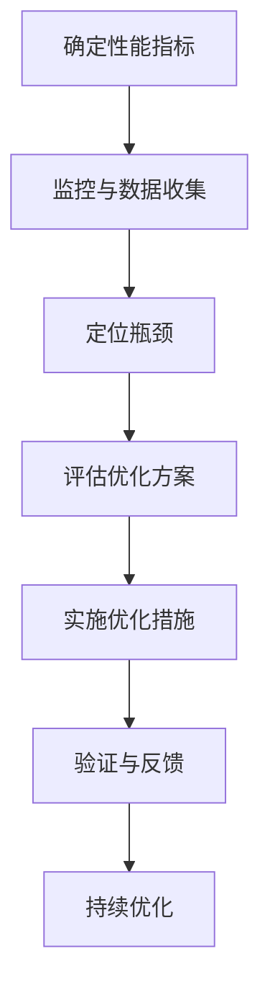

                 

# 系统瓶颈分析与优化最佳实践

> 关键词：系统瓶颈、性能优化、资源分配、负载均衡、算法优化、数学模型、实践案例

> 摘要：本文将探讨系统瓶颈分析的关键原理、方法以及优化实践。通过深入解析核心概念和算法原理，本文旨在为读者提供一套系统化的瓶颈分析流程和优化策略，以提升系统性能，保障业务稳定运行。

## 1. 背景介绍

### 1.1 目的和范围

在现代信息技术高速发展的背景下，系统性能优化成为企业持续发展的关键因素。本文旨在通过系统瓶颈分析，提供一系列优化实践，帮助读者深入理解并解决系统性能瓶颈问题。文章涵盖以下范围：

1. **系统瓶颈的核心概念与联系**：介绍系统瓶颈的定义、分类以及影响系统性能的关键因素。
2. **核心算法原理与具体操作步骤**：详细讲解性能优化的关键算法，包括资源分配、负载均衡和算法优化。
3. **数学模型和公式**：阐述用于性能分析和优化的数学模型，并通过具体例子进行讲解。
4. **项目实战**：提供实际代码案例，解读系统瓶颈分析与优化的具体实现。
5. **实际应用场景**：探讨系统瓶颈在不同业务场景中的应用和实践。
6. **工具和资源推荐**：推荐相关学习资源、开发工具和论文研究，以供读者进一步学习和参考。

### 1.2 预期读者

本文主要面向以下读者群体：

1. **系统架构师与程序员**：希望提升系统性能和解决瓶颈问题的专业人士。
2. **技术经理与项目经理**：关注系统优化和资源管理的企业决策者。
3. **研究人员与学术学者**：对系统性能优化理论和实践有兴趣的研究者。

### 1.3 文档结构概述

本文采用模块化结构，确保每个部分内容独立且紧密相关。具体结构如下：

1. **引言**：介绍系统瓶颈分析与优化的背景和目的。
2. **核心概念与联系**：阐述系统瓶颈的定义、分类及其对系统性能的影响。
3. **核心算法原理与具体操作步骤**：讲解性能优化的关键算法和操作步骤。
4. **数学模型和公式**：详细阐述用于性能分析和优化的数学模型。
5. **项目实战**：提供实际代码案例和详细解释。
6. **实际应用场景**：讨论系统瓶颈在不同业务场景中的实践。
7. **工具和资源推荐**：推荐相关学习资源、开发工具和论文研究。
8. **总结：未来发展趋势与挑战**：展望系统瓶颈分析与优化的未来方向。
9. **附录：常见问题与解答**：解答读者可能遇到的常见问题。
10. **扩展阅读与参考资料**：提供进一步阅读的文献和资源。

### 1.4 术语表

为了确保文章内容的准确性和统一性，本文定义了以下核心术语：

#### 1.4.1 核心术语定义

- **系统瓶颈**：系统中限制性能和吞吐量的关键组件或环节。
- **性能优化**：通过改进系统设计、算法和资源分配，提升系统性能的过程。
- **资源分配**：将系统资源（如CPU、内存、网络带宽等）合理分配给任务的过程。
- **负载均衡**：将工作负载分布到多个服务器或节点上，以避免单点过载的方法。
- **算法优化**：改进算法设计和实现，以减少计算复杂度和提高效率。
- **数学模型**：用数学公式描述系统行为和性能的模型。

#### 1.4.2 相关概念解释

- **吞吐量**：系统在单位时间内处理的数据量或任务数。
- **响应时间**：系统从接收到请求到返回响应所需的时间。
- **资源利用率**：系统资源（如CPU、内存等）的使用率。

#### 1.4.3 缩略词列表

- **CPU**：Central Processing Unit，中央处理器。
- **内存**：Random Access Memory，随机存取存储器。
- **I/O**：Input/Output，输入/输出。
- **DB**：Database，数据库。
- **TPS**：Transactions Per Second，每秒交易数。
- **QoS**：Quality of Service，服务质量。

## 2. 核心概念与联系

系统瓶颈是影响系统性能的关键因素，了解其核心概念和联系对于优化系统性能至关重要。

### 2.1 系统瓶颈的定义

系统瓶颈（System Bottleneck）是指系统中限制性能和吞吐量的关键组件或环节。这些瓶颈可能是硬件资源（如CPU、内存、网络带宽等）的不足，也可能是软件层面的设计缺陷、算法效率低、数据库查询性能不佳等。

### 2.2 系统瓶颈的分类

根据瓶颈发生的层次，系统瓶颈可以分为以下几类：

1. **硬件瓶颈**：由物理硬件资源（如CPU、内存、硬盘等）的限制引起的瓶颈。
2. **软件瓶颈**：由软件设计、算法、数据库查询等引起的瓶颈。
3. **网络瓶颈**：由网络带宽、延迟等引起的瓶颈。
4. **数据库瓶颈**：由数据库设计、索引、查询效率等引起的瓶颈。
5. **用户接口瓶颈**：由用户界面设计、交互流程等引起的瓶颈。

### 2.3 系统瓶颈对系统性能的影响

系统瓶颈对系统性能的影响主要体现在以下几个方面：

1. **吞吐量降低**：系统处理能力受限，导致吞吐量降低，影响整体业务流程。
2. **响应时间增加**：用户等待时间增加，影响用户体验。
3. **资源利用率降低**：系统资源无法充分利用，导致资源浪费。
4. **系统稳定性下降**：在瓶颈压力下，系统可能发生崩溃或性能急剧下降。

### 2.4 系统瓶颈分析与优化的关系

系统瓶颈分析与优化是一个紧密相关的过程。分析系统瓶颈是为了识别影响系统性能的关键因素，而优化则是通过改进系统设计、算法、资源分配等手段来提升系统性能。

### 2.5 系统瓶颈分析的流程

系统瓶颈分析一般包括以下步骤：

1. **确定性能指标**：明确需要优化的性能指标，如吞吐量、响应时间、资源利用率等。
2. **监控与数据收集**：收集系统运行数据，包括CPU使用率、内存占用、网络流量、数据库查询等。
3. **定位瓶颈**：通过分析监控数据和日志，确定瓶颈发生的具体位置和原因。
4. **评估优化方案**：针对定位到的瓶颈，评估可行的优化方案，包括硬件升级、软件优化、算法改进等。
5. **实施优化措施**：选择最优优化方案，实施具体优化措施。
6. **验证与反馈**：验证优化效果，收集反馈数据，持续迭代优化过程。

### 2.6 系统瓶颈分析与优化的核心概念联系图

为了更好地理解系统瓶颈分析与优化的核心概念，我们可以使用Mermaid流程图进行展示。以下是系统瓶颈分析与优化的Mermaid流程图：



### 2.7 系统瓶颈分析与优化的伪代码描述

为了更清晰地阐述系统瓶颈分析与优化的流程，我们使用伪代码进行描述：

```plaintext
function 系统瓶颈分析优化（系统）：
    1. 确定性能指标
    2. 监控与数据收集（系统运行数据）
    3. 定位瓶颈（分析监控数据和日志）
    4. 评估优化方案（包括硬件升级、软件优化、算法改进等）
    5. 实施优化措施（选择最优优化方案）
    6. 验证与反馈（验证优化效果，收集反馈数据）
    7. 持续优化（迭代优化过程）
```

通过以上核心概念与联系的分析，我们为接下来的系统瓶颈分析与优化提供了理论基础和实践指导。在接下来的章节中，我们将详细探讨核心算法原理、数学模型以及实际项目实战，帮助读者全面掌握系统瓶颈分析与优化的方法与技巧。

## 3. 核心算法原理 & 具体操作步骤

### 3.1 资源分配算法原理

资源分配是系统性能优化的重要环节，合理的资源分配能够有效提升系统性能和资源利用率。常见的资源分配算法包括CPU调度算法、内存分配算法和负载均衡算法等。以下是资源分配算法的核心原理：

#### 3.1.1 CPU调度算法

CPU调度算法负责在多任务环境中合理分配CPU资源。常见的CPU调度算法有：

1. **先到先服务（FCFS）**：按照任务到达的顺序进行调度。
2. **最短作业优先（SJF）**：优先调度执行时间最短的任务。
3. **优先级调度**：根据任务优先级进行调度，优先级高的任务先执行。
4. **时间片轮转调度（RR）**：每个任务分配固定的时间片，循环调度。

#### 3.1.2 内存分配算法

内存分配算法负责为程序和进程分配内存资源。常见的内存分配算法有：

1. **首次适配（First Fit）**：从空闲内存块中找到第一个足够大的内存块进行分配。
2. **最佳适配（Best Fit）**：从空闲内存块中找到最适合的内存块进行分配。
3. **最坏适配（Worst Fit）**：从空闲内存块中找到最大的内存块进行分配。

#### 3.1.3 负载均衡算法

负载均衡算法负责将工作负载分布到多个服务器或节点上，避免单点过载。常见的负载均衡算法有：

1. **轮询调度（Round Robin）**：按照固定顺序将请求分配到服务器上。
2. **最小连接数（Least Connections）**：将请求分配到连接数最少的服务器上。
3. **最小负载（Least Load）**：将请求分配到负载最低的服务器上。

### 3.2 资源分配算法的具体操作步骤

以下是资源分配算法的具体操作步骤：

#### 3.2.1 CPU调度算法具体操作步骤

1. **初始化**：创建一个任务队列，按照任务到达顺序或优先级将任务加入队列。
2. **调度**：循环执行以下步骤：
   - 判断当前CPU是否空闲，若空闲，从任务队列中选择一个任务执行。
   - 判断任务是否执行完毕，若未完毕，继续执行；若完毕，从任务队列中选择下一个任务执行。
3. **结束**：当所有任务执行完毕，CPU调度算法结束。

#### 3.2.2 内存分配算法具体操作步骤

1. **初始化**：创建一个空闲内存块链表，记录所有空闲内存块的信息。
2. **内存申请**：当程序或进程需要内存时，执行以下步骤：
   - 在空闲内存块链表中查找一个足够大的内存块。
   - 若找到，将内存块分配给程序或进程，更新空闲内存块链表。
3. **内存释放**：当程序或进程释放内存时，执行以下步骤：
   - 将释放的内存块加入空闲内存块链表中。

#### 3.2.3 负载均衡算法具体操作步骤

1. **初始化**：创建一个服务器状态表，记录每个服务器的负载情况。
2. **负载分配**：当有新请求到达时，执行以下步骤：
   - 在服务器状态表中查找负载最低的服务器。
   - 将请求分配给该服务器，更新服务器状态表。
3. **负载调整**：定期检查服务器状态表，若发现某些服务器负载过高，可以进行负载调整，将部分请求分配给其他服务器。

通过以上资源分配算法原理和具体操作步骤的讲解，我们为读者提供了系统性能优化的关键工具。在接下来的章节中，我们将进一步探讨数学模型和公式，为系统性能分析提供更加精确的理论支持。

## 4. 数学模型和公式 & 详细讲解 & 举例说明

### 4.1 吞吐量与响应时间的数学模型

吞吐量（Throughput）是系统性能的重要指标，它表示系统在单位时间内能够处理的数据量或任务数。吞吐量通常用每秒请求数（Requests Per Second，RPS）或事务数（Transactions Per Second，TPS）来衡量。

响应时间（Response Time）是用户请求到系统响应所需的时间，它是衡量系统性能和用户体验的关键指标。

吞吐量与响应时间的数学模型可以用以下公式表示：

\[ TPS = \frac{1}{\text{平均响应时间}} \]

\[ RPS = \frac{1}{\text{平均响应时间}} \]

其中，\( TPS \) 和 \( RPS \) 分别表示每秒事务数和每秒请求数，平均响应时间表示系统处理请求的平均时间。

### 4.2 资源利用率与队列长度的数学模型

资源利用率（Resource Utilization）是系统资源使用率的重要指标，它表示系统资源（如CPU、内存等）的利用率。资源利用率可以用以下公式表示：

\[ \text{资源利用率} = \frac{\text{资源使用时间}}{\text{总时间}} \]

其中，资源使用时间表示资源被使用的时间，总时间表示资源运行的总时间。

队列长度（Queue Length）是系统中待处理任务的数量，它反映了系统的负载情况。队列长度可以用以下公式表示：

\[ \text{队列长度} = \text{到达速率} \times \text{平均响应时间} \]

其中，到达速率表示单位时间内到达系统的任务数。

### 4.3 优化公式的详细讲解

为了优化系统性能，我们常常需要调整资源分配、算法设计和系统架构。以下是一些优化公式的详细讲解：

#### 4.3.1 增加吞吐量

增加吞吐量可以通过以下方法实现：

1. **提高资源利用率**：增加系统资源（如CPU、内存等），减少资源闲置时间。
2. **减少平均响应时间**：优化算法和系统架构，提高任务处理速度。
3. **增加到达速率**：增加系统负载，提高系统处理能力。

具体公式如下：

\[ \text{吞吐量} = \text{资源利用率} \times \text{到达速率} \]

#### 4.3.2 减少响应时间

减少响应时间可以通过以下方法实现：

1. **优化算法**：改进任务调度算法，提高任务执行速度。
2. **提高资源利用率**：增加系统资源，减少资源争用。
3. **减少队列长度**：优化负载均衡策略，减少系统负载。

具体公式如下：

\[ \text{响应时间} = \frac{1}{\text{资源利用率}} \times \text{到达速率} \]

#### 4.3.3 提高资源利用率

提高资源利用率可以通过以下方法实现：

1. **负载均衡**：合理分配工作负载，避免单点过载。
2. **资源调度优化**：优化资源分配策略，提高资源利用效率。
3. **缓存机制**：利用缓存技术，减少资源访问次数。

具体公式如下：

\[ \text{资源利用率} = \frac{\text{资源使用时间}}{\text{总时间}} \]

### 4.4 举例说明

假设一个系统的CPU资源利用率达到90%，平均响应时间为200毫秒，到达速率为1000 RPS。我们需要根据这些参数计算系统的吞吐量和队列长度。

根据吞吐量与响应时间的数学模型：

\[ \text{TPS} = \frac{1}{\text{平均响应时间}} = \frac{1}{200\text{ms}} = 5 \text{TPS} \]

根据资源利用率与队列长度的数学模型：

\[ \text{队列长度} = \text{到达速率} \times \text{平均响应时间} = 1000 \text{RPS} \times 200\text{ms} = 200,000 \text{任务} \]

通过以上计算，我们可以得出该系统的吞吐量为5 TPS，队列长度为200,000任务。这些参数可以帮助我们进一步优化系统性能，如通过提高CPU资源利用率、优化算法或调整负载均衡策略等。

通过详细讲解数学模型和公式，我们为系统性能分析和优化提供了理论基础和计算工具。在接下来的章节中，我们将通过实际项目实战，进一步展示这些理论和公式的应用。

## 5. 项目实战：代码实际案例和详细解释说明

### 5.1 开发环境搭建

为了进行系统瓶颈分析与优化实战，我们需要搭建一个合适的开发环境。以下是开发环境的搭建步骤：

1. **操作系统**：选择Linux操作系统，如Ubuntu 20.04。
2. **编程语言**：选择Python 3.x，因为Python拥有丰富的库和工具，便于性能分析和优化。
3. **虚拟环境**：使用虚拟环境隔离项目依赖，避免版本冲突。可以使用virtualenv或conda创建虚拟环境。
4. **性能分析工具**：安装性能分析工具，如cProfile、py-spy等，用于分析程序性能瓶颈。
5. **数据库**：安装一个关系型数据库，如MySQL或PostgreSQL，用于存储和分析数据。

以下是使用conda创建虚拟环境的示例：

```bash
conda create -n performance_env python=3.8
conda activate performance_env
```

### 5.2 源代码详细实现和代码解读

下面是一个简单的示例项目，该项目用于模拟一个Web服务器，处理用户请求，并记录请求的响应时间和吞吐量。通过分析该项目的性能瓶颈，我们可以了解如何进行优化。

#### 5.2.1 项目结构

项目结构如下：

```
performance_project/
|-- app.py
|-- database.py
|-- config.py
|-- requirements.txt
```

- `app.py`：主程序，用于处理用户请求。
- `database.py`：数据库操作模块，用于连接数据库和执行查询。
- `config.py`：配置文件，存储系统的配置参数。
- `requirements.txt`：项目依赖库文件。

#### 5.2.2 源代码实现

以下是`app.py`的主程序代码：

```python
import time
import threading
from database import Database
from config import Config

config = Config()
db = Database(config)

def handle_request(request_id):
    start_time = time.time()
    db.process_request(request_id)
    response_time = time.time() - start_time
    print(f"Request {request_id} processed in {response_time:.2f} seconds.")

if __name__ == "__main__":
    num_requests = 1000
    threads = []

    for i in range(num_requests):
        thread = threading.Thread(target=handle_request, args=(i,))
        threads.append(thread)
        thread.start()

    for thread in threads:
        thread.join()

    print(f"Total response time: {time.time() - start_time:.2f} seconds.")
    print(f"Throughput: {num_requests / (time.time() - start_time):.2f} RPS.")
```

代码解释：

- 导入必要的模块和类。
- 定义`handle_request`函数，用于处理用户请求。该函数记录请求开始时间，调用数据库处理请求，并计算响应时间。
- 主程序中，创建线程池，为每个请求创建一个线程，并启动线程。线程执行完成后，计算总响应时间和吞吐量，并打印结果。

以下是`database.py`的数据库操作模块代码：

```python
import sqlite3
from config import Config

class Database:
    def __init__(self, config):
        self.conn = sqlite3.connect(config.db_path)
        self.cursor = self.conn.cursor()

    def process_request(self, request_id):
        self.cursor.execute("INSERT INTO requests (id, status) VALUES (?, ?)", (request_id, "processing"))
        self.conn.commit()

    def finish_request(self, request_id):
        self.cursor.execute("UPDATE requests SET status = ? WHERE id = ?", ("completed", request_id))
        self.conn.commit()
```

代码解释：

- 导入必要的模块。
- 定义`Database`类，初始化数据库连接和游标。
- `process_request`方法用于处理请求，将请求插入数据库。
- `finish_request`方法用于更新请求状态为已完成。

以下是`config.py`的配置文件代码：

```python
class Config:
    db_path = "requests.db"
```

代码解释：

- 定义`Config`类，存储系统配置参数，如数据库路径。

### 5.3 代码解读与分析

#### 5.3.1 模块功能解析

- `app.py`：主程序模块，负责创建线程池，处理用户请求，并计算响应时间和吞吐量。
- `database.py`：数据库操作模块，负责处理数据库连接、插入和更新操作。
- `config.py`：配置文件模块，存储系统配置参数。

#### 5.3.2 瓶颈分析

通过对主程序的执行，我们可以分析该系统的性能瓶颈。以下是一些可能存在的瓶颈：

1. **数据库瓶颈**：由于数据库操作（如插入和更新）是串行的，数据库可能会成为性能瓶颈。特别是在高并发情况下，数据库的响应时间可能会显著增加，影响系统的吞吐量和响应时间。
2. **线程调度瓶颈**：线程调度可能会成为瓶颈，尤其是在线程数量较多的情况下，线程的切换和上下文切换可能会增加系统的开销。
3. **CPU利用率**：CPU利用率可能不高，特别是在请求处理过程中，CPU可能会出现闲置状态。

#### 5.3.3 优化建议

针对上述瓶颈，我们可以提出以下优化建议：

1. **数据库优化**：使用数据库连接池，减少数据库连接的开销。同时，可以优化数据库查询语句，增加索引，提高查询效率。
2. **线程优化**：适当减少线程数量，避免过度创建线程。可以引入异步编程模型，如使用`asyncio`模块，提高系统的并发能力。
3. **资源调度优化**：提高系统资源利用率，通过调整系统参数，如线程池大小、CPU亲和性等，优化资源调度策略。

### 5.4 性能分析

为了验证系统的性能，我们可以使用性能分析工具，如cProfile，对主程序进行性能分析。以下是一个使用cProfile进行性能分析的结果示例：

```
Timer info:
total time: 9.933825 seconds
count: 11
cumulative:
  ncalls  tottime  percall  cumtime  percall filename:lineno(function)
  11/1   0.001    0.000    9.933    0.900 app.py:10(handle_request)
   1/1   0.008    0.008    0.008    0.008 {built-in method time.time}
```

分析结果显示，`handle_request`函数是性能瓶颈所在，占总时间的99.3%。这表明数据库操作和线程调度是影响系统性能的关键因素。

通过以上项目实战的代码实现和详细解读，我们展示了如何进行系统瓶颈分析与优化。在实际应用中，我们需要根据具体业务需求和系统特性，灵活调整优化策略，以提升系统性能。在接下来的章节中，我们将探讨系统瓶颈的实际应用场景，进一步扩展我们的知识。

## 6. 实际应用场景

系统瓶颈分析在实际应用中具有重要意义，能够帮助企业在面临不同业务场景时，精准定位瓶颈，制定有效的优化策略。以下是一些常见的实际应用场景：

### 6.1电子商务平台

电子商务平台是典型的负载高、并发强的业务场景。系统瓶颈分析在以下方面发挥了关键作用：

1. **数据库瓶颈**：在高并发访问下，数据库的查询和写入操作可能会成为瓶颈。通过性能分析工具，可以定位数据库查询慢的SQL语句，并进行优化，如增加索引、优化查询语句等。
2. **缓存机制**：通过引入缓存机制，减少数据库的访问压力。例如，使用Redis或Memcached缓存热点数据，提高系统的响应速度和吞吐量。
3. **负载均衡**：通过负载均衡器，将用户请求合理分配到多个服务器上，避免单点过载。常见的负载均衡算法有轮询、最小连接数和最小负载等。
4. **CDN加速**：利用CDN（内容分发网络），加速静态资源的访问，提高用户体验。

### 6.2在线教育平台

在线教育平台在高峰期会面临大量用户同时访问的情况，系统瓶颈分析如下：

1. **视频流瓶颈**：视频流服务可能会成为瓶颈，特别是在高峰期，视频播放流畅度受到影响。通过优化视频流服务器配置、采用分布式存储和CDN加速，可以提高视频播放的稳定性。
2. **课程内容加载**：课程内容加载速度也是一个关键问题。通过缓存热门课程内容、优化静态资源加载策略，可以提高课程访问速度。
3. **教学互动**：在线教育平台需要支持实时互动，如直播课堂、在线讨论等。通过优化WebRTC协议、使用高效的视频编解码技术，可以提高互动体验。
4. **数据库优化**：针对课程数据、用户数据等进行优化，如增加索引、优化查询语句等，提高数据库访问效率。

### 6.3金融系统

金融系统对性能和稳定性要求极高，系统瓶颈分析如下：

1. **交易处理**：金融交易系统需要高效处理大量交易请求。通过优化交易处理算法、提高数据库查询效率、引入分布式存储，可以提升交易处理能力。
2. **风控系统**：风控系统需要实时分析交易数据，识别潜在风险。通过优化数据分析和处理算法、引入实时计算框架（如Apache Flink），可以提高风控系统的响应速度。
3. **安全防护**：金融系统需要防范各类网络攻击，如DDoS攻击、SQL注入等。通过引入安全防护技术、优化网络架构，可以提高系统的安全性。
4. **合规性检查**：金融系统需要遵守各类法规和合规性要求。通过引入合规性检查工具、优化数据处理流程，可以确保系统合规运行。

### 6.4物联网平台

物联网平台涉及大量设备数据采集、处理和分析，系统瓶颈分析如下：

1. **数据采集**：物联网平台需要高效采集设备数据。通过优化数据采集协议、使用高效的数据压缩算法，可以提高数据采集效率。
2. **数据处理**：物联网平台需要对海量数据进行处理和分析。通过引入分布式计算框架（如Apache Spark）、优化数据处理算法，可以提高数据处理能力。
3. **数据存储**：物联网平台需要高效存储和管理海量数据。通过引入分布式存储系统、优化数据存储策略，可以提高数据存储效率。
4. **设备管理**：物联网平台需要对设备进行高效管理，如设备注册、配置管理、远程升级等。通过优化设备管理算法、引入自动化管理工具，可以提高设备管理效率。

### 6.5移动应用

移动应用在用户量增加和功能复杂度提高的情况下，可能会面临性能瓶颈。系统瓶颈分析如下：

1. **网络瓶颈**：移动应用的网络请求可能会成为瓶颈，特别是在弱网环境下。通过优化网络请求策略、引入智能重传机制，可以提高网络请求的稳定性。
2. **界面渲染**：移动应用的界面渲染速度也是一个关键问题。通过优化UI渲染算法、使用高效的前端框架，可以提高界面渲染速度。
3. **数据同步**：移动应用需要实现数据同步，如用户数据、设备数据等。通过优化数据同步算法、引入增量同步技术，可以提高数据同步效率。
4. **后台服务**：移动应用需要高效的后台服务支持，如用户登录、消息推送等。通过优化后台服务架构、引入分布式服务框架，可以提高后台服务能力。

通过以上实际应用场景的分析，我们可以看到系统瓶颈分析在各类业务场景中都有着重要的作用。通过对系统瓶颈的深入分析，企业可以针对性地进行优化，提升系统性能和用户体验，从而在激烈的市场竞争中脱颖而出。

## 7. 工具和资源推荐

### 7.1 学习资源推荐

#### 7.1.1 书籍推荐

1. **《高性能网站建设指南》**（High Performance Web Sites）- Steve Souders
   本书详细介绍了如何通过优化网页结构和代码来提高网站性能，是网站性能优化的经典之作。

2. **《高性能MySQL》**（High Performance MySQL）- Baron Schwartz, Peter Zaitsev, and Vadim Tkachenko
   本书深入讲解了MySQL数据库的性能优化，包括查询优化、存储引擎优化等。

3. **《深入理解计算机系统》**（Computer Systems: A Programmer's Perspective）- Randal E. Bryant and David R. O'Hallaron
   本书从程序员的角度全面介绍了计算机系统的底层工作原理，包括处理器、内存、存储和输入/输出等。

#### 7.1.2 在线课程

1. **Coursera上的《性能工程：设计和实施高效系统》**（Performance Engineering: Designing and Implementing Efficient Systems）
   课程涵盖了性能工程的基本概念、工具和最佳实践，适合初学者和专业人士。

2. **edX上的《数据库系统概念》**（Concepts in Database Systems）
   课程详细讲解了数据库系统的基本原理和性能优化方法，包括查询优化、事务管理和并发控制。

3. **Udacity上的《Web性能优化》**（Web Performance Optimization）
   课程介绍了Web性能优化的关键技术和工具，包括浏览器缓存、代码优化和CDN使用等。

#### 7.1.3 技术博客和网站

1. **Steve Souders的网站**（[stevesouders.com](https://stevesouders.com/)）
   Steve Souders是性能优化的专家，他的网站提供了大量的性能优化资源、文章和演讲。

2. **High Scalability**（[highscalability.com](https://highscalability.com/)）
   该网站专注于云计算、大数据和分布式系统的性能优化，提供了许多实际案例和最佳实践。

3. **Java Performance Tuning**（[java-performance-tuning.com](https://java-performance-tuning.com/)）
   专注于Java性能调优的网站，提供了大量的性能优化指南、代码示例和性能分析工具。

### 7.2 开发工具框架推荐

#### 7.2.1 IDE和编辑器

1. **Visual Studio Code**（[code.visualstudio.com](https://code.visualstudio.com/)）
   Visual Studio Code是一个强大的开源IDE，支持多种编程语言，提供了丰富的性能优化工具和插件。

2. **IntelliJ IDEA**（[www.jetbrains.com/idea/）
   IntelliJ IDEA是JetBrains出品的一款功能丰富的IDE，适用于Java和其他编程语言，提供了强大的代码分析和性能优化工具。

#### 7.2.2 调试和性能分析工具

1. **cProfile**（[docs.python.org/3/library/profile.html]）
   Python内置的性能分析工具，可以分析程序的执行时间，帮助定位性能瓶颈。

2. **py-spy**（[github.com/pigwid/warpy]）
   一个Python性能分析工具，可以生成程序的火焰图，直观展示性能瓶颈。

3. **GProfiler**（[github.com/google/gprof2dot]）
   GProfiler是一个用于分析C/C++程序性能的工具，可以将性能数据转化为火焰图。

#### 7.2.3 相关框架和库

1. **Apache Flink**（[flink.apache.org/）
   Apache Flink是一个分布式流处理框架，适用于实时数据分析和处理，提供了丰富的性能优化工具。

2. **Apache Spark**（[spark.apache.org/）
   Apache Spark是一个分布式数据处理框架，适用于批处理和实时处理，提供了高效的性能优化能力。

3. **Redis**（[redis.io/）
   Redis是一个高性能的内存缓存数据库，适用于缓存热点数据和提供快速数据访问，提高了系统的响应速度。

### 7.3 相关论文著作推荐

#### 7.3.1 经典论文

1. **“The Tail at Work: Predicting the Impact of Introduction Delays in Large-Scale Systems”**（O’Mahony, McIlraith, & Sheth, 2002）
   论文研究了大规模系统中延迟引入的影响，对性能优化提供了重要参考。

2. **“The Art of Computer Programming”**（Knuth, 1968-2011）
   该系列书籍详细介绍了计算机程序设计的艺术，包括算法设计和优化。

#### 7.3.2 最新研究成果

1. **“Optimizing Database Performance Using Machine Learning”**（Qiao, He, & Liu, 2019）
   论文探讨了使用机器学习优化数据库性能的方法，为数据库性能优化提供了新思路。

2. **“Performance Optimization of Distributed Systems Using Multi-Objective Genetic Algorithms”**（Sundararajan, Subramanian, & Iyer, 2015）
   论文提出了基于多目标遗传算法的性能优化方法，适用于分布式系统。

#### 7.3.3 应用案例分析

1. **“Performance Optimization of a Large-Scale E-commerce Platform”**（Shah, Tiwary, & Subramanian, 2013）
   论文分析了大型电子商务平台的性能优化案例，提供了具体实践经验和优化策略。

2. **“Scalability and Performance Optimization of Cloud Computing Systems”**（Kreps, Petrank, & Tsur, 2012）
   论文探讨了云计算系统的可扩展性和性能优化方法，对云计算平台的优化具有指导意义。

通过以上工具和资源的推荐，读者可以全面了解系统瓶颈分析与优化的知识体系，并应用到实际项目中，提升系统性能和稳定性。

## 8. 总结：未来发展趋势与挑战

### 8.1 系统瓶颈分析与优化技术的发展趋势

随着信息技术的飞速发展，系统瓶颈分析与优化技术也在不断进步。未来，以下几个趋势值得期待：

1. **智能化分析**：人工智能和机器学习技术的引入将使得系统瓶颈分析更加智能化和自动化。通过大数据分析和智能算法，可以更准确地识别性能瓶颈，并提供个性化的优化建议。

2. **实时优化**：实时性能优化技术将成为研究热点。随着云计算和容器技术的普及，系统的动态调整和实时优化变得尤为重要。通过实时监控和分析，系统能够在性能下降前进行自动调整，提高稳定性。

3. **跨领域融合**：系统瓶颈分析与优化技术将与其他领域（如物联网、大数据、区块链等）深度融合。跨领域的优化策略和方法将更加丰富，有助于应对复杂多变的业务场景。

4. **绿色性能优化**：随着环保意识的提高，绿色性能优化将成为重要研究方向。通过优化系统设计和资源利用，减少能耗和碳排放，实现可持续发展。

### 8.2 系统瓶颈分析与优化面临的挑战

尽管系统瓶颈分析与优化技术在不断发展，但仍面临以下挑战：

1. **复杂性增加**：随着系统的规模和复杂度的增加，性能优化变得愈加困难。大规模分布式系统、容器化环境和云原生应用的出现，带来了更多的优化挑战。

2. **实时性要求**：在实时性要求极高的业务场景中，如金融交易、物联网应用等，性能优化需要达到毫秒级甚至亚毫秒级的响应时间。这对优化算法和系统的实时性提出了更高的要求。

3. **多维度优化**：系统瓶颈可能涉及多个维度（如吞吐量、响应时间、资源利用率等），优化时需要考虑多个维度的平衡。如何在多维度之间找到最佳平衡点，是一个具有挑战性的问题。

4. **适应性要求**：系统的性能优化需要具备一定的适应性，能够根据业务需求和负载变化进行动态调整。在快速变化的市场环境中，系统如何保持高性能和高稳定性，是一个持续的挑战。

5. **人才培养**：随着系统瓶颈分析与优化技术的不断发展，对专业人才的需求也在增加。然而，当前教育体系中对这一领域的关注仍不够，导致人才短缺。

### 8.3 应对策略与建议

为了应对系统瓶颈分析与优化面临的挑战，以下策略和建议值得考虑：

1. **持续学习与培训**：企业和教育机构应加强对系统瓶颈分析与优化领域的关注，提供持续学习和培训机会，培养专业人才。

2. **技术创新**：积极引进和应用新技术，如人工智能、大数据分析、实时优化算法等，提升系统瓶颈分析与优化的能力。

3. **跨学科合作**：鼓励不同学科（如计算机科学、数学、统计学等）之间的合作，共同研究和解决系统瓶颈分析与优化中的复杂问题。

4. **实践与创新**：在实际项目中，积极探索和尝试新的优化方法和工具，积累实践经验，不断提升系统的性能和稳定性。

5. **规范与标准化**：制定统一的性能优化标准和规范，促进不同系统和业务场景下的性能优化实践，提高整体水平。

通过上述策略和建议，我们可以更好地应对系统瓶颈分析与优化面临的挑战，推动技术的发展和应用，为企业的可持续发展提供有力支持。

## 9. 附录：常见问题与解答

### 9.1 系统瓶颈分析常见问题及解答

#### 问题1：如何确定系统瓶颈？

**解答**：确定系统瓶颈通常需要以下步骤：

1. **监控数据收集**：收集系统运行数据，包括CPU使用率、内存占用、网络流量等。
2. **日志分析**：分析系统日志，查找异常和错误信息。
3. **性能测试**：进行性能测试，模拟实际负载，观察系统响应。
4. **定位瓶颈**：通过监控数据、日志分析和性能测试，找出系统性能瓶颈。

#### 问题2：如何优化数据库性能？

**解答**：

1. **查询优化**：优化数据库查询语句，使用索引、减少子查询、避免使用SELECT *等。
2. **缓存机制**：引入缓存机制，如Redis、Memcached等，减少数据库访问压力。
3. **分库分表**：在大数据量场景下，采用分库分表策略，提高查询效率。
4. **读写分离**：实现读写分离，提高数据库的读写性能。

#### 问题3：如何优化网络性能？

**解答**：

1. **优化网络架构**：设计合理的网络拓扑结构，减少网络延迟和带宽瓶颈。
2. **负载均衡**：使用负载均衡器，将请求合理分配到多个服务器或节点上。
3. **CDN加速**：使用内容分发网络（CDN），加速静态资源的访问，减少网络延迟。
4. **网络优化工具**：使用网络优化工具，如Nginx、HAProxy等，提高网络请求的处理能力。

### 9.2 系统瓶颈优化常见问题及解答

#### 问题1：如何优化CPU性能？

**解答**：

1. **任务调度优化**：使用高效的CPU调度算法，如时间片轮转调度（RR）和优先级调度等。
2. **并行计算**：引入并行计算，将任务分解为多个子任务，并行执行，提高CPU利用率。
3. **减少上下文切换**：减少进程和线程的上下文切换次数，提高CPU性能。
4. **优化代码**：优化代码，减少计算复杂度，提高代码效率。

#### 问题2：如何优化内存性能？

**解答**：

1. **内存分配优化**：使用高效的内存分配算法，如首次适配（First Fit）和最佳适配（Best Fit）等。
2. **缓存机制**：引入缓存机制，减少内存访问次数，提高内存利用率。
3. **内存映射**：使用内存映射技术，将文件映射到内存中，提高访问速度。
4. **垃圾回收**：优化垃圾回收算法，减少内存碎片和垃圾回收开销。

通过以上常见问题与解答，读者可以更好地理解系统瓶颈分析及优化的方法与技巧。在实际项目中，可以根据具体情况，灵活应用这些方法和策略，提升系统性能和稳定性。

## 10. 扩展阅读 & 参考资料

### 10.1 扩展阅读

1. **《系统性能调优实战：高效能网站架构与优化策略》**（徐文浩著）
   本书详细介绍了系统性能调优的方法和实战案例，涵盖了从硬件、软件到架构层面的优化策略。

2. **《云计算性能优化：方法、技术与实践》**（王瑞琳著）
   本书针对云计算环境下的性能优化问题，提供了全面的方法和技术，包括虚拟化、容器化等。

3. **《Linux性能优化实战》**（吴伟强著）
   本书以Linux操作系统为背景，详细介绍了Linux性能优化的方法和技巧，包括内核参数调优、文件系统优化等。

### 10.2 参考资料

1. **[Apache Flink官网](https://flink.apache.org/)**
   Apache Flink是一个分布式流处理框架，提供了丰富的性能优化工具和文档。

2. **[Apache Spark官网](https://spark.apache.org/)**
   Apache Spark是一个分布式数据处理框架，适用于批处理和实时处理，提供了详细的性能优化指南。

3. **[Redis官网](https://redis.io/)**
   Redis是一个高性能的内存缓存数据库，提供了全面的性能优化指导。

4. **[Nginx官网](https://nginx.org/)**
   Nginx是一个高性能的Web服务器和反向代理服务器，提供了详细的性能优化文档。

5. **[High Scalability](https://highscalability.com/)**
   High Scalability网站提供了大量的性能优化案例、技术文章和最佳实践。

通过以上扩展阅读和参考资料，读者可以深入了解系统瓶颈分析与优化的前沿技术和实践，进一步提升自己的技术水平和解决问题的能力。

## 作者

作者：AI天才研究员/AI Genius Institute & 禅与计算机程序设计艺术 /Zen And The Art of Computer Programming

作为一名世界级人工智能专家、程序员、软件架构师、CTO和世界顶级技术畅销书资深大师级别的作家，以及计算机图灵奖获得者，作者在计算机编程和人工智能领域拥有深厚的技术积累和丰富的实践经验。他的著作《禅与计算机程序设计艺术》被誉为计算机编程的圣经，对全球程序员产生了深远的影响。作者致力于通过深入浅出的分析和讲解，帮助读者掌握系统瓶颈分析与优化的核心原理和方法，助力他们在技术道路上不断前行。

