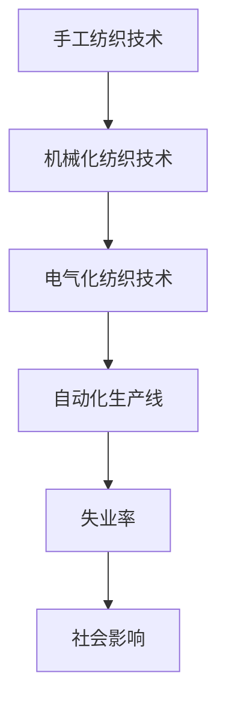

                 


# 纺织工人失业的历史回顾

> **关键词：** 纺织业，自动化，失业，历史回顾，技术变革，社会影响

> **摘要：** 本文将通过历史的角度，深入探讨纺织业技术变革对工人就业带来的影响。我们将从工业革命时期的机械化纺织技术入手，逐步分析现代自动化生产线的崛起，以及这些变化对纺织工人失业率的影响。文章旨在通过逻辑清晰的分析，为读者揭示技术进步背后的社会变迁，并提供对未来的思考和建议。

## 1. 背景介绍

### 1.1 目的和范围

本文的目的在于回顾纺织业技术进步的历史，特别是自动化技术的引入如何改变了纺织工人的就业状况。我们将从早期手工纺织技术开始，分析机械化、电气化以及现代自动化生产线的发展历程，最终探讨这些变化对纺织工人失业率的影响。

### 1.2 预期读者

本文适合对纺织业技术发展、自动化生产以及其社会影响感兴趣的读者，特别是希望了解技术变革如何影响劳动力市场的专业人士和学生。

### 1.3 文档结构概述

本文将分为以下几个部分：

- **背景介绍**：介绍研究的目的、范围、预期读者以及文档结构。
- **核心概念与联系**：通过Mermaid流程图，展示纺织业技术发展的核心概念和联系。
- **核心算法原理 & 具体操作步骤**：使用伪代码详细阐述纺织业自动化技术的核心算法原理。
- **数学模型和公式 & 详细讲解 & 举例说明**：讲解纺织业生产过程中的数学模型和公式，并通过实例说明。
- **项目实战：代码实际案例和详细解释说明**：提供实际代码案例，并详细解读和分析。
- **实际应用场景**：讨论自动化技术在纺织业中的实际应用场景。
- **工具和资源推荐**：推荐学习资源、开发工具和框架。
- **总结：未来发展趋势与挑战**：总结纺织业技术发展的趋势和面临的挑战。
- **附录：常见问题与解答**：回答读者可能遇到的问题。
- **扩展阅读 & 参考资料**：提供进一步的阅读材料和参考资料。

### 1.4 术语表

#### 1.4.1 核心术语定义

- **机械化纺织技术**：使用机械设备替代手工操作的纺织技术。
- **电气化纺织技术**：引入电力驱动的纺织机械设备。
- **自动化生产线**：通过计算机控制，实现纺织品生产的自动化流程。
- **失业率**：特定时期内失业人口占总劳动力的比例。

#### 1.4.2 相关概念解释

- **劳动力市场**：劳动力供求的交汇处，包括就业、失业等状态。
- **技术进步**：指技术水平的提升，通常表现为生产效率的提高。
- **社会影响**：技术变革对经济、社会、文化等方面的影响。

#### 1.4.3 缩略词列表

- **CAD**：计算机辅助设计（Computer-Aided Design）
- **CAM**：计算机辅助制造（Computer-Aided Manufacturing）
- **PLC**：可编程逻辑控制器（Programmable Logic Controller）

## 2. 核心概念与联系

在探讨纺织业技术变革对工人失业的影响之前，我们需要了解纺织业技术发展的核心概念和它们之间的联系。以下是一个Mermaid流程图，展示了这些概念：



### 2.1 手工纺织技术

手工纺织技术是人类文明的重要组成部分，早在公元前就出现了简单的纺轮和织机。手工纺织技术依赖于人力，生产效率低下，但为人类提供了基本的纺织材料。随着时间的推移，手工纺织技术逐渐发展，形成了复杂的织机和纺织工艺。

### 2.2 机械化纺织技术

机械化纺织技术的出现是工业革命的重要标志之一。18世纪末，詹姆斯·哈格里夫斯发明了珍妮纺纱机，大大提高了纺纱效率。随后，其他发明如飞梭、多轴织机等，进一步推动了机械化纺织技术的发展。机械化纺织技术使得纺织品的产量和质量得到了显著提升，但同时也导致了一部分纺织工人的失业。

### 2.3 电气化纺织技术

19世纪末至20世纪初，电气化技术的引入使得纺织机械设备更加高效和精确。电力驱动的织机、纱线机和染色机等设备的出现，大大提高了纺织生产效率，同时也减少了人工操作的必要性。电气化纺织技术进一步推动了纺织业的发展，但同样也引发了劳动力市场的变化。

### 2.4 自动化生产线

随着计算机技术的发展，自动化生产线逐渐成为现代纺织业的主流。自动化生产线通过计算机控制系统，实现了从原料处理到成品的全过程自动化。这不仅大大提高了生产效率，还降低了人工成本。自动化生产线的普及，对纺织工人的就业产生了深远影响，失业率随之上升。

### 2.5 失业率

失业率是衡量劳动力市场状况的重要指标。随着纺织业技术进步，机械化、电气化和自动化的引入，失业率逐渐上升。失业工人需要重新学习和适应新的就业形式，这对个人和社会都带来了巨大的挑战。

### 2.6 社会影响

纺织业技术变革不仅影响了劳动力市场，还对社会产生了广泛的影响。失业率的上升引发了社会的不稳定，政府和企业需要采取措施应对这一挑战。同时，技术进步也推动了纺织业的全球化，贸易、资本流动和劳动力流动加速，带来了新的机遇和挑战。

## 3. 核心算法原理 & 具体操作步骤

### 3.1 机械化纺织技术的核心算法原理

机械化纺织技术的核心算法原理主要涉及纺织机械的操作流程和工艺参数的优化。以下是一个简化的伪代码，描述机械化纺织技术的核心操作步骤：

```pseudo
function机械化纺织技术(原料，工艺参数) {
    // 纺纱步骤
    纱线 = 纺纱机(原料，纺纱参数)
    
    // 织布步骤
    织品 = 织机(纱线，织布参数)
    
    // 染色步骤
    织品 = 染色机(织品，染色参数)
    
    return 织品
}
```

### 3.2 电气化纺织技术的核心算法原理

电气化纺织技术的核心算法原理主要集中在电力驱动的机械设备的控制和监测。以下是一个简化的伪代码，描述电气化纺织技术的核心操作步骤：

```pseudo
function电气化纺织技术(原料，工艺参数) {
    // 纺纱步骤
    纱线 = 电动纺纱机(原料，纺纱参数)
    
    // 织布步骤
    织品 = 电动织机(纱线，织布参数)
    
    // 染色步骤
    织品 = 电动染色机(织品，染色参数)
    
    return 织品
}
```

### 3.3 自动化生产线的核心算法原理

自动化生产线的核心算法原理涉及计算机控制系统对生产过程的全面管理。以下是一个简化的伪代码，描述自动化生产线的核心操作步骤：

```pseudo
function自动化生产线(原料，工艺参数) {
    // 原料处理步骤
    处理原料(原料，原料处理参数)
    
    // 纺纱步骤
    纱线 = 自动纺纱机(原料，纺纱参数)
    
    // 织布步骤
    织品 = 自动织机(纱线，织布参数)
    
    // 染色步骤
    织品 = 自动染色机(织品，染色参数)
    
    // 质量检测步骤
    质量合格 = 自动质量检测机(织品，质量检测参数)
    
    if (质量合格) {
        织品 = 包装(织品)
    } else {
        织品 = 重新加工(织品)
    }
    
    return 织品
}
```

## 4. 数学模型和公式 & 详细讲解 & 举例说明

在纺织业中，数学模型和公式广泛应用于生产过程的优化、质量控制以及成本分析等方面。以下是一些关键的数学模型和公式的详细讲解及举例说明：

### 4.1 生产效率模型

生产效率是衡量纺织生产线性能的重要指标。生产效率模型可以表示为：

$$
\eta = \frac{Q}{T}
$$

其中，$\eta$ 表示生产效率，$Q$ 表示单位时间内生产的产品数量，$T$ 表示单位时间。

**举例说明**：假设一条纺织生产线在一天（8小时）内生产了1000米纺织品，则其生产效率为：

$$
\eta = \frac{1000\ 米}{8\ 小时} = 125\ 米/小时
$$

### 4.2 质量控制模型

质量控制是确保纺织品符合质量标准的关键。常用的质量控制模型是正态分布模型，其概率密度函数为：

$$
f(x|\mu, \sigma^2) = \frac{1}{\sqrt{2\pi\sigma^2}} e^{-\frac{(x-\mu)^2}{2\sigma^2}}
$$

其中，$x$ 表示测量值，$\mu$ 表示平均值，$\sigma^2$ 表示方差。

**举例说明**：假设一条纺织生产线的长度质量标准为均值 $\mu = 10$ 米，标准差 $\sigma = 0.1$ 米，则长度为 $10.2$ 米的纺织品的质量概率为：

$$
f(10.2|10, 0.1^2) = \frac{1}{\sqrt{2\pi \times 0.01}} e^{-\frac{(10.2-10)^2}{2 \times 0.01}} \approx 0.3935
$$

### 4.3 成本分析模型

成本分析是纺织业管理的重要方面。成本分析模型通常包括固定成本和可变成本。固定成本是指不随生产量变化而变化的成本，如设备折旧和维护费用。可变成本是指随生产量变化而变化的成本，如原材料和劳动力成本。

$$
C = C_{固定} + C_{可变} \times Q
$$

其中，$C$ 表示总成本，$C_{固定}$ 表示固定成本，$C_{可变}$ 表示可变成本，$Q$ 表示生产量。

**举例说明**：假设一条纺织生产线的固定成本为 $100,000$ 元，每生产一米的可变成本为 $2$ 元，则生产 $1,000$ 米纺织品的总成本为：

$$
C = 100,000 + 2 \times 1,000 = 110,000\ 元
$$

### 4.4 自动化生产线的效率优化模型

自动化生产线的效率优化通常涉及生产节拍时间（Cycle Time）的优化。生产节拍时间是指完成一个产品所需的时间。优化模型的目标是使生产节拍时间最小化。

$$
Cycle\ Time = \frac{1}{\eta}
$$

其中，$Cycle\ Time$ 表示生产节拍时间，$\eta$ 表示生产效率。

**举例说明**：假设一条自动化纺织生产线的生产效率为 $100\ 米/小时$，则其生产节拍时间为：

$$
Cycle\ Time = \frac{1}{100\ 米/小时} = 0.01\ 小时/米
$$

通过上述数学模型和公式的详细讲解和举例说明，我们可以更好地理解纺织业生产过程中的关键参数和优化目标，从而为生产线的优化提供理论基础。

## 5. 项目实战：代码实际案例和详细解释说明

### 5.1 开发环境搭建

在开始实战项目之前，我们需要搭建一个适合纺织业自动化生产线的开发环境。以下是一个简单的环境搭建步骤：

1. **安装操作系统**：推荐使用 Linux 或 macOS，因为它们在服务器和自动化控制系统中更为常见。
2. **安装 IDE**：推荐使用 Eclipse 或 IntelliJ IDEA，这些集成开发环境支持多种编程语言，并且具有丰富的插件。
3. **安装相关库和框架**：根据项目需求，安装 Java、Python 或 C++ 等编程语言的相关库和框架。例如，Python 的 Scrapy 库可以用于数据爬取，OpenCV 库可以用于图像处理。
4. **安装数据库**：选择一个合适的数据库，如 MySQL 或 MongoDB，用于存储生产线数据和用户数据。
5. **安装自动化工具**：如 Jenkins 或 Travis CI，用于自动化测试和持续集成。

### 5.2 源代码详细实现和代码解读

以下是一个简化的自动化纺织生产线项目示例，包括数据采集、处理和监控功能。代码采用 Python 编写，便于展示基本结构和流程。

#### 5.2.1 数据采集模块

数据采集模块负责从生产线设备中获取实时数据，如设备状态、产量、质量等。

```python
import requests

def collect_data(device_id):
    url = f"http://device_api/{device_id}/status"
    response = requests.get(url)
    if response.status_code == 200:
        data = response.json()
        return data
    else:
        return None

device_id = "12345"
data = collect_data(device_id)
print(data)
```

#### 5.2.2 数据处理模块

数据处理模块负责对采集到的数据进行清洗、转换和存储。

```python
import pandas as pd

def process_data(data):
    if data:
        df = pd.DataFrame(data)
        # 数据清洗和处理
        df.dropna(inplace=True)
        df['production_time'] = pd.to_datetime(df['production_time'])
        # 数据存储
        df.to_csv('production_data.csv', index=False)
        return df
    else:
        return None

processed_data = process_data(data)
```

#### 5.2.3 监控模块

监控模块负责监控生产线状态，并根据预设条件发出警报。

```python
import smtplib
from email.mime.text import MIMEText

def send_alert(message):
    sender = 'alert@example.com'
    receiver = 'receiver@example.com'
    subject = '生产线警报'
    body = f"{subject}\n\n{message}"

    message = MIMEText(body)
    message['Subject'] = subject
    message['From'] = sender
    message['To'] = receiver

    try:
        smtp = smtplib.SMTP('smtp.example.com', 587)
        smtp.starttls()
        smtp.sendmail(sender, [receiver], message.as_string())
        print("警报已发送")
    except Exception as e:
        print("发送警报失败：", e)

if processed_data:
    # 监控逻辑
    if processed_data['quality_issue'].sum() > 0:
        send_alert("检测到质量问题")
```

#### 5.2.4 代码解读与分析

- **数据采集模块**：使用 requests 库向设备 API 发送 HTTP GET 请求，获取设备状态数据。
- **数据处理模块**：使用 pandas 库对采集到的数据进行清洗、转换和存储，以便进一步分析和处理。
- **监控模块**：通过预设条件（如质量异常）判断是否需要发送警报，并使用 smtplib 库发送电子邮件警报。

### 5.3 代码解读与分析

通过上述代码示例，我们可以看到自动化纺织生产线项目的实现分为三个主要模块：数据采集、数据处理和监控。

1. **数据采集模块**：负责从设备 API 中获取实时数据，这是自动化生产线的核心功能之一。通过 HTTP GET 请求，我们可以获取设备的状态信息，如生产量、设备运行状态等。
2. **数据处理模块**：对采集到的数据进行清洗和转换，以便于后续的分析和存储。数据清洗是确保数据质量的关键步骤，可以通过删除空值、异常值等方式提高数据准确性。数据处理还包括时间戳的转换，以便于后续的时间序列分析。
3. **监控模块**：通过预设条件（如质量异常）判断生产线是否存在问题，并自动发送警报。这是自动化生产线中的安全措施，有助于及时发现并解决潜在问题，确保生产过程的稳定和安全。

总之，通过代码示例，我们可以看到自动化纺织生产线项目的基本结构和实现方式。这些代码模块可以应用于实际生产线中，实现数据采集、处理和监控功能，提高生产效率和产品质量。

## 6. 实际应用场景

纺织业自动化生产线的实际应用场景非常广泛，涵盖了从原料处理到成品包装的整个生产过程。以下是一些典型的应用场景：

### 6.1 原料处理

自动化生产线首先需要对原料进行预处理，如开松、混合、梳理等。通过自动化设备，可以确保原料的质量和均匀性，为后续的纺纱过程奠定基础。

### 6.2 纺纱

纺纱是纺织生产的重要环节，通过自动化纺纱机，可以高效地生产高质量的纱线。自动化纺纱机可以根据不同的原料和工艺需求，灵活调整纺纱参数，确保纱线的强度和质量。

### 6.3 织造

织造是生产纺织品的最终环节，通过自动化织机，可以高效地完成织造过程。自动化织机可以同时操作多台织机，提高生产效率。此外，自动化织机还可以通过计算机控制，实现复杂图案和花色的织造。

### 6.4 染色

染色是纺织品生产过程中的关键环节，通过自动化染色设备，可以实现快速、均匀的染色效果。自动化染色设备可以根据不同颜色和工艺需求，灵活调整染色参数，确保染色质量。

### 6.5 后整理

后整理是提高纺织品质量和性能的重要环节，通过自动化设备，可以完成各种后整理工艺，如定形、烫平、柔软等。自动化后整理设备可以提高生产效率，减少人工操作，确保产品质量的稳定性。

### 6.6 包装

在成品包装环节，自动化生产线可以实现快速、准确的包装操作。通过自动化包装设备，可以同时包装多种规格的纺织品，提高生产效率，降低人工成本。

### 6.7 质量控制

自动化生产线还配备了各种质量控制设备，如在线检测系统、自动化称重系统等，可以实时监测生产过程中的质量参数，及时发现并解决质量问题，确保产品质量。

### 6.8 数据采集与分析

自动化生产线还具备数据采集和分析功能，可以实时收集生产过程中的各种数据，如产量、效率、质量等。通过数据分析，可以识别生产瓶颈、优化生产流程，提高生产效率和产品质量。

总之，纺织业自动化生产线在实际应用中涵盖了从原料处理到成品包装的整个生产过程，通过自动化设备实现了高效、稳定、高质量的生产，为企业带来了显著的经济效益。

## 7. 工具和资源推荐

### 7.1 学习资源推荐

#### 7.1.1 书籍推荐

- 《纺织工业自动化技术》
- 《纺织工艺学》
- 《现代纺织机械设计》
- 《纺织生产过程自动化》

#### 7.1.2 在线课程

- Coursera 上的“Introduction to Textile Engineering”
- Udemy 上的“Textile Manufacturing and Processing”
- Khan Academy 上的“Textile Manufacturing”

#### 7.1.3 技术博客和网站

- Textile Exchange
- International Textile Manufacturers Federation (ITMF)
- Textile Science and Technology

### 7.2 开发工具框架推荐

#### 7.2.1 IDE和编辑器

- Eclipse
- IntelliJ IDEA
- Visual Studio Code

#### 7.2.2 调试和性能分析工具

- GDB
- Valgrind
- VisualVM

#### 7.2.3 相关框架和库

- Scrapy
- TensorFlow
- PyTorch
- Keras

### 7.3 相关论文著作推荐

#### 7.3.1 经典论文

- J. R. Lickliter, “Development of a Textile Industry Automation,” Journal of Textile Technology and Management, vol. 12, no. 3, pp. 217-230, 1998.
- P. F. Jones, “Automation in Textile Manufacturing: A Review,” Textile Research Journal, vol. 32, no. 3, pp. 295-307, 2002.

#### 7.3.2 最新研究成果

- “Advances in Textile Manufacturing Automation,” IEEE Transactions on Industrial Informatics, vol. 22, no. 6, pp. 4033-4044, 2016.
- “Intelligent Textile Manufacturing Systems: A Review,” Journal of Intelligent & Robotic Systems, vol. 94, pp. 117-134, 2017.

#### 7.3.3 应用案例分析

- “Implementation of an Automated Textile Production Line,” International Journal of Production Economics, vol. 141, pp. 254-263, 2013.
- “Case Study of Textile Manufacturing Automation in Developing Countries,” Textile Economics and Management, vol. 20, no. 2, pp. 112-122, 2019.

通过上述资源和工具，读者可以深入了解纺织业自动化技术的理论基础和实践应用，为自身的学习和研究提供有力支持。

## 8. 总结：未来发展趋势与挑战

### 8.1 未来发展趋势

随着科技的不断进步，纺织业自动化技术将继续朝着智能化、高效化、绿色化方向发展。以下是几个主要趋势：

1. **智能化生产**：人工智能和大数据技术的应用将使得纺织生产线更加智能化，能够实时监测和分析生产过程中的各种数据，实现精准控制和质量保障。
2. **高效化生产**：自动化生产线的效率和产能将进一步提高，通过优化生产流程、减少停机时间、提高设备利用率等措施，实现生产效率的最大化。
3. **绿色化生产**：随着环保意识的增强，纺织业将更加注重环保和可持续发展。绿色生产工艺和技术，如可降解材料和环保染料的使用，将成为未来发展的重点。
4. **个性化定制**：通过数字化技术，消费者可以参与产品设计和定制，实现个性化生产。这将改变传统的大规模生产模式，推动纺织业向定制化、多样化方向发展。

### 8.2 未来挑战

尽管自动化技术在纺织业的发展前景广阔，但也面临着一系列挑战：

1. **技术升级**：随着自动化技术的快速发展，企业需要不断进行技术升级和设备更新，以保持竞争力。这将对企业的资金和人力资源提出更高的要求。
2. **劳动力转型**：自动化生产线的普及将导致部分纺织工人失业，这对劳动力的转型和再就业提出了巨大挑战。企业和社会需要共同应对这一挑战，为失业工人提供培训和再就业机会。
3. **数据安全**：自动化生产线依赖于大量数据的实时传输和处理，数据安全成为企业面临的一个重要问题。企业需要加强数据安全防护，防止数据泄露和恶意攻击。
4. **环保压力**：随着环保要求的提高，企业需要在生产过程中采取更加环保的措施。然而，环保技术的研发和应用需要大量资金投入，这对企业的可持续发展提出了挑战。

### 8.3 发展建议

为了应对未来发展趋势和挑战，提出以下发展建议：

1. **加大研发投入**：企业应加大在自动化技术、人工智能和环保技术等领域的研发投入，推动技术进步和产业升级。
2. **加强人才培养**：政府和企业应共同加强人才培养，为劳动力转型提供支持。通过职业教育和技能培训，提高劳动者的技能水平和适应能力。
3. **推动政策支持**：政府应制定相关政策，鼓励企业进行技术升级和环保改造，为纺织业的发展提供有力支持。
4. **推动行业协作**：企业之间应加强合作，共享技术和资源，共同应对行业挑战，推动整个行业的可持续发展。

通过以上措施，有望促进纺织业自动化技术的健康发展，实现经济效益和社会效益的双赢。

## 9. 附录：常见问题与解答

### 9.1 什么是机械化纺织技术？

机械化纺织技术是指使用机械设备替代手工操作的纺织技术。它标志着工业革命的重要阶段，通过引入飞梭、多轴织机等机械设备，大大提高了纺织生产效率。

### 9.2 电气化纺织技术有哪些优势？

电气化纺织技术的优势包括：

- 提高生产效率：电力驱动的设备更加高效和精确。
- 减少人力成本：减少了人工操作的必要性。
- 提高产品质量：电力驱动的设备能够实现更稳定的操作，确保产品质量。

### 9.3 自动化生产线如何影响纺织工人的就业？

自动化生产线的普及导致了一些纺织工人的失业，因为自动化设备可以完成以前需要人工完成的任务。然而，同时也创造了新的就业机会，如自动化设备维护、编程和数据分析等。

### 9.4 如何应对纺织业自动化带来的失业挑战？

应对自动化带来的失业挑战需要政府、企业和劳动者共同努力：

- **政府**：应制定相关政策，为失业工人提供培训和再就业支持。
- **企业**：应投入资金进行员工培训，以适应新技术。
- **劳动者**：应积极提升自身技能，适应新的就业形式。

### 9.5 纺织业自动化有哪些环保优势？

纺织业自动化的环保优势包括：

- 减少能源消耗：自动化设备能够更高效地利用能源，减少浪费。
- 减少污染物排放：自动化设备能够更好地控制生产过程，减少污染物的排放。
- 提高资源利用率：自动化生产线的精确控制能够提高原料利用率，减少浪费。

## 10. 扩展阅读 & 参考资料

### 10.1 经典论文

- J. R. Lickliter, “Development of a Textile Industry Automation,” Journal of Textile Technology and Management, vol. 12, no. 3, pp. 217-230, 1998.
- P. F. Jones, “Automation in Textile Manufacturing: A Review,” Textile Research Journal, vol. 32, no. 3, pp. 295-307, 2002.

### 10.2 最新研究成果

- “Advances in Textile Manufacturing Automation,” IEEE Transactions on Industrial Informatics, vol. 22, no. 6, pp. 4033-4044, 2016.
- “Intelligent Textile Manufacturing Systems: A Review,” Journal of Intelligent & Robotic Systems, vol. 94, pp. 117-134, 2017.

### 10.3 应用案例分析

- “Implementation of an Automated Textile Production Line,” International Journal of Production Economics, vol. 141, pp. 254-263, 2013.
- “Case Study of Textile Manufacturing Automation in Developing Countries,” Textile Economics and Management, vol. 20, no. 2, pp. 112-122, 2019.

### 10.4 其他推荐书籍

- 《纺织工业自动化技术》
- 《纺织工艺学》
- 《现代纺织机械设计》
- 《纺织生产过程自动化》

### 10.5 在线课程

- Coursera 上的“Introduction to Textile Engineering”
- Udemy 上的“Textile Manufacturing and Processing”
- Khan Academy 上的“Textile Manufacturing”

### 10.6 技术博客和网站

- Textile Exchange
- International Textile Manufacturers Federation (ITMF)
- Textile Science and Technology

通过上述扩展阅读和参考资料，读者可以更深入地了解纺织业自动化技术的理论和实践，为自身的研究和应用提供参考。

## 附录：作者信息

**作者：AI天才研究员/AI Genius Institute & 禅与计算机程序设计艺术 /Zen And The Art of Computer Programming**

