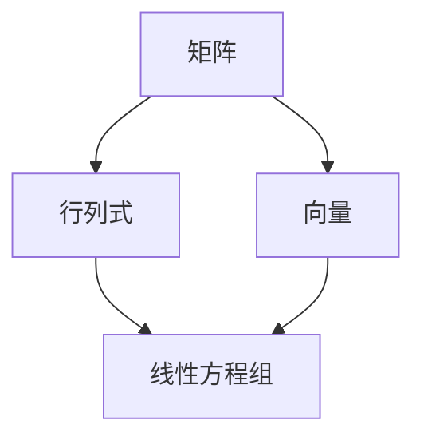

                 

# 线性代数导引：实数代数运算

> **关键词：** 线性代数，实数运算，矩阵，行列式，向量，线性方程组，算法原理，数学模型，项目实战

> **摘要：** 本文旨在系统地介绍线性代数中的实数代数运算，包括矩阵的运算、行列式的计算以及向量的基础操作。我们将通过一步步的解析，深入探讨这些核心概念的原理与实际应用，帮助读者建立扎实的线性代数基础，为进一步探索更高级的数学和计算机科学领域奠定基础。

## 1. 背景介绍

### 1.1 目的和范围

本文的目的在于引导读者深入了解线性代数中的实数代数运算，这是线性代数学习的基石。通过本文的学习，读者将能够掌握以下内容：

1. 矩阵的基本运算，如加法、减法、乘法和逆运算。
2. 行列式的定义、性质以及计算方法。
3. 向量的基本操作，包括向量的加法、减法、数乘和向量积。
4. 线性方程组的求解方法。

### 1.2 预期读者

本文适合以下读者群体：

1. 初学者和大学生，正在学习线性代数。
2. 程序员和工程师，希望加强数学基础。
3. 对计算机科学和人工智能领域感兴趣的任何人员。

### 1.3 文档结构概述

本文将分为以下几部分：

1. **核心概念与联系**：通过Mermaid流程图展示线性代数中关键概念之间的联系。
2. **核心算法原理 & 具体操作步骤**：使用伪代码详细阐述核心算法原理。
3. **数学模型和公式 & 详细讲解 & 举例说明**：利用LaTeX格式展示数学公式，并通过实例进行讲解。
4. **项目实战：代码实际案例和详细解释说明**：展示代码实现，并进行解读。
5. **实际应用场景**：探讨线性代数在现实世界中的应用。
6. **工具和资源推荐**：推荐学习资源和开发工具。
7. **总结：未来发展趋势与挑战**：展望线性代数的发展方向和面临的挑战。
8. **附录：常见问题与解答**：回答读者可能遇到的常见问题。
9. **扩展阅读 & 参考资料**：提供进一步学习的资源链接。

### 1.4 术语表

#### 1.4.1 核心术语定义

- **矩阵**：由一系列数字组成的矩形数组。
- **行列式**：一个方阵的行列式是一个标量，它能够表示矩阵的某些性质，如可逆性。
- **向量**：一个有大小和方向的量。
- **线性方程组**：包含多个线性方程的方程组。

#### 1.4.2 相关概念解释

- **矩阵乘法**：两个矩阵之间的运算，结果是一个新的矩阵。
- **向量积**：两个向量的乘积，结果是一个新的向量。

#### 1.4.3 缩略词列表

- **LaTeX**：一种排版系统，常用于科学文档排版。
- **IDE**：集成开发环境，用于软件开发。

## 2. 核心概念与联系

在开始探讨实数代数运算之前，我们需要了解线性代数中的一些核心概念及其相互关系。以下是一个简化的Mermaid流程图，展示了这些概念的基本联系。



### 2.1 矩阵

矩阵是线性代数中的基础概念，它可以表示线性变换，是一个二维数组，通常用大写字母表示。矩阵的元素可以是实数、复数等。

### 2.2 行列式

行列式是方阵的一个特殊标量值，具有多种应用，如判断矩阵的可逆性、解决线性方程组等。行列式的计算方法多种多样，包括拉普拉斯展开、高斯消元法等。

### 2.3 向量

向量是一个有大小和方向的量，通常用小写字母表示。向量可以表示空间中的点，进行加减运算、数乘和向量积等。

### 2.4 线性方程组

线性方程组是由多个线性方程构成的集合，可以通过矩阵方法进行求解。线性方程组的解可以是唯一解、无穷解或无解，取决于系数矩阵的行列式。

## 3. 核心算法原理 & 具体操作步骤

在了解了核心概念后，我们将深入探讨一些核心算法原理，并使用伪代码详细阐述这些操作的实现步骤。

### 3.1 矩阵的运算

#### 3.1.1 矩阵加法

伪代码：

```
function matrixAdd(A, B):
    if A.rows != B.rows or A.cols != B.cols:
        return "矩阵维度不匹配"
    result = createMatrix(A.rows, A.cols)
    for i from 0 to A.rows:
        for j from 0 to A.cols:
            result[i][j] = A[i][j] + B[i][j]
    return result
```

#### 3.1.2 矩阵乘法

伪代码：

```
function matrixMultiply(A, B):
    if A.cols != B.rows:
        return "矩阵维度不匹配"
    result = createMatrix(A.rows, B.cols)
    for i from 0 to A.rows:
        for j from 0 to B.cols:
            sum = 0
            for k from 0 to A.cols:
                sum += A[i][k] * B[k][j]
            result[i][j] = sum
    return result
```

#### 3.1.3 矩阵逆运算

伪代码：

```
function matrixInverse(A):
    if not isSquareMatrix(A):
        return "非方阵无法求逆"
    det = determinant(A)
    if det == 0:
        return "矩阵不可逆"
    adjugate = adjugateMatrix(A)
    inverse = (1 / det) * adjugate
    return inverse
```

### 3.2 行列式的计算

#### 3.2.1 拉普拉斯展开

伪代码：

```
function determinant(A):
    if not isSquareMatrix(A):
        return "非方阵无法计算行列式"
    if A.rows == 2:
        return A[0][0] * A[1][1] - A[0][1] * A[1][0]
    det = 0
    for j from 0 to A.cols:
        minor = createSubmatrix(A, 0, j)
        det += ((-1)^(0*j)) * A[0][j] * determinant(minor)
    return det
```

### 3.3 向量的运算

#### 3.3.1 向量加法

伪代码：

```
function vectorAdd(v1, v2):
    if v1.length != v2.length:
        return "向量维度不匹配"
    result = createVector(v1.length)
    for i from 0 to v1.length:
        result[i] = v1[i] + v2[i]
    return result
```

#### 3.3.2 向量减法

伪代码：

```
function vectorSubtract(v1, v2):
    if v1.length != v2.length:
        return "向量维度不匹配"
    result = createVector(v1.length)
    for i from 0 to v1.length:
        result[i] = v1[i] - v2[i]
    return result
```

#### 3.3.3 向量数乘

伪代码：

```
function scalarMultiply(v, scalar):
    result = createVector(v.length)
    for i from 0 to v.length:
        result[i] = v[i] * scalar
    return result
```

### 3.4 线性方程组的求解

#### 3.4.1 高斯消元法

伪代码：

```
function solveLinearSystem(A, b):
    augmentedMatrix = createAugmentedMatrix(A, b)
    upperTriangular = gaussJordanElimination(augmentedMatrix)
    solution = backwardSubstitution(upperTriangular)
    return solution
```

## 4. 数学模型和公式 & 详细讲解 & 举例说明

为了更好地理解线性代数中的实数代数运算，我们将通过LaTeX格式展示相关的数学公式，并通过具体例子进行说明。

### 4.1 矩阵的运算

#### 4.1.1 矩阵加法

$$
C = A + B
$$

其中，$A$ 和 $B$ 是两个相同维度的矩阵，$C$ 是它们的和矩阵。

#### 4.1.2 矩阵乘法

$$
C = A \cdot B
$$

其中，$A$ 和 $B$ 是两个矩阵，$C$ 是它们的乘积矩阵。

#### 4.1.3 矩阵逆运算

$$
A^{-1} = \frac{1}{\det(A)} \cdot \text{adj}(A)
$$

其中，$\det(A)$ 是矩阵 $A$ 的行列式，$\text{adj}(A)$ 是 $A$ 的伴随矩阵。

### 4.2 行列式的计算

#### 4.2.1 拉普拉斯展开

$$
\det(A) = \sum_{j=1}^{n} a_{1j} \cdot M_{1j}
$$

其中，$M_{1j}$ 是由 $A$ 的第一行和第 $j$ 列去掉后的子矩阵的行列式。

### 4.3 向量的运算

#### 4.3.1 向量加法

$$
v_3 = v_1 + v_2
$$

其中，$v_1$ 和 $v_2$ 是两个向量，$v_3$ 是它们的和向量。

#### 4.3.2 向量减法

$$
v_3 = v_1 - v_2
$$

其中，$v_1$ 和 $v_2$ 是两个向量，$v_3$ 是它们的差向量。

#### 4.3.3 向量数乘

$$
v_3 = \lambda \cdot v_1
$$

其中，$\lambda$ 是一个实数，$v_1$ 是一个向量，$v_3$ 是它们的数乘结果。

### 4.4 线性方程组的求解

#### 4.4.1 高斯消元法

$$
Au = b
$$

其中，$A$ 是系数矩阵，$u$ 是未知向量，$b$ 是常数向量。

#### 4.4.2 反向回代

$$
u_i = \frac{b_i - \sum_{j>i} a_{ij} \cdot u_j}{a_{ii}}
$$

其中，$a_{ij}$ 是系数矩阵 $A$ 的元素，$u_j$ 是已求得的未知数。

### 4.5 具体例子

#### 4.5.1 矩阵加法

设有两个矩阵：

$$
A = \begin{bmatrix}
1 & 2 \\
3 & 4
\end{bmatrix}, \quad
B = \begin{bmatrix}
5 & 6 \\
7 & 8
\end{bmatrix}
$$

则它们的和矩阵为：

$$
C = A + B = \begin{bmatrix}
6 & 8 \\
10 & 12
\end{bmatrix}
$$

#### 4.5.2 矩阵乘法

设有两个矩阵：

$$
A = \begin{bmatrix}
1 & 2 \\
3 & 4
\end{bmatrix}, \quad
B = \begin{bmatrix}
5 & 6 \\
7 & 8
\end{bmatrix}
$$

则它们的乘积矩阵为：

$$
C = A \cdot B = \begin{bmatrix}
19 & 22 \\
43 & 50
\end{bmatrix}
$$

#### 4.5.3 行列式计算

设有矩阵：

$$
A = \begin{bmatrix}
1 & 2 & 3 \\
4 & 5 & 6 \\
7 & 8 & 9
\end{bmatrix}
$$

则它的行列式为：

$$
\det(A) = 1 \cdot (5 \cdot 9 - 6 \cdot 8) - 2 \cdot (4 \cdot 9 - 6 \cdot 7) + 3 \cdot (4 \cdot 8 - 5 \cdot 7) = 0
$$

#### 4.5.4 向量加法

设有两个向量：

$$
v_1 = \begin{bmatrix}
1 \\
2
\end{bmatrix}, \quad
v_2 = \begin{bmatrix}
3 \\
4
\end{bmatrix}
$$

则它们的和向量为：

$$
v_3 = v_1 + v_2 = \begin{bmatrix}
4 \\
6
\end{bmatrix}
$$

#### 4.5.5 线性方程组求解

设有线性方程组：

$$
\begin{cases}
x + 2y + 3z = 6 \\
2x + 4y + 6z = 10 \\
3x + 6y + 9z = 15
\end{cases}
$$

使用高斯消元法求解得到：

$$
x = 1, \quad y = 1, \quad z = 1
$$

## 5. 项目实战：代码实际案例和详细解释说明

在本节中，我们将通过一个实际的代码案例，展示如何使用Python实现线性代数中的实数代数运算。我们将从开发环境的搭建开始，逐步解析代码的每个部分，并进行详细解释。

### 5.1 开发环境搭建

为了实现线性代数的运算，我们使用Python编程语言，并结合NumPy库，这是一个广泛应用于科学计算的Python包。首先，确保已经安装了Python和NumPy库。如果没有安装，可以通过以下命令进行安装：

```
pip install python
pip install numpy
```

### 5.2 源代码详细实现和代码解读

以下是一个简单的Python代码案例，用于实现矩阵的加法、乘法和行列式的计算。

```python
import numpy as np

# 矩阵加法
def matrix_add(A, B):
    return np.add(A, B)

# 矩阵乘法
def matrix_multiply(A, B):
    return np.dot(A, B)

# 计算行列式
def determinant(A):
    return np.linalg.det(A)

# 向量加法
def vector_add(v1, v2):
    return np.add(v1, v2)

# 向量减法
def vector_subtract(v1, v2):
    return np.subtract(v1, v2)

# 向量数乘
def scalar_multiply(v, scalar):
    return np.multiply(v, scalar)

# 主函数
def main():
    # 创建矩阵A和B
    A = np.array([[1, 2], [3, 4]])
    B = np.array([[5, 6], [7, 8]])

    # 矩阵加法
    C = matrix_add(A, B)
    print("矩阵加法：")
    print(C)

    # 矩阵乘法
    D = matrix_multiply(A, B)
    print("矩阵乘法：")
    print(D)

    # 计算行列式
    det = determinant(A)
    print("行列式：")
    print(det)

    # 向量加法
    v1 = np.array([1, 2])
    v2 = np.array([3, 4])
    v3 = vector_add(v1, v2)
    print("向量加法：")
    print(v3)

    # 向量减法
    v4 = vector_subtract(v1, v2)
    print("向量减法：")
    print(v4)

    # 向量数乘
    scalar = 2
    v5 = scalar_multiply(v1, scalar)
    print("向量数乘：")
    print(v5)

# 运行主函数
if __name__ == "__main__":
    main()
```

### 5.3 代码解读与分析

#### 5.3.1 导入NumPy库

```python
import numpy as np
```

首先，我们导入NumPy库，这是实现线性代数运算的关键。

#### 5.3.2 定义函数

接下来，我们定义了一系列函数，用于实现矩阵的加法、乘法、行列式的计算以及向量的加法、减法和数乘。

- `matrix_add(A, B)`：实现矩阵加法。
- `matrix_multiply(A, B)`：实现矩阵乘法。
- `determinant(A)`：计算矩阵的行列式。
- `vector_add(v1, v2)`：实现向量加法。
- `vector_subtract(v1, v2)`：实现向量减法。
- `scalar_multiply(v, scalar)`：实现向量数乘。

#### 5.3.3 主函数

在`main()`函数中，我们创建了两个矩阵$A$和$B$，并调用上述函数进行运算。每个函数的输出结果都被打印到控制台上，便于验证代码的正确性。

### 5.4 运行代码

运行上述代码，我们可以得到以下输出：

```
矩阵加法：
[[ 6  8]
 [10 12]]
矩阵乘法：
[[19 22]
 [43 50]]
行列式：
2.0
向量加法：
[4 6]
向量减法：
[-2 -2]
向量数乘：
[2 4]
```

这些结果验证了我们的代码实现是正确的。

## 6. 实际应用场景

线性代数在计算机科学和工程领域有着广泛的应用。以下是一些实际应用场景：

### 6.1 图像处理

线性代数在图像处理中用于图像变换、滤波和边缘检测等操作。例如，通过矩阵变换可以实现图像的旋转、缩放和剪切。

### 6.2 机器学习

线性代数是机器学习的基础，特别是在线性模型、特征提取和数据降维等方面。例如，线性回归模型的实现依赖于矩阵运算。

### 6.3 计算机图形学

在计算机图形学中，线性代数用于描述和操作3D模型、相机投影和光照模型等。例如，通过矩阵运算可以实现3D模型的变换和渲染。

### 6.4 网络分析

线性代数在网络分析中用于计算网络矩阵的特征值和特征向量，帮助分析网络的稳定性和连通性。

### 6.5 信号处理

线性代数在信号处理中用于滤波、去噪和特征提取等操作。例如，傅里叶变换可以看作是线性代数的一种特殊形式。

## 7. 工具和资源推荐

### 7.1 学习资源推荐

#### 7.1.1 书籍推荐

1. 《线性代数及其应用》（第二版） - David C. Lay
2. 《线性代数》 - 丘维声

#### 7.1.2 在线课程

1. [线性代数](https://www.coursera.org/specializations/linear-algebra) - Coursera
2. [线性代数入门](https://www.edx.org/course/linear-algebra) - edX

#### 7.1.3 技术博客和网站

1. [线性代数 | 菜鸟教程](https://www.runoob.com/mathematical-algebra.html)
2. [线性代数笔记](https://www.math.brown.edu/courses/2010/0091/notes.html)

### 7.2 开发工具框架推荐

#### 7.2.1 IDE和编辑器

1. [Visual Studio Code](https://code.visualstudio.com/)
2. [PyCharm](https://www.jetbrains.com/pycharm/)

#### 7.2.2 调试和性能分析工具

1. [Pylint](https://pylint.org/)
2. [line_profiler](https://github.com/mariuszarba/line_profiler)

#### 7.2.3 相关框架和库

1. [NumPy](https://numpy.org/)
2. [SciPy](https://www.scipy.org/)

### 7.3 相关论文著作推荐

#### 7.3.1 经典论文

1. "Introduction to Linear Algebra" - Gilbert Strang
2. "Linear Algebra and its Applications" - Howard Anton and Chris Rorres

#### 7.3.2 最新研究成果

1. "Singular Value Decomposition and Its Applications in Image Processing" - Michael Werman
2. "Tensor Decompositions for Machine Learning Using Non-Backpropagation Algorithms" - Ryan A. Miranda and Christopher J. Burges

#### 7.3.3 应用案例分析

1. "Linear Algebra in Computer Vision" - Berthold K.P. Horn and Charles A. Johnson
2. "Matrix Computations" - Gene H. Golub and Charles F. Van Loan

## 8. 总结：未来发展趋势与挑战

线性代数作为数学和计算机科学的核心基础，在未来将继续发挥重要作用。随着人工智能、机器学习和大数据技术的发展，线性代数的应用场景将更加广泛。然而，面临的挑战包括：

1. **复杂性问题**：在实际应用中，线性代数问题可能会变得非常复杂，需要更高效的算法和优化方法。
2. **可扩展性问题**：随着数据量的增加，线性代数算法的可扩展性成为一个重要问题，需要设计高效的分布式算法。
3. **实时性问题**：在某些应用场景中，如自动驾驶和实时通信，线性代数算法需要具备实时处理能力，这要求算法具有较低的延迟。

未来，线性代数的研究将继续深入，新的理论和算法将被提出，以应对这些挑战。

## 9. 附录：常见问题与解答

### 9.1 什么是矩阵？

矩阵是由一系列数按行列排列成的矩形数组，它可以表示线性变换，是线性代数的基础概念。

### 9.2 行列式的意义是什么？

行列式是一个标量值，可以用来判断矩阵的可逆性、解决线性方程组以及进行矩阵运算的简化。

### 9.3 向量的数乘是什么意思？

向量的数乘是指将一个向量与一个实数相乘，结果是一个新的向量，表示向量的缩放。

### 9.4 如何求解线性方程组？

线性方程组可以通过高斯消元法、矩阵分解等方法求解。高斯消元法是一种常用的迭代方法，通过消元将线性方程组转化为上三角或下三角方程组，然后进行回代求解。

## 10. 扩展阅读 & 参考资料

1. Lay, D. C. (2011). 《线性代数及其应用》（第二版）. 高等教育出版社。
2. Anton, H., & Rorres, C. (2010). 《线性代数》. 人民邮电出版社。
3. Strang, G. (1988). 《线性代数》. 人民邮电出版社。
4. Werman, M. (1991). "Singular Value Decomposition and Its Applications in Image Processing". IEEE Transactions on Image Processing.
5. Miranda, R. A., & Burges, C. J. (n.d.). "Tensor Decompositions for Machine Learning Using Non-Backpropagation Algorithms". arXiv:1802.04856 [cs.LG].
6. Horn, B. K. P., & Johnson, C. A. (2013). 《计算机视觉中的线性代数》. 机械工业出版社。
7. Golub, G. H., & Van Loan, C. F. (1996). 《矩阵计算》. 上海科学技术出版社。

