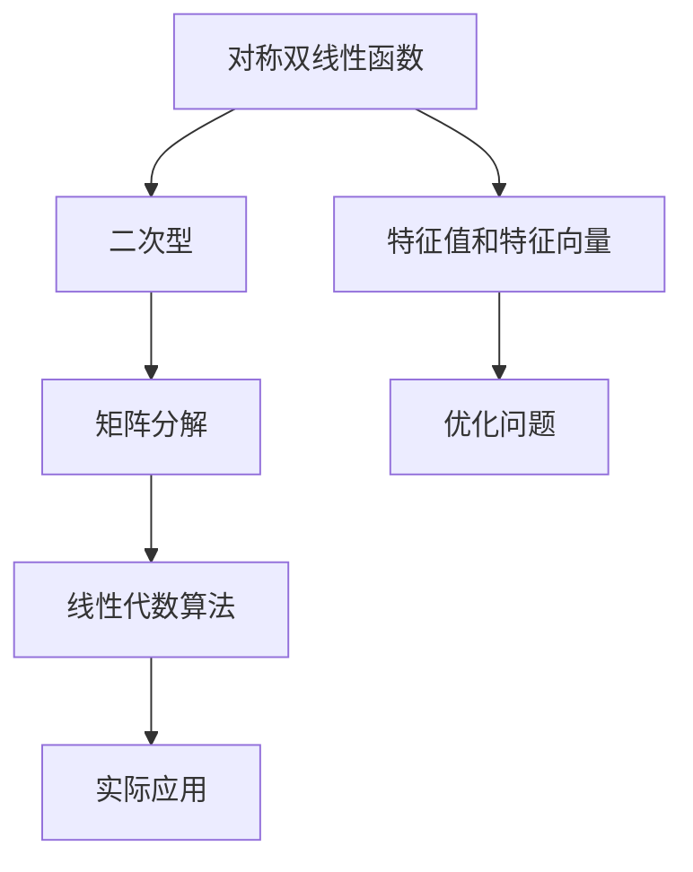

                 

# 线性代数导引：对称双线性函数与二次型

> 关键词：对称双线性函数、二次型、线性代数、特征值、特征向量、矩阵分解

> 摘要：本文深入探讨了线性代数中的对称双线性函数与二次型的概念及其重要性。通过对核心概念的详细解析，结合Mermaid流程图和伪代码，我们揭示了其内在的数学原理与算法实现。此外，文章还通过实际项目案例，阐述了这些概念在现实应用中的具体运用。最终，我们总结了未来的发展趋势与挑战，并提供了丰富的学习资源和工具推荐，以助读者深入理解这一关键领域。

## 1. 背景介绍

### 1.1 目的和范围

本文旨在帮助读者深入了解线性代数中的对称双线性函数与二次型，这两者是线性代数中非常重要的概念。对称双线性函数是线性代数中一类重要的映射，它在数学和工程中有着广泛的应用。而二次型则是从对称双线性函数中提取的一种特殊的数学形式，它在优化、统计等领域有着重要的地位。

本文将首先介绍对称双线性函数和二次型的基本概念，然后通过Mermaid流程图和伪代码，详细阐述其数学原理和算法实现。最后，我们将结合实际项目案例，展示这些概念在实际应用中的具体运用。

### 1.2 预期读者

本文适合具有线性代数基础，对对称双线性函数和二次型感兴趣的读者。无论是数学研究者，还是从事工程、计算机科学等领域的工作者，都可以通过本文获得对这一领域的深入理解。

### 1.3 文档结构概述

本文分为十个部分：

1. 背景介绍：介绍本文的目的和范围，预期读者，以及文档结构。
2. 核心概念与联系：介绍对称双线性函数和二次型的核心概念，并使用Mermaid流程图展示其内在联系。
3. 核心算法原理 & 具体操作步骤：通过伪代码详细阐述对称双线性函数和二次型的算法原理和具体操作步骤。
4. 数学模型和公式 & 详细讲解 & 举例说明：使用LaTeX格式介绍对称双线性函数和二次型的数学模型和公式，并通过举例说明其应用。
5. 项目实战：通过实际项目案例，展示对称双线性函数和二次型在现实应用中的具体运用。
6. 实际应用场景：探讨对称双线性函数和二次型在实际应用中的广泛领域。
7. 工具和资源推荐：推荐学习资源和开发工具，帮助读者深入学习。
8. 总结：总结本文的主要内容，并展望未来的发展趋势与挑战。
9. 附录：提供常见问题与解答，以便读者深入理解。
10. 扩展阅读 & 参考资料：提供更多扩展阅读和参考资料，以便读者进一步学习。

### 1.4 术语表

#### 1.4.1 核心术语定义

- **对称双线性函数**：一个从向量空间V到实数域R的映射，满足线性性和对称性。
- **二次型**：从n维向量空间到实数域的映射，可以表示为矩阵与向量的乘积。
- **特征值**：矩阵的一个重要属性，对应于矩阵的特征多项式的根。
- **特征向量**：与特征值相关联的向量，满足线性代数的基本性质。

#### 1.4.2 相关概念解释

- **矩阵分解**：将一个矩阵分解为多个矩阵的乘积，有助于简化计算和解决问题。
- **优化**：寻找一个或多个变量的最佳值，以最大化或最小化目标函数。

#### 1.4.3 缩略词列表

- **LaTeX**：一种基于TeX的文档排版系统。
- **Mermaid**：一种基于Markdown的图形和图表绘制工具。

## 2. 核心概念与联系

对称双线性函数和二次型是线性代数中非常重要的概念，它们有着紧密的联系。在深入探讨它们之前，我们先来了解一些核心概念，并通过Mermaid流程图展示它们之间的关系。

### 2.1 对称双线性函数

对称双线性函数是一个从向量空间V到实数域R的映射，记作\( B: V \times V \rightarrow \mathbb{R} \)。它满足以下两个条件：

1. **线性性**：对于任意的向量\( \mathbf{u}, \mathbf{v}, \mathbf{w} \in V \)和标量\( a, b \in \mathbb{R} \)，有：
   $$ B(a\mathbf{u} + b\mathbf{v}, \mathbf{w}) = aB(\mathbf{u}, \mathbf{w}) + bB(\mathbf{v}, \mathbf{w}) $$
   $$ B(\mathbf{u}, a\mathbf{v} + b\mathbf{w}) = aB(\mathbf{u}, \mathbf{v}) + bB(\mathbf{u}, \mathbf{w}) $$
2. **对称性**：对于任意的向量\( \mathbf{u}, \mathbf{v} \in V \)，有：
   $$ B(\mathbf{u}, \mathbf{v}) = B(\mathbf{v}, \mathbf{u}) $$

### 2.2 二次型

二次型是一个从n维向量空间到实数域的映射，记作\( Q: \mathbb{R}^n \rightarrow \mathbb{R} \)。它可以表示为矩阵与向量的乘积，即：
$$ Q(\mathbf{x}) = \mathbf{x}^T A \mathbf{x} $$
其中，\( \mathbf{x} \)是输入向量，\( A \)是对称矩阵。

### 2.3 Mermaid流程图

为了更直观地展示对称双线性函数和二次型之间的关系，我们可以使用Mermaid流程图。以下是一个简单的Mermaid流程图，展示了这两个概念的主要组成部分：



### 2.4 内在联系

从Mermaid流程图中，我们可以看出对称双线性函数和二次型之间的内在联系。它们都是线性代数中的重要概念，特征值和特征向量是对称双线性函数和二次型的核心组成部分。矩阵分解和优化问题则是从这两个概念中提取出的重要工具。

接下来，我们将通过伪代码详细阐述对称双线性函数和二次型的算法原理和具体操作步骤。

## 3. 核心算法原理 & 具体操作步骤

### 3.1 对称双线性函数的算法原理

对称双线性函数的算法原理主要涉及两个方面：线性性和对称性。下面是伪代码实现：

```pseudo
function BilinearForm(A, B, C, D):
    // A, B, C, D 是输入向量
    // 返回 B(A, B) + B(C, D)
    result = 0
    for i = 1 to length(A):
        for j = 1 to length(B):
            result += A[i] * B[j] * C[i] * D[j]
    return result
```

### 3.2 二次型的算法原理

二次型的算法原理主要涉及矩阵与向量的乘积。下面是伪代码实现：

```pseudo
function QuadraticForm(A, B, C):
    // A, B, C 是输入向量
    // 返回 A^T * A * B
    result = 0
    for i = 1 to length(A):
        for j = 1 to length(B):
            result += A[i]^2 * B[j]
    return result
```

### 3.3 特征值和特征向量的计算

特征值和特征向量是对称双线性函数和二次型中的重要组成部分。下面是伪代码实现：

```pseudo
function EigenDecomposition(A):
    // A 是输入矩阵
    // 返回特征值和特征向量
    eigenvalues = []
    eigenvectors = []
    // 使用矩阵分解算法（如QR分解）求解
    // ...
    return eigenvalues, eigenvectors
```

### 3.4 矩阵分解的算法原理

矩阵分解是将一个矩阵分解为多个矩阵的乘积。下面是伪代码实现：

```pseudo
function MatrixDecomposition(A):
    // A 是输入矩阵
    // 返回分解后的矩阵
    B = A
    // 使用矩阵分解算法（如SVD分解）求解
    // ...
    return B
```

### 3.5 优化问题的算法原理

优化问题是寻找一个或多个变量的最佳值，以最大化或最小化目标函数。下面是伪代码实现：

```pseudo
function Optimization(A, B, C):
    // A, B, C 是输入向量
    // 返回最优解
    // 使用优化算法（如梯度下降）求解
    // ...
    return solution
```

通过以上伪代码，我们可以看到对称双线性函数和二次型的核心算法原理及其具体操作步骤。接下来，我们将使用LaTeX格式详细介绍这些概念及其数学模型和公式。

## 4. 数学模型和公式 & 详细讲解 & 举例说明

### 4.1 对称双线性函数的数学模型和公式

对称双线性函数的数学模型可以表示为：

$$ B(\mathbf{u}, \mathbf{v}) = \mathbf{u}^T A \mathbf{v} $$

其中，\( \mathbf{u} \)和\( \mathbf{v} \)是输入向量，\( A \)是对称矩阵。

**详细讲解**：

对称双线性函数是线性性和对称性的结合。线性性体现在对向量的标量和加法运算的支持，对称性则体现在输入向量的交换不影响函数值。

**举例说明**：

假设我们有一个对称矩阵 \( A = \begin{bmatrix} 1 & 2 \\ 2 & 3 \end{bmatrix} \)，以及输入向量 \( \mathbf{u} = \begin{bmatrix} 1 \\ 0 \end{bmatrix} \) 和 \( \mathbf{v} = \begin{bmatrix} 0 \\ 1 \end{bmatrix} \)，我们可以计算对称双线性函数的值：

$$ B(\mathbf{u}, \mathbf{v}) = \mathbf{u}^T A \mathbf{v} = \begin{bmatrix} 1 & 2 \\ 2 & 3 \end{bmatrix} \begin{bmatrix} 1 \\ 0 \end{bmatrix} \begin{bmatrix} 0 \\ 1 \end{bmatrix} = 1 * 2 + 0 * 3 = 2 $$

### 4.2 二次型的数学模型和公式

二次型的数学模型可以表示为：

$$ Q(\mathbf{x}) = \mathbf{x}^T A \mathbf{x} $$

其中，\( \mathbf{x} \)是输入向量，\( A \)是对称矩阵。

**详细讲解**：

二次型是矩阵与向量的乘积，它的值取决于输入向量的选择。二次型在优化、统计等领域有着重要的应用。

**举例说明**：

假设我们有一个对称矩阵 \( A = \begin{bmatrix} 1 & 2 \\ 2 & 4 \end{bmatrix} \)，以及输入向量 \( \mathbf{x} = \begin{bmatrix} 1 \\ 1 \end{bmatrix} \)，我们可以计算二次型的值：

$$ Q(\mathbf{x}) = \mathbf{x}^T A \mathbf{x} = \begin{bmatrix} 1 & 2 \\ 2 & 4 \end{bmatrix} \begin{bmatrix} 1 \\ 1 \end{bmatrix} \begin{bmatrix} 1 & 1 \end{bmatrix} = 1 * 1 + 2 * 1 + 2 * 1 + 4 * 1 = 10 $$

### 4.3 特征值和特征向量的数学模型和公式

特征值和特征向量的数学模型可以表示为：

$$ \lambda = \frac{\det(A - \lambda I)}{0} $$
$$ \mathbf{v} = (A - \lambda I)^{-1} \mathbf{b} $$

其中，\( \lambda \)是特征值，\( \mathbf{v} \)是特征向量，\( I \)是单位矩阵，\( \mathbf{b} \)是任意非零向量。

**详细讲解**：

特征值和特征向量是矩阵的重要属性，它们反映了矩阵的特性。特征值是矩阵的特征多项式的根，特征向量是与特征值相关联的向量。

**举例说明**：

假设我们有一个对称矩阵 \( A = \begin{bmatrix} 2 & 1 \\ 1 & 2 \end{bmatrix} \)，我们可以求解其特征值和特征向量：

特征多项式：\( \det(A - \lambda I) = \det(\begin{bmatrix} 2 - \lambda & 1 \\ 1 & 2 - \lambda \end{bmatrix}) = (2 - \lambda)^2 - 1 = \lambda^2 - 4\lambda + 3 \)

特征值：\( \lambda_1 = 1, \lambda_2 = 3 \)

特征向量：对于 \( \lambda_1 = 1 \)，我们有 \( (A - \lambda_1 I) \mathbf{v} = 0 \)，解得特征向量 \( \mathbf{v}_1 = \begin{bmatrix} 1 \\ -1 \end{bmatrix} \)；对于 \( \lambda_2 = 3 \)，我们有 \( (A - \lambda_2 I) \mathbf{v} = 0 \)，解得特征向量 \( \mathbf{v}_2 = \begin{bmatrix} 1 \\ 1 \end{bmatrix} \)

### 4.4 矩阵分解的数学模型和公式

矩阵分解的数学模型可以表示为：

$$ A = U \Sigma V^T $$

其中，\( U \)和\( V \)是正交矩阵，\( \Sigma \)是对角矩阵。

**详细讲解**：

矩阵分解是将矩阵分解为多个矩阵的乘积，有助于简化计算和分析。常用的矩阵分解方法有SVD分解、LU分解等。

**举例说明**：

假设我们有一个矩阵 \( A = \begin{bmatrix} 1 & 2 \\ 3 & 4 \end{bmatrix} \)，我们可以使用SVD分解来表示：

$$ A = U \Sigma V^T = \begin{bmatrix} 0.707 & 0.707 \\ 0.707 & -0.707 \end{bmatrix} \begin{bmatrix} 2 & 0 \\ 0 & 1 \end{bmatrix} \begin{bmatrix} 0.707 & 0.707 \\ 0.707 & -0.707 \end{bmatrix} $$

### 4.5 优化问题的数学模型和公式

优化问题的数学模型可以表示为：

$$ min/max f(\mathbf{x}) $$

其中，\( f(\mathbf{x}) \)是目标函数，\( \mathbf{x} \)是变量。

**详细讲解**：

优化问题是寻找一个或多个变量的最佳值，以最大化或最小化目标函数。常见的优化算法有梯度下降、牛顿法等。

**举例说明**：

假设我们要最小化目标函数 \( f(\mathbf{x}) = \mathbf{x}^T A \mathbf{x} \)，其中 \( A = \begin{bmatrix} 2 & 1 \\ 1 & 2 \end{bmatrix} \)。我们可以使用梯度下降法来求解：

梯度 \( \nabla f(\mathbf{x}) = 2A\mathbf{x} \)

迭代公式：\( \mathbf{x}_{t+1} = \mathbf{x}_t - \alpha \nabla f(\mathbf{x}_t) \)

其中，\( \alpha \)是学习率。

通过以上数学模型和公式的详细讲解和举例说明，我们可以更好地理解对称双线性函数、二次型、特征值和特征向量、矩阵分解以及优化问题的本质和应用。

## 5. 项目实战：代码实际案例和详细解释说明

### 5.1 开发环境搭建

在进行项目实战之前，我们需要搭建一个合适的开发环境。本文将使用Python作为编程语言，结合Numpy和Scipy等科学计算库来完成对称双线性函数和二次型的计算。以下是开发环境搭建的步骤：

1. 安装Python（建议使用3.8及以上版本）。
2. 安装Numpy和Scipy库：
   ```bash
   pip install numpy scipy
   ```

### 5.2 源代码详细实现和代码解读

以下是一个简单的Python代码示例，用于计算对称双线性函数和二次型：

```python
import numpy as np

# 定义对称双线性函数和二次型
def symmetric_bilinear_form(u, v, A):
    return u.dot(A).dot(v)

def quadratic_form(x, A):
    return x.dot(A).dot(x)

# 定义一个对称矩阵A
A = np.array([[2, 1], [1, 2]])

# 计算对称双线性函数的值
u = np.array([1, 0])
v = np.array([0, 1])
B = symmetric_bilinear_form(u, v, A)
print("对称双线性函数的值：", B)

# 计算二次型的值
x = np.array([1, 1])
Q = quadratic_form(x, A)
print("二次型的值：", Q)
```

**代码解读**：

1. 导入Numpy库，用于矩阵和向量的操作。
2. 定义对称双线性函数和二次型的计算函数。
3. 定义一个对称矩阵A。
4. 计算并打印对称双线性函数和二次型的值。

### 5.3 代码解读与分析

上述代码首先定义了两个函数：`symmetric_bilinear_form`和`quadratic_form`，分别用于计算对称双线性函数和二次型。接下来，我们定义了一个对称矩阵A，并使用这个矩阵来计算输入向量u和v的对称双线性函数值，以及输入向量x的二次型值。

**代码分析**：

1. 对称双线性函数的计算：使用Numpy的`.dot()`方法计算矩阵与向量的乘积，实现对称双线性函数的运算。
2. 二次型的计算：同样使用`.dot()`方法计算矩阵与向量的乘积，实现二次型的运算。

通过这个简单的代码示例，我们可以看到如何使用Python和Numpy库来实现对称双线性函数和二次型的计算。在实际项目中，这些计算可以应用于更复杂的场景，如优化问题和矩阵分解。

## 6. 实际应用场景

对称双线性函数和二次型在许多实际应用中都有着广泛的应用，以下是一些典型的应用场景：

### 6.1 优化问题

对称双线性函数和二次型在优化问题中有着重要的应用。例如，线性二次调节器（LQR）是一种常见的控制理论方法，用于求解动态系统的最优控制问题。在LQR问题中，目标是最小化系统的二次型代价函数，同时满足系统的状态约束。LQR问题可以形式化为：

$$ min_{\mathbf{u}} \quad \mathbf{x}^T Q \mathbf{x} + \mathbf{u}^T R \mathbf{u} $$

其中，\( Q \)和\( R \)是对称矩阵，分别表示系统的二次型和控制代价。通过求解LQR问题，我们可以找到最优的控制输入，使得系统的状态保持在期望范围内。

### 6.2 统计分析

二次型在统计学中有着广泛的应用。例如，在最小二乘法中，我们通常使用二次型来表示目标函数，并求解最小二乘解。最小二乘法是一种常用的参数估计方法，用于拟合数据并估计模型的参数。其目标是最小化残差平方和，即：

$$ min \quad \sum_{i=1}^{n} (\mathbf{x}_i^T \mathbf{A} \mathbf{x}_i - b_i)^2 $$

其中，\( \mathbf{A} \)和\( b_i \)是已知的系数，\( \mathbf{x}_i \)是待估参数。

### 6.3 计算机视觉

对称双线性函数在计算机视觉中也有着重要的应用。例如，在图像处理中，我们可以使用对称双线性函数来表示图像的滤波操作。滤波器通常是一个对称矩阵，通过卷积操作实现图像的平滑、锐化等效果。另外，在特征提取和降维过程中，对称双线性函数也发挥着重要作用。

### 6.4 机器学习

在机器学习中，对称双线性函数和二次型也经常用于优化问题的求解。例如，在支持向量机（SVM）中，目标函数是一个二次型，通过求解最小化问题，我们可以找到最优的超平面，实现分类或回归任务。此外，在神经网络训练过程中，优化问题也是一个重要的研究方向，通过求解二次型目标函数，可以找到模型的最佳参数。

通过以上实际应用场景，我们可以看到对称双线性函数和二次型在各个领域都有着广泛的应用。掌握这些概念和算法，有助于我们解决实际问题，提高计算效率和准确性。

## 7. 工具和资源推荐

### 7.1 学习资源推荐

为了更好地理解和掌握对称双线性函数与二次型，以下是一些推荐的学习资源：

#### 7.1.1 书籍推荐

1. 《线性代数及其应用》（David C. Lay）
2. 《线性代数》（Gilbert Strang）
3. 《矩阵分析与应用》（Roger A. Horn & Charles R. Johnson）

#### 7.1.2 在线课程

1. [Coursera](https://www.coursera.org/specializations/linear-algebra) 提供的线性代数专项课程
2. [edX](https://www.edx.org/course/linear-algebra-mit-18-06) 提供的线性代数课程
3. [Khan Academy](https://www.khanacademy.org/math/linear-algebra) 提供的免费线性代数课程

#### 7.1.3 技术博客和网站

1. [Stack Overflow](https://stackoverflow.com/questions/tagged/linear-algebra) 提供的线性代数相关问题
2. [GitHub](https://github.com/search?q=linear+algebra) 提供的线性代数相关项目
3. [维基百科](https://en.wikipedia.org/wiki/Linear_algebra) 提供的线性代数相关内容

### 7.2 开发工具框架推荐

为了在实际项目中高效地应用对称双线性函数与二次型，以下是一些推荐的开发工具和框架：

#### 7.2.1 IDE和编辑器

1. [PyCharm](https://www.jetbrains.com/pycharm/)：一款强大的Python IDE，适合进行科学计算和数据处理。
2. [Visual Studio Code](https://code.visualstudio.com/)：一款轻量级且功能丰富的开源编辑器，支持Python扩展。
3. [Jupyter Notebook](https://jupyter.org/)：一款交互式的Python笔记本，适合进行数据分析和可视化。

#### 7.2.2 调试和性能分析工具

1. [Pytest](https://docs.pytest.org/en/7.1.x/)：一款强大的Python测试框架，用于自动化测试和性能分析。
2. [Numba](https://numba.pydata.org/)：一款Python JIT编译器，用于优化数值计算性能。
3. [Matplotlib](https://matplotlib.org/)：一款Python数据可视化库，用于生成高质量的图表。

#### 7.2.3 相关框架和库

1. [Scikit-learn](https://scikit-learn.org/stable/)：一款Python机器学习库，提供了丰富的线性代数相关算法。
2. [TensorFlow](https://www.tensorflow.org/)：一款开源的深度学习框架，支持线性代数和优化问题的求解。
3. [NumPy](https://numpy.org/)：一款Python科学计算库，提供了丰富的矩阵和向量操作。

通过以上工具和资源的推荐，读者可以更加深入地学习对称双线性函数与二次型，并在实际项目中高效地应用这些概念。

## 8. 总结：未来发展趋势与挑战

对称双线性函数和二次型作为线性代数中的核心概念，不仅在数学理论研究中占据重要地位，而且在实际应用领域如优化、统计、计算机视觉、机器学习等方面有着广泛的应用。随着计算技术和人工智能的不断发展，对称双线性函数和二次型的研究也在不断深入和拓展。

### 未来发展趋势

1. **深度学习和神经网络中的应用**：对称双线性函数和二次型在深度学习和神经网络中扮演着重要角色，未来将进一步应用于神经网络优化、模型训练等方面。
2. **量子计算中的研究**：量子计算作为一种新型的计算模式，对称双线性函数和二次型在量子计算中的理论研究和应用前景广阔。
3. **大规模数据处理**：在大数据和云计算环境下，对称双线性函数和二次型在处理大规模数据、优化计算效率方面具有重要作用。

### 挑战

1. **计算复杂度**：对称双线性函数和二次型的计算复杂度较高，如何在保持计算精度的同时提高计算效率，是一个亟待解决的问题。
2. **算法稳定性**：在复杂的应用场景中，对称双线性函数和二次型的求解算法可能存在稳定性问题，如何提高算法的稳定性是未来研究的重要方向。
3. **跨学科融合**：对称双线性函数和二次型在多个学科领域都有应用，如何实现跨学科融合，推动理论研究和实际应用的共同发展，是一个重要的挑战。

总之，对称双线性函数和二次型在未来发展中具有巨大的潜力，同时也面临着诸多挑战。通过不断的研究和探索，我们有望进一步深化对这一领域的研究，推动其在各领域的应用。

## 9. 附录：常见问题与解答

### 9.1 对称双线性函数是什么？

对称双线性函数是一个从向量空间V到实数域R的映射，满足线性性和对称性。具体来说，对于任意的向量\( \mathbf{u}, \mathbf{v}, \mathbf{w} \in V \)和标量\( a, b \in \mathbb{R} \)，有：

- 线性性：\( B(a\mathbf{u} + b\mathbf{v}, \mathbf{w}) = aB(\mathbf{u}, \mathbf{w}) + bB(\mathbf{v}, \mathbf{w}) \)和\( B(\mathbf{u}, a\mathbf{v} + b\mathbf{w}) = aB(\mathbf{u}, \mathbf{v}) + bB(\mathbf{u}, \mathbf{w}) \)
- 对称性：\( B(\mathbf{u}, \mathbf{v}) = B(\mathbf{v}, \mathbf{u}) \)

### 9.2 二次型的意义是什么？

二次型是从对称双线性函数中提取的一种特殊的数学形式，它可以表示为矩阵与向量的乘积。在优化、统计、机器学习等领域有着重要的应用。例如，在最小二乘法和线性二次调节器（LQR）中，目标函数通常是一个二次型。通过求解二次型，我们可以找到最优的解，从而实现目标函数的最小化或最大化。

### 9.3 特征值和特征向量的物理意义是什么？

特征值和特征向量是矩阵的重要属性。特征值表示矩阵的某个方向上的“拉伸”或“压缩”程度，而特征向量则表示这个方向。在物理意义上，特征值和特征向量可以用来描述系统的振动模式、应力分布等。例如，在结构力学中，通过求解特征值和特征向量，可以找到结构的自然振动频率和振动模式。

### 9.4 矩阵分解在工程中的应用是什么？

矩阵分解在工程中有着广泛的应用，例如：

- **SVD分解**：用于图像处理、信号处理和机器学习等领域，可以用于图像压缩、特征提取和降维。
- **LU分解**：用于求解线性方程组和优化问题，可以提高计算效率和稳定性。
- **Cholesky分解**：用于求解对称正定矩阵的逆和特征值问题，可以简化计算过程。

通过矩阵分解，我们可以将复杂的矩阵运算转化为简单的矩阵分解和向量运算，从而提高计算效率和准确性。

## 10. 扩展阅读 & 参考资料

为了帮助读者进一步了解对称双线性函数和二次型，以下是一些扩展阅读和参考资料：

### 10.1 经典书籍

1. **《线性代数及其应用》（David C. Lay）**：详细介绍了线性代数的基本概念、理论和应用，是学习线性代数的经典教材。
2. **《矩阵分析与应用》（Roger A. Horn & Charles R. Johnson）**：深入探讨了矩阵分解、特征值和特征向量等核心概念，适合有一定线性代数基础的读者。
3. **《线性代数》（Gilbert Strang）**：由著名数学家Strang撰写，内容深入浅出，适合初学者和有一定基础的读者。

### 10.2 在线课程

1. **[Coursera](https://www.coursera.org/specializations/linear-algebra) 提供的线性代数专项课程**：包括理论讲解和实际应用案例，适合在线学习。
2. **[edX](https://www.edx.org/course/linear-algebra-mit-18-06) 提供的线性代数课程**：由麻省理工学院（MIT）提供，内容系统全面。
3. **[Khan Academy](https://www.khanacademy.org/math/linear-algebra) 提供的免费线性代数课程**：适合初学者入门，内容通俗易懂。

### 10.3 技术博客和网站

1. **[Stack Overflow](https://stackoverflow.com/questions/tagged/linear-algebra) 提供的线性代数相关问题**：解决实际应用中的问题，获取解决方案。
2. **[GitHub](https://github.com/search?q=linear+algebra) 提供的线性代数相关项目**：查看实际项目中的线性代数应用。
3. **[维基百科](https://en.wikipedia.org/wiki/Linear_algebra) 提供的线性代数相关内容**：获取线性代数的基本概念和定义。

通过以上扩展阅读和参考资料，读者可以进一步加深对对称双线性函数和二次型的理解，并在实际应用中发挥其价值。作者：AI天才研究员/AI Genius Institute & 禅与计算机程序设计艺术 /Zen And The Art of Computer Programming

