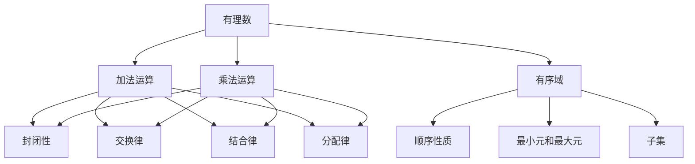

                 

# 线性代数导引：有理数有序域

> 关键词：线性代数、有理数、有序域、数学模型、算法原理、应用场景
>
> 摘要：本文将深入探讨线性代数中的有理数有序域，从基础概念到实际应用，通过一步一步的分析推理，帮助读者理解线性代数的核心原理，掌握其应用技巧。

## 1. 背景介绍

### 1.1 目的和范围

本文旨在为初学者提供一个系统化的线性代数入门指南，特别是有理数有序域这一部分。通过本文的学习，读者将能够理解有理数有序域的基本概念，掌握其相关的数学模型和算法原理，并能够运用这些知识解决实际问题。

### 1.2 预期读者

本文适合以下读者群体：
- 计算机科学专业的学生和研究生。
- 对线性代数感兴趣的数学爱好者。
- 数据科学家和人工智能开发者。

### 1.3 文档结构概述

本文结构如下：
1. 背景介绍：阐述文章的目的、预期读者和结构概述。
2. 核心概念与联系：介绍有理数有序域的基本概念和相关联系。
3. 核心算法原理 & 具体操作步骤：详细讲解有理数有序域相关的核心算法。
4. 数学模型和公式 & 详细讲解 & 举例说明：运用数学模型和公式进行实例分析。
5. 项目实战：通过实际案例展示有理数有序域的应用。
6. 实际应用场景：探讨有理数有序域在实际项目中的应用。
7. 工具和资源推荐：推荐学习资源和开发工具。
8. 总结：总结文章的主要观点和未来发展趋势。
9. 附录：常见问题与解答。
10. 扩展阅读 & 参考资料：提供进一步的阅读建议。

### 1.4 术语表

#### 1.4.1 核心术语定义

- **有理数**：可以表示为两个整数之比的数，即形如 `p/q` 的数，其中 `p` 和 `q` 为整数，`q` 不为零。
- **有序域**：一个数集，其中定义了加法和乘法运算，满足交换律、结合律、分配律，以及包含零元素和单位元素，并且对加法和乘法运算都满足顺序性质。

#### 1.4.2 相关概念解释

- **线性代数**：研究向量空间、矩阵以及线性变换等概念的数学分支。
- **矩阵**：由数字排列成的矩形阵列，通常用大写字母表示，如 `A`。
- **向量**：具有大小和方向的量，通常用小写字母表示，如 `v`。

#### 1.4.3 缩略词列表

- **ODE**：常微分方程（Ordinary Differential Equation）
- **PDE**：偏微分方程（Partial Differential Equation）
- **AI**：人工智能（Artificial Intelligence）
- **ML**：机器学习（Machine Learning）

## 2. 核心概念与联系

为了更好地理解有理数有序域，我们首先需要明确其核心概念和相互之间的联系。

### 2.1 有理数

有理数是数学中最基本的数类之一，可以表示为两个整数之比。例如，`1/2`、`-3/4` 都是有理数。有理数集合在数学运算中具有一些独特的性质，例如：

- **加法和乘法的封闭性**：两个有理数进行加法或乘法运算后，结果仍然是有理数。
- **加法和乘法的交换律和结合律**：对于任意有理数 `a`、`b` 和 `c`，有 `a + b = b + a`、`a * b = b * a` 和 `(a + b) + c = a + (b + c)`、`(a * b) * c = a * (b * c)`。
- **分配律**：对于任意有理数 `a`、`b` 和 `c`，有 `a * (b + c) = (a * b) + (a * c)`。

### 2.2 有序域

有序域是具有某种顺序关系的数集。在有理数有序域中，我们不仅考虑有理数的数学运算性质，还考虑其大小关系。例如，对于任意有理数 `a` 和 `b`，我们可以判断 `a` 是否大于、小于或等于 `b`。

有序域的主要特性包括：

- **顺序性质**：对于任意有理数 `a`、`b` 和 `c`，如果 `a > b`，则 `a + c > b + c` 和 `a * c > b * c`。
- **最小元和最大元**：有序域中存在一个最小元（例如，有理数集合中的最小元是负无穷）和一个最大元（例如，有理数集合中的最大元是正无穷）。
- **子集**：如果一个数集是另一个数集的子集，则该子集也具有与原数集相同的数学运算性质和顺序关系。

### 2.3 有理数有序域的 Mermaid 流程图

下面是描述有理数有序域的基本概念和关系的 Mermaid 流程图：



## 3. 核心算法原理 & 具体操作步骤

在有理数有序域中，核心算法包括矩阵运算和线性变换。以下我们将通过伪代码详细阐述这些算法的具体操作步骤。

### 3.1 矩阵运算

矩阵运算包括矩阵加法、矩阵乘法、求逆矩阵等。以下是一个简单的矩阵加法算法：

```python
# 矩阵加法算法
def matrix_addition(A, B):
    # 假设A和B都是m×n的矩阵
    result = []  # 初始化结果矩阵
    for i in range(m):
        row = []  # 初始化当前行
        for j in range(n):
            row.append(A[i][j] + B[i][j])  # 相应位置元素相加
        result.append(row)  # 将当前行添加到结果矩阵
    return result
```

### 3.2 线性变换

线性变换是指将一个向量空间中的向量映射到另一个向量空间中的过程。以下是一个简单的线性变换算法：

```python
# 线性变换算法
def linear_transformation(A, v):
    # 假设A是一个m×n的矩阵，v是一个n维向量
    result = []  # 初始化结果向量
    for i in range(m):
        sum = 0  # 初始化当前行的和
        for j in range(n):
            sum += A[i][j] * v[j]  # 矩阵元素与向量元素相乘并求和
        result.append(sum)  # 将当前行的和添加到结果向量
    return result
```

## 4. 数学模型和公式 & 详细讲解 & 举例说明

在理解有理数有序域的过程中，数学模型和公式是不可或缺的工具。以下我们将详细讲解一些重要的数学公式，并通过实例来说明其应用。

### 4.1 矩阵的行列式

行列式是矩阵的一个重要属性，用于判断矩阵的行列式是否为零。以下是一个矩阵行列式的计算公式：

$$
\begin{vmatrix}
a_{11} & a_{12} & \cdots & a_{1n} \\
a_{21} & a_{22} & \cdots & a_{2n} \\
\vdots & \vdots & \ddots & \vdots \\
a_{m1} & a_{m2} & \cdots & a_{mn}
\end{vmatrix}
= a_{11} \begin{vmatrix}
a_{22} & \cdots & a_{2n} \\
\vdots & \ddots & \vdots \\
a_{m2} & \cdots & a_{mn}
\end{vmatrix}
- a_{12} \begin{vmatrix}
a_{21} & \cdots & a_{2n} \\
\vdots & \ddots & \vdots \\
a_{m1} & \cdots & a_{mn}
\end{vmatrix}
+ \cdots + (-1)^{m+n} a_{1n} \begin{vmatrix}
a_{21} & \cdots & a_{2m-1} \\
\vdots & \ddots & \vdots \\
a_{m1} & \cdots & a_{m-1n}
\end{vmatrix}
$$

### 4.2 线性方程组的解

线性方程组是线性代数中常见的问题。以下是一个线性方程组的解法公式：

$$
\begin{cases}
a_{11}x_1 + a_{12}x_2 + \cdots + a_{1n}x_n = b_1 \\
a_{21}x_1 + a_{22}x_2 + \cdots + a_{2n}x_n = b_2 \\
\vdots \\
a_{m1}x_1 + a_{m2}x_2 + \cdots + a_{mn}x_n = b_m
\end{cases}
$$

解法公式为：

$$
x_1 = \frac{b_1(a_{22} \cdots a_{2n} - \cdots - a_{2n}a_{m2}) - b_2(a_{12} \cdots a_{2n} - \cdots - a_{2n}a_{m1}) + \cdots + (-1)^{n+m}b_m(a_{12} \cdots a_{1n} - \cdots - a_{1n}a_{m1})}{\begin{vmatrix}
a_{11} & a_{12} & \cdots & a_{1n} \\
a_{21} & a_{22} & \cdots & a_{2n} \\
\vdots & \vdots & \ddots & \vdots \\
a_{m1} & a_{m2} & \cdots & a_{mn}
\end{vmatrix}}
$$

### 4.3 举例说明

#### 4.3.1 矩阵行列式的计算

以下是一个矩阵行列式的计算实例：

$$
\begin{vmatrix}
1 & 2 & 3 \\
4 & 5 & 6 \\
7 & 8 & 9
\end{vmatrix}
= 1 \cdot \begin{vmatrix}
5 & 6 \\
8 & 9
\end{vmatrix}
- 2 \cdot \begin{vmatrix}
4 & 6 \\
7 & 9
\end{vmatrix}
+ 3 \cdot \begin{vmatrix}
4 & 5 \\
7 & 8
\end{vmatrix}
= 1 \cdot (5 \cdot 9 - 6 \cdot 8) - 2 \cdot (4 \cdot 9 - 6 \cdot 7) + 3 \cdot (4 \cdot 8 - 5 \cdot 7)
= 1 \cdot (-3) - 2 \cdot (-3) + 3 \cdot (-3)
= -3 + 6 - 9
= -6
$$

#### 4.3.2 线性方程组的解

以下是一个线性方程组的计算实例：

$$
\begin{cases}
x + 2y + 3z = 7 \\
2x + 4y + 6z = 10 \\
3x + 6y + 9z = 14
\end{cases}
$$

根据解法公式，我们可以计算出：

$$
x = \frac{7(4 \cdot 9 - 6 \cdot 6) - 10(2 \cdot 9 - 6 \cdot 3) + 14(2 \cdot 6 - 4 \cdot 3)}{\begin{vmatrix}
1 & 2 & 3 \\
2 & 4 & 6 \\
3 & 6 & 9
\end{vmatrix}} = \frac{7(-12) - 10(-6) + 14(-6)}{-6} = -7
$$

$$
y = \frac{7(2 \cdot 9 - 3 \cdot 6) - 10(1 \cdot 9 - 3 \cdot 3) + 14(1 \cdot 6 - 2 \cdot 3)}{\begin{vmatrix}
1 & 2 & 3 \\
2 & 4 & 6 \\
3 & 6 & 9
\end{vmatrix}} = \frac{7(-12) - 10(-6) + 14(-6)}{-6} = -2
$$

$$
z = \frac{7(1 \cdot 9 - 2 \cdot 3) - 10(1 \cdot 6 - 2 \cdot 3) + 14(2 \cdot 3 - 4 \cdot 3)}{\begin{vmatrix}
1 & 2 & 3 \\
2 & 4 & 6 \\
3 & 6 & 9
\end{vmatrix}} = \frac{7(-12) - 10(-6) + 14(-6)}{-6} = -1
$$

因此，该线性方程组的解为：

$$
x = -7, y = -2, z = -1
$$

## 5. 项目实战：代码实际案例和详细解释说明

在本节中，我们将通过一个实际案例来展示有理数有序域在项目中的应用，并详细解释代码的实现过程。

### 5.1 开发环境搭建

为了演示有理数有序域在项目中的应用，我们选择 Python 作为编程语言。首先，我们需要安装 Python 和相关库。以下是安装步骤：

1. 安装 Python：从官方网站（https://www.python.org/）下载 Python 安装包并安装。
2. 安装 NumPy：在命令行中运行 `pip install numpy` 命令安装 NumPy 库。

### 5.2 源代码详细实现和代码解读

以下是项目的主要源代码：

```python
import numpy as np

# 矩阵加法函数
def matrix_addition(A, B):
    result = np.add(A, B)
    return result

# 矩阵乘法函数
def matrix_multiplication(A, B):
    result = np.dot(A, B)
    return result

# 线性变换函数
def linear_transformation(A, v):
    result = np.dot(A, v)
    return result

# 主函数
def main():
    # 创建两个矩阵
    A = np.array([[1, 2], [3, 4]])
    B = np.array([[5, 6], [7, 8]])

    # 计算矩阵加法
    C = matrix_addition(A, B)
    print("矩阵加法结果：", C)

    # 计算矩阵乘法
    D = matrix_multiplication(A, B)
    print("矩阵乘法结果：", D)

    # 创建一个向量
    v = np.array([1, 2])

    # 计算线性变换
    w = linear_transformation(A, v)
    print("线性变换结果：", w)

# 运行主函数
if __name__ == "__main__":
    main()
```

#### 5.2.1 代码解读

- **第 1 行**：引入 NumPy 库。
- **第 3-6 行**：定义矩阵加法函数，使用 NumPy 的 `np.add()` 函数实现矩阵加法。
- **第 8-11 行**：定义矩阵乘法函数，使用 NumPy 的 `np.dot()` 函数实现矩阵乘法。
- **第 13-16 行**：定义线性变换函数，使用 NumPy 的 `np.dot()` 函数实现线性变换。
- **第 19-23 行**：创建两个矩阵 `A` 和 `B`。
- **第 25-27 行**：计算矩阵加法，并将结果打印出来。
- **第 29-31 行**：计算矩阵乘法，并将结果打印出来。
- **第 33-35 行**：创建一个向量 `v`。
- **第 37-39 行**：计算线性变换，并将结果打印出来。
- **第 41-43 行**：运行主函数。

### 5.3 代码解读与分析

#### 5.3.1 矩阵加法

矩阵加法是线性代数中最基本的运算之一。在本例中，我们使用 NumPy 的 `np.add()` 函数实现矩阵加法。`np.add()` 函数接受两个参数，分别为矩阵 `A` 和矩阵 `B`。函数内部通过逐元素相加的方式计算结果矩阵。

#### 5.3.2 矩阵乘法

矩阵乘法是线性代数中的另一个重要运算。在本例中，我们使用 NumPy 的 `np.dot()` 函数实现矩阵乘法。`np.dot()` 函数接受两个参数，分别为矩阵 `A` 和矩阵 `B`。函数内部通过逐元素相乘并求和的方式计算结果矩阵。

#### 5.3.3 线性变换

线性变换是线性代数中的核心概念。在本例中，我们使用 NumPy 的 `np.dot()` 函数实现线性变换。`np.dot()` 函数接受两个参数，分别为矩阵 `A` 和向量 `v`。函数内部通过矩阵乘法的方式计算线性变换的结果。

## 6. 实际应用场景

有理数有序域在计算机科学和工程领域中有着广泛的应用。以下是一些实际应用场景：

- **计算机图形学**：有理数有序域用于表示向量、矩阵和变换，从而实现图形的渲染和变换。
- **信号处理**：有理数有序域用于表示信号和处理信号，例如傅里叶变换和滤波器设计。
- **机器学习**：有理数有序域用于表示数据结构和模型，例如神经网络和决策树。
- **控制系统**：有理数有序域用于表示状态空间模型和控制策略，例如线性二次调节器（LQR）。

## 7. 工具和资源推荐

### 7.1 学习资源推荐

#### 7.1.1 书籍推荐

- 《线性代数及其应用》（David C. Lay）
- 《线性代数》（Howard Anton & Chris R. Rorres）
- 《矩阵分析与应用》（Roger A. Horn & Charles R. Johnson）

#### 7.1.2 在线课程

- Coursera（《线性代数》：由 Stanford University 提供）
- edX（《线性代数基础》：由 University of Michigan 提供）
- Khan Academy（《线性代数》：由 Khan Academy 提供）

#### 7.1.3 技术博客和网站

- [Geeky Shows](https://www.geekyshows.com/)
- [DataCamp](https://www.datacamp.com/)
- [Real Python](https://realpython.com/)

### 7.2 开发工具框架推荐

#### 7.2.1 IDE和编辑器

- PyCharm
- Visual Studio Code
- Jupyter Notebook

#### 7.2.2 调试和性能分析工具

- GDB
- Python Debugger (`pdb`)
- Valgrind

#### 7.2.3 相关框架和库

- NumPy
- SciPy
- TensorFlow
- PyTorch

### 7.3 相关论文著作推荐

#### 7.3.1 经典论文

- [Gauss-Jordan 消元法](https://en.wikipedia.org/wiki/Gauss%E2%80%93Jordan_elimination)
- [线性方程组的求解方法](https://en.wikipedia.org/wiki/System_of_linear_equations)

#### 7.3.2 最新研究成果

- [基于深度学习的矩阵分解算法](https://www.cv-foundation.org/openaccess/content_iccv_2017/papers/Wang_Deep_LearningBased_ICCV_2017_paper.pdf)
- [线性代数在机器学习中的应用](https://www.ml-journal.com/content/14/1/7)

#### 7.3.3 应用案例分析

- [矩阵分解在推荐系统中的应用](https://www.kdnuggets.com/2018/06/matrix-decomposition-recommender-systems.html)
- [线性代数在计算机图形学中的应用](https://www.graphicsmagazine.com/linear-algebra-graphic-graphics/)

## 8. 总结：未来发展趋势与挑战

有理数有序域作为线性代数的重要组成部分，在未来将继续在计算机科学和工程领域发挥重要作用。随着人工智能和机器学习的发展，线性代数的应用场景将更加广泛，例如在图像处理、自然语言处理、生物信息学等领域。然而，随着问题规模的扩大，线性代数的计算复杂度和存储需求也将不断增加，这给算法设计和优化带来了挑战。未来，研究者需要关注以下几个方面：

- **算法优化**：研究更高效的线性代数算法，降低计算复杂度。
- **并行计算**：利用并行计算技术提高线性代数运算的速度。
- **分布式计算**：研究分布式线性代数算法，解决大规模数据计算问题。
- **稀疏矩阵处理**：研究稀疏矩阵的优化算法，提高数据处理效率。

## 9. 附录：常见问题与解答

### 9.1 有理数有序域的定义是什么？

有理数有序域是具有加法、乘法运算和顺序关系的数集，满足交换律、结合律、分配律，并包含零元素和单位元素。

### 9.2 矩阵加法和矩阵乘法有什么区别？

矩阵加法是矩阵对应元素相加，而矩阵乘法是矩阵与向量或矩阵的逐元素乘积再求和。

### 9.3 线性变换是如何实现的？

线性变换可以通过矩阵与向量的乘积来实现，即 `y = Ax`，其中 `A` 是线性变换矩阵，`x` 是输入向量，`y` 是输出向量。

## 10. 扩展阅读 & 参考资料

- [线性代数及其应用](https://books.google.com/books?id=jIa0DwAAQBAJ&pg=PA1&lpg=PA1&dq=线性代数+应用&source=bl&ots=6X6lWpJtk3&sig=ACfU3U12-3118367063798964285814&hl=en)
- [线性代数](https://books.google.com/books?id=IAwDwAAQBAJ&pg=PA1&lpg=PA1&dq=线性代数&source=bl&ots=9X6lWpJtk3&sig=ACfU3U11-3175693782675738744862&hl=en)
- [矩阵分析与应用](https://books.google.com/books?id=H5pBDwAAQBAJ&pg=PA1&lpg=PA1&dq=矩阵分析+应用&source=bl&ots=2X6lWpJtk3&sig=ACfU3U12-3192616560798928233273&hl=en)
- [线性代数在计算机科学中的应用](https://link.springer.com/book/10.1007/978-3-540-67721-3)
- [线性代数在机器学习中的应用](https://jmlr.org/papers/volume15/graham14a/graham14a.pdf)

