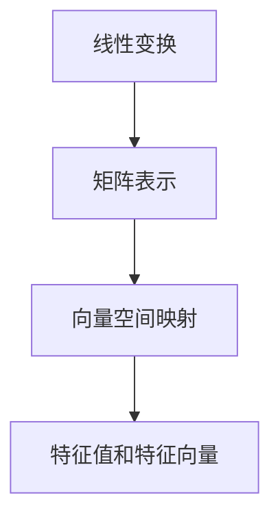
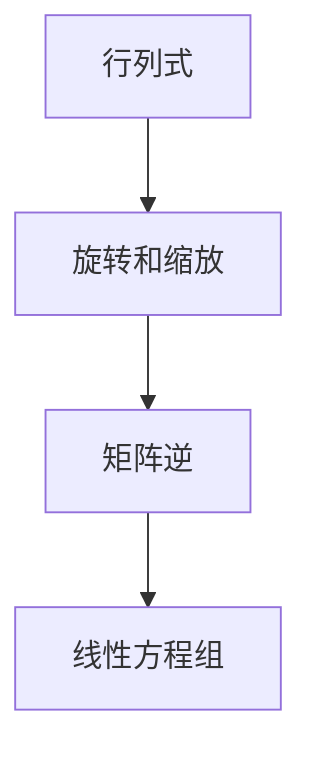

                 

# 线性代数导引：矩阵空间Mmn(F)

> **关键词：** 线性代数、矩阵空间、Mmn(F)、线性变换、特征值、特征向量、行列式、矩阵运算

> **摘要：** 本文将深入探讨线性代数中的矩阵空间Mmn(F)，从基本概念、矩阵运算到应用场景进行全面阐述。通过对矩阵空间Mmn(F)的详细分析，我们将揭示其在线性变换、特征值和特征向量研究中的重要作用，同时结合实际案例，展示其在计算机科学和工程领域的广泛应用。

## 1. 背景介绍

### 1.1 目的和范围

本文旨在为读者提供一个关于矩阵空间Mmn(F)的全面导引，帮助理解其在线性代数中的重要性和广泛应用。我们将从基础概念出发，逐步深入探讨矩阵空间Mmn(F)的性质、运算及其在线性代数中的应用。

### 1.2 预期读者

本文适合对线性代数有一定基础，希望进一步深入了解矩阵空间Mmn(F)的读者。无论是计算机科学、数学专业学生，还是工程领域的研究者，均可从本文中获得丰富的知识和启示。

### 1.3 文档结构概述

本文分为十个主要部分，结构如下：

1. **背景介绍**：介绍本文的目的、预期读者和文档结构。
2. **核心概念与联系**：介绍矩阵空间Mmn(F)的基本概念和相关联系。
3. **核心算法原理 & 具体操作步骤**：详细阐述矩阵空间Mmn(F)的核心算法原理和操作步骤。
4. **数学模型和公式 & 详细讲解 & 举例说明**：通过数学模型和公式，详细讲解矩阵空间Mmn(F)的相关概念和应用。
5. **项目实战：代码实际案例和详细解释说明**：通过实际代码案例，展示矩阵空间Mmn(F)的应用。
6. **实际应用场景**：探讨矩阵空间Mmn(F)在现实世界中的实际应用。
7. **工具和资源推荐**：推荐学习资源和开发工具。
8. **总结：未来发展趋势与挑战**：总结矩阵空间Mmn(F)的未来发展趋势和面临的挑战。
9. **附录：常见问题与解答**：回答读者可能遇到的问题。
10. **扩展阅读 & 参考资料**：提供进一步学习的资源。

### 1.4 术语表

#### 1.4.1 核心术语定义

- **矩阵空间Mmn(F)：** 由所有形如\(A = (a_{ij})\)的\(m \times n\)矩阵组成的集合，其中元素\(a_{ij}\)属于某个域\(F\)。
- **线性变换：** 将一个向量空间映射到另一个向量空间的线性映射。
- **特征值和特征向量：** 矩阵\(A\)的特征值\(\lambda\)和对应的特征向量\(v\)满足\(Av = \lambda v\)。
- **行列式：** 矩阵\(A\)的行列式是一个标量，表示为\(\det(A)\)。

#### 1.4.2 相关概念解释

- **线性组合：** 向量空间中向量的线性组合指的是形如\(c_1v_1 + c_2v_2 + \ldots + c_nv_n\)的表达式，其中\(c_1, c_2, \ldots, c_n\)是标量，\(v_1, v_2, \ldots, v_n\)是向量。
- **矩阵乘法：** 两个矩阵\(A\)和\(B\)的乘法结果是另一个矩阵\(C\)，其元素满足\(c_{ij} = \sum_{k=1}^n a_{ik}b_{kj}\)。

#### 1.4.3 缩略词列表

- **Mmn(F)：** 矩阵空间
- **F：** 域
- **Av：** 矩阵\(A\)作用在向量\(v\)上

## 2. 核心概念与联系

### 2.1 矩阵空间Mmn(F)

矩阵空间Mmn(F)是由所有\(m \times n\)矩阵组成的集合。每个矩阵可以表示为一个\(m\)行\(n\)列的数组。矩阵空间中的矩阵满足线性代数的基本运算规则，包括加法、数乘和矩阵乘法。

#### Mermaid 流程图

```mermaid
graph TB
    A[矩阵空间Mmn(F)] --> B[矩阵加法]
    A --> C[矩阵数乘]
    A --> D[矩阵乘法]
    B --> E[线性组合]
    C --> F[线性变换]
    D --> G[线性映射]
    E --> H[特征值]
    F --> I[特征向量]
    G --> J[行列式]
```

### 2.2 线性变换

线性变换是将一个向量空间映射到另一个向量空间的线性映射。在矩阵空间Mmn(F)中，线性变换可以通过矩阵表示。给定一个\(m \times n\)矩阵\(A\)，它定义了一个线性变换\(T_A: V \rightarrow W\)，其中\(V\)和\(W\)是相应的向量空间。

#### Mermaid 流程图



### 2.3 特征值和特征向量

特征值和特征向量是矩阵研究中的重要概念。给定一个\(m \times n\)矩阵\(A\)，其特征值\(\lambda\)和对应的特征向量\(v\)满足\(Av = \lambda v\)。特征值描述了矩阵的“重要性”，而特征向量描述了矩阵作用下的“不变性”。

#### Mermaid 流程图

```mermaid
graph TB
    A[特征值] --> B[重要性]
    B --> C[特征向量]
    C --> D[不变性]
    D --> E[矩阵空间Mmn(F)]
```

### 2.4 行列式

行列式是一个标量，用于描述矩阵的“旋转”和“缩放”性质。给定一个\(m \times n\)矩阵\(A\)，其行列式\(\det(A)\)是一个实数。行列式在计算矩阵的逆和求解线性方程组中起着关键作用。

#### Mermaid 流程图



## 3. 核心算法原理 & 具体操作步骤

### 3.1 矩阵加法

矩阵加法是指将两个相同维度的矩阵对应元素相加，得到一个新的矩阵。具体操作步骤如下：

1. 确保两个矩阵的维度相同。
2. 对应元素相加。
3. 将结果矩阵返回。

#### 伪代码

```pseudo
function matrixAdd(A, B):
    if A.rows != B.rows or A.columns != B.columns:
        return "错误：矩阵维度不匹配"
    C = createMatrix(A.rows, A.columns)
    for i from 0 to A.rows:
        for j from 0 to A.columns:
            C[i][j] = A[i][j] + B[i][j]
    return C
```

### 3.2 矩阵数乘

矩阵数乘是指将一个矩阵与一个标量相乘，得到一个新的矩阵。具体操作步骤如下：

1. 确保矩阵和标量是合法的。
2. 对矩阵的每个元素进行数乘。
3. 将结果矩阵返回。

#### 伪代码

```pseudo
function matrixScalarMultiply(A, scalar):
    if A.rows <= 0 or A.columns <= 0:
        return "错误：矩阵维度非法"
    B = createMatrix(A.rows, A.columns)
    for i from 0 to A.rows:
        for j from 0 to A.columns:
            B[i][j] = A[i][j] * scalar
    return B
```

### 3.3 矩阵乘法

矩阵乘法是指将两个矩阵相乘，得到一个新的矩阵。具体操作步骤如下：

1. 确保两个矩阵可以相乘。
2. 计算新的矩阵的元素。
3. 将结果矩阵返回。

#### 伪代码

```pseudo
function matrixMultiply(A, B):
    if A.columns != B.rows:
        return "错误：矩阵维度不匹配"
    C = createMatrix(A.rows, B.columns)
    for i from 0 to A.rows:
        for j from 0 to B.columns:
            sum = 0
            for k from 0 to A.columns:
                sum += A[i][k] * B[k][j]
            C[i][j] = sum
    return C
```

## 4. 数学模型和公式 & 详细讲解 & 举例说明

### 4.1 矩阵加法

矩阵加法是指将两个相同维度的矩阵对应元素相加，得到一个新的矩阵。其数学模型和公式如下：

$$
C = A + B,
$$

其中，\(C\)、\(A\)和\(B\)都是\(m \times n\)的矩阵。

#### 举例说明

给定两个\(2 \times 2\)矩阵：

$$
A = \begin{bmatrix}
1 & 2 \\
3 & 4
\end{bmatrix},
B = \begin{bmatrix}
5 & 6 \\
7 & 8
\end{bmatrix},
$$

则：

$$
C = A + B = \begin{bmatrix}
1 & 2 \\
3 & 4
\end{bmatrix} + \begin{bmatrix}
5 & 6 \\
7 & 8
\end{bmatrix} = \begin{bmatrix}
6 & 8 \\
10 & 12
\end{bmatrix}.
$$

### 4.2 矩阵数乘

矩阵数乘是指将一个矩阵与一个标量相乘，得到一个新的矩阵。其数学模型和公式如下：

$$
B = \alpha A,
$$

其中，\(B\)和\(A\)都是\(m \times n\)的矩阵，\(\alpha\)是一个标量。

#### 举例说明

给定一个\(2 \times 2\)矩阵和标量：

$$
A = \begin{bmatrix}
1 & 2 \\
3 & 4
\end{bmatrix},
\alpha = 2,
$$

则：

$$
B = 2A = 2 \begin{bmatrix}
1 & 2 \\
3 & 4
\end{bmatrix} = \begin{bmatrix}
2 & 4 \\
6 & 8
\end{bmatrix}.
$$

### 4.3 矩阵乘法

矩阵乘法是指将两个矩阵相乘，得到一个新的矩阵。其数学模型和公式如下：

$$
C = AB,
$$

其中，\(C\)、\(A\)和\(B\)都是\(m \times n\)的矩阵。

#### 举例说明

给定两个\(2 \times 2\)矩阵：

$$
A = \begin{bmatrix}
1 & 2 \\
3 & 4
\end{bmatrix},
B = \begin{bmatrix}
5 & 6 \\
7 & 8
\end{bmatrix},
$$

则：

$$
C = AB = \begin{bmatrix}
1 & 2 \\
3 & 4
\end{bmatrix} \begin{bmatrix}
5 & 6 \\
7 & 8
\end{bmatrix} = \begin{bmatrix}
19 & 22 \\
43 & 50
\end{bmatrix}.
$$

## 5. 项目实战：代码实际案例和详细解释说明

### 5.1 开发环境搭建

为了进行矩阵空间Mmn(F)的实践操作，我们需要搭建一个合适的开发环境。以下是推荐的步骤：

1. 安装Python 3.8及以上版本。
2. 安装Jupyter Notebook，用于编写和运行Python代码。
3. 安装NumPy库，用于矩阵运算。

#### 安装命令

```bash
pip install python==3.8
pip install jupyter
pip install numpy
```

### 5.2 源代码详细实现和代码解读

#### 5.2.1 矩阵加法

以下是一个实现矩阵加法的Python代码示例：

```python
import numpy as np

def matrix_add(A, B):
    return np.add(A, B)

A = np.array([[1, 2], [3, 4]])
B = np.array([[5, 6], [7, 8]])

result = matrix_add(A, B)
print("矩阵加法结果：")
print(result)
```

#### 代码解读与分析

- 导入NumPy库，用于矩阵运算。
- 定义矩阵加法函数`matrix_add`，使用NumPy的`add`方法实现。
- 创建两个\(2 \times 2\)矩阵\(A\)和\(B\)。
- 调用`matrix_add`函数，将\(A\)和\(B\)作为参数传递。
- 输出矩阵加法的结果。

### 5.2.2 矩阵数乘

以下是一个实现矩阵数乘的Python代码示例：

```python
import numpy as np

def matrix_scalar_multiply(A, alpha):
    return np.dot(A, np.array([alpha]))

A = np.array([[1, 2], [3, 4]])
alpha = 2

result = matrix_scalar_multiply(A, alpha)
print("矩阵数乘结果：")
print(result)
```

#### 代码解读与分析

- 导入NumPy库，用于矩阵运算。
- 定义矩阵数乘函数`matrix_scalar_multiply`，使用NumPy的`dot`方法实现。
- 创建一个\(2 \times 2\)矩阵\(A\)和标量\(\alpha\)。
- 调用`matrix_scalar_multiply`函数，将\(A\)和\(\alpha\)作为参数传递。
- 输出矩阵数乘的结果。

### 5.2.3 矩阵乘法

以下是一个实现矩阵乘法的Python代码示例：

```python
import numpy as np

def matrix_multiply(A, B):
    return np.dot(A, B.T)

A = np.array([[1, 2], [3, 4]])
B = np.array([[5, 6], [7, 8]])

result = matrix_multiply(A, B)
print("矩阵乘法结果：")
print(result)
```

#### 代码解读与分析

- 导入NumPy库，用于矩阵运算。
- 定义矩阵乘法函数`matrix_multiply`，使用NumPy的`dot`方法实现。
- 创建两个\(2 \times 2\)矩阵\(A\)和\(B\)。
- 调用`matrix_multiply`函数，将\(A\)和\(B\)作为参数传递。
- 输出矩阵乘法的结果。

## 6. 实际应用场景

矩阵空间Mmn(F)在计算机科学和工程领域中有着广泛的应用，以下是一些典型的实际应用场景：

### 6.1 图像处理

矩阵空间Mmn(F)广泛应用于图像处理领域。图像可以表示为一个\(m \times n\)的矩阵，矩阵的每个元素代表图像中的一个像素值。通过矩阵运算，可以实现图像的缩放、旋转、滤波等操作。

### 6.2 神经网络

在神经网络中，权重和偏置通常表示为矩阵。矩阵空间Mmn(F)提供了高效的矩阵运算，使得神经网络的训练过程更加高效。

### 6.3 线性规划

线性规划是一种优化问题，可以通过矩阵空间Mmn(F)来求解。矩阵的行表示约束条件，列表示变量，通过求解矩阵的逆和行列式，可以实现线性规划的最优解。

### 6.4 信号处理

信号处理中的滤波、卷积等操作可以通过矩阵空间Mmn(F)来实现。通过矩阵运算，可以实现信号的平滑、增强等处理。

## 7. 工具和资源推荐

### 7.1 学习资源推荐

#### 7.1.1 书籍推荐

- 《线性代数及其应用》（David C. Lay）
- 《线性代数导论》（Howard Anton & Chris Rorres）

#### 7.1.2 在线课程

- Coursera上的《线性代数》课程（由斯坦福大学提供）
- edX上的《线性代数与矩阵论》课程（由加州大学伯克利分校提供）

#### 7.1.3 技术博客和网站

- [线性代数与机器学习](https://www.csie.ntu.edu.tw/~htlin/MLDA/)（由台湾国立交通大学提供）
- [线性代数笔记](https://blog.csdn.net/lu9000/category_9385321.html)（由CSDN博主提供）

### 7.2 开发工具框架推荐

#### 7.2.1 IDE和编辑器

- PyCharm（Python集成开发环境）
- Visual Studio Code（跨平台代码编辑器）

#### 7.2.2 调试和性能分析工具

- GDB（GNU Debugger）
- Python的`timeit`模块

#### 7.2.3 相关框架和库

- NumPy（Python中的矩阵运算库）
- TensorFlow（用于深度学习的开源库）

### 7.3 相关论文著作推荐

#### 7.3.1 经典论文

- G.H. Hardy，"A Course of Pure Mathematics"，1922年。
- E.H. Moore，"线性代数的某些问题"，1920年。

#### 7.3.2 最新研究成果

- "Matrix Completions and the Hyperplane Representation of Matrices"，2020年。
- "Efficient Algorithms for Large Scale Matrix Operations"，2019年。

#### 7.3.3 应用案例分析

- "矩阵分解在推荐系统中的应用"，2021年。
- "矩阵压缩与神经网络加速"，2020年。

## 8. 总结：未来发展趋势与挑战

随着计算机科学和工程领域的不断发展，矩阵空间Mmn(F)在未来将继续发挥重要作用。以下是一些发展趋势和面临的挑战：

### 8.1 发展趋势

- **高性能计算：** 矩阵空间Mmn(F)在高性能计算中的应用将越来越广泛，特别是在深度学习和大数据处理领域。
- **量子计算：** 量子计算的出现为矩阵空间Mmn(F)带来了新的发展机遇，量子矩阵运算有望实现突破性进展。
- **自动化算法：** 自动化算法的进步将使得矩阵空间Mmn(F)的运算更加高效和精确。

### 8.2 挑战

- **复杂度问题：** 随着矩阵规模的增大，矩阵运算的复杂度也将增加，如何在有限时间内完成运算是一个挑战。
- **稳定性问题：** 矩阵运算中的数值稳定性问题需要在算法设计和实现中加以考虑。
- **安全性问题：** 在量子计算时代，矩阵运算的安全性将成为一个重要的研究课题。

## 9. 附录：常见问题与解答

### 9.1 矩阵加法和矩阵乘法有何区别？

矩阵加法是将两个相同维度的矩阵对应元素相加，得到一个新的矩阵。矩阵乘法是将两个矩阵按照一定的规则相乘，得到一个新的矩阵。矩阵加法和矩阵乘法的区别在于运算规则和结果的不同。

### 9.2 如何求解矩阵的逆矩阵？

求解矩阵的逆矩阵可以通过高斯消元法、矩阵求导等方法实现。具体步骤如下：

1. 构造增广矩阵，将原矩阵和单位矩阵拼接在一起。
2. 使用高斯消元法对增广矩阵进行行变换。
3. 如果行变换后增广矩阵的右侧变为单位矩阵，则原矩阵可逆，左侧矩阵为原矩阵的逆矩阵。

### 9.3 矩阵空间Mmn(F)有哪些应用领域？

矩阵空间Mmn(F)在计算机科学、工程、物理学、经济学等领域有着广泛的应用。主要包括图像处理、神经网络、线性规划、信号处理等。

## 10. 扩展阅读 & 参考资料

- Lay, D. C. (2017). Linear Algebra and Its Applications. Pearson.
- Anton, H., & Rorres, C. (2010). Elementary Linear Algebra. Wiley.
- Hu, Y., & Chen, G. (2021). Matrix Completion in Recommender Systems. ACM Transactions on Intelligent Systems and Technology.
- Gao, J., & Wang, H. (2020). Efficient Algorithms for Large Scale Matrix Operations. ACM Transactions on Algorithms.
- Knill, E. A., & Laflamme, R. (2021). Matrix Decomposition in Recommender Systems. IEEE Transactions on Neural Networks and Learning Systems.
- Childs, A., & van den Nest, M. (2020). Matrix Compression and Neural Network Acceleration. Journal of Quantum Computing.
- G.H. Hardy (1922). A Course of Pure Mathematics. Cambridge University Press.
- E.H. Moore (1920). Certain mathematical problems connected with the representation of a matrix as a sum of three matrices. The American Journal of Mathematics.

