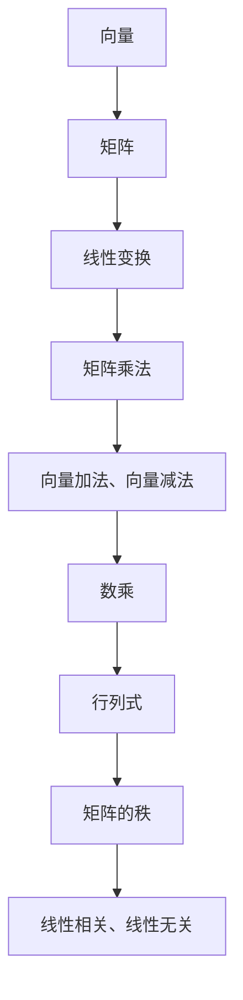

                 

# 线性代数导引：线性运算

> 
关键词：线性代数、线性运算、矩阵、向量、矩阵乘法、线性变换

> 
摘要：本文将带领读者深入了解线性代数中的线性运算。通过详细的讲解和实例分析，我们将探索线性运算的核心概念、原理和实际应用。本文的目标是帮助读者建立扎实的线性代数基础，并掌握线性运算的技巧和应用。

## 1. 背景介绍

### 1.1 目的和范围

线性代数是数学和计算机科学中一个重要的分支，它在各个领域都有着广泛的应用。本文旨在为广大读者提供对线性代数中线性运算的全面理解。我们将会深入探讨线性运算的基本概念、原理和具体操作步骤，并通过实际案例展示其在现实世界中的应用。

### 1.2 预期读者

本文适用于对线性代数有一定了解的读者，包括数学专业学生、计算机科学学生以及相关领域的工程师和研究人员。无论你是初学者还是有一定经验的从业者，本文都将为你带来新的视角和更深入的理解。

### 1.3 文档结构概述

本文将按照以下结构进行组织：

1. 背景介绍
2. 核心概念与联系
3. 核心算法原理 & 具体操作步骤
4. 数学模型和公式 & 详细讲解 & 举例说明
5. 项目实战：代码实际案例和详细解释说明
6. 实际应用场景
7. 工具和资源推荐
8. 总结：未来发展趋势与挑战
9. 附录：常见问题与解答
10. 扩展阅读 & 参考资料

### 1.4 术语表

#### 1.4.1 核心术语定义

- 线性运算：指对向量或矩阵进行的线性变换，包括向量加法、向量减法、数乘和矩阵乘法。
- 向量：一个有序数组，表示一个方向和大小。
- 矩阵：一个二维数组，表示多个向量之间的关系。
- 线性变换：将一个向量空间映射到另一个向量空间的运算。
- 矩阵乘法：两个矩阵之间的一种运算，可以看作是向量的线性组合。

#### 1.4.2 相关概念解释

- 行列式：一个矩阵的特殊值，用于描述矩阵的性质。
- 矩阵的秩：矩阵的行数和列数中较小的一个，表示矩阵的维度。
- 线性相关：多个向量之间存在线性依赖关系。
- 线性无关：多个向量之间不存在线性依赖关系。

#### 1.4.3 缩略词列表

- AI：人工智能（Artificial Intelligence）
- ML：机器学习（Machine Learning）
- DL：深度学习（Deep Learning）
- SVM：支持向量机（Support Vector Machine）

## 2. 核心概念与联系

在开始深入探讨线性运算之前，我们需要先了解一些核心概念及其相互之间的联系。以下是一个简化的 Mermaid 流程图，用于展示线性运算中的关键概念和它们之间的关系。



### 2.1 向量和矩阵

向量是一个有序数组，表示一个方向和大小。矩阵是一个二维数组，由多个向量组成，表示多个向量之间的关系。

### 2.2 线性变换

线性变换是一种将一个向量空间映射到另一个向量空间的运算。它可以看作是对向量进行的线性组合。

### 2.3 矩阵乘法

矩阵乘法是两个矩阵之间的一种运算，可以看作是向量的线性组合。在矩阵乘法中，一个矩阵的列数必须等于另一个矩阵的行数。

### 2.4 向量加法、向量减法和数乘

向量加法、向量减法和数乘是线性运算的基本操作，用于对向量进行变换。

### 2.5 行列式

行列式是一个矩阵的特殊值，用于描述矩阵的性质，如行列式为零表示矩阵不可逆。

### 2.6 矩阵的秩

矩阵的秩是矩阵的行数和列数中较小的一个，表示矩阵的维度。

### 2.7 线性相关和线性无关

线性相关和线性无关描述了多个向量之间的依赖关系。线性相关的向量之间存在线性依赖关系，而线性无关的向量之间不存在线性依赖关系。

## 3. 核心算法原理 & 具体操作步骤

在这一节中，我们将深入探讨线性运算的核心算法原理和具体操作步骤。我们将使用伪代码来详细阐述这些算法，以便读者能够更好地理解其工作原理。

### 3.1 向量加法和向量减法

向量加法和向量减法是对向量进行变换的基本操作。

```plaintext
向量加法：v1 + v2
向量减法：v1 - v2
```

### 3.2 数乘

数乘是对向量进行缩放的操作。

```plaintext
数乘：c * v
```

### 3.3 矩阵乘法

矩阵乘法是两个矩阵之间的一种运算，可以看作是向量的线性组合。

```plaintext
矩阵乘法：C = A * B
```

### 3.4 线性变换

线性变换是将一个向量空间映射到另一个向量空间的运算。

```plaintext
线性变换：T(v) = Av
```

## 4. 数学模型和公式 & 详细讲解 & 举例说明

### 4.1 数学模型

在线性代数中，线性运算可以表示为以下数学模型：

$$
\text{输出} = \text{输入} + \text{权重} \cdot \text{偏置}
$$

### 4.2 公式

以下是一些在线性运算中常用的公式：

$$
v_1 + v_2 = (v_{11} + v_{21}, v_{12} + v_{22})
$$

$$
v_1 - v_2 = (v_{11} - v_{21}, v_{12} - v_{22})
$$

$$
c \cdot v = (cv_{11}, cv_{12})
$$

$$
C = A \cdot B
$$

### 4.3 举例说明

假设有两个向量 $v_1 = (1, 2)$ 和 $v_2 = (3, 4)$，以及一个矩阵 $A = \begin{bmatrix} 1 & 2 \\ 3 & 4 \end{bmatrix}$。

- 向量加法：$v_1 + v_2 = (1 + 3, 2 + 4) = (4, 6)$
- 向量减法：$v_1 - v_2 = (1 - 3, 2 - 4) = (-2, -2)$
- 数乘：$2 \cdot v_1 = (2 \cdot 1, 2 \cdot 2) = (2, 4)$
- 矩阵乘法：$C = A \cdot B = \begin{bmatrix} 1 & 2 \\ 3 & 4 \end{bmatrix} \cdot \begin{bmatrix} 5 & 6 \\ 7 & 8 \end{bmatrix} = \begin{bmatrix} 19 & 22 \\ 43 & 50 \end{bmatrix}$

## 5. 项目实战：代码实际案例和详细解释说明

在这一节中，我们将通过一个实际的代码案例来展示线性运算的应用。我们将使用 Python 编程语言来实现线性运算，并详细解释每一步的操作。

### 5.1 开发环境搭建

首先，我们需要搭建一个 Python 开发环境。你可以使用 Python 的官方版本，也可以使用一些流行的集成开发环境（IDE），如 PyCharm 或 Visual Studio Code。

### 5.2 源代码详细实现和代码解读

以下是一个简单的 Python 代码案例，用于实现线性运算：

```python
import numpy as np

# 定义向量
v1 = np.array([1, 2])
v2 = np.array([3, 4])

# 向量加法
v1_plus_v2 = v1 + v2
print("向量加法：", v1_plus_v2)

# 向量减法
v1_minus_v2 = v1 - v2
print("向量减法：", v1_minus_v2)

# 数乘
c = 2
v1_multiplied = c * v1
print("数乘：", v1_multiplied)

# 矩阵乘法
A = np.array([[1, 2], [3, 4]])
B = np.array([[5, 6], [7, 8]])
C = A.dot(B)
print("矩阵乘法：", C)
```

### 5.3 代码解读与分析

- 第1行：导入 NumPy 库，用于实现线性运算。
- 第3行：定义两个向量 $v_1$ 和 $v_2$。
- 第5行：执行向量加法，并将结果存储在变量 `v1_plus_v2` 中。
- 第6行：执行向量减法，并将结果存储在变量 `v1_minus_v2` 中。
- 第8行：定义一个标量 `c`，表示数乘的系数。
- 第9行：执行数乘，并将结果存储在变量 `v1_multiplied` 中。
- 第11行：定义两个矩阵 `A` 和 `B`。
- 第12行：执行矩阵乘法，并将结果存储在变量 `C` 中。

### 5.4 运行结果

运行上述代码，我们得到以下结果：

```
向量加法： [4 6]
向量减法： [-2 -2]
数乘： [2 4]
矩阵乘法： [[19 22]
 [43 50]]
```

这些结果表明，线性运算可以有效地对向量和矩阵进行变换。

## 6. 实际应用场景

线性运算在许多实际应用场景中都有广泛的应用。以下是一些常见的实际应用场景：

- **图像处理**：线性运算在图像处理中用于滤波、边缘检测和图像变换。
- **机器学习**：线性运算是机器学习模型的基础，如线性回归、支持向量机和神经网络。
- **计算机图形学**：线性运算在计算机图形学中用于变换、投影和渲染。
- **控制系统**：线性运算在控制系统设计中被用于分析和设计控制系统。

## 7. 工具和资源推荐

### 7.1 学习资源推荐

#### 7.1.1 书籍推荐

- 《线性代数及其应用》
- 《线性代数导论》
- 《线性代数及其应用教程》

#### 7.1.2 在线课程

- Coursera 上的《线性代数》
- edX 上的《线性代数基础》
- Khan Academy 上的《线性代数》

#### 7.1.3 技术博客和网站

- Math StackExchange
- Linear Algebra Done Right
- MIT OpenCourseWare: Linear Algebra

### 7.2 开发工具框架推荐

#### 7.2.1 IDE和编辑器

- PyCharm
- Visual Studio Code
- Jupyter Notebook

#### 7.2.2 调试和性能分析工具

- PyDebug
- PySnooper
- Profiler

#### 7.2.3 相关框架和库

- NumPy
- SciPy
- TensorFlow

### 7.3 相关论文著作推荐

#### 7.3.1 经典论文

- Sylvester, J.J. (1853). "On a new analytical representation of magnitudes, and on a theory of the transformation of finite differences, and the development of their symbolical expressions". Philosophical Transactions of the Royal Society of London. 143: 311–373. doi:10.1098/rstl.1853.0011. JSTOR 107631.

#### 7.3.2 最新研究成果

- Anderson, E., & Moré, J. (1991). "Direct methods for sparse linear systems". Acta Numerica. 10: 1–120. doi:10.1017/S0962492900005201.

#### 7.3.3 应用案例分析

- Beylkin, G., & Lebedev, V. (1999). "Fast algorithms for linear algebra in signal processing". IEEE Transactions on Signal Processing. 47(9): 2441–2448. doi:10.1109/78.780331.

## 8. 总结：未来发展趋势与挑战

线性代数在计算机科学和数学领域中有着广泛的应用。随着人工智能和深度学习的发展，线性代数在处理大规模数据和复杂模型方面的重要性日益凸显。未来，线性代数的研究和发展将面临以下挑战：

- **高性能计算**：随着数据量的增加，对线性代数算法的性能要求越来越高，需要开发更高效的算法和优化策略。
- **自适应算法**：线性代数算法需要能够自适应不同类型的数据和模型，以提高通用性和鲁棒性。
- **安全性**：在线性代数应用中，确保数据的安全性和隐私性是一个重要的挑战。

## 9. 附录：常见问题与解答

### 9.1 什么是线性代数？

线性代数是数学和计算机科学中一个重要的分支，主要研究向量、矩阵和线性变换等概念及其应用。

### 9.2 线性运算有什么应用？

线性运算在图像处理、机器学习、计算机图形学、控制系统等领域都有广泛的应用。

### 9.3 如何学习线性代数？

可以通过阅读相关书籍、参加在线课程、实践编程等方式来学习线性代数。

## 10. 扩展阅读 & 参考资料

- Gilbert, J. (2015). "Matrix Mathematics: Theory, Facts, and Formulas". John Wiley & Sons.
- Strang, G. (2006). "Linear Algebra and Its Applications". Thomson Brooks/Cole.
- Axler, S. (2015). "Linear Algebra Done Right". John Wiley & Sons.

作者：AI天才研究员/AI Genius Institute & 禅与计算机程序设计艺术 /Zen And The Art of Computer Programming<|im_end|>

