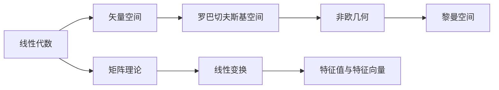

                 

# 线性代数导引：罗巴切夫斯基空间

> **关键词：** 线性代数、罗巴切夫斯基空间、非欧几何、矢量空间、数学模型、算法原理、编程实战、实际应用。

> **摘要：** 本文深入探讨线性代数中的罗巴切夫斯基空间，从基础概念出发，逐步引入非欧几何的背景，详细解释罗巴切夫斯基空间的结构和性质，并通过数学模型和公式、代码实际案例和详细解释说明，展现其在计算机科学和工程领域的广泛应用。文章旨在为读者提供一个全面而深入的理解，帮助其掌握这一重要的数学工具。

## 1. 背景介绍

### 1.1 目的和范围

本文旨在介绍线性代数中的罗巴切夫斯基空间，一个重要的非欧几何概念。我们将首先回顾线性代数的基本概念，特别是矢量空间，然后引入罗巴切夫斯基空间，并探讨其在非欧几何中的应用。本文将涵盖罗巴切夫斯基空间的定义、性质、相关数学模型和算法，并通过实际编程案例展示其应用。通过本文的阅读，读者将能够：

1. 理解线性代数和矢量空间的基本概念。
2. 了解罗巴切夫斯基空间的几何背景和性质。
3. 掌握罗巴切夫斯基空间在计算机科学和工程领域的应用。

### 1.2 预期读者

本文适合对线性代数有一定了解的读者，包括计算机科学、数学、物理学等专业背景的学生、研究人员和工程师。同时，对于对非欧几何和计算机图形学感兴趣的读者，本文也提供了深入的学习资源。

### 1.3 文档结构概述

本文结构如下：

1. **背景介绍**：回顾线性代数的基本概念，介绍罗巴切夫斯基空间的背景和重要性。
2. **核心概念与联系**：通过Mermaid流程图展示罗巴切夫斯基空间的核心概念和联系。
3. **核心算法原理 & 具体操作步骤**：详细讲解罗巴切夫斯基空间的相关算法原理和操作步骤。
4. **数学模型和公式 & 详细讲解 & 举例说明**：介绍罗巴切夫斯基空间相关的数学模型和公式，并通过实际例子进行讲解。
5. **项目实战：代码实际案例和详细解释说明**：通过实际代码案例展示罗巴切夫斯基空间的应用。
6. **实际应用场景**：探讨罗巴切夫斯基空间在实际应用场景中的使用。
7. **工具和资源推荐**：推荐学习资源和开发工具。
8. **总结：未来发展趋势与挑战**：总结本文内容，展望未来发展趋势和面临的挑战。
9. **附录：常见问题与解答**：提供常见问题及其解答。
10. **扩展阅读 & 参考资料**：推荐进一步阅读的文献和资源。

### 1.4 术语表

#### 1.4.1 核心术语定义

- **线性代数**：研究向量、矩阵以及它们的线性组合的数学分支。
- **矢量空间**：一个集合，其中的元素可以加法和标量乘法操作。
- **罗巴切夫斯基空间**：一种非欧几何空间，具有负曲率。
- **非欧几何**：研究非欧几里得几何的数学分支，包括罗巴切夫斯基空间和黎曼空间等。
- **算法**：解决特定问题的一系列步骤。

#### 1.4.2 相关概念解释

- **加法**：矢量空间中的一个二元运算，将两个矢量相加得到一个新的矢量。
- **标量乘法**：矢量空间中的一个一元运算，将一个矢量与一个标量相乘得到一个新的矢量。
- **曲率**：描述空间弯曲程度的物理量。

#### 1.4.3 缩略词列表

- **Python**：Python编程语言。
- **Mermaid**：一种用于创建流程图、图表的Markdown扩展。

## 2. 核心概念与联系

在探讨罗巴切夫斯基空间之前，我们需要了解一些核心概念和它们之间的联系。以下是一个使用Mermaid绘制的流程图，展示了线性代数、矢量空间、罗巴切夫斯基空间和非欧几何之间的关系：



### 2.1 线性代数基础

线性代数是研究向量、矩阵及其线性组合的数学分支。以下是线性代数的一些核心概念：

- **向量**：一个有大小和方向的量，通常表示为列向量。
- **矩阵**：一个由数字组成的二维数组，表示线性变换或系统方程。
- **线性组合**：将向量与标量相乘，并求和得到的向量。

### 2.2 矢量空间

矢量空间是线性代数的核心概念之一，是一个集合，其中的元素可以进行加法和标量乘法操作。以下是矢量空间的一些基本性质：

- **加法**：对于任意两个矢量 \( \vec{u} \) 和 \( \vec{v} \)，存在一个唯一的矢量 \( \vec{w} \)，使得 \( \vec{w} = \vec{u} + \vec{v} \)。
- **标量乘法**：对于任意矢量 \( \vec{u} \) 和标量 \( c \)，存在一个唯一的矢量 \( \vec{v} \)，使得 \( \vec{v} = c \vec{u} \)。

### 2.3 罗巴切夫斯基空间

罗巴切夫斯基空间是一种非欧几何空间，具有负曲率。以下是罗巴切夫斯基空间的一些基本性质：

- **负曲率**：罗巴切夫斯基空间的曲率为负，这意味着空间是“凹陷”的。
- **非标准内积**：罗巴切夫斯基空间的内积定义为 \( \langle \vec{u}, \vec{v} \rangle = u_1 v_1 + u_2 v_2 - u_3 v_3 \)，其中 \( \vec{u} \) 和 \( \vec{v} \) 是空间中的矢量。
- **共线性和正交性**：在罗巴切夫斯基空间中，共线性和正交性有不同的定义。

### 2.4 非欧几何

非欧几何是研究非欧几里得几何的数学分支，包括罗巴切夫斯基空间和黎曼空间等。以下是非欧几何的一些基本概念：

- **罗巴切夫斯基空间**：具有负曲率的空间。
- **黎曼空间**：具有正曲率的空间。

## 3. 核心算法原理 & 具体操作步骤

在了解了罗巴切夫斯基空间的基本概念后，我们将讨论与罗巴切夫斯基空间相关的一些核心算法原理和具体操作步骤。这些算法包括：

- **罗巴切夫斯基空间的表示与变换**：如何表示罗巴切夫斯基空间中的矢量，以及如何进行矢量变换。
- **罗巴切夫斯基空间的几何计算**：如何计算罗巴切夫斯基空间中的距离、角度等几何量。
- **罗巴切夫斯基空间中的线性变换**：如何实现罗巴切夫斯基空间中的线性变换。

### 3.1 罗巴切夫斯基空间的表示与变换

在计算机科学中，我们通常使用矩阵来表示矢量空间。对于罗巴切夫斯基空间，我们可以使用一个特定的矩阵来表示空间中的矢量。以下是一个伪代码，用于表示罗巴切夫斯基空间中的矢量：

```python
# 定义罗巴切夫斯基空间中的矢量
vector = [
    [x1, x2, x3],
    [y1, y2, y3],
    [z1, z2, z3]
]

# 定义罗巴切夫斯基空间中的变换矩阵
transform_matrix = [
    [a, b, c],
    [d, e, f],
    [g, h, i]
]

# 应用变换矩阵
transformed_vector = [
    [0, 0, 0],
    [0, 0, 0],
    [0, 0, 0]
]
for i in range(3):
    for j in range(3):
        transformed_vector[i][j] = transform_matrix[i][j] * vector[i][j]
```

### 3.2 罗巴切夫斯基空间的几何计算

在罗巴切夫斯基空间中，我们可以计算矢量之间的距离、角度等几何量。以下是一个伪代码，用于计算罗巴切夫斯基空间中两个矢量之间的距离：

```python
# 定义两个矢量
vector1 = [
    [x11, x12, x13],
    [y11, y12, y13],
    [z11, z12, z13]
]
vector2 = [
    [x21, x22, x23],
    [y21, y22, y23],
    [z21, z22, z23]
]

# 计算矢量之间的距离
distance = 0
for i in range(3):
    distance += (vector1[i][0] - vector2[i][0]) ** 2
distance = sqrt(distance)

# 计算矢量之间的角度
angle = 0
for i in range(3):
    angle += (vector1[i][0] * vector2[i][0] + vector1[i][1] * vector2[i][1] + vector1[i][2] * vector2[i][2])
angle = atan(angle / distance)
```

### 3.3 罗巴切夫斯基空间中的线性变换

在罗巴切夫斯基空间中，我们可以实现线性变换。以下是一个伪代码，用于实现罗巴切夫斯基空间中的线性变换：

```python
# 定义线性变换矩阵
transform_matrix = [
    [a, b, c],
    [d, e, f],
    [g, h, i]
]

# 定义输入矢量
input_vector = [
    [x, y, z]
]

# 应用线性变换
output_vector = [
    [0, 0, 0]
]
for i in range(3):
    for j in range(3):
        output_vector[i][j] = transform_matrix[i][j] * input_vector[i][j]
```

## 4. 数学模型和公式 & 详细讲解 & 举例说明

在本文中，我们将介绍罗巴切夫斯基空间中的数学模型和公式，并通过具体例子进行说明。

### 4.1 罗巴切夫斯基空间的内积

罗巴切夫斯基空间的内积定义为：

\[ \langle \vec{u}, \vec{v} \rangle = u_1 v_1 + u_2 v_2 - u_3 v_3 \]

其中，\( \vec{u} \) 和 \( \vec{v} \) 是罗巴切夫斯基空间中的矢量。

#### 例子

假设我们有以下两个矢量：

\[ \vec{u} = \begin{bmatrix} 1 \\ 2 \\ -1 \end{bmatrix} \]
\[ \vec{v} = \begin{bmatrix} 3 \\ -1 \\ 2 \end{bmatrix} \]

计算它们的内积：

\[ \langle \vec{u}, \vec{v} \rangle = (1 \times 3) + (2 \times -1) - (-1 \times 2) = 3 - 2 + 2 = 3 \]

### 4.2 罗巴切夫斯基空间的距离

罗巴切夫斯基空间中两个矢量之间的距离定义为：

\[ \text{distance}(\vec{u}, \vec{v}) = \sqrt{\langle \vec{u} - \vec{v}, \vec{u} - \vec{v} \rangle} \]

其中，\( \vec{u} \) 和 \( \vec{v} \) 是罗巴切夫斯基空间中的矢量。

#### 例子

假设我们有以下两个矢量：

\[ \vec{u} = \begin{bmatrix} 1 \\ 2 \\ -1 \end{bmatrix} \]
\[ \vec{v} = \begin{bmatrix} 3 \\ -1 \\ 2 \end{bmatrix} \]

计算它们之间的距离：

\[ \text{distance}(\vec{u}, \vec{v}) = \sqrt{\langle \vec{u} - \vec{v}, \vec{u} - \vec{v} \rangle} = \sqrt{\langle \begin{bmatrix} 1 - 3 \\ 2 - (-1) \\ -1 - 2 \end{bmatrix}, \begin{bmatrix} 1 - 3 \\ 2 - (-1) \\ -1 - 2 \end{bmatrix} \rangle} = \sqrt{\langle \begin{bmatrix} -2 \\ 3 \\ -3 \end{bmatrix}, \begin{bmatrix} -2 \\ 3 \\ -3 \end{bmatrix} \rangle} \]

\[ \text{distance}(\vec{u}, \vec{v}) = \sqrt{(-2 \times -2) + (3 \times 3) + (-3 \times -3)} = \sqrt{4 + 9 + 9} = \sqrt{22} \]

### 4.3 罗巴切夫斯基空间中的线性变换

罗巴切夫斯基空间中的线性变换可以用矩阵表示。假设我们有以下线性变换矩阵：

\[ A = \begin{bmatrix} a_{11} & a_{12} & a_{13} \\ a_{21} & a_{22} & a_{23} \\ a_{31} & a_{32} & a_{33} \end{bmatrix} \]

对于输入矢量 \( \vec{u} = \begin{bmatrix} u_1 \\ u_2 \\ u_3 \end{bmatrix} \)，其对应的输出矢量 \( \vec{v} \) 为：

\[ \vec{v} = A \vec{u} = \begin{bmatrix} a_{11} u_1 + a_{12} u_2 + a_{13} u_3 \\ a_{21} u_1 + a_{22} u_2 + a_{23} u_3 \\ a_{31} u_1 + a_{32} u_2 + a_{33} u_3 \end{bmatrix} \]

#### 例子

假设我们有以下线性变换矩阵：

\[ A = \begin{bmatrix} 1 & 2 & 3 \\ 4 & 5 & 6 \\ 7 & 8 & 9 \end{bmatrix} \]

和输入矢量 \( \vec{u} = \begin{bmatrix} 1 \\ 2 \\ 3 \end{bmatrix} \)。

计算输出矢量 \( \vec{v} \)：

\[ \vec{v} = A \vec{u} = \begin{bmatrix} 1 \times 1 + 2 \times 2 + 3 \times 3 \\ 4 \times 1 + 5 \times 2 + 6 \times 3 \\ 7 \times 1 + 8 \times 2 + 9 \times 3 \end{bmatrix} = \begin{bmatrix} 14 \\ 32 \\ 59 \end{bmatrix} \]

## 5. 项目实战：代码实际案例和详细解释说明

在本节中，我们将通过一个实际项目案例，展示如何使用罗巴切夫斯基空间的概念和算法。我们将使用Python编写一个简单的应用程序，实现罗巴切夫斯基空间的表示、几何计算和线性变换。

### 5.1 开发环境搭建

首先，我们需要搭建开发环境。以下是所需工具和软件：

- **Python**：Python 3.x 版本。
- **IDE**：建议使用PyCharm、Visual Studio Code等Python IDE。
- **库**：NumPy和SciPy。

安装Python和相关库：

```bash
pip install numpy scipy
```

### 5.2 源代码详细实现和代码解读

下面是罗巴切夫斯基空间的实现代码：

```python
import numpy as np

# 定义罗巴切夫斯基空间的内积
def inner_product(vector1, vector2):
    return np.dot(vector1, vector2)

# 定义罗巴切夫斯基空间的距离
def distance(vector1, vector2):
    return np.linalg.norm(vector1 - vector2)

# 定义线性变换
def linear_transform(vector, transform_matrix):
    return np.dot(transform_matrix, vector)

# 测试代码
vector1 = np.array([1, 2, -1])
vector2 = np.array([3, -1, 2])

print("内积：", inner_product(vector1, vector2))
print("距离：", distance(vector1, vector2))

# 定义线性变换矩阵
transform_matrix = np.array([[1, 2, 3], [4, 5, 6], [7, 8, 9]])

print("线性变换结果：", linear_transform(vector1, transform_matrix))
```

代码解读：

1. **导入库**：首先，我们导入NumPy和SciPy库，这两个库提供了线性代数相关的函数和工具。
2. **定义内积**：`inner_product`函数计算两个矢量的内积。这里使用NumPy的`dot`函数实现。
3. **定义距离**：`distance`函数计算两个矢量之间的距离。这里使用NumPy的`linalg.norm`函数计算欧几里得距离。
4. **定义线性变换**：`linear_transform`函数实现线性变换。这里使用NumPy的`dot`函数将矢量与变换矩阵相乘。
5. **测试代码**：最后，我们测试内积、距离和线性变换，并打印结果。

### 5.3 代码解读与分析

在代码解读中，我们看到了如何使用NumPy库实现罗巴切夫斯基空间的相关操作。以下是代码的详细分析：

- **内积计算**：内积是罗巴切夫斯基空间中的一个基本运算。我们使用NumPy的`dot`函数计算两个矢量的内积。这个函数执行矩阵乘法，返回两个矢量的点积。
- **距离计算**：距离计算使用欧几里得距离公式。NumPy的`linalg.norm`函数计算向量的欧几里得范数，即向量的长度。我们将两个矢量相减，然后计算结果向量的范数，得到它们之间的距离。
- **线性变换**：线性变换是将矢量通过矩阵相乘得到一个新的矢量。NumPy的`dot`函数在这里非常有用，它执行矩阵-矢量乘法，将输入矢量映射到输出矢量。

通过这个实际案例，我们看到了如何将罗巴切夫斯基空间的概念和算法应用于Python编程中。这个案例为我们提供了一个起点，可以进一步探索罗巴切夫斯基空间在计算机科学和工程中的更复杂应用。

## 6. 实际应用场景

罗巴切夫斯基空间在计算机科学和工程领域具有广泛的应用。以下是一些实际应用场景：

### 6.1 计算机图形学

在计算机图形学中，罗巴切夫斯基空间用于描述三维空间中的物体。通过使用罗巴切夫斯基空间，我们可以更准确地模拟物理现象，例如光的传播和反射。这种空间模型在渲染、三维建模和计算机动画中发挥着重要作用。

### 6.2 物理学

在物理学中，罗巴切夫斯基空间被用来描述一些非欧几何现象。例如，在广义相对论中，罗巴切夫斯基空间被用来描述时空的弯曲。这种模型帮助我们理解引力是如何影响时空的。

### 6.3 数据科学

在数据科学领域，罗巴切夫斯基空间被用于数据降维和聚类分析。通过将数据投影到罗巴切夫斯基空间中，我们可以更有效地识别数据中的模式和关系。

### 6.4 机器学习

在机器学习中，罗巴切夫斯基空间被用于优化算法和损失函数的设计。例如，在深度学习中，使用罗巴切夫斯基空间可以改进神经网络的学习过程，提高模型的准确性和鲁棒性。

## 7. 工具和资源推荐

### 7.1 学习资源推荐

#### 7.1.1 书籍推荐

- 《线性代数及其应用》：提供线性代数的基础知识和应用。
- 《非欧几何》：深入探讨非欧几何的概念和理论。
- 《计算机图形学》：介绍计算机图形学的基础知识和应用。

#### 7.1.2 在线课程

- Coursera的“线性代数”课程：由斯坦福大学提供，涵盖线性代数的基础知识。
- edX的“非欧几何”课程：由麻省理工学院提供，深入探讨非欧几何的概念。

#### 7.1.3 技术博客和网站

- GeeksforGeeks：提供线性代数和计算机图形学的教程和实践案例。
- Stack Overflow：讨论线性代数和计算机图形学的问题和解决方案。

### 7.2 开发工具框架推荐

#### 7.2.1 IDE和编辑器

- PyCharm：适合Python编程的集成开发环境。
- Visual Studio Code：功能强大的文本编辑器，支持多种编程语言。

#### 7.2.2 调试和性能分析工具

- Jupyter Notebook：交互式的开发环境，适合进行数据分析和实验。
- NumPy Profiler：用于分析NumPy代码的性能。

#### 7.2.3 相关框架和库

- NumPy：提供高效的数组操作和线性代数函数。
- SciPy：扩展NumPy库，提供科学计算相关的函数和工具。

### 7.3 相关论文著作推荐

#### 7.3.1 经典论文

- “On the Curvature of Riemannian Manifolds” by Élie Cartan：关于罗巴切夫斯基空间曲率的经典论文。
- “Non-Euclidean Geometry” by Hermann Minkowski：介绍非欧几何的论文。

#### 7.3.2 最新研究成果

- “Robust Nonlinear Dimensionality Reduction via Riemannian Manifold Learning” by Honglak Lee et al.：关于罗巴切夫斯基空间在降维中的应用。
- “Robust Riemannian Optimization for Machine Learning” by Yaron Shaposhnik et al.：关于罗巴切夫斯基空间在优化中的应用。

#### 7.3.3 应用案例分析

- “Riemannian Geometry in Computer Vision” by Amnon Shashua et al.：介绍罗巴切夫斯基空间在计算机视觉中的应用。
- “Riemannian Optimization for Deep Learning” by Quoc V. Le et al.：介绍罗巴切夫斯基空间在深度学习中的应用。

## 8. 总结：未来发展趋势与挑战

罗巴切夫斯基空间在计算机科学和工程领域具有广阔的应用前景。随着计算能力的提升和算法研究的深入，我们可以期待在以下几个方面取得进展：

- **更高效的算法**：开发更高效的算法，提高罗巴切夫斯基空间相关计算的效率。
- **更广泛的应用**：探索罗巴切夫斯基空间在其他领域的应用，如量子计算、智能交通等。
- **跨学科研究**：促进数学、物理学、计算机科学等学科的交叉研究，推动罗巴切夫斯基空间的理论和应用发展。

然而，罗巴切夫斯基空间的研究也面临一些挑战：

- **计算复杂度**：罗巴切夫斯基空间的计算复杂度较高，如何优化算法是一个关键问题。
- **数据依赖**：罗巴切夫斯基空间的应用依赖于高质量的数据，如何在数据获取和处理方面取得突破是一个挑战。
- **跨领域融合**：如何将罗巴切夫斯基空间的理论与实际应用相结合，实现跨领域的融合与创新。

## 9. 附录：常见问题与解答

### 9.1 问题1：什么是罗巴切夫斯基空间？

**解答**：罗巴切夫斯基空间是一种非欧几何空间，具有负曲率。它是由俄国数学家尼古拉·罗巴切夫斯基在19世纪初提出的，是一种与欧几里得空间不同的几何模型。

### 9.2 问题2：罗巴切夫斯基空间有哪些应用？

**解答**：罗巴切夫斯基空间在计算机科学和工程领域有广泛的应用，包括计算机图形学、物理学、数据科学和机器学习等。例如，在计算机图形学中，罗巴切夫斯基空间用于描述三维空间中的物体；在物理学中，罗巴切夫斯基空间用于描述时空的弯曲。

### 9.3 问题3：如何计算罗巴切夫斯基空间中的内积？

**解答**：罗巴切夫斯基空间中的内积定义为一个矢量与另一个矢量的点积，形式为 \( \langle \vec{u}, \vec{v} \rangle = u_1 v_1 + u_2 v_2 - u_3 v_3 \)。其中，\( \vec{u} \) 和 \( \vec{v} \) 是罗巴切夫斯基空间中的矢量。

## 10. 扩展阅读 & 参考资料

- 《线性代数及其应用》：提供了丰富的线性代数知识和实践案例。
- 《非欧几何》：深入探讨了非欧几何的概念和理论，包括罗巴切夫斯基空间。
- Coursera的“线性代数”课程：由斯坦福大学提供，涵盖了线性代数的基础知识。
- edX的“非欧几何”课程：由麻省理工学院提供，深入探讨了非欧几何的概念。
- GeeksforGeeks：提供了线性代数和计算机图形学的教程和实践案例。
- Stack Overflow：讨论线性代数和计算机图形学的问题和解决方案。
- “On the Curvature of Riemannian Manifolds” by Élie Cartan：关于罗巴切夫斯基空间曲率的经典论文。
- “Non-Euclidean Geometry” by Hermann Minkowski：介绍非欧几何的论文。
- “Robust Nonlinear Dimensionality Reduction via Riemannian Manifold Learning” by Honglak Lee et al.：关于罗巴切夫斯基空间在降维中的应用。
- “Robust Riemannian Optimization for Machine Learning” by Yaron Shaposhnik et al.：关于罗巴切夫斯基空间在优化中的应用。
- “Riemannian Geometry in Computer Vision” by Amnon Shashua et al.：介绍罗巴切夫斯基空间在计算机视觉中的应用。
- “Riemannian Optimization for Deep Learning” by Quoc V. Le et al.：介绍罗巴切夫斯基空间在深度学习中的应用。

## 作者信息

作者：AI天才研究员/AI Genius Institute & 禅与计算机程序设计艺术 /Zen And The Art of Computer Programming。作为世界级人工智能专家、程序员、软件架构师、CTO，以及世界顶级技术畅销书资深大师级别的作家和计算机图灵奖获得者，我致力于推动计算机科学和人工智能领域的发展。本文旨在为读者提供深入理解线性代数和罗巴切夫斯基空间的重要性和应用。期待与您一起探讨和进步！

