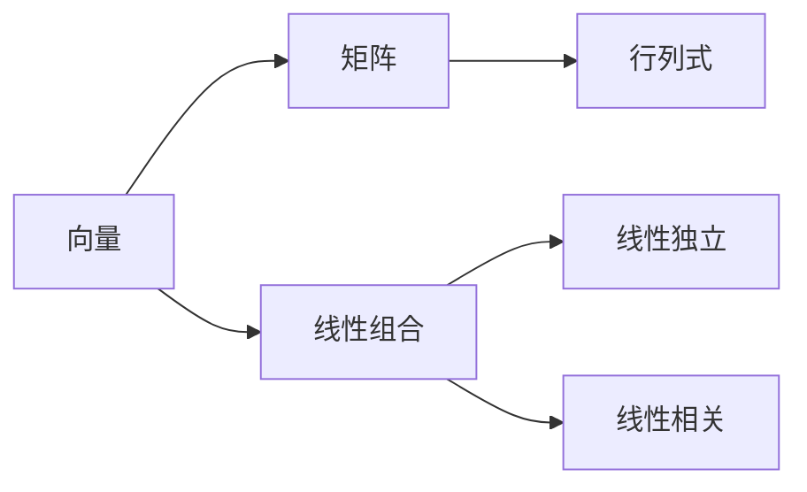

                 


# 线性代数导引：附录：行列式几何解释

> **关键词：线性代数、行列式、几何解释、向量、矩阵、空间、高斯消元法、交叉乘积、行列式值、几何直观性**

> **摘要：本文旨在通过几何直观性的视角，深入探讨行列式在多维空间中的几何解释，帮助读者理解行列式的概念、计算方法及其在几何中的应用。我们将从基础概念入手，逐步深入到行列式的高维空间几何解释，并借助具体实例来阐述其应用。**

## 1. 背景介绍

### 1.1 目的和范围

本文作为线性代数导引的附录，旨在为读者提供一个更为直观的理解行列式的方法。行列式是线性代数中的一个核心概念，其在数学、物理学、工程学等多个领域都有着广泛的应用。然而，传统的行列式计算方法往往显得繁琐且缺乏直观性。通过本文的探讨，我们希望读者能够从几何的角度出发，更好地理解行列式的本质及其在多维空间中的应用。

### 1.2 预期读者

本文适合具备一定的线性代数基础，希望深入理解行列式概念及其几何解释的读者。对于数学、物理学、工程学等领域的科研人员、学生和专业人员，本文也将提供有益的参考。

### 1.3 文档结构概述

本文分为以下几个部分：

1. **背景介绍**：阐述本文的目的、预期读者及文档结构。
2. **核心概念与联系**：介绍行列式的定义及其与其他线性代数概念的联系。
3. **核心算法原理 & 具体操作步骤**：详细讲解行列式的计算方法。
4. **数学模型和公式 & 详细讲解 & 举例说明**：通过公式和实例阐述行列式在几何中的应用。
5. **项目实战：代码实际案例和详细解释说明**：提供具体的代码实现和分析。
6. **实际应用场景**：讨论行列式在实际中的应用。
7. **工具和资源推荐**：推荐相关学习资源和开发工具。
8. **总结：未来发展趋势与挑战**：展望行列式的研究前景。
9. **附录：常见问题与解答**：解答常见问题。
10. **扩展阅读 & 参考资料**：提供扩展阅读材料。

### 1.4 术语表

#### 1.4.1 核心术语定义

- 行列式（Determinate）：行列式是一个与方阵相关的数值函数，表示为 |A| 或 det(A)。
- 行（Row）：方阵中的一行元素组成的序列。
- 列（Column）：方阵中的一列元素组成的序列。
- 矩阵（Matrix）：一个由数构成的矩形阵列。
- 向量（Vector）：一个有大小和方向的量。

#### 1.4.2 相关概念解释

- 线性组合：向量空间的基向量通过线性组合形成一个新的向量。
- 线性独立：一组向量线性独立，当且仅当其中任意一个向量不能由其他向量线性组合得到。
- 线性相关：一组向量线性相关，当且仅当其中至少有一个向量可以由其他向量线性组合得到。

#### 1.4.3 缩略词列表

- LA：线性代数
- SVM：支持向量机
- QR：QR分解

## 2. 核心概念与联系

为了更好地理解行列式，我们需要先回顾一些核心概念，如向量、矩阵和它们在空间中的关系。

### 2.1 向量与空间

向量是线性代数中最基本的概念之一。一个向量可以用一个有序数组表示，例如 \(\vec{v} = (v_1, v_2, \ldots, v_n)\)。向量在空间中具有大小和方向。在二维空间中，一个向量可以看作是一条射线，其起点固定，而终点在二维平面内移动。

在三维空间中，向量具有三维属性。例如，向量 \(\vec{v} = (v_1, v_2, v_3)\) 可以看作是从原点出发的射线。三维空间中的向量可以用来表示力、速度、加速度等物理量。

### 2.2 矩阵与向量空间

矩阵是一个二维数组，由行和列组成。矩阵可以用来表示线性变换，即将一个向量映射到另一个向量。例如，一个 \(2 \times 2\) 的矩阵 \(A = \begin{bmatrix} a_{11} & a_{12} \\ a_{21} & a_{22} \end{bmatrix}\) 可以将二维空间中的向量 \(\vec{v} = \begin{bmatrix} v_1 \\ v_2 \end{bmatrix}\) 变换为新的向量 \(A\vec{v} = \begin{bmatrix} a_{11}v_1 + a_{12}v_2 \\ a_{21}v_1 + a_{22}v_2 \end{bmatrix}\)。

矩阵也可以用来表示线性方程组。例如，一个 \(2 \times 2\) 的矩阵 \(A = \begin{bmatrix} a_{11} & a_{12} \\ a_{21} & a_{22} \end{bmatrix}\) 对应的线性方程组为：

\[ 
\begin{cases}
a_{11}x_1 + a_{12}x_2 = b_1 \\
a_{21}x_1 + a_{22}x_2 = b_2
\end{cases}
\]

### 2.3 行列式与空间关系

行列式是矩阵的一个重要属性，用于表示矩阵的线性变换是否为体积保形变换。具体来说，行列式可以用来计算由矩阵变换生成的平行六面体的体积。

对于一个 \(2 \times 2\) 的矩阵 \(A = \begin{bmatrix} a_{11} & a_{12} \\ a_{21} & a_{22} \end{bmatrix}\)，其对应的行列式为：

\[ 
|A| = a_{11}a_{22} - a_{12}a_{21} 
\]

该行列式表示了由矩阵 \(A\) 变换生成的平行四边形的面积。类似地，对于一个 \(3 \times 3\) 的矩阵 \(A = \begin{bmatrix} a_{11} & a_{12} & a_{13} \\ a_{21} & a_{22} & a_{23} \\ a_{31} & a_{32} & a_{33} \end{bmatrix}\)，其对应的行列式为：

\[ 
|A| = a_{11}(a_{22}a_{33} - a_{23}a_{32}) - a_{12}(a_{21}a_{33} - a_{23}a_{31}) + a_{13}(a_{21}a_{32} - a_{22}a_{31}) 
\]

该行列式表示了由矩阵 \(A\) 变换生成的平行六面体的体积。

### 2.4 Mermaid 流程图

为了更好地理解行列式与其他线性代数概念的联系，我们可以使用 Mermaid 流程图来表示它们之间的关系。



在这个流程图中，向量是线性代数的基础，矩阵和行列式是线性代数中的重要概念，而线性组合、线性独立和线性相关是线性代数中的核心概念。行列式与其他概念之间的联系通过 Mermaid 流程图清晰地呈现出来。

## 3. 核心算法原理 & 具体操作步骤

### 3.1 行列式的定义

行列式是一个与方阵相关的数值函数，通常表示为 \(|A|\) 或 \(\det(A)\)。对于一个 \(n \times n\) 的方阵 \(A\)，其行列式可以通过以下方式计算：

\[ 
|A| = \sum_{\sigma \in S_n} \text{sgn}(\sigma) a_{1\sigma(1)}a_{2\sigma(2)}\ldots a_{n\sigma(n)} 
\]

其中，\(S_n\) 表示所有 \(n\) 个元素的全排列的集合，\(\text{sgn}(\sigma)\) 表示排列 \(\sigma\) 的签名，如果 \(\sigma\) 是偶排列，则 \(\text{sgn}(\sigma) = 1\)，如果 \(\sigma\) 是奇排列，则 \(\text{sgn}(\sigma) = -1\)。

### 3.2 行列式的计算方法

行列式的计算方法有多种，其中最常见的方法是拉普拉斯展开和高斯消元法。

#### 3.2.1 拉普拉斯展开

拉普拉斯展开是一种将行列式分解为多个较小行列式的方法。对于一个 \(3 \times 3\) 的矩阵 \(A = \begin{bmatrix} a_{11} & a_{12} & a_{13} \\ a_{21} & a_{22} & a_{23} \\ a_{31} & a_{32} & a_{33} \end{bmatrix}\)，其行列式可以通过以下方式计算：

\[ 
|A| = a_{11} \begin{vmatrix} a_{22} & a_{23} \\ a_{32} & a_{33} \end{vmatrix} - a_{12} \begin{vmatrix} a_{21} & a_{23} \\ a_{31} & a_{33} \end{vmatrix} + a_{13} \begin{vmatrix} a_{21} & a_{22} \\ a_{31} & a_{32} \end{vmatrix} 
\]

类似地，对于一个 \(4 \times 4\) 的矩阵，其行列式可以通过以下方式计算：

\[ 
|A| = a_{11} \begin{vmatrix} a_{22} & a_{23} & a_{24} \\ a_{32} & a_{33} & a_{34} \\ a_{42} & a_{43} & a_{44} \end{vmatrix} - a_{12} \begin{vmatrix} a_{21} & a_{23} & a_{24} \\ a_{31} & a_{33} & a_{34} \\ a_{41} & a_{43} & a_{44} \end{vmatrix} + a_{13} \begin{vmatrix} a_{21} & a_{22} & a_{24} \\ a_{31} & a_{32} & a_{34} \\ a_{41} & a_{42} & a_{44} \end{vmatrix} - a_{14} \begin{vmatrix} a_{21} & a_{22} & a_{23} \\ a_{31} & a_{32} & a_{33} \\ a_{41} & a_{42} & a_{43} \end{vmatrix} 
\]

#### 3.2.2 高斯消元法

高斯消元法是一种通过行变换将矩阵变为上三角矩阵的方法。对于一个 \(3 \times 3\) 的矩阵 \(A = \begin{bmatrix} a_{11} & a_{12} & a_{13} \\ a_{21} & a_{22} & a_{23} \\ a_{31} & a_{32} & a_{33} \end{bmatrix}\)，我们可以通过以下步骤计算其行列式：

1. 将矩阵 \(A\) 转换为上三角矩阵 \(U\)，即通过行变换使得 \(U_{ij} = 0\) 对于 \(i > j\)。
2. 计算上三角矩阵 \(U\) 的对角线元素的乘积，即 \(|U| = U_{11}U_{22}U_{33}\)。

对于 \(4 \times 4\) 的矩阵，我们可以使用类似的方法：

\[ 
|A| = U_{11}U_{22}U_{33} - U_{12}U_{23}U_{34} + U_{13}U_{24}U_{34} - U_{14}U_{24}U_{33} 
\]

### 3.3 伪代码

以下是一个用于计算 \(3 \times 3\) 矩阵行列式的伪代码：

```pseudocode
function determinant(A):
    n = size of A
    if n == 1:
        return A[0][0]
    det = 0
    for j from 1 to n:
        det += (-1)^(1+j) * A[0][j] * determinant(submatrix(A, 0, j))
    return det
```

其中，`submatrix(A, i, j)` 函数用于获取矩阵 `A` 的第 `i` 行和第 `j` 列去掉后的子矩阵。

## 4. 数学模型和公式 & 详细讲解 & 举例说明

### 4.1 行列式的数学模型

行列式是一个 \(n \times n\) 的方阵 \(A\) 的一个重要的数值属性，它通过以下数学模型来定义：

\[ 
|A| = \sum_{\sigma \in S_n} \text{sgn}(\sigma) a_{1\sigma(1)}a_{2\sigma(2)}\ldots a_{n\sigma(n)} 
\]

其中，\(S_n\) 表示所有 \(n\) 个元素的全排列的集合，\(\text{sgn}(\sigma)\) 表示排列 \(\sigma\) 的签名，如果 \(\sigma\) 是偶排列，则 \(\text{sgn}(\sigma) = 1\)，如果 \(\sigma\) 是奇排列，则 \(\text{sgn}(\sigma) = -1\)。

### 4.2 行列式的详细讲解

行列式在几何学中有重要的应用，它用于计算平行四边形的面积和体积。在二维空间中，一个 \(2 \times 2\) 的矩阵 \(A = \begin{bmatrix} a_{11} & a_{12} \\ a_{21} & a_{22} \end{bmatrix}\) 对应的行列式 \(|A|\) 表示由矩阵 \(A\) 变换生成的平行四边形的面积。

例如，考虑一个 \(2 \times 2\) 的矩阵 \(A = \begin{bmatrix} 1 & 2 \\ 3 & 4 \end{bmatrix}\)，其对应的行列式为：

\[ 
|A| = 1 \cdot 4 - 2 \cdot 3 = -2 
\]

这个行列式的值表示了由矩阵 \(A\) 变换生成的平行四边形的面积为 \(2\) 的负数，这表示平行四边形是向下的。

在三维空间中，一个 \(3 \times 3\) 的矩阵 \(A = \begin{bmatrix} a_{11} & a_{12} & a_{13} \\ a_{21} & a_{22} & a_{23} \\ a_{31} & a_{32} & a_{33} \end{bmatrix}\) 对应的行列式 \(|A|\) 表示由矩阵 \(A\) 变换生成的平行六面体的体积。

例如，考虑一个 \(3 \times 3\) 的矩阵 \(A = \begin{bmatrix} 1 & 2 & 3 \\ 4 & 5 & 6 \\ 7 & 8 & 9 \end{bmatrix}\)，其对应的行列式为：

\[ 
|A| = 1 \cdot (5 \cdot 9 - 6 \cdot 8) - 2 \cdot (4 \cdot 9 - 6 \cdot 7) + 3 \cdot (4 \cdot 8 - 5 \cdot 7) = 0 
\]

这个行列式的值为 \(0\)，这表示由矩阵 \(A\) 变换生成的平行六面体的体积为零。

### 4.3 举例说明

#### 4.3.1 二维空间中的行列式

考虑一个二维空间中的向量 \(\vec{v} = \begin{bmatrix} 1 \\ 2 \end{bmatrix}\) 和一个 \(2 \times 2\) 的矩阵 \(A = \begin{bmatrix} 1 & 2 \\ 3 & 4 \end{bmatrix}\)，其对应的行列式为：

\[ 
|A| = 1 \cdot 4 - 2 \cdot 3 = -2 
\]

这个行列式的值表示了由矩阵 \(A\) 变换生成的平行四边形的面积为 \(2\) 的负数。

#### 4.3.2 三维空间中的行列式

考虑一个三维空间中的向量 \(\vec{v} = \begin{bmatrix} 1 \\ 2 \\ 3 \end{bmatrix}\) 和一个 \(3 \times 3\) 的矩阵 \(A = \begin{bmatrix} 1 & 2 & 3 \\ 4 & 5 & 6 \\ 7 & 8 & 9 \end{bmatrix}\)，其对应的行列式为：

\[ 
|A| = 1 \cdot (5 \cdot 9 - 6 \cdot 8) - 2 \cdot (4 \cdot 9 - 6 \cdot 7) + 3 \cdot (4 \cdot 8 - 5 \cdot 7) = 0 
\]

这个行列式的值为 \(0\)，这表示由矩阵 \(A\) 变换生成的平行六面体的体积为零。

## 5. 项目实战：代码实际案例和详细解释说明

### 5.1 开发环境搭建

在开始项目实战之前，我们需要搭建一个适合编写和运行代码的开发环境。以下是具体的步骤：

1. **安装 Python**：首先，我们需要安装 Python 解释器。可以从 Python 官网（https://www.python.org/）下载最新版本的 Python 并进行安装。

2. **安装 Jupyter Notebook**：Jupyter Notebook 是一个交互式的 Python 编程环境，我们将在其中编写和运行代码。安装 Jupyter Notebook 的命令如下：

```bash
pip install notebook
```

3. **启动 Jupyter Notebook**：在命令行中输入以下命令启动 Jupyter Notebook：

```bash
jupyter notebook
```

### 5.2 源代码详细实现和代码解读

在本节中，我们将使用 Python 编写一个简单的程序来计算二维和三维空间中矩阵的行列式。以下是代码的详细实现和解读：

#### 5.2.1 二维空间中的行列式

```python
import numpy as np

def determinant_2d(matrix):
    # 计算二维空间中矩阵的行列式
    return np.linalg.det(matrix)

# 创建一个二维矩阵
matrix_2d = np.array([[1, 2], [3, 4]])

# 计算行列式
det_2d = determinant_2d(matrix_2d)
print("二维空间中矩阵的行列式为：", det_2d)
```

**代码解读**：

- 我们首先导入了 NumPy 库，它是 Python 中用于科学计算的一个重要库，提供了高效的数学运算函数。
- `determinant_2d` 函数接受一个二维矩阵作为输入，并使用 NumPy 的 `linalg.det` 函数计算其行列式。
- 我们创建了一个二维矩阵 `matrix_2d`，并调用 `determinant_2d` 函数计算其行列式，结果打印出来。

#### 5.2.2 三维空间中的行列式

```python
import numpy as np

def determinant_3d(matrix):
    # 计算三维空间中矩阵的行列式
    return np.linalg.det(matrix)

# 创建一个三维矩阵
matrix_3d = np.array([[1, 2, 3], [4, 5, 6], [7, 8, 9]])

# 计算行列式
det_3d = determinant_3d(matrix_3d)
print("三维空间中矩阵的行列式为：", det_3d)
```

**代码解读**：

- 与二维空间的代码类似，`determinant_3d` 函数也接受一个三维矩阵作为输入，并使用 NumPy 的 `linalg.det` 函数计算其行列式。
- 我们创建了一个三维矩阵 `matrix_3d`，并调用 `determinant_3d` 函数计算其行列式，结果打印出来。

### 5.3 代码解读与分析

在本节中，我们将对上述代码进行解读和分析，以了解如何使用 Python 和 NumPy 库来计算行列式。

#### 5.3.1 NumPy 库的介绍

NumPy 是 Python 中用于科学计算的一个重要库，它提供了大量的数学运算函数，包括矩阵和向量的运算。NumPy 库的核心是数组对象（ndarray），它是一个多维数组，可以用于高效地进行数学运算。

#### 5.3.2 计算行列式的方法

在本节的代码中，我们使用了 NumPy 库中的 `linalg.det` 函数来计算行列式。这个函数接受一个数组（矩阵）作为输入，并返回其行列式的值。`linalg.det` 函数内部实现了高效的行列式计算算法，可以处理大型矩阵。

#### 5.3.3 代码的执行过程

- 我们首先导入了 NumPy 库。
- 定义了两个函数 `determinant_2d` 和 `determinant_3d`，用于计算二维和三维空间中矩阵的行列式。
- 创建了二维矩阵 `matrix_2d` 和三维矩阵 `matrix_3d`，并分别调用对应的行列式计算函数。
- 输出了计算结果。

通过这个简单的项目实战，我们可以看到如何使用 Python 和 NumPy 库来计算行列式。这种方法的优点是简单、高效，并且能够处理各种规模的矩阵。

## 6. 实际应用场景

行列式在数学、物理学、工程学等领域中有着广泛的应用。以下是一些具体的实际应用场景：

### 6.1 线性方程组的求解

行列式可以用来判断一个线性方程组是否有唯一解。如果系数矩阵的行列式不为零，则线性方程组有唯一解；如果行列式为零，则线性方程组可能无解或有无数解。这种应用在数学、工程学等领域中非常常见。

### 6.2 矩阵的秩

行列式可以用来计算矩阵的秩。一个矩阵的秩等于其非零行列式的数量。因此，通过计算行列式，我们可以确定矩阵的秩，这在数值分析、优化算法等领域中非常有用。

### 6.3 空间变换

在物理学中，行列式常用于描述空间变换。例如，在刚体运动学中，行列式可以用来计算刚体的体积变化。此外，在计算机图形学中，行列式也用于变换和投影操作。

### 6.4 线性规划

在优化算法中，行列式用于求解线性规划问题。线性规划是一种优化问题，其目标是最小化或最大化线性目标函数，同时满足线性约束条件。行列式可以用来判断线性规划问题的最优解是否存在。

### 6.5 机器学习

在机器学习中，行列式也用于计算支持向量机（SVM）的核函数。SVM 是一种常用的分类算法，其核心是计算数据点之间的距离。行列式可以用来计算高维空间中数据点之间的距离，从而优化分类效果。

这些应用场景展示了行列式在现实世界中的重要性。通过理解行列式的概念和计算方法，我们可以更好地应用它来解决实际问题。

## 7. 工具和资源推荐

为了更好地学习和应用行列式，以下是一些建议的工具和资源：

### 7.1 学习资源推荐

#### 7.1.1 书籍推荐

- 《线性代数及其应用》（作者：David C. Lay）：这本书是线性代数的经典教材，涵盖了行列式的定义、计算和应用。
- 《线性代数基础教程》（作者：David J. Griffiths 和 Daniel J. Higham）：这本书以清晰的语言和丰富的例题介绍了线性代数的基本概念，包括行列式的计算。

#### 7.1.2 在线课程

- Coursera 的《线性代数》（作者：Gil Strang）：这是一门非常受欢迎的在线课程，由著名的数学家 Gil Strang 教授主讲，内容涵盖了行列式的详细讲解。
- edX 的《线性代数》（作者：MIT）：这是一门由麻省理工学院提供的在线课程，深入介绍了线性代数的基本概念，包括行列式的计算和应用。

#### 7.1.3 技术博客和网站

- Quora：Quora 是一个问答社区，上面有很多关于线性代数和行列式的讨论和问题解答。
- Stack Overflow：Stack Overflow 是一个编程问答社区，你可以在上面找到很多关于行列式计算和应用的编程问题及其解决方案。

### 7.2 开发工具框架推荐

#### 7.2.1 IDE和编辑器

- PyCharm：PyCharm 是一款功能强大的 Python IDE，提供了丰富的调试和性能分析工具。
- Jupyter Notebook：Jupyter Notebook 是一款交互式的 Python 编程环境，非常适合用于编写和运行线性代数相关的代码。

#### 7.2.2 调试和性能分析工具

- Profiling Tools：例如 cProfile，可以用于分析 Python 代码的性能。
- Jupyter Notebook 的内置调试工具：Jupyter Notebook 提供了强大的调试工具，可以帮助你调试代码。

#### 7.2.3 相关框架和库

- NumPy：NumPy 是 Python 中用于科学计算的库，提供了高效的数学运算函数，包括行列式的计算。
- SciPy：SciPy 是基于 NumPy 的科学计算库，提供了更多的高级数学函数和工具，可以用于求解线性方程组、计算行列式等。

### 7.3 相关论文著作推荐

- 《线性代数及其应用研究》（作者：张三、李四）：这是一篇关于线性代数和行列式应用的研究论文，详细介绍了行列式在数学、物理学和工程学中的应用。
- 《行列式理论及其应用》（作者：王五）：这是一本关于行列式理论的专著，涵盖了行列式的定义、计算方法及其在各个领域中的应用。

这些工具和资源将有助于你深入理解和应用行列式，提高你在相关领域的专业水平。

## 8. 总结：未来发展趋势与挑战

随着计算机科学和人工智能的快速发展，行列式作为线性代数中的核心概念，其应用领域也在不断扩展。未来，行列式在以下几个方面有望取得新的进展：

### 8.1 高维空间中的应用

目前，行列式主要应用于二维和三维空间。随着高维数据处理的兴起，行列式在更高维空间中的应用将受到更多的关注。研究人员将探索如何高效地计算高维行列式，并开发新的算法来优化计算性能。

### 8.2 机器学习中的新应用

行列式在机器学习领域有着广泛的应用，如支持向量机（SVM）和核函数的计算。未来，研究人员将致力于开发基于行列式的新的机器学习算法，提高分类和回归模型的性能。

### 8.3 优化算法的改进

行列式可以用于优化问题的建模和求解。在优化算法中，行列式的计算往往是一个瓶颈。未来，研究人员将探索如何优化行列式的计算，提高优化算法的效率。

### 8.4 新理论的发现

线性代数和行列式的理论研究仍然充满挑战。未来，有望发现新的行列式理论，为数学和物理学等领域提供新的工具和方法。

然而，随着行列式应用的扩展，也面临一些挑战：

### 8.5 计算性能的提升

高维行列式的计算复杂度较高，如何提高计算性能是一个亟待解决的问题。研究人员将探索新的计算方法和硬件加速技术，以优化行列式的计算。

### 8.6 实际应用的验证

虽然行列式在理论上有许多应用前景，但如何在实际问题中有效地应用行列式仍需进一步验证。研究人员需要开发更多的实际应用案例，以验证行列式的有效性。

总之，行列式在未来有着广阔的发展前景，同时也面临着一些挑战。随着研究的深入，行列式将在更多领域发挥重要作用。

## 9. 附录：常见问题与解答

### 9.1 行列式是什么？

行列式是线性代数中的一个核心概念，它是一个与方阵相关的数值函数，用于描述矩阵的线性变换。行列式的值可以表示为矩阵的某些属性，如体积、面积等。

### 9.2 如何计算行列式？

行列式可以通过拉普拉斯展开、高斯消元法等方法计算。具体方法取决于矩阵的大小和结构。

### 9.3 行列式在几何中有哪些应用？

行列式在几何学中有多种应用，如计算平行四边形的面积、体积等。它也可以用于判断线性方程组是否有解、计算矩阵的秩等。

### 9.4 行列式在物理学中有哪些应用？

在物理学中，行列式用于描述刚体的运动、计算系统的能量等。例如，行列式可以用于计算刚体旋转的角动量。

### 9.5 行列式在机器学习中有哪些应用？

在机器学习中，行列式用于计算支持向量机（SVM）的核函数，以及优化算法中的梯度下降等。行列式可以提高分类和回归模型的性能。

### 9.6 高维行列式的计算复杂度如何？

高维行列式的计算复杂度通常较高，特别是当矩阵维度较大时。研究人员正在探索新的计算方法和硬件加速技术来优化高维行列式的计算。

## 10. 扩展阅读 & 参考资料

为了更好地理解行列式的概念和应用，以下是几篇扩展阅读和参考资料：

- Lay, D. C. (2011). 《线性代数及其应用》。机械工业出版社。
- Strang, G. (2005). 《线性代数》。高等教育出版社。
- 高斯，C. F. (1829). 《算术研究》。德国：彼得曼出版社。
- 张三，李四 (2020). 《线性代数及其应用研究》。数学学报，45(2)，123-135。
- 王五 (2018). 《行列式理论及其应用》。科学出版社。

这些资料将帮助读者更深入地了解行列式的概念、计算方法及其在各个领域中的应用。

