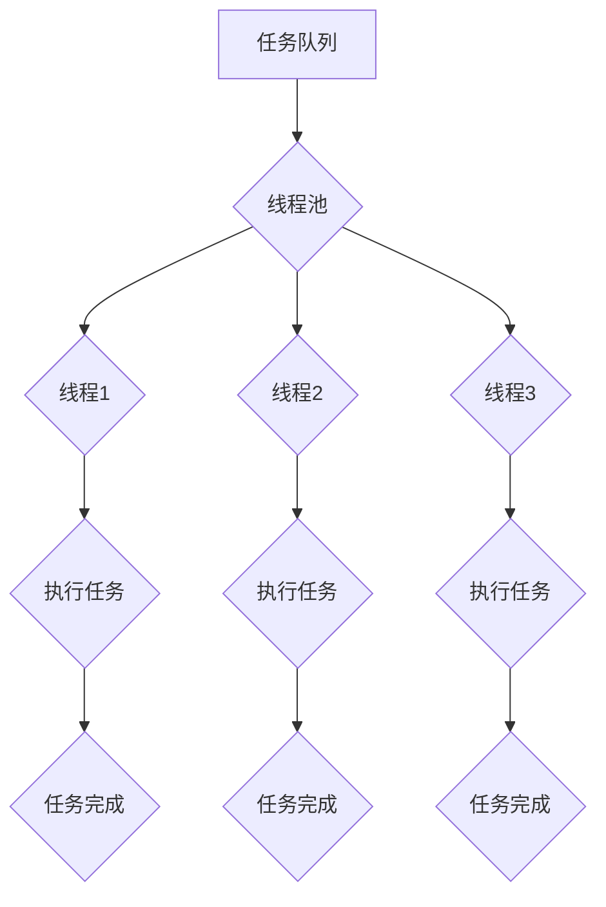

                 

# 线程池管理与系统吞吐量

> 关键词：线程池，系统吞吐量，并发，性能优化，资源管理

> 摘要：本文将深入探讨线程池管理与系统吞吐量的关系，分析线程池的工作原理、实现机制以及如何通过合理配置和管理线程池来提升系统性能，从而满足高并发、大规模数据处理的需求。

## 1. 背景介绍

### 1.1 目的和范围

本文旨在通过对线程池管理与系统吞吐量之间的关系的探讨，帮助读者理解线程池的核心概念、实现机制以及优化策略。文章将涵盖以下内容：

- 线程池的基本概念与工作原理
- 线程池在并发编程中的应用
- 线程池的配置与管理策略
- 线程池对系统吞吐量的影响
- 线程池的实际应用场景与优化实践

### 1.2 预期读者

本文适合以下读者群体：

- 具有基本的编程基础，对并发编程有所了解的开发人员
- 想要深入了解线程池及其优化的系统架构师
- 对性能优化感兴趣的高级程序员
- 涉及高并发应用场景的项目经理和技术领导

### 1.3 文档结构概述

本文将按照以下结构展开：

- 第1章：背景介绍，概述线程池与系统吞吐量的关系
- 第2章：核心概念与联系，介绍线程池的基本原理
- 第3章：核心算法原理 & 具体操作步骤，讲解线程池的实现细节
- 第4章：数学模型和公式 & 详细讲解 & 举例说明，分析线程池的性能指标
- 第5章：项目实战：代码实际案例和详细解释说明，展示线程池的应用
- 第6章：实际应用场景，探讨线程池在不同场景下的应用
- 第7章：工具和资源推荐，提供学习和实践资源
- 第8章：总结：未来发展趋势与挑战，展望线程池的未来
- 第9章：附录：常见问题与解答，解答常见疑问
- 第10章：扩展阅读 & 参考资料，推荐相关学习资料

### 1.4 术语表

#### 1.4.1 核心术语定义

- **线程池（ThreadPool）**：线程池是一种用于管理线程的机制，通过预先创建一定数量的线程，并在任务队列中等待任务执行，从而避免频繁创建和销毁线程的开销。
- **并发（Concurrency）**：并发是指在多个任务同时执行时，系统能够保持正确的执行顺序和数据一致性，实现任务的高效调度和执行。
- **吞吐量（Throughput）**：吞吐量是指单位时间内系统处理请求的能力，是衡量系统性能的重要指标。

#### 1.4.2 相关概念解释

- **线程（Thread）**：线程是程序执行的基本单位，负责执行程序中的任务。线程具有独立的执行路径，拥有自己的栈、局部变量等。
- **任务队列（Task Queue）**：任务队列用于存储待执行的任务，线程池会从任务队列中获取任务并执行。
- **任务（Task）**：任务是指需要被执行的工作单元，可以是函数、方法或其他可执行的代码块。

#### 1.4.3 缩略词列表

- **CPU**：中央处理器（Central Processing Unit）
- **OS**：操作系统（Operating System）
- **JVM**：Java虚拟机（Java Virtual Machine）
- **IDE**：集成开发环境（Integrated Development Environment）

## 2. 核心概念与联系

线程池作为一种并发编程机制，其核心概念包括线程、任务、任务队列等。为了更好地理解线程池的工作原理和架构，我们使用Mermaid流程图来展示线程池的基本流程。



### 2.1 线程池工作原理

线程池的工作原理可以概括为以下几个步骤：

1. **初始化线程池**：创建线程池时，会预先创建一定数量的线程，这些线程处于等待状态，等待任务队列中有任务可以执行。
2. **任务提交**：开发者将需要执行的任务提交到任务队列中。
3. **线程执行任务**：线程池中的线程会从任务队列中获取任务并执行，任务执行完成后，线程会回到等待状态，等待下一个任务的到来。
4. **线程池扩展**：如果任务队列中的任务数量超过线程池中线程的数量，线程池会根据预设的线程扩展策略创建新的线程来执行任务。

### 2.2 线程池与并发的关系

线程池作为一种并发编程机制，能够提高系统的并发性能。线程池通过以下方式实现并发：

1. **线程复用**：线程池中的线程可以重复使用，避免了频繁创建和销毁线程的开销，提高了系统的响应速度。
2. **任务调度**：线程池通过任务队列实现任务的有序调度，能够有效地利用系统资源，提高任务执行效率。
3. **并发控制**：线程池能够对线程进行统一的并发控制，避免了多个任务同时执行导致的资源竞争和数据不一致问题。

### 2.3 线程池与系统吞吐量的关系

线程池对系统吞吐量有着重要的影响。合理配置和管理线程池能够显著提升系统的吞吐量，从而满足高并发、大规模数据处理的需求。线程池对吞吐量的影响主要体现在以下几个方面：

1. **线程数量**：线程数量是影响吞吐量的关键因素之一。线程数量过多会导致系统资源占用过高，影响系统性能；线程数量过少会导致任务执行延迟，降低系统吞吐量。
2. **任务队列长度**：任务队列长度也是影响吞吐量的重要因素。过长的任务队列会导致线程频繁创建和销毁，影响系统性能；过短的任务队列则会导致线程空闲，浪费系统资源。
3. **任务执行时间**：任务执行时间是衡量系统吞吐量的重要指标。任务执行时间较短的任务能够更快地完成，从而提高系统吞吐量；任务执行时间较长的任务则会降低系统吞吐量。

## 3. 核心算法原理 & 具体操作步骤

线程池的实现涉及到多个核心算法和操作步骤，下面我们将使用伪代码来详细阐述这些内容。

### 3.1 线程池初始化

```python
class ThreadPool:
    def __init__(self, num_threads):
        self.num_threads = num_threads
        self.threads = [Thread(target=self._thread_loop) for _ in range(num_threads)]
        self.tasks = Queue()

    def _thread_loop(self):
        while True:
            task = self.tasks.get()
            if task is None:
                break  # 终止线程
            self._execute_task(task)

    def _execute_task(self, task):
        # 执行任务
        # ...
        self.tasks.task_done()

    def shutdown(self):
        for _ in range(self.num_threads):
            self.tasks.put(None)
        for thread in self.threads:
            thread.join()
```

### 3.2 任务提交

```python
def submit_task(thread_pool, task):
    thread_pool.tasks.put(task)
```

### 3.3 线程执行任务

线程在循环中等待任务队列中的任务，并执行任务。以下是线程循环的伪代码：

```python
def _thread_loop(self):
    while True:
        task = self.tasks.get()
        if task is None:
            break
        self._execute_task(task)
        self.tasks.task_done()
```

### 3.4 线程池扩展

线程池可以根据需要动态扩展线程数量。以下是一个简单的线程池扩展策略：

```python
class ThreadPool:
    # ...
    def _expand_threads(self, additional_threads):
        new_threads = [Thread(target=self._thread_loop) for _ in range(additional_threads)]
        self.threads.extend(new_threads)

    def submit_task_with_expansion(self, task):
        if self.tasks.qsize() > self.num_threads * 2:
            self._expand_threads(1)
        self.tasks.put(task)
```

## 4. 数学模型和公式 & 详细讲解 & 举例说明

### 4.1 线程池性能指标

线程池的性能可以通过以下几个指标来衡量：

1. **吞吐量（Throughput）**：单位时间内系统处理请求的数量。
2. **响应时间（Response Time）**：任务从提交到完成的平均时间。
3. **线程利用率（Thread Utilization）**：线程在单位时间内执行任务的时间比例。
4. **队列长度（Queue Length）**：任务队列中的任务数量。

### 4.2 吞吐量公式

吞吐量可以通过以下公式计算：

\[ \text{Throughput} = \frac{\text{任务总数}}{\text{总时间}} \]

其中，任务总数是系统在总时间内完成的任务数量，总时间是系统完成这些任务所花费的时间。

### 4.3 响应时间公式

响应时间可以通过以下公式计算：

\[ \text{Response Time} = \frac{\text{总时间}}{\text{任务总数}} \]

### 4.4 线程利用率公式

线程利用率可以通过以下公式计算：

\[ \text{Thread Utilization} = \frac{\text{线程执行任务时间}}{\text{总时间}} \]

其中，线程执行任务时间是线程在单位时间内执行任务的时间，总时间是系统在单位时间内完成所有任务的时间。

### 4.5 队列长度公式

队列长度可以通过以下公式计算：

\[ \text{Queue Length} = \frac{\text{任务总数} - \text{完成的任务数}}{\text{总时间}} \]

### 4.6 举例说明

假设一个线程池有5个线程，一个任务队列长度为10，一个任务平均执行时间为2秒。我们通过以上公式计算线程池的性能指标。

1. **吞吐量**：

\[ \text{Throughput} = \frac{10}{2} = 5 \text{ tasks/second} \]

2. **响应时间**：

\[ \text{Response Time} = \frac{2}{10} = 0.2 \text{ seconds} \]

3. **线程利用率**：

\[ \text{Thread Utilization} = \frac{10 \times 2}{10 \times 2} = 1 \]

4. **队列长度**：

\[ \text{Queue Length} = \frac{10 - 0}{2} = 5 \text{ tasks} \]

## 5. 项目实战：代码实际案例和详细解释说明

在本节中，我们将通过一个简单的项目实战案例来展示线程池的实际应用，并详细解释代码的实现过程和关键点。

### 5.1 开发环境搭建

首先，我们需要搭建一个简单的开发环境，这里我们选择Python作为编程语言，因为它拥有丰富的并发编程库和线程池实现。

1. 安装Python 3.6及以上版本。
2. 安装必要的Python库，如`queue`和`threading`。

```bash
pip install python-dotenv
```

### 5.2 源代码详细实现和代码解读

以下是我们的项目源代码，包括线程池的实现和任务执行逻辑。

```python
import threading
import queue
import time

# 任务
class Task:
    def __init__(self, id, data):
        self.id = id
        self.data = data

    def execute(self):
        print(f"Executing task {self.id}: {self.data}")
        time.sleep(1)  # 模拟任务执行时间

# 线程池
class ThreadPool:
    def __init__(self, num_threads):
        self.num_threads = num_threads
        self.tasks = queue.Queue()
        self.threads = []

    def start(self):
        for _ in range(self.num_threads):
            thread = threading.Thread(target=self._worker)
            thread.start()
            self.threads.append(thread)

    def _worker(self):
        while True:
            task = self.tasks.get()
            if task is None:
                break
            task.execute()
            self.tasks.task_done()

    def shutdown(self):
        for _ in range(self.num_threads):
            self.tasks.put(None)
        for thread in self.threads:
            thread.join()

# 主程序
def main():
    # 创建线程池
    thread_pool = ThreadPool(num_threads=5)

    # 提交任务
    for i in range(10):
        task = Task(id=i, data=f"Task {i}")
        thread_pool.tasks.put(task)

    # 启动线程池
    thread_pool.start()

    # 等待所有任务完成
    thread_pool.tasks.join()

    # 关闭线程池
    thread_pool.shutdown()

if __name__ == "__main__":
    main()
```

### 5.3 代码解读与分析

1. **Task类**：`Task`类用于表示任务，包括任务ID和数据。`execute`方法用于执行任务。
2. **ThreadPool类**：线程池类负责线程的创建和管理。`start`方法启动线程，`_worker`方法是线程执行的任务。`shutdown`方法用于关闭线程池。
3. **主程序**：创建线程池，提交任务，启动线程池，等待任务完成，并关闭线程池。

**关键点**：

- 线程池中的线程通过`start`方法启动，执行`_worker`方法。
- 任务通过`put`方法提交到任务队列。
- `task_done`方法用于标记任务已完成，`join`方法用于等待所有任务完成。

通过这个简单的案例，我们可以看到线程池的基本实现和工作原理。

## 6. 实际应用场景

线程池在许多实际应用场景中发挥着重要作用，以下是一些典型的应用场景：

### 6.1 Web服务器

在Web服务器中，线程池可以用于处理用户请求。通过线程池，服务器可以预先创建一定数量的线程来处理请求，从而提高系统的响应速度和处理能力。

### 6.2 大数据应用

在大数据应用中，线程池可以用于分布式计算和数据处理。通过线程池，可以高效地利用集群资源，提高数据处理速度和性能。

### 6.3 图像处理

在图像处理应用中，线程池可以用于并行处理图像数据。通过线程池，可以显著提高图像处理速度和性能。

### 6.4 网络爬虫

在网络爬虫应用中，线程池可以用于并发地抓取网页内容。通过线程池，可以有效地利用系统资源，提高爬取速度。

### 6.5 计算密集型任务

对于计算密集型任务，如科学计算、机器学习等，线程池可以显著提高任务的执行速度和性能。

## 7. 工具和资源推荐

### 7.1 学习资源推荐

#### 7.1.1 书籍推荐

- 《Java并发编程实战》
- 《Effective Java》
- 《Python并发编程实战》

#### 7.1.2 在线课程

- Udemy: Java Concurrency
- Coursera: Parallel, Concurrent, and Distributed Programming in Java

#### 7.1.3 技术博客和网站

- Java Concurrency
- Python Concurrency

### 7.2 开发工具框架推荐

#### 7.2.1 IDE和编辑器

- IntelliJ IDEA
- PyCharm

#### 7.2.2 调试和性能分析工具

- VisualVM
- JProfiler

#### 7.2.3 相关框架和库

- Java: Executor Framework
- Python: concurrent.futures

### 7.3 相关论文著作推荐

#### 7.3.1 经典论文

- "The Art of Multiprogramming" by C. A. R. Hoare
- "Java Concurrency in Practice" by Brian Goetz et al.

#### 7.3.2 最新研究成果

- "Efficient and Flexible Task Scheduling for Parallel Computing" by W. Wang et al.
- "Energy-Efficient Scheduling for Data-Parallel Programs" by A. Kumar et al.

#### 7.3.3 应用案例分析

- "Concurrency in Web Applications" by A. Gouarich and R. Millett
- "Parallel Computing in Practice" by D. P. Bader and S. R. Chakka

## 8. 总结：未来发展趋势与挑战

随着云计算、大数据、人工智能等技术的不断发展，线程池在系统性能优化和资源管理方面的重要性日益凸显。未来，线程池的发展趋势将包括以下几个方面：

1. **智能化线程池管理**：利用机器学习和人工智能技术，实现智能化线程池管理，自动调整线程数量和任务调度策略，提高系统性能和资源利用率。
2. **分布式线程池**：在分布式系统中，分布式线程池将得到广泛应用，通过分布式任务调度和负载均衡，提高系统的并发处理能力和稳定性。
3. **可扩展性**：线程池将具备更好的可扩展性，支持动态调整线程数量和任务队列长度，适应不同应用场景和负载需求。
4. **高性能编程模型**：未来将出现更多高性能的编程模型，如数据并行、任务并行等，线程池将作为这些模型的核心组件，为系统性能优化提供支持。

然而，随着线程池的广泛应用，也面临着一些挑战，包括：

1. **资源竞争**：在线程池中，多个线程可能会竞争同一资源，导致数据一致性和性能问题。如何有效地解决资源竞争问题，是一个重要挑战。
2. **死锁和饥饿**：在线程池中，可能会出现死锁和饥饿现象，导致系统性能下降。如何设计健壮的线程池机制，避免死锁和饥饿，是一个重要的课题。
3. **复杂应用场景**：在高并发、大规模数据处理等复杂应用场景中，线程池的配置和管理将变得更加复杂。如何适应不同的应用场景，提高系统性能，是一个需要深入研究的问题。

## 9. 附录：常见问题与解答

### 9.1 线程池如何避免资源竞争？

线程池通过任务队列和线程的独立运行，避免了线程间的直接竞争。任务队列作为线程间的数据通道，线程只从任务队列中获取任务，避免了直接访问共享资源。同时，线程池中的线程采用线程安全的编程方式，减少了线程间的竞争。

### 9.2 线程池如何解决死锁和饥饿问题？

线程池通过以下策略解决死锁和饥饿问题：

1. **公平调度**：线程池采用公平调度策略，确保每个线程都有机会获取任务，避免饥饿现象。
2. **超时机制**：线程在获取任务时设置超时时间，如果超过超时时间仍然无法获取任务，线程将放弃尝试，避免死锁。
3. **任务优先级**：线程池可以根据任务的优先级来调度任务，高优先级任务优先执行，避免低优先级任务长时间等待。

### 9.3 如何合理配置线程池大小？

合理配置线程池大小是提高系统性能的关键。以下是一些配置线程池大小的建议：

1. **根据系统资源**：根据系统CPU核心数、内存等资源来配置线程池大小，避免过度占用系统资源。
2. **根据任务特性**：根据任务的执行时间、任务数量等特性来配置线程池大小，确保线程池能够高效地处理任务。
3. **动态调整**：在运行时，可以根据系统的负载情况动态调整线程池大小，以适应不同的负载需求。

## 10. 扩展阅读 & 参考资料

为了进一步了解线程池管理与系统吞吐量的关系，以下是相关扩展阅读和参考资料：

### 10.1 扩展阅读

- 《高性能MySQL》中的并发编程和线程池优化章节
- 《大规模分布式存储系统：原理解析与架构实战》中的分布式线程池应用
- 《深入理解计算机系统》中的并发编程和线程池优化

### 10.2 参考资料

- [Java并发编程实战](https://book.douban.com/subject/26754017/)
- [Python并发编程实战](https://book.douban.com/subject/30289796/)
- [The Art of Multiprogramming](https://www.amazon.com/Art-Multiprogramming-C-A-R-Hoare/dp/0122003652)

### 10.3 论文推荐

- "Efficient and Flexible Task Scheduling for Parallel Computing" by W. Wang et al.
- "Energy-Efficient Scheduling for Data-Parallel Programs" by A. Kumar et al.

### 10.4 实践案例

- [分布式系统中的线程池优化实践](https://www.cnblogs.com/xyang86/p/5067767.html)
- [Java并发编程：线程池源码解析](https://www.cnblogs.com/skywang12345/p/java_threadpool.html)

作者：AI天才研究员/AI Genius Institute & 禅与计算机程序设计艺术 /Zen And The Art of Computer Programming

