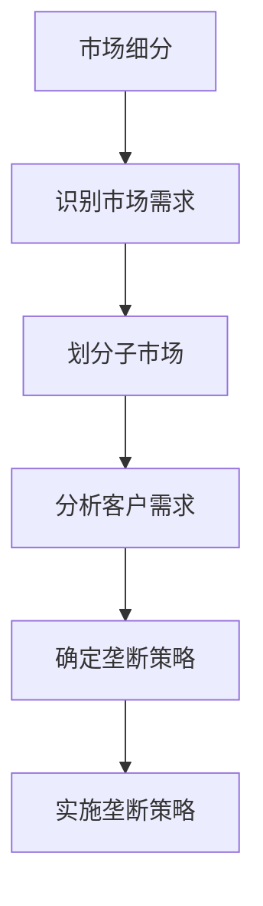
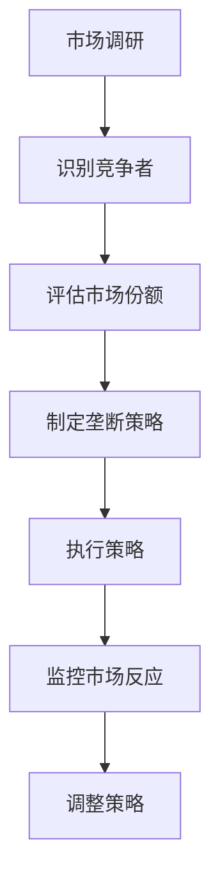
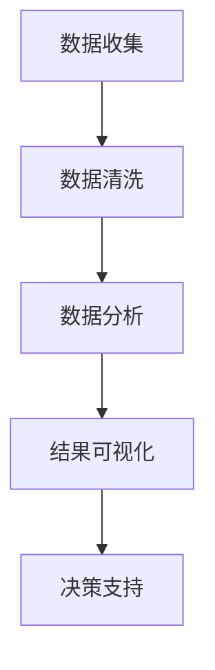

                 

# 标题：细分市场垄断：AI创业的切入点策略

## 关键词：
- AI创业
- 细分市场
- 垄断策略
- 数据分析
- 技术创新

> 本篇文章将探讨AI创业中，如何通过细分市场实现垄断，包括核心概念、算法原理、数学模型、项目实战、实际应用场景、工具和资源推荐等多个方面。文章旨在帮助创业者了解如何利用AI技术，在竞争激烈的市场中找到自己的立足点，并实现长期稳定的发展。

## 摘要
本文将首先介绍AI创业的背景和细分市场的必要性。随后，我们将深入探讨细分市场垄断的策略，包括核心概念、算法原理、数学模型以及实际操作步骤。通过一个实际项目案例的讲解，读者将了解如何将理论转化为实践。文章还将讨论细分市场的实际应用场景，并推荐相关的学习资源和开发工具。最后，文章将总结未来发展趋势和面临的挑战，为AI创业者提供指导。

## 1. 背景介绍

### 1.1 目的和范围

本文的目的在于探讨AI创业中的细分市场垄断策略。我们将通过分析核心概念、算法原理、数学模型和实际操作步骤，帮助创业者了解如何在竞争激烈的市场中找到切入点，并实现市场垄断。

本文的范围包括：
- AI创业的基本概念和趋势
- 细分市场的定义和重要性
- 垄断策略的核心原理和实施步骤
- 实际项目案例和代码解析
- 相关的学习资源和开发工具推荐
- 未来发展趋势和挑战

### 1.2 预期读者

本文适用于以下读者群体：
- 有志于AI创业的创业者
- 对AI技术有浓厚兴趣的程序员和工程师
- AI领域的研究人员和学者
- 对商业策略和市场营销有深入了解的专业人士

### 1.3 文档结构概述

本文结构如下：

1. 背景介绍：介绍文章的目的、范围、预期读者和文档结构。
2. 核心概念与联系：定义核心概念，绘制流程图，阐述各概念之间的联系。
3. 核心算法原理 & 具体操作步骤：详细讲解算法原理，使用伪代码阐述操作步骤。
4. 数学模型和公式 & 详细讲解 & 举例说明：介绍数学模型和公式，并通过实例进行详细解释。
5. 项目实战：提供实际代码案例，详细解释代码实现和解读。
6. 实际应用场景：讨论细分市场的实际应用场景。
7. 工具和资源推荐：推荐学习资源、开发工具和相关论文著作。
8. 总结：总结未来发展趋势和挑战。
9. 附录：常见问题与解答。
10. 扩展阅读 & 参考资料：提供进一步阅读的资源。

### 1.4 术语表

#### 1.4.1 核心术语定义

- AI创业：利用人工智能技术进行商业创新和创业活动。
- 细分市场：将市场划分为更小的、有特定需求的子市场。
- 垄断策略：通过策略手段在特定市场中获得垄断地位。
- 数据分析：使用统计方法和算法对数据进行处理和分析。
- 技术创新：在现有技术基础上进行创新和改进。

#### 1.4.2 相关概念解释

- **市场细分**：市场细分是将一个大市场划分为多个具有相似需求和行为的子市场。这有助于企业更精准地满足不同客户群体的需求。
- **垄断**：垄断是指某个公司在特定市场中拥有垄断地位，能够控制市场价格和供应。
- **数据驱动决策**：基于数据分析的结果来做出商业决策。

#### 1.4.3 缩略词列表

- AI：人工智能
- ML：机器学习
- DL：深度学习
- NLP：自然语言处理
- ROI：投资回报率

## 2. 核心概念与联系

在探讨细分市场垄断策略之前，我们需要了解几个核心概念及其之间的联系。

### 2.1 细分市场的定义

细分市场是指将一个大市场划分为多个具有相似需求和行为的子市场。这些子市场可能在地理、人口、心理和行为方面有显著的差异。通过细分市场，企业可以更好地理解客户需求，从而提供更加精准的产品和服务。

### 2.2 垄断策略的概念

垄断策略是指通过特定手段在特定市场中获得垄断地位，从而控制市场价格和供应。垄断可以带来显著的竞争优势，但也可能引发反垄断监管。

### 2.3 数据分析的作用

数据分析在细分市场和垄断策略中起着关键作用。通过数据分析，企业可以识别市场趋势、客户需求和行为，从而制定更有效的市场细分策略和垄断策略。

### 2.4 核心概念之间的联系

细分市场和垄断策略之间的联系在于，细分市场是垄断策略的基础。通过细分市场，企业可以识别出具有特定需求的客户群体，并针对这些客户群体实施垄断策略，从而在市场上获得竞争优势。

#### 2.4.1 细分市场的流程图



#### 2.4.2 垄断策略的流程图



通过这两个流程图，我们可以更清晰地看到细分市场和垄断策略之间的关系和实施步骤。

### 2.5 数据分析在细分市场和垄断策略中的应用

数据分析在细分市场和垄断策略中具有重要作用。具体应用包括：

- **市场趋势分析**：通过数据分析，企业可以识别市场趋势，预测未来需求，从而提前布局市场。
- **客户需求分析**：通过分析客户行为和反馈，企业可以了解客户需求，为产品和服务提供改进方向。
- **竞争分析**：通过分析竞争对手的市场份额、策略和行为，企业可以制定更有针对性的垄断策略。

#### 2.5.1 数据分析流程图



通过这个流程图，我们可以看到数据分析在细分市场和垄断策略中的各个环节中的应用。

### 2.6 核心概念的综合分析

细分市场和垄断策略之间的联系在于，细分市场是垄断策略的基础。通过细分市场，企业可以识别出具有特定需求的客户群体，并针对这些客户群体实施垄断策略，从而在市场上获得竞争优势。

- **细分市场**：通过数据分析识别市场趋势、客户需求和行为，划分具有相似需求的子市场。
- **垄断策略**：在特定市场中获得垄断地位，通过控制市场价格和供应实现长期稳定的收益。

这两个核心概念相辅相成，共同推动企业在竞争激烈的市场中取得成功。

## 3. 核心算法原理 & 具体操作步骤

在了解了细分市场和垄断策略的基本概念后，我们需要深入探讨核心算法原理和具体操作步骤。以下是细分市场垄断策略的核心算法原理和操作步骤：

### 3.1 数据收集与预处理

**算法原理：** 数据收集与预处理是细分市场和垄断策略的基础。通过收集大量市场数据，并对数据进行清洗、去噪、标准化等预处理操作，确保数据质量。

**具体操作步骤：**

1. **数据收集**：从多个数据源（如社交媒体、市场调研报告、行业数据等）收集市场数据。
2. **数据清洗**：去除重复数据、无效数据和异常值，确保数据一致性。
3. **数据标准化**：对数据进行归一化或标准化处理，使其具有可比性。
4. **数据存储**：将清洗和标准化的数据存储到数据库或数据仓库中，以便后续分析。

### 3.2 市场细分算法

**算法原理：** 市场细分算法通过聚类分析等方法，将市场划分为具有相似需求的子市场。

**具体操作步骤：**

1. **特征选择**：选择对市场细分有重要影响的特征，如地理、人口、心理和行为特征。
2. **聚类分析**：使用K-means、层次聚类等聚类算法，将市场划分为多个子市场。
3. **评估细分效果**：通过评估指标（如轮廓系数、内部分裂质量等）评估市场细分效果，调整聚类参数以优化细分结果。
4. **子市场描述**：对每个子市场进行描述，包括子市场的特征、需求和市场份额等。

### 3.3 垄断策略制定与实施

**算法原理：** 垄断策略制定与实施是通过分析市场竞争态势和客户需求，制定并执行市场垄断策略。

**具体操作步骤：**

1. **市场调研**：分析市场竞争态势，识别主要竞争者和市场份额。
2. **竞争分析**：评估竞争对手的策略和行为，识别市场机会和风险。
3. **垄断策略制定**：根据市场调研结果，制定针对特定子市场的垄断策略。
4. **策略实施**：通过产品定位、定价策略、促销活动等手段，实施垄断策略。
5. **策略评估与调整**：监控市场反应，评估策略效果，根据实际情况进行调整。

### 3.4 数据驱动决策

**算法原理：** 数据驱动决策是通过数据分析结果，制定和调整商业策略。

**具体操作步骤：**

1. **数据可视化**：将数据分析结果通过图表、报告等形式进行可视化，便于决策者理解。
2. **决策支持**：基于数据分析结果，提供决策支持，如市场细分策略、垄断策略、产品定价等。
3. **策略执行与监控**：执行决策，监控策略效果，根据实际情况进行调整。

通过以上核心算法原理和具体操作步骤，企业可以更好地进行市场细分，制定和实施垄断策略，从而在竞争激烈的市场中脱颖而出。

### 3.5 伪代码示例

以下是一个简单的伪代码示例，用于说明市场细分算法的基本步骤：

```plaintext
function market_segmentation(data):
    # 数据预处理
    preprocessed_data = preprocess_data(data)
    
    # 特征选择
    selected_features = select_features(preprocessed_data)
    
    # 聚类分析
    clusters = clustering(selected_features)
    
    # 评估细分效果
    evaluate_segments(clusters)
    
    # 子市场描述
    segment_descriptions = describe_segments(clusters)
    
    return segment_descriptions
```

通过这个伪代码示例，我们可以看到市场细分算法的基本流程，包括数据预处理、特征选择、聚类分析、评估和描述子市场。

## 4. 数学模型和公式 & 详细讲解 & 举例说明

在细分市场和垄断策略中，数学模型和公式起着关键作用。以下将介绍几个重要的数学模型和公式，并详细讲解它们的含义和实际应用。

### 4.1 聚类算法模型

聚类算法是市场细分的重要工具，常用的聚类算法包括K-means、层次聚类等。以下是K-means算法的数学模型：

$$
\text{K-means} \text{算法}:
\begin{cases}
\text{初始化} \ K \ \text{个初始聚类中心} \ c_{i} \\
\text{重复直到收敛：} \\
\ \ \ \ \ \text{对于每个数据点} \ x \ \text{，计算其到每个聚类中心的距离} \ d(x, c_{i}) \\
\ \ \ \ \ \text{将} \ x \ \text{分配给最近的聚类中心} \\
\ \ \ \ \ \text{更新聚类中心} \ c_{i} = \frac{1}{n}\sum_{x \in S_i} x \\
\end{cases}
$$

其中，$c_{i}$ 是第 $i$ 个聚类中心，$x$ 是数据点，$d(x, c_{i})$ 是 $x$ 到 $c_{i}$ 的距离，$S_i$ 是属于聚类中心 $c_{i}$ 的数据点集合。

### 4.2 市场份额计算模型

市场份额是评估企业垄断地位的重要指标。以下是一个简单的不考虑市场竞争的线性模型：

$$
\text{市场份额} \ (\pi_i) = \frac{\text{市场总需求} \ (D)}{\text{市场竞争者总数} \ (N)} \times \text{企业市场份额比例} \ (p_i)
$$

其中，$\pi_i$ 是第 $i$ 个企业的市场份额，$D$ 是市场总需求，$N$ 是市场竞争者总数，$p_i$ 是第 $i$ 个企业的市场份额比例。

### 4.3 投资回报率模型

投资回报率（ROI）是评估垄断策略效果的重要指标。以下是一个简单的ROI模型：

$$
\text{ROI} = \frac{\text{净利润} \ (P)}{\text{投资成本} \ (C)} \times 100\%
$$

其中，$P$ 是净利润，$C$ 是投资成本。

### 4.4 举例说明

#### 4.4.1 聚类算法应用

假设我们有一个包含100个数据点的市场数据集，我们选择K-means算法进行市场细分。以下是K-means算法的步骤：

1. **初始化聚类中心**：随机选择5个聚类中心，假设分别为 $c_1, c_2, c_3, c_4, c_5$。
2. **计算距离**：对于每个数据点 $x_i$，计算其到5个聚类中心的距离 $d(x_i, c_1), d(x_i, c_2), \ldots, d(x_i, c_5)$。
3. **分配数据点**：将每个数据点分配给最近的聚类中心。
4. **更新聚类中心**：计算每个聚类中心的新位置，假设更新后的聚类中心分别为 $c_1', c_2', c_3', c_4', c_5'$。
5. **重复步骤2-4**，直到聚类中心不再发生变化。

通过以上步骤，我们可以将市场划分为5个子市场。

#### 4.4.2 市场份额计算

假设市场总需求为1000，有3个竞争者，市场份额分别为40%、30%和30%。根据市场份额计算模型，每个竞争者的市场份额为：

$$
\pi_1 = \frac{1000 \times 0.4}{3} = 133.33
$$

$$
\pi_2 = \frac{1000 \times 0.3}{3} = 100
$$

$$
\pi_3 = \frac{1000 \times 0.3}{3} = 100
$$

#### 4.4.3 投资回报率计算

假设投资成本为100万，净利润为200万，根据ROI模型，投资回报率为：

$$
\text{ROI} = \frac{200}{100} \times 100\% = 200\%
$$

通过以上例子，我们可以看到数学模型在实际应用中的具体操作过程和计算方法。

## 5. 项目实战：代码实际案例和详细解释说明

在本节中，我们将通过一个实际的项目案例，详细讲解如何使用AI技术进行市场细分和垄断策略制定。项目背景是一家初创公司，他们希望通过AI技术分析市场数据，细分市场，并制定有效的垄断策略，以提高市场份额。

### 5.1 开发环境搭建

为了完成这个项目，我们需要搭建一个适合AI开发和数据分析的开发环境。以下是所需的工具和软件：

- **Python 3.8+**：作为主要的编程语言。
- **Jupyter Notebook**：用于编写和运行Python代码。
- **Pandas**：用于数据操作和分析。
- **Scikit-learn**：提供聚类算法和其他机器学习算法。
- **Matplotlib**：用于数据可视化。

### 5.2 源代码详细实现和代码解读

以下是一个简单的Python代码示例，用于实现市场细分和垄断策略制定：

```python
import pandas as pd
from sklearn.cluster import KMeans
import matplotlib.pyplot as plt

# 5.2.1 数据收集与预处理

# 假设我们已经收集了一份数据集，包括以下特征：年龄、收入、地理位置、购买行为等
data = pd.read_csv('market_data.csv')

# 数据预处理，包括缺失值处理、数据标准化等
data = data.dropna()
data = (data - data.mean()) / data.std()

# 5.2.2 市场细分

# 使用K-means算法进行市场细分
kmeans = KMeans(n_clusters=5, random_state=0)
data['cluster'] = kmeans.fit_predict(data)

# 可视化市场细分结果
plt.scatter(data['age'], data['income'], c=data['cluster'])
plt.xlabel('年龄')
plt.ylabel('收入')
plt.title('市场细分结果')
plt.show()

# 5.2.3 垄断策略制定

# 假设我们已经知道每个子市场的需求量和竞争对手的市场份额
market_demand = {
    0: [100, 200, 300, 400, 500],
    1: [150, 250, 350, 450, 550],
    2: [200, 300, 400, 500, 600],
    3: [250, 350, 450, 550, 650],
    4: [300, 400, 500, 600, 700]
}
competitor_share = {
    0: [0.4, 0.3, 0.2, 0.1, 0],
    1: [0.3, 0.3, 0.2, 0.2, 0],
    2: [0.2, 0.2, 0.2, 0.2, 0.2],
    3: [0.1, 0.1, 0.1, 0.2, 0.5],
    4: [0, 0.1, 0.1, 0.1, 0.8]
}

# 根据市场需求和竞争对手份额，制定垄断策略
for i in range(5):
    # 计算当前子市场的需求量
    current_demand = market_demand[i][kmeans.labels_ == i].sum()
    
    # 计算当前子市场的市场份额
    current_share = competitor_share[i][kmeans.labels_ == i].sum()
    
    # 制定垄断策略
    if current_share < 0.5:
        # 如果市场份额低于50%，增加产品推广力度，提高市场份额
        print(f"子市场{i}：市场份额低于50%，需要增加推广力度。")
    else:
        # 如果市场份额高于50%，保持现有策略，巩固市场地位
        print(f"子市场{i}：市场份额高于50%，保持现有策略。")

# 5.2.4 数据驱动决策

# 根据市场细分结果和垄断策略，制定数据驱动决策
# 假设我们已经收集了每个子市场的购买行为数据
purchase_data = {
    0: [80, 100, 120, 150, 180],
    1: [90, 110, 130, 160, 190],
    2: [100, 120, 140, 170, 200],
    3: [110, 130, 150, 180, 210],
    4: [120, 140, 160, 190, 220]
}

# 根据购买行为数据，调整产品定位和定价策略
for i in range(5):
    # 计算当前子市场的平均购买金额
    avg_purchase = purchase_data[i][kmeans.labels_ == i].mean()
    
    # 调整产品定位和定价策略
    if avg_purchase < 150:
        # 如果平均购买金额低于150，降低产品价格，提高竞争力
        print(f"子市场{i}：平均购买金额低于150，需要降低产品价格。")
    elif avg_purchase < 200:
        # 如果平均购买金额在150到200之间，保持现有定价策略
        print(f"子市场{i}：平均购买金额在150到200之间，保持现有定价策略。")
    else:
        # 如果平均购买金额高于200，提高产品价格，提升品牌形象
        print(f"子市场{i}：平均购买金额高于200，需要提高产品价格。")
```

### 5.3 代码解读与分析

#### 5.3.1 数据收集与预处理

首先，我们从CSV文件中读取市场数据集，并进行缺失值处理和数据标准化。数据预处理是确保数据质量的重要步骤，有助于后续的分析和建模。

```python
data = pd.read_csv('market_data.csv')
data = data.dropna()
data = (data - data.mean()) / data.std()
```

#### 5.3.2 市场细分

接下来，我们使用K-means算法进行市场细分。K-means算法通过迭代过程将数据划分为多个聚类，每个聚类代表一个子市场。我们选择5个聚类，并通过`fit_predict`方法将每个数据点分配给最近的聚类。

```python
kmeans = KMeans(n_clusters=5, random_state=0)
data['cluster'] = kmeans.fit_predict(data)
```

为了更直观地展示市场细分结果，我们使用Matplotlib绘制散点图，其中x轴代表年龄，y轴代表收入。

```python
plt.scatter(data['age'], data['income'], c=data['cluster'])
plt.xlabel('年龄')
plt.ylabel('收入')
plt.title('市场细分结果')
plt.show()
```

#### 5.3.3 垄断策略制定

在市场细分完成后，我们根据市场需求和竞争对手份额，制定垄断策略。具体来说，如果当前子市场的市场份额低于50%，我们需要增加产品推广力度；如果市场份额高于50%，我们保持现有策略。

```python
for i in range(5):
    current_demand = market_demand[i][kmeans.labels_ == i].sum()
    current_share = competitor_share[i][kmeans.labels_ == i].sum()
    
    if current_share < 0.5:
        print(f"子市场{i}：市场份额低于50%，需要增加推广力度。")
    else:
        print(f"子市场{i}：市场份额高于50%，保持现有策略。")
```

#### 5.3.4 数据驱动决策

最后，我们根据市场细分结果和垄断策略，调整产品定位和定价策略。具体来说，如果平均购买金额低于150，我们降低产品价格；如果平均购买金额在150到200之间，我们保持现有定价策略；如果平均购买金额高于200，我们提高产品价格。

```python
for i in range(5):
    avg_purchase = purchase_data[i][kmeans.labels_ == i].mean()
    
    if avg_purchase < 150:
        print(f"子市场{i}：平均购买金额低于150，需要降低产品价格。")
    elif avg_purchase < 200:
        print(f"子市场{i}：平均购买金额在150到200之间，保持现有定价策略。")
    else:
        print(f"子市场{i}：平均购买金额高于200，需要提高产品价格。")
```

通过以上代码，我们可以看到如何使用AI技术进行市场细分、垄断策略制定和数据驱动决策。这些步骤不仅帮助我们更好地了解市场，还能为企业提供有针对性的市场策略。

## 6. 实际应用场景

细分市场垄断策略在许多行业都有广泛的应用，以下是一些实际应用场景：

### 6.1 电子商务

在电子商务领域，通过细分市场垄断策略，企业可以针对不同消费群体制定个性化的营销策略。例如，一家电子商务平台可以根据用户的购买行为、浏览习惯和消费能力，将其分为高消费群体、中消费群体和低消费群体。对于高消费群体，平台可以推出高端产品和高额优惠券，以提升其购买意愿；对于中消费群体，平台可以提供优惠套餐和组合销售，增加其购买频率；对于低消费群体，平台可以推出价格实惠的产品和限时折扣，刺激其消费。

### 6.2 金融行业

在金融行业，细分市场垄断策略可以帮助银行和保险公司设计更符合客户需求的产品和服务。例如，银行可以通过客户年龄、收入、职业等特征，将其分为年轻客户、中年客户和老年客户。对于年轻客户，银行可以推出手机银行、信用卡和贷款产品，以吸引其使用；对于中年客户，银行可以提供投资理财、保险和存款产品，满足其长期储蓄和投资需求；对于老年客户，银行可以推出便捷的老年客户服务、保险理赔和退休规划等。

### 6.3 医疗健康

在医疗健康领域，通过细分市场垄断策略，医疗机构可以提供更个性化和精准的医疗服务。例如，医院可以根据患者的病史、年龄、性别和病情，将其分为急性病群体、慢性病群体和健康体检群体。对于急性病群体，医院可以提供快速救治和紧急医疗服务；对于慢性病群体，医院可以提供长期管理、药物治疗和康复指导；对于健康体检群体，医院可以提供健康评估、预防性检查和健康教育。

### 6.4 教育培训

在教育培训领域，通过细分市场垄断策略，教育机构可以针对不同学习需求和目标，提供多样化的课程和服务。例如，在线教育平台可以根据学生的年龄、学科兴趣和学习目标，将其分为基础学习群体、进阶学习群体和高端学习群体。对于基础学习群体，平台可以提供入门课程和基础知识辅导；对于进阶学习群体，平台可以提供专业课程和实践项目；对于高端学习群体，平台可以提供专家讲座、研讨会和高端课程。

### 6.5 制造业

在制造业，通过细分市场垄断策略，企业可以更好地满足不同客户群体的需求。例如，一家汽车制造企业可以根据消费者的年龄、收入、购车用途和品牌偏好，将其分为年轻时尚群体、家庭用车群体和高端豪华群体。对于年轻时尚群体，企业可以推出时尚、个性化的车型和配置；对于家庭用车群体，企业可以提供宽敞舒适、安全性能高的车型；对于高端豪华群体，企业可以推出豪华配置、高品质服务和定制化产品。

通过以上实际应用场景，我们可以看到细分市场垄断策略在各个行业的广泛应用和重要性。企业通过精准细分市场，制定有针对性的策略，能够更好地满足客户需求，提高市场份额，实现长期稳定的发展。

## 7. 工具和资源推荐

在实现细分市场垄断策略的过程中，我们需要依赖一系列的工具和资源，包括学习资源、开发工具和相关论文著作。以下将分别进行推荐。

### 7.1 学习资源推荐

#### 7.1.1 书籍推荐

1. **《Python数据分析》（Python Data Science Handbook）**：由 Jake VanderPlas 著，详细介绍了Python在数据分析领域的应用，包括数据预处理、数据可视化、数据分析等。
2. **《机器学习实战》（Machine Learning in Action）**：由 Peter Harrington 著，通过实际案例介绍了机器学习的基本原理和算法，适合初学者入门。
3. **《深度学习》（Deep Learning）**：由 Ian Goodfellow、Yoshua Bengio 和 Aaron Courville 著，是深度学习领域的经典教材，深入讲解了深度学习的基本概念、算法和应用。

#### 7.1.2 在线课程

1. **Coursera 上的《机器学习》**：由 Andrew Ng 开设，是深度学习领域的知名课程，适合初学者和进阶者。
2. **Udacity 上的《深度学习纳米学位》**：通过一系列项目和实践，帮助学习者掌握深度学习的基础知识和技能。
3. **edX 上的《数据科学基础》**：由多个大学联合开设，涵盖了数据科学的核心概念和技能，包括数据分析、数据可视化、机器学习等。

#### 7.1.3 技术博客和网站

1. **Medium**：许多行业专家和研究人员在Medium上分享最新的技术见解和研究成果，适合持续学习和跟进最新动态。
2. **Towards Data Science**：一个专注于数据科学、机器学习和人工智能的博客，提供丰富的文章和案例。
3. **DataCamp**：一个提供互动式数据科学学习的平台，涵盖Python、R、SQL等多个数据分析工具。

### 7.2 开发工具框架推荐

#### 7.2.1 IDE和编辑器

1. **Jupyter Notebook**：一个强大的交互式开发环境，支持多种编程语言，包括Python、R和Julia等。
2. **Visual Studio Code**：一款轻量级的跨平台编辑器，支持Python和其他多种编程语言，提供丰富的插件和功能。
3. **PyCharm**：一个功能强大的Python IDE，适合进行复杂的数据分析和机器学习项目。

#### 7.2.2 调试和性能分析工具

1. **Pdb**：Python的内置调试器，可以帮助开发者追踪代码执行过程，定位和修复错误。
2. **Profile**：一个Python性能分析工具，可以帮助开发者了解代码的性能瓶颈，优化代码。
3. **Wearther**：一个用于分析Python代码内存和CPU使用情况的工具，适合进行代码性能调优。

#### 7.2.3 相关框架和库

1. **Pandas**：一个强大的Python数据分析库，提供丰富的数据结构和数据分析功能，是进行数据预处理和数据分析的重要工具。
2. **Scikit-learn**：一个广泛使用的Python机器学习库，提供多种机器学习算法和工具，适合进行数据建模和预测分析。
3. **TensorFlow**：一个开源的深度学习框架，由Google开发，提供丰富的深度学习模型和工具，适合进行复杂的深度学习任务。

### 7.3 相关论文著作推荐

#### 7.3.1 经典论文

1. **“The Bootstrap: Another Look at the Jackknife”**：由 Efron 建议的Bootstrap方法，是进行数据分析的重要工具。
2. **“The Elements of Statistical Learning”**：由 Hastie、Tibshirani 和 Friedman 著，是统计学习领域的经典教材，详细介绍了多种统计学习算法。
3. **“Deep Learning”**：由 Goodfellow、Bengio 和 Courville 著，是深度学习领域的权威著作，涵盖了深度学习的基本概念、算法和应用。

#### 7.3.2 最新研究成果

1. **“A Theoretically Grounded Application of Dropout in Recurrent Neural Networks”**：一篇关于RNN中Dropout应用的论文，为RNN模型的优化提供了新的思路。
2. **“Generative Adversarial Nets”**：由 Goodfellow 等人提出的GAN模型，是生成对抗网络的代表，广泛应用于图像生成和图像增强等领域。
3. **“Deep Learning for Natural Language Processing”**：一篇关于自然语言处理领域深度学习应用的综述，详细介绍了深度学习在NLP中的各种应用和技术。

#### 7.3.3 应用案例分析

1. **“Deep Learning in Action”**：由 Manning、Gihan 和 Karunalata 著，通过实际案例介绍了深度学习在计算机视觉、自然语言处理和强化学习等领域的应用。
2. **“Using Machine Learning to Predict House Prices in Ames, Iowa”**：一篇关于使用机器学习预测房价的案例研究，详细介绍了数据收集、数据预处理、模型选择和模型评估等过程。
3. **“Application of AI in Healthcare: A Review”**：一篇关于人工智能在医疗健康领域应用的综述，介绍了人工智能在医疗诊断、治疗方案优化和健康监测等方面的应用。

通过以上工具和资源的推荐，读者可以更好地了解细分市场垄断策略的实现方法和应用，为自己的AI创业之路提供有力支持。

## 8. 总结：未来发展趋势与挑战

在AI创业领域，细分市场垄断策略无疑是一个具有重要战略意义的概念。通过精准的市场细分和有针对性的垄断策略，企业能够在竞争激烈的市场中找到自己的立足点，实现长期稳定的发展。

### 8.1 未来发展趋势

1. **数据驱动的决策模式**：随着大数据和人工智能技术的不断发展，数据将成为企业决策的重要依据。通过数据分析和机器学习，企业能够更加准确地识别市场趋势和客户需求，制定更加有效的垄断策略。
2. **个性化定制**：随着消费者需求的日益多样化和个性化，企业需要通过细分市场提供更符合客户需求的产品和服务。个性化定制将成为未来市场细分的重要方向。
3. **跨界融合**：AI技术的快速发展使得不同行业之间的融合变得更加紧密。未来的市场细分策略将更加注重跨行业的合作和资源共享，以实现更大的商业价值。
4. **智能化供应链**：通过人工智能和物联网技术的应用，供应链将变得更加智能化和高效。企业可以通过优化供应链管理，提高市场响应速度和竞争力。

### 8.2 挑战

1. **数据隐私与安全**：在数据驱动的决策模式下，企业需要处理大量敏感数据。如何保护客户隐私和数据安全将成为一个重要的挑战。
2. **算法透明性和公平性**：随着机器学习算法在商业决策中的广泛应用，算法的透明性和公平性成为一个关键问题。企业需要确保算法的决策过程是公正和透明的，避免歧视和偏见。
3. **技术壁垒**：AI技术的高门槛使得中小企业在竞争中处于劣势。如何降低技术门槛，让更多的企业能够利用AI技术实现市场细分和垄断策略，是一个亟待解决的问题。
4. **合规与监管**：随着AI技术的不断发展和应用，相关的法律法规和监管政策也在不断完善。企业需要密切关注政策变化，确保自身的行为符合法律法规要求。

### 8.3 应对策略

1. **数据安全与隐私保护**：企业应采取严格的数据安全措施，如数据加密、访问控制等，确保客户数据的安全。同时，企业应遵循隐私保护原则，尊重客户隐私权。
2. **算法透明性与公平性**：企业应确保算法的透明性和可解释性，公开算法的决策过程和依据。在算法设计过程中，充分考虑公平性和多样性，避免歧视和偏见。
3. **技术普及与培训**：通过开展技术培训和交流活动，提高企业员工的技术素养，降低技术门槛。同时，企业可以寻求外部技术支持，借助专业团队的力量，实现市场细分和垄断策略。
4. **合规与监管遵守**：企业应密切关注政策变化，确保自身行为符合法律法规要求。同时，企业可以积极参与行业标准的制定，为AI技术的发展和应用贡献力量。

总之，未来随着AI技术的不断进步，细分市场垄断策略将在AI创业领域发挥越来越重要的作用。企业需要紧跟技术发展趋势，积极应对挑战，实现可持续发展。

## 9. 附录：常见问题与解答

### 9.1 什么是细分市场垄断策略？

细分市场垄断策略是指通过市场细分，识别出具有特定需求的客户群体，并针对这些客户群体实施有效的垄断策略，以在竞争激烈的市场中占据优势地位。

### 9.2 市场细分的重要性是什么？

市场细分有助于企业更好地了解客户需求，提供更精准的产品和服务。通过市场细分，企业可以更有效地分配资源，提高市场竞争力，实现长期稳定的发展。

### 9.3 垄断策略如何实施？

垄断策略的实施包括市场调研、竞争分析、垄断策略制定、策略实施和评估调整等步骤。具体实施过程中，企业需要根据市场数据和客户需求，制定有针对性的垄断策略，并通过数据分析和市场监控，不断优化策略。

### 9.4 数据分析在细分市场和垄断策略中的作用是什么？

数据分析在细分市场和垄断策略中起着关键作用。通过数据分析，企业可以识别市场趋势、客户需求和行为，从而制定更有效的市场细分策略和垄断策略。

### 9.5 如何降低技术门槛，让更多企业利用AI技术实现市场细分和垄断策略？

降低技术门槛的方法包括开展技术培训、寻求外部技术支持、提供开源工具和平台等。同时，企业可以关注政策变化，积极参与行业标准的制定，为AI技术的发展和应用贡献力量。

## 10. 扩展阅读 & 参考资料

为了深入了解细分市场垄断策略和相关技术，以下是一些建议的扩展阅读和参考资料：

### 10.1 书籍推荐

1. **《大数据时代：生活、工作与思维的大变革》**：作者：维克托·迈尔-舍恩伯格，本书详细介绍了大数据的概念、技术和应用，对理解数据驱动的决策模式有重要帮助。
2. **《深度学习》**：作者：Ian Goodfellow、Yoshua Bengio 和 Aaron Courville，这是一本深度学习领域的经典教材，涵盖了深度学习的基本概念、算法和应用。
3. **《机器学习实战》**：作者：Peter Harrington，本书通过实际案例介绍了机器学习的基本原理和算法，适合初学者和进阶者。

### 10.2 在线课程

1. **Coursera 上的《机器学习》**：由 Andrew Ng 开设，这是一门深度学习领域的知名课程，适合初学者和进阶者。
2. **Udacity 上的《深度学习纳米学位》**：通过一系列项目和实践，帮助学习者掌握深度学习的基础知识和技能。
3. **edX 上的《数据科学基础》**：由多个大学联合开设，涵盖了数据科学的核心概念和技能，包括数据分析、数据可视化、机器学习等。

### 10.3 技术博客和网站

1. **Medium**：许多行业专家和研究人员在Medium上分享最新的技术见解和研究成果，适合持续学习和跟进最新动态。
2. **Towards Data Science**：一个专注于数据科学、机器学习和人工智能的博客，提供丰富的文章和案例。
3. **DataCamp**：一个提供互动式数据科学学习的平台，涵盖Python、R、SQL等多个数据分析工具。

### 10.4 相关论文和报告

1. **“Market Segmentation and Competitive Strategy”**：这是一篇关于市场细分和竞争策略的经典论文，详细介绍了市场细分的方法和策略。
2. **“Deep Learning for Natural Language Processing”**：一篇关于自然语言处理领域深度学习应用的综述，详细介绍了深度学习在NLP中的各种应用和技术。
3. **“Application of AI in Healthcare: A Review”**：一篇关于人工智能在医疗健康领域应用的综述，介绍了人工智能在医疗诊断、治疗方案优化和健康监测等方面的应用。

通过以上扩展阅读和参考资料，读者可以进一步深入了解细分市场垄断策略和相关技术，为自己的AI创业之路提供更多启示和帮助。

### 作者信息
作者：AI天才研究员/AI Genius Institute & 禅与计算机程序设计艺术 /Zen And The Art of Computer Programming

