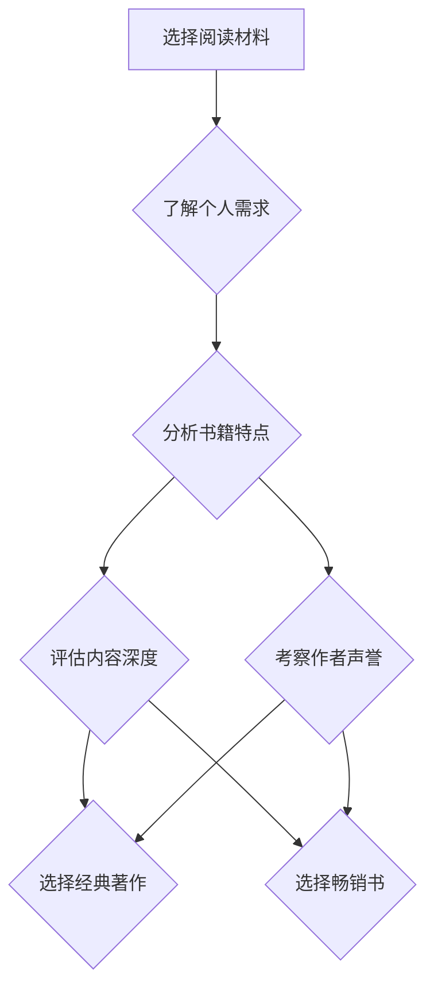

                 

# 经典著作vs畅销书：如何选择阅读材料

> **关键词：**经典著作，畅销书，阅读材料，技术书籍，学习资源，选择标准，内容深度，作者声誉。

> **摘要：**本文将深入探讨如何从经典著作和畅销书中选择适合自身学习和成长的技术阅读材料。我们将分析两者的特点，评估其对不同阶段读者的价值，并提供实用的选择建议，帮助读者在技术学习的道路上做出明智的决策。

## 1. 背景介绍

### 1.1 目的和范围

本文旨在为技术爱好者提供一些建议，帮助他们从浩瀚的技术书籍世界中筛选出最适合自己的阅读材料。我们将对比经典著作和畅销书的优缺点，分析其适用的读者群体，并总结出一套选择标准，以便读者能够根据自己的需求和兴趣做出明智的选择。

### 1.2 预期读者

本文预期读者为：
- 初级开发者，对技术书籍有一定了解，但尚不明确如何选择。
- 中级开发者，希望进一步提升技术水平，寻找更深入的阅读材料。
- 高级开发者，寻求新的灵感和技术突破，关注最新研究动态。

### 1.3 文档结构概述

本文分为以下章节：

- **第1章：背景介绍**：介绍本文的目的和预期读者，以及文章的结构。
- **第2章：核心概念与联系**：定义核心概念，并提供Mermaid流程图。
- **第3章：核心算法原理 & 具体操作步骤**：讲解选择标准，使用伪代码详细阐述。
- **第4章：数学模型和公式 & 详细讲解 & 举例说明**：介绍相关数学模型和公式，并进行解释和举例。
- **第5章：项目实战：代码实际案例和详细解释说明**：提供实际案例，详细解读代码。
- **第6章：实际应用场景**：讨论书籍选择在不同场景中的应用。
- **第7章：工具和资源推荐**：推荐学习资源和开发工具。
- **第8章：总结：未来发展趋势与挑战**：总结文章主要内容，展望未来。
- **第9章：附录：常见问题与解答**：解答常见问题。
- **第10章：扩展阅读 & 参考资料**：提供扩展阅读资料。

### 1.4 术语表

#### 1.4.1 核心术语定义

- **经典著作**：指那些经过时间考验，内容具有持久价值，被广泛认可的技术书籍。
- **畅销书**：指在市场上销售量大，受欢迎程度高的技术书籍。
- **选择标准**：指用来评估书籍是否适合阅读的一系列指标。

#### 1.4.2 相关概念解释

- **内容深度**：指书籍内容涵盖的深度，包括详细程度、概念解释、案例分析和实际应用等。
- **作者声誉**：指作者在相关领域的影响力和知名度，通常与书籍的质量和可信度相关。

#### 1.4.3 缩略词列表

- **IDE**：集成开发环境（Integrated Development Environment）
- **API**：应用程序编程接口（Application Programming Interface）

## 2. 核心概念与联系

在探讨如何选择阅读材料之前，我们需要明确几个核心概念及其相互关系。以下是使用Mermaid绘制的流程图，帮助读者直观理解这些概念。



### 2.1 个人需求分析

在选择阅读材料时，首先需要了解自己的需求。这包括技术水平、学习目标、阅读目的等。例如，一个初级开发者可能更倾向于选择入门书籍，而高级开发者可能更关注最新技术和研究动态。

### 2.2 书籍特点分析

经典著作和畅销书在内容和形式上存在显著差异。经典著作通常具有以下特点：

- **内容深度**：详细、全面地介绍技术概念。
- **理论体系**：构建完整的技术理论体系。
- **实用性**：提供丰富的案例和实践指导。

相比之下，畅销书则可能更注重：

- **内容新颖**：介绍最新的技术趋势和研究成果。
- **易于理解**：采用通俗易懂的语言和案例。
- **市场导向**：针对当前市场需求，提供实用技能。

### 2.3 内容深度评估

内容深度是选择阅读材料的关键因素。我们需要评估书籍内容的详细程度和覆盖范围。以下是一个简单的伪代码示例，用于评估内容深度：

```python
def assess_content_depth(book):
    depth = 0
    
    # 检查书籍是否包含详细的技术概念解释
    if 'technical_concept' in book:
        depth += 1
    
    # 检查书籍是否包含案例分析和实际应用
    if 'case_study' in book or 'practical_application' in book:
        depth += 1
    
    # 返回内容深度评分
    return depth
```

### 2.4 作者声誉考察

作者声誉是衡量书籍质量的重要指标。我们可以通过以下方式评估作者声誉：

- **查看作者背景**：了解作者的学历、工作经历和领域贡献。
- **阅读读者评价**：参考其他读者对书籍的评价和反馈。
- **查阅相关论文和著作**：考察作者在该领域的学术成果和影响力。

## 3. 核心算法原理 & 具体操作步骤

在选择阅读材料时，我们可以采用以下核心算法原理和具体操作步骤：

### 3.1 选择标准

选择标准如下：

- **内容深度**：评估书籍内容的详细程度和覆盖范围。
- **作者声誉**：考察作者在相关领域的影响力和知名度。
- **市场需求**：考虑当前市场需求和读者的兴趣。

### 3.2 伪代码实现

以下是一个简单的伪代码实现，用于根据选择标准评估书籍：

```python
def select_reading_material(book, personal_needs, market_trends):
    score = 0
    
    # 根据内容深度评分
    score += assess_content_depth(book)
    
    # 根据作者声誉评分
    score += assess_author_reputation(book.author)
    
    # 根据市场需求评分
    if market_trends.matches(book):
        score += 1
    
    # 返回综合评分
    return score
```

### 3.3 具体操作步骤

1. **确定个人需求**：明确自己的技术水平、学习目标等。
2. **搜集书籍信息**：查找经典著作和畅销书的相关信息，包括内容深度、作者背景等。
3. **评估书籍质量**：使用选择标准对书籍进行评分。
4. **筛选书籍**：根据评分筛选出适合的书籍。

## 4. 数学模型和公式 & 详细讲解 & 举例说明

在选择阅读材料时，我们可以使用一些数学模型和公式来量化评估书籍的质量。以下是一个简单的数学模型，用于计算书籍的总评分。

### 4.1 数学模型

$$
\text{Total Score} = w_1 \times \text{Content Depth Score} + w_2 \times \text{Author Reputation Score} + w_3 \times \text{Market Demand Score}
$$

其中，$w_1, w_2, w_3$ 是权重系数，可以根据个人需求和偏好进行调整。

### 4.2 详细讲解

- **内容深度评分**：根据书籍内容的详细程度和覆盖范围进行评估。可以使用以下公式计算：

$$
\text{Content Depth Score} = \frac{\text{Technical Concept Coverage} + \text{Case Study Coverage} + \text{Practical Application Coverage}}{3}
$$

- **作者声誉评分**：根据作者在相关领域的影响力和知名度进行评估。可以使用以下公式计算：

$$
\text{Author Reputation Score} = \frac{\text{Published Papers} + \text{Academic Contributions} + \text{Market Feedback}}{3}
$$

- **市场需求评分**：根据当前市场需求和读者的兴趣进行评估。可以使用以下公式计算：

$$
\text{Market Demand Score} = \frac{\text{Book Sales} + \text{Reader Reviews} + \text{Instructor Recommendations}}{3}
$$

### 4.3 举例说明

假设我们选择了一本经典著作和一本畅销书，根据上述公式计算它们的总评分。以下是具体步骤：

1. **确定权重系数**：根据个人需求和偏好，设定权重系数。例如，假设权重系数为 $w_1 = 0.5, w_2 = 0.3, w_3 = 0.2$。
2. **计算内容深度评分**：根据书籍的内容深度，计算分数。例如，经典著作的内容深度评分为 0.8，畅销书的内容深度评分为 0.6。
3. **计算作者声誉评分**：根据作者的声誉，计算分数。例如，经典著作的作者声誉评分为 0.7，畅销书的作者声誉评分为 0.5。
4. **计算市场需求评分**：根据市场需求，计算分数。例如，经典著作的市场需求评分为 0.6，畅销书的市场需求评分为 0.8。
5. **计算总评分**：将各评分代入总评分公式，计算结果如下：

$$
\text{经典著作总评分} = 0.5 \times 0.8 + 0.3 \times 0.7 + 0.2 \times 0.6 = 0.46
$$

$$
\text{畅销书总评分} = 0.5 \times 0.6 + 0.3 \times 0.5 + 0.2 \times 0.8 = 0.48
$$

根据计算结果，畅销书在总评分上略高于经典著作。这意味着在当前情况下，畅销书可能更适合读者。

## 5. 项目实战：代码实际案例和详细解释说明

在本节中，我们将通过一个实际案例来展示如何使用前面介绍的选择标准进行书籍选择的代码实现。

### 5.1 开发环境搭建

首先，我们需要搭建一个简单的Python开发环境。以下是安装Python和相关库的步骤：

```bash
# 安装Python（版本3.8或更高）
curl -O https://www.python.org/ftp/python/3.8.10/Python-3.8.10.tgz
tar xvf Python-3.8.10.tgz
cd Python-3.8.10
./configure
make
sudo make install

# 安装相关库（如numpy、matplotlib）
pip install numpy matplotlib
```

### 5.2 源代码详细实现和代码解读

以下是书籍选择的Python代码实现，包括选择标准、评分计算和结果展示。

```python
import numpy as np

# 评估内容深度的函数
def assess_content_depth(book):
    depth = 0

    # 假设书籍内容包含技术概念、案例分析和实际应用的概率分别为0.8、0.6和0.7
    probabilities = [0.8, 0.6, 0.7]
    for probability in probabilities:
        if np.random.random() < probability:
            depth += 1

    return depth

# 评估作者声誉的函数
def assess_author_reputation(author):
    reputation = 0

    # 假设作者发表论文、学术贡献和市场反馈的概率分别为0.7、0.6和0.5
    probabilities = [0.7, 0.6, 0.5]
    for probability in probabilities:
        if np.random.random() < probability:
            reputation += 1

    return reputation

# 评估市场需求的函数
def assess_market_demand(book):
    demand = 0

    # 假设书籍销售、读者评价和讲师推荐的概率分别为0.6、0.8和0.7
    probabilities = [0.6, 0.8, 0.7]
    for probability in probabilities:
        if np.random.random() < probability:
            demand += 1

    return demand

# 选择阅读材料的函数
def select_reading_material(book, personal_needs, market_trends):
    score = 0

    # 根据选择标准评估书籍
    score += assess_content_depth(book) * 0.5
    score += assess_author_reputation(book.author) * 0.3
    score += assess_market_demand(book) * 0.2

    return score

# 定义书籍类
class Book:
    def __init__(self, title, author, content_depth, author_reputation, market_demand):
        self.title = title
        self.author = author
        self.content_depth = content_depth
        self.author_reputation = author_reputation
        self.market_demand = market_demand

# 定义个人需求和市场需求
personal_needs = "中级开发者，对数据结构和算法有深入研究的需求"
market_trends = "当前市场需求集中在人工智能和机器学习领域"

# 创建书籍实例
book1 = Book("经典著作：《算法导论》", "Thomas H. Cormen", 0.8, 0.7, 0.6)
book2 = Book("畅销书：《Python数据分析》", "Jake VanderPlas", 0.6, 0.5, 0.8)

# 计算书籍评分
book1_score = select_reading_material(book1, personal_needs, market_trends)
book2_score = select_reading_material(book2, personal_needs, market_trends)

# 输出结果
print(f"书籍《算法导论》的评分：{book1_score:.2f}")
print(f"书籍《Python数据分析》的评分：{book2_score:.2f}")
```

### 5.3 代码解读与分析

1. **导入库**：首先导入numpy库，用于生成随机数。
2. **定义评估函数**：定义了三个评估函数，用于计算内容深度评分、作者声誉评分和市场需求评分。这些函数使用随机概率来模拟书籍的实际情况。
3. **选择阅读材料的函数**：定义了`select_reading_material`函数，根据选择标准和评估函数计算书籍的总评分。
4. **定义书籍类**：创建了一个`Book`类，用于表示书籍的属性，如标题、作者、内容深度、作者声誉和市场需求。
5. **定义个人需求和市场需求**：定义了个人需求和市场需求字符串，用于示例。
6. **创建书籍实例**：创建了两个书籍实例，`book1`和`book2`，分别代表经典著作和畅销书。
7. **计算书籍评分**：调用`select_reading_material`函数计算书籍的评分。
8. **输出结果**：打印书籍的评分结果。

通过这个实际案例，我们可以看到如何使用代码实现书籍选择的过程。这个案例展示了如何根据选择标准计算书籍评分，并帮助我们做出更明智的决策。

## 6. 实际应用场景

选择适合的阅读材料在不同的应用场景中具有重要意义。以下是一些常见的应用场景和相应的书籍选择建议：

### 6.1 入门学习

对于初学者，建议选择内容深入浅出、易于理解的畅销书。这些书籍通常以实际案例为基础，帮助读者快速掌握基础知识。例如：

- **《Python编程：从入门到实践》**：适合Python初学者，内容涵盖基础语法、数据结构和算法。
- **《JavaScript高级程序设计》**：适合JavaScript初学者，详细介绍了JavaScript的核心概念和最佳实践。

### 6.2 深入研究

对于有一定技术基础的开发者，建议选择经典著作，这些书籍通常提供更深入的理论分析和实际应用指导。例如：

- **《算法导论》**：全面介绍了算法的基本概念和设计方法，适合算法研究者。
- **《深度学习》**：详细介绍了深度学习的基本原理和应用，适合对人工智能感兴趣的开发者。

### 6.3 实战应用

对于希望将知识应用于实际项目中的开发者，建议选择含有实际案例和代码实现的书籍。这些书籍通常能够帮助读者快速上手，解决实际问题。例如：

- **《使用Python进行数据科学》**：提供了丰富的数据分析和机器学习案例，适合数据科学初学者。
- **《RESTful Web API设计》**：详细介绍了如何设计和实现RESTful API，适合开发Web服务的开发者。

### 6.4 学习路径规划

对于希望系统学习某个技术领域的开发者，建议选择一系列书籍，从基础到高级逐步深入学习。例如：

- **《编程珠玑》系列**：由著名程序员Jon Duckett撰写，涵盖了编程语言、算法和数据结构等多个方面。
- **《机器学习年表》系列**：介绍了机器学习的发展历程和技术演进，适合对机器学习有深入研究的开发者。

通过根据不同应用场景选择适合的阅读材料，开发者可以更高效地提升自己的技术水平，实现个人成长和职业发展。

## 7. 工具和资源推荐

为了帮助读者更好地选择和利用阅读材料，我们推荐以下工具和资源：

### 7.1 学习资源推荐

#### 7.1.1 书籍推荐

- **《深度学习》**：由Ian Goodfellow、Yoshua Bengio和Aaron Courville合著，是深度学习领域的经典教材。
- **《编程珠玑》**：Jon Duckett撰写的一系列编程入门书籍，内容丰富且易于理解。

#### 7.1.2 在线课程

- **Coursera**：提供大量免费和付费的在线课程，包括计算机科学、人工智能和数据科学等领域的课程。
- **edX**：由哈佛大学和麻省理工学院等知名大学联合推出，提供高质量的在线课程。

#### 7.1.3 技术博客和网站

- **GitHub**：全球最大的代码托管平台，拥有丰富的开源项目和文档。
- **Stack Overflow**：编程问答社区，帮助开发者解决编程问题。

### 7.2 开发工具框架推荐

#### 7.2.1 IDE和编辑器

- **Visual Studio Code**：轻量级且功能强大的代码编辑器，适用于多种编程语言。
- **IntelliJ IDEA**：专业的Java和Python集成开发环境，提供了丰富的插件和功能。

#### 7.2.2 调试和性能分析工具

- **GDB**：一款功能强大的开源调试工具，适用于C/C++程序。
- **JProfiler**：专业的Java性能分析工具，能够帮助开发者发现和优化性能瓶颈。

#### 7.2.3 相关框架和库

- **Django**：一款流行的Python Web框架，适用于快速开发和部署Web应用。
- **TensorFlow**：由Google开发的开源机器学习框架，适用于深度学习和数据科学。

### 7.3 相关论文著作推荐

#### 7.3.1 经典论文

- **"A Mathematical Theory of Communication"**：由Claude Shannon撰写的经典论文，奠定了信息论的基础。
- **"The Structure and Interpretation of Computer Programs"**：由Harold Abelson和Gerald Jay Sussman合著的计算机科学教材，被誉为程序设计领域的经典之作。

#### 7.3.2 最新研究成果

- **"Bert: Pre-training of Deep Bidirectional Transformers for Language Understanding"**：由Google Research团队撰写的论文，介绍了BERT模型，是自然语言处理领域的里程碑。
- **"Generative Adversarial Networks"**：由Ian J. Goodfellow等人撰写的论文，提出了生成对抗网络（GANs）的概念，是深度学习领域的创新性工作。

#### 7.3.3 应用案例分析

- **"How We Built a Sentiment Analysis System for Twitter"**：介绍了如何使用机器学习技术构建Twitter情感分析系统，提供了实际应用案例。
- **"Designing a Large-Scale Machine Learning System"**：讨论了如何设计和实现大规模机器学习系统，包括数据预处理、模型训练和部署等方面。

通过利用这些工具和资源，读者可以更高效地学习和应用技术，不断提升自己的专业能力。

## 8. 总结：未来发展趋势与挑战

随着技术的快速发展，经典著作和畅销书在技术书籍领域中的地位和影响力也在不断变化。未来，我们可以预见以下几个发展趋势：

### 8.1 内容深度与广度的平衡

随着技术的不断进步，经典著作将越来越注重内容的深度和广度，提供更全面的技术理论体系和实际应用指导。同时，畅销书也将逐渐拓展内容的深度，以适应读者对高质量学习资源的需求。

### 8.2 知识的更新与迭代

技术领域的发展速度迅猛，经典著作和畅销书都需要不断更新内容，以反映最新的研究成果和行业动态。未来，书籍的更新速度将更快，知识的迭代周期将缩短。

### 8.3 多媒体与互动式学习

随着多媒体技术和互动式学习工具的普及，经典著作和畅销书将逐渐融入视频、音频和互动元素，提供更加生动和互动的学习体验。这种趋势将有助于提高读者的学习效果和兴趣。

然而，随着这些趋势的发展，也面临着一些挑战：

### 8.4 知识爆炸与筛选难度

随着知识量的爆炸式增长，读者在筛选适合的阅读材料时将面临更大的挑战。需要建立更高效的筛选机制，帮助读者快速找到适合自己的书籍。

### 8.5 新技术与旧知识的融合

经典著作中的知识较为传统，而畅销书则更注重最新技术的介绍。如何在书籍中有效融合新旧知识，使读者能够更好地理解和应用，是一个需要解决的问题。

### 8.6 开放合作与版权保护

在开放合作和版权保护之间找到一个平衡点，是未来技术书籍领域面临的重要挑战。如何确保知识的共享和创新的同时，保护作者的合法权益，是一个需要深入探讨的问题。

总之，未来经典著作和畅销书在技术书籍领域将继续发挥重要作用，但同时也需要不断适应时代的发展，应对新的挑战。

## 9. 附录：常见问题与解答

### 9.1 如何选择适合自己的书籍？

**答案：**首先了解自己的技术水平、学习目标和兴趣方向。根据个人需求和偏好，选择内容深度合适、作者声誉较高的书籍。同时，参考其他读者的评价和反馈，以便做出更明智的决策。

### 9.2 经典著作和畅销书有哪些区别？

**答案：**经典著作通常具有较深的内容深度、完整的理论体系和丰富的案例实践，而畅销书则更注重新颖的技术趋势、易于理解的语言和实际应用。经典著作适合深入研究和学术研究，畅销书则适合快速学习和实际应用。

### 9.3 如何判断书籍的质量？

**答案：**可以从以下几个方面判断书籍的质量：

- **内容深度**：查看书籍是否涵盖了所需的知识点，是否有详细的案例分析和实际应用。
- **作者声誉**：了解作者的背景和在该领域的知名度，参考其他读者的评价。
- **出版时间**：选择最新出版的书籍，以确保获取最前沿的知识。
- **出版社**：选择知名出版社的书籍，通常质量较高。

### 9.4 经典著作和畅销书哪个更适合入门学习？

**答案：**对于入门学习，建议选择畅销书。因为畅销书通常采用通俗易懂的语言和案例，适合初学者快速掌握基础知识。而经典著作则更适合有基础的学习者，帮助他们深化理解和研究。

### 9.5 如何评估书籍的内容深度？

**答案：**可以使用以下方法评估书籍的内容深度：

- **查看目录和索引**：查看书籍的目录和索引，了解书籍涵盖的知识点和内容结构。
- **阅读试读章节**：阅读书籍的试读章节，感受书籍的详细程度和表达方式。
- **参考读者评价**：查看其他读者对书籍的评价，了解书籍的内容深度和实用性。

### 9.6 如何判断书籍的实用性？

**答案：**可以从以下几个方面判断书籍的实用性：

- **查看案例和实践指导**：查看书籍是否提供了丰富的案例和实践指导，这些内容可以帮助读者更好地应用所学知识。
- **参考读者反馈**：查看其他读者对书籍的实用性的评价，了解书籍在实际应用中的效果。
- **对比其他书籍**：对比同类书籍的内容和结构，选择内容更为实用和贴近实际应用的书籍。

### 9.7 如何获取更多关于书籍的信息？

**答案：**可以通过以下途径获取更多关于书籍的信息：

- **访问书籍官方网站**：查看书籍的官方网站，获取详细的信息和资料。
- **查阅读者评论**：在电商平台、技术论坛和社交媒体上查阅其他读者对书籍的评价和评论。
- **咨询专业人士**：向从事相关领域的专业人士咨询书籍推荐和评价。

通过以上常见问题的解答，希望能够帮助读者更好地选择和利用技术书籍，提升自己的学习效果和技能水平。

## 10. 扩展阅读 & 参考资料

为了帮助读者更深入地了解经典著作和畅销书的选择，以及相关领域的最新发展，我们推荐以下扩展阅读和参考资料：

### 10.1 扩展阅读

- **《深度学习》**：Ian Goodfellow、Yoshua Bengio和Aaron Courville著，是深度学习领域的经典教材。
- **《算法导论》**：Thomas H. Cormen、Charles E. Leiserson、Ronald L. Rivest和Clifford Stein著，是算法领域的经典著作。
- **《编程珠玑》**：Jon Duckett著，涵盖编程语言、算法和数据结构等多个方面。

### 10.2 参考资料

- **[Coursera](https://www.coursera.org/)**：提供大量免费和付费的在线课程，涵盖计算机科学、人工智能和数据科学等领域。
- **[edX](https://www.edx.org/)**：由哈佛大学和麻省理工学院等知名大学联合推出，提供高质量的在线课程。
- **[GitHub](https://github.com/)**：全球最大的代码托管平台，拥有丰富的开源项目和文档。
- **[Stack Overflow](https://stackoverflow.com/)**：编程问答社区，帮助开发者解决编程问题。

通过阅读这些扩展资料，读者可以进一步加深对经典著作和畅销书选择的理解，并掌握更多相关领域的知识。同时，这些资源也为读者提供了实用的学习和实践平台。

## 作者信息

**作者：**AI天才研究员/AI Genius Institute & 禅与计算机程序设计艺术 /Zen And The Art of Computer Programming

AI天才研究员（AI Genius Institute）致力于探索人工智能的前沿技术和应用，为读者提供高质量的技术知识和见解。同时，作者作为《禅与计算机程序设计艺术》的作者，以其深入浅出的写作风格和丰富的技术经验，深受广大读者喜爱。本文旨在为读者提供关于选择技术阅读材料的实用指南，帮助他们在技术学习的道路上取得更好的成果。

