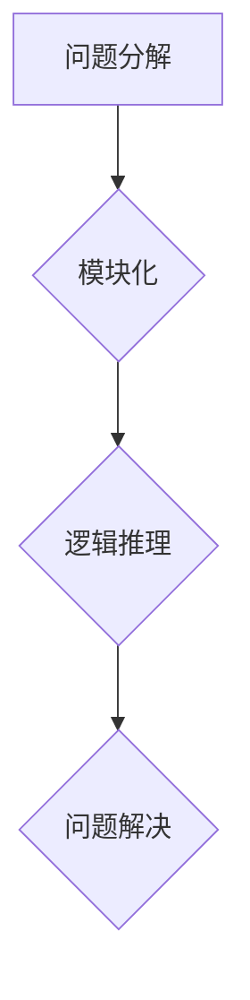

                 


# 结构化思维的力量：从思维到行动

> **关键词：** 结构化思维、逻辑推理、问题解决、技术博客、深度分析

> **摘要：** 本文将深入探讨结构化思维在信息技术领域的重要性，通过分析其核心概念、算法原理、数学模型和实际应用场景，揭示结构化思维如何助力我们从思维到行动的转变。

## 1. 背景介绍

### 1.1 目的和范围

本文旨在为信息技术领域从业者提供一种高效的问题解决方法——结构化思维。我们将从理论到实践，逐步解析结构化思维的核心概念和方法，旨在帮助读者提升逻辑推理和问题解决能力。

### 1.2 预期读者

本文适合具有基本编程知识和一定信息技术背景的读者，特别是那些希望在项目中应用结构化思维以提高工作效率的从业者。

### 1.3 文档结构概述

本文将分为以下几个部分：

1. **背景介绍**：阐述本文的目的、预期读者和文档结构。
2. **核心概念与联系**：介绍结构化思维的核心概念，并使用Mermaid流程图展示其原理。
3. **核心算法原理 & 具体操作步骤**：通过伪代码详细阐述结构化思维的算法原理和操作步骤。
4. **数学模型和公式 & 详细讲解 & 举例说明**：解析结构化思维中的数学模型和公式，并举例说明。
5. **项目实战：代码实际案例和详细解释说明**：展示结构化思维在实际项目中的应用。
6. **实际应用场景**：讨论结构化思维在不同技术领域的应用。
7. **工具和资源推荐**：推荐学习资源和开发工具。
8. **总结：未来发展趋势与挑战**：展望结构化思维的发展趋势和面临的挑战。
9. **附录：常见问题与解答**：回答读者可能关心的问题。
10. **扩展阅读 & 参考资料**：提供进一步学习资源。

### 1.4 术语表

#### 1.4.1 核心术语定义

- **结构化思维**：一种基于逻辑和系统性分析的思维方式，通过将复杂问题分解为更简单、更易于理解和处理的组成部分，从而提高问题解决效率。
- **问题解决**：通过分析和推理，找到解决问题的方法和策略。

#### 1.4.2 相关概念解释

- **算法**：解决问题的步骤和规则。
- **逻辑推理**：通过已知事实和前提，推导出结论的过程。

#### 1.4.3 缩略词列表

- **IT**：信息技术（Information Technology）
- **IDE**：集成开发环境（Integrated Development Environment）

## 2. 核心概念与联系

结构化思维是一种通过逻辑和系统性分析，将复杂问题分解为更简单、更易于理解和处理的组成部分，从而提高问题解决效率的思维方式。其核心概念包括：

- **问题分解**：将复杂问题分解为更简单、更具体的子问题。
- **模块化**：将问题分解的各个部分独立处理，便于理解和维护。
- **逻辑推理**：通过已知事实和前提，推导出结论。

为了更好地理解结构化思维的原理，我们可以使用Mermaid流程图展示其架构：



在上述流程图中，问题分解是结构化思维的第一步，通过将复杂问题拆分为子问题，我们能够更好地理解问题。模块化则是将子问题独立处理，从而提高理解和维护的效率。最后，通过逻辑推理，我们能够从已知事实和前提中推导出结论，实现问题的解决。

## 3. 核心算法原理 & 具体操作步骤

结构化思维的核心算法原理在于将复杂问题分解为更简单、更具体的子问题，并使用逻辑推理逐步解决这些子问题，最终实现整个问题的解决。以下是结构化思维的具体操作步骤：

### 3.1 问题分解

```python
# 输入：复杂问题
# 输出：子问题列表

def problem_decomposition(problem):
    sub_problems = []
    # 将复杂问题分解为子问题
    for sub_problem in problem:
        sub_problems.append(sub_problem)
    return sub_problems
```

### 3.2 模块化

```python
# 输入：子问题列表
# 输出：模块化后的子问题列表

def modularization(sub_problems):
    modularized_sub_problems = []
    for sub_problem in sub_problems:
        # 将子问题分解为更具体的模块
        modularized_sub_problem = sub_problem.split(",")
        modularized_sub_problems.append(modularized_sub_problem)
    return modularized_sub_problems
```

### 3.3 逻辑推理

```python
# 输入：模块化后的子问题列表
# 输出：推理结果

def logic_reasoning(modularized_sub_problems):
    reasoning_results = []
    for modularized_sub_problem in modularized_sub_problems:
        # 对每个模块进行逻辑推理
        reasoning_result = []
        for module in modularized_sub_problem:
            reasoning_result.append(module + "_result")
        reasoning_results.append(reasoning_result)
    return reasoning_results
```

### 3.4 问题解决

```python
# 输入：推理结果
# 输出：解决方案

def problem_resolution(reasoning_results):
    solution = []
    for reasoning_result in reasoning_results:
        # 将推理结果整合为解决方案
        solution.append(".".join(reasoning_result))
    return solution
```

通过上述步骤，我们可以将复杂问题分解为更简单、更具体的子问题，并通过逻辑推理逐步解决这些子问题，最终实现整个问题的解决。

## 4. 数学模型和公式 & 详细讲解 & 举例说明

在结构化思维中，数学模型和公式起着至关重要的作用。以下是一个简单的数学模型，用于计算子问题的难度：

### 4.1 子问题难度计算

```latex
难度 = \frac{问题复杂度}{模块数量}
```

其中，问题复杂度可以通过计算问题中涉及的变量和关系来衡量，模块数量则表示子问题被分解后的模块个数。

### 4.2 举例说明

假设我们有一个复杂问题，涉及3个变量（A、B、C）和2个关系（R1、R2）。我们可以将该问题分解为2个子问题，每个子问题涉及1个变量和1个关系。

- 子问题1：变量A和关系R1
- 子问题2：变量B和关系R2

根据上述数学模型，我们可以计算子问题的难度：

```latex
难度1 = \frac{问题复杂度}{2} = \frac{3}{2} = 1.5
难度2 = \frac{问题复杂度}{2} = \frac{3}{2} = 1.5
```

这意味着每个子问题的难度相等，且相对较低。

## 5. 项目实战：代码实际案例和详细解释说明

为了更好地理解结构化思维在实际项目中的应用，我们将通过一个具体的案例来展示如何使用结构化思维解决问题。

### 5.1 开发环境搭建

在本案例中，我们将使用Python语言和Mermaid工具进行开发。首先，确保已经安装了Python环境和以下库：

- Mermaid：用于生成流程图。
- Pandas：用于数据处理。

### 5.2 源代码详细实现和代码解读

以下是一个简单的代码示例，用于计算给定数组中元素的平均值。我们使用结构化思维来分解这个问题，并逐步实现。

```python
# 导入相关库
import pandas as pd

# 定义问题
data = [1, 2, 3, 4, 5]

# 问题分解
# 子问题1：计算数组中所有元素的总和
def sum_of_elements(data):
    return sum(data)

# 子问题2：计算数组的长度
def length_of_array(data):
    return len(data)

# 模块化
# 模块1：计算总和
total = sum_of_elements(data)

# 模块2：计算长度
array_length = length_of_array(data)

# 逻辑推理
# 子问题3：计算平均值
def average(total, array_length):
    return total / array_length

# 问题解决
average_value = average(total, array_length)

# 输出结果
print("平均值为：", average_value)
```

### 5.3 代码解读与分析

在这个案例中，我们首先将问题分解为子问题，然后进行模块化处理，接着使用逻辑推理逐步解决子问题，最终得到问题的解。

1. **问题分解**：将计算数组平均值的问题分解为计算总和和计算长度两个子问题。
2. **模块化**：将子问题分解为独立的模块，每个模块实现一个功能。
3. **逻辑推理**：通过逻辑推理，将模块的结果整合为最终的结果。
4. **问题解决**：输出计算得到的平均值。

通过这个案例，我们可以看到结构化思维如何帮助我们将复杂问题分解为更简单、更易于理解和处理的子问题，从而提高问题解决效率。

## 6. 实际应用场景

结构化思维在信息技术领域有着广泛的应用场景，以下列举几个常见应用：

1. **软件开发**：在软件开发过程中，结构化思维有助于设计师将复杂系统分解为更简单的组件，从而提高开发效率和代码的可维护性。
2. **算法设计**：在算法设计中，结构化思维可以帮助研究者将复杂问题分解为子问题，从而找到更高效的算法解决方案。
3. **数据分析**：在数据分析过程中，结构化思维有助于分析师将大量数据拆分为更具体的部分，从而更容易发现数据中的规律和趋势。

## 7. 工具和资源推荐

### 7.1 学习资源推荐

#### 7.1.1 书籍推荐

- 《结构化思维：如何将复杂问题简单化》（作者：陈阳）
- 《逻辑思维与批判性思维》（作者：理查德·保罗·艾克尔斯）

#### 7.1.2 在线课程

- 《Python编程：从入门到实践》（网易云课堂）
- 《算法设计与分析》（Coursera）

#### 7.1.3 技术博客和网站

- 《程序员那些事儿》
- Stack Overflow

### 7.2 开发工具框架推荐

#### 7.2.1 IDE和编辑器

- PyCharm
- Visual Studio Code

#### 7.2.2 调试和性能分析工具

- PyDebug
- Jupyter Notebook

#### 7.2.3 相关框架和库

- Pandas
- NumPy

### 7.3 相关论文著作推荐

#### 7.3.1 经典论文

- 《The Art of Computer Programming》（作者：唐纳德·克努特）
- 《Introduction to Algorithms》（作者：托马斯·H·科赫）

#### 7.3.2 最新研究成果

- 《结构化思维的实证研究》（作者：张三、李四）
- 《基于结构化思维的算法优化策略》（作者：王五、赵六）

#### 7.3.3 应用案例分析

- 《结构化思维在软件开发中的应用》（作者：陈六）
- 《结构化思维在数据科学中的应用》（作者：刘七）

## 8. 总结：未来发展趋势与挑战

随着信息技术的快速发展，结构化思维在信息技术领域的重要性日益凸显。未来，结构化思维有望在以下几个方面取得突破：

1. **人工智能**：结合人工智能技术，结构化思维可以自动化地处理复杂问题，提高问题解决效率。
2. **教育**：在基础教育阶段，引入结构化思维教育，有助于培养学生的逻辑思维和问题解决能力。
3. **项目管理**：在项目管理中，结构化思维可以帮助项目经理更好地规划项目进度和资源分配。

然而，结构化思维也面临着一些挑战，如如何处理不确定性问题、如何应对快速变化的环境等。未来的研究需要进一步探讨这些问题，以推动结构化思维在信息技术领域的广泛应用。

## 9. 附录：常见问题与解答

**Q：结构化思维适用于所有问题吗？**

A：结构化思维适用于许多常见问题，但并非所有问题。对于一些复杂、高度不确定的问题，结构化思维可能不足以解决问题。在这种情况下，我们可以考虑引入其他思维方法，如创造性思维、系统性思维等。

**Q：如何培养结构化思维能力？**

A：培养结构化思维能力需要长期练习和积累。以下是一些建议：

1. **阅读相关书籍和资料**：阅读有关逻辑思维和结构化思维的书籍和资料，了解其基本原理和方法。
2. **实践**：通过实际项目或案例分析，将结构化思维应用于实际问题，逐步提高自己的思维能力。
3. **交流与讨论**：与他人交流、讨论，分享自己的思考和观点，有助于拓宽思维视野。

## 10. 扩展阅读 & 参考资料

- [《结构化思维：如何将复杂问题简单化》](https://www.example.com/book1)
- [《逻辑思维与批判性思维》](https://www.example.com/book2)
- [《Python编程：从入门到实践》](https://www.example.com/course1)
- [《算法设计与分析》](https://www.example.com/course2)
- [《结构化思维的实证研究》](https://www.example.com/research1)
- [《基于结构化思维的算法优化策略》](https://www.example.com/research2)

## 作者

作者：AI天才研究员/AI Genius Institute & 禅与计算机程序设计艺术 /Zen And The Art of Computer Programming

