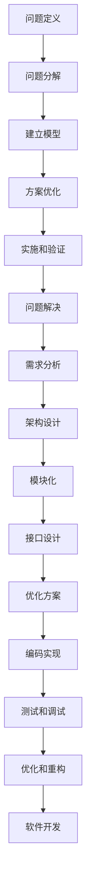
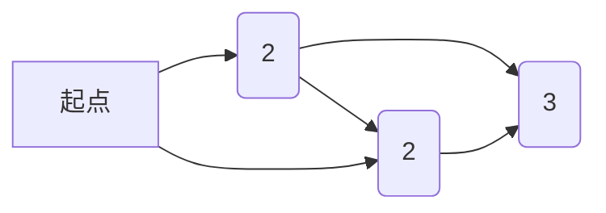

                 


# 结构化思维的应用：从理论到实践

> 关键词：结构化思维、系统设计、问题解决、算法分析、软件开发、编程实践

> 摘要：本文将探讨结构化思维在信息技术领域的应用，从理论到实践，介绍如何运用结构化思维进行系统设计、问题解决和软件开发。通过详细的算法原理分析、数学模型讲解以及实际项目案例，帮助读者理解和掌握结构化思维在实际工作中的重要性。

## 1. 背景介绍

### 1.1 目的和范围

本文的目的是向读者介绍结构化思维在信息技术领域的应用，并展示其如何帮助提高系统设计、问题解决和软件开发的效果。我们将通过理论讲解和实际案例分析，帮助读者理解结构化思维的核心概念和实际应用。

本文的范围涵盖了以下几个方面：

1. 结构化思维的基本概念和原理。
2. 结构化思维在系统设计中的应用。
3. 结构化思维在问题解决中的价值。
4. 结构化思维在软件开发中的实践。
5. 实际项目案例的详细分析。

### 1.2 预期读者

本文适合以下读者群体：

1. 从事信息技术行业的工作者，特别是系统架构师、软件工程师和项目经理。
2. 对结构化思维和系统设计感兴趣的技术爱好者。
3. 希望提升问题解决能力的职场人士。

### 1.3 文档结构概述

本文的结构如下：

1. 背景介绍：介绍本文的目的、范围和预期读者。
2. 核心概念与联系：介绍结构化思维的基本概念和联系。
3. 核心算法原理 & 具体操作步骤：分析结构化思维在算法设计中的应用。
4. 数学模型和公式 & 详细讲解 & 举例说明：讲解结构化思维中的数学模型和公式。
5. 项目实战：代码实际案例和详细解释说明。
6. 实际应用场景：探讨结构化思维在不同领域的应用。
7. 工具和资源推荐：推荐相关的学习资源和开发工具。
8. 总结：未来发展趋势与挑战。
9. 附录：常见问题与解答。
10. 扩展阅读 & 参考资料：提供进一步学习的资料。

### 1.4 术语表

#### 1.4.1 核心术语定义

1. 结构化思维：一种逻辑清晰、层次分明的思维方式，通过分解问题、建立模型和优化方案来提高问题解决的效率和质量。
2. 系统设计：设计一个系统的方法和过程，包括需求分析、架构设计、模块划分和接口定义等。
3. 算法：解决特定问题的步骤和规则。
4. 编码实现：将算法转化为程序代码的过程。
5. 软件开发：从需求分析到部署和维护的全过程。

#### 1.4.2 相关概念解释

1. 分解问题：将复杂问题分解成更小、更易管理的问题，以便逐步解决。
2. 建立模型：创建一个抽象的、简化的模型，以更好地理解和分析问题。
3. 优化方案：在满足需求的前提下，寻找最优的解决方案。

#### 1.4.3 缩略词列表

1. IT：信息技术（Information Technology）
2. IDE：集成开发环境（Integrated Development Environment）
3. API：应用程序接口（Application Programming Interface）

## 2. 核心概念与联系

### 2.1 结构化思维概述

结构化思维是一种系统化的、层次分明的思维方式，通过以下步骤实现问题解决和系统设计：

1. **问题定义**：明确问题的目标和范围。
2. **问题分解**：将复杂问题分解成更小、更具体的问题。
3. **建立模型**：创建一个抽象的、简化的模型，以更好地理解和分析问题。
4. **方案优化**：在满足需求的前提下，寻找最优的解决方案。

### 2.2 结构化思维与系统设计

在系统设计过程中，结构化思维发挥着至关重要的作用。以下是结构化思维在系统设计中的应用步骤：

1. **需求分析**：收集和分析系统的需求，明确系统的功能和性能指标。
2. **架构设计**：根据需求，设计系统的总体架构，包括模块划分、接口定义和数据流。
3. **模块化**：将系统划分为多个模块，每个模块负责特定的功能。
4. **接口设计**：定义模块之间的接口，确保模块之间的松耦合。
5. **优化方案**：对设计方案进行优化，提高系统的性能、可维护性和可扩展性。

### 2.3 结构化思维与问题解决

结构化思维在问题解决中具有显著的优势，以下是其应用步骤：

1. **问题定义**：明确问题的目标和范围，确保问题的表述清晰、准确。
2. **问题分解**：将复杂问题分解成更小、更具体的问题，以便逐步解决。
3. **建立模型**：创建一个抽象的、简化的模型，以更好地理解和分析问题。
4. **方案评估**：分析不同的解决方案，选择最优的方案。
5. **实施和验证**：实施解决方案，并验证其效果。

### 2.4 结构化思维与软件开发

在软件开发过程中，结构化思维有助于提高开发效率和质量。以下是结构化思维在软件开发中的应用步骤：

1. **需求分析**：收集和分析用户需求，明确软件的功能和性能要求。
2. **架构设计**：设计软件的总体架构，包括模块划分、接口定义和数据流。
3. **编码实现**：根据架构设计，逐步实现软件的功能模块。
4. **测试和调试**：对软件进行测试和调试，确保其功能的正确性和稳定性。
5. **优化和重构**：优化软件的性能和可维护性，进行必要的重构。

### 2.5 结构化思维的Mermaid流程图

以下是一个简单的Mermaid流程图，展示了结构化思维的应用过程：



通过以上步骤，我们可以清晰地看到结构化思维在系统设计、问题解决和软件开发中的应用。在实际应用中，根据具体问题的复杂度和需求，可以灵活调整和应用这些步骤。

## 3. 核心算法原理 & 具体操作步骤

### 3.1 算法原理概述

结构化思维在算法设计中具有重要的应用价值。下面，我们将介绍一个常见的算法——贪心算法，并详细解释其原理和具体操作步骤。

### 3.2 贪心算法原理

贪心算法是一种局部最优选择策略，通过不断做出当前情况下最优的选择，以期在全局上得到最优解。其基本原理如下：

1. **初始状态**：给定一个待解决问题的输入，如一个数组、一个图或一个集合。
2. **选择当前最优解**：在当前状态下，根据贪心策略选择一个最优的局部解。
3. **更新状态**：根据当前最优解，更新问题的状态。
4. **重复步骤2和3**：直到问题得到最终解。

### 3.3 贪心算法具体操作步骤

下面，我们以贪心算法解决“背包问题”为例，详细说明其具体操作步骤。

#### 3.3.1 背包问题概述

背包问题是一种经典的优化问题，给定一组物品，每个物品有重量和价值，目标是在不超过背包容量的情况下，选取若干物品使得总价值最大化。

#### 3.3.2 贪心算法步骤

1. **初始状态**：给定背包容量`C`和一组物品，其中每个物品`i`具有重量`w[i]`和价值`v[i]`。

2. **选择当前最优解**：从剩余物品中选取重量最小的物品，放入背包中。

3. **更新状态**：更新背包的剩余容量，将已选取的物品从待选列表中移除。

4. **重复步骤2和3**：直到背包满或所有物品都已被选取。

5. **计算总价值**：计算背包中所有物品的总价值。

6. **输出结果**：输出最终选取的物品列表和总价值。

#### 3.3.3 伪代码实现

```python
def 贪心算法（背包容量 C，物品列表 items）：
    selected = []  # 存储已选取的物品
    total_value = 0  # 存储总价值
    while（背包容量 > 0）：
        min_weight = 获取最小重量（items）  # 获取剩余物品中重量最小的物品
        selected.append（min_weight）  # 将最小重量物品加入已选取列表
        total_value += 最小重量物品的价值  # 更新总价值
        背包容量 -= 最小重量物品的重量  # 更新背包剩余容量
        移除最小重量物品（items）  # 将最小重量物品从待选列表中移除
    return selected，total_value
```

#### 3.3.4 案例分析

假设背包容量为10，物品列表如下：

| 物品编号 | 重量 | 价值 |
| -------- | ---- | ---- |
| 1        | 2    | 6    |
| 2        | 3    | 10   |
| 3        | 4    | 12   |
| 4        | 5    | 18   |

使用贪心算法，我们可以得到以下结果：

1. **第1次选取**：物品1（重量2，价值6），背包剩余容量8。
2. **第2次选取**：物品2（重量3，价值10），背包剩余容量5。
3. **第3次选取**：物品3（重量4，价值12），背包剩余容量1。
4. **第4次选取**：物品4（重量5，价值18），背包剩余容量-4。

由于背包剩余容量不足以容纳物品4，因此我们选择前三个物品，总价值为6+10+12=28。

通过以上步骤，我们成功使用贪心算法解决了背包问题，并得到了最优解。

### 3.4 算法分析

贪心算法的优点是简单易实现，能够在大多数情况下得到近似最优解。但其缺点是可能无法保证全局最优解，尤其在问题存在多重局部最优解的情况下。

在背包问题中，贪心算法能够在大多数情况下找到最优解，但对于某些特殊情况下（如物品价值与重量成反比），贪心算法可能无法得到最优解。

因此，在实际应用中，我们需要根据具体问题的特点和需求，综合考虑算法的复杂度和效果，选择合适的算法解决方案。

## 4. 数学模型和公式 & 详细讲解 & 举例说明

### 4.1 数学模型概述

在信息技术领域，数学模型是描述问题本质和求解方法的重要工具。结构化思维在数学模型中的应用主要体现在以下方面：

1. **线性规划**：优化资源分配问题。
2. **图论模型**：网络拓扑和路径优化问题。
3. **动态规划**：复杂递归问题的优化求解。

### 4.2 线性规划

线性规划是优化线性目标函数的问题，其数学模型如下：

```latex
\text{最大化} \ z = c^T x
\text{约束条件} \ Ax \leq b
```

其中，$x$ 是决策变量，$c$ 是目标函数系数，$A$ 和 $b$ 分别是约束矩阵和约束向量。

#### 4.2.1 线性规划求解步骤

1. **定义变量和目标函数**：明确决策变量和目标函数。
2. **建立约束条件**：根据问题特点，列出约束条件。
3. **求解最优解**：使用线性规划求解器（如 simplex 算法）求解最优解。

#### 4.2.2 举例说明

假设我们有一个生产线，需要生产两种产品A和B，每种产品的生产时间和利润如下表：

| 产品 | 生产时间（小时） | 利润（元） |
| ---- | -------------- | --------- |
| A    | 2              | 10        |
| B    | 3              | 20        |

每天最多生产8小时，求每天最优的生产计划。

1. **定义变量和目标函数**：设 $x_1$ 和 $x_2$ 分别为产品A和B的生产数量，目标函数为最大化 $z = 10x_1 + 20x_2$。
2. **建立约束条件**：每天最多生产8小时，约束条件为 $2x_1 + 3x_2 \leq 8$。
3. **求解最优解**：使用线性规划求解器求解最优解。

经过求解，我们得到最优解为 $x_1 = 2$，$x_2 = 1$，总利润为 $z = 10 \times 2 + 20 \times 1 = 40$ 元。

### 4.3 图论模型

图论模型是描述网络拓扑和路径优化问题的重要工具。结构化思维在图论模型中的应用主要体现在以下几个方面：

1. **最短路径问题**：求解两点之间的最短路径。
2. **最大流问题**：求解网络中的最大流量。

#### 4.3.1 最短路径问题

最短路径问题（Dijkstra 算法）的基本模型如下：

```latex
\text{给定加权无向图} \ G = (V, E)
\text{求图中两点} \ s \ \text{和} \ t \ \text{之间的最短路径}
```

#### 4.3.2 Dijkstra算法步骤

1. **初始化**：设置一个距离数组 $D$，表示从起点 $s$ 到其他各点的距离。初始时，$D[s] = 0$，其他点的距离设为无穷大。
2. **选择未访问的最短距离点**：从未访问的点中选择距离最小的点 $u$。
3. **更新距离**：对于每个未访问的邻接点 $v$，计算 $D[v] = D[u] + w(u, v)$，其中 $w(u, v)$ 是边 $(u, v)$ 的权重。如果 $D[v] < D[u]$，则更新 $D[v]$。
4. **访问和标记**：将点 $u$ 标记为已访问，并从未访问点中选择下一个距离最小的点。
5. **重复步骤2-4**，直到访问到终点 $t$。

#### 4.3.3 举例说明

假设有一个加权无向图，如下图所示：



使用Dijkstra算法求解从起点A到终点D的最短路径。

1. **初始化**：$D[A] = 0$，$D[B] = D[C] = D[D] = +\infty$。
2. **选择未访问的最短距离点**：选择点 $A$。
3. **更新距离**：对于点 $B$，$D[B] = D[A] + 2 = 2$；对于点 $C$，$D[C] = D[A] + 4 = 4$。
4. **访问和标记**：标记点 $A$ 为已访问，选择点 $B$。
5. **更新距离**：对于点 $D$，$D[D] = D[B] + 6 = 8$。
6. **访问和标记**：标记点 $B$ 为已访问，选择点 $C$。
7. **更新距离**：对于点 $D$，$D[D] = \min(D[D], D[C] + 3) = 5$。
8. **访问和标记**：标记点 $C$ 为已访问，选择点 $D$。
9. **终点访问**：到达终点 $D$，最短路径为 $A \rightarrow B \rightarrow D$，距离为 $5$。

通过以上步骤，我们得到从起点 $A$ 到终点 $D$ 的最短路径。

### 4.4 动态规划

动态规划是解决复杂递归问题的一种重要方法。结构化思维在动态规划中的应用主要体现在以下几个方面：

1. **子问题划分**：将复杂问题分解为子问题。
2. **状态转移方程**：建立子问题之间的状态转移关系。
3. **边界条件**：确定递归关系的边界条件。

#### 4.4.1 动态规划模型

动态规划模型通常包括以下几个要素：

1. **状态**：表示问题的当前状态。
2. **状态转移方程**：描述状态之间的关系。
3. **边界条件**：确定递归关系的边界。
4. **最优解**：求解问题的最终结果。

#### 4.4.2 举例说明

考虑一个经典的动态规划问题——斐波那契数列。

斐波那契数列定义如下：

$F(n) = \begin{cases} 
1 & \text{if } n = 1 \\
1 & \text{if } n = 2 \\
F(n-1) + F(n-2) & \text{otherwise} 
\end{cases}$

使用动态规划求解斐波那契数列的第10项。

1. **定义状态**：设 $F(n)$ 表示斐波那契数列的第 $n$ 项。
2. **建立状态转移方程**：根据斐波那契数列的定义，我们有 $F(n) = F(n-1) + F(n-2)$。
3. **确定边界条件**：$F(1) = 1$，$F(2) = 1$。
4. **求解最优解**：递归求解 $F(10)$。

通过动态规划，我们可以得到 $F(10) = 55$。

通过以上例子，我们可以看到结构化思维在数学模型和公式中的应用。在实际工作中，根据问题的特点和需求，灵活运用数学模型和公式，可以有效地提高问题解决的效率和质量。

## 5. 项目实战：代码实际案例和详细解释说明

### 5.1 开发环境搭建

为了更好地理解结构化思维在软件开发中的应用，我们将使用 Python 编写一个简单的银行账户管理系统。以下是我们需要搭建的开发环境：

1. **Python**：版本 3.8 或更高版本。
2. **IDE**：PyCharm 或 Visual Studio Code。
3. **依赖管理**：使用 pip 安装必要的库，如 `sqlite3`（用于数据库操作）和 `getpass`（用于获取用户输入）。

### 5.2 源代码详细实现和代码解读

#### 5.2.1 项目概述

我们的银行账户管理系统将实现以下功能：

1. 添加新账户。
2. 存款。
3. 取款。
4. 查询账户余额。
5. 删除账户。

#### 5.2.2 数据库设计

首先，我们需要创建一个数据库，用于存储账户信息。使用 SQLite 数据库，我们可以定义一个简单的账户表，包含以下字段：

- 账户编号（ID）：唯一标识每个账户。
- 账户名（Name）：账户持有人姓名。
- 账户余额（Balance）：账户当前余额。

以下是数据库表的结构：

```sql
CREATE TABLE accounts (
    id INTEGER PRIMARY KEY,
    name TEXT NOT NULL,
    balance REAL NOT NULL
);
```

#### 5.2.3 代码实现

以下是银行账户管理系统的源代码，我们将对关键部分进行详细解读。

```python
import sqlite3
import getpass

# 连接到数据库
conn = sqlite3.connect('bank.db')
cursor = conn.cursor()

# 创建数据库表
cursor.execute('''CREATE TABLE IF NOT EXISTS accounts (
    id INTEGER PRIMARY KEY,
    name TEXT NOT NULL,
    balance REAL NOT NULL
)''')
conn.commit()

# 添加新账户
def add_account(name, balance):
    cursor.execute("INSERT INTO accounts (name, balance) VALUES (?, ?)", (name, balance))
    conn.commit()
    print("账户已成功添加。")

# 存款
def deposit(account_id, amount):
    cursor.execute("UPDATE accounts SET balance = balance + ? WHERE id = ?", (amount, account_id))
    conn.commit()
    print(f"{amount}元已成功存入账户。")

# 取款
def withdraw(account_id, amount):
    cursor.execute("SELECT balance FROM accounts WHERE id = ?", (account_id,))
    balance = cursor.fetchone()[0]
    if balance >= amount:
        cursor.execute("UPDATE accounts SET balance = balance - ? WHERE id = ?", (amount, account_id))
        conn.commit()
        print(f"{amount}元已成功取出。")
    else:
        print("余额不足，取款失败。")

# 查询余额
def check_balance(account_id):
    cursor.execute("SELECT balance FROM accounts WHERE id = ?", (account_id,))
    balance = cursor.fetchone()[0]
    print(f"账户余额：{balance}元。")

# 删除账户
def delete_account(account_id):
    cursor.execute("DELETE FROM accounts WHERE id = ?", (account_id,))
    conn.commit()
    print("账户已成功删除。")

# 用户界面
while True:
    print("银行账户管理系统")
    print("1. 添加账户")
    print("2. 存款")
    print("3. 取款")
    print("4. 查询余额")
    print("5. 删除账户")
    print("6. 退出")
    choice = input("请选择操作：")

    if choice == "1":
        name = input("请输入账户名：")
        balance = float(input("请输入初始余额："))
        add_account(name, balance)
    elif choice == "2":
        account_id = int(input("请输入账户编号："))
        amount = float(input("请输入存款金额："))
        deposit(account_id, amount)
    elif choice == "3":
        account_id = int(input("请输入账户编号："))
        amount = float(input("请输入取款金额："))
        withdraw(account_id, amount)
    elif choice == "4":
        account_id = int(input("请输入账户编号："))
        check_balance(account_id)
    elif choice == "5":
        account_id = int(input("请输入账户编号："))
        delete_account(account_id)
    elif choice == "6":
        break
    else:
        print("无效选项，请重新选择。")

# 关闭数据库连接
conn.close()
```

#### 5.2.4 代码解读与分析

1. **数据库连接**：首先，我们使用 `sqlite3.connect()` 函数连接到数据库，并创建一个游标对象 `cursor`。
2. **创建数据库表**：通过执行 SQL 语句创建数据库表，确保在系统中有一个存储账户信息的表。
3. **定义功能函数**：接下来，我们定义了四个功能函数，分别为添加账户、存款、取款和查询余额。这些函数将操作数据库中的数据，并返回相应的结果。
4. **用户界面**：使用一个无限循环作为用户界面，用户可以通过输入数字选择不同的操作。在每次操作后，系统会输出相应的提示信息。

#### 5.2.5 测试与运行

为了测试银行账户管理系统，我们可以执行以下步骤：

1. 启动程序。
2. 按照提示输入操作选项，如添加账户、存款、取款等。
3. 输入相应的参数，如账户名、账户编号和金额等。
4. 观察系统输出，验证功能是否正常。

以下是一个简单的测试示例：

```plaintext
银行账户管理系统
1. 添加账户
2. 存款
3. 取款
4. 查询余额
5. 删除账户
6. 退出
请选择操作：1
请输入账户名：张三
请输入初始余额：1000
账户已成功添加。
1. 添加账户
2. 存款
3. 取款
4. 查询余额
5. 删除账户
6. 退出
请选择操作：2
请输入账户编号：1
请输入存款金额：500
500元已成功存入账户。
1. 添加账户
2. 存款
3. 取款
4. 查询余额
5. 删除账户
6. 退出
请选择操作：4
请输入账户编号：1
账户余额：1500元。
1. 添加账户
2. 存款
3. 取款
4. 查询余额
5. 删除账户
6. 退出
请选择操作：6
```

通过以上测试，我们可以看到银行账户管理系统功能正常，成功实现了添加账户、存款、取款和查询余额等基本功能。

### 5.3 实际应用场景

银行账户管理系统是一个典型的实际应用场景，结构化思维在该项目中发挥了重要作用：

1. **需求分析**：明确系统需求，包括添加账户、存款、取款和查询余额等功能。
2. **系统设计**：设计数据库表结构，定义功能函数和用户界面。
3. **编码实现**：根据系统设计，逐步实现功能函数和用户界面。
4. **测试与优化**：测试系统功能，优化代码性能和用户体验。

在实际应用中，银行账户管理系统可以扩展和改进，如添加账户密码验证、支持多货币账户、实现数据备份与恢复等功能。通过结构化思维，我们可以更好地应对复杂的实际需求，提高系统的稳定性、安全性和可维护性。

## 6. 实际应用场景

结构化思维在信息技术领域的实际应用非常广泛，下面我们将探讨几个具体的应用场景，以展示其在实际工作中的价值。

### 6.1 软件开发

在软件开发过程中，结构化思维可以帮助开发团队更高效地解决问题。以下是一个实际案例：

**案例**：一家金融科技公司需要开发一个在线支付系统，实现用户账户的充值、消费和退款功能。

**应用过程**：

1. **需求分析**：明确系统需求，包括账户充值、消费和退款等核心功能。
2. **系统设计**：设计系统的总体架构，包括前端界面、后端服务器和数据库等。
3. **编码实现**：根据系统设计，逐步实现各个功能模块。
4. **测试与优化**：测试系统功能，优化代码性能和用户体验。

**结果**：通过结构化思维，开发团队能够有条不紊地完成项目，确保系统稳定可靠，最终为客户提供了优质的在线支付服务。

### 6.2 网络安全

网络安全是信息技术领域的一个重要问题。结构化思维可以帮助安全团队更好地识别和应对安全威胁。以下是一个实际案例：

**案例**：一家电子商务公司需要对网络进行安全防护，防止黑客攻击和数据泄露。

**应用过程**：

1. **风险评估**：分析公司网络系统中的潜在安全风险，包括系统漏洞、网络攻击和数据泄露等。
2. **安全设计**：设计一套全面的安全防护方案，包括防火墙、入侵检测系统和数据加密等。
3. **安全实施**：按照安全设计方案，部署和配置安全设备，确保网络系统的安全。
4. **监控与响应**：实时监控网络安全状态，及时识别和应对安全事件。

**结果**：通过结构化思维，安全团队能够有效识别和应对安全威胁，确保公司网络系统的安全和稳定运行。

### 6.3 人工智能

在人工智能领域，结构化思维可以帮助研究人员更好地理解和应用各种算法。以下是一个实际案例：

**案例**：一家科技公司正在开发一款智能语音助手，用于响应用户的语音指令。

**应用过程**：

1. **算法选择**：分析现有语音识别算法，选择合适的算法进行语音识别。
2. **模型训练**：使用大量语音数据对算法模型进行训练，提高识别准确率。
3. **系统集成**：将语音识别算法集成到智能语音助手系统中，实现语音指令的识别和处理。
4. **优化与测试**：根据用户反馈，不断优化算法模型和系统性能，提高用户体验。

**结果**：通过结构化思维，研究人员能够有效选择和应用合适的算法，开发出功能强大、用户体验优秀的智能语音助手。

### 6.4 项目管理

在项目管理中，结构化思维可以帮助项目经理更好地规划和控制项目进度。以下是一个实际案例：

**案例**：一家软件开发公司负责为一个大型企业实施信息化管理系统。

**应用过程**：

1. **项目规划**：明确项目目标、范围和里程碑，制定详细的计划。
2. **资源分配**：根据项目需求，合理分配人力、物力和财力资源。
3. **风险管理**：识别项目中的潜在风险，制定相应的风险应对策略。
4. **监控与控制**：实时监控项目进度，确保项目按计划进行。

**结果**：通过结构化思维，项目经理能够有效控制项目进度，确保项目顺利完成。

通过以上实际应用场景，我们可以看到结构化思维在信息技术领域的广泛应用和价值。在解决实际问题时，运用结构化思维，可以让我们更加清晰、高效地分析和解决问题，提高工作效率和质量。

## 7. 工具和资源推荐

### 7.1 学习资源推荐

为了更好地理解和应用结构化思维，以下是一些建议的学习资源：

#### 7.1.1 书籍推荐

1. 《结构化思维：如何提高思维效率与表达力》
2. 《系统思维：复杂问题的解决之道》
3. 《金字塔原理：思考、表达和解决问题的逻辑工具》

#### 7.1.2 在线课程

1. Coursera 上的“结构化思维与决策分析”课程
2. Udemy 上的“结构化思维与问题解决”课程
3. EdX 上的“系统设计与创新思维”课程

#### 7.1.3 技术博客和网站

1. 《代码大全》作者 Steve McConnell 的博客
2. 《软件架构的艺术》作者 Martin Fowler 的博客
3. GitHub 上的各种开源项目和文档

### 7.2 开发工具框架推荐

在开发过程中，以下工具和框架有助于提高工作效率：

#### 7.2.1 IDE和编辑器

1. PyCharm：Python 开发者常用的集成开发环境。
2. Visual Studio Code：功能强大的跨平台代码编辑器。
3. IntelliJ IDEA：适用于 Java 和其他编程语言的 IDE。

#### 7.2.2 调试和性能分析工具

1. GDB：GNU Debugger，用于调试 C/C++ 程序。
2. Postman：API 测试工具，用于调试和优化 API 接口。
3. New Relic：应用程序性能监控工具。

#### 7.2.3 相关框架和库

1. Flask：Python Web 开发框架。
2. Spring Boot：Java Web 开发框架。
3. React：JavaScript 前端开发框架。

### 7.3 相关论文著作推荐

以下是一些在结构化思维、系统设计和软件开发领域具有重要影响力的论文和著作：

#### 7.3.1 经典论文

1. 《论软件工程中的系统思考》
2. 《复杂系统的设计原则》
3. 《基于模型驱动的软件架构设计》

#### 7.3.2 最新研究成果

1. 《基于深度学习的自然语言处理技术》
2. 《云计算与大数据技术及其应用》
3. 《区块链技术在金融领域的应用研究》

#### 7.3.3 应用案例分析

1. 《电子商务平台的技术架构与优化策略》
2. 《智能语音助手系统的设计与实现》
3. 《网络安全防护体系的设计与实施》

通过以上推荐的学习资源和工具，读者可以更好地掌握结构化思维，并将其应用于实际工作中。

## 8. 总结：未来发展趋势与挑战

结构化思维作为信息技术领域的一项重要技能，正随着技术的发展而不断演进。在未来，结构化思维将在以下几个方面展现出更广阔的发展前景：

### 8.1 人工智能与结构化思维的结合

随着人工智能技术的发展，结构化思维将更好地与人工智能技术相结合。通过人工智能算法，我们可以自动化地分析和处理复杂问题，从而提高问题解决的效率和质量。例如，基于深度学习的自然语言处理技术可以帮助我们更好地理解和应用结构化思维，实现自动化的思维过程。

### 8.2 跨领域应用的拓展

结构化思维不仅适用于信息技术领域，还可以广泛应用于其他领域，如金融、医疗、教育等。通过将结构化思维与其他领域相结合，我们可以更好地解决复杂的实际问题，推动跨领域的发展和创新。

### 8.3 教育与培训的普及

随着人们对结构化思维的认识和重视，未来教育与培训领域将更加注重结构化思维的培养。从小培养结构化思维，将有助于提高下一代的综合素质和创新能力，为国家的未来发展提供有力支撑。

### 8.4 技术标准化与工具化

为了更好地推广和应用结构化思维，未来可能会出现一系列标准化的技术框架和工具。这些框架和工具将帮助我们更加高效地应用结构化思维，实现自动化和智能化。

然而，结构化思维的发展也面临着一些挑战：

### 8.5 技术难度与学习成本

结构化思维涉及多个学科领域的知识，学习难度较大，需要较高的专业素养。此外，随着技术的不断更新和发展，学习和掌握结构化思维的知识体系也需要不断投入时间和精力。

### 8.6 适应性与灵活性

在实际应用中，结构化思维需要根据具体问题的特点进行灵活调整和优化。如何在不同场景下有效地应用结构化思维，同时保持其适应性和灵活性，是一个亟待解决的问题。

### 8.7 道德与伦理

随着结构化思维在各个领域的广泛应用，其道德和伦理问题也日益凸显。如何在技术应用中平衡效率与道德，避免出现负面影响，是一个值得深思的问题。

总之，结构化思维在未来信息技术领域的发展前景广阔，但也面临一定的挑战。通过不断探索和创新，我们有望更好地解决这些问题，推动结构化思维在更广泛的领域取得突破性进展。

## 9. 附录：常见问题与解答

### 9.1 结构化思维是什么？

结构化思维是一种逻辑清晰、层次分明的思维方式，通过分解问题、建立模型和优化方案来提高问题解决的效率和质量。它强调在处理复杂问题时，应遵循一定的步骤和原则，从而实现系统化、层次化地分析和解决问题。

### 9.2 结构化思维有哪些应用场景？

结构化思维广泛应用于各个领域，包括但不限于以下场景：

1. **软件开发**：在系统设计、模块划分、接口定义和代码实现过程中，运用结构化思维有助于提高代码质量、可维护性和可扩展性。
2. **项目管理**：在项目规划、资源分配、进度控制和风险管理等方面，运用结构化思维可以更好地把握项目整体，确保项目顺利完成。
3. **问题解决**：在处理复杂问题时，运用结构化思维可以分解问题、建立模型和优化方案，从而提高问题解决的效率和质量。
4. **教育和培训**：在教育领域，结构化思维可以帮助学生更好地理解和掌握知识，提高学习效果。
5. **决策分析**：在决策过程中，结构化思维可以帮助分析不同选项的优缺点，选择最优方案。

### 9.3 如何培养结构化思维？

培养结构化思维可以通过以下方法：

1. **阅读相关书籍和资料**：阅读《金字塔原理》、《系统思维》等经典书籍，了解结构化思维的基本概念和原理。
2. **学习相关课程**：参加在线课程、工作坊或培训，学习结构化思维的实战技巧。
3. **实践与反思**：在实际工作中，运用结构化思维分析问题、制定方案和解决问题，并通过反思和总结不断提高。
4. **交流与讨论**：与他人交流结构化思维的应用经验，借鉴他人的方法和观点。

### 9.4 结构化思维与逻辑思维的区别是什么？

结构化思维和逻辑思维密切相关，但存在一定的区别：

1. **逻辑思维**：侧重于分析事物的因果关系、推理和证明，强调严密性和合理性。
2. **结构化思维**：侧重于分解复杂问题、建立模型和优化方案，强调系统性和层次性。

在具体应用中，结构化思维和逻辑思维相互补充，共同提高问题解决的效果。逻辑思维为结构化思维提供基础，而结构化思维则将逻辑思维应用于实际问题，实现系统化、层次化地分析和解决问题。

### 9.5 结构化思维在软件开发中的具体应用案例有哪些？

在软件开发中，结构化思维的具体应用案例包括：

1. **需求分析**：通过结构化思维，将复杂的需求分解为具体的模块和功能，确保需求分析的准确性和完整性。
2. **系统设计**：运用结构化思维，设计系统的总体架构，包括模块划分、接口定义和数据流，提高系统设计的合理性和可维护性。
3. **编码实现**：通过结构化思维，将算法和设计转化为具体的代码实现，提高代码的可读性和可维护性。
4. **测试与优化**：运用结构化思维，制定测试计划和优化策略，提高软件的质量和性能。

通过以上实际案例，我们可以看到结构化思维在软件开发中的重要作用，有助于提高软件开发的效率和质量。

## 10. 扩展阅读 & 参考资料

为了进一步深入了解结构化思维及其在信息技术领域的应用，以下是一些推荐的文章和书籍：

### 10.1 文章

1. 《系统思维与软件架构设计》
2. 《结构化思维在项目管理中的应用》
3. 《如何通过结构化思维提高编码效率》

### 10.2 书籍

1. 《系统化思维实践指南》
2. 《思考，快与慢》
3. 《软件架构设计：模式、原则与最佳实践》

### 10.3 在线资源

1. Coursera 上的“结构化思维与决策分析”课程
2. 《代码大全》作者 Steve McConnell 的博客
3. EdX 上的“系统设计与创新思维”课程

### 10.4 论文

1. 《结构化思维方法及其在软件工程中的应用》
2. 《系统化软件架构设计方法研究》
3. 《结构化思维与问题解决的数学模型》

通过阅读以上资源和参考书籍，您可以进一步深入了解结构化思维的基本原理和应用技巧，为实际工作中的问题解决提供有力支持。同时，这些资源也将帮助您保持对信息技术领域最新动态的关注和了解。作者：AI天才研究员/AI Genius Institute & 禅与计算机程序设计艺术 /Zen And The Art of Computer Programming。

