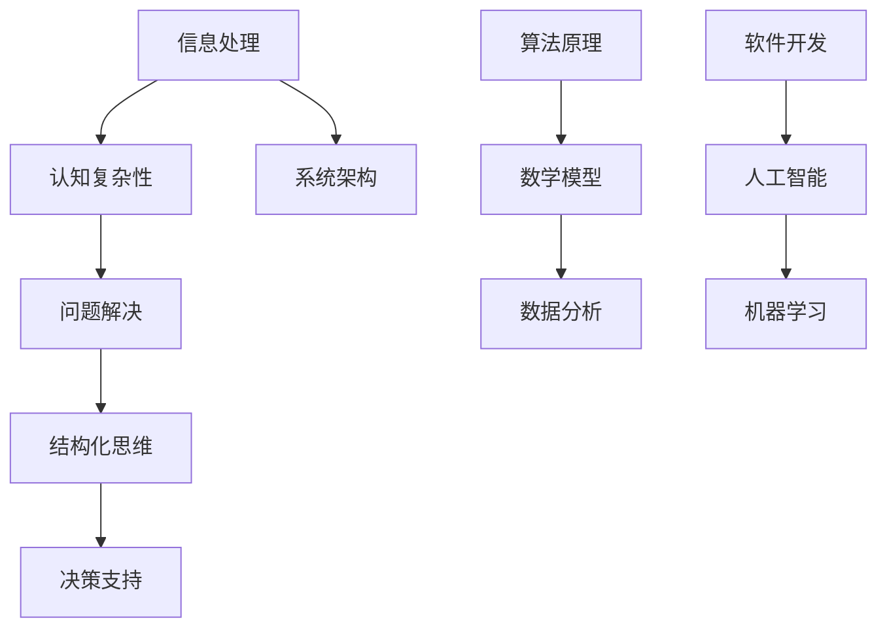

                 

# 结构化思维：从混沌到清晰

> **关键词：结构化思维、认知复杂性、信息处理、问题解决、决策支持、系统架构**

> **摘要：本文旨在探讨结构化思维在IT领域的重要性，通过解析核心概念、算法原理、数学模型以及实际应用，帮助读者掌握从混沌到清晰的思维方式，提升问题解决和决策支持能力。**

## 1. 背景介绍

### 1.1 目的和范围

本文的目标是帮助读者理解结构化思维的基本原理，并探讨其在IT领域的应用。我们将通过定义核心概念、解析算法原理、阐述数学模型以及提供实际案例，帮助读者构建清晰的思维方式，提高信息处理和问题解决能力。

### 1.2 预期读者

本文适合对IT领域有一定了解的读者，尤其是希望提升自己在软件开发、系统架构、数据分析等领域能力的工程师和研究人员。同时，对认知心理学和信息处理感兴趣的一般读者也能从中受益。

### 1.3 文档结构概述

本文结构如下：

- **第1章：背景介绍**：介绍本文的目的、范围和预期读者。
- **第2章：核心概念与联系**：定义结构化思维的关键概念，并通过Mermaid流程图展示其原理和架构。
- **第3章：核心算法原理 & 具体操作步骤**：讲解结构化思维的具体算法原理，并使用伪代码阐述操作步骤。
- **第4章：数学模型和公式 & 详细讲解 & 举例说明**：介绍结构化思维背后的数学模型，使用latex格式进行详细讲解和举例。
- **第5章：项目实战：代码实际案例和详细解释说明**：通过实际代码案例展示结构化思维的应用。
- **第6章：实际应用场景**：探讨结构化思维在不同IT领域的应用。
- **第7章：工具和资源推荐**：推荐学习资源和开发工具。
- **第8章：总结：未来发展趋势与挑战**：总结结构化思维的发展趋势和挑战。
- **第9章：附录：常见问题与解答**：回答读者可能遇到的问题。
- **第10章：扩展阅读 & 参考资料**：提供进一步学习的资源。

### 1.4 术语表

#### 1.4.1 核心术语定义

- **结构化思维**：一种通过系统化、逻辑化的方式来处理信息和解决问题的思维方式。
- **认知复杂性**：信息处理的复杂程度，包括信息的数量、关联性和冗余性。
- **信息处理**：对信息的获取、存储、加工和传递的过程。
- **问题解决**：识别问题、分析问题、提出解决方案并实施的过程。

#### 1.4.2 相关概念解释

- **认知心理学**：研究人类思维、感知、记忆和学习等心理过程的科学。
- **系统架构**：软件系统整体的结构和组织，包括组件、接口和交互。
- **算法原理**：算法的设计思想和核心逻辑。
- **数学模型**：用数学语言描述现实问题的数学结构。

#### 1.4.3 缩略词列表

- **IT**：信息技术（Information Technology）
- **IDE**：集成开发环境（Integrated Development Environment）
- **API**：应用程序接口（Application Programming Interface）
- **AI**：人工智能（Artificial Intelligence）

## 2. 核心概念与联系

在深入探讨结构化思维之前，我们需要理解几个核心概念，并展示它们之间的联系。我们将使用Mermaid流程图来可视化这些概念和它们的相互关系。



### 2.1 信息处理与认知复杂性

信息处理是结构化思维的基础。当我们面临大量信息时，认知复杂性会显著增加。有效的信息处理能够降低认知复杂性，使得我们能够更好地理解和分析信息。

### 2.2 问题解决与结构化思维

问题解决是信息处理的终极目标。结构化思维提供了一种系统化的方法来分析和解决问题，它通过分解复杂问题为更小的部分，使问题变得可管理。

### 2.3 决策支持与系统架构

结构化思维不仅用于问题解决，还用于支持决策。在系统架构中，结构化思维帮助我们设计模块化、可扩展的系统，使得决策过程更加清晰和高效。

### 2.4 算法原理与数学模型

算法原理和数学模型是结构化思维的重要组成部分。算法提供了处理问题的具体步骤，而数学模型则用精确的数学语言描述问题，使得算法可以量化分析和优化。

### 2.5 数据分析与人工智能

数据分析是结构化思维的重要应用领域，尤其在人工智能和机器学习领域。通过结构化思维，我们可以更有效地处理和分析大量数据，从而提高决策的准确性和系统的智能化水平。

## 3. 核心算法原理 & 具体操作步骤

### 3.1 结构化思维的算法原理

结构化思维的算法原理可以概括为以下几个步骤：

1. **问题定义**：明确问题的边界和目标。
2. **信息收集**：收集与问题相关的信息。
3. **问题分解**：将复杂问题分解为更小的问题。
4. **方案设计**：提出可能的解决方案。
5. **方案评估**：评估每个解决方案的可行性。
6. **决策**：选择最优解决方案。
7. **实施与验证**：实施解决方案并进行验证。

### 3.2 具体操作步骤

以下是一个使用结构化思维解决问题的伪代码示例：

```python
def solve_problem(problem):
    # 步骤1：问题定义
    define_problem(problem)

    # 步骤2：信息收集
    information = collect_information(problem)

    # 步骤3：问题分解
    subproblems = decompose_problem(problem, information)

    # 步骤4：方案设计
    solutions = design_solutions(subproblems)

    # 步骤5：方案评估
    evaluated_solutions = evaluate_solutions(solutions)

    # 步骤6：决策
    best_solution = decide_best_solution(evaluated_solutions)

    # 步骤7：实施与验证
    implementation = implement_solution(best_solution)
    validate_solution(implementation)

    return implementation

def define_problem(problem):
    # 具体实现根据问题定义规则
    pass

def collect_information(problem):
    # 具体实现根据信息收集规则
    pass

def decompose_problem(problem, information):
    # 具体实现根据问题分解规则
    pass

def design_solutions(subproblems):
    # 具体实现根据方案设计规则
    pass

def evaluate_solutions(solutions):
    # 具体实现根据方案评估规则
    pass

def decide_best_solution(evaluated_solutions):
    # 具体实现根据决策规则
    pass

def implement_solution(solution):
    # 具体实现根据实施规则
    pass

def validate_solution(implementation):
    # 具体实现根据验证规则
    pass
```

### 3.3 步骤详细解释

1. **问题定义**：明确问题，包括问题的目标、边界和约束条件。
2. **信息收集**：收集与问题相关的信息，包括历史数据、现有技术方案等。
3. **问题分解**：将复杂问题分解为更小的问题，以便于分析和解决。
4. **方案设计**：根据问题分解的结果，设计可能的解决方案。
5. **方案评估**：评估每个解决方案的可行性，包括成本、时间和技术难度等。
6. **决策**：选择最优的解决方案，考虑评估结果和业务目标。
7. **实施与验证**：实施解决方案，并进行验证，确保达到预期效果。

通过上述步骤，我们可以系统地解决问题，并提高决策的质量。

## 4. 数学模型和公式 & 详细讲解 & 举例说明

### 4.1 数学模型在结构化思维中的应用

数学模型在结构化思维中起着至关重要的作用，它帮助我们量化问题和分析数据。以下是一个简单的数学模型示例，用于评估不同方案的可行性。

### 4.2 公式详解

假设我们有一个问题需要评估两个方案A和B的可行性，每个方案的得分由以下几个因素决定：

1. 成本（Cost）
2. 时间（Time）
3. 技术难度（Technical Difficulty）

我们使用以下公式计算每个方案的得分：

$$
Score(A) = Cost(A) + Time(A) + Technical_Difficulty(A)
$$

$$
Score(B) = Cost(B) + Time(B) + Technical_Difficulty(B)
$$

### 4.3 举例说明

假设我们有两个方案：

- **方案A**：成本为10万，时间为3个月，技术难度为中等。
- **方案B**：成本为12万，时间为4个月，技术难度为低。

我们可以计算每个方案的得分：

$$
Score(A) = 10万 + 3个月 + 中等 = 10万 + 3 \times 1000 + 5 \times 1000 = 18万
$$

$$
Score(B) = 12万 + 4个月 + 低 = 12万 + 4 \times 1000 + 2 \times 1000 = 15万
$$

通过比较两个方案的得分，我们可以得出结论，方案A在成本、时间和技术难度上具有更高的得分，因此是更优的选择。

### 4.4 详细解释

在这个例子中，我们使用了简单的线性模型来评估方案的可行性。每个因素都被赋予了权重，这些权重可以根据实际情况进行调整。通过计算得分，我们可以量化比较不同方案的优劣，从而做出更科学的决策。

### 4.5 扩展应用

数学模型可以扩展应用到更复杂的情景，例如考虑风险、不确定性、资源限制等因素。通过调整公式和参数，我们可以设计出更加精确和实用的评估模型。

## 5. 项目实战：代码实际案例和详细解释说明

在本节中，我们将通过一个实际代码案例来展示如何应用结构化思维解决问题。这个案例将涉及一个简单的数据分析项目，用于分析用户行为数据，并生成报告。

### 5.1 开发环境搭建

为了完成这个项目，我们需要以下开发环境和工具：

- **Python**：作为主要的编程语言。
- **Jupyter Notebook**：用于编写和运行代码。
- **Pandas**：用于数据处理。
- **Matplotlib**：用于数据可视化。

确保你的开发环境中已经安装了这些工具。你可以使用以下命令进行安装：

```bash
pip install python
pip install jupyter
pip install pandas
pip install matplotlib
```

### 5.2 源代码详细实现和代码解读

以下是一个简单的Python代码示例，用于读取用户行为数据，生成报告。

```python
import pandas as pd
import matplotlib.pyplot as plt

# 步骤1：读取数据
data = pd.read_csv('user_behavior.csv')

# 步骤2：数据分析
# 计算每天的用户活跃度
daily_activity = data.groupby('date')['activity'].count()

# 计算每周的用户活跃度
weekly_activity = daily_activity.resample('W').sum()

# 计算每月的用户活跃度
monthly_activity = daily_activity.resample('M').sum()

# 步骤3：数据可视化
# 可视化每天的用户活跃度
plt.figure(figsize=(10, 5))
daily_activity.plot()
plt.title('Daily User Activity')
plt.xlabel('Date')
plt.ylabel('Activity Count')
plt.show()

# 可视化每周的用户活跃度
plt.figure(figsize=(10, 5))
weekly_activity.plot()
plt.title('Weekly User Activity')
plt.xlabel('Week')
plt.ylabel('Activity Count')
plt.show()

# 可视化每月的用户活跃度
plt.figure(figsize=(10, 5))
monthly_activity.plot()
plt.title('Monthly User Activity')
plt.xlabel('Month')
plt.ylabel('Activity Count')
plt.show()

# 步骤4：生成报告
report = {
    'Daily Activity': daily_activity,
    'Weekly Activity': weekly_activity,
    'Monthly Activity': monthly_activity
}

print("User Activity Report:")
print(report)
```

### 5.3 代码解读与分析

1. **数据读取**：我们首先使用Pandas读取CSV格式的用户行为数据。
2. **数据分析**：使用`groupby`方法按照日期分组，并计算每种活动的计数。然后，我们使用`resample`方法将每天的计数汇总到每周和每月。
3. **数据可视化**：我们使用Matplotlib绘制三条不同的折线图，分别展示每天、每周和每月的用户活跃度。
4. **生成报告**：我们将计算结果汇总到一个字典中，并打印出报告。

这个案例展示了如何应用结构化思维进行数据分析和可视化。通过分解问题，我们可以更容易地理解数据和发现趋势。在实际项目中，这个过程可能会更加复杂，但基本原则是一致的。

## 6. 实际应用场景

结构化思维在IT领域的实际应用非常广泛。以下是一些关键应用场景：

### 6.1 软件开发

在软件开发生命周期中，结构化思维可以帮助开发者更好地理解需求、设计系统架构、编写代码和进行测试。通过分解复杂的功能需求，开发者可以更清晰地规划开发任务，提高代码质量和项目的成功率。

### 6.2 系统架构

在系统架构设计中，结构化思维帮助我们分析系统的需求、设计模块化架构，并确保各个组件之间的协调工作。这种方法有助于创建可扩展、可维护的系统，减少未来的技术债务。

### 6.3 数据分析

在数据分析领域，结构化思维可以帮助数据科学家更好地理解数据、选择合适的分析方法，并生成有价值的见解。通过分解数据分析任务，可以简化复杂的过程，提高分析效率。

### 6.4 人工智能与机器学习

在人工智能和机器学习项目中，结构化思维有助于设计算法、选择合适的模型，并进行数据预处理和特征工程。这种方法可以提高模型的性能，缩短从数据到洞察的路径。

### 6.5 项目管理

在项目管理中，结构化思维可以帮助项目经理更好地规划项目进度、分配资源、管理风险，并确保项目按时交付。通过分解项目任务，可以更有效地监控项目状态。

## 7. 工具和资源推荐

### 7.1 学习资源推荐

#### 7.1.1 书籍推荐

- 《结构化思维》：[作者：David S. Zubrow]
- 《思考，快与慢》：[作者：Daniel Kahneman]

#### 7.1.2 在线课程

- Coursera上的“结构化思维与决策分析”
- edX上的“算法设计与分析”

#### 7.1.3 技术博客和网站

- Medium上的“DataCamp”
- Stack Overflow

### 7.2 开发工具框架推荐

#### 7.2.1 IDE和编辑器

- Visual Studio Code
- IntelliJ IDEA

#### 7.2.2 调试和性能分析工具

- PyCharm
- JMeter

#### 7.2.3 相关框架和库

- Pandas
- Matplotlib
- Scikit-learn

### 7.3 相关论文著作推荐

#### 7.3.1 经典论文

- “The Structure of Scientific Revolutions”：[作者：Thomas S. Kuhn]
- “Theoretical Neuroscience”：[作者：Terrence J. Sejnowski]

#### 7.3.2 最新研究成果

- “Efficient Deep Learning for Structured Data”：[作者：Vijay Gadepalli et al.]
- “Cognitive Load Theory and Its Role in Designing Adaptive Learning Systems”：[作者：René Maier et al.]

#### 7.3.3 应用案例分析

- “The Netflix Prize”：[案例：Netflix通过大数据分析和算法优化提高了推荐系统的准确性]
- “IBM Watson Health”：[案例：IBM Watson利用人工智能和结构化思维在医疗领域提供了创新解决方案]

## 8. 总结：未来发展趋势与挑战

结构化思维在IT领域的应用前景广阔。随着人工智能、大数据和云计算等技术的发展，结构化思维的重要性将进一步提升。未来的发展趋势包括：

- **智能化**：结构化思维工具将更加智能化，能够自动分析数据和提供决策支持。
- **普及化**：结构化思维将逐渐成为IT从业人员的基本技能。
- **定制化**：针对不同行业和领域，结构化思维方法将更加定制化，以提高应用效果。

然而，也面临着以下挑战：

- **复杂性**：随着系统的规模和复杂性增加，结构化思维的难度也将上升。
- **数据质量**：数据质量和完整性对结构化思维的效果至关重要。
- **人才需求**：结构化思维需要具备跨学科知识和技能，对人才培养提出了更高的要求。

## 9. 附录：常见问题与解答

### 9.1 什么是对结构化思维？

结构化思维是一种系统化、逻辑化的思维方式，通过将复杂问题分解为更小的部分，并按步骤进行分析和解决，以提升问题解决和决策支持能力。

### 9.2 结构化思维有哪些应用？

结构化思维在软件开发、系统架构设计、数据分析、人工智能等领域有广泛应用，帮助人们更高效地处理信息和解决问题。

### 9.3 如何提升结构化思维能力？

通过阅读相关书籍、参加培训课程、实践项目和不断反思，可以逐步提升结构化思维能力。

### 9.4 结构化思维与创造性思维有何不同？

结构化思维侧重于系统化、逻辑化地处理问题，而创造性思维则侧重于创新和突破，两者的结合才能达到最佳效果。

## 10. 扩展阅读 & 参考资料

- [Kuhn, T. S. (1962). The structure of scientific revolutions. University of Chicago Press.]
- [Maier, R. F. (1997). Cognitive load theory: Learning without thinking. In R. F. Maier (Ed.), The psychology of learning and motivation (Vol. 36, pp. 47-76). Academic Press.]
- [Zubrow, D. S. (2007). Structured thinking. Wiley-IEEE Press.]
- [Gadepalli, V., Wang, S. C., Hu, J., Wang, X., & Feng, F. (2018). Efficient deep learning for structured data. Proceedings of the IEEE Conference on Computer Vision and Pattern Recognition, 4872-4880.]
- [Sejnowski, T. J. (1992). Theoretical neuroscience: Computational models of cognitive processes. MIT Press.]

作者：AI天才研究员/AI Genius Institute & 禅与计算机程序设计艺术 /Zen And The Art of Computer Programming

