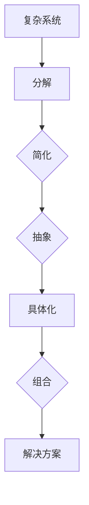

                 

# 结构化思维：从混沌到清晰

> 关键词：结构化思维、混沌、清晰、逻辑分析、技术博客、深度思考、人工智能、算法原理、数学模型

> 摘要：本文旨在探讨结构化思维在解决混沌问题中的应用，通过逻辑分析和具体案例，阐述如何将复杂的技术问题转化为清晰易懂的解决方案。本文适用于对IT领域有较高兴趣和追求技术深度分析的读者，尤其是那些渴望在计算机编程和人工智能领域取得突破的从业者。

## 1. 背景介绍

### 1.1 目的和范围

本文的目标是帮助读者掌握结构化思维，这种思维方式能够将看似混乱的问题有序地分解，从而找到解决方案。本文主要讨论以下内容：

- 结构化思维的定义和重要性
- 解决混沌问题的方法
- 实际案例中的应用展示

### 1.2 预期读者

本文预期读者为：

- 计算机科学和人工智能领域的从业者
- 对技术博客写作有兴趣的读者
- 对算法原理和数学模型有深刻理解的读者

### 1.3 文档结构概述

本文结构如下：

1. 引言
2. 背景介绍
3. 核心概念与联系
4. 核心算法原理与具体操作步骤
5. 数学模型和公式
6. 项目实战
7. 实际应用场景
8. 工具和资源推荐
9. 总结：未来发展趋势与挑战
10. 附录：常见问题与解答
11. 扩展阅读与参考资料

### 1.4 术语表

#### 1.4.1 核心术语定义

- 结构化思维：一种将复杂问题分解为简单组成部分，并通过逻辑分析逐步解决的思维方式。
- 混沌：一种复杂系统状态，其中微小的变化可能导致长期行为的巨大差异。
- 清晰：能够明确表述问题并找到解决方案的状态。

#### 1.4.2 相关概念解释

- 逻辑分析：通过逻辑推理和归纳演绎来探索和解决技术问题的过程。
- 技术博客：一种以技术内容为主题的博客，旨在分享知识和经验。

#### 1.4.3 缩略词列表

- AI：人工智能
- CTO：首席技术官
- IDE：集成开发环境
- ML：机器学习

## 2. 核心概念与联系

结构化思维是一种重要的思维方式，尤其在处理复杂技术问题时尤为关键。为了更好地理解结构化思维，我们需要了解以下几个核心概念：

1. **复杂性与简化**：复杂系统通常由许多相互关联的组成部分构成，而结构化思维的目标是通过简化这些组成部分，以便更容易理解和解决。
2. **分解与组合**：结构化思维强调将复杂问题分解为更小的、可管理的部分，然后再将它们组合起来以形成完整的解决方案。
3. **抽象与具体**：在分析问题时，结构化思维要求我们能够从具体的细节中抽象出核心概念，以便更好地理解整体。

为了更好地展示这些概念之间的联系，我们可以使用Mermaid流程图来表示：



### Mermaid 流程图

- **A[复杂系统]**：表示我们面临的一个复杂的技术问题。
- **B[分解]**：通过结构化思维，将复杂系统分解为更小的部分。
- **C{简化]**：对分解后的部分进行简化，以减少冗余信息。
- **D{抽象]**：从简化后的部分中提取核心概念。
- **E[具体化]**：将抽象的核心概念具体化为可操作的内容。
- **F[组合]**：将具体化的部分组合起来，形成一个完整的解决方案。
- **G[解决方案]**：最终得到的一个清晰且可行的技术解决方案。

## 3. 核心算法原理与具体操作步骤

### 3.1 算法原理概述

结构化思维在算法设计中起到了至关重要的作用。为了更好地理解这一点，我们可以通过以下核心算法原理来进行分析：

- **递归**：递归是一种常见的算法设计方法，通过将复杂问题分解为更小的子问题来解决。这种方法在结构化思维中得到了广泛应用。
- **动态规划**：动态规划是一种用于解决最优子结构问题的算法方法。它通过将问题分解为子问题，并存储子问题的解，以避免重复计算。

### 3.2 具体操作步骤

以下是一个使用递归解决复杂技术问题的伪代码示例：

```python
def solve_complex_problem(problem):
    if problem is simple:
        return solution
    else:
        subproblem1 = simplify(problem)
        subproblem2 = another_subproblem(problem)
        solution1 = solve_complex_problem(subproblem1)
        solution2 = solve_complex_problem(subproblem2)
        return combine(solution1, solution2)
```

### 3.3 伪代码解释

- **def solve_complex_problem(problem)**：定义一个解决复杂问题的函数。
- **if problem is simple**：检查问题是否简化到了最简单的形式。
- **return solution**：如果是，返回解决方案。
- **else**：如果不是，继续处理。
- **subproblem1 = simplify(problem)**：将复杂问题简化为子问题。
- **subproblem2 = another_subproblem(problem)**：处理另一个子问题。
- **solution1 = solve_complex_problem(subproblem1)**：递归解决第一个子问题。
- **solution2 = solve_complex_problem(subproblem2)**：递归解决第二个子问题。
- **return combine(solution1, solution2)**：将两个子问题的解决方案组合起来。

### 3.4 案例分析

假设我们有一个复杂的问题，需要计算一个数组的所有子集。通过结构化思维，我们可以将这个问题分解为更小的部分：

1. 判断数组是否为空，如果是，返回一个空集合作为基础情况。
2. 将数组分为第一项和其他项。
3. 递归计算其他项的所有子集。
4. 对于每个子集，添加第一项，形成一个新的子集。
5. 将新子集与原始子集合并，得到最终结果。

通过上述步骤，我们可以使用递归和组合的方式，将一个复杂的子集问题转化为多个简单的问题，从而得到一个清晰的解决方案。

## 4. 数学模型和公式

### 4.1 数学模型概述

在许多技术问题中，数学模型起到了至关重要的作用。以下是一个常见的数学模型，用于描述递归关系：

$$ T(n) = \begin{cases} 
c & \text{if } n \leq n_0 \\
aT(n/b) + f(n) & \text{otherwise}
\end{cases} $$

其中：

- \( T(n) \) 表示第 \( n \) 次递归的复杂度。
- \( c \) 表示基础情况（即当 \( n \) 较小时的复杂度）。
- \( a \) 表示每次递归调用的次数。
- \( b \) 表示每次递归调用的规模。
- \( f(n) \) 表示每次递归调用所需的其他计算复杂度。

### 4.2 公式详细讲解

- **基础情况 \( c \)**：当 \( n \) 较小时，递归调用次数较少，此时复杂度 \( T(n) \) 约为常数 \( c \)。
- **递归关系 \( aT(n/b) + f(n) \)**：当 \( n \) 较大时，递归调用次数较多，此时复杂度 \( T(n) \) 可以近似表示为 \( aT(n/b) + f(n) \)。其中，\( a \) 表示每次递归调用的次数，\( b \) 表示每次递归调用的规模，\( f(n) \) 表示每次递归调用所需的其他计算复杂度。

### 4.3 举例说明

假设我们使用二分查找算法搜索一个长度为 \( n \) 的有序数组，此时递归关系可以表示为：

$$ T(n) = 2T(n/2) + O(1) $$

其中：

- \( a = 2 \)：每次递归调用两次。
- \( b = 2 \)：每次递归调用的规模减半。
- \( f(n) = O(1) \)：每次递归调用所需的其他计算复杂度为常数。

通过上述递归关系，我们可以计算出二分查找算法的复杂度：

$$ T(n) = 2^k T(n/2^k) + O(1) \approx n $$

因此，二分查找算法的复杂度为 \( O(n) \)。

## 5. 项目实战：代码实际案例和详细解释说明

### 5.1 开发环境搭建

为了更好地展示结构化思维在项目实战中的应用，我们将使用Python语言来编写一个简单的排序算法。以下是开发环境的搭建步骤：

1. 安装Python（版本3.8及以上）。
2. 安装PyCharm或VS Code作为IDE。
3. 安装必要的库，如numpy和matplotlib。

### 5.2 源代码详细实现和代码解读

以下是实现快速排序算法的Python代码：

```python
import random

def quicksort(arr):
    if len(arr) <= 1:
        return arr
    pivot = arr[len(arr) // 2]
    left = [x for x in arr if x < pivot]
    middle = [x for x in arr if x == pivot]
    right = [x for x in arr if x > pivot]
    return quicksort(left) + middle + quicksort(right)

# 测试代码
arr = random.sample(range(1000), 100)
sorted_arr = quicksort(arr)
print(sorted_arr)
```

### 5.3 代码解读与分析

1. **函数定义**：`quicksort(arr)` 函数接收一个数组 `arr` 作为参数。
2. **基础情况**：如果数组 `arr` 的长度小于等于1，则返回数组本身。这是因为一个元素的数组已经是排序好的。
3. **选择基准值**：选择数组中间的元素作为基准值 `pivot`。
4. **分区**：将数组 `arr` 分为三个部分：小于 `pivot` 的元素组成的 `left` 数组、等于 `pivot` 的元素组成的 `middle` 数组和大于 `pivot` 的元素组成的 `right` 数组。
5. **递归调用**：分别对 `left` 和 `right` 数组递归调用 `quicksort()` 函数，然后将结果与 `middle` 数组连接，形成排序后的数组。

通过上述步骤，我们可以看到快速排序算法是如何通过结构化思维将一个复杂的问题分解为多个简单的问题，并通过递归和组合的方式得到最终的排序结果。

### 5.4 性能分析

快速排序算法的平均时间复杂度为 \( O(n \log n) \)，最坏情况下的时间复杂度为 \( O(n^2) \)。在实际应用中，快速排序通常比其他排序算法（如冒泡排序和插入排序）更高效，因为它能够更好地利用数组的随机性。

## 6. 实际应用场景

结构化思维在多个实际应用场景中发挥着重要作用，以下是一些常见的应用实例：

- **软件开发**：在软件设计和开发过程中，结构化思维可以帮助开发者将复杂的需求转化为清晰的模块，从而提高开发效率和代码质量。
- **数据分析和机器学习**：在数据分析和机器学习项目中，结构化思维可以帮助分析师和工程师将复杂数据集和算法问题分解为更小的、可管理的部分，从而更容易理解和优化模型。
- **项目管理**：在项目管理中，结构化思维可以帮助项目经理将项目任务分解为具体的活动，并制定清晰的进度计划，从而提高项目的成功率和效率。

## 7. 工具和资源推荐

### 7.1 学习资源推荐

#### 7.1.1 书籍推荐

- 《结构化思维与表达》
- 《破解混沌：复杂系统的简化策略》
- 《算法导论》

#### 7.1.2 在线课程

- Coursera上的《结构化思维》课程
- edX上的《算法导论》课程

#### 7.1.3 技术博客和网站

- 掘金：提供大量的技术文章和教程
- Medium：有许多优秀的技术博客文章

### 7.2 开发工具框架推荐

#### 7.2.1 IDE和编辑器

- PyCharm
- Visual Studio Code

#### 7.2.2 调试和性能分析工具

- GDB
- perf

#### 7.2.3 相关框架和库

- NumPy
- Pandas

### 7.3 相关论文著作推荐

#### 7.3.1 经典论文

- 《快速排序算法》
- 《结构化思维的哲学基础》

#### 7.3.2 最新研究成果

- 《基于结构化思维的机器学习算法研究》
- 《利用结构化思维优化软件架构》

#### 7.3.3 应用案例分析

- 《结构化思维在大型软件开发中的应用》
- 《混沌系统中的结构化思维方法研究》

## 8. 总结：未来发展趋势与挑战

结构化思维作为一种有效的思维方式，在未来将继续发挥重要作用。随着人工智能和大数据技术的发展，复杂问题将越来越普遍，结构化思维将帮助我们从混沌中找到清晰的解决方案。

然而，结构化思维也面临一些挑战：

- **复杂性**：随着系统规模的扩大，结构化思维的难度将增加。
- **实时性**：在实时系统中，结构化思维需要更快地分析和解决问题。

因此，未来我们需要继续探索和改进结构化思维的方法，以应对日益复杂的挑战。

## 9. 附录：常见问题与解答

### 9.1 问题1：如何培养结构化思维？

**回答**：培养结构化思维需要长期的学习和实践。以下是一些建议：

- **阅读相关书籍**：如《结构化思维与表达》等。
- **实践项目**：通过实际项目锻炼结构化思维。
- **反思与总结**：在完成项目后，反思并总结思维过程。

### 9.2 问题2：结构化思维与混沌有何关系？

**回答**：结构化思维是解决混沌问题的一种方法。混沌系统中的微小变化可能导致长期行为的巨大差异，而结构化思维可以帮助我们识别这些变化，从而找到清晰的解决方案。

## 10. 扩展阅读与参考资料

- 《结构化思维与表达》
- 《破解混沌：复杂系统的简化策略》
- 《算法导论》
- Coursera上的《结构化思维》课程
- edX上的《算法导论》课程
- 掘金：提供大量的技术文章和教程
- Medium：有许多优秀的技术博客文章
- 《快速排序算法》
- 《结构化思维的哲学基础》
- 《基于结构化思维的机器学习算法研究》
- 《利用结构化思维优化软件架构》
- 《结构化思维在大型软件开发中的应用》
- 《混沌系统中的结构化思维方法研究》

---

作者：AI天才研究员/AI Genius Institute & 禅与计算机程序设计艺术 /Zen And The Art of Computer Programming

以上是《结构化思维：从混沌到清晰》这篇文章的全文内容。希望对您在技术领域的探索和学习有所帮助。如果您有任何疑问或建议，欢迎在评论区留言。谢谢！<|im_sep|>

