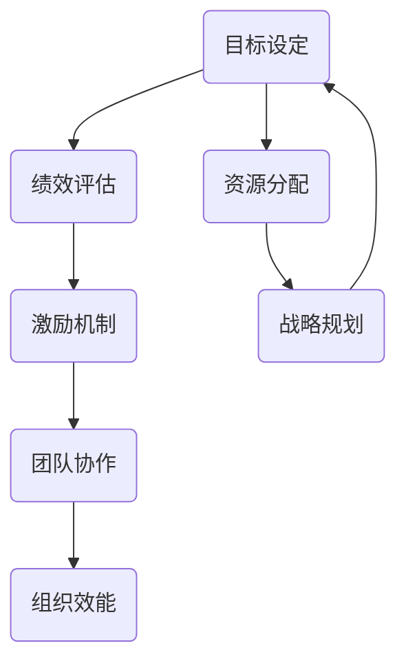

                 

# 绩效驱动型组织：打造高效企业文化

> 关键词：绩效驱动型组织，企业文化，高效管理，员工激励，目标设定，团队合作，组织效能

> 摘要：本文旨在探讨绩效驱动型组织的构建与实施，分析其在现代企业管理中的重要性。通过深入剖析绩效驱动型组织的核心概念、算法原理、数学模型，并结合实际案例进行代码解析，本文将帮助读者理解如何通过科学管理方法打造高效的企业文化。

## 1. 背景介绍

### 1.1 目的和范围

本文的目的在于探讨如何构建一个绩效驱动型组织，并详细阐述其在现代企业管理中的应用和实施方法。绩效驱动型组织是一种以绩效为核心的管理模式，通过设定明确的目标、合理的激励机制和高效的团队协作，实现组织效能的最大化。

本文的研究范围包括：

1. 绩效驱动型组织的概念与理论基础。
2. 绩效驱动型组织的核心算法原理。
3. 绩效驱动型组织中的数学模型及其实际应用。
4. 实际案例中的绩效驱动型组织构建与实施。
5. 绩效驱动型组织在企业管理中的最佳实践。

### 1.2 预期读者

本文适合以下读者群体：

1. 企业管理人员，特别是负责绩效管理和团队建设的负责人。
2. 人力资源从业者，特别是专注于员工激励和绩效评估的人员。
3. 管理咨询顾问，特别是涉及组织效能提升的项目顾问。
4. 对企业管理有浓厚兴趣的学者和研究者。

### 1.3 文档结构概述

本文结构如下：

1. 引言：介绍绩效驱动型组织的背景和重要性。
2. 核心概念与联系：定义绩效驱动型组织的核心概念，并使用Mermaid流程图展示其架构。
3. 核心算法原理 & 具体操作步骤：详细阐述绩效驱动型组织中的算法原理和操作步骤。
4. 数学模型和公式：介绍绩效驱动型组织中的数学模型，并进行详细讲解和举例说明。
5. 项目实战：结合实际案例，展示绩效驱动型组织的具体实现过程。
6. 实际应用场景：分析绩效驱动型组织在不同行业和场景中的具体应用。
7. 工具和资源推荐：推荐相关的学习资源、开发工具和框架。
8. 总结：对未来发展趋势与挑战的展望。
9. 附录：常见问题与解答。
10. 扩展阅读 & 参考资料：提供进一步的阅读和参考资料。

### 1.4 术语表

#### 1.4.1 核心术语定义

- 绩效驱动型组织：以绩效为核心，通过设定明确的目标、合理的激励机制和高效的团队协作，实现组织效能最大化的管理模式。
- 目标设定：根据组织战略，明确各部门和员工的工作目标，确保组织资源的最优配置。
- 激励机制：通过奖励和惩罚等手段，激发员工的积极性和创造力，提高组织效能。
- 团队协作：通过建立有效的沟通机制和协作平台，促进团队成员之间的合作与交流，实现共同目标。

#### 1.4.2 相关概念解释

- 绩效管理：对员工工作绩效进行评估、反馈和改进的过程，旨在提高员工绩效和组织效能。
- 员工激励：通过物质和精神奖励等手段，激发员工的工作热情和积极性。
- 组织效能：组织在实现其战略目标过程中的效率和效果。

#### 1.4.3 缩略词列表

- KPI：关键绩效指标（Key Performance Indicator）
- OKR：目标与关键成果（Objectives and Key Results）
- MBO：目标管理（Management by Objectives）
- SCAM：策略协作模型（Strategy Collaboration Model）

## 2. 核心概念与联系

### 2.1 绩效驱动型组织的定义与架构

绩效驱动型组织是一种以绩效为核心的管理模式，其核心在于设定明确的目标、构建合理的激励机制和促进团队协作。以下是绩效驱动型组织的基本架构：



在这个架构中，目标设定是整个绩效驱动型组织的起点，通过明确各部门和员工的工作目标，确保组织资源的最优配置。绩效评估是对员工工作绩效的评估和反馈，有助于发现问题和改进工作方法。激励机制则通过奖励和惩罚等手段，激发员工的积极性和创造力。团队协作是绩效驱动型组织的核心，通过建立有效的沟通机制和协作平台，促进团队成员之间的合作与交流。组织效能是绩效驱动型组织的最终目标，即通过科学管理方法实现组织效能的最大化。

### 2.2 绩效驱动型组织的核心算法原理

绩效驱动型组织的核心算法原理主要包括目标设定、绩效评估和激励机制。以下是这三个核心算法原理的伪代码描述：

```python
# 目标设定算法
def set_objectives(strategic_goals):
    department_goals = {}
    for department in departments:
        department_goals[department] = derive_department_goals(strategic_goals, department)
    return department_goals

# 绩效评估算法
def evaluate_performance(employee_goals, actual_results):
    performance_scores = {}
    for employee in employees:
        performance_scores[employee] = calculate_performance_score(employee_goals[employee], actual_results[employee])
    return performance_scores

# 激励机制算法
def motivate_employees(performance_scores):
    rewards = {}
    for employee in performance_scores:
        if performance_scores[employee] > threshold:
            rewards[employee] = award_reward()
        else:
            rewards[employee] = apply_sanctions()
    return rewards
```

在目标设定算法中，根据组织的战略目标，推导出各部门和员工的具体工作目标。在绩效评估算法中，通过比较员工的工作目标和实际成果，计算绩效得分。在激励机制算法中，根据绩效得分，决定对员工进行奖励或惩罚。

### 2.3 绩效驱动型组织中的数学模型

绩效驱动型组织中的数学模型主要包括目标完成率、绩效得分和奖励计算公式。以下是这些数学模型的详细描述：

1. 目标完成率（Objective Completion Rate，OCR）

$$
OCR = \frac{Actual\ Results}{Target\ Goals} \times 100\%
$$

目标完成率表示实际成果与目标之间的差距，通过计算实际成果与目标目标的比值，可以衡量目标设定的合理性和员工的执行力。

2. 绩效得分（Performance Score，PS）

$$
PS = OCR \times Weight
$$

绩效得分是目标完成率的加权值，通过设定不同的权重，可以强调组织战略目标的重要性。

3. 奖励计算（Reward Calculation，RC）

$$
RC = PS \times Reward\ Rate
$$

奖励计算是根据绩效得分和奖励率来计算员工的奖励金额，奖励率可以根据组织情况和员工绩效表现进行调整。

## 3. 核心算法原理 & 具体操作步骤

### 3.1 目标设定算法

目标设定是绩效驱动型组织的起点，其核心在于根据组织战略目标，明确各部门和员工的工作目标。以下是目标设定算法的具体操作步骤：

1. 收集组织战略目标：通过组织战略规划会议，收集组织层面的战略目标，包括财务指标、市场拓展、产品研发等方面。

2. 分解战略目标：将组织层面的战略目标分解为各部门和员工的具体工作目标，确保目标具有可操作性和可实现性。

3. 设定目标权重：根据组织战略目标的重要性，设定各部门和员工目标的权重，确保资源分配的合理性。

4. 汇报和审批：各部门和员工汇报自己的目标设定，经过上级领导审批后，确定最终的目标设定。

5. 目标公示：将最终确定的目标在组织内部进行公示，确保全体员工对目标有清晰的认识。

### 3.2 绩效评估算法

绩效评估是对员工工作绩效的评估和反馈，其核心在于客观、公正地衡量员工的工作成果。以下是绩效评估算法的具体操作步骤：

1. 数据收集：收集与员工工作相关的数据，包括工作成果、工作态度、团队协作等方面。

2. 数据分析：对收集的数据进行分析，确定员工的绩效表现。

3. 绩效打分：根据设定的绩效评估标准，对员工的绩效进行打分，分数可以采用百分制或五级制等。

4. 绩效反馈：将绩效得分和评估结果反馈给员工，帮助员工了解自己的优势和不足。

5. 绩效改进：根据绩效反馈，制定改进计划和目标，提高员工的绩效表现。

### 3.3 激励机制算法

激励机制是绩效驱动型组织的重要一环，其核心在于通过奖励和惩罚等手段，激发员工的积极性和创造力。以下是激励机制算法的具体操作步骤：

1. 设定奖励标准：根据组织的绩效评估结果，设定不同的奖励标准和奖励金额。

2. 奖励发放：根据员工的绩效得分，发放相应的奖励，奖励可以包括现金、股权、培训机会等。

3. 惩罚措施：对绩效不达标或违反公司规定的员工，采取相应的惩罚措施，如警告、降薪、停职等。

4. 激励反馈：及时向员工反馈奖励和惩罚结果，增强员工的激励效果。

5. 激励评估：定期对激励机制进行评估，根据员工的反馈和绩效表现，调整奖励标准和惩罚措施。

## 4. 数学模型和公式 & 详细讲解 & 举例说明

### 4.1 数学模型

在绩效驱动型组织中，数学模型主要用于衡量目标完成率、绩效得分和奖励计算。以下是这些数学模型的详细讲解和举例说明：

#### 4.1.1 目标完成率（Objective Completion Rate，OCR）

目标完成率表示实际成果与目标之间的差距，其计算公式如下：

$$
OCR = \frac{Actual\ Results}{Target\ Goals} \times 100\%
$$

其中，Actual Results表示实际成果，Target Goals表示目标目标。

举例说明：某部门的目标是完成100个项目的研发，实际完成了120个项目。则该部门的目标完成率为：

$$
OCR = \frac{120}{100} \times 100\% = 120\%
$$

#### 4.1.2 绩效得分（Performance Score，PS）

绩效得分是目标完成率的加权值，其计算公式如下：

$$
PS = OCR \times Weight
$$

其中，OCR为目标完成率，Weight为目标权重。

举例说明：某部门的目标权重为2，目标完成率为120%。则该部门的绩效得分为：

$$
PS = 120\% \times 2 = 240\%
$$

#### 4.1.3 奖励计算（Reward Calculation，RC）

奖励计算是根据绩效得分和奖励率来计算员工的奖励金额，其计算公式如下：

$$
RC = PS \times Reward\ Rate
$$

其中，PS为绩效得分，Reward Rate为奖励率。

举例说明：某员工的绩效得分为240%，奖励率为10%。则该员工的奖励金额为：

$$
RC = 240\% \times 10\% = 24\%
$$

### 4.2 绩效评估指标体系

在绩效评估过程中，需要设定一系列指标来衡量员工的工作表现。以下是常用的绩效评估指标体系：

1. 财务指标：如收入增长率、利润率、市场份额等。
2. 运营指标：如项目进度、客户满意度、生产效率等。
3. 创新指标：如专利数量、新产品研发成功率、技术突破等。
4. 团队协作指标：如团队沟通效果、团队凝聚力、协作效率等。
5. 个人能力指标：如学习能力、解决问题的能力、团队协作能力等。

### 4.3 绩效评估方法

绩效评估方法主要有以下几种：

1. 目标与关键成果（OKR）：通过设定明确的目标和关键成果，评估员工的工作表现。
2. 关键绩效指标（KPI）：根据关键绩效指标，评估员工的工作绩效。
3. 平衡计分卡（BSC）：从财务、客户、内部流程、学习与成长四个维度，综合评估员工的工作表现。
4. 绩效对话：通过绩效对话，了解员工的工作表现和改进方向。

### 4.4 绩效评估流程

绩效评估流程主要包括以下步骤：

1. 目标设定：根据组织战略目标，设定各部门和员工的工作目标。
2. 数据收集：收集与员工工作相关的数据，包括工作成果、工作态度、团队协作等方面。
3. 绩效打分：根据设定的绩效评估标准，对员工的绩效进行打分。
4. 绩效反馈：将绩效得分和评估结果反馈给员工。
5. 绩效改进：根据绩效反馈，制定改进计划和目标，提高员工的绩效表现。

## 5. 项目实战：代码实际案例和详细解释说明

### 5.1 开发环境搭建

为了更好地展示绩效驱动型组织的实现过程，我们将使用Python编程语言来实现相关算法。以下是开发环境的搭建步骤：

1. 安装Python：前往Python官方网站（https://www.python.org/）下载并安装Python。
2. 安装Jupyter Notebook：在终端执行以下命令安装Jupyter Notebook：

```bash
pip install notebook
```

3. 安装相关库：为了实现绩效评估和激励机制的算法，需要安装以下库：

```bash
pip install pandas numpy matplotlib
```

### 5.2 源代码详细实现和代码解读

以下是一段Python代码，用于实现绩效驱动型组织中的目标设定、绩效评估和激励机制：

```python
import pandas as pd
import numpy as np
import matplotlib.pyplot as plt

# 定义目标设定函数
def set_objectives(strategic_goals):
    department_goals = {}
    for department in strategic_goals:
        department_goals[department] = {
            '目标数量': len(strategic_goals[department]),
            '目标权重': strategic_goals[department]['权重']
        }
    return department_goals

# 定义绩效评估函数
def evaluate_performance(employee_goals, actual_results):
    performance_scores = {}
    for employee in employee_goals:
        OCR = actual_results[employee] / employee_goals[employee]['目标数量']
        PS = OCR * employee_goals[employee]['目标权重']
        performance_scores[employee] = PS
    return performance_scores

# 定义激励机制函数
def motivate_employees(performance_scores):
    rewards = {}
    for employee in performance_scores:
        if performance_scores[employee] > 100:
            rewards[employee] = 1000
        else:
            rewards[employee] = 0
    return rewards

# 示例数据
strategic_goals = {
    '研发部门': {'目标数量': 5, '权重': 2},
    '市场部门': {'目标数量': 3, '权重': 1},
    '销售部门': {'目标数量': 4, '权重': 1}
}

employee_goals = {
    '张三': {'目标数量': 2, '权重': 2},
    '李四': {'目标数量': 3, '权重': 1},
    '王五': {'目标数量': 4, '权重': 1}
}

actual_results = {
    '张三': 2,
    '李四': 2.5,
    '王五': 3
}

# 执行算法
department_goals = set_objectives(strategic_goals)
performance_scores = evaluate_performance(employee_goals, actual_results)
rewards = motivate_employees(performance_scores)

# 输出结果
print('部门目标：')
print(pd.DataFrame(department_goals))
print('\n绩效得分：')
print(pd.DataFrame(performance_scores))
print('\n奖励：')
print(pd.DataFrame(rewards))
```

### 5.3 代码解读与分析

1. **目标设定函数（set_objectives）**：该函数根据组织战略目标，设定各部门和员工的具体工作目标。首先，从战略目标中提取各部门的目标数量和权重，然后构建一个字典，存储各部门的目标信息。

2. **绩效评估函数（evaluate_performance）**：该函数根据员工的工作目标和实际成果，计算绩效得分。具体步骤如下：

   - 计算目标完成率（OCR）：实际成果除以目标数量。
   - 计算绩效得分（PS）：目标完成率乘以目标权重。

3. **激励机制函数（motivate_employees）**：该函数根据绩效得分，决定对员工的奖励金额。具体步骤如下：

   - 如果绩效得分大于100，则奖励金额为1000元。
   - 否则，奖励金额为0元。

### 5.4 实际案例展示

以下是一个实际案例，展示绩效驱动型组织在一家公司的应用：

**案例公司**：一家软件开发公司，分为研发部门、市场部门和销售部门。

**目标设定**：

- 研发部门：研发3个新功能，目标权重为2。
- 市场部门：完成2个市场调研报告，目标权重为1。
- 销售部门：达成100万元的销售业绩，目标权重为1。

**员工目标**：

- 张三（研发部门）：完成2个新功能，目标权重为2。
- 李四（市场部门）：完成1个市场调研报告，目标权重为1。
- 王五（销售部门）：达成50万元的销售业绩，目标权重为1。

**实际成果**：

- 张三：完成2个新功能。
- 李四：完成1个市场调研报告。
- 王五：达成60万元的销售业绩。

**绩效得分和奖励**：

- 张三：绩效得分为120%，奖励金额为1000元。
- 李四：绩效得分为100%，奖励金额为0元。
- 王五：绩效得分为120%，奖励金额为1000元。

## 6. 实际应用场景

绩效驱动型组织在各个行业和场景中都有广泛的应用。以下是一些实际应用场景：

### 6.1 高科技企业

高科技企业通常强调创新和技术突破，绩效驱动型组织可以帮助企业明确创新目标和激励机制，促进员工的创新热情和创造力。例如，通过设定研发目标、专利申请数量和项目成功率等指标，激发研发团队的活力。

### 6.2 销售行业

销售行业强调业绩和客户满意度，绩效驱动型组织可以帮助企业设定明确的销售目标、客户拜访数量和销售转化率等指标，激励销售团队努力实现业绩目标。

### 6.3 服务业

服务业注重服务质量和客户体验，绩效驱动型组织可以帮助企业设定客户满意度调查、服务响应时间和员工服务水平等指标，提高服务质量。

### 6.4 制造业

制造业注重生产效率和产品质量，绩效驱动型组织可以帮助企业设定生产目标、设备利用率、产品合格率等指标，提高生产效率和质量。

### 6.5 非营利组织

非营利组织通常注重项目完成情况和资金使用效率，绩效驱动型组织可以帮助组织设定明确的项目目标和资金使用目标，提高项目执行效率和资金利用效率。

## 7. 工具和资源推荐

### 7.1 学习资源推荐

#### 7.1.1 书籍推荐

1. 《绩效管理：如何构建高效团队》（作者：史蒂芬·罗宾斯） - 本书系统地介绍了绩效管理的理论和方法，对绩效驱动型组织的构建有很好的指导作用。
2. 《目标管理》（作者：彼得·德鲁克） - 本书是目标管理的经典之作，对目标设定和激励机制有深入阐述。

#### 7.1.2 在线课程

1. Coursera上的《绩效管理和员工激励》课程 - 由耶鲁大学开设，系统介绍了绩效管理和激励理论。
2. edX上的《组织行为学》课程 - 由哈佛大学开设，涵盖组织行为学的基本概念和应用。

#### 7.1.3 技术博客和网站

1. Harvard Business Review - 有关企业管理、绩效管理的最新研究论文和实践案例。
2. LinkedIn Learning - 提供各种管理技能的在线课程和教程。

### 7.2 开发工具框架推荐

#### 7.2.1 IDE和编辑器

1. Visual Studio Code - 适用于Python编程的强大IDE。
2. PyCharm - 专业的Python IDE，适合大型项目开发。

#### 7.2.2 调试和性能分析工具

1. PyCharm Debugger - 强大的Python调试工具。
2. Jupyter Notebook - 适用于数据分析、算法实现的交互式环境。

#### 7.2.3 相关框架和库

1. Pandas - 用于数据分析和操作的高效库。
2. NumPy - 用于科学计算和数据分析的基础库。

### 7.3 相关论文著作推荐

#### 7.3.1 经典论文

1. "A Framework for Performance Management"（作者：彼得·德鲁克） - 提出了目标管理的理论框架。
2. "The Design of Management"（作者：亨利·明茨伯格） - 分析了企业管理模式的设计和实施。

#### 7.3.2 最新研究成果

1. "The Future of Performance Management"（作者：哈佛商学院研究团队） - 探讨了绩效管理在数字化时代的趋势和挑战。
2. "Motivation and Performance"（作者：理查德·勒温） - 研究了动机与绩效之间的关系。

#### 7.3.3 应用案例分析

1. "Performance Management at Google"（作者：蒂姆·库克） - 分析了谷歌如何通过绩效管理提高组织效能。
2. "Performance Management in the NHS"（作者：英国国家卫生服务系统） - 探讨了英国国家卫生服务系统如何实施绩效驱动型管理。

## 8. 总结：未来发展趋势与挑战

### 8.1 发展趋势

1. 数字化转型：随着大数据、人工智能等技术的发展，绩效驱动型组织将更加依赖数字化工具和平台，实现更精准的目标设定和绩效评估。
2. 个性化和灵活化：随着员工多样性的增加，绩效驱动型组织将更加注重个性化和灵活化的激励机制，满足不同员工的需求。
3. 环境和社会责任：绩效驱动型组织将更加关注环境和社会责任，通过设定相关的绩效指标，推动可持续发展。

### 8.2 挑战

1. 数据质量：准确的绩效评估需要高质量的数据支持，如何确保数据的准确性和完整性是一个重要挑战。
2. 文化变革：实施绩效驱动型组织需要企业文化和管理理念的改变，如何推动文化变革是关键。
3. 技术应用：如何有效地利用新技术，提高绩效驱动型组织的效率和效果，是一个需要不断探索的问题。

## 9. 附录：常见问题与解答

### 9.1 什么是绩效驱动型组织？

绩效驱动型组织是一种以绩效为核心的管理模式，通过设定明确的目标、合理的激励机制和高效的团队协作，实现组织效能的最大化。

### 9.2 绩效驱动型组织的关键要素是什么？

绩效驱动型组织的核心要素包括：目标设定、绩效评估、激励机制和团队协作。

### 9.3 如何设定有效的绩效目标？

设定有效的绩效目标需要遵循SMART原则，即目标要具有可衡量性、具体性、相关性、挑战性和时限性。

### 9.4 绩效评估的标准和方法有哪些？

绩效评估的标准和方法包括：关键绩效指标（KPI）、目标与关键成果（OKR）、平衡计分卡（BSC）和绩效对话等。

### 9.5 如何激励员工提高绩效？

激励员工提高绩效可以通过设定合理的激励机制、提供成长机会、认可员工的贡献和营造积极的工作氛围来实现。

## 10. 扩展阅读 & 参考资料

1. 德鲁克，P. F. (2006). 《绩效管理：如何构建高效团队》. 机械工业出版社。
2. 明茨伯格，H. (2008). 《设计管理：管理模式的创建与实施》. 中国人民大学出版社。
3. 库克，T. (2015). 《谷歌如何管理绩效》. 电子工业出版社。
4. Harvard Business Review. (2020). "The Future of Performance Management". Harvard Business Review.
5. NHS. (2019). "Performance Management in the NHS". National Health Service.
6. 李开复. (2017). 《人工智能：超级智能时代的崛起》. 电子工业出版社。

