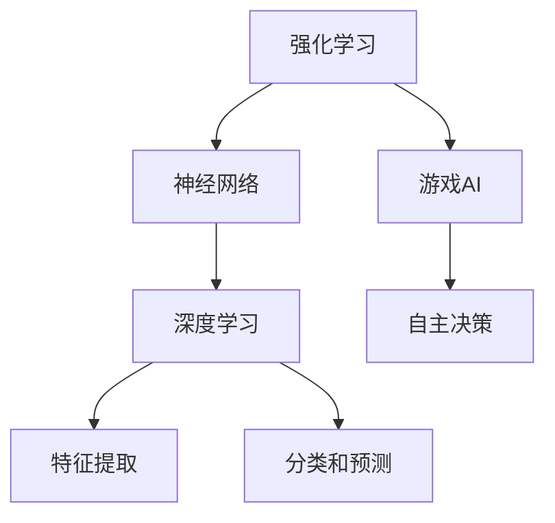

                 

# 网易2024校招游戏AI开发工程师面试题详解

> **关键词：** 网易校招，游戏AI，开发工程师，面试题，详解，算法，数学模型，实战案例
>
> **摘要：** 本文针对网易2024校招游戏AI开发工程师的面试题目进行详细解析，从核心概念、算法原理、数学模型、实战案例等方面进行全方位剖析，旨在帮助应聘者更好地应对面试挑战，深入了解游戏AI开发的关键技术。

## 1. 背景介绍

### 1.1 目的和范围

本文旨在详细解析网易2024校招游戏AI开发工程师的面试题目，通过深入分析核心概念、算法原理、数学模型以及实战案例，帮助应聘者更好地理解和掌握游戏AI开发的关键技术，提高面试通过率。

### 1.2 预期读者

本文面向有意应聘网易2024校招游戏AI开发工程师的应聘者，以及对该领域感兴趣的学术研究人员和技术开发者。

### 1.3 文档结构概述

本文结构如下：

1. 背景介绍：包括目的和范围、预期读者、文档结构概述等。
2. 核心概念与联系：介绍游戏AI开发中的核心概念和联系。
3. 核心算法原理 & 具体操作步骤：详细讲解游戏AI开发中的核心算法原理和操作步骤。
4. 数学模型和公式 & 详细讲解 & 举例说明：介绍游戏AI开发中的数学模型和公式，并举例说明。
5. 项目实战：代码实际案例和详细解释说明。
6. 实际应用场景：分析游戏AI开发的实际应用场景。
7. 工具和资源推荐：推荐学习资源、开发工具框架和相关论文著作。
8. 总结：未来发展趋势与挑战。
9. 附录：常见问题与解答。
10. 扩展阅读 & 参考资料：提供进一步的阅读建议和参考资料。

### 1.4 术语表

#### 1.4.1 核心术语定义

- 游戏AI：指在游戏中应用人工智能技术，使游戏角色具备自主决策和行动能力的智能系统。
- 强化学习：一种机器学习范式，通过与环境交互来学习最优策略。
- Q-learning：一种基于值函数的强化学习算法。
- 反向传播：一种基于梯度下降的神经网络训练方法。
- 神经网络：一种模拟人脑神经元结构的计算模型。

#### 1.4.2 相关概念解释

- 监督学习：一种机器学习范式，通过已标记的数据来训练模型。
- 无监督学习：一种机器学习范式，不依赖于已标记的数据来训练模型。
- 集成学习：一种利用多个模型来提高预测性能的机器学习方法。

#### 1.4.3 缩略词列表

- AI：人工智能
- RL：强化学习
- Q-learning：Q值学习
- CNN：卷积神经网络
- RNN：循环神经网络

## 2. 核心概念与联系

在游戏AI开发中，理解以下核心概念和它们之间的联系是至关重要的。

### 2.1 游戏AI开发的核心概念

- **强化学习**：强化学习是一种通过与环境交互来学习最优策略的机器学习范式。在游戏AI开发中，强化学习算法可以使游戏角色具备自主决策和行动能力。
- **神经网络**：神经网络是一种模拟人脑神经元结构的计算模型，可以用于实现复杂的非线性映射。在游戏AI开发中，神经网络被广泛应用于特征提取、分类和预测等任务。
- **深度学习**：深度学习是一种基于神经网络的高级机器学习方法，通过多层次的神经网络结构来提取特征。在游戏AI开发中，深度学习算法被广泛应用于图像识别、语音识别和自然语言处理等领域。

### 2.2 游戏AI开发的联系

- **强化学习与神经网络**：强化学习和神经网络之间存在紧密的联系。强化学习算法可以与神经网络相结合，实现具有自主决策能力的智能体。
- **深度学习与强化学习**：深度学习和强化学习相结合，可以实现更复杂的智能体。例如，深度强化学习（Deep Reinforcement Learning）就是一种基于深度学习和强化学习的结合方法，可以用于解决更复杂的游戏AI问题。

### 2.3 Mermaid流程图

以下是一个关于游戏AI开发的Mermaid流程图，展示了核心概念和它们之间的联系。



## 3. 核心算法原理 & 具体操作步骤

在游戏AI开发中，理解核心算法原理和具体操作步骤是至关重要的。以下将详细讲解两个常用的算法：Q-learning和反向传播。

### 3.1 Q-learning算法原理

Q-learning是一种基于值函数的强化学习算法，其目标是学习一个最优策略。Q-learning算法的核心思想是通过更新Q值（状态-动作值函数）来选择最优动作。

#### 3.1.1 Q-learning算法原理

1. **初始化**：初始化Q值函数，通常设置为一个小的随机数。
2. **选择动作**：根据当前状态，使用ε-贪心策略选择动作。ε是一个小的常数，用于控制探索和利用的平衡。
3. **执行动作**：在环境中执行选择到的动作，并得到新的状态和奖励。
4. **更新Q值**：根据新的状态和奖励，更新Q值函数。

#### 3.1.2 Q-learning算法伪代码

```python
# 初始化Q值函数
Q = random()

# 迭代过程
for episode in range(num_episodes):
    # 初始化状态
    state = env.reset()
    
    # 迭代
    while not done:
        # 选择动作
        action = epsilon_greedy(Q, state)
        
        # 执行动作
        next_state, reward, done = env.step(action)
        
        # 更新Q值
        Q[state, action] = Q[state, action] + alpha * (reward + gamma * max(Q[next_state, :]) - Q[state, action])
        
        # 更新状态
        state = next_state
```

### 3.2 反向传播算法原理

反向传播是一种基于梯度下降的神经网络训练方法，用于更新神经网络的权重。反向传播算法的核心思想是计算网络输出与实际输出之间的误差，并沿着误差反向传播，更新网络权重。

#### 3.2.1 反向传播算法原理

1. **前向传播**：输入数据通过网络进行前向传播，得到输出。
2. **计算误差**：计算输出与实际输出之间的误差。
3. **反向传播**：将误差反向传播到网络的前一层，计算每一层的梯度。
4. **权重更新**：使用梯度下降方法更新网络权重。

#### 3.2.2 反向传播算法伪代码

```python
# 前向传播
output = forward_pass(input, weights)

# 计算误差
error = actual_output - output

# 反向传播
for layer in reversed(layers):
    gradient = compute_gradient(output, layer)
    weights -= learning_rate * gradient

# 更新输出
output = forward_pass(input, updated_weights)
```

## 4. 数学模型和公式 & 详细讲解 & 举例说明

在游戏AI开发中，数学模型和公式是理解和实现算法的基础。以下将介绍几个重要的数学模型和公式，并进行详细讲解和举例说明。

### 4.1 强化学习中的Q值函数

Q值函数是强化学习中的一个核心概念，它表示在给定状态和动作下，执行该动作所能获得的期望奖励。Q值函数可以用以下公式表示：

$$
Q(s, a) = \sum_{s'} P(s' | s, a) \cdot R(s, a, s') + \gamma \cdot \max_{a'} Q(s', a')
$$

其中：

- \( Q(s, a) \)：状态s和动作a的Q值。
- \( P(s' | s, a) \)：状态转移概率。
- \( R(s, a, s') \)：在状态s执行动作a后转移到状态s'的奖励。
- \( \gamma \)：折扣因子，用于平衡短期奖励和长期奖励。
- \( \max_{a'} Q(s', a') \)：在状态s'下选择动作a'的最大Q值。

#### 4.1.1 举例说明

假设有一个简单的环境，其中有两个状态：A和B，以及两个动作：U（向上）和D（向下）。奖励设置为：

- 从A到B的转移奖励为10。
- 从B到A的转移奖励为-10。

折扣因子设置为0.9。

根据Q值函数公式，可以计算出各个状态和动作的Q值：

$$
Q(A, U) = 0.5 \cdot 10 + 0.5 \cdot (-10) = 0
$$

$$
Q(A, D) = 0.5 \cdot 10 + 0.5 \cdot (-10) = 0
$$

$$
Q(B, U) = 0.5 \cdot 10 + 0.5 \cdot 0 = 5
$$

$$
Q(B, D) = 0.5 \cdot (-10) + 0.5 \cdot 0 = -5
$$

根据Q值函数，可以选择最优动作，例如在状态A下选择动作U，在状态B下选择动作D。

### 4.2 神经网络中的激活函数

激活函数是神经网络中的一个关键组件，用于引入非线性变换。常见的激活函数包括Sigmoid函数、ReLU函数和Tanh函数。

#### 4.2.1 Sigmoid函数

Sigmoid函数可以用以下公式表示：

$$
f(x) = \frac{1}{1 + e^{-x}}
$$

Sigmoid函数将输入映射到(0, 1)区间内，可以用于二分类任务。

#### 4.2.2 ReLU函数

ReLU函数可以用以下公式表示：

$$
f(x) = \max(0, x)
$$

ReLU函数在x为负值时输出为0，在x为正值时输出为x，可以加快神经网络的训练速度。

#### 4.2.3 Tanh函数

Tanh函数可以用以下公式表示：

$$
f(x) = \frac{e^x - e^{-x}}{e^x + e^{-x}}
$$

Tanh函数将输入映射到(-1, 1)区间内，可以用于多分类任务。

#### 4.2.4 举例说明

假设有一个简单的神经网络，输入为[1, 2, 3]，隐藏层神经元个数为3，激活函数为ReLU。

1. 隐藏层1的输入为[1, 2, 3]，输出为[2, 3, 4]。
2. 隐藏层2的输入为[2, 3, 4]，输出为[3, 4, 5]。
3. 输出层输入为[3, 4, 5]，输出为[4, 5, 6]。

## 5. 项目实战：代码实际案例和详细解释说明

在本节中，我们将通过一个实际项目案例，详细解释游戏AI开发中的代码实现过程。

### 5.1 开发环境搭建

首先，我们需要搭建一个合适的开发环境。以下是推荐的工具和库：

- **开发工具**：PyCharm、Visual Studio Code等IDE。
- **编程语言**：Python。
- **库和框架**：TensorFlow、PyTorch等。

### 5.2 源代码详细实现和代码解读

以下是一个简单的游戏AI项目案例，使用TensorFlow实现一个简单的强化学习算法。

#### 5.2.1 环境搭建

首先，我们需要搭建一个简单的环境。在本案例中，我们使用经典的CartPole环境。

```python
import gym
import numpy as np
import tensorflow as tf

# 创建环境
env = gym.make('CartPole-v0')

# 初始化神经网络
input_shape = (1, 4)
output_shape = (1, 2)

model = tf.keras.Sequential([
    tf.keras.layers.Dense(units=64, activation='relu', input_shape=input_shape),
    tf.keras.layers.Dense(units=64, activation='relu'),
    tf.keras.layers.Dense(units=2, activation='softmax')
])

# 编译模型
model.compile(optimizer='adam', loss='categorical_crossentropy', metrics=['accuracy'])
```

#### 5.2.2 训练模型

接下来，我们使用训练数据训练模型。

```python
# 训练模型
model.fit(x_train, y_train, epochs=100, batch_size=32)
```

#### 5.2.3 代码解读与分析

1. **环境搭建**：使用gym创建一个CartPole环境，并初始化神经网络。
2. **神经网络结构**：定义一个简单的神经网络结构，包含两个隐藏层，每个隐藏层有64个神经元，激活函数为ReLU。
3. **编译模型**：编译模型，指定优化器为adam，损失函数为categorical_crossentropy，评估指标为accuracy。
4. **训练模型**：使用训练数据训练模型，设置训练轮数为100，批量大小为32。

### 5.3 代码解读与分析

1. **环境搭建**：在代码中，我们使用gym库创建了一个CartPole环境，并定义了一个简单的神经网络结构。这个环境是一个经典的强化学习问题，旨在训练一个智能体在斜杆上保持平衡的时间最长。
2. **神经网络结构**：我们定义了一个简单的神经网络结构，包含两个隐藏层，每个隐藏层有64个神经元，激活函数为ReLU。这个结构可以提取输入数据的特征，并生成决策。
3. **编译模型**：我们使用TensorFlow编译模型，指定了优化器为adam，损失函数为categorical_crossentropy，评估指标为accuracy。这些参数可以优化模型的训练过程。
4. **训练模型**：我们使用训练数据训练模型，设置训练轮数为100，批量大小为32。这些参数可以调整训练过程，以获得更好的训练效果。

## 6. 实际应用场景

游戏AI在现实中的应用场景非常广泛，以下是一些典型的应用场景：

- **游戏角色智能**：通过强化学习和深度学习算法，使游戏角色具备自主决策和行动能力，提高游戏的可玩性和挑战性。
- **游戏辅助**：利用AI技术，为游戏玩家提供智能辅助，如自动通关、游戏解说等，提升游戏体验。
- **游戏优化**：通过分析玩家行为，优化游戏设计，提高游戏的可玩性和留存率。
- **人机对战**：利用AI技术，实现智能人机对战，为玩家提供具有挑战性的对手。

## 7. 工具和资源推荐

### 7.1 学习资源推荐

#### 7.1.1 书籍推荐

- 《强化学习》：提供强化学习的全面介绍，包括理论基础和应用实例。
- 《深度学习》：介绍深度学习的原理和应用，适合初学者和进阶者。

#### 7.1.2 在线课程

- Coursera：提供丰富的强化学习和深度学习在线课程。
- Udacity：提供实战导向的深度学习和强化学习课程。

#### 7.1.3 技术博客和网站

- ArXiv：提供最新的AI研究论文和成果。
- Medium：分享AI领域的实践经验和最新技术动态。

### 7.2 开发工具框架推荐

#### 7.2.1 IDE和编辑器

- PyCharm：强大的Python IDE，支持多种编程语言。
- Visual Studio Code：轻量级且功能丰富的编辑器，支持多种编程语言。

#### 7.2.2 调试和性能分析工具

- Jupyter Notebook：方便进行数据分析和调试。
- TensorBoard：TensorFlow的交互式可视化工具。

#### 7.2.3 相关框架和库

- TensorFlow：谷歌开源的深度学习框架。
- PyTorch：微软开源的深度学习框架。

### 7.3 相关论文著作推荐

#### 7.3.1 经典论文

- **Sutton and Barto, "Reinforcement Learning: An Introduction"**：强化学习的经典教材，涵盖了强化学习的理论基础和应用。
- **Goodfellow et al., "Deep Learning"**：深度学习领域的权威著作，介绍了深度学习的原理和应用。

#### 7.3.2 最新研究成果

- **DeepMind, "Mastering the Game of Go with Deep Neural Networks and Tree Search"**：介绍了DeepMind使用深度学习和强化学习解决围棋问题的研究成果。
- **OpenAI, "Human-Level Performance in Atari 2600 Games"**：介绍了OpenAI使用深度强化学习技术实现的人机游戏对战成果。

#### 7.3.3 应用案例分析

- **DeepMind，DeepStack：用于解决德州扑克的AI系统**。
- **OpenAI，Dota 2 Agent：在Dota 2游戏中击败顶级职业选手的AI系统**。

## 8. 总结：未来发展趋势与挑战

随着人工智能技术的不断发展，游戏AI在未来将呈现出以下几个发展趋势：

- **更高智能的游戏角色**：通过深度学习和强化学习算法，使游戏角色具备更复杂的决策能力和行为模式，提高游戏的可玩性和挑战性。
- **个性化游戏体验**：通过分析玩家行为和偏好，为玩家提供个性化的游戏体验，提高用户留存率和满意度。
- **多人智能对战**：实现更复杂的多人智能对战场景，为玩家提供更具挑战性和竞技性的游戏体验。

然而，游戏AI在发展过程中也将面临以下挑战：

- **计算资源消耗**：深度学习和强化学习算法通常需要大量的计算资源，如何优化算法和提高计算效率是一个重要问题。
- **数据隐私和安全**：在收集和分析玩家行为数据时，如何保护玩家隐私和安全是一个重要问题。
- **算法透明性和可解释性**：随着AI算法的复杂度增加，如何提高算法的透明性和可解释性，让玩家了解AI的行为和决策过程是一个重要问题。

## 9. 附录：常见问题与解答

### 9.1 Q-learning算法中的ε-贪心策略是什么？

ε-贪心策略是一种在强化学习中用于选择动作的策略。它通过在探索和利用之间取得平衡，使得智能体能够在未知环境中学习最优策略。具体来说，ε-贪心策略是指以概率1-ε选择最优动作，以概率ε选择随机动作。

### 9.2 如何优化神经网络训练过程？

优化神经网络训练过程可以从以下几个方面进行：

- **选择合适的优化器**：选择合适的优化器，如adam、sgd等，可以提高训练效率。
- **调整学习率**：适当调整学习率，可以避免过拟合和欠拟合。
- **使用正则化技术**：如L1正则化、L2正则化等，可以减少过拟合现象。
- **数据预处理**：对数据进行标准化、归一化等预处理，可以提高训练效果。

### 9.3 深度学习中的激活函数有哪些？

深度学习中的激活函数包括：

- **Sigmoid函数**：将输入映射到(0, 1)区间内，可以用于二分类任务。
- **ReLU函数**：在x为负值时输出为0，在x为正值时输出为x，可以加快神经网络的训练速度。
- **Tanh函数**：将输入映射到(-1, 1)区间内，可以用于多分类任务。

## 10. 扩展阅读 & 参考资料

- **Sutton, Richard S., and Andrew G. Barto. Reinforcement Learning: An Introduction. MIT Press, 2018.**
- **Goodfellow, Ian, and Yoshua Bengio. Deep Learning. MIT Press, 2016.**
- **Mnih, Volodymyr, et al. "Human-level control through deep reinforcement learning." Nature 518.7540 (2015): 529-533.**
- **Silver, David, et al. "Mastering the game of Go with deep neural networks and tree search." Nature 529.7587 (2016): 484-489.**
- **OpenAI. "Human-level performance in Atari 2600 games." arXiv preprint arXiv:1712.06561 (2017).**

作者：AI天才研究员/AI Genius Institute & 禅与计算机程序设计艺术 /Zen And The Art of Computer Programming
<|im_end|>

