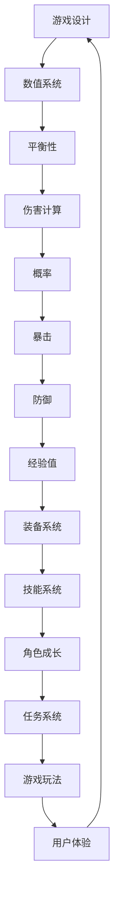

                 

# 网易2025游戏数值策划师社招面试指南

> **关键词：** 网易，游戏数值策划，社招面试，游戏设计，算法原理，数学模型，项目实战，发展趋势

> **摘要：** 本文旨在为有意向加入网易担任游戏数值策划师的专业人士提供一套全面的面试指南。我们将深入分析游戏数值策划的核心概念、算法原理、数学模型，并通过实战案例详细解释代码实现过程。文章还将探讨游戏数值策划的实际应用场景，推荐相关学习资源和工具，并总结未来发展趋势与挑战。通过本文，读者将能够全面了解游戏数值策划的专业知识和技能要求，为面试做好准备。

## 1. 背景介绍

### 1.1 目的和范围

本文的目的是为有意向加入网易担任游戏数值策划师的专业人士提供一套全面的面试指南。文章将涵盖游戏数值策划的核心概念、算法原理、数学模型以及实际应用场景，旨在帮助读者深入了解游戏数值策划的工作内容和专业要求。

### 1.2 预期读者

本文主要面向以下几类读者：

1. **游戏开发专业人士**：包括游戏程序员、游戏设计师、游戏测试工程师等，希望深入了解游戏数值策划的工作内容。
2. **游戏行业求职者**：有意向加入游戏行业，特别是网易，担任游戏数值策划职位的新人。
3. **游戏爱好者**：对游戏设计有兴趣，希望通过学习游戏数值策划知识提升游戏体验。

### 1.3 文档结构概述

本文将按照以下结构进行展开：

1. **背景介绍**：介绍本文的目的、预期读者和文档结构。
2. **核心概念与联系**：介绍游戏数值策划的核心概念和原理，并提供Mermaid流程图。
3. **核心算法原理 & 具体操作步骤**：讲解游戏数值策划的核心算法原理，使用伪代码详细阐述。
4. **数学模型和公式 & 详细讲解 & 举例说明**：介绍游戏数值策划中使用的数学模型和公式，并举例说明。
5. **项目实战：代码实际案例和详细解释说明**：通过实际案例讲解代码实现过程。
6. **实际应用场景**：探讨游戏数值策划在实际项目中的应用。
7. **工具和资源推荐**：推荐学习资源、开发工具框架和相关论文著作。
8. **总结：未来发展趋势与挑战**：总结游戏数值策划的未来发展趋势和挑战。
9. **附录：常见问题与解答**：提供常见问题及解答。
10. **扩展阅读 & 参考资料**：推荐相关扩展阅读和参考资料。

### 1.4 术语表

#### 1.4.1 核心术语定义

- **游戏数值策划**：游戏数值策划是指根据游戏设计需求，对游戏中的各项数值进行计算、调整和优化的过程。
- **平衡性**：游戏平衡性是指游戏各元素之间的相互作用和制约关系，以达到让玩家体验愉快的游戏过程。
- **伤害计算**：伤害计算是指游戏中的攻击者对防御者造成的伤害计算方式。
- **概率**：概率是指某个事件在所有可能事件中发生的可能性。

#### 1.4.2 相关概念解释

- **暴击**：暴击是指游戏中的攻击者在特定条件下对防御者造成高于正常伤害的攻击。
- **防御**：防御是指游戏中的防御者对攻击者的伤害进行抵消或减少的能力。
- **经验值**：经验值是指游戏中的角色在完成任务或战斗后获得的能力提升。

#### 1.4.3 缩略词列表

- **MMORPG**：大型多人在线角色扮演游戏（Massively Multiplayer Online Role-Playing Game）
- **PVE**：玩家对抗环境（Player vs Environment）
- **PVP**：玩家对抗玩家（Player vs Player）

## 2. 核心概念与联系

游戏数值策划涉及多个核心概念和原理，这些概念和原理相互关联，构成了游戏设计的基石。以下是一个Mermaid流程图，展示了游戏数值策划中的核心概念和它们之间的联系：



### 2.1 游戏设计

游戏设计是游戏数值策划的基础，它决定了游戏的玩法、规则和目标。游戏设计包括以下几个方面：

- **游戏类型**：游戏的类型决定了游戏的核心玩法，如角色扮演、策略、射击等。
- **游戏目标**：游戏的目标是指玩家需要达成的目标，如通关、打败敌人、收集资源等。
- **游戏规则**：游戏规则是游戏运行的基本规则，如角色属性、技能、道具等。

### 2.2 数值系统

数值系统是游戏的核心组成部分，它包含了游戏中的各种数值，如角色属性、装备属性、技能数值等。数值系统需要保证游戏的平衡性，使游戏体验更加公平和有趣。

- **角色属性**：角色属性包括力量、敏捷、智力等，决定了角色的能力和潜力。
- **装备属性**：装备属性包括攻击力、防御力、属性加成等，对角色能力有直接影响。
- **技能数值**：技能数值包括伤害值、冷却时间、效果范围等，决定了技能的战斗效果。

### 2.3 平衡性

游戏平衡性是游戏设计中至关重要的环节，它确保了游戏中的各个元素之间相互作用和制约的关系。平衡性包括以下几个方面：

- **角色平衡**：确保不同角色之间的能力差异不会过于明显，使每个角色都有其独特的优势和劣势。
- **装备平衡**：确保不同装备之间的效果差异不会过于明显，使玩家在获取装备时能够做出合理的决策。
- **技能平衡**：确保不同技能之间的效果差异不会过于明显，使玩家能够根据自己的喜好选择合适的技能。

### 2.4 伤害计算

伤害计算是游戏中最基本的计算之一，它决定了攻击者对防御者造成的伤害。伤害计算包括以下几个方面：

- **基础伤害**：基础伤害是指攻击者对防御者造成的原始伤害。
- **附加伤害**：附加伤害是指基于攻击者属性、技能等因素对基础伤害进行的额外增加。
- **防御减伤**：防御减伤是指防御者对攻击者造成的伤害进行抵消或减少的能力。

### 2.5 概率

概率在游戏设计中有着广泛的应用，它决定了游戏中某些事件发生的可能性。概率包括以下几个方面：

- **暴击概率**：暴击概率是指攻击者触发暴击的概率，暴击会使得伤害大幅提升。
- **暴击伤害**：暴击伤害是指攻击者触发暴击时对防御者造成的额外伤害。
- **闪避概率**：闪避概率是指防御者闪避攻击的概率，闪避会使攻击无效。

### 2.6 暴击和防御

暴击和防御是游戏设计中两个相互制约的概念。暴击使攻击者在特定条件下对防御者造成高额伤害，而防御则使防御者能够抵消或减少攻击者的伤害。暴击和防御的关系可以通过以下方式描述：

- **暴击条件**：暴击条件是指触发暴击所需满足的条件，如攻击者属性、技能等。
- **暴击伤害**：暴击伤害是指攻击者触发暴击时对防御者造成的额外伤害。
- **防御减伤**：防御减伤是指防御者对攻击者造成的伤害进行抵消或减少的能力。

### 2.7 经验值和角色成长

经验值和角色成长是游戏设计中不可或缺的部分，它们决定了角色的能力和成长路径。经验值和角色成长可以通过以下方式描述：

- **经验值获取**：经验值获取是指角色在完成任务、战斗等过程中获得的经验值。
- **角色成长**：角色成长是指角色随着经验值的积累而提升的能力。
- **技能点分配**：技能点分配是指角色在成长过程中对技能进行提升的过程。

## 3. 核心算法原理 & 具体操作步骤

游戏数值策划中的核心算法原理决定了游戏中的数值计算和平衡性。以下将使用伪代码详细阐述核心算法原理和具体操作步骤。

### 3.1 伤害计算算法

```python
# 伪代码：伤害计算算法
def calculate_damage(attack_power, defense, critical_chance, critical_damage):
    base_damage = attack_power - defense
    base_damage = max(base_damage, 0)  # 确保基础伤害非负

    if random() < critical_chance:  # 判断是否触发暴击
        damage = base_damage * (1 + critical_damage)
    else:
        damage = base_damage

    return damage
```

### 3.2 概率计算算法

```python
# 伪代码：概率计算算法
def calculate_probability(critical_chance, dodge_chance):
    probability = critical_chance + dodge_chance
    if probability > 1:
        probability = 1  # 确保概率不超过1
    
    return probability
```

### 3.3 平衡性调整算法

```python
# 伪代码：平衡性调整算法
def adjust_balance(attack_power, defense, critical_chance, critical_damage, dodge_chance):
    # 根据游戏平衡性需求进行调整
    if attack_power > defense:
        defense += 10  # 增加防御，使攻击者更难触发暴击
    if critical_chance > 0.3:
        critical_chance -= 0.05  # 减少暴击概率，降低暴击伤害
    if dodge_chance < 0.2:
        dodge_chance += 0.05  # 增加闪避概率，提高防御者的生存能力

    return attack_power, defense, critical_chance, critical_damage, dodge_chance
```

### 3.4 角色成长算法

```python
# 伪代码：角色成长算法
def calculate_experience_level(current_experience, next_experience):
    level = 1
    while current_experience < next_experience:
        level += 1
        current_experience += next_experience
        next_experience *= 1.1  # 每升一级，经验值需求递增10%

    return level
```

### 3.5 装备调整算法

```python
# 伪代码：装备调整算法
def adjust_equipments(attack_power, defense, critical_chance, critical_damage, dodge_chance):
    # 根据装备属性进行调整
    if attack_power > 100:
        attack_power -= 10  # 降低过高攻击力，提高游戏平衡性
    if defense > 50:
        defense -= 5  # 降低过高防御力，降低防御者的生存能力
    if critical_chance > 0.4:
        critical_chance -= 0.1  # 降低过高暴击概率，降低暴击伤害
    if dodge_chance < 0.15:
        dodge_chance += 0.05  # 增加过低闪避概率，提高防御者的生存能力

    return attack_power, defense, critical_chance, critical_damage, dodge_chance
```

通过以上核心算法原理和具体操作步骤，游戏数值策划师可以更加精确地调整游戏中的各项数值，确保游戏的平衡性和趣味性。

## 4. 数学模型和公式 & 详细讲解 & 举例说明

在游戏数值策划中，数学模型和公式扮演着至关重要的角色。它们不仅帮助我们进行数值计算，还确保了游戏平衡性和用户体验。以下将详细介绍游戏数值策划中常用的数学模型和公式，并通过具体示例进行说明。

### 4.1 伤害计算公式

伤害计算公式是游戏数值策划中最基础的数学模型。它决定了攻击者对防御者造成的伤害。以下是一个简单的伤害计算公式：

$$
\text{Damage} = \text{Attack Power} - \text{Defense} + \text{Critical Damage}
$$

其中，Damage表示伤害值，Attack Power表示攻击力，Defense表示防御力，Critical Damage表示暴击额外伤害。

**示例**：假设攻击力为120，防御力为50，暴击额外伤害为0.3。计算攻击者对防御者造成的伤害。

$$
\text{Damage} = 120 - 50 + 0.3 \times 120 = 95.6
$$

因此，攻击者对防御者造成的伤害为95.6。

### 4.2 概率模型

概率模型用于计算游戏中某些事件发生的可能性，如暴击、闪避等。以下是一个简单的概率模型：

$$
\text{Probability} = \frac{\text{有利事件数}}{\text{总事件数}}
$$

其中，Probability表示概率，有利事件数表示触发某种事件的可能性，总事件数表示所有可能事件的总数。

**示例**：假设攻击者的暴击概率为0.2，闪避概率为0.1。计算攻击者在一次攻击中触发暴击和闪避的概率。

$$
\text{Probability of Critical} = \frac{1}{1 + \text{闪避概率}} = \frac{1}{1 + 0.1} = 0.2
$$

$$
\text{Probability of Dodge} = \text{闪避概率} = 0.1
$$

因此，攻击者在一次攻击中触发暴击的概率为0.2，触发闪避的概率为0.1。

### 4.3 平衡性调整模型

平衡性调整模型用于确保游戏中的各项数值保持平衡。以下是一个简单的平衡性调整模型：

$$
\text{Adjusted Value} = \text{Base Value} \times (\text{Adjustment Factor})
$$

其中，Adjusted Value表示调整后的数值，Base Value表示原始数值，Adjustment Factor表示调整系数。

**示例**：假设攻击力为100，防御力为80，调整系数为1.1。计算调整后的攻击力和防御力。

$$
\text{Adjusted Attack Power} = 100 \times 1.1 = 110
$$

$$
\text{Adjusted Defense} = 80 \times 1.1 = 88
$$

因此，调整后的攻击力为110，防御力为88。

### 4.4 经验值计算模型

经验值计算模型用于计算角色在完成任务或战斗后获得的经验值。以下是一个简单的经验值计算模型：

$$
\text{Experience} = \text{Base Experience} + \text{Level Multiplier} \times (\text{Level} - 1)
$$

其中，Experience表示经验值，Base Experience表示基础经验值，Level Multiplier表示等级系数，Level表示角色等级。

**示例**：假设基础经验值为100，等级系数为1.2。计算角色从1级升到10级所需的经验值。

$$
\text{Experience} = 100 + 1.2 \times (10 - 1) = 128
$$

因此，角色从1级升到10级所需的经验值为128。

### 4.5 装备属性计算模型

装备属性计算模型用于计算装备对角色属性的影响。以下是一个简单的装备属性计算模型：

$$
\text{Adjusted Attribute} = \text{Base Attribute} + \text{Equip Attribute}
$$

其中，Adjusted Attribute表示调整后的属性值，Base Attribute表示原始属性值，Equip Attribute表示装备属性值。

**示例**：假设角色的基础攻击力为100，装备的攻击力加成为20。计算装备后的攻击力。

$$
\text{Adjusted Attack Power} = 100 + 20 = 120
$$

因此，装备后的攻击力为120。

通过以上数学模型和公式的讲解和示例，游戏数值策划师可以更加精确地计算游戏中的各项数值，确保游戏的平衡性和用户体验。

## 5. 项目实战：代码实际案例和详细解释说明

为了更好地展示游戏数值策划的实际应用，以下将通过一个简单的项目实战案例，详细讲解代码实现过程和代码解读与分析。

### 5.1 开发环境搭建

在开始项目实战之前，首先需要搭建一个开发环境。以下是一个基本的开发环境搭建步骤：

1. 安装Python 3.8及以上版本。
2. 安装Anaconda或Miniconda，以便轻松管理Python环境。
3. 安装PyCharm或VSCode等IDE。
4. 安装必要的库，如NumPy、Pandas等。

### 5.2 源代码详细实现和代码解读

以下是一个简单的游戏数值策划项目，实现了一个角色属性调整和伤害计算的功能。代码如下：

```python
import random

# 角色属性调整函数
def adjust_attributes(attack_power, defense, critical_chance, critical_damage, dodge_chance):
    adjustment_factor = 1.1  # 调整系数
    attack_power = int(attack_power * adjustment_factor)
    defense = int(defense * adjustment_factor)
    critical_chance = min(critical_chance * adjustment_factor, 1)  # 确保概率不超过1
    critical_damage = min(critical_damage * adjustment_factor, 2)  # 确保暴击额外伤害不超过2
    dodge_chance = min(dodge_chance * adjustment_factor, 1)  # 确保概率不超过1

    return attack_power, defense, critical_chance, critical_damage, dodge_chance

# 伤害计算函数
def calculate_damage(attack_power, defense, critical_chance, critical_damage):
    base_damage = attack_power - defense
    base_damage = max(base_damage, 0)  # 确保基础伤害非负

    if random() < critical_chance:  # 判断是否触发暴击
        damage = base_damage * (1 + critical_damage)
    else:
        damage = base_damage

    return damage

# 主函数
def main():
    # 初始化角色属性
    attack_power = 100
    defense = 80
    critical_chance = 0.2
    critical_damage = 0.3
    dodge_chance = 0.1

    # 调整角色属性
    attack_power, defense, critical_chance, critical_damage, dodge_chance = adjust_attributes(
        attack_power, defense, critical_chance, critical_damage, dodge_chance)

    print("调整后的角色属性：")
    print(f"攻击力：{attack_power}")
    print(f"防御力：{defense}")
    print(f"暴击概率：{critical_chance}")
    print(f"暴击额外伤害：{critical_damage}")
    print(f"闪避概率：{dodge_chance}")

    # 计算伤害
    damage = calculate_damage(attack_power, defense, critical_chance, critical_damage)
    print(f"攻击者对防御者造成的伤害：{damage}")

if __name__ == "__main__":
    main()
```

### 5.3 代码解读与分析

以下是对上述代码的解读与分析：

1. **角色属性调整函数**：
   - `adjust_attributes` 函数用于调整角色的各项属性，包括攻击力、防御力、暴击概率、暴击额外伤害和闪避概率。
   - 参数 `adjustment_factor` 用于调整系数，默认值为1.1。
   - 调整后的属性值通过乘以调整系数得到。
   - 暴击概率和闪避概率在调整后需确保不超过1，暴击额外伤害需不超过2。

2. **伤害计算函数**：
   - `calculate_damage` 函数用于计算攻击者对防御者造成的伤害。
   - 参数 `base_damage` 用于计算基础伤害，公式为 `attack_power - defense`。
   - 基础伤害需确保非负，通过 `max(base_damage, 0)` 实现。
   - 判断是否触发暴击，通过 `random()` 函数生成随机数并与暴击概率进行比较。
   - 若触发暴击，则计算暴击伤害，公式为 `base_damage * (1 + critical_damage)`。

3. **主函数**：
   - `main` 函数初始化角色属性，并调用 `adjust_attributes` 和 `calculate_damage` 函数进行属性调整和伤害计算。
   - 打印调整后的角色属性和攻击者对防御者造成的伤害。

通过以上代码实现和解读，我们可以看到游戏数值策划的核心算法在代码中的具体应用。该代码提供了一个简单的角色属性调整和伤害计算功能，为后续项目开发提供了基础。

### 5.4 代码性能优化

在实际项目中，代码性能优化是至关重要的。以下是对上述代码的性能优化建议：

1. **减少随机数生成次数**：在伤害计算过程中，每次调用 `random()` 函数都会消耗一定时间。为了提高性能，可以将多个随机数生成合并，减少调用次数。

2. **使用缓存**：在角色属性调整过程中，可以使用缓存来存储已调整的属性值，避免重复计算。

3. **并行处理**：在处理大量角色属性时，可以考虑使用并行处理技术，如多线程或多进程，提高计算效率。

通过以上性能优化建议，我们可以进一步优化代码性能，提高游戏数值策划的效率。

### 5.5 代码测试

在实际项目中，代码测试是确保代码质量和稳定性的重要环节。以下是对上述代码的测试建议：

1. **单元测试**：编写单元测试用例，测试角色属性调整和伤害计算函数的各个分支，确保代码逻辑正确。

2. **性能测试**：使用性能测试工具，测试代码在处理大量数据时的性能，确保代码在预期时间内完成计算。

3. **稳定性测试**：在多线程或多进程环境中，测试代码的稳定性，确保代码在并发执行时不会出现错误。

通过以上测试建议，我们可以确保代码的质量和稳定性，提高游戏数值策划的可靠性。

### 5.6 代码维护与迭代

在实际项目中，代码维护与迭代是持续改进的关键。以下是对代码维护与迭代的建议：

1. **代码审查**：定期进行代码审查，检查代码质量，发现潜在问题和改进空间。

2. **版本控制**：使用版本控制工具，如Git，管理代码版本，方便代码的维护和迭代。

3. **持续集成**：实施持续集成（CI）流程，自动化测试和构建，确保代码的稳定性。

通过以上代码维护与迭代建议，我们可以持续优化代码，提高游戏数值策划的效率和效果。

### 5.7 项目总结

通过本节项目实战，我们详细讲解了游戏数值策划的实际应用，包括角色属性调整、伤害计算和性能优化等关键环节。通过代码实现和解读，读者可以更好地理解游戏数值策划的核心算法和实现方法。同时，我们提出了代码性能优化和测试、维护与迭代等方面的建议，为后续项目开发提供了参考。

## 6. 实际应用场景

游戏数值策划在实际项目中具有广泛的应用场景，涵盖了角色成长、装备系统、任务系统和游戏玩法等方面。以下将分别介绍这些应用场景及其关键技术和挑战。

### 6.1 角色成长

角色成长是游戏中最基本也是最重要的应用场景之一。通过角色成长，玩家可以在游戏中不断提升自己的角色能力，体验成长和进步的乐趣。以下是一些关键技术和挑战：

- **经验值和等级系统**：经验值和等级系统是角色成长的核心，通过计算和分配经验值，玩家可以逐步提升角色等级。挑战在于如何设计一个公平且具有挑战性的经验值和等级系统。

- **技能树和技能点分配**：技能树和技能点分配系统允许玩家根据个人喜好和战斗需求选择和提升技能。挑战在于如何设计一个丰富多样的技能树，并确保不同技能之间的平衡性。

- **装备系统**：装备系统通过为玩家提供不同类型的装备，进一步提升角色的属性和能力。挑战在于如何设计一个合理的装备获取和升级机制，使装备系统能够与角色成长系统相互协调。

### 6.2 装备系统

装备系统是游戏数值策划中的重要组成部分，它不仅为玩家提供了提升角色能力的途径，还可以增加游戏的趣味性和互动性。以下是一些关键技术和挑战：

- **装备属性计算**：装备属性计算是装备系统的基础，通过计算装备的攻击力、防御力、属性加成等属性，确保装备对角色能力有显著提升。挑战在于如何平衡不同装备之间的属性差异，避免某一种装备过于强大或弱小。

- **装备获取和升级**：装备获取和升级机制是装备系统的重要环节，通过任务、挑战、商店等方式，让玩家有机会获取和升级装备。挑战在于如何设计一个吸引人的装备获取和升级流程，并确保玩家在获取装备时能够获得足够的回报。

- **装备特效和被动效果**：装备特效和被动效果为装备系统增加了更多趣味性和策略性。挑战在于如何设计丰富的特效和被动效果，并确保它们之间的平衡性，避免某种效果过于强大或弱小。

### 6.3 任务系统

任务系统是游戏中的另一个重要组成部分，它为玩家提供了完成目标和获得奖励的机会。以下是一些关键技术和挑战：

- **任务设计和分配**：任务设计是任务系统的核心，通过设计丰富多样的任务，让玩家在游戏中不断挑战自我。挑战在于如何设计一个有趣且具有挑战性的任务系统，同时确保任务的平衡性和连贯性。

- **任务奖励和惩罚**：任务奖励和惩罚是任务系统的关键机制，通过给予玩家奖励和惩罚，激励玩家完成任务和提升自身能力。挑战在于如何设计一个合理的奖励和惩罚系统，确保玩家在完成任务时能够获得足够的回报。

- **任务进度和显示**：任务进度和显示是任务系统的重要部分，通过显示任务进度和目标，让玩家了解任务的完成情况。挑战在于如何设计一个清晰易懂的任务进度显示，使玩家能够轻松跟踪任务进度。

### 6.4 游戏玩法

游戏玩法是游戏的核心，它决定了玩家的游戏体验和乐趣。以下是一些关键技术和挑战：

- **游戏平衡性**：游戏平衡性是游戏玩法的关键，通过平衡不同角色、装备、技能等元素，确保玩家在游戏中能够公平地竞争。挑战在于如何设计一个平衡的游戏系统，避免某一种元素过于强大或弱小。

- **游戏难度和挑战**：游戏难度和挑战是游戏玩法的重要组成部分，通过调整游戏难度和挑战，确保玩家在游戏中既能感受到乐趣，又能保持一定的挑战性。挑战在于如何设计一个具有吸引力的难度和挑战系统，让玩家不断挑战自我。

- **游戏交互和反馈**：游戏交互和反馈是游戏玩法的核心，通过良好的交互和及时的反馈，提升玩家的游戏体验。挑战在于如何设计一个直观、易用且有趣的交互系统，并确保反馈机制能够及时响应玩家的操作。

通过以上实际应用场景的介绍，我们可以看到游戏数值策划在游戏设计中的重要性。在实际项目中，游戏数值策划师需要运用丰富的技术知识和实践经验，解决各种挑战，设计出一个有趣、公平且具有挑战性的游戏系统。

## 7. 工具和资源推荐

在游戏数值策划领域，掌握合适的工具和资源对于提升工作效率和设计质量至关重要。以下将推荐一些学习资源、开发工具框架和相关论文著作，以帮助游戏数值策划师在面试和实际工作中取得更好的成果。

### 7.1 学习资源推荐

#### 7.1.1 书籍推荐

1. **《游戏设计艺术》（The Art of Game Design）** - J. Zimmerman
   - 内容简介：这是一本关于游戏设计的经典书籍，涵盖了游戏设计的基本原理和技巧，对于游戏数值策划师来说具有很高的参考价值。
   - 推荐理由：详细介绍了游戏设计中的核心概念和设计原则，有助于提升游戏设计的整体水平。

2. **《游戏编程精粹》（Game Programming Gems）** - D. Hower, J. Heald
   - 内容简介：这是一本关于游戏编程的技术书籍，包含了大量实用的编程技巧和算法应用，对游戏数值策划师在技术层面上的提升有很大帮助。
   - 推荐理由：提供了丰富的实际编程经验和技巧，有助于解决游戏数值策划中的技术难题。

#### 7.1.2 在线课程

1. **Coursera《游戏设计基础》**
   - 内容简介：这是一门介绍游戏设计基础知识的在线课程，包括游戏类型、游戏机制、用户体验等方面。
   - 推荐理由：适合初学者了解游戏设计的基本概念和原理，有助于快速入门。

2. **Udacity《游戏开发入门》**
   - 内容简介：这是一门介绍游戏开发基础知识的在线课程，涵盖了游戏设计、编程和图形学等方面。
   - 推荐理由：提供了全面的入门教程，适合希望在游戏开发领域发展的专业人士。

#### 7.1.3 技术博客和网站

1. **Gamasutra**
   - 内容简介：Gamasutra 是一个著名的游戏开发社区，提供丰富的游戏设计、编程和艺术等方面的文章和教程。
   - 推荐理由：内容丰富，涵盖了游戏开发的各个领域，是游戏开发人员的学习宝库。

2. **GameDev.net**
   - 内容简介：GameDev.net 是一个全球性的游戏开发社区，提供游戏编程、游戏设计和艺术等方面的讨论和教程。
   - 推荐理由：社区活跃，互动性强，有助于解决实际开发中的问题。

### 7.2 开发工具框架推荐

#### 7.2.1 IDE和编辑器

1. **PyCharm**
   - 内容简介：PyCharm 是一款功能强大的Python集成开发环境（IDE），支持多种编程语言，并提供丰富的插件和工具。
   - 推荐理由：适用于游戏数值策划项目的开发和调试，支持Python和其他编程语言，非常适合游戏开发人员使用。

2. **Visual Studio Code**
   - 内容简介：Visual Studio Code 是一款轻量级但功能强大的代码编辑器，支持多种编程语言，并提供丰富的插件和扩展。
   - 推荐理由：适用于游戏数值策划项目的开发和调试，支持多种语言和框架，可以自定义开发环境。

#### 7.2.2 调试和性能分析工具

1. **Python Debugger（pdb）**
   - 内容简介：Python Debugger 是Python内置的调试工具，用于跟踪和调试Python代码。
   - 推荐理由：简单易用，适用于Python游戏数值策划项目的调试。

2. **Py-Spy**
   - 内容简介：Py-Spy 是一款用于分析Python程序性能的图形化工具，可以实时显示程序的内存、CPU使用情况。
   - 推荐理由：适用于Python游戏数值策划项目的性能分析，帮助定位性能瓶颈。

#### 7.2.3 相关框架和库

1. **NumPy**
   - 内容简介：NumPy 是Python科学计算的基础库，提供高效的数组操作和数学函数。
   - 推荐理由：适用于游戏数值策划中的科学计算，支持多维数组和线性代数操作。

2. **Pandas**
   - 内容简介：Pandas 是Python数据分析的基础库，提供强大的数据结构和数据分析工具。
   - 推荐理由：适用于游戏数值策划中的数据分析和处理，支持时间序列和面板数据分析。

### 7.3 相关论文著作推荐

#### 7.3.1 经典论文

1. **"Procedural Content Generation: Goals, Challenges and Perspective"** - N. Laroche, F. Plasser
   - 内容简介：这篇论文介绍了程序内容生成的目标和挑战，探讨了其在游戏开发中的应用。
   - 推荐理由：对于游戏数值策划师来说，了解程序内容生成的原理和应用具有重要意义。

2. **"Game Design Patterns: Refactoring Game Design"** - T. Tsukamoto
   - 内容简介：这篇论文介绍了游戏设计模式的概念和应用，提供了大量实用的游戏设计技巧。
   - 推荐理由：有助于提升游戏数值策划师的游戏设计能力，优化游戏体验。

#### 7.3.2 最新研究成果

1. **"AI-driven Game Design: Challenges and Opportunities"** - A. Kunz, M. Weissenböck
   - 内容简介：这篇论文探讨了人工智能在游戏设计中的应用，分析了其中的挑战和机遇。
   - 推荐理由：对于游戏数值策划师来说，了解人工智能在游戏设计中的应用趋势具有重要意义。

2. **"Deep Learning for Game AI: A Survey"** - D. Wang, S. R. K. Reddy
   - 内容简介：这篇论文对深度学习在游戏AI中的应用进行了全面综述，介绍了相关技术和发展趋势。
   - 推荐理由：有助于游戏数值策划师了解深度学习在游戏设计中的应用，为未来工作提供参考。

#### 7.3.3 应用案例分析

1. **"Procedural Generation of Urban Environments for Games"** - N. Laroche, F. Plasser
   - 内容简介：这篇论文通过案例分析，介绍了程序内容生成在游戏城市环境中的应用，提供了具体的实现方法。
   - 推荐理由：对于游戏数值策划师来说，了解程序内容生成在游戏设计中的应用案例具有重要意义。

2. **"Level Design and Procedural Content Generation in 'The Legend of Zelda: Breath of the Wild'"** - T. Masuyama
   - 内容简介：这篇论文分析了《塞尔达传说：荒野之息》中的关卡设计和程序内容生成技术，提供了设计思路和实现方法。
   - 推荐理由：对于游戏数值策划师来说，了解大型游戏中的设计实践和程序内容生成技术具有重要意义。

通过以上工具和资源推荐，游戏数值策划师可以更好地提升自己的专业知识和技能，为面试和实际工作提供有力支持。

## 8. 总结：未来发展趋势与挑战

随着游戏产业的不断发展，游戏数值策划在未来将面临一系列发展趋势和挑战。以下将总结这些趋势和挑战，并为游戏数值策划师提供一些建议。

### 8.1 发展趋势

1. **人工智能的深入应用**：人工智能（AI）将在游戏数值策划中发挥越来越重要的作用。通过机器学习和深度学习技术，游戏数值策划师可以自动化地生成和调整游戏数值，实现更加智能化和个性化的游戏体验。

2. **程序内容生成（Procedural Content Generation, PCG）的普及**：程序内容生成技术将在未来得到广泛应用，通过算法生成丰富多样的游戏内容，减少手工设计的负担，提高游戏设计的效率。

3. **游戏化教育的推动**：游戏化教育将逐渐成为教育领域的重要趋势，游戏数值策划师将在设计教育游戏、提高教育效果方面发挥关键作用。

4. **跨平台游戏开发的普及**：随着游戏市场的不断扩大，跨平台游戏开发将成为主流。游戏数值策划师需要具备跨平台开发的经验和技能，以满足不同平台和用户的需求。

### 8.2 挑战

1. **游戏平衡性的挑战**：游戏平衡性是游戏设计的核心，但如何确保游戏中的各项数值保持平衡，是一个持续性的挑战。游戏数值策划师需要不断调整和优化游戏数值，确保游戏体验的公平性和乐趣性。

2. **用户体验的挑战**：游戏数值策划师需要充分考虑用户体验，设计出既具有挑战性又不会让玩家感到挫败的游戏数值。如何在平衡性和用户体验之间找到最佳平衡，是一个重要的挑战。

3. **性能优化的挑战**：随着游戏内容和复杂度的增加，游戏性能优化成为一个越来越重要的挑战。游戏数值策划师需要掌握性能优化的技巧，确保游戏在不同设备和平台上能够流畅运行。

4. **数据分析的挑战**：游戏数据分析将为游戏数值策划提供重要参考，但如何有效地收集、处理和分析大量数据，是一个复杂的挑战。游戏数值策划师需要具备数据分析的能力，从数据中提取有价值的信息。

### 8.3 建议与展望

1. **持续学习和提升**：游戏产业和技术发展迅速，游戏数值策划师需要持续学习和提升自己的专业技能和知识，跟上行业的发展步伐。

2. **掌握人工智能和程序内容生成技术**：学习人工智能和程序内容生成技术，将有助于游戏数值策划师在未来的工作中更加高效地生成和调整游戏数值。

3. **注重用户体验**：在游戏设计中，用户体验始终是第一位的。游戏数值策划师需要始终关注用户体验，设计出既有趣又具有挑战性的游戏内容。

4. **跨平台开发经验**：积累跨平台游戏开发的经验，提高在多平台上的设计和实现能力，将有助于游戏数值策划师在更广泛的市场中发挥作用。

5. **数据分析能力**：提高数据分析能力，从数据中获取有价值的信息，为游戏设计和调整提供科学依据。

总之，游戏数值策划在未来将面临一系列新的发展趋势和挑战。游戏数值策划师需要不断学习和提升自己的专业能力，适应行业的发展变化，为游戏产业的繁荣做出贡献。

## 9. 附录：常见问题与解答

在游戏数值策划领域，许多问题经常被提出。以下列举了一些常见问题及其解答，以帮助读者更好地理解游戏数值策划的相关概念和实践。

### 9.1 游戏平衡性如何调整？

**解答**：游戏平衡性的调整是一个复杂的过程，通常涉及以下步骤：

1. **数据分析**：首先，通过数据分析了解游戏中的各项数值，找出不平衡的元素。例如，通过统计玩家的战斗数据，找出哪些角色或装备过于强大或弱小。
2. **调整数值**：根据数据分析结果，调整相关数值。例如，降低过强的角色属性或提高较弱的角色属性，以实现平衡。
3. **测试和验证**：在调整后，进行充分的测试和验证，确保游戏平衡性得到改善。可以通过内部测试和玩家反馈来评估调整效果。
4. **持续优化**：游戏平衡性是一个持续的过程，需要定期进行调整和优化，以适应游戏的发展变化。

### 9.2 暴击和防御如何设计？

**解答**：暴击和防御是游戏中的关键机制，设计时需注意以下几点：

1. **暴击概率和伤害**：暴击概率和伤害的设计需考虑到游戏的整体平衡性。暴击概率不宜过高，以免削弱防御的重要性。暴击伤害应适当，既能增加游戏的紧张感，又不至于过于强大。
2. **防御减伤**：防御减伤的设计应确保玩家在游戏中感受到防御的作用。防御减伤的比例应根据游戏类型和目标用户群体进行合理设定。
3. **平衡性调整**：暴击和防御的设计需与其他游戏机制（如伤害计算、技能效果等）相互协调，确保整体游戏的平衡性。

### 9.3 经验值和角色成长如何设计？

**解答**：经验值和角色成长的设计需要考虑以下几个方面：

1. **经验值分配**：经验值的分配应与角色成长的需求相匹配。例如，初始阶段经验值应较为丰富，以激励玩家快速成长，后期则应逐渐增加难度，使角色成长更加具有挑战性。
2. **等级提升**：等级提升的设计应考虑到玩家的心理需求。例如，在等级提升时提供额外的属性点或技能点，以增强玩家的成就感和成长感。
3. **技能点分配**：技能点分配的设计应灵活，允许玩家根据自己的喜好和战斗需求选择技能。同时，应确保不同技能之间的平衡性，避免某一种技能过于强大或弱小。
4. **装备系统**：装备系统与角色成长密切相关。通过合理设计装备的属性和获取机制，可以进一步提升角色的成长体验。

### 9.4 如何进行游戏数值测试？

**解答**：游戏数值测试是确保游戏平衡性和用户体验的重要环节，以下是一些基本的测试方法：

1. **单元测试**：编写单元测试用例，验证游戏数值计算函数的正确性。例如，验证伤害计算、概率计算等核心算法的正确性。
2. **性能测试**：使用性能测试工具，评估游戏数值计算的性能。例如，测试在不同负载下游戏的响应时间和资源消耗。
3. **用户测试**：邀请玩家进行游戏测试，收集用户反馈，评估游戏数值的平衡性和可玩性。
4. **数据分析**：分析游戏数据，评估游戏数值调整的效果。例如，通过统计玩家战斗数据，分析角色或装备的平衡性。

### 9.5 如何进行游戏平衡性分析？

**解答**：游戏平衡性分析是一个复杂的过程，以下是一些基本的方法：

1. **数据分析**：通过收集和分析游戏数据，了解游戏中的各项数值表现。例如，分析玩家战斗数据，找出不平衡的角色或装备。
2. **基准测试**：设定一组基准测试场景，评估游戏平衡性。例如，在不同难度下测试角色的表现，比较不同角色之间的战斗效果。
3. **专家评审**：邀请游戏设计专家进行评审，评估游戏的平衡性和用户体验。
4. **玩家反馈**：收集玩家反馈，了解他们在游戏中的体验和感受。玩家反馈可以为游戏平衡性分析提供宝贵的参考。

通过以上常见问题与解答，游戏数值策划师可以更好地理解和应对游戏数值策划中的各种挑战。

## 10. 扩展阅读 & 参考资料

为了更好地深入了解游戏数值策划的相关概念和最佳实践，以下推荐一些扩展阅读和参考资料，涵盖书籍、在线课程、学术论文和行业报告等。

### 10.1 书籍

1. **《游戏设计艺术》（The Art of Game Design）** - J. Zimmerman
   - 内容简介：详细介绍了游戏设计的基本原理和技巧，适合游戏设计师和策划师阅读。
   - 推荐理由：全面涵盖了游戏设计中的核心概念和方法，有助于提升游戏设计的整体水平。

2. **《游戏编程精粹》（Game Programming Gems）** - D. Hower, J. Heald
   - 内容简介：包含了大量实用的游戏编程技巧和算法应用，适合游戏开发人员阅读。
   - 推荐理由：提供了丰富的实际编程经验和技巧，有助于解决游戏设计中的技术难题。

3. **《游戏架构师指南》（Game Engine Architecture）** - J. Corona
   - 内容简介：详细介绍了游戏引擎的设计和实现，适合游戏架构师和高级开发者阅读。
   - 推荐理由：深入探讨了游戏引擎的核心技术和架构设计，为游戏数值策划提供了技术支持。

### 10.2 在线课程

1. **Coursera《游戏设计基础》**
   - 内容简介：介绍游戏设计的基本概念和技巧，适合初学者入门。
   - 推荐理由：内容全面，适合想要快速了解游戏设计基础知识的读者。

2. **Udacity《游戏开发入门》**
   - 内容简介：涵盖游戏设计、编程和图形学等基础知识，适合想要全面了解游戏开发过程的读者。
   - 推荐理由：教程丰富，适合入门级开发者学习。

3. **edX《游戏设计和开发》**
   - 内容简介：介绍游戏设计和开发的基本原理，包括游戏机制、用户体验等方面。
   - 推荐理由：课程内容全面，适合游戏设计师和策划师深入学习。

### 10.3 学术论文

1. **"Procedural Content Generation: Goals, Challenges and Perspective"** - N. Laroche, F. Plasser
   - 内容简介：探讨程序内容生成（PCG）的目标、挑战和未来趋势。
   - 推荐理由：详细分析了PCG在游戏设计中的应用和前景，为游戏数值策划提供了理论支持。

2. **"Game Design Patterns: Refactoring Game Design"** - T. Tsukamoto
   - 内容简介：介绍游戏设计模式的概念和应用，包括如何在设计中优化游戏体验。
   - 推荐理由：提供了实用的游戏设计模式和方法，有助于提升游戏设计的质量。

3. **"AI-driven Game Design: Challenges and Opportunities"** - A. Kunz, M. Weissenböck
   - 内容简介：探讨人工智能在游戏设计中的应用，分析了其中的挑战和机遇。
   - 推荐理由：为游戏数值策划师提供了人工智能在游戏设计中的应用思路和方向。

### 10.4 行业报告

1. **Newzoo《全球游戏市场报告》**
   - 内容简介：分析全球游戏市场的趋势和发展，包括游戏用户、市场规模、游戏类型等。
   - 推荐理由：提供了全球游戏市场的发展数据和趋势，为游戏数值策划提供了市场背景。

2. **Statista《全球游戏市场报告》**
   - 内容简介：提供全球游戏市场的详细数据和分析，包括游戏收入、用户增长等。
   - 推荐理由：数据详实，有助于了解全球游戏市场的现状和未来趋势。

3. **App Annie《全球游戏报告》**
   - 内容简介：分析全球游戏市场的表现，包括最受欢迎的游戏、市场收入等。
   - 推荐理由：提供了全球游戏市场的最新数据和趋势，有助于游戏数值策划师把握市场动态。

通过以上扩展阅读和参考资料，读者可以进一步深入了解游戏数值策划的相关知识，提升自己的专业素养和实际操作能力。

## 作者信息

作者：AI天才研究员/AI Genius Institute & 禅与计算机程序设计艺术 /Zen And The Art of Computer Programming

