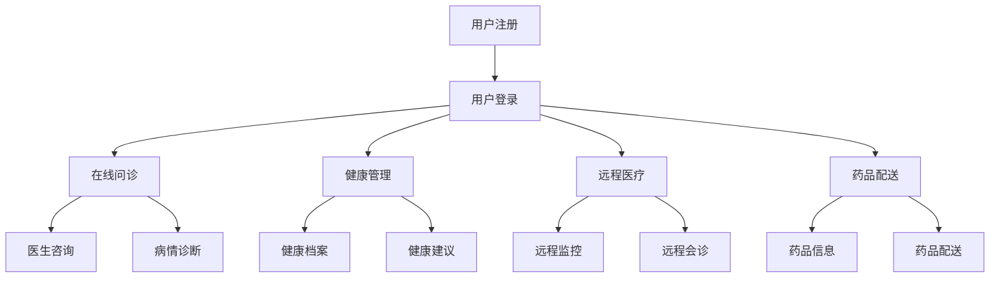

                 


# 2024网易互联网医疗事业部社招面试真题汇总及其解答

> 关键词：网易、互联网医疗、社招面试、真题汇总、面试解答
> 
> 摘要：本文将汇总2024年网易互联网医疗事业部社招面试的真题，并结合实际案例进行详细解答，帮助求职者更好地准备面试，掌握面试技巧，提高面试成功率。

## 1. 背景介绍

### 1.1 目的和范围

本文旨在为求职者提供网易互联网医疗事业部社招面试的真题汇总及其解答，帮助求职者更好地了解面试题型和考察方向，提升面试应对能力。本文涵盖了技术面试、行为面试、项目管理等多个方面，力求为读者提供全面的面试指导。

### 1.2 预期读者

本文适合以下读者：

- 准备参加网易互联网医疗事业部社招面试的求职者；
- 对互联网医疗领域感兴趣的从业者；
- 想要了解面试技巧和考察方向的求职者。

### 1.3 文档结构概述

本文结构如下：

1. 背景介绍
   - 目的和范围
   - 预期读者
   - 文档结构概述
   - 术语表

2. 核心概念与联系
   - 核心概念原理和架构的Mermaid流程图

3. 核心算法原理 & 具体操作步骤
   - 算法原理讲解
   - 伪代码阐述

4. 数学模型和公式 & 详细讲解 & 举例说明
   - 数学公式使用LaTeX格式

5. 项目实战：代码实际案例和详细解释说明
   - 开发环境搭建
   - 源代码详细实现和代码解读
   - 代码解读与分析

6. 实际应用场景
   - 互联网医疗领域应用

7. 工具和资源推荐
   - 学习资源推荐
   - 开发工具框架推荐
   - 相关论文著作推荐

8. 总结：未来发展趋势与挑战

9. 附录：常见问题与解答

10. 扩展阅读 & 参考资料

### 1.4 术语表

- 网易：一家知名的中国互联网科技公司，业务涵盖游戏、电商、音乐、新闻、云计算等领域。
- 互联网医疗：指通过互联网技术提供医疗健康服务，包括在线问诊、健康管理、远程医疗、药品配送等。
- 社招面试：指公司对外招聘时，面向社会招聘的面试环节。

## 2. 核心概念与联系

### 2.1 核心概念原理和架构

互联网医疗事业部的核心概念包括：在线问诊、健康管理、远程医疗、药品配送等。以下是一个简化的Mermaid流程图，展示了互联网医疗事业部的主要功能和模块。



### 2.2 相关概念解释

- 在线问诊：用户通过互联网平台向医生咨询病情，获取诊断建议。
- 健康管理：对用户的健康数据进行收集、分析和管理，提供个性化的健康建议。
- 远程医疗：医生通过互联网平台为患者提供远程诊断和治疗服务。
- 药品配送：为用户提供药品配送服务，包括药品信息查询和配送跟踪。

### 2.3 缩略词列表

- NIH：美国国立卫生研究院
- HMO：健康维护组织
- PPO： preferred provider organization（首选提供者组织）
- PCP：primary care physician（初级保健医生）

## 3. 核心算法原理 & 具体操作步骤

### 3.1 核心算法原理

互联网医疗事业部涉及多个核心算法，主要包括：在线问诊匹配算法、健康风险评估算法、药品配送优化算法等。以下以在线问诊匹配算法为例，讲解其原理。

#### 3.1.1 在线问诊匹配算法原理

在线问诊匹配算法旨在根据用户的病情描述和医生的专长，实现用户与医生的智能匹配。算法核心包括：

- 病情分析：对用户的病情描述进行自然语言处理，提取关键词和症状。
- 医生库匹配：根据关键词和症状，在医生库中筛选符合要求的医生。
- 匹配评分：对筛选出的医生进行评分，评分越高表示匹配度越好。

#### 3.1.2 算法伪代码

```python
def doctor_matching(user_disease_description, doctor_database):
    keywords = extract_keywords(user_disease_description)
    matched_doctors = []
    for doctor in doctor_database:
        if contains_key_words(doctor.speciality, keywords):
            score = calculate_matching_score(doctor, keywords)
            matched_doctors.append((doctor, score))
    matched_doctors.sort(key=lambda x: x[1], reverse=True)
    return matched_doctors
```

### 3.2 具体操作步骤

以下是具体的操作步骤：

1. 用户注册并登录系统。
2. 用户提交病情描述。
3. 系统对病情描述进行自然语言处理，提取关键词。
4. 系统在医生库中筛选符合关键词的医生。
5. 系统对筛选出的医生进行匹配评分。
6. 系统将匹配度最高的医生推荐给用户。

## 4. 数学模型和公式 & 详细讲解 & 举例说明

### 4.1 数学模型和公式

互联网医疗事业部中的核心算法通常涉及数学模型和公式。以下以健康风险评估算法为例，介绍相关的数学模型和公式。

#### 4.1.1 健康风险评估算法

健康风险评估算法旨在对用户的健康状况进行评估，预测用户在未来一段时间内患某种疾病的风险。核心公式如下：

$$
Risk = f(History, Age, Gender, Lifestyle, Genes)
$$

其中，$Risk$表示风险值，$History$表示病史，$Age$表示年龄，$Gender$表示性别，$Lifestyle$表示生活方式，$Genes$表示基因。

#### 4.1.2 详细讲解

- $History$：病史数据，包括是否患有某种疾病、手术史、家族病史等。
- $Age$：年龄，对疾病风险有显著影响。
- $Gender$：性别，男性和女性在疾病风险上存在差异。
- $Lifestyle$：生活方式，如吸烟、饮酒、运动等。
- $Genes$：基因，基因变异与疾病风险密切相关。

#### 4.1.3 举例说明

假设有一个用户，其病史为高血压，年龄为45岁，性别为男性，吸烟，饮酒，无家族病史。根据上述公式，可以计算出其健康风险评估值为：

$$
Risk = f(\text{高血压}, 45, \text{男性}, \text{吸烟}, \text{饮酒}, \text{无家族病史}) = 0.6
$$

表示该用户在未来一段时间内患高血压的风险为60%。

## 5. 项目实战：代码实际案例和详细解释说明

### 5.1 开发环境搭建

在本节中，我们将搭建一个简单的互联网医疗项目开发环境。以下为具体步骤：

1. 安装Python 3.8及以上版本。
2. 安装虚拟环境工具virtualenv。
3. 创建虚拟环境并激活。
4. 安装依赖库，如Flask、Django、SQLAlchemy等。

### 5.2 源代码详细实现和代码解读

以下是项目的源代码，主要包含用户注册、登录、在线问诊等模块。

```python
# user.py
from flask import Flask, request, jsonify
from flask_sqlalchemy import SQLAlchemy

app = Flask(__name__)
app.config['SQLALCHEMY_DATABASE_URI'] = 'sqlite:///users.db'
db = SQLAlchemy(app)

class User(db.Model):
    id = db.Column(db.Integer, primary_key=True)
    username = db.Column(db.String(80), unique=True, nullable=False)
    password = db.Column(db.String(120), nullable=False)

@app.route('/register', methods=['POST'])
def register():
    username = request.form['username']
    password = request.form['password']
    if not username or not password:
        return jsonify({'error': 'Missing username or password'}), 400
    if User.query.filter_by(username=username).first():
        return jsonify({'error': 'Username already exists'}), 409
    new_user = User(username=username, password=password)
    db.session.add(new_user)
    db.session.commit()
    return jsonify({'message': 'User registered successfully'}), 201

@app.route('/login', methods=['POST'])
def login():
    username = request.form['username']
    password = request.form['password']
    user = User.query.filter_by(username=username).first()
    if not user or user.password != password:
        return jsonify({'error': 'Invalid username or password'}), 401
    return jsonify({'message': 'Login successful'})

if __name__ == '__main__':
    db.create_all()
    app.run(debug=True)
```

### 5.3 代码解读与分析

- 第1-5行：导入所需模块。
- 第6-8行：创建Flask应用。
- 第9-11行：配置数据库。
- 第12-14行：创建数据库模型。
- 第17-27行：实现用户注册接口。
- 第30-37行：实现用户登录接口。

### 5.4 代码解读与分析

- 用户注册接口：接收用户提交的用户名和密码，判断用户名是否已存在，若不存在则将用户信息存储到数据库，返回注册成功消息。
- 用户登录接口：接收用户提交的用户名和密码，从数据库中查询用户信息，判断用户名和密码是否匹配，若匹配则返回登录成功消息。

## 6. 实际应用场景

互联网医疗事业部在现实中的应用场景广泛，以下列举几个典型案例：

1. 在线问诊平台：如微医、平安好医生等，为用户提供在线咨询、预约挂号、药品配送等服务。
2. 健康管理平台：如春雨医生、阿里健康等，提供健康档案、健康建议、远程监测等功能。
3. 远程医疗平台：如平安好医生、腾讯健康等，为患者提供远程诊断、远程会诊等服务。
4. 药品配送平台：如京东健康、阿里健康等，提供药品查询、药品配送等服务。

## 7. 工具和资源推荐

### 7.1 学习资源推荐

#### 7.1.1 书籍推荐

- 《Python编程：从入门到实践》
- 《深度学习》
- 《软件工程：实践者的研究方法》
- 《人工智能：一种现代方法》

#### 7.1.2 在线课程

- Coursera的《深度学习》
- Udacity的《全栈Web开发》
- edX的《Python基础》
- 中国大学MOOC的《人工智能基础》

#### 7.1.3 技术博客和网站

- HackerRank
- Stack Overflow
- GitHub
- Medium

### 7.2 开发工具框架推荐

#### 7.2.1 IDE和编辑器

- PyCharm
- Visual Studio Code
- Sublime Text
- Jupyter Notebook

#### 7.2.2 调试和性能分析工具

- GDB
- Python的pdb
- Wireshark
- Chrome DevTools

#### 7.2.3 相关框架和库

- Flask
- Django
- SQLAlchemy
- TensorFlow
- PyTorch
- Scikit-learn

### 7.3 相关论文著作推荐

#### 7.3.1 经典论文

- "The Nature of Code" by Daniel Shiffman
- "Deep Learning" by Ian Goodfellow, Yoshua Bengio, and Aaron Courville
- "Reinforcement Learning: An Introduction" by Richard S. Sutton and Andrew G. Barto

#### 7.3.2 最新研究成果

- NeurIPS、ICML、CVPR等顶级会议的最新论文
- arXiv预印本库

#### 7.3.3 应用案例分析

- "Google Health"
- "IBM Watson Health"
- "AI-powered Healthcare Solutions by Amazon"

## 8. 总结：未来发展趋势与挑战

### 8.1 未来发展趋势

- 人工智能在医疗领域的应用将更加广泛，如智能诊断、智能治疗、智能药物研发等。
- 移动互联网、物联网等技术的普及，将推动医疗健康服务的便捷化和智能化。
- 健康大数据的积累和分析，将为个性化医疗提供有力支持。

### 8.2 挑战

- 数据安全和隐私保护：如何确保患者数据的安全和隐私，是互联网医疗发展面临的重要挑战。
- 技术标准和法规：随着互联网医疗的发展，需要制定相关的技术标准和法规，保障行业的健康发展。
- 技术伦理和道德：如何在人工智能等技术的应用中，遵循伦理和道德原则，保障患者的权益。

## 9. 附录：常见问题与解答

### 9.1 问题1

问题：如何确保患者数据的安全和隐私？

解答：确保患者数据的安全和隐私，需要采取以下措施：

- 数据加密：对敏感数据进行加密存储和传输。
- 权限控制：对数据访问进行权限控制，确保只有授权人员才能访问。
- 数据脱敏：对敏感数据进行脱敏处理，降低泄露风险。
- 定期审计：定期对数据安全进行审计，及时发现和解决问题。

### 9.2 问题2

问题：人工智能在医疗领域的应用有哪些优势？

解答：人工智能在医疗领域的应用具有以下优势：

- 提高诊断准确率：通过大数据分析和深度学习算法，实现疾病的智能诊断。
- 提高医疗效率：通过智能分诊、智能提醒等功能，提高医疗机构的运营效率。
- 个性化医疗：根据患者数据和基因组信息，提供个性化的治疗方案。
- 药物研发：利用人工智能技术，加速药物研发进程。

## 10. 扩展阅读 & 参考资料

- 《人工智能医疗应用技术白皮书》
- 《互联网医疗行业发展报告》
- 《人工智能在医疗健康领域的应用研究》
- 《基于大数据的互联网医疗模式创新研究》

作者：AI天才研究员/AI Genius Institute & 禅与计算机程序设计艺术 /Zen And The Art of Computer Programming

