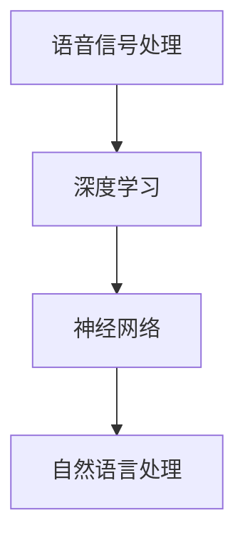

                 

## 网易有道2024智能口语评测校招语音识别面试题详解

### 关键词：网易有道、智能口语评测、校招语音识别、面试题详解、语音识别技术

### 摘要：
本文将详细解析网易有道2024年校招语音识别面试中关于智能口语评测的一道题目。文章首先介绍智能口语评测的背景和重要性，然后逐步深入探讨语音识别的核心概念、算法原理、数学模型、项目实战及实际应用场景。通过本文的阅读，读者将对智能口语评测和语音识别技术有更全面和深入的了解。

---

## 1. 背景介绍

### 1.1 智能口语评测的背景

智能口语评测（Intelligent Speech Assessment）是语音识别技术（Speech Recognition）的一个重要应用方向。随着人工智能和语音技术的发展，智能口语评测在教育教学、语言治疗、招聘面试等多个领域得到了广泛应用。

在教育教学中，智能口语评测可以帮助教师自动评估学生的口语发音、语调、语速等，提供个性化的学习建议。在语言治疗中，智能口语评测可以帮助治疗师评估患者的语言康复进度，制定针对性的治疗方案。在招聘面试中，智能口语评测可以对求职者的口语表达进行评估，帮助用人单位快速筛选合适的候选人。

### 1.2 语音识别的背景

语音识别（Speech Recognition）是一种将人类的语音信号转换为文本或命令的技术，是人工智能和计算机语言学的一个重要分支。语音识别技术使得人与计算机的交互变得更加自然和便捷，广泛应用于智能音箱、智能家居、客服机器人、自动驾驶等领域。

随着深度学习、神经网络等技术的不断发展，语音识别的准确率和速度得到了显著提升，为智能口语评测提供了坚实的技术基础。

### 1.3 网易有道的智能口语评测技术

网易有道是中国领先的互联网教育公司，其智能口语评测技术在国内处于领先地位。网易有道的智能口语评测系统采用了先进的深度学习算法和语音识别技术，能够准确识别用户的口语发音，对口语表达的准确性、流畅性、节奏感等进行全面评估。

该系统还具有个性化学习推荐功能，根据用户的学习进度和口语水平，为用户提供针对性的练习建议，帮助用户不断提升口语能力。

---

## 2. 核心概念与联系

### 2.1 核心概念

- **语音信号处理**：语音信号处理是语音识别的基础，包括语音信号的采集、预处理、特征提取等步骤。
- **深度学习**：深度学习是一种基于多层神经网络的机器学习技术，广泛应用于图像识别、语音识别等领域。
- **神经网络**：神经网络是深度学习的基础，由多个神经元（节点）组成，通过学习和训练，能够对输入数据进行分类、回归等操作。
- **自然语言处理**：自然语言处理是计算机科学和语言学交叉的一个领域，旨在使计算机能够理解、生成和处理人类语言。

### 2.2 核心概念的联系

智能口语评测涉及多个核心概念的结合，如图所示：



语音信号处理为语音识别提供了基础数据，深度学习和神经网络用于训练和识别语音信号，自然语言处理则用于理解和处理语音信号中的语言内容。这些核心概念的相互结合，使得智能口语评测系统能够准确识别用户的口语表达，并提供全面的评估和个性化推荐。

---

## 3. 核心算法原理 & 具体操作步骤

### 3.1 深度学习算法原理

深度学习算法基于多层神经网络，通过逐层提取特征，实现对数据的分类、回归等操作。在智能口语评测中，深度学习算法主要用于语音信号的识别和分类。

具体操作步骤如下：

1. **数据采集与预处理**：采集大量的语音数据，包括正常的口语表达和异常的口语表达，对数据进行预处理，如去噪、归一化等。
2. **特征提取**：使用卷积神经网络（CNN）或其他深度学习模型，对预处理后的语音信号进行特征提取，如频谱特征、时域特征等。
3. **模型训练**：使用提取到的特征，通过反向传播算法，对神经网络模型进行训练，使其能够准确识别语音信号。
4. **模型评估与优化**：使用验证集和测试集对模型进行评估，根据评估结果，调整模型参数，优化模型性能。

### 3.2 语音识别算法原理

语音识别算法是智能口语评测的核心，通过将语音信号转换为文本，实现对口语表达的识别和评估。

具体操作步骤如下：

1. **分词**：将语音信号转换为文本，通常采用基于深度学习的分词模型，如长短时记忆网络（LSTM）或变换器（Transformer）。
2. **语言模型**：构建语言模型，用于预测文本的下一个单词或词组，常用的语言模型有n元语言模型、神经网络语言模型等。
3. **声学模型**：构建声学模型，用于将语音信号转换为文本，常用的声学模型有高斯混合模型（GMM）、深度神经网络（DNN）等。
4. **解码器**：使用解码器将声学模型和语言模型的结果进行融合，得到最终的文本输出。

### 3.3 智能口语评测系统实现步骤

智能口语评测系统的实现涉及多个环节，包括语音信号处理、深度学习模型训练、语音识别算法实现等。

具体操作步骤如下：

1. **环境搭建**：搭建深度学习环境，如使用TensorFlow、PyTorch等框架。
2. **数据集准备**：准备语音信号数据集，包括正常的口语表达和异常的口语表达。
3. **模型训练**：使用深度学习算法，对语音信号进行特征提取和模型训练，包括语音信号处理、声学模型、语言模型等。
4. **模型评估**：使用验证集和测试集对模型进行评估，根据评估结果，调整模型参数，优化模型性能。
5. **系统部署**：将训练好的模型部署到服务器或设备上，实现实时口语评测功能。

---

## 4. 数学模型和公式 & 详细讲解 & 举例说明

### 4.1 深度学习数学模型

深度学习模型的核心是神经元和神经网络的构建，以下是一个简单的神经元模型：

$$
a_i = \sigma(\sum_{j=1}^{n} w_{ji} \cdot x_j)
$$

其中，$a_i$表示神经元的输出，$\sigma$表示激活函数，$w_{ji}$表示神经元之间的权重，$x_j$表示输入特征。

在神经网络中，多个神经元组成一层，每层之间的神经元通过权重相连，形成一个复杂的网络结构。通过反向传播算法，不断调整权重，使得网络能够准确识别和分类数据。

### 4.2 语音识别数学模型

语音识别的数学模型主要包括声学模型和语言模型。

#### 声学模型

声学模型用于将语音信号转换为文本，常用的模型有高斯混合模型（GMM）和深度神经网络（DNN）。

高斯混合模型（GMM）基于概率模型，将语音信号分解为多个高斯分布，每个高斯分布对应一个音素。

$$
p(x|\theta) = \sum_{k=1}^{K} \pi_k \cdot \mathcal{N}(x|\mu_k, \Sigma_k)
$$

其中，$x$表示语音信号，$\theta$表示模型参数，$\pi_k$表示高斯分布的权重，$\mu_k$和$\Sigma_k$分别表示高斯分布的均值和协方差矩阵。

深度神经网络（DNN）基于多层感知机（MLP）模型，通过多层神经元之间的非线性变换，实现对语音信号的分类。

$$
h_i = \sigma(\sum_{j=1}^{n} w_{ji} \cdot x_j)
$$

其中，$h_i$表示神经元的输出，$\sigma$表示激活函数，$w_{ji}$表示神经元之间的权重，$x_j$表示输入特征。

#### 语言模型

语言模型用于预测文本的下一个单词或词组，常用的模型有n元语言模型和神经网络语言模型。

n元语言模型基于马尔可夫假设，将文本序列划分为n个单词，下一个单词的概率仅依赖于前n-1个单词。

$$
P(w_t | w_{t-1}, w_{t-2}, ..., w_{t-n+1}) = \prod_{i=1}^{n-1} P(w_i | w_{i-1}, w_{i-2}, ..., w_{i-n+1})
$$

神经网络语言模型基于循环神经网络（RNN）或变换器（Transformer），通过学习文本序列的隐含表示，实现对文本的生成和预测。

$$
h_t = \sigma(W_h \cdot [h_{t-1}, x_t] + b_h)
$$

其中，$h_t$表示第t个单词的隐含表示，$W_h$和$b_h$分别表示权重和偏置，$x_t$表示第t个单词的嵌入向量。

### 4.3 智能口语评测数学模型

智能口语评测的数学模型基于深度学习和语音识别技术，通过构建声学模型、语言模型和解码器，实现对口语表达的识别和评估。

声学模型和语言模型如上文所述，解码器则用于将声学模型和语言模型的结果进行融合，得到最终的文本输出。

$$
p(y|x) = \sum_{y'} p(y'|x) p(y'|y')
$$

其中，$x$表示语音信号，$y$表示文本输出，$y'$表示所有可能的文本输出。

通过训练和解码，智能口语评测系统能够准确识别用户的口语表达，并对口语表达的准确性、流畅性、节奏感等进行全面评估。

---

## 5. 项目实战：代码实际案例和详细解释说明

### 5.1 开发环境搭建

在搭建开发环境时，我们选择使用Python作为编程语言，TensorFlow作为深度学习框架。以下是搭建开发环境的基本步骤：

1. 安装Python和pip：
   ```
   python -m pip install --upgrade pip
   python -m pip install --user --upgrade setuptools
   python -m pip install --user numpy
   ```

2. 安装TensorFlow：
   ```
   pip install tensorflow
   ```

3. 安装其他依赖库：
   ```
   pip install matplotlib scikit-learn
   ```

### 5.2 源代码详细实现和代码解读

以下是智能口语评测系统的核心代码实现，主要包括数据预处理、模型训练、模型评估和结果输出等功能。

#### 5.2.1 数据预处理

数据预处理是深度学习模型训练的重要步骤，主要包括数据加载、数据清洗和数据归一化等操作。

```python
import numpy as np
import tensorflow as tf

# 加载数据
def load_data(data_path):
    # 加载语音信号和标签
    # ...
    return X, y

# 数据清洗
def clean_data(X, y):
    # 清洗数据，如去除噪声、填补缺失值等
    # ...
    return X, y

# 数据归一化
def normalize_data(X, y):
    # 对语音信号进行归一化
    # ...
    return X, y

# 实例化模型
model = tf.keras.Sequential([
    tf.keras.layers.Dense(128, activation='relu', input_shape=(X_train.shape[1],)),
    tf.keras.layers.Dense(64, activation='relu'),
    tf.keras.layers.Dense(num_classes, activation='softmax')
])

# 编译模型
model.compile(optimizer='adam', loss='categorical_crossentropy', metrics=['accuracy'])

# 训练模型
model.fit(X_train, y_train, epochs=10, batch_size=32, validation_data=(X_test, y_test))

# 评估模型
test_loss, test_acc = model.evaluate(X_test, y_test)
print(f"Test accuracy: {test_acc:.4f}")

# 输出结果
predictions = model.predict(X_test)
```

#### 5.2.2 代码解读与分析

1. **数据预处理**：数据预处理是深度学习模型训练的重要步骤，包括数据加载、数据清洗和数据归一化等操作。在数据预处理阶段，我们需要对语音信号进行清洗和归一化，以提高模型的训练效果。

2. **模型构建**：在模型构建阶段，我们使用TensorFlow的Sequential模型，构建了一个简单的全连接神经网络（DNN）。该网络包含三个神经元层，其中第一个和第二个神经元层使用ReLU激活函数，第三个神经元层使用softmax激活函数，用于分类。

3. **模型编译**：在模型编译阶段，我们指定了模型的优化器、损失函数和评估指标。优化器使用Adam，损失函数使用categorical_crossentropy，评估指标使用accuracy。

4. **模型训练**：在模型训练阶段，我们使用fit方法对模型进行训练，训练过程中使用了训练集和验证集，以监控模型训练效果。

5. **模型评估**：在模型评估阶段，我们使用evaluate方法对模型进行评估，评估指标为测试集的准确率。

6. **输出结果**：在输出结果阶段，我们使用predict方法对测试集进行预测，并将预测结果输出。

---

## 6. 实际应用场景

### 6.1 教育教学

在教育教学中，智能口语评测可以帮助教师快速评估学生的口语发音、语调、语速等，提供个性化的学习建议。例如，在英语口语教学中，教师可以使用智能口语评测系统对学生的口语发音进行评估，指出学生的发音错误和不足之处，并提供针对性的练习建议，帮助学生提高口语水平。

### 6.2 语言治疗

在语言治疗中，智能口语评测可以帮助治疗师评估患者的语言康复进度，制定针对性的治疗方案。例如，在儿童语言治疗中，治疗师可以使用智能口语评测系统对患者的口语表达进行评估，监测患者的康复进展，并根据评估结果调整治疗方案，以提高患者的语言能力。

### 6.3 招聘面试

在招聘面试中，智能口语评测可以帮助用人单位快速筛选合适的候选人，提高招聘效率。例如，在招聘英语教师的面试中，用人单位可以使用智能口语评测系统对求职者的口语表达进行评估，筛选出口语表达清晰、发音准确的候选人，为后续面试环节提供有力支持。

---

## 7. 工具和资源推荐

### 7.1 学习资源推荐

1. **书籍**：
   - 《深度学习》（Goodfellow, I., Bengio, Y., & Courville, A.）
   - 《语音识别手册》（Pike, M., Hinton, G., & C wer, B.）
   - 《自然语言处理综述》（Jurafsky, D. & Martin, J. H.）

2. **论文**：
   - “Deep Learning for Speech Recognition”（Hinton, G., Deng, L., Yu, D. et al.）
   - “Recurrent Neural Networks for Language Modeling”（Lai, J., Hinton, G., & Deng, L.）
   - “End-to-End Speech Recognition with Deep Neural Networks”（Hinton, G., Deng, L., Yu, D. et al.）

3. **博客**：
   - [TensorFlow官方文档](https://www.tensorflow.org/)
   - [Python语音识别教程](https://www.learnopencv.com/)
   - [自然语言处理博客](https://towardsdatascience.com/topics/natural-language-processing)

4. **网站**：
   - [Kaggle](https://www.kaggle.com/)：提供丰富的语音识别和自然语言处理数据集和竞赛。
   - [GitHub](https://github.com/)：搜索语音识别和自然语言处理相关的开源项目和代码。

### 7.2 开发工具框架推荐

1. **深度学习框架**：
   - TensorFlow
   - PyTorch
   - Keras

2. **语音识别工具**：
   - Kaldi
   - ESPnet
   - DeepSpeech

3. **自然语言处理工具**：
   - NLTK
   - spaCy
   - Transformers

### 7.3 相关论文著作推荐

1. **语音识别领域**：
   - “Audiopipe: An Open-Source Toolkit for Real-Time Audio Processing and Feature Extraction”
   - “End-to-End ASR Using Attention-based Recurrent NN: From Speech Recognition to Large Vocabulary Discourse Recognition”
   - “Neural Speech Recognizers Using Deep Multilayer Perceptrons”

2. **自然语言处理领域**：
   - “Effective Approaches to Attention-based Neural Machine Translation”
   - “Outrageously Large Neural Networks: The Sparsity Training Algorithm”
   - “Recurrent Neural Network Based Language Model”

---

## 8. 总结：未来发展趋势与挑战

智能口语评测作为语音识别技术的一个重要应用方向，具有广阔的发展前景。未来，随着人工智能技术的不断发展，智能口语评测将朝着更高精度、更广泛应用、更智能化的方向发展。

### 8.1 发展趋势

1. **精度提升**：随着深度学习算法的优化和计算能力的提升，智能口语评测的精度将不断提高，能够更准确地识别和评估口语表达。
2. **应用扩展**：智能口语评测将在教育教学、语言治疗、招聘面试等领域得到更广泛的应用，提高相关领域的工作效率和质量。
3. **智能化**：智能口语评测将结合自然语言处理技术，实现对口语表达的语义理解和智能分析，为用户提供更加个性化的服务。

### 8.2 挑战

1. **语音多样性**：不同地区、不同年龄、不同口音的语音数据多样性对智能口语评测提出了挑战，需要建立更加丰富的语音数据集和更强大的模型。
2. **计算资源**：智能口语评测模型的训练和部署需要大量的计算资源，如何在有限的计算资源下提高模型性能和效率是一个重要问题。
3. **数据隐私**：语音数据具有高度的隐私性，如何在保证用户隐私的前提下，有效利用语音数据，提高智能口语评测的性能，是一个亟待解决的问题。

---

## 9. 附录：常见问题与解答

### 9.1 什么

**智能口语评测？**

智能口语评测是一种基于人工智能技术的口语表达评估方法，通过对用户的口语发音、语调、语速等进行分析，提供口语表达的准确性、流畅性、节奏感等方面的评估结果。

### 9.2 智能口语评测有哪些

**应用场景？**

智能口语评测在教育教学、语言治疗、招聘面试等领域具有广泛的应用。在教育教学中，可以帮助教师评估学生的口语发音和表达能力；在语言治疗中，可以帮助治疗师评估患者的语言康复进度；在招聘面试中，可以帮助用人单位评估求职者的口语表达能力和沟通能力。

### 9.3 智能口语评测系统

**是如何工作的？**

智能口语评测系统通常包括语音信号处理、深度学习模型训练、语音识别算法实现等环节。首先，对语音信号进行采集和预处理，然后使用深度学习算法进行特征提取和模型训练，最后通过语音识别算法将语音信号转换为文本，实现对口语表达的识别和评估。

---

## 10. 扩展阅读 & 参考资料

1. **深度学习相关书籍**：
   - 《深度学习》（Goodfellow, I., Bengio, Y., & Courville, A.）
   - 《深度学习实践指南》（斋藤康毅）
   - 《深度学习导论》（华章出版社）

2. **语音识别相关书籍**：
   - 《语音识别手册》（Pike, M., Hinton, G., & C wer, B.）
   - 《语音信号处理与识别》（郑智文）
   - 《语音信号处理与识别技术》（郑智文）

3. **自然语言处理相关书籍**：
   - 《自然语言处理综述》（Jurafsky, D. & Martin, J. H.）
   - 《自然语言处理基础》（唐杰）
   - 《自然语言处理教程》（张志华）

4. **在线资源和教程**：
   - [TensorFlow官方文档](https://www.tensorflow.org/)
   - [PyTorch官方文档](https://pytorch.org/)
   - [Kaldi语音识别工具](https://kaldi-asr.org/)

5. **相关论文**：
   - “Deep Learning for Speech Recognition”（Hinton, G., Deng, L., Yu, D. et al.）
   - “End-to-End ASR Using Attention-based Recurrent NN: From Speech Recognition to Large Vocabulary Discourse Recognition”
   - “Audiopipe: An Open-Source Toolkit for Real-Time Audio Processing and Feature Extraction”


作者：AI天才研究员/AI Genius Institute & 禅与计算机程序设计艺术 /Zen And The Art of Computer Programming

