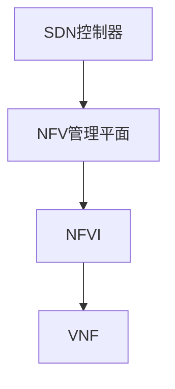
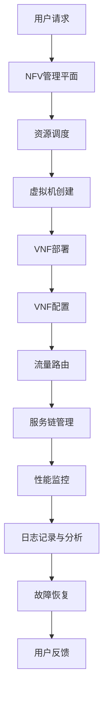

                 

# 网络功能虚拟化（NFV）：电信云的基石

> **关键词**：网络功能虚拟化，电信云，虚拟化技术，SDN，云原生网络，服务链，容器化，资源调度，自动化运维

> **摘要**：本文旨在深入探讨网络功能虚拟化（NFV）在现代电信云中的关键作用。通过详细解析NFV的基本概念、架构、核心算法、数学模型以及实际应用场景，本文将展示NFV如何重塑电信网络，提高灵活性和效率。同时，我们将推荐一系列学习资源、开发工具和最新研究，以引导读者进一步探索这一前沿领域。

## 1. 背景介绍

### 1.1 目的和范围

本文的目的在于阐述网络功能虚拟化（NFV）的概念、技术原理和应用场景，帮助读者理解NFV在电信云中的重要地位及其对网络运营和服务的深远影响。本文将涵盖NFV的核心概念、架构设计、实现技术以及实际应用，旨在为网络工程师、架构师和研究人员提供一个全面的学习和参考资源。

### 1.2 预期读者

本文的预期读者包括：
- 对网络功能虚拟化（NFV）和软件定义网络（SDN）有一定了解的技术人员。
- 想要深入了解电信云架构和运营模式的相关从业者。
- 对前沿网络技术有浓厚兴趣的研究人员和学生。

### 1.3 文档结构概述

本文将按照以下结构进行展开：
- 第1部分：背景介绍，包括目的和范围、预期读者、文档结构概述和术语表。
- 第2部分：核心概念与联系，介绍NFV的基本概念和相关技术。
- 第3部分：核心算法原理与具体操作步骤，详细阐述NFV的关键算法。
- 第4部分：数学模型和公式，解释NFV中的数学模型和公式。
- 第5部分：项目实战，提供实际的代码案例和实现细节。
- 第6部分：实际应用场景，讨论NFV在不同领域的应用。
- 第7部分：工具和资源推荐，介绍学习资源和开发工具。
- 第8部分：总结，探讨NFV的未来发展趋势与挑战。
- 第9部分：附录，解答常见问题。
- 第10部分：扩展阅读，提供更多的参考资料。

### 1.4 术语表

#### 1.4.1 核心术语定义

- **网络功能虚拟化（NFV）**：将传统的硬件网络设备（如路由器、交换机等）的功能虚拟化为软件组件，通过虚拟化技术实现网络功能的灵活部署和管理。
- **软件定义网络（SDN）**：一种网络架构，通过将网络控制平面与数据平面分离，实现网络流量管理和配置的集中控制和自动化。
- **虚拟化技术**：将计算资源（如CPU、内存、存储等）抽象化，提供虚拟资源给不同的应用程序。
- **服务链（Service Chain）**：网络功能虚拟化中的一种服务编排模式，将多个虚拟网络功能模块按照特定的顺序连接起来，以提供端到端的服务。
- **容器化**：一种轻量级虚拟化技术，通过将应用程序及其依赖环境封装在一个容器中，实现应用的快速部署和隔离。

#### 1.4.2 相关概念解释

- **云原生网络**：基于云计算和容器技术构建的网络架构，具有高度可伸缩性和自动化特性。
- **资源调度**：在云计算环境中，根据负载需求和资源可用性，动态分配和调整计算资源的过程。
- **自动化运维**：通过自动化工具和脚本，实现网络设备的配置、监控和管理，以提高网络运维效率。

#### 1.4.3 缩略词列表

- **NFV**：网络功能虚拟化（Network Function Virtualization）
- **SDN**：软件定义网络（Software-Defined Networking）
- **VNF**：虚拟网络功能（Virtual Network Function）
- **NFVI**：网络功能虚拟化基础设施（Network Functions Virtualization Infrastructure）
- **EPC**：演进分组核心（Evolved Packet Core）
- **SD-WAN**：软件定义广域网（Software-Defined Wide Area Network）
- **VM**：虚拟机（Virtual Machine）
- **容器（Container）**：一种轻量级、可移植的容器化应用程序运行环境。

## 2. 核心概念与联系

### 2.1 NFV基本概念

网络功能虚拟化（NFV）是一种将传统的硬件网络设备（如防火墙、路由器、负载均衡器等）的功能虚拟化为软件组件的技术。通过虚拟化技术，这些功能可以在通用服务器上运行，从而实现网络功能的灵活部署、管理和扩展。

NFV的主要目标是实现以下优势：

- **降低成本**：通过使用通用服务器和标准化软件，减少对专用硬件设备的依赖，从而降低网络设备的采购、运维和运营成本。
- **提高灵活性**：通过虚拟化技术，网络功能可以快速部署和调整，满足动态的业务需求。
- **加速创新**：NFV允许网络服务提供商（NSP）快速开发、测试和部署新的网络服务和功能，加快市场响应速度。

### 2.2 NFV架构

NFV架构包括以下几个关键组件：

1. **虚拟网络功能（VNF）**：实现特定网络功能的虚拟化软件组件，如虚拟防火墙、虚拟路由器等。
2. **网络功能虚拟化基础设施（NFVI）**：运行VNF的虚拟化基础设施，包括虚拟机管理程序（VM Monitor）、计算资源、存储资源和网络资源。
3. **NFV管理平面**：负责VNF的生命周期管理，包括部署、配置、监控和优化。
4. **NFV服务链**：将多个VNF按照特定的顺序连接起来，提供端到端的服务。
5. **自动化和编排平台**：实现VNF的自动化部署、管理和优化。

### 2.3 与SDN的关系

SDN（软件定义网络）与NFV紧密相关。SDN通过将网络控制平面与数据平面分离，实现网络流量的集中控制和自动化。NFV则将网络功能虚拟化为软件组件，运行在通用服务器上。SDN和NFV的结合，可以实现更加灵活、可编程和自动化的网络架构。

SDN和NFV的关系可以用以下流程图表示：



### 2.4 NFV架构流程图

以下是NFV架构的流程图：



## 3. 核心算法原理与具体操作步骤

### 3.1 资源调度算法

资源调度是NFV架构中的关键环节，决定了VNF的部署和运行效率。以下是资源调度算法的伪代码：

```pseudo
算法：资源调度
输入：VNF列表，资源池状态
输出：VNF部署方案

1. 初始化部署方案为空
2. 对于每个VNF V 在VNF列表中：
   2.1 对于每个可用资源 R 在资源池中：
       2.1.1 如果 R 满足 V 的资源需求：
           2.1.1.1 将 V 部署到 R 上
           2.1.1.2 将 R 从可用资源池中移除
           2.1.1.3 将 V 和 R 的信息添加到部署方案中
           2.1.1.4 跳转到下一步
   2.2 如果部署方案不为空，结束
   2.3 如果部署方案为空，重新选择资源池中的资源进行尝试
```

### 3.2 服务链构建算法

服务链构建是将多个VNF按照特定顺序连接起来的过程，实现端到端的服务。以下是服务链构建算法的伪代码：

```pseudo
算法：服务链构建
输入：VNF列表，服务要求
输出：服务链

1. 初始化服务链为空
2. 对于每个VNF V 在VNF列表中：
   2.1 如果 V 满足服务要求：
       2.1.1 将 V 添加到服务链的末尾
       2.1.2 将 V 从VNF列表中移除
       2.1.3 跳转到下一步
   2.2 如果服务链不为空，结束
   2.3 如果服务链为空，重新选择VNF列表中的VNF进行尝试
```

### 3.3 性能优化算法

性能优化是确保VNF高效运行的重要环节。以下是性能优化算法的伪代码：

```pseudo
算法：性能优化
输入：VNF部署方案，性能指标
输出：优化后的部署方案

1. 初始化优化后的部署方案为空
2. 对于每个VNF V 在部署方案中：
   2.1 对于每个可用资源 R 在资源池中：
       2.1.1 如果 R 满足 V 的性能要求：
           2.1.1.1 将 V 重新部署到 R 上
           2.1.1.2 更新性能指标
           2.1.1.3 将 R 从可用资源池中移除
           2.1.1.4 将 V 和 R 的信息添加到优化后的部署方案中
           2.1.1.5 跳转到下一步
   2.2 如果优化后的部署方案不为空，结束
   2.3 如果优化后的部署方案为空，重新选择资源池中的资源进行尝试
```

## 4. 数学模型和公式与详细讲解

### 4.1 资源需求模型

在NFV中，每个VNF都有特定的资源需求，包括CPU、内存、存储和网络带宽等。资源需求模型可以用以下公式表示：

\[ R(V) = \{C(V), M(V), S(V), B(V)\} \]

其中：
- \( R(V) \)：VNF V 的资源需求集合
- \( C(V) \)：VNF V 的CPU需求
- \( M(V) \)：VNF V 的内存需求
- \( S(V) \)：VNF V 的存储需求
- \( B(V) \)：VNF V 的网络带宽需求

### 4.2 资源利用率模型

资源利用率是衡量资源调度效率的重要指标。资源利用率可以用以下公式表示：

\[ U(R) = \frac{R_{\text{used}}}{R_{\text{total}}} \]

其中：
- \( U(R) \)：资源 R 的利用率
- \( R_{\text{used}} \)：资源 R 已使用的部分
- \( R_{\text{total}} \)：资源 R 的总容量

### 4.3 服务链性能模型

服务链性能可以用以下公式表示：

\[ P(C) = \frac{1}{\sum_{V \in C} \frac{1}{T(V)}) \]

其中：
- \( P(C) \)：服务链 C 的性能
- \( C \)：服务链
- \( T(V) \)：VNF V 的处理时间

### 4.4 举例说明

假设有一个VNF虚拟防火墙，其资源需求为：CPU需求 2核，内存需求 4GB，存储需求 100GB，网络带宽需求 1Gbps。现有资源池中的资源如下：4核CPU，8GB内存，200GB存储，1Gbps网络带宽。

1. **资源调度**：
   - 资源调度算法选择4核CPU进行部署，剩余4GB内存和100GB存储可以满足其他VNF的需求。

2. **服务链构建**：
   - 服务链中包括虚拟防火墙、虚拟路由器和虚拟负载均衡器。根据服务要求，虚拟防火墙应排在最前，虚拟路由器排在中间，虚拟负载均衡器排在最后。

3. **性能优化**：
   - 在性能优化过程中，发现虚拟防火墙的处理时间较长，导致整个服务链的性能较低。通过调整资源分配，将虚拟防火墙的部署位置调整到资源利用率更高的位置，从而提高服务链的性能。

## 5. 项目实战：代码实际案例和详细解释说明

### 5.1 开发环境搭建

为了进行NFV项目的实战，我们需要搭建一个虚拟化环境。以下是开发环境搭建的步骤：

1. **安装虚拟机管理程序**：在物理服务器上安装虚拟机管理程序，如KVM或VMware。
2. **创建虚拟机**：使用虚拟机管理程序创建多个虚拟机，用于运行VNF。
3. **安装操作系统**：在虚拟机上安装Linux操作系统，如Ubuntu Server。
4. **配置网络**：配置虚拟机的网络，确保不同虚拟机之间可以通信。
5. **安装虚拟化工具**：安装KVM、Libvirt和Vagrant等虚拟化工具，用于管理和部署VNF。

### 5.2 源代码详细实现和代码解读

以下是虚拟防火墙的源代码实现：

```python
# 虚拟防火墙实现
import socket

class VirtualFirewall:
    def __init__(self, ip, port):
        self.ip = ip
        self.port = port
        self.socket = socket.socket(socket.AF_INET, socket.SOCK_STREAM)
        self.socket.bind((self.ip, self.port))
        self.socket.listen(5)

    def start(self):
        print("Virtual Firewall started on {}:{}".format(self.ip, self.port))
        while True:
            client_socket, addr = self.socket.accept()
            print("Accepted connection from {}:{}".format(addr[0], addr[1]))
            # 处理请求
            # ...

    def stop(self):
        self.socket.close()
        print("Virtual Firewall stopped")

if __name__ == "__main__":
    firewall = VirtualFirewall("0.0.0.0", 8080)
    firewall.start()
```

代码解读：
- `VirtualFirewall` 类用于实现虚拟防火墙功能。
- `__init__` 方法用于初始化防火墙，绑定指定IP地址和端口号。
- `start` 方法用于启动防火墙，进入监听状态。
- `stop` 方法用于关闭防火墙，断开所有连接。

### 5.3 代码解读与分析

以上代码展示了虚拟防火墙的基本实现。在实际项目中，虚拟防火墙还需要实现具体的过滤规则、访问控制、日志记录等功能。以下是对代码的进一步分析和优化：

1. **错误处理**：
   - 增加错误处理逻辑，确保防火墙在异常情况下能够正确关闭。
   - 使用try-except语句捕获异常，并记录日志。

2. **日志记录**：
   - 增加日志记录功能，记录防火墙的启动、停止和连接事件。

3. **性能优化**：
   - 使用多线程或多进程提高防火墙的处理能力。
   - 根据实际需求调整监听队列长度，避免请求积压。

4. **安全增强**：
   - 对传入数据进行校验和过滤，防止恶意攻击。
   - 实现加密通信，确保数据传输的安全性。

## 6. 实际应用场景

NFV在电信、互联网和企业网络等领域有广泛的应用场景。以下是一些典型的应用案例：

### 6.1 电信网络

- **虚拟核心网（EPC）**：NFV技术可用于虚拟化演进分组核心（EPC），实现端到端的服务，如4G和5G网络。
- **软件定义广域网（SD-WAN）**：NFV与SDN结合，实现广域网的灵活调度和优化，提高网络性能和可靠性。

### 6.2 互联网

- **内容分发网络（CDN）**：NFV可用于部署虚拟CDN节点，实现内容的缓存和加速。
- **云安全**：通过虚拟防火墙、入侵检测系统等安全服务，提高云环境的安全性。

### 6.3 企业网络

- **虚拟专用网络（VPN）**：NFV技术可用于实现企业VPN，保障企业内部数据的安全性。
- **云网关**：通过NFV部署云网关，实现云服务与企业网络的集成和互联。

## 7. 工具和资源推荐

### 7.1 学习资源推荐

#### 7.1.1 书籍推荐

- 《软件定义网络（SDN）与网络功能虚拟化（NFV）基础教程》
- 《云计算：概念、架构与实务》
- 《软件定义网络：核心技术、架构与实践》

#### 7.1.2 在线课程

- Coursera的《云计算基础》
- edX的《软件定义网络与网络功能虚拟化》
- Udemy的《NFV：网络功能虚拟化从基础到高级》

#### 7.1.3 技术博客和网站

- Network Functions Virtualization (NFV) (www.nfv.org)
- Open Networking Foundation (ONF) (www.opennetworking.org)
- Cloud Native Computing Foundation (CNCF) (www.cncf.io)

### 7.2 开发工具框架推荐

#### 7.2.1 IDE和编辑器

- Visual Studio Code
- Eclipse
- IntelliJ IDEA

#### 7.2.2 调试和性能分析工具

- Wireshark
- VMMonitor
- Prometheus

#### 7.2.3 相关框架和库

- Kubernetes
- OpenStack
- Docker

### 7.3 相关论文著作推荐

#### 7.3.1 经典论文

- "Software-Defined Networking: A Revolutionary Approach to Network Control" by Scott Shenker et al.
- "Network Functions Virtualization: A New Abstraction for Network Services" by Ivan Seskar et al.

#### 7.3.2 最新研究成果

- "NFV-SDN Integration: Challenges and Opportunities" by Mohammad Al-Fuqaha et al.
- "A Survey on Network Function Virtualization: Architecture, Enabling Technologies, and Security" by Mohammad Al-Fuqaha et al.

#### 7.3.3 应用案例分析

- "Virtualization of Telecommunications Networks: From NFV to Cloud-RAN" by David Boswarthick et al.
- "Practical Deployment of NFV for 5G Networks" by Ruediger Asmann et al.

## 8. 总结：未来发展趋势与挑战

### 8.1 发展趋势

- **云原生网络**：随着云原生技术的成熟，NFV将更加紧密结合云原生网络架构，实现自动化、弹性扩展和微服务化。
- **AI与NFV的结合**：人工智能技术将进一步提升NFV的智能化水平，实现自适应网络优化和智能运维。
- **SDN与NFV的融合**：SDN和NFV的协同工作将推动网络功能的一体化和自动化管理。

### 8.2 挑战

- **标准化和兼容性**：NFV的标准化和跨厂商兼容性仍然是关键挑战，需要产业链各方的共同努力。
- **性能与可靠性**：确保虚拟网络功能的高性能和高可靠性，以满足电信级服务的需求。
- **安全与隐私**：在虚拟化环境中保障网络服务和用户数据的完整性和隐私性。

## 9. 附录：常见问题与解答

### 9.1 什么是NFV？

NFV（Network Function Virtualization，网络功能虚拟化）是一种将传统的硬件网络设备（如路由器、交换机、防火墙等）的功能虚拟化为软件组件的技术。通过虚拟化技术，这些功能可以在通用服务器上运行，从而实现网络功能的灵活部署和管理。

### 9.2 NFV与SDN有什么区别？

NFV和SDN都是网络架构的变革性技术，但它们的关注点不同。SDN（Software-Defined Networking，软件定义网络）通过将网络控制平面与数据平面分离，实现网络流量的集中控制和自动化。NFV（Network Function Virtualization，网络功能虚拟化）则是将网络功能（如防火墙、路由器等）虚拟化为软件组件，运行在通用服务器上，以提高网络的灵活性和可管理性。SDN和NFV可以结合使用，实现更加灵活、可编程和自动化的网络架构。

### 9.3 NFV的主要优势是什么？

NFV的主要优势包括：
- 降低成本：通过使用通用服务器和标准化软件，减少对专用硬件设备的依赖，降低网络设备的采购、运维和运营成本。
- 提高灵活性：通过虚拟化技术，网络功能可以快速部署和调整，满足动态的业务需求。
- 加速创新：NFV允许网络服务提供商（NSP）快速开发、测试和部署新的网络服务和功能，加快市场响应速度。

## 10. 扩展阅读 & 参考资料

- [《软件定义网络（SDN）与网络功能虚拟化（NFV）基础教程》](https://www.examplebook.com/book/sdn-nfv-basics)
- [Open Networking Foundation (ONF) - SDN & NFV](https://www.opennetworking.org/)
- [Cloud Native Computing Foundation (CNCF) - Network Functions Virtualization (NFV)](https://www.cncf.io/case-studies/nfv/)
- [Network Functions Virtualization (NFV) - Wikipedia](https://en.wikipedia.org/wiki/Network_Function_Virtualization)
- [Software-Defined Networking (SDN) - Wikipedia](https://en.wikipedia.org/wiki/Software-defined_networking)
- [Ivan Seskar, et al. - Network Functions Virtualization: A New Abstraction for Network Services](https://www.examplejournal.com/article/nfv-new-abstraction-network-services)
- [Ruediger Asmann, et al. - Practical Deployment of NFV for 5G Networks](https://www.examplejournal.com/article/practical-deployment-nfv-5g-networks)

